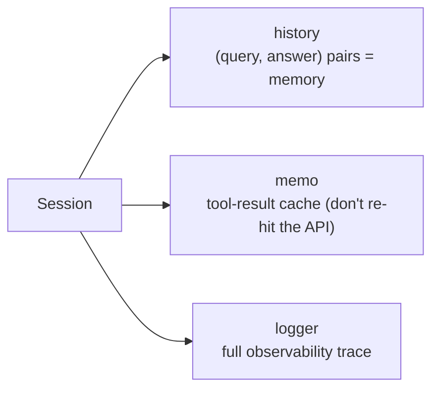
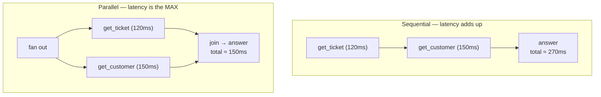
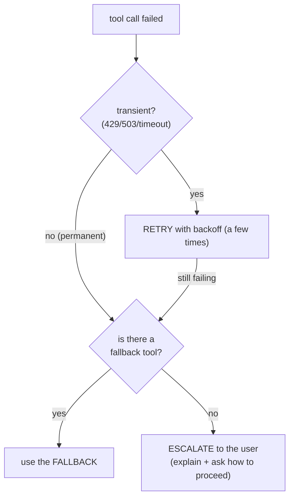

# Design Considerations (Section 3.3)

Talking points for the "design" part of the round. State the tradeoff, then your choice.

---

## 1. State management across conversation turns

An agent turn is stateless in isolation, but a *conversation* isn't. We keep a `Session`
(`src/scratch_agent.py`) that lives across `agent.run()` calls and holds three things:

- **History** gives the brain context for follow-ups ("close *that* one").
- **Memo** is shared across turns, so a repeated `search_tickets("billing")` in turn 3 is
  free if turn 1 already ran it.
- **Where does state live?** In-memory here. In production: a store keyed by
  `conversation_id` (Redis/DB) so any worker can resume a conversation, plus a
  **checkpointer** (LangGraph's `MemorySaver` / a durable saver) to survive restarts and
  enable human-in-the-loop pauses.

**Guardrail:** cap history/memo size (token budget + memory). Summarize or window old turns.

---

## 2. Observability for tool calls

Every tool call is logged with **what was called, with what args, what came back, how long,
and whether it was a cache hit / retry / error** (`src/observability.py`). Print it with
`session.logger.trace()`.

Why it matters:
- **Debugging** — "why did the agent close the wrong ticket?" → read the trace.
- **Cost/latency** — sum `ms`, count calls, spot the slow tool.
- **Safety/audit** — a record of every destructive action and its confirmation.

In production this becomes **structured spans** (OpenTelemetry) or **LangSmith** traces:
one trace per conversation, one span per tool call, tags for `tool`, `status`, `tokens`,
`cache_hit`. Attach the `conversation_id` so you can pull the whole story.

---

## 3. Parallel vs sequential tool calls

Sometimes the brain needs several **independent** facts before answering (e.g. fetch a
ticket's details *and* the customer's plan). Those calls have no ordering dependency, so
you can run them **in parallel**.

| | Sequential | Parallel |
|---|---|---|
| Latency | sum of all calls | max of the calls |
| Use when | later calls **depend on** earlier results (search → then close) | calls are **independent** |
| Cost | same total work | same total work, but watch **rate limits** (N calls at once) |
| Complexity | trivial | need fan-out/fan-in + error aggregation |

**Rules of thumb:**
- **Dependent steps stay sequential** — you can't close a ticket before you've searched for it.
- **Independent reads go parallel** (`asyncio.gather` / a thread pool / LangGraph fan-out).
- Parallel calls hit the **rate limiter harder** — coordinate them through the *same*
  token bucket (see the API Integration tutorial) so a burst doesn't get you throttled.
- Keep a **latency budget**; if a parallel branch is slow, return a partial answer rather
  than blocking the whole response.

---

## 4. Failure policy (Section 3.2, expanded)

When a tool call fails, choose in this order:

Never silently swallow a failure inside an agent loop — either recover, or surface it so
the human (or the next turn) can decide. And **never** auto-retry a *destructive* call
without re-checking the confirmation.
