# 🔌 API Integration — Deep-Dive Tutorial

> **DevRev Technical Round · Section 1.** Pagination, Retries & Backoff, Rate Limiting.
> The prep note is explicit: *be ready to write `fetch_all_pages()`, a token-bucket rate limiter, and a retry-with-backoff wrapper **live** — not just describe them.* This tutorial builds each from scratch with diagrams, then combines them into one robust client.

---

## 0. The Big Picture — Why These Three Always Come Together

Any real integration that pulls data from a third-party API (Salesforce, Jira, Zendesk, DevRev's own APIs) hits the same three walls:

1. **The data doesn't fit in one response** → **pagination**.
2. **The network and server are unreliable** → **retries & backoff**.
3. **The server will throttle you if you go too fast** → **rate limiting**.

A production-grade client wraps all three around every request:

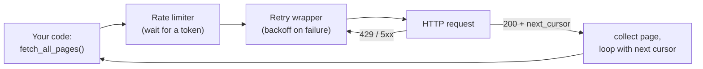

Keep this mental model: **pagination is the outer loop, rate-limiting gates each call, retry wraps each call.**

---

## 1. Pagination

**Goal:** collect *all* records when the API returns them in fixed-size pages.

### 1.1 Offset vs Cursor — the core tradeoff

**Cursor / token pagination** — each response hands you the token for the next page:

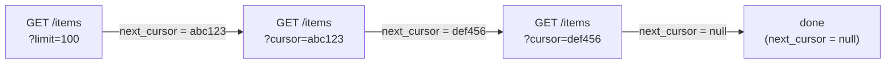

**Offset / page-number pagination** — you compute the next window yourself by skipping N rows:

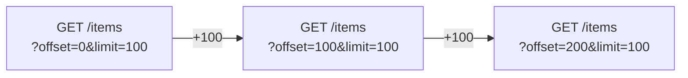

|                                         | **Offset** (`?offset=200`)              | **Cursor** (`?cursor=abc123`)    |
| --------------------------------------- | ----------------------------------------------- | ---------------------------------------- |
| How "where am I" is tracked             | a number (skip N rows)                          | an opaque token pointing at the last row |
| Random access ("jump to page 50")       | ✅ easy                                         | ❌ must walk sequentially                |
| Stable under concurrent inserts/deletes | ❌**no** (see below)                      | ✅ yes                                   |
| Server cost on deep pages               | ❌ expensive (`OFFSET 1000000` scans + skips) | ✅ cheap (indexed seek)                  |
| Total count known up front              | usually yes                                     | usually no                               |

**Interview one-liner:** *"Offset is simpler and allows jumping to any page, but it silently skips or duplicates rows when the underlying data changes during a scan. Cursor pagination is stable and cheap on deep pages, so it's what production APIs standardize on — at the cost of no random access."*

### 1.2 The failure mode of offset pagination

This is the #1 thing they'll probe. **Why does offset break with concurrent inserts/deletes?**

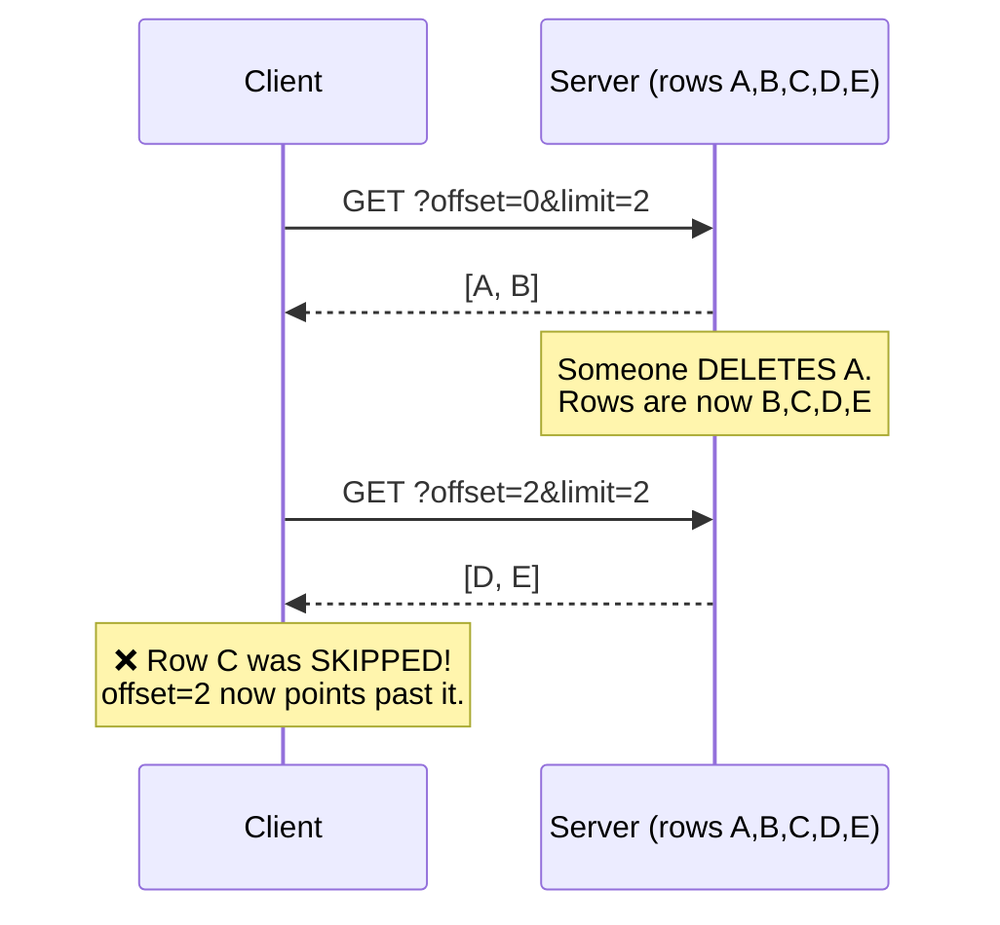

- **Delete before your cursor** → you **skip** rows.
- **Insert before your cursor** → you **see a row twice** (duplicate).

Cursor pagination avoids this because the token means *"give me rows after this specific row"*, not *"skip N rows"* — deletions/insertions elsewhere don't shift it.

### 1.3 `fetch_all_pages()` — cursor version (the one to memorize)

```Python
def fetch_all_pages(fetch_page, start_cursor=None, max_pages=10_000):
    """Loop until there is no next cursor.

    fetch_page(cursor) must return a dict like:
        {"items": [...], "next_cursor": "abc" or None}
    """
    results = []
    cursor = start_cursor
    pages = 0
    while True:
        page = fetch_page(cursor)              # one API call for one page
        results.extend(page["items"])          # collect this page's records
        cursor = page.get("next_cursor")       # advance to the next page
        pages += 1
        if not cursor:                         # None / "" / missing -> we're done
            break
        if pages >= max_pages:                 # safety cap: never loop forever
            raise RuntimeError("pagination exceeded max_pages (possible cursor loop)")
    return results
```

**Edge cases to say out loud:**

- **Empty result set** → first page has `items=[]`, `next_cursor=None` → returns `[]`.
- **Missing/inconsistent `next_cursor`** → treat `None`, `""`, and *absent key* all as "stop" (the `page.get(...)` + `if not cursor` handles all three).
- **Cursor loop / server bug** → the `max_pages` cap prevents an infinite loop.

### 1.4 `fetch_all_pages()` — offset version

```python
def fetch_all_offset(fetch_page, page_size=100, max_pages=10_000):
    """fetch_page(offset, limit) returns a plain list of items (possibly shorter on the last page)."""
    results = []
    offset = 0
    for _ in range(max_pages):
        items = fetch_page(offset, page_size)  # ask for `page_size` rows starting at `offset`
        if not items:                          # empty page -> no more data
            break
        results.extend(items)
        if len(items) < page_size:             # a short page means it was the LAST page
            break
        offset += page_size                    # advance to the next window
    return results
```

**Why the `len(items) < page_size` check?** It saves one wasted "empty" request at the end — the moment a page comes back partial, you know it's the last one.

### 1.5 Handling missing / inconsistent `next page` tokens

Some APIs are messy. Defensive extraction:

```python
def extract_next_cursor(page):
    """APIs disagree on where the cursor lives — normalize them all to one thing."""
    # Try the common shapes, in priority order.
    for path in (("next_cursor",), ("paging", "next"), ("meta", "next_cursor")):
        node = page
        for key in path:
            node = node.get(key) if isinstance(node, dict) else None
            if node is None:
                break
        if node:
            return node
    return None                                 # nothing found -> treat as "last page"
```

---

## 2. Retries & Backoff

**Goal:** survive transient failures without hammering a struggling server.

### 2.1 Which errors do you retry?

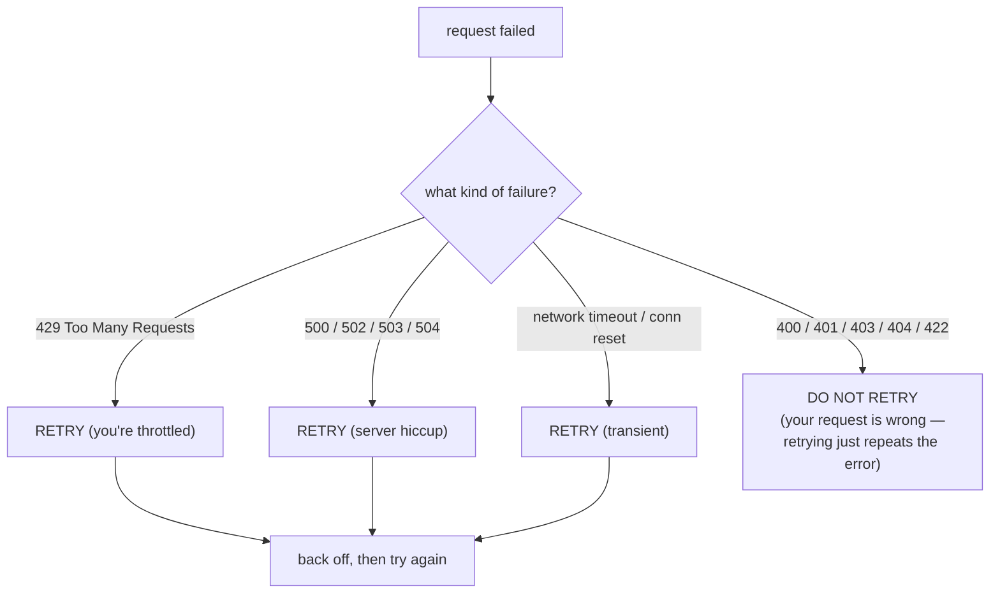

**Rule:** retry **transient** failures (429, 5xx, timeouts). **Never** retry **client errors** (4xx except 429) — a 404 or a malformed 400 will fail identically every time; retrying wastes your budget and can double-charge side effects.

### 2.2 Exponential backoff — the math

Wait longer after each failure so a struggling server can recover:

| Attempt | Base delay =`base × 2^attempt` (base=0.5s) |
| ------- | --------------------------------------------- |
| 1       | 0.5 s                                         |
| 2       | 1.0 s                                         |
| 3       | 2.0 s                                         |
| 4       | 4.0 s                                         |
| 5       | 8.0 s (capped at, say, 30 s)                  |

Two must-have guards:

- **A cap** on the per-attempt delay (don't wait 17 minutes on attempt 12).
- **A total timeout budget** — stop retrying after N seconds of wall-clock, even if attempts remain.

### 2.3 Why jitter matters (the killer follow-up)

Without jitter, many clients that failed at the same instant all wake up and retry at *the same* future instant → a synchronized stampede that knocks the server over again. This is the **thundering herd**.

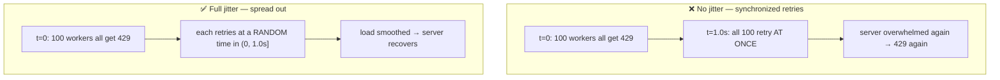

**Full jitter** = sleep a random duration in `[0, base × 2^attempt]` instead of exactly `base × 2^attempt`. It's the AWS-recommended variant and the one to name-drop.

### 2.4 `retry_with_backoff` — the decorator to memorize

```python
import time, random, functools

RETRYABLE_STATUS = {429, 500, 502, 503, 504}   # transient; everything else is fatal

class HTTPError(Exception):
    def __init__(self, status, message=""):
        super().__init__(f"HTTP {status} {message}")
        self.status = status

def retry_with_backoff(max_retries=5, base=0.5, cap=30.0, timeout_budget=60.0):
    """Decorator: retry a function on transient HTTP errors with exponential backoff + full jitter."""
    def decorator(fn):
        @functools.wraps(fn)
        def wrapper(*args, **kwargs):
            start = time.monotonic()            # wall-clock start, for the total budget
            attempt = 0
            while True:
                try:
                    return fn(*args, **kwargs)  # success -> return immediately
                except HTTPError as e:
                    # Fatal error, or out of attempts -> give up and re-raise.
                    if e.status not in RETRYABLE_STATUS or attempt >= max_retries:
                        raise
                    # Exponential backoff, capped, then FULL JITTER.
                    ceiling = min(cap, base * (2 ** attempt))
                    delay = random.uniform(0, ceiling)      # sleep somewhere in (0, ceiling]
                    # Respect the total time budget: don't sleep past it.
                    if time.monotonic() - start + delay > timeout_budget:
                        raise
                    time.sleep(delay)
                    attempt += 1
        return wrapper
    return decorator
```

**Bonus:** honor the server's `Retry-After` header when present — it's authoritative, so use it *instead of* your computed delay.

### 2.5 Idempotency — webhooks that arrive duplicated or out of order

At-least-once delivery means the same webhook can arrive **twice**, and network reordering means an **older** event can arrive **after** a newer one. Blindly applying every event corrupts state.

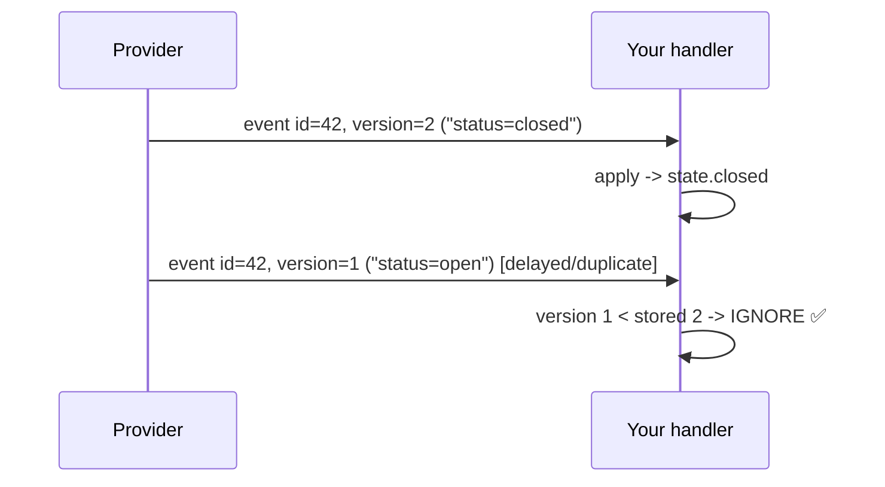

Guard with an idempotency key + a monotonic version/timestamp:

```python
class IdempotentProcessor:
    """Apply each event at most once, and never let a stale event overwrite a newer one."""
    def __init__(self):
        self.applied = {}                       # entity_id -> highest version applied so far

    def process(self, event):
        eid, version = event["id"], event["version"]
        # Skip if we've already applied this version OR a newer one (duplicate or out-of-order).
        if eid in self.applied and self.applied[eid] >= version:
            return "skipped"
        self.applied[eid] = version             # record the new high-water mark
        # ... apply the actual state change here ...
        return "applied"
```

**Key ideas to state:** (1) an **idempotency key** makes re-processing safe; (2) a **version/timestamp** makes ordering safe; (3) store the "high-water mark" so stale events are dropped.

---

## 3. Rate Limiting

**Goal:** never exceed the server's requests-per-window ceiling, while still allowing short bursts.

### 3.1 Token Bucket — the algorithm to implement from scratch

**Mental model:** a bucket holds up to `capacity` tokens. Tokens **refill at a steady rate**. Each request **spends one token**. If the bucket is empty, you wait. This naturally allows a **burst** (up to `capacity`) but enforces the average `rate` over time.

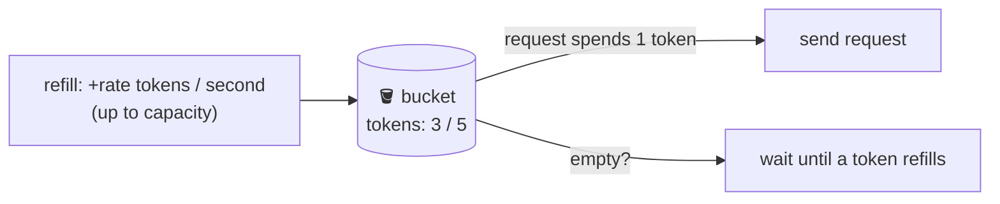

```python
import time, threading

class TokenBucket:
    def __init__(self, rate, capacity):
        self.rate = rate                        # tokens added per second (the average limit)
        self.capacity = capacity                # max tokens = max burst size
        self.tokens = float(capacity)           # start full
        self.last = time.monotonic()            # when we last refilled
        self.lock = threading.Lock()            # make it safe across threads (see 3.3)

    def _refill(self):
        now = time.monotonic()
        elapsed = now - self.last               # seconds since last refill
        self.tokens = min(self.capacity, self.tokens + elapsed * self.rate)  # add, but cap
        self.last = now

    def try_acquire(self, n=1):
        """Non-blocking: return True if n tokens were available and spent, else False."""
        with self.lock:
            self._refill()
            if self.tokens >= n:
                self.tokens -= n
                return True
            return False

    def acquire(self, n=1):
        """Blocking: wait until n tokens are available, then spend them."""
        while True:
            with self.lock:
                self._refill()
                if self.tokens >= n:
                    self.tokens -= n
                    return
                missing = n - self.tokens        # how many more tokens we need
                wait = missing / self.rate       # how long until they refill
            time.sleep(wait)                     # sleep OUTSIDE the lock (don't block others)
```

**Why refill lazily (on each call) instead of a background thread?** Simpler, no extra thread, and exact: we compute `elapsed × rate` on demand. Mention this — interviewers like the "no background thread needed" insight.

### 3.2 Leaky Bucket vs Token Bucket — when to use each

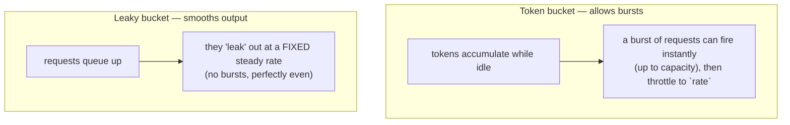

|                      | **Token bucket**                                            | **Leaky bucket**                                    |
| -------------------- | ----------------------------------------------------------------- | --------------------------------------------------------- |
| Bursts               | **Allowed** (up to capacity)                                | **Smoothed away** (constant output)                 |
| Output shape         | bursty then steady                                                | perfectly even                                            |
| Best when            | API allows short bursts; you want to use idle allowance           | you must protect a downstream that needs a*steady* feed |
| DevRev-style default | ✅ token bucket (most REST APIs advertise "X req/min with burst") | when feeding a fragile downstream at a fixed pace         |

**One-liner:** *"Token bucket lets me spend saved-up allowance as a burst, which matches how most rate-limited REST APIs actually work. Leaky bucket forces a perfectly even output rate — better when the thing downstream can't handle spikes at all."*

### 3.3 Coordinating a shared limit across concurrent workers

The tricky part: the limit is **per API key / per account**, but you have **many threads/workers**. Each must draw from the **same** bucket.

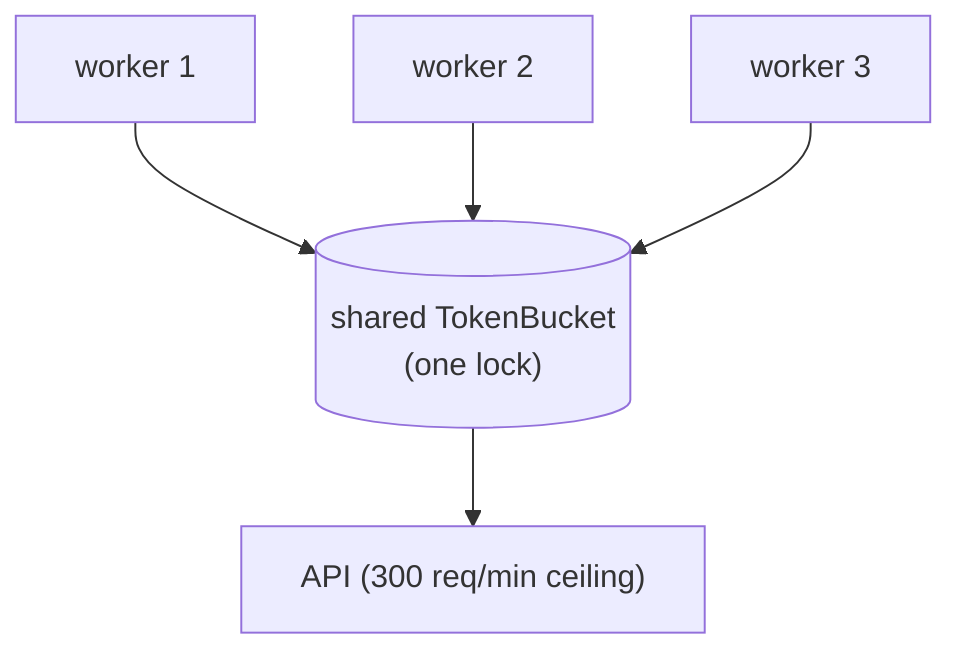

- **Single process, many threads** → one shared `TokenBucket` instance guarded by a `threading.Lock` (already done above). The lock makes "check tokens + spend" **atomic**, so two threads can't both spend the last token.
- **Many processes / machines** → you need a **shared store**: a Redis-backed token bucket (atomic Lua script) or a distributed limiter. Name this — it's the senior-level answer. The in-memory lock only coordinates *within one process*.

### 3.4 A client wrapper that respects a fixed requests-per-minute ceiling

Compose everything: rate-limit gate + retry wrapper around each call, driving the pagination loop.

```python
class RateLimitedClient:
    """Every request waits for a token, and retries transient failures with backoff."""
    def __init__(self, requests_per_minute, burst=None, transport=None):
        rate = requests_per_minute / 60.0        # convert per-minute ceiling to tokens/second
        capacity = burst or requests_per_minute  # allow up to a minute's worth as a burst
        self.bucket = TokenBucket(rate=rate, capacity=capacity)
        self._transport = transport              # the actual HTTP call (injected for testing)

    @retry_with_backoff(max_retries=5, base=0.5, cap=10.0, timeout_budget=30.0)
    def request(self, *args, **kwargs):
        self.bucket.acquire()                    # 1) wait for a token (rate limiting)
        return self._transport(*args, **kwargs)  # 2) the call itself (retry wraps this whole method)

    def fetch_all(self, path):
        """Cursor-paginate through an endpoint, rate-limited and retried end to end."""
        def fetch_page(cursor):
            return self.request(path, cursor=cursor)   # each page respects the limit + retries
        return fetch_all_pages(fetch_page)
```

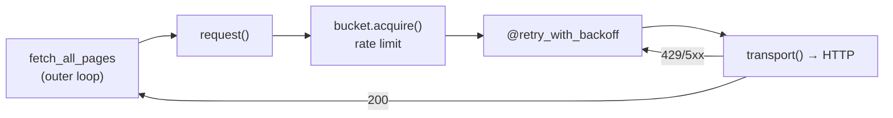

---

## 4. Interview Cheat Sheet

**Say the approach + complexity before coding, and narrate edge cases** (the prep flags "needed hints" as a negative signal).

| Topic                    | 15-second answer                                                                                                                                      | Edge cases to name                            |
| ------------------------ | ----------------------------------------------------------------------------------------------------------------------------------------------------- | --------------------------------------------- |
| **Pagination**     | "Cursor over offset: stable under concurrent writes, cheap on deep pages; loop until`next_cursor` is null with a max-page safety cap."              | empty set, missing/None cursor, cursor loop   |
| **Offset drift**   | "Deletes before the cursor skip rows; inserts duplicate them, because offset means 'skip N' not 'after row X'."                                       | concurrent insert vs delete                   |
| **Retries**        | "Retry only transient errors (429, 5xx, timeouts); exponential backoff with**full jitter**, a per-attempt cap, and a total time budget."        | 4xx = don't retry; honor`Retry-After`       |
| **Jitter**         | "Without jitter, all failed clients retry at the same instant → thundering herd. Random delay spreads the load."                                     | synchronized workers                          |
| **Idempotency**    | "Idempotency key makes re-processing safe; a version/high-water-mark drops duplicates and out-of-order events."                                       | duplicate + reordered webhooks                |
| **Token bucket**   | "Bucket of tokens, refilled at`rate`, capped at `capacity` (= burst). Spend one per request; lazily refill on each call — no background thread." | empty bucket → block; thread safety via lock |
| **Token vs leaky** | "Token bucket allows bursts (matches most REST APIs); leaky bucket forces a perfectly even output."                                                   | fragile downstream → leaky                   |
| **Shared limit**   | "One locked bucket for threads in a process; Redis-backed atomic bucket across processes/machines."                                                   | last-token race; distributed                  |

**DevRev connection to state out loud:** these are exactly the concerns of an FDE building integrations against DevRev's APIs and third-party systems — tie back to real integration/PS delivery experience where natural.

---

## 5. Runnable Reference

All the code above is collected in [`api_integration_reference.py`](api_integration_reference.py) — a single self-contained file with a mock transport and a `__main__` demo that exercises pagination, the retry decorator (forcing 429s then success), the token bucket (measuring the enforced rate), and the idempotent webhook processor. Run it with `python api_integration_reference.py`.

> Next sections of the prep to cover the same way: **2. Data Transformation** (nested-JSON flattening, schema drift) and **3. Agent Tool-Calling Loop** (ReAct loop, tool registry, max-iteration guard).
