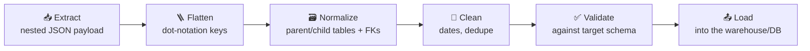
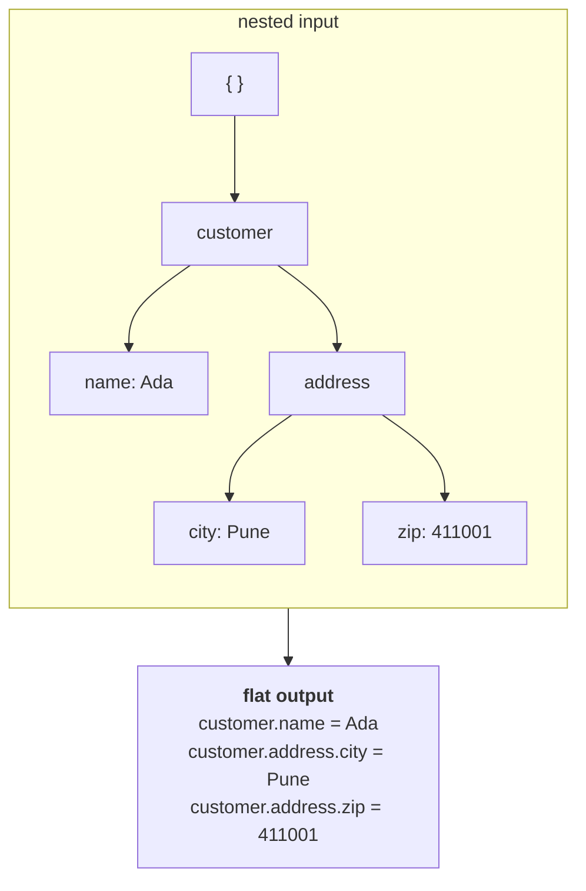
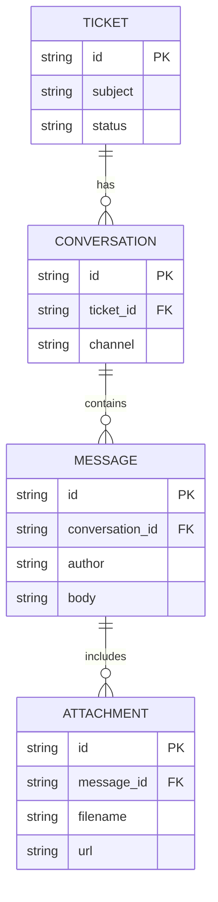
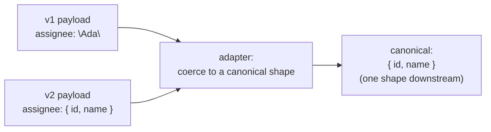
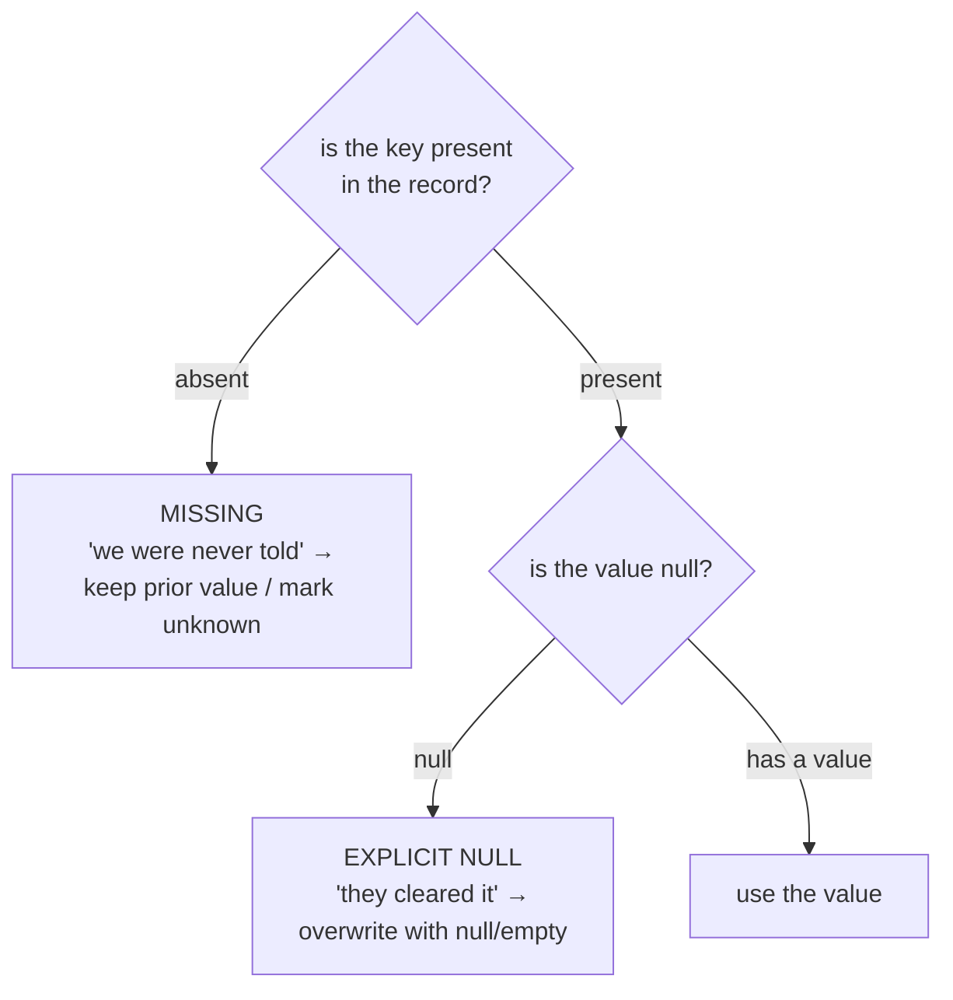
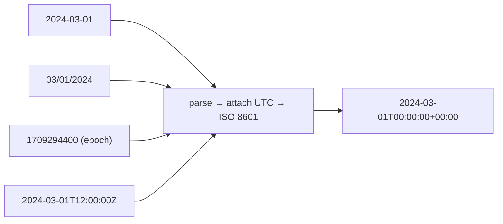
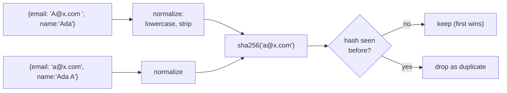
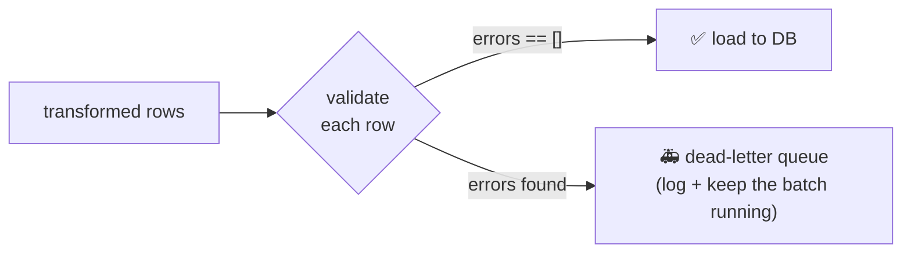

# 🔄 Data Transformation — Deep-Dive Tutorial

> **DevRev Technical Round · Section 2.** Parsing and normalizing nested JSON payloads into clean, relational schemas.
> Priority #5 in the prep — *"a quick win, commonly asked in integration-heavy interviews."* Expect to **write a flattener** and reason about **schema drift** and **data cleaning** out loud.

---

## 0. The Big Picture — The Transform Pipeline

Third-party APIs return **deeply nested JSON**. Your database wants **flat, relational, clean** rows. A transform layer bridges the two, and it's usually five stages:



Two golden rules that make you sound senior:

1. **Be tolerant on the way in, strict on the way out.** Accept messy input (missing keys, drift, bad dates); emit only rows that pass a schema check.
2. **Never crash the whole batch on one bad record.** Isolate failures, log them, keep going.

---

## 1. Flattening Nested Structures

**Goal:** turn nested objects into flat key/value pairs your DB columns can hold.

### 1.1 Flatten to dot-notation keys

`customer.address.city` — walk the tree, joining keys with a separator.



```python
def flatten(obj, parent="", sep="."):
    """Recursively flatten nested dicts (and arrays) into dot-notation keys."""
    out = {}
    if isinstance(obj, dict):
        for k, v in obj.items():
            key = f"{parent}{sep}{k}" if parent else k   # build the dotted path
            out.update(flatten(v, key, sep))             # recurse into the value
    elif isinstance(obj, list):
        if _is_primitive_list(obj):
            out[parent] = obj                            # keep an array of scalars as ONE value
        else:
            for i, v in enumerate(obj):                  # explode an array of objects by index
                out.update(flatten(v, f"{parent}{sep}{i}", sep))
    else:
        out[parent] = obj                                # a leaf scalar -> store it
    return out

def _is_primitive_list(lst):
    return all(not isinstance(x, (dict, list)) for x in lst)
```

### 1.2 Arrays-of-objects vs arrays-of-primitives (the nuance they probe)

```mermaid
flowchart TB
    A["a list value"] --> Q{"are its elements<br/>scalars or objects?"}
    Q -->|"scalars: [\"a\",\"b\"]<br/>(tags, labels)"| P["keep as a single value<br/>(a JSON array column,<br/>or join into 'a,b')"]
    Q -->|"objects: [{...},{...}]<br/>(messages, line items)"| O["these are CHILD ROWS →<br/>give them their own table<br/>with a foreign key (normalize)"]
```

- **Array of primitives** (`["urgent", "billing"]`) → a *column* (store as a JSON array, or comma-join). Flattening by index (`tags.0`, `tags.1`) is usually **wrong** here — the count varies row to row and you'd get sparse columns.
- **Array of objects** (`messages: [{...}, {...}]`) → a *child table*. Don't stuff them into columns; **normalize** them (next section).

### 1.3 Normalize into relational tables with foreign keys

The classic DevRev-shaped payload: **ticket → conversation → messages → attachments**. Each nested array of objects becomes its own table, linked by a foreign key back to its parent.



```python
def normalize_ticket(ticket):
    """Explode one nested ticket into flat rows for 4 relational tables (with FKs)."""
    tables = {"tickets": [], "conversations": [], "messages": [], "attachments": []}
    tid = ticket["id"]
    tables["tickets"].append({                        # parent row
        "id": tid, "subject": ticket.get("subject"), "status": ticket.get("status"),
    })
    for conv in ticket.get("conversations", []):
        cid = conv["id"]
        tables["conversations"].append({
            "id": cid, "ticket_id": tid,              # FK -> tickets.id
            "channel": conv.get("channel"),
        })
        for msg in conv.get("messages", []):
            mid = msg["id"]
            tables["messages"].append({
                "id": mid, "conversation_id": cid,    # FK -> conversations.id
                "author": msg.get("author"), "body": msg.get("body"),
            })
            for att in msg.get("attachments", []):
                tables["attachments"].append({
                    "id": att["id"], "message_id": mid,   # FK -> messages.id
                    "filename": att.get("filename"), "url": att.get("url"),
                })
    return tables
```

**Say this out loud:** *"Each level of nesting that's an array of objects becomes a table. The child carries a foreign key to its parent's primary key. I walk the tree once, top-down, so parents exist before I attach children."*

---

## 2. Schema Handling

**Goal:** keep working when the *shape* of the input changes between sources or versions.

### 2.1 Schema drift — a field changes type across versions

The classic: `assignee` was a **string** (a name) in v1, then became an **object** (`{id, name}`) in v2. A naive `record["assignee"]["name"]` crashes on v1.



**Pattern: an adapter that coerces every input variant into one canonical shape.**

```python
def coerce_assignee(value):
    """Accept the string (v1) OR object (v2) form; always return {id, name}."""
    if value is None:
        return None
    if isinstance(value, str):                     # v1: just a display name
        return {"id": None, "name": value}
    if isinstance(value, dict):                    # v2: a proper object
        return {"id": value.get("id"), "name": value.get("name")}
    raise ValueError(f"unexpected assignee shape: {type(value).__name__}")
```

> Downstream code only ever sees `{id, name}`. **Isolate drift at the boundary** so the rest of the pipeline stays simple.

### 2.2 A transform layer tolerant of missing / renamed keys

APIs rename keys (`created_at` → `createdAt` → `created`). Map by **a list of aliases** with a fallback.

```python
def get_field(record, names, default=None):
    """Return the first present, non-None value among candidate key names."""
    for n in names:
        if n in record and record[n] is not None:
            return record[n]
    return default

# usage — survives all three naming variants:
created = get_field(rec, ["created_at", "createdAt", "created"], default=None)
```

A tidy way to declare the whole mapping as data (easy to extend without touching logic):

```python
FIELD_MAP = {
    "id":        ["id", "ticket_id", "uuid"],
    "subject":   ["subject", "title", "summary"],
    "created":   ["created_at", "createdAt", "created"],
}

def transform(record):
    return {out: get_field(record, aliases) for out, aliases in FIELD_MAP.items()}
```

### 2.3 Null vs missing — decide defaults safely

These are **not** the same, and conflating them loses information:



| Case                    | JSON                  | Usually means                  | Safe default                                |
| ----------------------- | --------------------- | ------------------------------ | ------------------------------------------- |
| **Missing key**   | `{}` (no `phone`) | "not provided in this payload" | leave existing value untouched /`unknown` |
| **Explicit null** | `{"phone": null}`   | "the user cleared it"          | overwrite with`null`                      |

```python
_MISSING = object()   # a unique sentinel so we can tell "absent" from "None"

def resolve(record, key, on_missing, on_null):
    if key not in record:
        return on_missing        # the key was absent
    v = record[key]
    return on_null if v is None else v   # present-but-null vs a real value
```

---

## 3. Data Cleaning

**Goal:** consistent, deduplicated, schema-valid output.

### 3.1 Normalize timestamps to ISO 8601 (UTC)

Sources emit `2024-03-01`, `03/01/2024`, `1709294400` (epoch), `2024-03-01T12:00:00Z`… Normalize them all to one canonical ISO-8601 UTC string.



```python
from datetime import datetime, timezone

_DATE_FORMATS = ["%Y-%m-%d %H:%M:%S", "%Y-%m-%d", "%m/%d/%Y", "%d-%b-%Y"]

def to_iso8601(value):
    """Best-effort parse of many date formats into a canonical ISO-8601 UTC string."""
    if value is None:
        return None
    if isinstance(value, (int, float)):                     # epoch seconds (or milliseconds)
        seconds = value / 1000 if value > 1e12 else value
        return datetime.fromtimestamp(seconds, tz=timezone.utc).isoformat()
    s = str(value).strip()
    try:                                                    # handles ISO already (incl. 'Z')
        dt = datetime.fromisoformat(s.replace("Z", "+00:00"))
    except ValueError:
        dt = None
        for fmt in _DATE_FORMATS:                           # try known non-ISO formats
            try:
                dt = datetime.strptime(s, fmt); break
            except ValueError:
                continue
        if dt is None:
            raise ValueError(f"unparseable date: {value!r}")
    if dt.tzinfo is None:                                   # naive -> assume UTC
        dt = dt.replace(tzinfo=timezone.utc)
    return dt.astimezone(timezone.utc).isoformat()          # canonical UTC output
```

> **Edge case to name:** ambiguous formats like `03/01/2024` (is it Mar 1 or Jan 3?). Say you'd pin the format **per source** rather than guess globally.

### 3.2 Deduplicate on a stable hash of business keys

When IDs are unreliable/absent, dedupe on the **business keys** that truly identify a record (e.g. `email + created_date`). Normalize before hashing so trivial differences (case, whitespace) still collide.



```python
import hashlib

def business_key_hash(record, keys):
    """Stable fingerprint from chosen business keys (normalized for consistency)."""
    parts = [str(record.get(k, "")).strip().lower() for k in keys]
    return hashlib.sha256("|".join(parts).encode()).hexdigest()

def dedupe(records, keys):
    seen = {}
    for r in records:
        h = business_key_hash(r, keys)
        if h not in seen:                 # first occurrence wins
            seen[h] = r
    return list(seen.values())
```

> Why a **hash** and not the tuple itself? Compact, uniform-length keys; easy to store/compare across batches; and you can persist just the hash to remember what you've already ingested.

### 3.3 Validate transformed output against a target schema

Strict on the way out: every emitted row must have the required fields with the right types. Collect **all** errors (don't fail on the first) so you can report a bad record fully.

```python
def validate(record, schema):
    """schema: {field: {"type": <python type>, "required": <bool>}} -> list of error strings."""
    errors = []
    for field, spec in schema.items():
        present = field in record and record[field] is not None
        if not present:
            if spec.get("required"):
                errors.append(f"missing required field '{field}'")
            continue
        if not isinstance(record[field], spec["type"]):
            errors.append(
                f"'{field}': expected {spec['type'].__name__}, "
                f"got {type(record[field]).__name__}"
            )
    return errors   # empty list == valid
```



---

## 4. Interview Cheat Sheet

**State the approach + complexity, and narrate edge cases** (the prep flags "needed hints" as a negative signal).

| Topic                     | 15-second answer                                                                                                  | Edge cases to name                         |
| ------------------------- | ----------------------------------------------------------------------------------------------------------------- | ------------------------------------------ |
| **Flatten**         | "Recurse; join keys with`.`. Arrays of scalars stay one value; arrays of objects become child tables."          | deep nesting, empty objects, sparse arrays |
| **Normalize**       | "Each array-of-objects level → a table; children carry a foreign key to the parent's PK; walk top-down."         | missing IDs, orphan children               |
| **Schema drift**    | "Coerce every input variant to one canonical shape in an adapter at the boundary; downstream stays simple."       | string→object, added/removed fields       |
| **Missing vs null** | "Absent key = 'not told' (keep prior); explicit null = 'cleared' (overwrite). Use a sentinel to tell them apart." | `{}` vs `{"x": null}`                  |
| **Dates**           | "Parse many formats, attach UTC, emit ISO-8601. Pin the format per source for ambiguous ones like MM/DD."         | epoch sec vs ms, naive vs tz-aware, DD/MM  |
| **Dedupe**          | "Hash the normalized business keys (lowercase/strip); first occurrence wins — works when IDs are unreliable."    | case/whitespace, near-duplicates           |
| **Validate**        | "Strict on the way out: required fields + types; collect all errors; route bad rows to a dead-letter queue."      | partial batches, type mismatches           |

**Overarching principle to say:** *"Tolerant on input, strict on output, and never let one bad record sink the batch."* — this is exactly the mindset of an FDE building resilient integrations on DevRev's platform.

---

## 5. Runnable Reference

All the code above is collected in [`data_transformation_reference.py`](data_transformation_reference.py) — a self-contained file with a `__main__` demo that flattens a nested payload, normalizes a ticket into four FK-linked tables, coerces a drifted field, resolves null-vs-missing, converts several date formats to ISO-8601, dedupes on business keys, and validates against a target schema. Run it with `python data_transformation_reference.py`.

> Next: **3. Agent Tool-Calling Loop** (ReAct loop, tool registry, max-iteration guard, confirmation gate).
