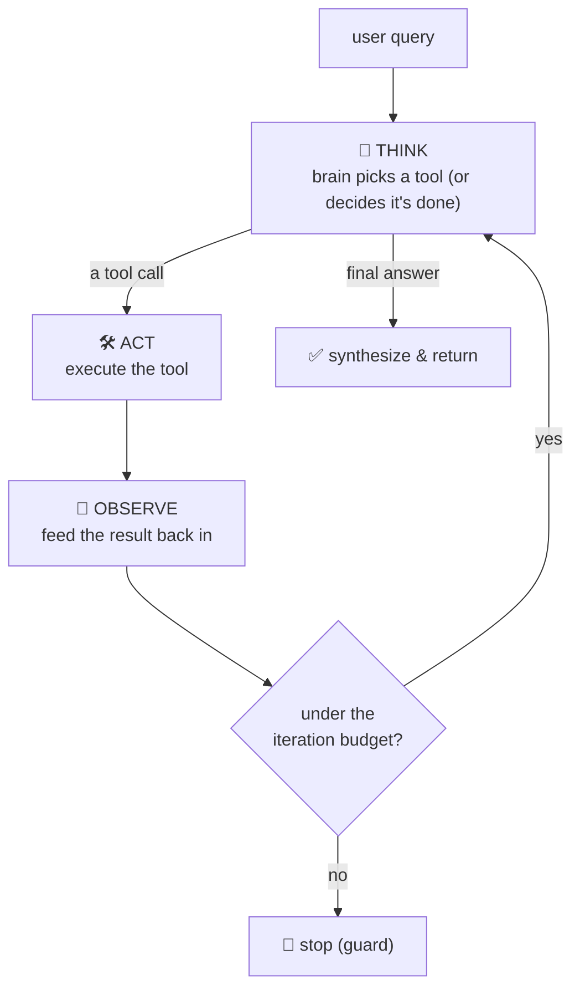
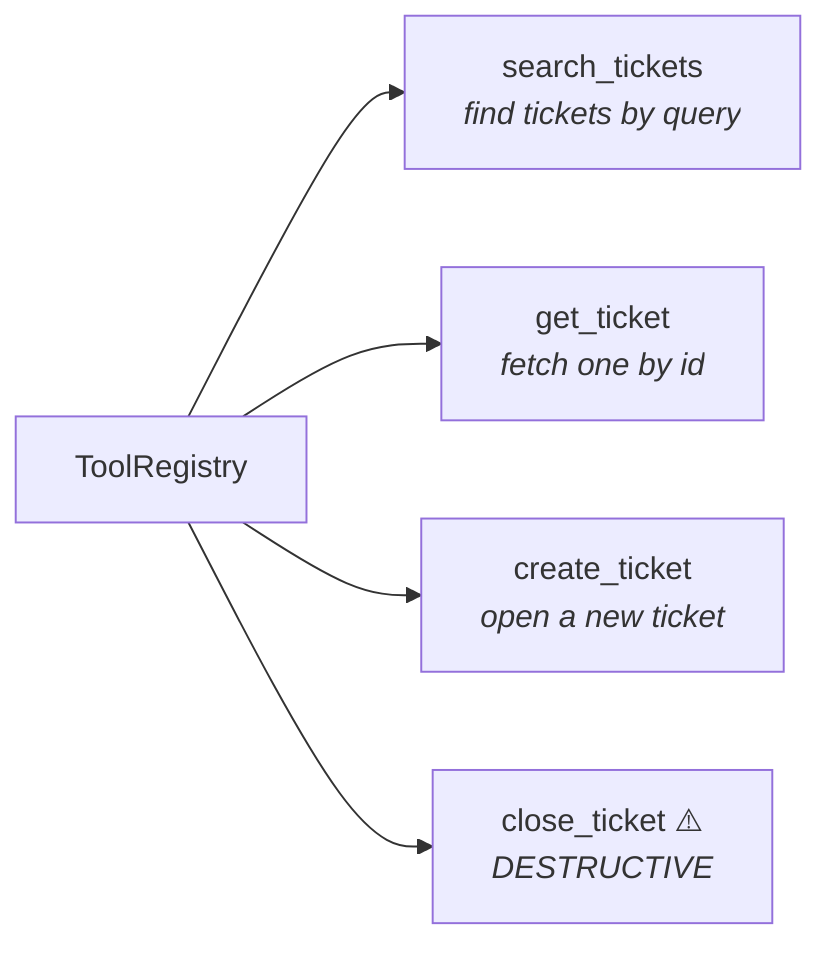
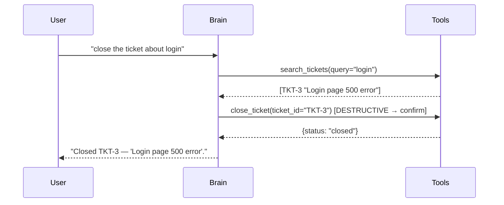
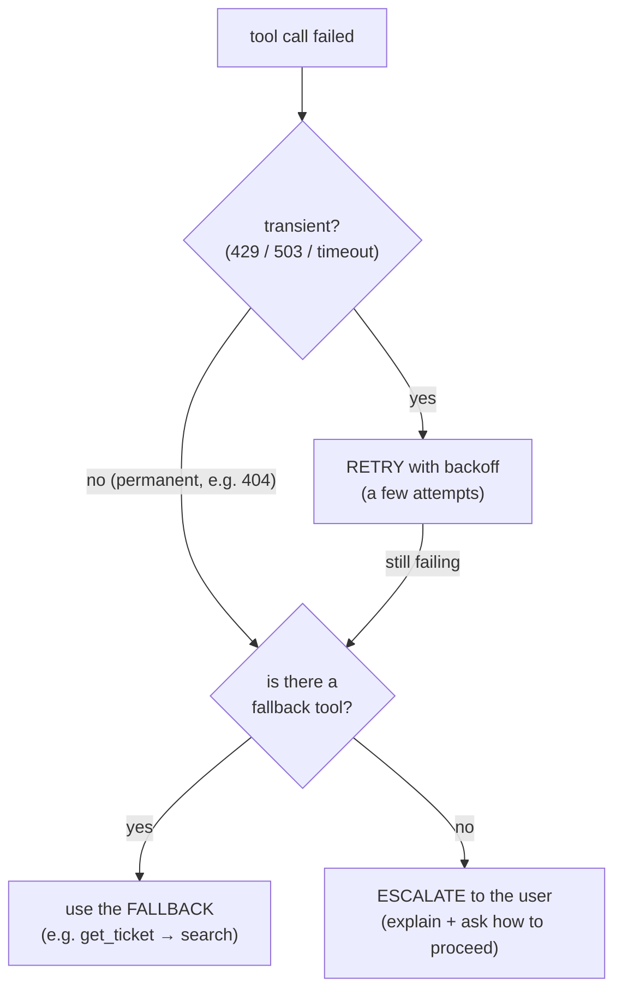
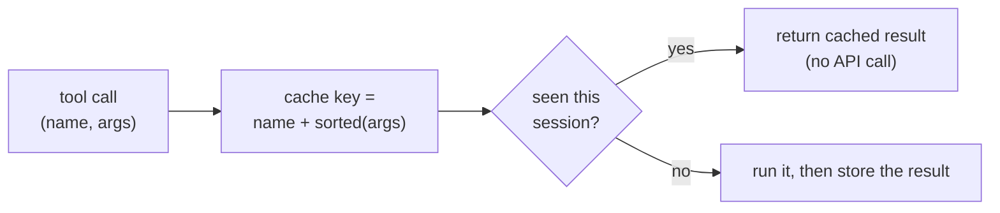
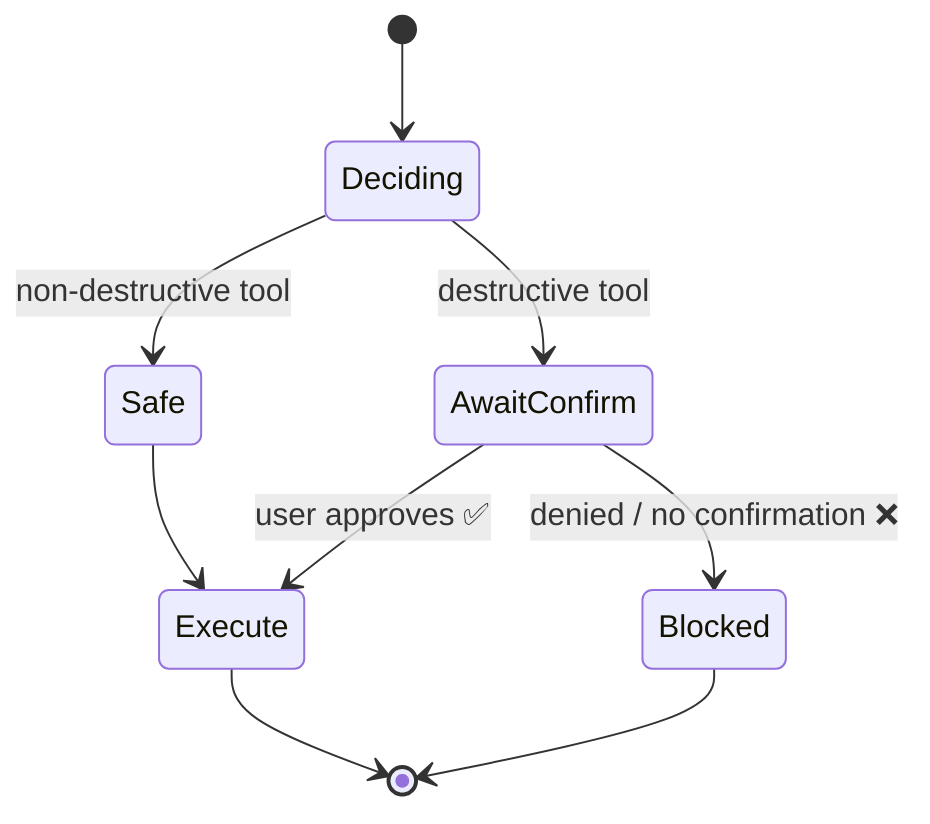
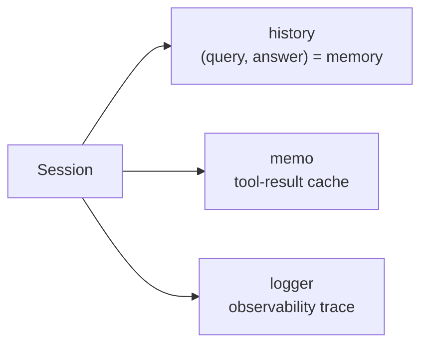
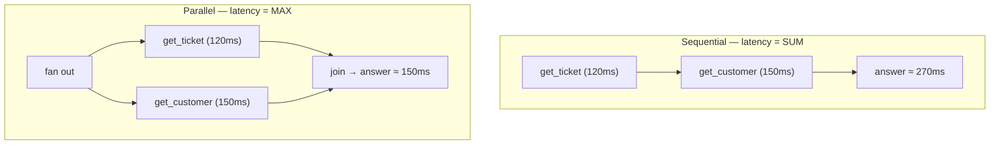
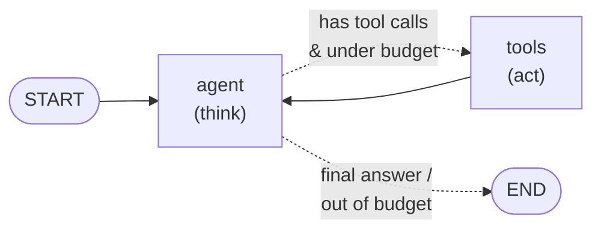

# 🤖 Agent Tool-Calling Loop — Deep-Dive Tutorial

> **DevRev Technical Round · Section 3.** Implementing the core agent loop:
> **query → tool selection → call → observation → synthesis**, with a max-iteration guard,
> robustness, and good design. Priority #3 in the prep — *"coded from scratch"* and *"maps
> directly to DevRev's AI-native agent product surface."*
>
> 🛠️ This tutorial has a **companion project** you can run:
> [`../agent_tool_calling_demo/`](../agent_tool_calling_demo/) — a from-scratch agent **and**
> a LangGraph version, a notebook, and 12 passing tests. No API key needed.

---

## 0. The Big Picture — the ReAct Loop

An agent doesn't answer in one shot. It **reasons and acts in a loop** (the "ReAct" pattern):
it thinks about what to do, calls a tool, looks at the result, and repeats until it can
answer — or until a safety guard stops it.



Four pieces make this work: a **tool registry**, a **brain** that routes, an **executor**
that runs tools safely, and a **guard** that bounds the loop.

---

## 1. Core Loop Mechanics

### 1.1 The tool registry

A **tool** is the atomic capability the agent can invoke: a **name**, a **description**
(what the model reads to decide *when* to use it), the **function**, and a **`destructive`**
flag for things like delete/close/refund.



```python
@dataclass
class Tool:
    name: str            # unique id the agent references
    description: str     # what the model reads to pick a tool
    func: Callable       # the implementation
    destructive: bool = False   # delete/close/refund -> needs confirmation
```

### 1.2 The loop, coded from scratch (the interview version)

```python
def run(self, query, session):
    observations = []
    iterations = 0
    while iterations < self.max_iterations:          # ← MAX-ITERATION GUARD
        decision = self.brain.decide(query, observations)   # THINK
        if decision.is_final:                        # the brain is done
            return decision.final                    # SYNTHESIZE
        tool = self.registry.get(decision.tool)      # ACT
        result = execute_tool(tool, decision.args, logger=session.logger,
                              memo=session.memo, confirm=self.confirm)
        observations.append((decision.tool, result))  # OBSERVE
        iterations += 1
    return "Stopped: hit the max-iteration guard."
```

A multi-step request — *"close the ticket about login"* — flows like this:



### 1.3 Routing a query to the right tool

The **brain** maps intent → a tool call. In production it's an LLM (`ChatOpenAI.bind_tools`
returns exactly a `{name, args}` tool call). For a deterministic, offline demo we use a
rule-based router with the **same contract**, so the agent code doesn't change:

```python
class RuleBasedBrain:
    def decide(self, query, observations) -> Decision:
        intent, arg = self._classify(query)
        # ... returns Decision(tool=..., args=...) or Decision(final="...")
```

> **The swap-in point:** anything exposing `.decide(query, observations)` works —
> `make_llm_brain()` shows the real-LLM version. *"I keep the reasoning behind an interface
> so I can start with rules and drop in an LLM without touching the loop."*

### 1.4 Synthesizing the final answer

When the brain has enough observations, it returns a **final** decision instead of a tool
call, and the loop returns that text. With one tool result it's a lookup; with several it's
a summary that combines them.

### 1.5 The max-iteration guard (never skip this)

Without a cap, a confused brain (or a tool that keeps erroring) loops forever, burning tokens
and money. **Always** bound the loop:

```python
while iterations < self.max_iterations:   # e.g. 6
    ...
```

*"The guard is the difference between a demo and something you'd let run unattended."*

---

## 2. Robustness (Section 3.2)

### 2.1 A tool call fails — retry, fallback, or escalate



**Rule:** recover if you can (retry transient, fall back on permanent), otherwise **surface
it** — never let an agent silently swallow a failure mid-loop.

### 2.2 Memoize repeated calls

Agents re-ask the same thing (a re-plan, a loop). Cache `(tool, args) → result` for the
session so an identical call is free instead of another API hit.



```python
key = tool.name + "::" + json.dumps(args, sort_keys=True)
if memo is not None and key in memo:
    return memo[key]            # cache hit — logged as such for observability
```

### 2.3 Disambiguate when two tools fit

If `search_tickets` and (say) `semantic_search` both match a "find" query, pick
**deterministically** — and **never silently run a *destructive* tool on a tie**.

```python
def disambiguate(candidates, query):
    # safe tools win ties; then prefer the best description/query word overlap
    return max(candidates, key=lambda t: (0 if t.destructive else 1, overlap(t, query)))
```

*"On a genuine tie I'd let the LLM choose or ask the user — but a delete/close never wins a
coin flip."*

### 2.4 Confirmation gate before destructive actions

Delete, close, refund — **pause and confirm** before executing. Model it as a gate the tool
must pass.



```python
if tool.destructive:
    if not confirm(tool, args):          # default policy: DENY
        raise ConfirmationRequired(tool.name, args)   # loop pauses, hands control back
```

The loop returns *"Awaiting confirmation to run 'close_ticket' with {'ticket_id': 'TKT-3'}"*
and **does nothing** until approved. (LangGraph's native way to do this is
`interrupt_before=["tools"]` + a checkpointer — a human-in-the-loop pause you resume with a
`Command`.)

---

## 3. Design Considerations (Section 3.3)

### 3.1 State across conversation turns

A `Session` carries **history + memo cache + trace** across `run()` calls, so the agent
remembers context and doesn't re-hit the API. In production, key it by `conversation_id` in
a durable store (Redis/DB), and use a **checkpointer** to survive restarts and enable pauses.



### 3.2 Observability

Log **what was called, with what args, what came back, latency, and whether it was a
cache_hit / retry / error** — one record per tool call. It's your debugger, your cost meter,
and your audit log for destructive actions. In production → OpenTelemetry spans / LangSmith,
one trace per conversation.

### 3.3 Parallel vs sequential tool calls



- **Dependent** steps stay **sequential** (you can't close a ticket before you've found it).
- **Independent** reads go **parallel** (latency = max, not sum) via `asyncio.gather` or a
  LangGraph fan-out — but they hit the **rate limiter harder**, so coordinate them through
  one token bucket (see the API Integration tutorial).

---

## 4. The Same Loop in LangGraph

Two nodes and a conditional edge. The `agent` node emits an `AIMessage` with `tool_calls`
(the exact shape a real LLM returns); the `tools` node runs them robustly and appends
`ToolMessage`s; the edge loops while there are tool calls and we're under budget.



```python
g = StateGraph(AgentState)
g.add_node("agent", agent_node)          # decides the next tool call (or finishes)
g.add_node("tools", tools_node)          # runs execute_tool() with all the robustness
g.add_edge(START, "agent")
g.add_conditional_edges("agent", should_continue, {"tools": "tools", END: END})
g.add_edge("tools", "agent")             # observe -> think again
app = g.compile()
```

**Why show both?** From-scratch proves you understand the mechanics (the interview ask);
LangGraph shows you can express it in the framework the team ships on.

---

## 5. Interview Cheat Sheet

**State the approach, then narrate edge cases** (the prep flags "needed hints" as a negative).

| Topic                  | 15-second answer                                                                               | Edge cases to name                                 |
| ---------------------- | ---------------------------------------------------------------------------------------------- | -------------------------------------------------- |
| **The loop**     | "ReAct: think → act → observe → repeat, bounded by a max-iteration guard."                  | infinite loop, no tool matches                     |
| **Routing**      | "Brain (LLM or rules) maps intent → a`{name, args}` tool call from a registry."             | ambiguous intent, unknown tool                     |
| **Synthesis**    | "When observations are enough, the brain returns a final answer instead of a tool call."       | combine multiple observations                      |
| **Guard**        | "Cap iterations so a confused agent can't burn tokens forever."                                | tool that always errors                            |
| **Failure**      | "Retry transient, fall back on permanent, escalate if neither works — never swallow it."      | 429 vs 404; no fallback                            |
| **Memoize**      | "Cache (tool, args) per session so repeats are free."                                          | args order → stable key                           |
| **Disambiguate** | "Deterministic pick; safe tools win ties; ask/LLM on real ambiguity."                          | two plausible tools; destructive tie               |
| **Confirm**      | "Destructive tools pause for confirmation before running."                                     | delete/close/refund; auto-retry a destructive call |
| **State**        | "A Session carries history + cache + trace across turns; key by conversation_id in prod."      | token budget, restarts                             |
| **Parallel**     | "Independent reads in parallel (latency = max); dependent steps sequential; mind rate limits." | fan-out errors, partial results                    |

**DevRev connection:** this is exactly an FDE building agentic workflows on DevRev's
platform — tie back to real agentic/AI work where natural.

---

## 6. Run the Companion Project

```bash
cd agent_tool_calling_demo
pip install -r requirements.txt      # from-scratch agent needs nothing; LangGraph for §4
python -m pytest -q                   # 12 tests, all green
jupyter notebook notebooks/agent_tool_calling_demo.ipynb
```

- `src/scratch_agent.py` — the loop from scratch · `src/langgraph_agent.py` — the LangGraph version
- `src/robustness.py` — retry · memo · fallback · confirmation · disambiguation
- `docs/DESIGN.md` — the state / observability / parallelism tradeoffs in depth
