# 🧩 Core DSA for DevRev — Sections 4.1 · 4.2 · 4.3 · 4.4

> **DevRev Technical Round · Section 4.** The prep confirms at least one round is a **LeetCode Medium on arrays**
> (Section 4.1), but the JD's *"workflow orchestration"* language makes **graphs/trees, hash maps, and
> queues/scheduling** highly likely too. This tutorial is **DevRev-framed**: every algorithm is tied to a real
> platform concept (task DAGs, ticket hierarchies, caches, workflow waves).
>
> 🛠️ **Runnable companions:** [`../dsa_notebooks/`](../dsa_notebooks/) — the four *net-new* topics as commented
> notebooks (worst→optimal, tests, Big-O benchmarks). The rest of 4.2–4.4 is already in your Blind 75 set.

---

## 0. Coverage map — what's ready vs. net-new

| Section | Topic | Status |
|---|---|---|
| 4.1 | Two Sum · Kadane's · merge intervals · product-except-self · rotated search · longest substring | ✅ Blind 75 `Array/*`, `String/*`, `Interval/*` |
| **4.1** | **Subarray sum equals k (prefix sum + hash map)** | ⭐ **net-new →** `dsa_notebooks/subarray_sum_equals_k.ipynb` |
| **4.1** | **Sliding window maximum (monotonic deque)** | ⭐ **net-new →** `dsa_notebooks/sliding_window_maximum.ipynb` |
| **4.2** | Topological sort (Kahn's) · cycle detection | ✅ Blind 75 `Graph/course_schedule` |
| 4.2 | Serialize / deserialize a tree | ✅ Blind 75 `Tree/serialize_and_deserialize_binary_tree` |
| **4.2** | **BFS/DFS downstream-of-a-failure** | ⭐ **net-new →** `dsa_notebooks/downstream_of_a_failure.ipynb` |
| **4.2** | **Build a tree from flat `{id, parent_id}`** | ⭐ **net-new →** `dsa_notebooks/build_tree_from_flat_list.ipynb` |
| **4.2** | **LCA of a general binary tree** | ⭐ **net-new →** `dsa_notebooks/lowest_common_ancestor_binary_tree.ipynb` |
| 4.3 | Group records by key | ✅ Blind 75 `String/group_anagrams` |
| 4.3 | Dedup on composite keys | ✅ DevRev `02_Data_Transformation` (`business_key_hash`) |
| 4.3 | Task-state tracker (dict) | ✅ trivial dict — see below |
| **4.3** | **LRU cache (hash map + DLL)** | ⭐ **net-new →** `dsa_notebooks/lru_cache.ipynb` |
| 4.4 | Priority queue by deadline/SLA | ✅ heaps in Blind 75 `Heap/*` |
| 4.4 | Stack-based backtracking | ✅ pattern in `combination_sum` / `word_search` |
| **4.4** | **Topological "wave" scheduling** | ⭐ **net-new →** `dsa_notebooks/topological_wave_scheduling.ipynb` |

The five ⭐ topics are covered in depth below. (Two more ⭐ array patterns from **4.1** — *subarray sum equals k* and *sliding window maximum* — also ship as net-new notebooks: `dsa_notebooks/subarray_sum_equals_k.ipynb`, `dsa_notebooks/sliding_window_maximum.ipynb`.)

> 🖥️ **Interactive explainers:** every ⭐ topic also has a click-through visual walkthrough in
> [`../visualizations/`](../visualizations/) (open `index.html`) — step through the algorithm frame by frame,
> plus a patterns cheat sheet.

---

## 4.1 — Arrays (Highest Priority · Confirmed Format)

> The prep doc **confirms** at least one round is a LeetCode-Medium on arrays, so this is the highest-ROI bucket.
> Most of 4.1 is already in your Blind 75 `Array`/`String`/`Interval` sets (Two Sum + two-pointer, Kadane's,
> merge intervals, product-except-self, rotated-array binary search, longest-substring sliding window). Two
> patterns were **missing** — both shipped as net-new notebooks and covered here.

### ➕ Subarray Sum Equals K (prefix sum + hash map)

**DevRev framing:** a timeline of numbers — each a ticket cost, an SLA-timer tick, or a usage-metric delta.
**How many contiguous stretches sum to exactly `k`?** (e.g. "how many back-to-back work-windows cost exactly one
SLA unit"). Values can be **negative**, so a sliding window does *not* work.

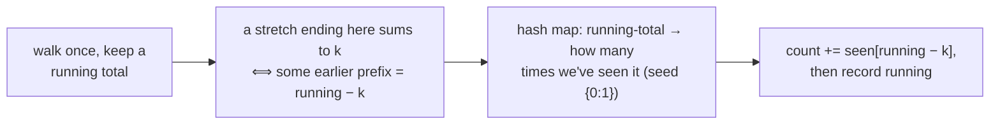

**The insight:** the sum of a stretch is `prefix[j] − prefix[i]`, so a stretch hits `k` exactly when an earlier
prefix equals `running − k`. Keep a running tally of every prefix seen (and how many times) and look it up in O(1).

- **Complexity:** `O(n)` time & space (vs `O(n²)` checking every stretch).
- **Why not a sliding window:** with negative values the running sum isn't monotonic, so growing/shrinking a window breaks — reach for prefix + hash map instead.
- **Seed `{0: 1}`:** the empty prefix lets a stretch starting at index 0 count — a classic off-by-one trap.
- **Interview one-liner:** *"I keep prefix sums in a hash map and count earlier prefixes equal to running − k — one linear pass."*

### 🌊 Sliding Window Maximum (monotonic deque)

**DevRev framing:** a live dashboard's **rolling peak** — max concurrent tickets, max latency, or worst SLA
breach over the last `k` samples. Report the biggest value in every window as it slides.

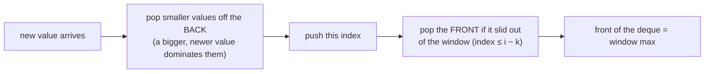

**The insight:** keep a **deque of indices** whose values are strictly decreasing. A smaller *older* element can
never beat a bigger *newer* one, so evict it. The front is always the current window's max.

- **Complexity:** `O(n)` — each index enters and leaves the deque at most once (the inner `while` is amortized, not quadratic).
- **Store indices, not values:** you need the index to know when a candidate slides out of the window.
- **Contrast:** recomputing `max` per window is `O(n·k)` — quadratic when `k ≈ n/2`.
- **Interview one-liner:** *"A decreasing deque of indices so the window max is the front; each index is pushed and popped once, so O(n)."*

---

## 4.2 — Graphs & Trees for Workflow Orchestration

### 🌳 Build a Tree from a Flat `{id, parent_id}` List

**DevRev framing:** a `tasks`/`comments`/`sub-tickets` table is stored **flat** — each row knows its `parent_id`,
not a pointer to the parent object. Rendering the hierarchy means **rebuilding the tree** from those rows.

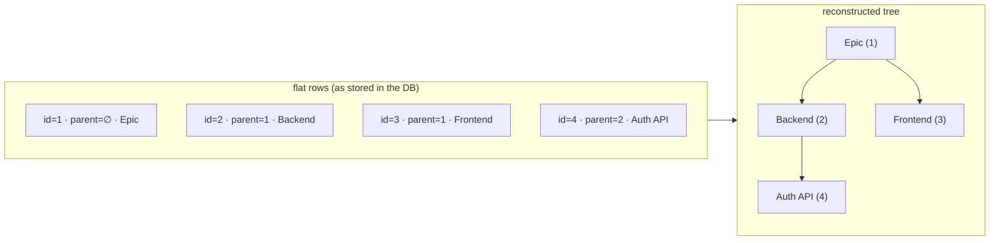

**The insight:** don't scan the list to find each parent (that's `O(n²)`). Build a **hash-map index**
`id → node` first, then in one pass attach each node under its parent in **O(1)**:

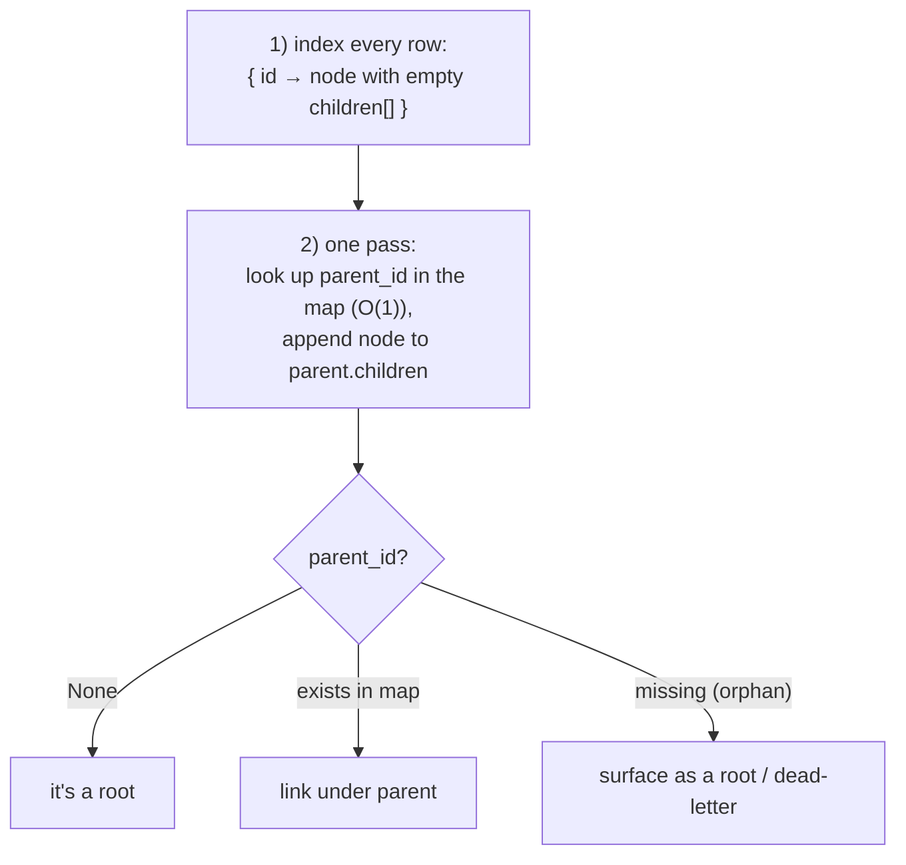

- **Complexity:** `O(n)` time & space (vs `O(n²)` for scan-per-parent).
- **Edge cases to name:** children can appear **before** their parent (index first!), a **forest** (several roots),
  **orphans** (dangling `parent_id`), and **cycles** (defensive check).
- **Interview one-liner:** *"I index the rows by id in a dict, then one linear pass links each node to its parent in O(1) — rows with no/absent parent become roots."*

---

### 🔀 Lowest Common Ancestor of a **General** Binary Tree

**DevRev framing:** given two items in a hierarchy — two sub-tasks, two comments in a thread — find their
**deepest common parent**. A task tree has **no ordering**, so (unlike a BST) you can't navigate by comparison.

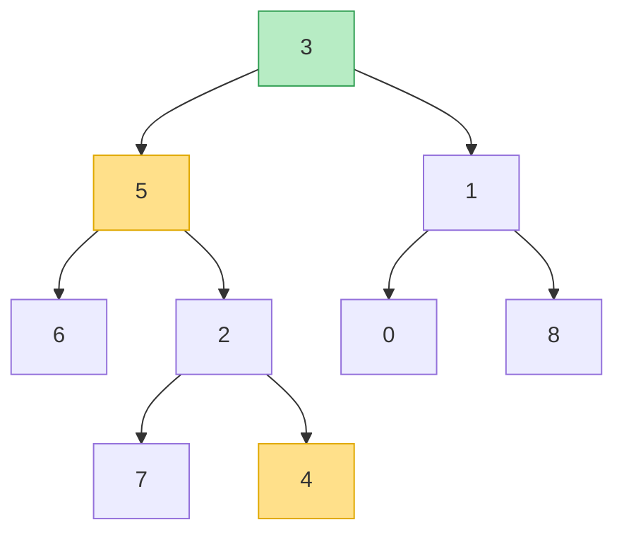
*LCA(5, 4) = 5 (an ancestor of 4); LCA(5, 1) = 3 (green) — they split there.*

**The insight:** one DFS. A node is the LCA when one target is found in its **left** subtree and the other in its
**right** — they *split* at that node.

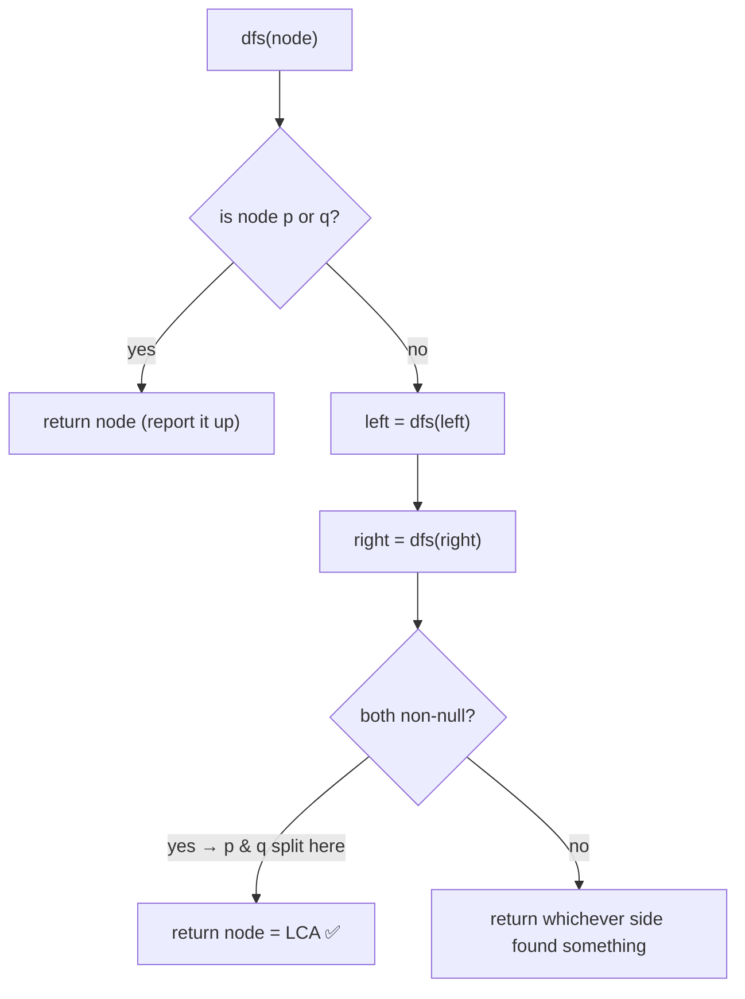

- **Complexity:** `O(n)` time, `O(height)` space — you must search both sides because there's no order to exploit.
- **Contrast:** the **BST** version (Blind 75) walks by comparison in `O(height)`; the general tree can't.
- **Interview one-liner:** *"DFS that returns a node if it contains p or q; the node whose two children both return non-null is the LCA."*

---

### 🔥 Downstream of a Failure (Blast Radius)

**DevRev framing:** services and tasks form a **dependency graph** (an arrow `u → v` means *v depends on u*).
When one task **fails**, everything that depends on it — directly or transitively — is affected. Finding that
**blast radius** is a graph **reachability** sweep from the failed node — a core incident/impact-analysis move
on a platform built around workflow orchestration.

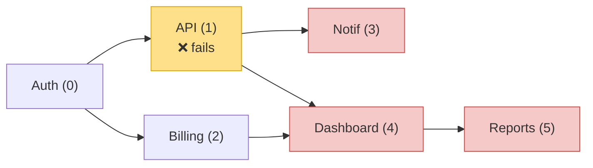
*API fails → its dependents Notif, Dashboard, Reports are downstream (the blast radius, red). Auth and Billing are upstream/siblings — untouched.*

**The insight:** one BFS or DFS from the failed node, with a **visited set**, reaches every affected task.
BFS additionally gives the **hop distance** (how many steps from the failure = impact order).

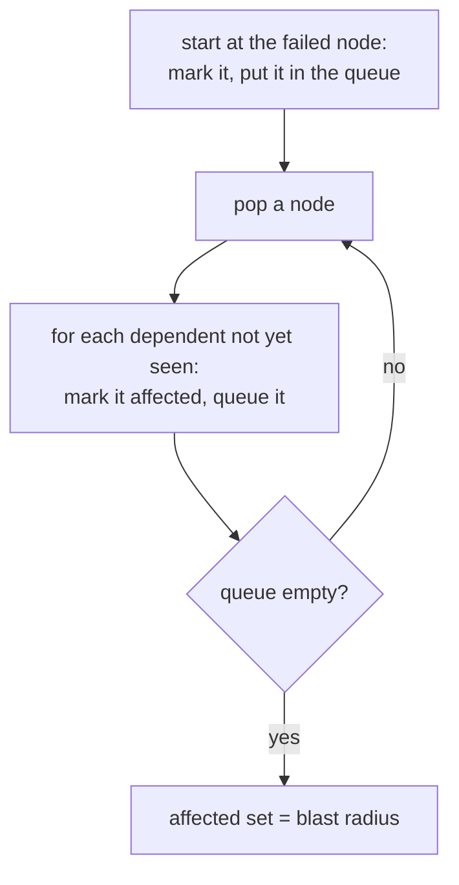

- **Complexity:** `O(V + E)` — each task and arrow visited once (vs `O(V·E)` re-scanning every edge each round).
- **Direction is the whole game:** follow arrows for **downstream** (who's affected); **reverse** them for **upstream** (root cause / what this task waited on).
- **Cycle-safe:** the visited set stops loops in a misconfigured dependency cycle.
- **BFS vs DFS:** same reachable set; pick **BFS** when you also want impact-order by hops.
- **Interview one-liner:** *"It's reachability from the failed node — BFS/DFS with a visited set, O(V+E), and cycle-safe; reverse the edges for root-cause upstream."*

---

## 4.3 — Hash Maps

### 🗂️ Task-State Tracker (the warm-up)

O(1) `get`/`set` of `task_id → status` is just a `dict` — but frame it well: *"a dict gives O(1) average
get/set; if I need history or TTL I'd store `{task_id: (status, updated_at)}` and expire stale entries."*

### 🔁 LRU Cache (hash map + doubly linked list)

**DevRev framing:** cache the latest **task states**, **API responses**, or **sessions** with a fixed memory
budget; evict the **Least Recently Used** when full. Both `get` and `put` must be **O(1)**.

**The insight:** you need *two* fast operations — **find by key** and **know/evict the least-recently-used**.
A hash map gives the first; a **doubly linked list** ordered by recency gives the second. Together = O(1).

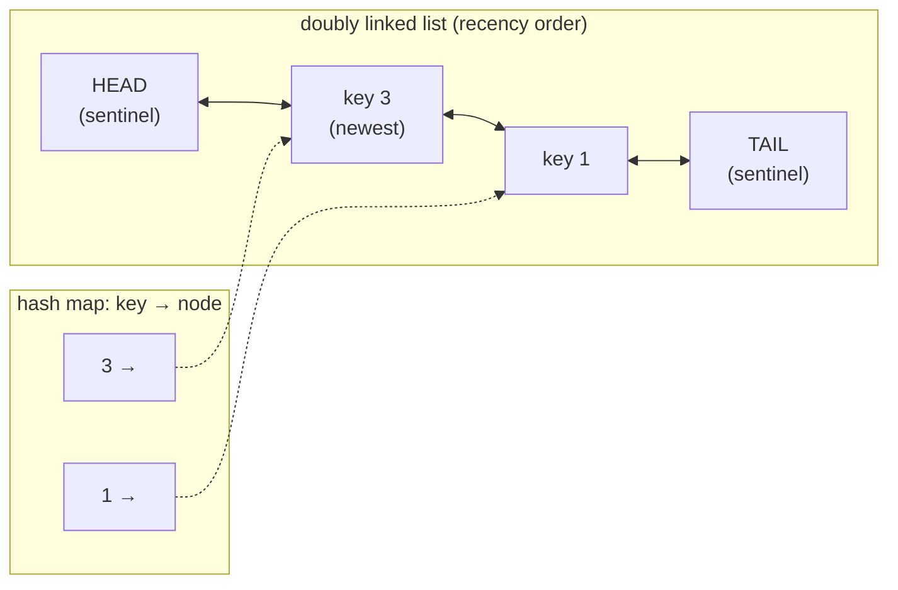

- **`get(key)`** → look up the node in the map, **unlink** it and **move to the front** (most-recent) — O(1).
- **`put(key,val)`** → add at the front; if over capacity, **drop the node before `TAIL`** (the LRU) and delete
  it from the map — O(1).
- **Sentinels:** dummy `HEAD`/`TAIL` nodes remove every "is this the first/last?" edge case.
- **Interview trap:** if they ask for the DLL **from scratch**, don't hand them `OrderedDict` — implement the list.
- **Interview one-liner:** *"Dict for O(1) lookup, doubly linked list for O(1) reorder and eviction; front = most-recent, evict the node before the tail sentinel."*

---

## 4.4 — Queues & Scheduling

### 🌊 Topological "Wave" Scheduling

**DevRev framing:** a workflow is a **DAG** of tasks with dependencies. To finish fastest, each round run **every
task whose dependencies are already done** — a **parallel-safe wave** — then the next wave. This is Kahn's
topological sort, grouped by level.

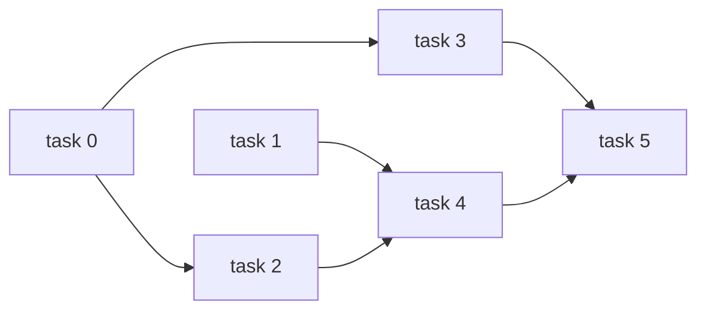

Grouped into waves (each wave runs in parallel; waves run in sequence):

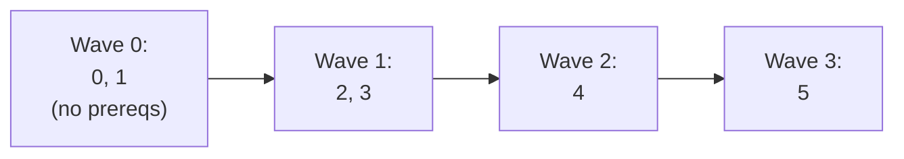

**The insight:** a task is ready when its **in-degree** (remaining prerequisites) hits 0. Take the whole ready
frontier as a wave; finishing it decrements dependents' counts, exposing the next wave.

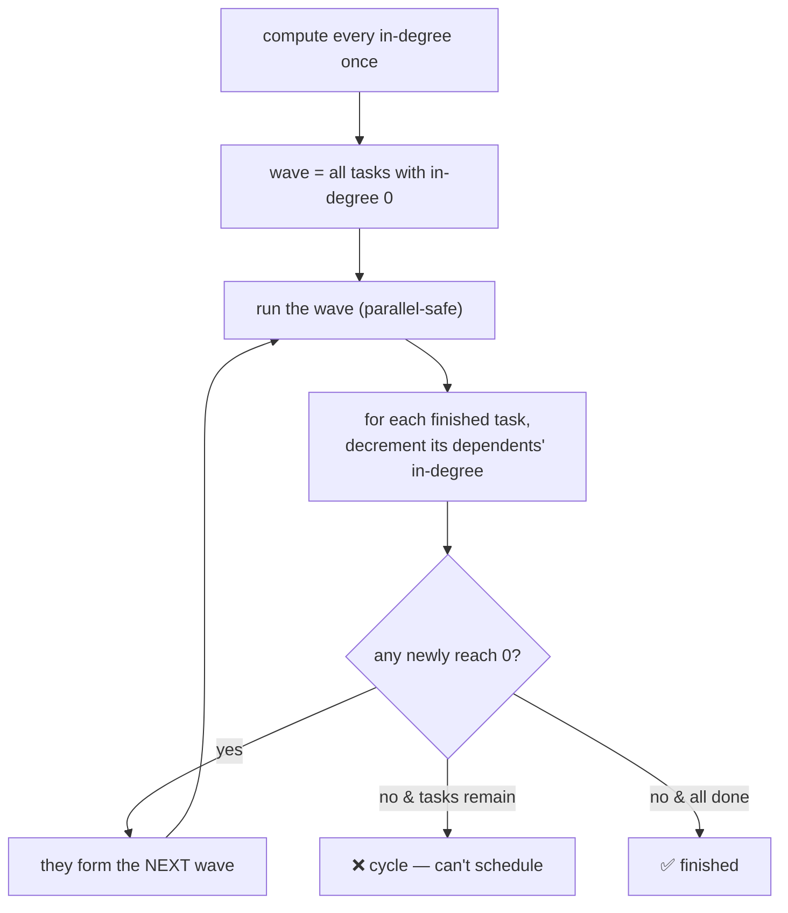

- **Complexity:** `O(V + E)` — decrement in-degrees as edges clear (naive re-scanning every round is `O(V·E)`).
- **Number of waves = the critical-path length** = the minimum number of sequential rounds.
- **Cycle = unschedulable:** if you can't place all `V` tasks, there's a dependency loop.
- **Interview one-liner:** *"Kahn's, but I emit the entire in-degree-0 frontier as one parallel wave; leftover tasks mean a cycle."*

---

## 5. Interview Cheat Sheet

**State the approach + complexity, then narrate edge cases** (the prep flags "needed hints" as a negative signal).

| Topic | 15-second answer | Edge cases |
|---|---|---|
| **Subarray sum = k** | "Prefix sums in a hash map; count earlier prefixes equal to running − k; seed {0:1}." | negatives (no window!), empty array, off-by-one seed |
| **Sliding window max** | "Decreasing deque of indices; front is the window max; each index pushed/popped once → O(n)." | store indices not values, window-not-full guard, equal values |
| **Flat → tree** | "Index rows by id in a dict, then one pass links each node to its parent in O(1)." | children before parents, forest, orphans, cycles |
| **General LCA** | "DFS returning a node containing p or q; the node whose both children return non-null is the LCA." | node is its own ancestor; general tree ≠ BST |
| **Downstream / blast radius** | "Reachability from the failed node — BFS/DFS with a visited set; O(V+E), cycle-safe; reverse edges for upstream." | edge direction (down vs up), cycles, leaf (nothing downstream) |
| **LRU cache** | "Hash map for lookup + doubly linked list for recency; O(1) get/put; evict before the tail sentinel." | update dict on evict; move node on get; DLL from scratch |
| **Wave scheduling** | "Kahn's grouped by level — each in-degree-0 frontier is a parallel wave; leftovers = a cycle." | edge direction, cycle check, single-wave (no deps) |

**DevRev thread to pull:** all of these are *literally* platform concerns — task hierarchies, workflow DAGs,
incident blast radius, and caches. When a system-flavored question appears, connect back to real
orchestration/integration experience.

---

## 6. Run the Notebooks

```bash
cd DevRev_Preparation/dsa_notebooks
jupyter notebook              # open any of the 4 .ipynb files
```

Each notebook follows the Blind 75 format: **concepts + "what is it" primers → worst→optimal approaches
(commented) → correctness tests → an empirical Big-O benchmark with a log-log plot → patterns learned.**
