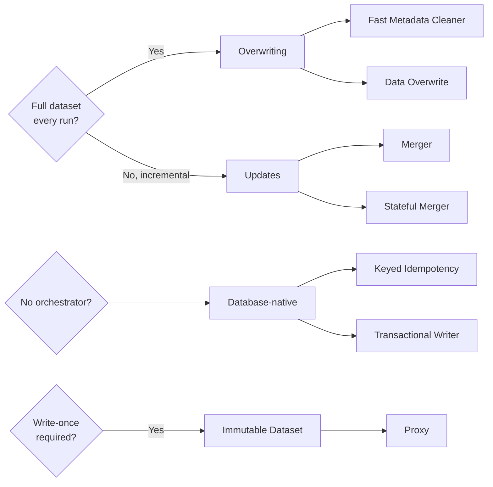

# Chapter 4 Cram Sheet — Idempotency Design Patterns

*Last-2-days-before-the-interview version. 7 patterns, 4 families, no fluff.*

## The one-liner

> Idempotency = no matter how many times a job runs (retry, backfill, replay), the output stays consistent — duplicate-free, or with duplicates you can clearly identify. Named after `absolute(-1) == absolute(absolute(absolute(-1)))`.

## The 4 families — pick by asking yourself these questions

| Ask yourself | Family | Patterns |
|---|---|---|
| Do I get the FULL dataset every run? | **Overwriting** | Fast Metadata Cleaner, Data Overwrite |
| Only incremental changes? | **Updates** | Merger, Stateful Merger |
| No orchestrator (e.g. pure streaming)? | **Database-native** | Keyed Idempotency, Transactional Writer |
| Must data be write-once / immutable? | **Immutable Dataset** | Proxy |

---

## Pattern-by-pattern (2–3 lines each)

### 1. Fast Metadata Cleaner
- **Problem:** `DELETE` + `INSERT` idempotency slows down as the table grows (500GB–1.5TB scale).
- **Solution:** `TRUNCATE`/`DROP` on partitioned (e.g. weekly) tables — metadata-only, no table scan — exposed through one union view.
- **Gotcha:** Idempotency granularity = backfill granularity (backfill 1 day → rerun the whole week's creation step). Hits partition/table quotas (BigQuery 4K, Redshift 200K tables) at scale.

> **✅ Say this:** "TRUNCATE/DROP skip the table scan that makes DELETE slow — but the granularity I pick also becomes my backfill blast radius."

### 2. Data Overwrite
- **Problem:** Need full-dataset replace where metadata ops aren't available (object stores) or a single-table `INSERT OVERWRITE` fits better.
- **Solution:** Physically rewrite files — `DELETE`+`INSERT`, or the more concise `INSERT OVERWRITE` (no row-level selectivity).
- **Gotcha:** Data-level op — costly on big unpartitioned tables; deleted blocks may linger on disk until `VACUUM`.

> **✅ Say this:** "INSERT OVERWRITE is a full-table replace, not selective — pair it with partitioning or it gets slower every run."

### 3. Merger
- **Problem:** Only incremental CDC-style changes arrive; the target table must fully reflect the source, no dupes.
- **Solution:** `MERGE`/`UPSERT` — insert new rows, update matched rows, and handle deletes only as **soft deletes** (`is_deleted` flag) since MERGE has no native delete-on-missing.
- **Gotcha:** Needs a genuine unique key or backfills insert dupes instead of updating. Backfilling from an old point can transiently expose inconsistent rows until later runs catch up.

> **✅ Say this:** "Deletes have to be soft — a missing row in an incremental feed is invisible to MERGE, so hard deletes just can't be expressed."

### 4. Stateful Merger
- **Problem:** Merger can't restore to a *consistent* pre-backfill state — business wants the table rolled back before replay.
- **Solution:** Add a state table mapping `execution_time → table_version`. Backfill mode restores/truncates first, then merges, then updates state.
- **Gotcha:** Needs a versioned store (Delta/Iceberg time travel) + vacuum retention limits how far back you can go. Compaction eats a version number — must use *(current version − 1)*, not "previous run's version."

> **✅ Say this:** "Stateful Merger adds a version-tracking table so backfills roll back before re-merging — but I have to offset for no-data commits like compaction."

### 5. Keyed Idempotency
- **Problem:** Streaming pipeline writes sessions to a key-value store; retries must not duplicate.
- **Solution:** Generate the **same key** every retry from **immutable** attributes — use broker **append time** (Kafka: append time; Kinesis: approximate arrival timestamp), never event time.
- **Gotcha:** Event time is mutable — late data shifts the derived key across restarts, silently breaking idempotency. Kafka compaction is async, so dupes can be briefly visible; relational DBs need `MERGE` not `INSERT`.

> **✅ Say this:** "Key on append time, not event time — event time can shift under late data and produce a different key on restart."

### 6. Transactional Writer
- **Problem:** Spot-instance retries rewrite already-successful data; consumers see partial/duplicate records.
- **Solution:** `BEGIN` → write privately → `COMMIT` (visible) or `ROLLBACK` (discarded). Local (task-based) or whole-job transaction scope.
- **Gotcha:** Idempotency scope = **one transaction only** — a retry/backfill opens a *new* transaction that can happily duplicate already-committed data. Framework support uneven (Kafka transactions = Flink only, not Spark). Read-uncommitted readers can still see dirty data.

> **✅ Say this:** "Transactions guarantee all-or-nothing visibility, not duplicate prevention across retries — those are two different problems."

### 7. Proxy
- **Problem:** Legal requires every past version retained — can't overwrite in place anymore, but still need one exposition point.
- **Solution:** Write each run to a **new** versioned/timestamped table, revoke write access right after creation (WORM lock on object stores), expose the latest via a passthrough view.
- **Gotcha:** Not every DB has cheap views (manifest fallback is clunkier). Immutability must be enforced at the infra level too — a user with delete rights on internal tables can break the guarantee.

> **✅ Say this:** "Proxy gets write-once semantics by never reusing a physical location — each run's table is locked right after creation, and the view is the one stable thing clients query."

---

## Merger vs. Keyed Idempotency vs. Transactional Writer — don't confuse these

| | Prevents | Scope |
|---|---|---|
| **Merger** | Duplicate rows when combining incremental data | Whole dataset, via key match |
| **Keyed Idempotency** | Duplicate *writes* on retry | Per-record, via stable key generation |
| **Transactional Writer** | *Partial* writes becoming visible | Single transaction only — **not** across retries |

> **✅ Say this:** "Keyed Idempotency stops duplicate writes by converging retries on the same key. Transactional Writer stops partial writes from ever being visible. Neither one alone gives you both — that's why they're often paired."

---

## Cheat Grid — 5-minute scan

| Pattern | 1-line Problem | 1-line Solution | #1 Gotcha |
|---|---|---|---|
| **Fast Metadata Cleaner** | DELETE-based idempotency too slow at scale | TRUNCATE/DROP on partitioned tables + view | Granularity = backfill blast radius |
| **Data Overwrite** | Full replace, no metadata-op support | INSERT OVERWRITE / DELETE+INSERT | Costly at data level; needs vacuum |
| **Merger** | Only incremental changes available | MERGE with soft-delete flag | Needs a real unique key |
| **Stateful Merger** | Merger can't restore pre-backfill state | State table: execution_time → version | Compaction eats a version number |
| **Keyed Idempotency** | Retries must not duplicate writes | Key from immutable append time | Event time is mutable — breaks on restart |
| **Transactional Writer** | Retries expose partial writes | BEGIN...COMMIT/ROLLBACK | Scope = 1 transaction, not across retries |
| **Proxy** | Dataset must be write-once (compliance) | New versioned table + lock + view per run | Needs infra-level immutability enforcement |

---

## FAANG-style follow-ups to expect

- *"Merger vs. Fast Metadata Cleaner — when would you pick one over the other?"* → Full dataset available each run → overwrite family (simpler, no key needed). Only incremental → Merger (needs a unique key, handles soft deletes).
- *"How do you make a streaming job idempotent without an orchestrator?"* → Keyed Idempotency (key generation) + Transactional Writer (commit boundary) — often together.
- *"Your MERGE-based pipeline just got backfilled and now looks inconsistent — why?"* → Merger has no restore mechanism; it always merges against the *latest* state. That's exactly the gap Stateful Merger closes with its state table.
- *"Why not just use event time as your idempotency key?"* → It's mutable under late data — a job restart after a late record arrives produces a different key, silently breaking the guarantee. Use append/ingestion time instead.

## Further Reading
- Maxime Beauchemin, *"Functional Data Engineering: A Modern Paradigm for Batch Data Processing"* (2018)
- Delta Lake / Apache Iceberg / Apache Hudi docs — `OPTIMIZE`, time travel, versioning
