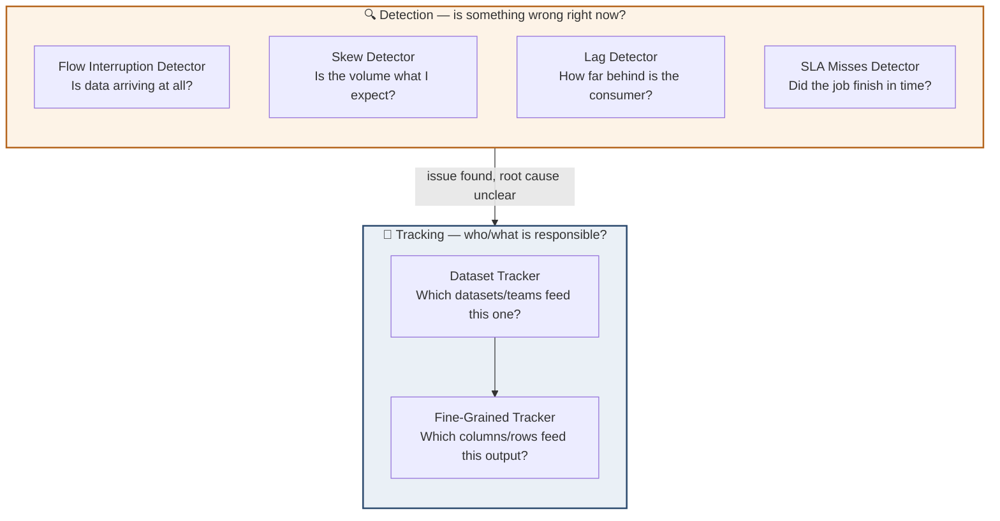
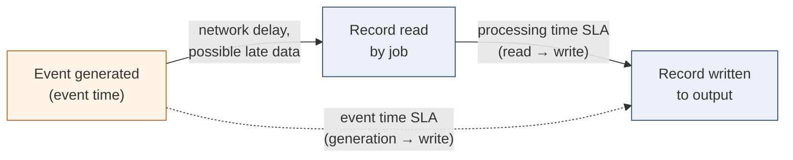
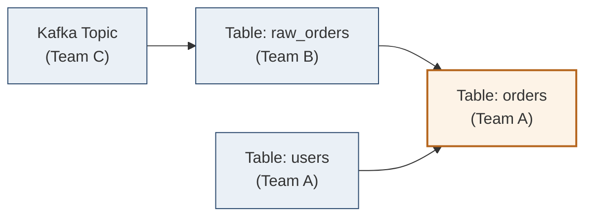

# Chapter 10 — Data Observability Design Patterns

## Chapter Framing

The Data Quality patterns from Chapter 9 (Audit-Write-Audit-Publish, Quality Observation,
Schema Consistency) protect the *content* of your datasets. But quality controls alone don't give
you end-to-end control of the stack. The book's own example: even a perfect AWAP job is useless
if it silently never runs at all — say, because of an upstream flow interruption you don't know
about.

Data observability design patterns fill that gap. They add **monitoring and alerting**
capabilities on top of quality controls, and rest on two pillars:

- **Detection** patterns — spot problems related to *data* or *time* (e.g., an AWAP job that
  didn't run, a batch job that's taking too long).
- **Tracking** patterns — understand the *relationships* among datasets, columns, and the
  processing layer, including across teams in large organizations.

This is the book's final content chapter, closing out the pattern catalog that began with
Ingestion in Chapter 2.

---

## Section A — Data Detectors

> **📌 Note**
> Data detectors analyze system health from the *data* standpoint — is data arriving at all, and
> is the volume of data what you'd expect?

### Pattern: Flow Interruption Detector

#### Problem

A streaming job synchronizing data to an object store — the source for many batch jobs owned by
different teams — ran fine for **seven months**. Then one day it processed input records without
writing them to the object store. The job itself didn't fail, so nobody noticed. The team only
found out when a **consumer complained** about missing new data. Relying on consumer complaints
is bad for your reputation, so the goal is a proactive detection mechanism for data unavailability.

#### Solution

Use the **Flow Interruption Detector** pattern. Implementation varies by processing mode:

**Stream processing** has two delivery modes:
- *Continuous data delivery* — you expect at least one record per unit of time (minute/second).
  Trigger an alert whenever no new data points register for that unit of time.
- *Irregular data delivery* — interruptions are expected and not necessarily errors, so a simple
  fixed threshold is less appropriate.

**Detection strategies across layers:**
- **Metadata layer** — enrich a table with a modification-time column and alert if the last
  update exceeds a threshold. If that's not possible, count rows per evaluation period and compare
  — e.g., for an hourly job, if the count doesn't change across two consecutive hours, that's a
  sign of interruption.
- **Storage layer** — works with any file format (raw JSON or advanced table formats). Monitor
  the time the last file was written and alert if there's no update within the expected threshold.

#### Consequences

- **Threshold** — finding the right threshold for per-minute/per-window checks is hard.
  "At least one record per minute" is easy to pick but may be unrealistic at higher volumes.
  Using historical volume to set the threshold is tempting but has a gotcha: it can generate
  **false positives** when, for example, a marketing operation drives unusually high activity.
- **Metadata** — cheap, but imperfect. The metadata layer (last modification time, row count)
  may not be available for your database at all. Even when it is, "modification" can include
  metadata-only changes like schema evolution that don't add new records — be careful evaluating
  this for flow interruption purposes.
- **False positives for storage** — beware housekeeping operations like **compaction**.
  Compaction creates new files but doesn't produce new *datasets* — it merges existing blocks.
  From the storage layer's perspective there's activity, but it doesn't represent flow
  continuity since the dataset content is unchanged.

> **✅ Say this out loud**
> "I chose a storage-layer or metadata-layer signal for flow interruption, but I explicitly
> excluded compaction-driven file writes from the check, because compaction creates activity
> without creating new data."

#### Examples

**Apache Kafka + Prometheus + Grafana** — evaluate incoming messages per minute:

```promql
sum without(instance)(rate(
  kafka_server_brokertopicmetrics_messagesin_total{topic="visits"}[1m]))
```

Configure an alert to fire when the last five values are all zero.

**PostgreSQL** — using `track_commit_timestamp` and `pg_xact_commit_timestamp`:

```sql
SELECT
  CAST(EXTRACT(EPOCH FROM NOW()) AS INT) AS "time",
  CAST(EXTRACT(EPOCH FROM NOW() - MAX(pg_xact_commit_timestamp(xmin))) AS INT) AS value
FROM dedp.visits_flattened
```

**Delta Lake producer** emitting a last-write-time metric to Prometheus:

```python
visits_to_write.write.format('delta').insertInto(get_valid_visits_table())

from prometheus_client import CollectorRegistry, Gauge, push_to_gateway
registry = CollectorRegistry()
metrics_gauge = Gauge('visits_last_update_time',
    'Update time for the visits Delta Lake table', registry=registry)
metrics_gauge.set_to_current_time()
metrics_gauge.set(1)
push_to_gateway('localhost:9091', job='visits_table_ingestor', registry=registry)
```

---

### Pattern: Skew Detector

#### Problem

After deploying the Flow Interruption Detector, consumers complained again — this time the batch
job ran fine but processed a **half-empty dataset**. The data provider confirmed a data generation
issue on their side. The goal: always process a *complete* dataset going forward.

#### Solution

**Skew** here means a pipeline processes meaningfully different data volumes across consecutive
runs (in addition to the more familiar "some tasks get more load than others"). The Skew Detector
pattern has three steps:

1. **Identify the comparison window** — e.g., for a daily batch job, compare today's dataset
   against yesterday's.
2. **Set a tolerance threshold** — e.g., 50% means the job tolerates 50% less or 50% more data
   than the previous window. Derive this from historical variation or by asking business users.
3. **Implement the skew calculation**, either:
   - **Window-to-window comparison** — percentage difference between two values; works for
     batch jobs and streaming apps comparing processing-time or event-time windows.
   - **Standard-deviation ratio** — `STDDEV(x)/AVG(x)`, useful for partitioned storage systems
     (a Kafka topic, a partitioned PostgreSQL table) where you measure deviation of each
     partition from the dataset mean.

> **🧩 Case Study**
> The Skew Detector is a strong fit for the **Audit** stage of the AWAP pattern from Chapter 9 —
> it acts as a guard that prevents a partial dataset from ever reaching the Write/Publish stages.

#### Consequences

- **Seasonality** — the single biggest challenge. A fixed "±50%" rule breaks down if a marketing
  campaign or a seasonal business (summer vs. winter volume) legitimately drives sustained
  variance. There's no simple fix — you need business knowledge to build comparison formulas and
  add exceptions for known-variable periods.
- **Communication** — even with a well-tuned threshold, false positives remain (e.g., a
  successful ad campaign). Mitigating this is more about synchronizing with other departments
  than writing more code.
- **Fatality loop** — a window-to-window comparison can compound failures. If today's dataset is
  3x smaller than yesterday's due to an upstream bug, and the bug isn't fixed by tomorrow,
  tomorrow's *correct* dataset will look "skewed" relative to today's broken one (3x larger).
  **Mitigation:** compare against the last *known-good* dataset (e.g., from the last successful
  run two days ago), not blindly against yesterday.

#### Examples

**PostgreSQL** — standard deviation ratio over partitioned tables:

```sql
SELECT
  NOW() AS "time", (STDDEV(n_live_tup) / AVG(n_live_tup)) * 100 AS value
FROM pg_catalog.pg_stat_user_tables
WHERE relname != 'visits_all_range' AND relname LIKE 'visits_all_range_%';
```

**Apache Kafka / Prometheus** — same ratio, applied to partition storage size:

```promql
stddev(sum(kafka_log_size{topic='visits'}) by (partition)) /
avg(kafka_log_size{topic='visits'}) * 100
```

**Apache Airflow** — window-to-window skew validation before loading to PostgreSQL:

```python
next_partition_sensor = FileSensor(...)

def compare_volumes():
    context = get_current_context()
    previous_dag_run = DagRun.get_previous_dagrun(context['dag_run'])
    if previous_dag_run:
        previous_execution_date = previous_dag_run.execution_date
        current_file_path = get_full_path(context['logical_date'], 'json')
        current_file_size = os.path.getsize(current_file_path)
        previous_file_path = get_full_path(previous_execution_date, 'json')
        previous_file_size = os.path.getsize(previous_file_path)
        size_ratio = current_file_size / previous_file_size
        if size_ratio > 1.5 or size_ratio < 0.5:
            raise Exception(f'Unexpected file size detected for the...')

volume_comparator = PythonOperator(task_id='compare_volumes',
    python_callable=compare_volumes)
transform_file = PythonOperator(...)
load_flattened_visits_to_final_table = PostgresOperator(...)

(next_partition_sensor >> volume_comparator >> transform_file
 >> load_flattened_visits_to_final_table)
```

---

## Section B — Time Detectors

> **📌 Note**
> Time detectors operate purely in the time dimension and help spot latency issues — often the
> earliest warning sign of upcoming data quality or availability problems.

### Pattern: Lag Detector

#### Problem

One week earlier, a streaming job processed **30% more data** than usual. The team missed the
alert email. Now a downstream consumer is complaining about slower data delivery, and they've
been promised "last time." Before scaling the system, the team needs to actually **measure** how
far the consumer is falling behind the producer.

#### Solution

1. **Define the lag unit** — depends on the data store: record position or append time for
   Kafka; commit number for Delta Lake; partition timestamp for a time-partitioned store.
2. **Define the comparison expression** — the difference between the most recently *processed*
   unit and the most recently *available* unit is the lag:

```python
last_available_unit = get_last_available_unit()
last_processed_unit = get_last_processed_unit()
lag = last_available_unit - last_processed_unit
```

3. **Choose an aggregation strategy for partitioned stores:**
   - `MAX` — surfaces the worst-case partition lag, even if only one partition is behind.
   - **Percentile** (P90/P95) — tells you that X% of partitions are within a given lag value.
   - You can combine both: percentile for overall latency, `MAX` for worst case.

> **⚠️ Warning — The Average Trap**
> Averaging hides outliers. For per-partition lags of 10, 5, 30, 2, 3, 5, and 3 seconds, the
> **average is 8 seconds**, but **P90 is 18 seconds** — meaning 90% of the data is processed
> within 18 seconds, not 8. Looking only at the average could wrongly suggest the job is healthy.
> Percentiles are more relevant than averages for lag detection.

#### Consequences

- **Data skew** — if you report lag as a single `MAX(...)` number, a poor result may have
  nothing to do with the consumer itself. If one partition is simply getting more load than
  others, the consumer naturally lags on it. The fix isn't consumer-side — it's better
  distribution of data at write time so consumers see even partitions.

#### Examples

**Apache Spark Structured Streaming** listener comparing processed vs. available offsets:

```python
class BatchCompletionSlaListener(StreamingQueryListener):
    def onQueryProgress(self, event: "QueryProgressEvent") -> None:
        latest_offsets_per_partition = self._read_last_available_offsets()
        visits_end_offsets = json.loads(event.progress.sources[0].endOffset)
        visits_offsets_per_partition: Dict[str, int] = visits_end_offsets['visits']
```

```python
registry = CollectorRegistry()
metrics_gauge = Gauge('visits_reader_lag', '...', registry=registry,
    labelnames=['partition'])
for partition, value in visits_offsets_per_partition.items():
    lag = latest_offsets_per_partition[partition] - value
    metrics_gauge.labels(partition=partition).set(lag)
push_to_gateway('localhost:9091', job='...', registry=registry)
```

**Delta Lake** — using the `availableNow` trigger and `DESCRIBE HISTORY`:

```python
visits_stream = spark_session.readStream.table('default.visits')
console_printer = (visits_stream.writeStream.trigger(availableNow=True)
    .option('checkpointLocation', checkpoint_dir)
    .option('truncate', False).format('console'))
console_printer.start().awaitTermination()
```

```python
last_version = query.lastProgress["sources"][0]["endOffset"]["reservoirVersion"]
registry = CollectorRegistry()
metrics_gauge = Gauge('visits_reader_version',
    'Last read version of the visits table', registry=registry)
metrics_gauge.set(last_version)
push_to_gateway('localhost:9091', job='visits_reader_version', registry=registry)
```

```python
# producer side: get last written version
last_written_version = (spark_session.sql('DESCRIBE HISTORY default.visits')
    .selectExpr('MAX(version) AS last_version').collect()[0].last_version)
```

The alert fires when the difference between last written and last read version exceeds threshold.

---

### Pattern: SLA Misses Detector

#### Problem

A batch job scheduled at **6:00 a.m.** must complete within **40 minutes**, because downstream
consumers need business statistics ready by **8:00 a.m.** The job is well optimized, but "the SLA
may be broken one day," and the team wants consumers automatically notified whenever it happens.

#### Solution

Compare processing time to the maximum allowed execution time. Implementation depends on mode:

- **Batch job** — simplest case: `end_time - start_time`. If greater than the SLA threshold,
  mark the run as an SLA miss and send a notification.
- **Streaming job, microbatch/windowed mode** — same subtraction technique, applied per iteration.
- **Streaming job, non-windowed mode** — measure the difference between reading and writing each
  record, then aggregate with `MAX` (worst delay) or a percentile (overall delay). Use the
  **Online Observer** or **Offline Observer** pattern (Chapter 9) to gather these metrics.

> **📌 Note**
> Lag Detector and SLA Misses Detector are **complementary, not interchangeable**. A consumer
> with throughput-limiting logic can respect its SLA every run while its *lag* against a skewed
> partition keeps growing. Conversely, a daily batch job can start with zero lag (thanks to its
> schedule) and still miss its SLA if it simply takes too long to run.

#### Consequences

- **Late data and event time** — processing-time SLAs are simple but don't capture end-to-end
  delay from data generation to processing. Event-time SLAs do, but they inherit the risk of
  **late data**: if a producer loses connectivity and delivers buffered data minutes later, the
  event-time SLA may be missed for reasons that are **not your fault** — while the processing-time
  SLA stays fine, since it only cares about how fast you process what's already arrived.
  **Mitigation:** monitor both — processing-time SLA (read time → write time) *and* event-time SLA
  (event generation time → write time) — since they measure different things.

#### Examples

**Apache Airflow** — task-level SLA:

```python
@task(sla=datetime.timedelta(seconds=10))
def processing_task_2():
    ...
```

> **⚠️ Warning**
> In Airflow 2.10.2, the SLA is computed from the **pipeline's execution start time**, not the
> task's own start time. For a pipeline scheduled at 08:00, if `processing_task_2` itself starts
> after 08:00:10, it is *already* considered late — even if the task hasn't been running long.
> (SLA refactoring is planned for a future Airflow release per AIP-57.)

**Apache Flink** — decorating records with a processing-start timestamp:

```python
def map_json_to_reduced_visit(json_payload: str) -> str:
    # ...
    return json.dumps(ReducedVisitWrapper(
        start_processing_time_unix_ms=time.time_ns() // 1_000_000, ...).to_dict())
```

Computing the processing-time SLA in a downstream Flink SQL job:

```sql
CREATE TEMPORARY TABLE reduced_visits (
  `start_processing_time_ms` BIGINT,
  `append_time` TIMESTAMP METADATA FROM 'timestamp' VIRTUAL
) WITH ('connector' = 'kafka', ...)
```

```python
sla_query: Table = table_environment.sql_query("""
SELECT
  append_time,
  ((1000 * UNIX_TIMESTAMP(CAST(append_time AS STRING)) +
    EXTRACT(MILLISECOND FROM append_time)) -
   start_processing_time_ms) AS time_difference,
  FLOOR(append_time TO MINUTE) AS visit_time_minute
FROM reduced_visits""")
```

Aggregating percentiles per one-minute window for alerting:

```python
sla_query_datastream  # ...
    .key_by(extract_grouping_key)
    .window(TumblingEventTimeWindows.of(Time.minutes(1)))
    .aggregate(aggregate_function=PercentilesAggregateFunction(),
               window_function=PercentilesOutputWindowFormatter())
```

---

## Section C — Data Lineage (Tracking)

> **📌 Note**
> Detection tells you *that* something's wrong. Lineage tells you **who to ask** when the root
> cause isn't yours — e.g., a late upstream event breaking your event-time SLA.

### Pattern: Dataset Tracker

#### Problem

A consumed dataset has poor quality — the batch job keeps failing because one field's data type
has been inconsistent over time. Investigation shows the **immediate upstream provider isn't the
root cause** — it's simply relaying data generated by *yet another* team further upstream. The
goal is a way to see the **dataset dependency chain** across teams, to find who actually
introduces the inconsistency.

#### Solution

The Dataset Tracker builds a **family tree of datasets** across the organization — the
dependencies between containers (tables, folders, topics, queues) and, by extension, between the
teams that own them.

> **🧩 Case Study**
> The book illustrates this with an `orders` dataset built from two other tables, which are in
> turn built on top of a Kafka topic — each dataset annotated with the team responsible for it,
> making cross-team ownership visible at a glance.

Two implementation paths:

1. **Fully managed / automated** — the dependency tree is built transparently by a cloud
   service or framework that analyzes jobs, tables, and dashboards. Examples: Databricks Unity
   Catalog lineage; GCP Dataplex for services like BigQuery and Dataproc.
2. **Self-managed** — identify inputs/outputs per query, task, or pipeline, at one of two levels:
   - **Data orchestration layer** — each pipeline reports its inputs/outputs to an external
     lineage service; some tools (e.g., Airflow with OpenLineage) detect this automatically for
     supported operators.
   - **Database layer** — a lineage job parses executed queries into a tree and extracts
     referenced tables (e.g., turning `SELECT ... FROM orders o JOIN users u ON u.id = o.user_id`
     into an `orders → users` edge).

A self-managed setup also needs a layer to **interpret and visualize** the extracted dependencies
— more flexible, but more infrastructure to maintain.

#### Consequences

- **Vendor lock** — fully managed solutions (Databricks, GCP Dataplex) typically only see
  within their own service boundary. Mixing in open source stores or other clouds gets you only a
  **partial view** of the lineage.
- **Custom work** — orchestration frameworks can often auto-deduce input/output from built-in
  task types, but **custom task types** require you to implement the input/output resolution
  logic yourself.

> **✅ Say this out loud**
> "We chose [managed lineage service] for lineage inside its own ecosystem, but we know it only
> gives us a partial view once data crosses into open source stores or another cloud — so we
> scoped our lineage guarantees accordingly rather than assuming full coverage."

#### Examples

**OpenLineage + Marquez** (open source) with Apache Airflow — set the endpoint and install the
provider package (`OPENLINEAGE_URL=http://localhost:5000`,
`apache-airflow-providers-openlineage`); native operators like `PostgresOperator` require no
further code — OpenLineage extractors do the rest.

**Apache Spark** with OpenLineage enabled via `SparkSession` config:

```python
def create_spark_session_with_open_lineage(app_name: str) -> SparkSession:
    return (SparkSession.builder.master('local[*]')
        .appName(app_name)
        .config('spark.extraListeners',
                'io.openlineage.spark.agent.OpenLineageSparkListener')
        .config('spark.openlineage.transport.type', 'http')
        .config('spark.openlineage.transport.url', 'http://localhost:5000')
        .config('spark.openlineage.namespace', 'visits')
        .config('spark.jars.packages', 'io.openlineage:openlineage-spark_2.12:1.21.1')
        .getOrCreate())
```

---

### Pattern: Fine-Grained Tracker

#### Problem

A team implemented the **Denormalizer** pattern (Chapter 8) to avoid costly joins, and the
resulting table has grown to **more than 30 columns over three years**. Team composition changes
often, and new members repeatedly ask which upstream columns compose each output column. The
Dataset Tracker answers *which tables* are involved, but not *which columns from those tables*
feed each output column.

#### Solution

The **Fine-Grained Tracker** provides column-level and row-level lineage detail.

**Column level:** some platforms support it natively — Databricks Unity Catalog's
`system.access.column_lineage` table, or Azure Purview. To implement it yourself, analyze the
query execution plan to trace dependencies per output column. For example:

```sql
SELECT CONCAT(u.first_name, d.delivery_address) AS user_with_address
FROM users u JOIN addresses d ON d.user_id = u.id
```

`user_with_address` traces back to `users.first_name` and `addresses.delivery_address`. Tools
like the OpenLineage framework often support this natively for engines like Apache Spark.

**Row level:** track *which job produced each row*, typically by adding this as an extra
attribute or column — leveraging the **Data Decoration** patterns (Chapter 5) to attach it.

#### Consequences

- **Custom code** — execution-plan analysis works well for native/standard mechanisms (SQL
  functions), but **custom programmatic transformations** (e.g., arbitrary mapping functions) are
  opaque boxes to the lineage framework — it can see the output but often can't interpret the
  logic that produced it.
- **Row-level visualization** — dataset- and column-level lineage are well supported by both
  extraction and visualization tooling; row-level lineage is not. It's genuinely useful for
  debugging data quality issues and pinpointing the job that wrote a bad row, but it won't
  integrate with standard lineage visualization tools — you need a **separate query layer** for it.
- **Evolution management** — the transformation logic behind a column today may change tomorrow.
  Your lineage solution (managed or custom) must track this evolution, or you risk showing an
  **incorrect origin** for a column after its upstream sources change.

#### Examples

**Row-level lineage** for two chained Spark Structured Streaming jobs, propagated via Kafka
record headers:

```python
# visits_decorator_job
(visits_to_save.withColumn('headers', F.array(
    F.struct(F.lit('job_version').alias('key'), F.lit(job_version).alias('value')),
    F.struct(F.lit('job_name').alias('key'), F.lit(job_name).alias('value')),
    F.struct(F.lit('batch_version').alias('key'), F.lit(str(batch_number)
        .encode('UTF-8')).alias('value'))
)))

# visits_reducer_job
(visits_to_save.withColumn('headers', F.array(
    # same as for visits_decorator_job, plus the parent's lineage
    F.struct(F.lit('parent_lineage').alias('key'), F.to_json(F.col('headers'))
        .cast('binary').alias('value'))
)))
```

The `visits_reducer_job` carries a `parent_lineage` attribute pointing back to
`visits_decorator_job`'s own headers — making the upstream source traceable and speeding up
debugging conversations with data producers.

---

## Diagrams

### Detection vs. Tracking — the two pillars of observability



### Processing-time SLA vs. event-time SLA



### Dataset Tracker — cross-team dependency graph



---

## Trade-off / Comparison Tables

### Lag Detector vs. SLA Misses Detector

| Pattern | When to Use | Trade-off |
|---|---|---|
| **Lag Detector** | You need to know how far a streaming/continuous consumer is behind the producer, per partition | Reporting via `MAX` can flag data skew as a "consumer problem" when it's really an uneven partition; percentiles avoid the "average trap" but add complexity |
| **SLA Misses Detector** | You need a hard guarantee that a job (batch or streaming) completes within a fixed time budget | Processing-time SLA is simple but blind to late-arriving data; event-time SLA captures true end-to-end delay but can fail for reasons outside your control (producer connectivity issues) |

### Dataset Tracker vs. Fine-Grained Tracker

| Pattern | When to Use | Trade-off |
|---|---|---|
| **Dataset Tracker** | You need the big-picture map of which tables/topics/teams feed which downstream datasets | Managed solutions (Databricks, Dataplex) are easy but locked to their own ecosystem; self-managed gives full coverage but requires building extraction + visualization yourself |
| **Fine-Grained Tracker** | You need to know exactly which upstream *columns* (or which job produced a specific *row*) compose an output column | Custom transformation logic is opaque to automated column lineage; row-level lineage needs its own query layer since it doesn't integrate with standard visualization tools |

### Metadata-layer vs. Storage-layer Flow Interruption Detection

| Approach | When to Use | Trade-off |
|---|---|---|
| **Metadata layer** (last-modified column, row counts) | Data store exposes reliable modification metadata | Cheap, but metadata may not exist for your store, or may change on schema-only edits with no new rows |
| **Storage layer** (last file write time) | Any file-format store, including raw JSON | Simple and format-agnostic, but housekeeping operations like compaction create false "activity" without new data |

---

## Gotchas (Chapter-Level Round-Up)

- **Flow Interruption Detector** — threshold tuning is genuinely hard; historical-volume
  thresholds cause false positives during real traffic spikes (e.g., marketing campaigns);
  compaction can fake storage-layer "activity."
- **Skew Detector** — seasonality can invalidate a fixed tolerance band; false positives require
  cross-team communication, not just code, to resolve; a failed run can trigger a **fatality loop**
  where the next good run looks "skewed" relative to the bad one — compare against the last
  *known-good* run instead.
- **Lag Detector** — `MAX`-based lag reporting can misattribute partition skew as a consumer
  performance problem; averages hide the true worst-case tail — use percentiles.
- **SLA Misses Detector** — event-time SLAs can be missed for reasons outside your control (late
  data from a disconnected producer); Airflow's SLA is measured from the **pipeline's** start
  time, not the individual task's start time.
- **Dataset Tracker** — managed lineage tools give only partial coverage once data crosses cloud
  or open-source boundaries; custom orchestration task types need manual input/output resolution.
- **Fine-Grained Tracker** — custom transformation code is a black box to automated column
  lineage; row-level lineage doesn't fit standard visualization tooling; lineage must track
  transformation *evolution* over time or it will report stale/incorrect origins.

---

## Special Notes

- **Tool-specific quirks:**
  - Apache Airflow's SLA mechanism (as of 2.10.2) computes lateness from the **DAG's execution
    start time**, not the task's own start — a task can be "late" before it has even run long.
    SLA refactoring is a planned Airflow 3.1 feature (AIP-57).
  - PostgreSQL's `track_commit_timestamp` configuration parameter enables
    `pg_xact_commit_timestamp`, used for both flow interruption and skew-adjacent queries.
  - Databricks Unity Catalog and Azure Purview offer **native column-level lineage**
    (`system.access.column_lineage`), reducing the need for custom execution-plan analysis.
  - OpenLineage + Marquez is the book's open-source reference stack for both dataset- and
    column-level lineage, with native support for Apache Airflow and Apache Spark.
- **Further reading (footnoted in this chapter):**
  - *Data Mesh* — Zhamak Dehghani (O'Reilly, 2022) — background on dataset tracking in a data
    mesh–driven organization.
  - *Implementing Data Mesh* — Jean-Georges Perrin and Eric Broda (O'Reilly, 2024).
  - OpenLineage project website and the Marquez Project GitHub repository.
  - "AIP-57 Refactor SLA Feature" — Apache Airflow improvement proposal for SLA handling.

---

## Cheat Sheet

| Pattern | Problem (1 line) | Solution (1 line) | Biggest Gotcha |
|---|---|---|---|
| **Flow Interruption Detector** | Job silently stops writing data; nobody notices until a consumer complains | Alert when no new data/metadata/file-write activity appears within a threshold window | Compaction and threshold-tuning both cause false positives |
| **Skew Detector** | Job runs successfully but processes an incomplete (partial) dataset | Compare volume across a window (window-to-window %, or stddev/avg ratio) against a tolerance threshold | Seasonality and "fatality loops" from comparing against a broken prior run |
| **Lag Detector** | Consumer silently falls behind the producer until someone complains about delivery speed | Measure `last_available_unit − last_processed_unit`; aggregate with MAX and/or percentile | Averages hide the real worst-case tail; MAX can misattribute partition skew to the consumer |
| **SLA Misses Detector** | A time-critical job might one day blow past its required completion time | Compare elapsed processing time (and/or event-time delay) against a defined SLA threshold | Event-time SLA misses can be caused by upstream late data, not your job |
| **Dataset Tracker** | Can't tell which upstream team/dataset introduced a data issue | Build a dependency tree of datasets (tables/topics/queues) across teams, managed or self-built | Managed tools only cover their own ecosystem; custom task types need manual wiring |
| **Fine-Grained Tracker** | Nobody knows which upstream columns/jobs produced a specific output column or row | Trace column lineage via execution-plan analysis; add row lineage via decoration/headers | Custom transformation code is opaque; row-level lineage needs a separate query layer |

---

## Further Reading

- *Data Mesh* by Zhamak Dehghani (O'Reilly, 2022)
- *Implementing Data Mesh* by Jean-Georges Perrin and Eric Broda (O'Reilly, 2024)
- OpenLineage project (openlineage.io) and the Marquez Project (GitHub)
- Apache Airflow "AIP-57 Refactor SLA Feature" proposal
