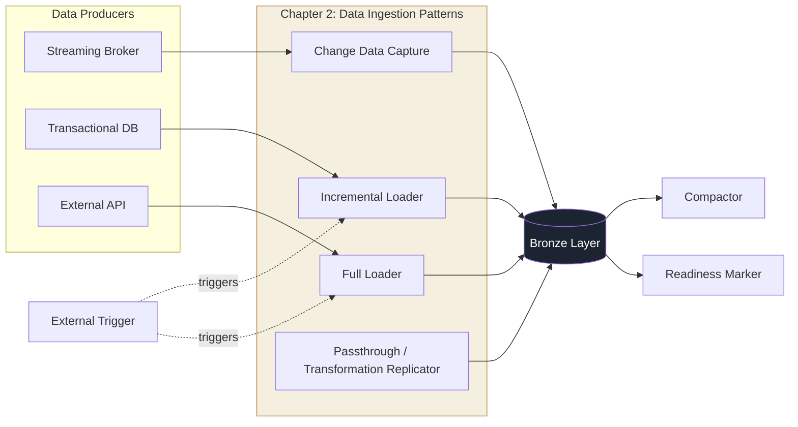
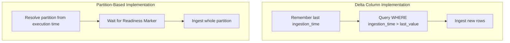
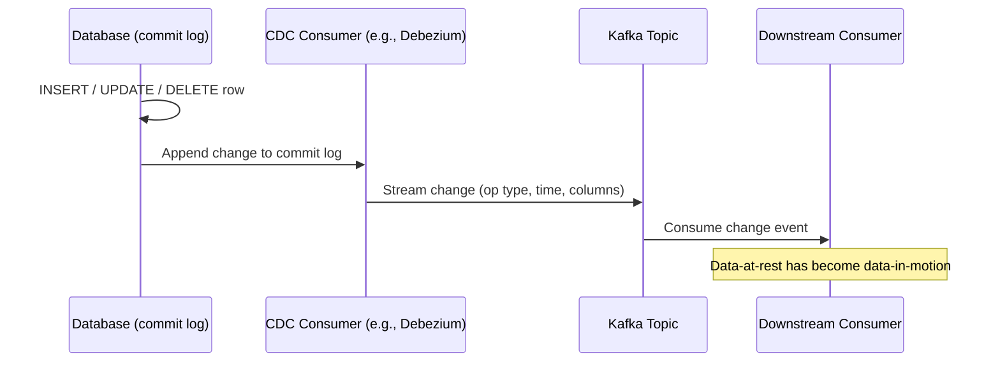
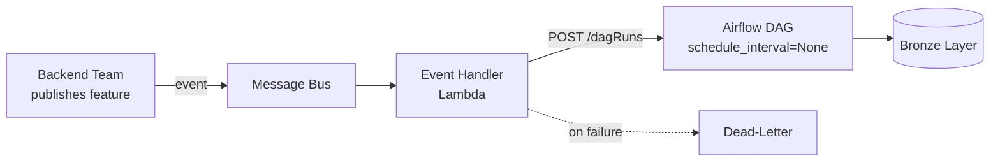

# Chapter 2 — Data Ingestion Design Patterns

## Chapter Framing

Data engineering systems are rarely data *generators* — their first stage is almost always data
*acquisition* from producers you don't control: other pipelines, other teams, or entirely
different organizations. Each producer comes with its own technical and business constraints, and
you have to adapt to them or you simply won't get the data you need to feed downstream analytics
and data science workloads.

This chapter covers the patterns for bringing data into your system across two axes:

- **How much to load** — the **Full Load** and **Incremental Load** families, for pulling all or
  part of a dataset.
- **How to copy data as-is (or nearly as-is)** — **Replication**, including privacy-safe variants.

It then moves into the operational mechanics of ingestion that aren't about moving data at all:
**Data Readiness** (when to start ingesting), **Data Compaction** (fixing the small-files problem),
and **Event Driven** ingestion via the **External Trigger** pattern (handling unpredictable data
arrival). Together, these patterns form the on-ramp to the Bronze layer of the book's Medallion
architecture case study — a blog analytics platform tracking visits and users.



> **🧩 Case Study** — The book's running example is a blog analytics platform. Most visit events
> arrive in real time via a streaming broker, but some legacy producers still write to a
> transactional database — this split is the exact scenario used to motivate the Incremental
> Loader and, later, Change Data Capture.

---

## Full Load

### Pattern: Full Loader

#### Problem
You're setting up the Silver layer for the case study. A transformation job needs extra device
information from an external data provider. The device dataset changes only a few times a week,
is a slowly evolving entity, and never exceeds **one million rows**. Critically, the data provider
defines **no "last updated" attribute** that would let you detect which rows changed since the
last ingestion.

#### Solution
The absence of a last-updated value makes **Full Loader** the ideal solution. The simplest
implementation is a two-step **extract and load (EL)** job (also called a **passthrough job**,
since data simply passes through unchanged) using native data-store commands to move data between
homogeneous stores — no transformation needed.

When source and destination are **heterogeneous**, you need a thin transformation layer between
extract and load, turning the job into an **ETL** pipeline, typically built on a data processing
framework with native connectors for various stores.

#### Consequences

**Data volume** — Full Loader jobs are usually scheduled batch jobs with roughly constant compute
needs for slowly growing datasets. A dataset that doubles overnight can make a statically
provisioned job slower or make it fail outright. Mitigate with **auto-scaling** in the data
processing layer.

**Data consistency** — A naive drop-and-insert overwrite creates two risks:
1. **Consumer-side partial reads.** If ingestion runs concurrently with consumer pipelines, readers
   may see partial or zero data. Transactions solve this automatically; without transactional
   support, use a **single data exposition abstraction** (e.g., a view) and swap references between
   hidden versioned tables.
2. **Loss of rollback capability.** A full overwrite destroys the ability to revert to a prior
   version unless you use a format with time travel (Delta Lake, Apache Iceberg, BigQuery) or
   implement the exposition-abstraction pattern yourself.

> **⚠️ Warning** — Although this chapter is framed around ingestion, every pattern here directly
> impacts downstream analytics and data science workloads, since they're the ones loading the data
> into the system.

> **✅ Say this out loud** — "We chose Full Loader because the provider gives us no delta signal —
> but we protect consumers from partial reads with a view-swap so ingestion never blocks or
> half-exposes the dataset."

#### Examples

```bash
# Example 2-1: Synchronization of buckets (homogeneous stores)
aws s3 sync s3://input-bucket s3://output-bucket --delete
```

```python
# Example 2-2: Extract-load with Apache Spark and Delta Lake
input_data = spark.read.schema(input_data_schema).json("s3://devices/list")
input_data.write.format("delta").save("s3://master/devices")
```

```sql
-- Example 2-3: Loading data to a versioned table
COPY devices_${version} FROM '/data_to_load/dataset.csv' CSV DELIMITER ';' HEADER;
```

```sql
-- Example 2-4: Exposing one versioned table publicly (view-swap pattern)
CREATE OR REPLACE VIEW devices AS SELECT * FROM devices_${version}
```

---

## Incremental Load

### Pattern: Incremental Loader

#### Problem
In the blog analytics case study, most visit events stream in real time, but some still land in a
transactional database via legacy producers. You need a dedicated ingestion process for the
Bronze layer that, due to continuously growing volume, **only integrates visits added since the
last execution**. Each visit event is immutable.

#### Solution
Two possible implementations, depending on input structure:

1. **Delta column** — uses a column (typically **ingestion time** for event-driven data) to
   identify rows added since the last run. Requires remembering the last-processed value.
2. **Time-partitioned datasets** — the job targets a whole new time-based partition each run
   (e.g., a job running at 11:00 targets the previous hour's partition). No need to remember state,
   since the partition to process is implicit from the execution time. Pair with the
   **Readiness Marker** pattern to confirm a new partition is safe to ingest.



> **⚠️ Warning — Be aware of real-time issues.** Using event time as a delta column is risky: your
> ingestion process might miss records if the producer emits late data for an event-time value you
> already processed.

#### Consequences

**Hard deletes** — Tricky for mutable data. If a producer *deletes* a row, it physically disappears
from the input — there's no delta-column trace of it. Mitigation: **soft deletes**, where the
producer marks rows removed via `UPDATE` instead of physically deleting them. An alternative is
**insert-only (append-only) tables**, which shift reconstruction responsibility onto consumers, who
must detect deleted/modified entries themselves.

**Backfilling** — Backfilling a delta-column pipeline effectively becomes a full load, requiring
more resources than a normal run. Mitigate by **limiting the ingestion window**:
`delta_column BETWEEN ingestion_time AND ingestion_time + INTERVAL '1 HOUR'`. This gives you (1)
predictable data volume even during backfills, and (2) the ability to run multiple concurrent
backfill jobs, as long as the input store supports it. Partition-based implementations don't suffer
this problem if the job processes one partition at a time.

> **✅ Say this out loud** — "We limit the ingestion window explicitly during backfills so a replay
> never silently turns into a full load — that keeps compute needs predictable and lets us
> parallelize backfill jobs safely."

#### Examples

```bash
# Example 2-5: Synchronization of S3 buckets by partition
aws s3 sync s3://input/date=2024-01-01 s3://output/date=2024-01-01 --delete
```

```python
# Example 2-6: Incremental Loader DAG (Airflow) — partition-based
next_partition_sensor = FileSensor(
    task_id='input_partition_sensor',
    filepath=get_data_location_base_dir() + '/{{ data_interval_end | ds }}',
    mode='reschedule',
)
load_job_trigger = SparkKubernetesOperator(application_file='load_job_spec.yaml')
load_job_sensor = SparkKubernetesSensor()
next_partition_sensor >> load_job_trigger >> load_job_sensor
```

```yaml
# Example 2-7: Partitioned events loader arguments
mainClass: com.waitingforcode.EventsLoader
mainApplicationFile: "local:///tmp/dedp-1.0-SNAPSHOT-jar-with-dependencies.jar"
arguments:
  - "/data_for_demo/input/date={{ ds }}"
  - "/data_for_demo/output/date={{ ds }}"
```

```python
# Example 2-8: Incremental Loader for a transactional (non-partitioned) dataset
load_job_trigger = SparkKubernetesOperator(
    application_file='load_job_spec_for_delta_column.yaml',
)
load_job_sensor = SparkKubernetesSensor()
load_job_trigger >> load_job_sensor
```

```python
# Example 2-9: Data ingestion job with delta column and time boundaries
in_data = (spark_session.read.text(input_path).select('value',
    functions.from_json(functions.col('value'), 'ingestion_time TIMESTAMP')))
input_to_write = in_data.filter(
    f'ingestion_time BETWEEN "{date_from}" AND "{date_to}"'
)
input_to_write.mode('append').select('value').write.text(output_path)
```

---

### Pattern: Change Data Capture (CDC)

#### Problem
The legacy visit events integrated via Incremental Loader must evolve: the ingestion rate is too
slow, and downstream consumers complain about excessive wait times. The requirement now is to
**capture each database change within 30 seconds** and publish it to a central streaming topic.

#### Solution
The latency requirement rules out Incremental Loader, which carries job-scheduling and query
overhead that makes 30-second latency hard to hit. **Change Data Capture** reads continuously from
the database's internal **commit log** — an append-only structure recording every row operation —
giving lower-level, faster access than any high-level query.

A CDC consumer streams these changes to a broker or other output; downstream consumers can keep
full change history or just the latest value per row. Because CDC intercepts **all** operation
types, including **hard deletes**, there's no need to ask producers to implement soft deletes.



#### Consequences

**Complexity** — Unlike Full Loader and Incremental Loader, which a data engineer can build alone,
CDC often needs operations-team involvement (e.g., enabling the commit log on database servers).

**Data scope** — Depending on the CDC client, you may only capture changes made *after* the client
started. For historical changes too, you must combine CDC with other ingestion patterns.

**Payload** — CDC records carry extra metadata (operation type, modification time, column type)
that consumers must learn to filter out or handle.

**Data semantics** — CDC turns data-at-rest into data-in-motion, which changes processing
semantics. A `JOIN` against two static tables that returns nothing means "no matching data." A
`JOIN` against two streaming CDC sources that returns nothing might just mean "the data hasn't
arrived yet" — the join could still succeed later. Don't treat CDC-ingested data as static.

> **📌 Note** — Lake-native formats support CDC more simply than a full Debezium setup. Delta Lake's
> built-in **change data feed (CDF)** can be enabled per-session or per-table.

#### Examples

```json
// Example 2-10: Debezium Kafka Connect configuration for PostgreSQL
{
  "name": "visits-connector",
  "config": {
    "connector.class": "io.debezium.connector.postgresql.PostgresConnector",
    "database.hostname": "postgres", "database.port": "5432",
    "database.user": "postgres", "database.password": "postgres",
    "database.dbname": "postgres", "database.server.name": "dbserver1",
    "schema.include.list": "dedp_schema",
    "topic.prefix": "dedp"
  }
}
```

*(PostgreSQL requires logical replication enabled with the `pgoutput` plug-in and a suitably
privileged user — one reason CDC's setup is heavier than Incremental Loader's.)*

```python
# Example 2-11: CDF setup in Delta Lake
spark_session_builder.config(
    'spark.databricks.delta.properties.defaults.enableChangeDataFeed', 'true'
)
spark_session.sql('''
CREATE TABLE events (
    visit_id STRING, event_time TIMESTAMP, user_id STRING, page STRING
) TBLPROPERTIES (delta.enableChangeDataFeed = true)''')
```

```python
# Example 2-12: CDF usage in Delta Lake
events = (spark_session.readStream.format('delta')
    .option('maxFilesPerTrigger', 4).option('readChangeFeed', 'true')
    .option('startingVersion', 0).table('events'))
query = events.writeStream.format('console').start()
```

```text
# Example 2-13: CDF table output (extra columns prefixed with _)
+-------------+-------------------+------------+---------------+--------------------+
| visit_id| event_time|_change_type|_commit_version| _commit_timestamp|
+-------------+-------------------+------------+---------------+--------------------+
| 1400800256_0|2023-11-24 01:44:00| insert| 6|2023-12-03 13:28:...|
```

*Row-level `_change_type` distinguishes `update_preimage` / `update_postimage` for updates on
mutable tables.*

---

## Comparison — Full Loader vs. Incremental Loader vs. CDC

| Pattern | When to Use | Trade-off |
|---|---|---|
| **Full Loader** | No delta/last-updated signal exists; dataset is small-to-moderate and slowly evolving | Simple, but costly and risky at scale — needs auto-scaling and a consistency strategy (view-swap or transactions) |
| **Incremental Loader** | Continuously growing, append-mostly dataset with a usable delta column or time partitions | Cheaper than full load, but struggles with hard deletes and can silently balloon into a full load during backfills |
| **Change Data Capture** | Low-latency requirement (seconds), or need native support for hard deletes | Lowest latency and full operation coverage, but highest setup complexity and requires treating output as data-in-motion |

---

## Replication

> **📌 Note — Data Loading vs. Replication.** Replication moves data between the *same* type of
> storage and ideally preserves all metadata (primary keys, stream offsets). Loading is more
> flexible and doesn't require homogeneous environments.

### Pattern: Passthrough Replicator

#### Problem
The deployment process has three environments: development, staging, and production. Many jobs
depend on a reference device-parameters dataset loaded daily from a third-party API. For a better
development experience, the same dataset should exist in dev/staging — but the API is **not
idempotent** (it can return different results per call), so simply replaying the loading pipeline
in each environment won't produce the same data as production. You need the *exact same* data.

#### Solution
A non-idempotent provider plus the need for cross-environment consistency is the textbook case for
**Passthrough Replicator**, implemented at either the compute level or the infrastructure level:

- **Compute-level (EL job)** — read then write, copying files/rows **as-is**, with no
  transformation, to avoid introducing quality issues like type coercion or floating-point
  rounding.
- **Infrastructure-level** — a replication policy document configuring input/output locations,
  letting the storage provider replicate on your behalf.

#### Consequences

**Keep it simple** — Use the simplest replication mechanism available (ideally a native data-copy
command). If you must use a processing framework for text formats like JSON, prefer the raw text
API over the JSON I/O API to avoid silent reinterpretation. If file count or filenames matter,
avoid distributed frameworks that don't let you control those properties.

**Security and isolation** — Cross-environment communication is error-prone. Prefer **push**
(the environment owning the data copies it out, controlling frequency/throughput) over **pull**, to
avoid destabilizing the source environment. Even push-based replication can cause side effects
(e.g., consuming the last available IP in a subnet, blocking other jobs).

**PII data** — If the replicated dataset contains PII that shouldn't leave production, use
**Transformation Replicator** instead (see next pattern).

**Latency** — Infrastructure-based implementations often add latency; check your cloud provider's
SLA before assuming it fits time-sensitive use cases.

**Metadata** — Don't ignore metadata; e.g., replicating only the Parquet files of a Delta Lake
table is not sufficient to make the table usable at the destination.

#### Examples

```python
# Example 2-15: Passthrough Replicator with an ordering guarantee (Kafka)
events_to_replicate = (input_data_stream
    .selectExpr('key', 'value', 'partition', 'headers', 'offset'))

def write_sorted_events(events: DataFrame, batch_number: int):
    (events.sortWithinPartitions('offset', ascending=True).drop('offset').write
        .format('kafka').option('kafka.bootstrap.servers', 'localhost:9094')
        .option('topic', 'events-replicated').option('includeHeaders', 'true').save())

write_data_stream = (events_to_replicate.writeStream
    .option('checkpointLocation', f'{get_base_dir()}/checkpoint-kafka-replicator')
    .foreachBatch(write_sorted_events))
```

```hcl
# Example 2-16: AWS S3 bucket replication with Terraform
resource "aws_s3_bucket_replication_configuration" "replication" {
  role   = aws_iam_role.replication.arn
  bucket = aws_s3_bucket.devices_production.id
  rule {
    id     = "devices"
    status = "Enabled"
    destination {
      bucket         = aws_s3_bucket.devices_staging.arn
      storage_class  = "STANDARD"
    }
  }
}
```

---

### Pattern: Transformation Replicator

#### Problem
Before releasing a new job version, you want to test against real data — synthetic data generators
can't replicate the data-quality issues the real provider exhibits. But the production dataset
contains **PII data not accessible outside production**, so a plain Passthrough Replicator job is
off the table.

#### Solution
**Transformation Replicator** adds a transformation layer between the classical read and write
steps of Passthrough Replicator. Depending on the stack, the transformation is either:

- A custom mapping function (Apache Spark, Apache Flink), or
- A SQL `SELECT` statement.

The transformation either **replaces** disallowed attributes (e.g., with the **Anonymizer**
pattern) or simply **removes** them if not needed downstream.

> **🧩 Case Study — Not only PII.** The book notes PII is only the most common case; protected
> health information (PHI) and intellectual property (IP) data need the same treatment.

#### Consequences

**Transformation risk for text file formats** — A seemingly innocent transformation (e.g., a
datetime format mismatch against your framework's standard) can silently drop timestamp columns and
fail the staging job. Mitigation: keep the "keep it simple" approach — define ambiguous columns as
plain strings rather than typed dates, and avoid silent transformations.

**Desynchronization** — Privacy fields change over time: new PII attributes appear, or previously
"safe" fields get reclassified. Mitigate by relying on a **data governance tool** (data catalog,
data contract) where sensitive fields are tagged, so transformation logic can be automated instead
of manually maintained.

> **✅ Say this out loud** — "We route PII removal through governance-tagged fields rather than a
> hardcoded column list, so a newly-classified PII attribute doesn't silently leak into staging."

#### Examples

```sql
-- Example 2-17: Dataset reduction with EXCEPT operator
SELECT * EXCEPT (ip, latitude, longitude)
```

```python
# Example 2-18: Dataset reduction with drop function
input_delta_dataset = spark_session.read.format('delta').load(users_table_path)
users_no_pii = input_delta_dataset.drop('ip', 'latitude', 'longitude')
```

```sql
-- Example 2-19: Column-level access control (AWS Redshift)
GRANT SELECT (visit_id, event_time, user_id) ON TABLE visits TO user_a
```

```python
# Example 2-20: Column-based transformation
devices_trunc_full_name = (input_delta_dataset
    .withColumn('full_name',
        functions.expr('SUBSTRING(full_name, 2, LENGTH(full_name))'))
)
```

```scala
// Example 2-21: Mapping function, strongly typed Scala Spark API
case class Device(`type`: String, full_name: String, version: String) {
  lazy val transformed = {
    if (version.startsWith("1.")) {
      this.copy(full_name = full_name.substring(1), version = "invalid")
    } else {
      this
    }
  }
}
inputDataset.as[Device].map(device => device.transformed)
```

---

## Comparison — Passthrough vs. Transformation Replicator

| Pattern | When to Use | Trade-off |
|---|---|---|
| **Passthrough Replicator** | Homogeneous environments, non-idempotent source, no sensitive data to strip | Simplest and safest, but cannot be used at all once PII/PHI/IP is present |
| **Transformation Replicator** | Same replication need, but PII/PHI/IP must be stripped or altered before leaving the source environment | More flexible, but introduces transformation risk (format bugs) and requires the PII field list to stay in sync with governance over time |

---

## Data Compaction

### Pattern: Compactor

#### Problem
A real-time ingestion pipeline syncs events from a streaming broker to an object store, aiming to
make data available to batch jobs within 10 minutes. It's a simple passthrough job that runs
without apparent issues — until, **three months later**, batch jobs start suffering from metadata
overhead: they spend **70% of execution time listing files** and only **30% actually processing
data**, due to the accumulation of many small files. This has a serious latency and cost impact
under pay-as-you-go pricing.

#### Solution
The small-files problem has existed since the Hadoop era and persists even in modern,
"virtually unlimited" object-store lakehouses: many small files mean longer listing operations and
heavier I/O for opening/closing files. **Compactor** solves this by merging smaller files into
bigger ones, reducing read-side I/O overhead.

Implementation varies by technology:
- **Apache Iceberg** — a *rewrite data file* action.
- **Delta Lake** — the `OPTIMIZE` command.
- **Apache Hudi** — merges row-format changes (from merge-on-read tables) into the columnar
  storage during compaction, unlike Iceberg/Delta Lake's homogeneous columnar approach.
- **Apache Kafka** — configuration-driven; compaction keeps only the most recent entry per key in
  an append-only, key-based log, actually *overwriting* present data rather than just reorganizing
  files.

#### Consequences

**Cost vs. performance trade-off** — Compaction is itself a compute-intensive job on big tables.
Running it rarely (e.g., once daily, off-hours) minimizes cost but means uncompacted jobs don't
benefit from the optimization in the meantime. There's **no one-size-fits-all** answer — sometimes
daily compaction is fine, sometimes the consumer impact of *not* compacting sooner outweighs the
extra ingestion cost.

**Consistency** — Compaction rewrites existing data, which can confuse consumers about which files
are "current" vs. "being compacted." This is far safer in ACID-transactional open table formats
(Delta Lake, Apache Iceberg) than in raw formats (JSON, CSV).

**Cleaning** — Compaction may **preserve the original small files**, meaning they continue to
impact metadata operations unless you also run a cleanup job (`VACUUM` in Delta Lake, Apache
Iceberg, PostgreSQL, Redshift) to reclaim the space. Choose your retention window carefully — you
may lose the ability to time-travel to versions based on the deleted, already-compacted files.

> **⚠️ Warning** — Compaction and cleaning are two separate jobs. Skipping the cleanup step leaves
> the small-files problem partially unsolved even after compaction runs.

#### Examples

```python
# Example 2-22: Compaction job with Delta Lake
devices_table = DeltaTable.forPath(spark_session, table_dir)
devices_table.optimize().executeCompaction()
```

```python
# Example 2-23: VACUUM in Delta Lake
devices_table = DeltaTable.forPath(spark_session, table_dir)
devices_table.vacuum()
```

---

## Data Readiness

### Pattern: Readiness Marker

#### Problem
An hourly batch job prepares data in the Silver layer, fully cleaned and enriched from a user
database and an external API. Other teams depend on it for ML models and BI dashboards, but they
frequently complain about **incomplete datasets** and want a mechanism to know — directly or
indirectly — when it's safe to start consuming the data.

#### Solution
Because logically dependent but physically isolated pipelines (owned by different teams) can't
directly trigger each other, you mark the dataset as ready with the **Readiness Marker** pattern.
Implementation depends on file format and storage organization:

1. **Flag file** — An event-based signal created after successful data generation. May be native
   to your processing layer (Apache Spark writes a `_SUCCESS` file for raw formats; Delta Lake
   writes a new commit log entry). If not native, generate it as a final orchestration task.
2. **Partition convention** — For time-partitioned data, readiness is implicit: if a job writes
   hourly partitions, a consumer waiting on partition 10 knows it's safe to read once partition 11
   has appeared.

#### Consequences

**Lack of enforcement** — Both implementations rely on **pull semantics** and convention, not
enforcement — nothing stops a consumer from reading mid-write. Mitigation: clear communication with
consumers about the readiness conditions and the risks of ignoring them.

**Reliability for late data** — If partitions are event-time based, late-arriving data breaks the
convention: if partitions 8, 9, and 10 are already "closed" and consumed, and late data for
partition 9 arrives afterward, consumers who already processed partition 9 as final won't
automatically pick up the correction. Mitigation: either treat partitions as **immutable once
closed**, or clearly define and share the mutability conditions with consumers, and notify them of
new data separately (see the book's Late Data patterns).

> **📌 Note** — The readiness marker should always be generated as the **last step** in a pipeline,
> after the final transformation.

#### Examples

```python
# Example 2-24: PySpark code generating the _SUCCESS file automatically
dataset = (spark_session.read.schema('...').json(f'{base_dir}/input'))
dataset.write.mode('overwrite').format('parquet').save('devices-parquet')
```

```python
# Example 2-25: FileSensor waiting for the _SUCCESS file (Airflow)
FileSensor(
    filepath=f'{input_data_file_path}/_SUCCESS',
    mode='reschedule',
    # ...
)
```

```python
# Example 2-26: Creating a Readiness Marker file as part of orchestration
@task
def delete_dataset():
    shutil.rmtree(dataset_dir, ignore_errors=True)

@task
def generate_dataset():
    # processing part, omitted for brevity

@task
def create_readiness_file():
    with open(f'{dataset_dir}/COMPLETED', 'w') as marker_file:
        marker_file.write('')

delete_dataset() >> generate_dataset() >> create_readiness_file()
```

> **📌 Note** — `mode='reschedule'` on the `FileSensor` matters: it frees the worker slot between
> checks instead of blocking it, so the orchestration layer isn't occupied just waiting on data.

---

## Event Driven

### Pattern: External Trigger

#### Problem
The backend team releases new features at most once a week (Monday–Thursday), each enriching a
reference dataset of website features. The refresh job currently runs **once a day regardless of
whether anything changed**, wasting compute. The backend team already sends a notification event
to a central message bus on every release — the goal is to run the pipeline **only** when there's
something new to process.

#### Solution
**Readiness Marker** relies on pull semantics (the consumer checks). Event-driven data favors
**push semantics** (the producer notifies). **External Trigger** has three steps:

1. **Subscribe to a notification channel** — connect your pipeline to the event source.
2. **React to notifications** — an event handler decides whether the event should trigger a
   pipeline or a job, optionally filtering by event type if the message bus doesn't do it natively.
3. **Trigger the ingestion pipeline** — start the workflow or job. One event typically triggers one
   pipeline, though triggering several is possible (e.g., one dataset feeding multiple workloads).

> **📌 Note — Not only trigger.** If there's no separate job to trigger, you can run the ingestion
> logic directly inside the notification handler — this is simply called event-driven data
> ingestion.

#### Consequences

**Push versus pull** — A **pull-based** trigger is a long-running job polling at short intervals —
technically valid but wasteful, since it spends most of its time finding nothing new. A
**push-based** trigger is better: the event source notifies the endpoint directly, and each
notification spins up a short-lived consumer instance.

**Execution context** — Don't let the trigger degenerate into a bare "ping" to the orchestrator.
Enrich the triggering call with metadata (trigger job version, notification envelope, processing
time, event time) — you'll need this context for day-to-day monitoring and failure investigation.

**Error management** — Since events are the sole driver of the pipeline, design the trigger for
failure so events are never silently dropped — typically by leaning on **Dead-Letter** (covered in
Chapter 3).

#### Examples

```python
# Example 2-27: Externally triggered DAG definition (Airflow)
with DAG('devices-loader', max_active_runs=5, schedule_interval=None,
         default_args={'depends_on_past': False}) as dag:
    # pipeline just copies the file from the trigger
    pass
```

```python
# Example 2-28: AWS Lambda handler to trigger the DAG
def lambda_handler(event, ctx):
    payload = {
        'event': json.dumps(event),
        'trigger': {
            'function_name': ctx.function_name,
            'function_version': ctx.function_version,
            'lambda_request_id': ctx.aws_request_id
        },
        'file_to_load': (urllib.parse.unquote_plus(
            event['Records'][0]['s3']['object']['key'], encoding='utf-8')),
        'dag_run_id': f'External-{ctx.aws_request_id}'
    }
    trigger_response = requests.post(
        'http://localhost:8080/api/v1/dags/devices-loader/dagRuns',
        data=json.dumps({'conf': payload}), auth=('dedp', 'dedp'), headers=headers)
    if trigger_response.status_code != 200:
        raise Exception(f"Couldn't trigger the `devices-loader` DAG. "
                         f"{trigger_response} for {payload}")
    else:
        return True
```

> **⚠️ Warning** — Example 2-28 hardcodes credentials for readability only. In real pipelines,
> apply the Chapter 7 data security patterns (e.g., Secretless Connector, Secrets Pointer) instead.



---

## Gotchas — By Pattern

- **Full Loader**
  - Rapidly growing datasets can outpace static compute — use auto-scaling.
  - Drop-and-insert overwrites risk consumer-visible partial data and loss of rollback — use
    transactions or a view-swap abstraction.
- **Incremental Loader**
  - Delta-column implementations can't see hard deletes — use soft deletes or insert-only tables.
  - Backfilling a delta-column pipeline can silently become a full load — bound the ingestion
    window explicitly.
- **Change Data Capture**
  - Requires operations-team-level setup (enabling commit logs) — heavier than the loaders.
  - CDC output is data-in-motion — joins and other "trivial" operations behave differently than
    on data-at-rest.
  - Client implementation may only capture changes from start-time forward — combine with another
    pattern for historical data.
- **Passthrough Replicator**
  - Any transformation (even accidental, via JSON/date parsing) risks quality issues — prefer raw
    copy commands.
  - Pull-based replication risks destabilizing the source environment — prefer push.
  - Cannot be used at all if the dataset carries PII — must switch to Transformation Replicator.
- **Transformation Replicator**
  - Schema-based transformations can silently drop or corrupt columns (e.g., datetime format
    mismatches) — keep transformations minimal and typed conservatively.
  - PII definitions drift over time — tie the transformation to a governed field list, not a
    hardcoded one.
- **Compactor**
  - No universally correct compaction frequency — it's a cost-vs-performance trade-off you must
    choose deliberately.
  - Compaction without a follow-up cleanup (`VACUUM`) leaves the original small files in place.
- **Readiness Marker**
  - Convention-based readiness (flag file or next-partition) is not enforced — a consumer can read
    mid-write regardless.
  - Late data breaks the "next partition means previous is done" convention unless partitions are
    treated as immutable or mutability rules are explicitly shared.
- **External Trigger**
  - Pull-based (polling) triggers waste resources — prefer push.
  - A trigger with no execution context becomes hard to debug — always pass metadata.
  - The pipeline lives or dies by event delivery — plan for dead-lettering failed invocations.

---

## Cheat Sheet

| Pattern | Problem (one line) | Solution (one line) | Biggest Gotcha |
|---|---|---|---|
| **Full Loader** | No delta signal to detect changed rows | Two-step EL/ETL job that reloads the entire dataset each run | Data consistency during overwrite (partial reads, lost rollback) |
| **Incremental Loader** | Growing dataset, only need what changed since last run | Delta column or time-partition based incremental read | Hard deletes are invisible; backfills can balloon into full loads |
| **Change Data Capture** | Sub-minute latency + need to capture hard deletes | Stream changes directly off the database commit log | High setup complexity; output is data-in-motion, not data-at-rest |
| **Passthrough Replicator** | Non-idempotent source needs identical copies across environments | Simple EL job or infra-level replication policy, no transformation | Can't be used if the data contains PII |
| **Transformation Replicator** | Same as above, but source has PII/PHI/IP | EL job with a transformation layer (mapping fn or SQL) to strip/alter sensitive fields | Schema-based transformations can silently corrupt data |
| **Compactor** | Millions of small files slow batch jobs to a crawl (70% time spent listing) | Merge many small files into fewer big ones (`OPTIMIZE`, rewrite action, etc.) | Needs its own cleanup job (`VACUUM`) or old files linger |
| **Readiness Marker** | Consumers read incomplete datasets | Flag file or partition convention signaling "done" | Convention isn't enforced; late data breaks partition immutability |
| **External Trigger** | Data arrives unpredictably; polling wastes resources | Push-based event subscription that triggers ingestion on arrival | Missing execution context or dropped events with no dead-letter path |

---

## Further Reading

- *Delta Lake: The Definitive Guide* by Denny Lee et al. (O'Reilly, 2024) — referenced for more on
  the Medallion architecture (Chapter 4 of that book).
- Chapter 3, *Error Management Design Patterns* — referenced as the natural complement to External
  Trigger's error-handling needs (Dead-Letter pattern).
- Chapter 7, *Data Security Design Patterns* — referenced for proper secrets management instead of
  hardcoded credentials shown in the External Trigger examples (Secretless Connector, Secrets
  Pointer).
