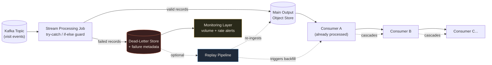
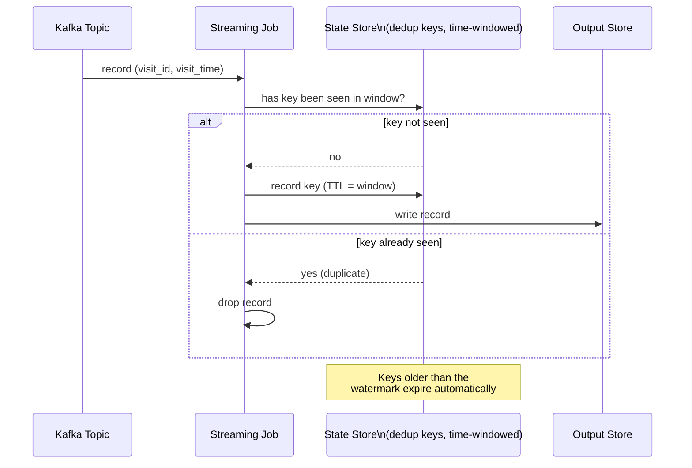
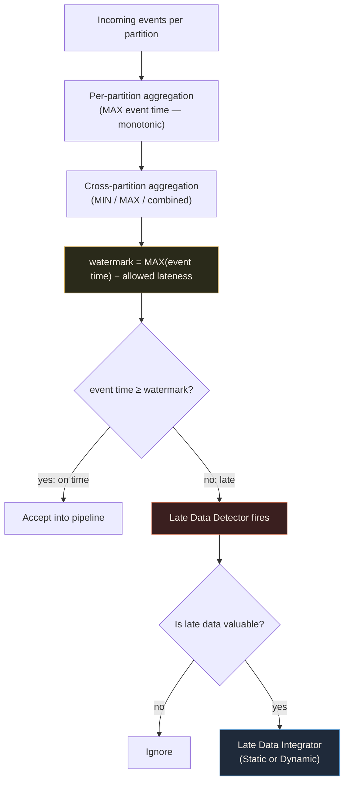
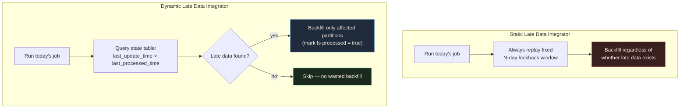
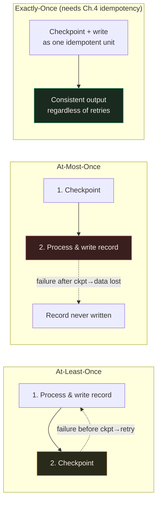

# Chapter 3: Error Management Design Patterns

> Source: *Data Engineering Design Patterns* by Bartosz Konieczny (O'Reilly, 2025)

## Chapter Framing

Error management is the next logical step after data ingestion (Chapter 2). Once data
is flowing into your system, you inherit every problem your upstream producers have:
unreliable networks that cause late delivery, retried deliveries that create duplicates,
and plain bad records that break your processing logic. This chapter groups patterns
into four problem areas, in the order the book presents them:

1. **Unprocessable records** — records that break your job outright.
2. **Duplicated records** — records delivered more than once.
3. **Late data** — records arriving after your pipeline has already moved on.
4. **Filtering** — human/logic errors in filter conditions that silently drop good data.
5. **Fault tolerance** — recovering a long-running (typically streaming) job's progress
   after a crash.

> **📌 Note**
> Error management does **not** guarantee perfectly valid or exactly-once data. It gives
> you the *feeling* of exactly-once delivery, but true exactly-once semantics require the
> Idempotency patterns in Chapter 4.

---

## Unprocessable Records

Data quality issues often cause **fatal failures** that stop the entire processing job —
a fail-fast approach that isn't viable for long-running streaming jobs.

> **📌 Note — Transient vs. nontransient errors**
> **Transient errors** are temporary and recover automatically (e.g., short database
> unavailability mitigated by connection retries). **Nontransient errors** never recover
> by themselves — unprocessable records ("poison pill" messages) are a classic example,
> and they require manual intervention.

## Pattern: Dead-Letter

### Problem

A stream processing job writes visit events from an Apache Kafka topic to an object
store. Data producers started generating unprocessable records, and the job began
failing. For **three consecutive days**, the fix was manual: relaunching the job and
altering processed offsets in the checkpoint files. That's not sustainable.

### Solution

Identify the places in the code where the job can fail (a custom mapping function, or an
error-safe transformation). Wrap the likely fail spots with a safety control — a
**try-catch block** for mapping functions, or an **if-else condition** for error-safe
transformations. Include the failed message as metadata (via the Metadata Decorator
pattern) to help post-analysis. Then configure a **different output destination** for
erroneous events.

When choosing the dead-letter destination, consider:
- **Resiliency** — you don't want to need a dead-letter strategy for your dead-letter store.
- **Monitoring ease** — you need to know when the job starts hitting errors and how many,
  to distinguish occasional issues from a systemic failure.
- **Writing performance** — writing unprocessed records to an extra place costs execution time.

Good candidates: cloud object stores or streaming brokers (highly available, fast, easy
to monitor). Optionally, complete the pattern with a **replay pipeline** that re-ingests
fixed records into the main flow — this step is optional if you don't care about past data.

A full Dead-Letter implementation contains: the error-handling logic, the dead-letter
storage, the monitoring layer, and (optionally) the replay pipeline.

The pattern is common in stream processing (one record at a time can go to dead-letter
storage) but is equally supported in batch, where a *subset* of erroneous records is
written at once rather than record-by-record.

### Consequences

- **Snowball backfilling effect** — If you run the optional replay pipeline, ingested
  records may belong to partitions already processed by downstream consumers. This
  forces a backfill on their part, which can cascade to *their* downstream consumers,
  and so on.
- **Ordering and consistency** — Replaying a failed delivery out of order breaks
  ordering guarantees. Example: records meant for 10:00, 10:01, 10:02 — if only the
  first and last succeed and you replay the failed one, the store ends up returning
  10:00, 10:02, 10:01.
- **Implementation for error-safe functions** — Error-safe functions return `NULL`
  instead of throwing. Instead of catching an exception, you must compare output to
  input — if input is present but output is `NULL`, that might indicate a processing
  error. You also need to understand each function's specific error-safety semantics,
  which differ across functions, making the pattern harder to implement on top of them.
- **Hidden errors** — Keeping the job running *hides* errors, which can mask a fatal
  failure that should have stopped the pipeline. Complete the implementation with an
  alerting layer that can stop the job if too many events are being dropped.

> **🧩 Case Study**
> The book's running example: a stream processing job writing Kafka visit events to an
> object store, failing repeatedly on unprocessable records until Dead-Letter is applied.

> **✅ Say this out loud**
> "Dead-Letter keeps my pipeline running through bad records, but it trades that
> resilience for hidden-error risk and a potential snowball backfilling effect on
> consumers — so I pair it with monitoring on dead-letter volume and an alerting
> threshold that can still stop the job if things go systemically wrong."

### Examples

**Apache Flink** — dead-lettering via *side outputs*:

```python
# source omitted for brevity
invalid_data_output: OutputTag = OutputTag('invalid_visits', Types.STRING())
visits: DataStream = data_source.map(MapJsonToReducedVisit(invalid_data_output),
Types.STRING())
```

```python
# MapJsonToReducedVisit snippet w/ reference to the side output
def map_rows(self, json_payload: str) -> str:
    try:
        evt = json.loads(json_payload)
        evt_time = int(datetime.datetime.fromisoformat(evt['event_time']).timestamp())
        # ... processing continues
    except Exception as e:
        # write to side output (dead-letter path)
        ...
```

```python
# Side output writing to Kafka
watermark_strategy = (WatermarkStrategy
    .for_bounded_out_of_orderness(Duration.of_seconds(5))
    .with_timestamp_assigner(VisitTimestampAssigner()))
data_source = env.from_source(source=kafka_source,
    watermark_strategy=watermark_strategy, source_name="Kafka Source"
    ).uid("Kafka Source").assign_timestamps_and_watermarks(watermark_strategy)
late_data_output: OutputTag = OutputTag('late_events', Types.STRING())
visits: DataStream = (data_source.map(map_json_to_visit)
    .process(VisitLateDataProcessor(late_data_output), Types.STRING()))
kafka_sink_valid_data: KafkaSink = ...
kafka_sink_late_visits: KafkaSink = ...
visits.get_side_output(late_data_output).sink_to(kafka_sink_late_visits)
visits.sink_to(kafka_sink_valid_data)
```

**Error-safe transformation (batch)** — writing valid and dead-lettered records separately:

```python
devices_to_load_with_validity_flag.persist()
(devices_to_load_with_validity_flag.filter('is_valid IS TRUE')
    .drop('is_valid').write.mode('overwrite')
    .format('delta').save(f'{base_dir}/output/devices-table'))
(devices_to_load_with_validity_flag.filter('is_valid IS FALSE')
    .drop('is_valid').write.mode('overwrite')
    .format('delta').save(f'{base_dir}/output/devices-dead-letter-table'))
```

> **⚠️ Warning**
> Implementing Dead-Letter without explicit failures in declarative languages like SQL
> is challenging — you end up with verbose, hard-to-maintain queries.

### Diagram — Dead-Letter Architecture & the Snowball Backfilling Effect



---

## Duplicated Records

Exactly-once delivery is rare in distributed systems; **at-least-once** is far more
common. If your logic must process each occurrence only once, you need deduplication.

## Pattern: Windowed Deduplicator

### Problem

A batch job processes visit events synchronized from a streaming layer to an object
store, exposing the data directly to business users. It must guarantee **exactly-once
processing** per distinct record — but the streaming layer frequently contains
duplicates due to automatic retries by data producers.

### Solution

1. **Identify deduplication attributes** that guarantee record uniqueness.
2. **Define the deduplication scope.** For batch jobs, this is usually the currently
   processed dataset (extending it to past datasets is possible but costs more compute
   and is slower).
3. For **streaming jobs**, which work on an unbounded set of records, the pattern
   simulates a "completed dataset" using **time-based windows**, retaining already-seen
   deduplication keys for the window's duration in a **state store**.

> **📌 Note — Windows in batch**
> Batch processing doesn't use an explicit window in code — it relies on an implicit
> global window covering the whole processed dataset. The pattern's name reflects this
> windowed *dataset* consideration, not necessarily an explicit windowing API.

Implementation differs by mode: batch jobs use a `DISTINCT` expression or a `WINDOW`
function with `row_number()`; streaming jobs must interact with a state store to check
whether a record has already been seen.

> **📌 Note — Three types of state store**
> - **Local** — data lives only in memory. Fastest, but state is lost on failure — risky for production.
> - **Local with fault tolerance** — primarily in memory, but persisted remotely. Persisting
>   at every iteration favors consistency over speed; persisting less often favors speed over consistency.
> - **Remote** — state lives only in a remote store. Naturally fault tolerant, but can hurt latency and/or cost.

### Consequences

- **Space vs. time trade-off** — Streaming pipelines are long-running and never "see"
  all the data at once, so deduplication uses a time-based window and only looks for
  duplicates within that period. A short window may miss duplicates but uses fewer
  resources; a longer window catches more duplicates but needs more resources to persist
  more unique keys in the state store.
- **Idempotent producer (not enough for exactly-once delivery)** — Correct
  deduplication doesn't guarantee exactly-once *delivery*. Transient errors and their
  automatic fixes (retries) can still reprocess already-successful writes. For true
  exactly-once delivery, you need an idempotency pattern from Chapter 4.

> **📌 Note — Automatic retries**
> Exactly-once *processing* only works if you don't hit runtime errors. A restarted job
> execution may reprocess already-processed records despite deduplication logic — this
> is often an accepted trade-off between automated transient-error handling and dedup.

> **✅ Say this out loud**
> "Windowed Deduplicator gives me exactly-once *processing* within a bounded window,
> not exactly-once *delivery* — if I need the latter, I pair it with an idempotency
> pattern, because dedup and idempotency solve different parts of the duplication problem."

### Examples

**Batch — Apache Spark `dropDuplicates`:**

```python
dataset = (session.read.schema('...').format('json').load(f'{base_dir}/input'))
deduplicated = dataset.dropDuplicates(['type', 'full_name', 'version'])
```

**Batch — plain SQL with `WINDOW`:**

```sql
SELECT type, full_name, version FROM (
    SELECT type, full_name, version,
        ROW_NUMBER() OVER (PARTITION BY type, full_name, version ORDER BY 1) AS position
    FROM duplicated_devices
) WHERE position = 1
```

**Streaming — Apache Spark Structured Streaming:**

```python
event_schema = StructType([StructField("visit_id", StringType()),
    StructField("visit_time", TimestampType())])
deduplicated_visits = (input
    .select(F.from_json("value", event_schema).alias("value_struct"), "value")
    .select("value_struct.visit_time", "value_struct.visit_id", "value")
    .withWatermark("visit_time", "10 minutes")
    .dropDuplicates(["visit_id", "visit_time"])
    .drop("visit_time", "visit_id"))
```

> **📌 Note**
> In the streaming example, the watermark serves double duty: it defines the late-data
> arrival boundary *and* controls how long the job remembers a given key so state doesn't
> grow indefinitely.

### Diagram — Windowed Deduplicator (Streaming) State Store Interaction



---

## Late Data

Late data sounds innocent but has serious pipeline impact.

## Pattern: Late Data Detector

### Problem

Blog visitors normally generate visit events in near real time (within 15 seconds), but
when users lose network connectivity, they buffer visits locally and flush them once
reconnected. The pipeline needs to detect these late events to apply a dedicated
strategy per use case (e.g., ignoring them).

### Solution

1. Define a **time-based attribute** to track lateness — describing when an event
   actually happened (its **event time**, as opposed to **processing time**, which is
   never late by definition).
2. Define a **latency aggregation strategy per partition** that must be **monotonically
   increasing** — it can never move backward. The common choice is the **MAX** function
   over event time per partition. Using **MIN** here risks a *stuck-in-the-past* situation.
3. Define an **additional aggregation strategy across all partitions** to represent
   overall progress:
   - **MIN** — follows the slowest upstream dependency; accepts more data as "on time"
     but buffers more.
   - **MAX** — follows the fastest upstream dependency; risks skipping the slowest
     source's records but reduces buffer/storage pressure.
   - **MIN and MAX combined at different levels** — for multiple partitioned sources,
     apply one function per-source and the other across sources.
4. Subtract an **allowed lateness** value from the tracked event time:
   `watermark = MAX(event time) − allowed lateness`. The watermark defines the minimum
   event time still considered "on time."

**Example watermark walk-through** (30-minute allowed lateness):

| Event times | Input watermark | Watermark candidate | Output watermark | Ignored records |
|---|---|---|---|---|
| 10:00, 10:05, 10:06 | – | MAX(10:00,10:05,10:06) − 30' = 9:36 | MAX(9:36) = 9:36 | – |
| 9:20, 9:31, 10:07 | 9:36 | MAX(10:07) − 30' = 9:37 | MAX(9:36, 9:37) = 9:37 | 9:20, 9:31 |

Once an event is detected as late, the simplest option is to ignore it. If late records
are still valuable, write them out with the **Late Data Integrator** pattern (next).

### Consequences

- **Late data capture support varies by framework** — Apache Spark Structured
  Streaming detects and ignores late events but doesn't expose an API to capture them.
  Apache Flink offers more flexibility for both detecting *and* capturing.
- **MIN strategy, stuck-in-the-past situations, and stateful jobs** — Using MIN for the
  partition-level tracker risks:
  - **Open-close-open infinite loop** — if the watermark moves to 10:30 and you emit
    all states older than that, then late records move it back to 9:00, you must reopen
    already-emitted "completed" states.
  - **Stuck in the past** (the most serious case) — if late data keeps arriving, the
    watermark may never progress, and buffered state grows indefinitely.
- **Max strategy and event skew** — In highly skewed environments, MAX can be too
  aggressive. Example: 4 of 5 data sources hit network issues and deliver 40 minutes
  later than the one healthy source. Because the watermark uses MAX, records from the
  slower sources are considered late and get dropped. **There is no silver bullet** —
  mitigate with late-event monitoring and reintegration via the Late Data Integrator
  patterns.

> **📌 Note — Event time vs. processing time**
> Event time indicates when the action happened; processing time indicates when the
> pipeline touched it. Processing time is never late.

> **✅ Say this out loud**
> "I use MAX for per-partition event-time tracking to guarantee monotonicity and avoid
> a stuck-in-the-past situation, but I'm aware that under high event skew, MAX can
> aggressively drop records from lagging sources — so I pair it with late-event
> monitoring rather than trusting the watermark blindly."

### Diagram — Watermark Progression & Late Record Detection



### Examples

**Apache Spark Structured Streaming — `withWatermark`:**

```python
visits_events = (input_data.selectExpr('CAST(value AS STRING)')
    .select(F.from_json('value', 'visit_id INT, event_time TIMESTAMP, page STRING')
    .alias('visit')).selectExpr('visit.*'))
session_window: DataFrame = (visits_events
    .withWatermark('event_time', '1 hour')
    .groupBy(F.window(F.col('event_time'), '10 minutes')).count())
```

**Apache Flink — bounded-out-of-orderness watermark strategy with a side output for
captured late events:**

```python
watermark_strategy = (WatermarkStrategy
    .for_bounded_out_of_orderness(Duration.of_seconds(5))
    .with_timestamp_assigner(VisitTimestampAssigner()))
data_source = env.from_source(source=kafka_source,
    watermark_strategy=watermark_strategy, source_name="Kafka Source"
    ).uid("Kafka Source").assign_timestamps_and_watermarks(watermark_strategy)
late_data_output: OutputTag = OutputTag('late_events', Types.STRING())
visits: DataStream = (data_source.map(map_json_to_visit)
    .process(VisitLateDataProcessor(late_data_output), Types.STRING()))
kafka_sink_valid_data: KafkaSink = ...
kafka_sink_late_visits: KafkaSink = ...
visits.get_side_output(late_data_output).sink_to(kafka_sink_late_visits)
visits.sink_to(kafka_sink_valid_data)
```

---

## Pattern: Static Late Data Integrator

### Problem

A daily job generates statistics from websites referring to blog posts. Results are
considered "approximate" for **15 days** because that's the maximum allowed delay for
late data — records older than that are skipped. The batch only processes the current
day and ignores any late data within the 15-day window. The team wants late data
included in the daily pipeline **without running 15 individual jobs separately each day**.

### Solution

Use a **fixed lookback window**: replay the last N days as part of every run so late
data gets folded back in automatically.

> **📌 Note — Easy solution for you, not for others**
> The easiest fix is switching to processing-time partitions — but if you (or downstream
> consumers) care about event time, this just moves the problem elsewhere. E.g., a
> processing-time partition for 9:00 might actually contain 80% data from 9:00, 10% from
> 8:00, and 10% from 7:00 — hiding the lateness rather than resolving it.

You can choose *when* to deliver late vs. current data relative to each other in the
pipeline ordering — deliver current data first if that priority matters to your consumers.

### Consequences

- **Snowball backfilling effect** — Same risk as Dead-Letter: if downstream consumers
  care about consistency, they must replay all partitions touched by late data, and
  their consumers may need to as well.
- **Overlapping executions and backfilling** — Because the lookback window is static,
  naively replaying multiple executions creates overlapping backfills. Example (4-day
  window):

  | Execution date | Executed dates |
  |---|---|
  | 2024-10-10 | 2024-10-09, 08, 07, 06 |
  | 2024-10-11 | 2024-10-10, 09, 08, 07 |
  | 2024-10-12 | 2024-10-11, 10, 09, 08 |

  You only need to restart the *last* execution (2024-10-12) to cover the full range —
  not all three.
- **Pipeline trigger** — Backfilling jobs must be part of the *main* pipeline; you
  can't run them as separate pipelines, or you'll hit the same overlapping-execution problem.
- **Waste of resources** — Fixed lookback periods don't always contain late data. Add a
  control task to only run integration when late data actually exists, or switch to the
  Dynamic Late Data Integrator.
- **Time requirement** — If the dataset isn't partitioned by time (no time concept),
  you can't detect or integrate late data with this pattern at all.

> **🧩 Case Study**
> A daily job generating blog-referral statistics, treated as "approximate" for 15 days
> because that's the allowed late-data window — the concrete anchor for this pattern.

### Examples

**Apache Airflow — Dynamic Task Mapping generates one backfill task per lookback day:**

```python
@task
def generate_backfilling_runs():
    dr: DagRun = get_current_context()['dag_run']
    backfilling_dates = []
    days_to_backfill = 2
    start_date_to_backfill = (dr.execution_date
        - datetime.timedelta(days=days_to_backfill))
    for days_to_add in range(0, days_to_backfill):
        date_to_backfill = start_date_to_backfill + datetime.timedelta(days=days_to_add)
        backfilling_dates.append(date_to_backfill.date().strftime('%Y-%m-%d'))
    return backfilling_dates
```

```python
@task
def integrate_late_data(late_date: str):
    copy_file(late_date)
    # ....

integrate_late_data.expand(late_date=generate_backfilling_runs())
```

```python
# Full workflow: load current day, then backfill via expand()
backfilling_runs_generator = generate_backfilling_runs()
(file_to_load_sensor >> load_current_file() >> backfilling_runs_generator >>
    integrate_late_data.expand(late_date=backfilling_runs_generator))
```

---

## Pattern: Dynamic Late Data Integrator

### Problem

The Static Late Data Integrator's 15-day lookback window is no longer enough. The
product owner now wants **all** late data included, even beyond the original 15-day
boundary — the pipeline needs to adapt without blindly replaying a fixed two-week window.

### Solution

Use a **dynamic lookback window**: only backfill partitions that genuinely contain late
data, tracked via a **state table** storing, per partition, the last processed time and
the last update time.

**State table example:**

| Partition | Last processed time | Last update time |
|---|---|---|
| 2024-12-17 | 2024-12-17T10:20 | 2024-12-17T03:00 |
| 2024-12-18 | 2024-12-18T09:55 | 2024-12-20T10:12 |

Query to find partitions needing backfill:

```sql
SELECT partition FROM state_table WHERE
`Last update time` > `Last processed time` AND `Partition` < `Processed partition`
```

After successfully processing data, the pipeline updates the last-processed time in the
state table (as part of the same pipeline). Some stores expose per-partition last-update
metadata natively — e.g., BigQuery's `INFORMATION_SCHEMA.PARTITIONS` view
(`last_modified_timestamp`), or Apache Iceberg's `last_updated_at` partitions-metadata
column. Otherwise, you must generate this information yourself.

> **📌 Note — Not whole partitions**
> If you can isolate the entities impacted by late data, you don't need to backfill full
> partitions — you can overwrite only the affected entities. This optimizes resource use
> but is more complex to implement.

### Consequences

- **Concurrency** — Concurrent pipeline executions can trigger duplicated late-data
  integration runs for the same partition. Mitigation: add an `Is processed` status
  column to the state table, filter it into the backfill query, and gate each pipeline's
  steps on the success of the *previous* run (`depends_on_past`-style dependency) to
  avoid race conditions:

  ```sql
  SELECT partition FROM state_table WHERE
  `Last update time` > `Last processed time` AND
  `Partition` < `Processed partition` AND
  `Is processed` = false
  ```

  > **⚠️ Warning**
  > If the task generating partitions to backfill fails, its dependency on the previous
  > run means future executions won't run either — the pipeline gets stuck in-progress
  > and needs manual intervention to unblock.

- **Stateful pipelines and very late data** — For stateful pipelines (e.g., built on
  the Incremental Sessionizer pattern), very late data can force regenerating a long
  chain of past executions to guarantee correctness — e.g., late data landing in a
  partition from a month ago forces replaying every execution since. A dynamic lookback
  window alone doesn't prevent heavy backfills when records arrive extremely late.
- **Scheduling complexity** — Coordinating state-table updates, backfill task
  generation, and concurrency-safe execution flags adds real pipeline complexity
  compared to the static approach.

> **✅ Say this out loud**
> "Static Late Data Integrator trades simplicity for wasted resources and a fixed
> lookback ceiling; Dynamic Late Data Integrator fixes both by tracking real late-data
> arrival in a state table, but it costs you scheduling complexity and a concurrency
> hazard you have to explicitly guard against with an 'is processed' flag."

### Examples

**Concurrency-safe backfill query, including task ordering requirements:**

```sql
SELECT partition FROM state_table WHERE
`Last update time` > `Last processed time` AND
`Partition` < `Processed partition` AND
`Is processed` = false
```

Pipeline adjustments required alongside this query:
- Each pipeline run starts by marking the current partition as `Is processed = true`,
  gated on the previous run's success.
- The task generating backfill partitions also marks retrieved partitions as processed,
  gated on its own previous-run success (prevents race conditions).
- The task updating "last processed time" also resets `Is processed` to `false`, so a
  partition that receives *new* late data can be replayed again.

---

## Static vs. Dynamic Late Data Integrator — Comparison

| Pattern | When to Use | Trade-off |
|---|---|---|
| **Static Late Data Integrator** | Late data has a known, fixed maximum delay (e.g., "late data arrives within 15 days") | Simple to reason about, but wastes resources on empty backfills, risks overlapping-execution bugs, and can't handle late data beyond the fixed window |
| **Dynamic Late Data Integrator** | Late-data arrival timing is unpredictable or exceeds any reasonable fixed window | Only backfills partitions that truly changed, but adds a state table, scheduling complexity, and a concurrency hazard requiring explicit "is processed" locking |

### Diagram — Static vs. Dynamic Late Data Integrator Flow



---

## Filtering

Errors aren't always technical failures — a human mistake in a filter condition can
silently drop good data.

## Pattern: Filter Interceptor

### Problem

A batch job on a distributed processing framework was recently updated. After release,
filtered data volume spiked from **15% to 90%**. It's unclear whether this is a data
issue or a software regression, and the execution plan doesn't help — the framework
optimizer **collapses multiple filter expressions into a single one**, so the plan only
shows total filtered rows, not per-condition statistics.

### Solution

Wrap each filtering condition with **counter logic** that increments when the condition
evaluates true (i.e., a record is filtered out by it), instead of just expressing the
raw condition. Gather all counters at the end of the job.

For **declarative languages like SQL**, this is more work: use a subquery or temporary
table that exposes each filter condition as its own column (e.g., `a_is_not_null`,
`b_is_not_abc`), then use those columns as filtering predicates in the main query.

> **📌 Note — Stay pragmatic**
> Use the right tool for the job. If the programmatic API suits the task better than
> SQL, use it — and vice versa.

### Consequences

- **Runtime impact** — Wrapping filter conditions costs execution time/resources, but
  the impact is typically small since counters are simple local structures. The SQL
  variant costs more, since you may need a temporary table to extract stats *and*
  actually filter before the final write.
- **Declarative languages** — SQL is less powerful here than a programmatic API; the
  programmatic API produces code that's easier to grasp and maintain over time.
- **Streaming** — Harder than SQL in some ways: the implementation may require turning
  a stateless job into a **stateful** one (adding state-management overhead), and you
  need to define time boundaries for the interceptor statistics — otherwise you can't
  relate stats to "now" or spot which filters are currently most active. Time-based
  processing windows can give trend visibility over the job's whole history.

> **✅ Say this out loud**
> "When a filter's selectivity suddenly jumps, the execution plan alone won't tell me
> which condition is responsible if the optimizer has collapsed them — Filter
> Interceptor wraps each condition with its own counter so I can isolate which rule
> changed behavior, at the cost of a small runtime overhead."

### Examples

**PySpark — accumulator-wrapped filter conditions:**

```python
@dataclasses.dataclass
class FilterWithAccumulator:
    name: str
    filter: Callable[[Any], bool]
    accumulator: Accumulator[int]

filters_with_accumulators = {
    'type': [
        FilterWithAccumulator('type is null', lambda device: device['type'] is not None,
            spark_context.accumulator(0)),
        FilterWithAccumulator('type is too short (1 chars or less)',
            lambda device: len(device['type']) > 1, spark_context.accumulator(0))
    ],
    # ...
}
```

```python
def filter_null_type(devices_iterator: Iterator[pandas.DataFrame]):
    def filter_row_with_accumulator(device_row):
        for device_row_attribute in device_row.keys():
            for filter_with_accumulator in filters_with_accumulators[device_row_attribute]:
                if not filter_with_accumulator.filter(device_row):
                    filter_with_accumulator.accumulator.add(1)
                    return False
        return True

    for devices_df in devices_iterator:
        yield devices_df[devices_df.apply(lambda device:
            filter_row_with_accumulator(device), axis=1) == True]

valid_devices = input_dataset.mapInPandas(filter_null_type, input_dataset.schema)
valid_devices.write.mode('append').format('delta').save(output_dir)
```

```python
# Reading accumulator values after job execution
for key, accumulators in filters_with_accumulators.items():
    for accumulator_with_filter in accumulators:
        print(f'{key} // {accumulator_with_filter.name} //
{accumulator_with_filter.accumulator.value}')
```

**SQL — filter conditions exposed as columns:**

```sql
SELECT * FROM (
    SELECT
        CASE
            WHEN (type IS NOT NULL) IS FALSE THEN 'null_type'
            WHEN (LEN(type) > 2) IS FALSE THEN 'short_type'
            WHEN (full_name IS NOT NULL) IS FALSE THEN 'null_full_name'
            WHEN (version IS NOT NULL) IS FALSE THEN 'null_version'
            ELSE NULL
        END AS status_flag,
        type, full_name, version
    FROM input) 
-- creates temp view input_with_flags

SELECT COUNT(*), status_flag FROM input_with_flags WHERE
status_flag IS NOT NULL GROUP BY status_flag
-- creates temp view grouped_filters

SELECT type, full_name, version FROM input_with_flags
WHERE status_flag IS NULL
-- writes valid records onward
```

---

## Fault Tolerance

Long-running streaming jobs need a way to resume without reprocessing everything from
the beginning after a crash — batch jobs can often lean on partition structure, but an
append-only streaming log has none of that built in.

## Pattern: Checkpointer

### Problem

A streaming job counts unique visits in 10-minute windows. Any fatal failure would stop
the job and force it to reprocess data from the very beginning. The team needs a
solution that persists progress as the query moves forward.

### Solution

The job must track its **most recent position** in the consumed data source, plus its
**computed state**, in storage more durable than the job's own runtime environment.

Two approaches for *where* progress is recorded:
- **Data processing framework–based** — the framework (e.g., Apache Spark Structured
  Streaming, Apache Flink) manages progress metadata in a resilient object store.
- **Data store–based** — you interact with the data store's SDK directly for checkpoint
  info, e.g., the Apache Kafka SDK persisting offsets to the `__consumer_offsets` topic,
  or Amazon Kinesis Client Library (KCL) writing checkpoints to a DynamoDB table.

Two approaches for *how* checkpointing executes:
- **Configuration-driven** — you configure checkpoint frequency and the library handles
  execution (Spark Structured Streaming, Flink).
- **Intentional/code-driven** — your code explicitly confirms the checkpoint after
  reading/processing records (e.g., a custom Kafka consumer using commit methods).

### Consequences

- **Delivery guarantee vs. latency trade-off** — Position tracking alone is cheap
  (small numeric offsets in memory, persisted occasionally). But checkpointing also
  applies to **state** in stateful applications (e.g., user sessions via Stateful
  Sessionizer), and state can be much larger, so tracking it has a real latency impact.
  More frequent checkpoints → slower job (checkpoint overhead) but less reprocessing on
  failure. Less frequent checkpoints → faster job, but more data to reprocess if it fails.
- **"Exactly-once feeling," not exactly-once delivery** — Checkpointing gives an
  *impression* of exactly-once delivery, not the real thing. Distributed jobs run
  multiple parallel, asynchronous tasks; if one fails mid-work before triggering a
  checkpoint, the restart involves retries that can reprocess already-successful
  records. **True exactly-once delivery requires an idempotency pattern (Chapter 4)** —
  checkpointing alone is not enough.

> **📌 Note — Delivery modes**
> - **Exactly once** — the ideal; achieved via idempotency patterns (Chapter 4).
> - **At least once** — checkpoint occurs *after* processing/writing; retries can
>   generate duplicates.
> - **At most once** — checkpoint occurs *before* processing; failures can lose data.

### Diagram — Checkpoint Timing and Delivery Mode



> **✅ Say this out loud**
> "Checkpointer gives me fault tolerance and an 'exactly-once feeling,' but distributed,
> asynchronous task execution means a mid-checkpoint failure can still replay
> already-successful writes — for true exactly-once delivery I'd combine it with an
> idempotency pattern from Chapter 4."

### Examples

**Apache Spark Structured Streaming:**

```python
write_query = (input_stream_data.writeStream.outputMode('update')
    .option('checkpointLocation', f'{base_dir}/checkpoint')
    .foreachBatch(synchronize_visits_to_files).start())
```

```text
$ cat /tmp/dedp/ch03/fault-tolerance/micro-batch/checkpoint/offsets/18
# omitted two irrelevant lines
{"visits":{"1":1276,"0":1224}}
```

> **📌 Note**
> Spark writes offsets at every job iteration. This regularity adds overhead but
> provides a stronger guarantee and less duplicate-processing risk on restart.

**Apache Flink — time-based checkpointing:**

```python
checkpoint_interval_30_sec = 30000
env.enable_checkpointing(checkpoint_interval_30_sec, mode=EXACTLY_ONCE)
(env.get_checkpoint_config().enable_externalized_checkpoints(RETAIN_ON_CANCELLATION))
```

`RETAIN_ON_CANCELLATION` keeps checkpoint files after a job failure (by default, Flink
removes them tied to job-instance cancellation/restart). The `EXACTLY_ONCE` checkpoint
mode affects stateful operations like windowed counters, guaranteeing each input record
reflects in the state exactly once — so a restart won't double-count.

> **📌 Note**
> Apache Spark 3.4.0 introduced experimental asynchronous checkpoints not tied to
> microbatches; as of the book's writing (2024) the open source version doesn't support
> state store for this feature.

---

## Gotchas — Chapter-Level Roundup

- **Dead-Letter**
  - Snowball backfilling effect on downstream consumers if you replay dead-lettered records.
  - Replaying out of order breaks ordering/consistency guarantees.
  - Error-safe functions (return `NULL` instead of throwing) make implementation harder
    — you must compare input vs. output, and semantics differ per function.
  - Keeping the job alive hides errors — pair with alerting that can still hard-stop on
    systemic failure.
- **Windowed Deduplicator**
  - Space vs. time trade-off in streaming: short windows miss dupes but save resources;
    long windows catch more but cost more state.
  - Deduplication ≠ exactly-once delivery; automatic retries can still create
    unremovable duplicates without an idempotency pattern.
- **Late Data Detector**
  - Not all frameworks support late-event *capture* (Spark Structured Streaming
    detects/ignores but doesn't expose capture; Flink does both).
  - MIN-based tracking risks open-close-open loops and getting permanently stuck in the past.
  - MAX-based tracking risks dropping records from skewed/slow sources entirely — no
    silver-bullet fix, only monitoring + reintegration.
- **Static Late Data Integrator**
  - Snowball backfilling effect (same root cause as Dead-Letter).
  - Overlapping backfills if you replay multiple executions naively — only the latest
    execution needs replaying.
  - Backfill tasks must live inside the main pipeline, not as separate pipelines.
  - Wastes resources on empty backfills unless gated by a control task.
  - Doesn't work at all without a time partitioning concept.
- **Dynamic Late Data Integrator**
  - Concurrency hazard: parallel runs can double-trigger (or miss) backfills without an
    "is processed" locking column.
  - Very late data in stateful pipelines can still force large-scale re-execution chains.
  - Adds real scheduling complexity versus the static version.
- **Filter Interceptor**
  - Small but nonzero runtime overhead from counter wrapping.
  - Much harder to implement cleanly in SQL/declarative languages than in a
    programmatic API.
  - Streaming implementations may require going stateful, plus defining time boundaries
    for meaningful stats.
- **Checkpointer**
  - Latency vs. delivery-guarantee trade-off scales with checkpoint frequency and state size.
  - Only gives an "exactly-once feeling" — true exactly-once needs Chapter 4's
    idempotency patterns on top.

---

## Cheat Sheet

| Pattern | Problem (one line) | Solution (one line) | Biggest Gotcha |
|---|---|---|---|
| **Dead-Letter** | Bad records crash the pipeline | Catch/redirect bad records to a separate dead-letter store | Snowball backfilling effect if you replay them |
| **Windowed Deduplicator** | Retries create duplicate records | Dedup within a batch dataset or streaming time window using a state store | Space vs. time trade-off; doesn't guarantee exactly-once delivery |
| **Late Data Detector** | Records arrive after the pipeline has moved on | Track event time with a monotonic (MAX-based) watermark per partition | MAX can drop records from skewed/slow sources |
| **Static Late Data Integrator** | Late data within a known fixed window is being lost | Always replay a fixed lookback window as part of every run | Wastes resources; snowball backfilling |
| **Dynamic Late Data Integrator** | Late data can arrive beyond any fixed window | Track real late-data arrival in a state table and backfill only what changed | Concurrency hazard without an "is processed" flag |
| **Filter Interceptor** | Can't tell which filter condition is silently dropping records | Wrap each filter condition with its own counter (or expose it as a SQL column) | Hard to implement cleanly in SQL; adds runtime overhead |
| **Checkpointer** | A crashed streaming job would reprocess everything from scratch | Persist offset + state progress to durable storage on a defined cadence | Only an "exactly-once feeling" — pair with idempotency for the real thing |

---

## Further Reading

- *Fundamentals of Data Engineering* (referenced elsewhere in the book for related
  data-quality foundations)
- Chapter 4, "Idempotency Design Patterns" — the direct sequel to this chapter's
  "exactly-once feeling" caveat; covers Keyed Idempotency, Sequencers, Isolated
  Sequencer, Manifest, and Transactional Writer.

---

*Next: Chapter 4 — Idempotency Design Patterns, which picks up exactly where this
chapter's Checkpointer and Windowed Deduplicator caveats leave off.*
