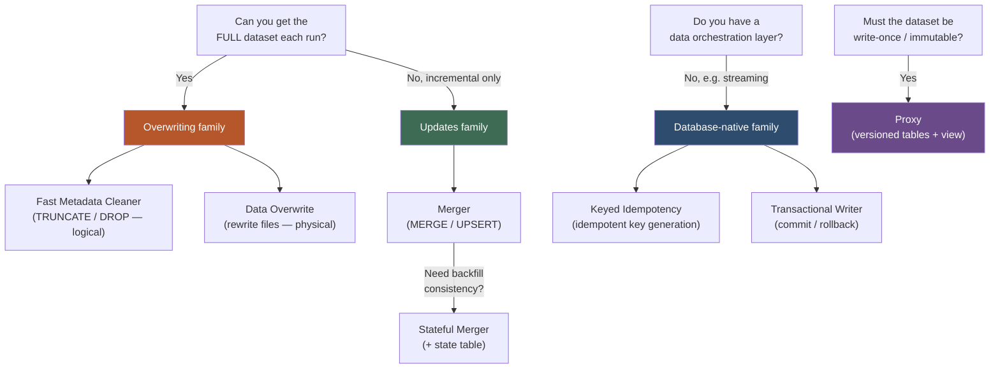
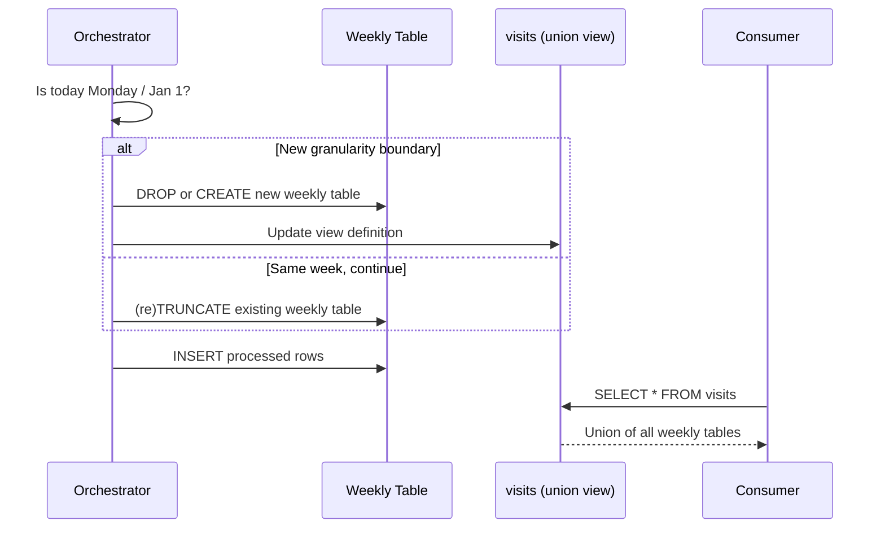
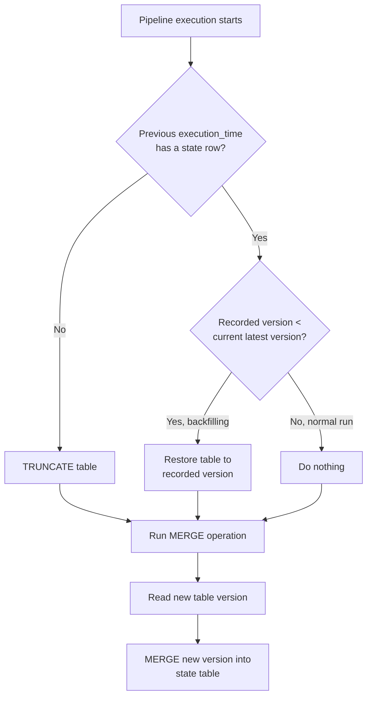
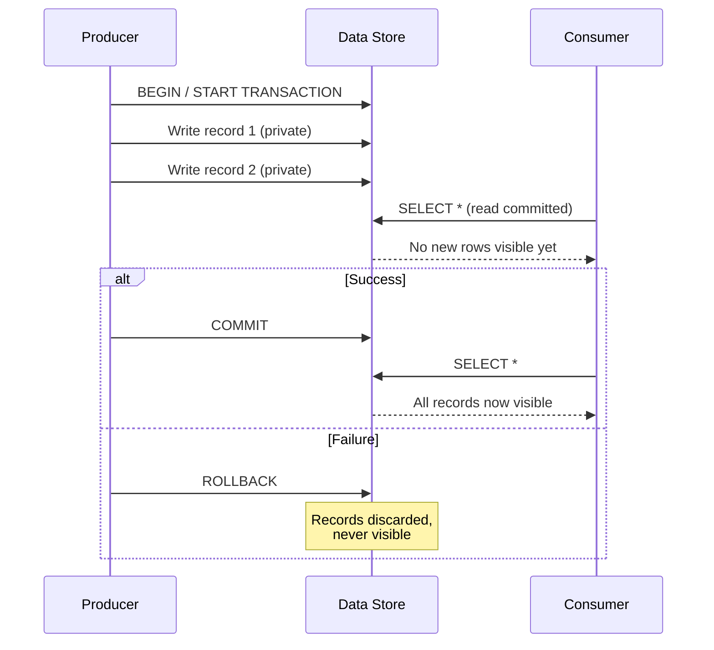

# Chapter 4 — Idempotency Design Patterns

*From "Data Engineering Design Patterns" by Bartosz Konieczny (O'Reilly, 2025)*

## Chapter Framing

Errors are inevitable, and Chapter 3's error-management patterns handle most of
the fallout — but not all of it. A retried task or job can replay writes that already
succeeded. Best case, you get duplicates a consumer can filter out. Worst case,
the duplicates are indistinguishable from the original records, and you have no
way to tell they represent the same data.

Idempotency is the fix. The book anchors the definition in the `absolute()`
function: `absolute(-1) == absolute(absolute(absolute(-1)))` — no matter how
many times you call it, you get the same result. Applied to data engineering,
idempotency means that no matter how many times a job runs (retry, backfill, or
manual replay), the output stays consistent — either free of duplicates, or with
duplicates you can clearly identify. The book credits Maxime Beauchemin for
popularizing the concept in data engineering with his 2018 article "Functional
Data Engineering: A Modern Paradigm for Batch Data Processing."

This chapter groups seven patterns into four families:

- **Overwriting** — remove and replace the whole dataset (Fast Metadata Cleaner, Data Overwrite)
- **Updates** — combine incremental changes into an existing dataset (Merger, Stateful Merger)
- **Database-native** — lean on the database itself for guarantees (Keyed Idempotency, Transactional Writer)
- **Immutable Dataset** — write-once semantics via an intermediary layer (Proxy)

---

## Pattern: Fast Metadata Cleaner

### Problem

A daily batch job processes between 500 GB and 1.5 TB of visits data events.
Idempotency is guaranteed with two steps: a `DELETE` that removes all rows
added by the previous run, followed by an `INSERT` of the newly processed rows.
This worked fine for three weeks, but as the table grew, the `DELETE` task's
performance degraded considerably. A more scalable, idempotent design is
needed for this continuously growing table.

### Solution

`DELETE` is often a two-step operation under the hood: identify the rows to
delete, then rewrite the affected data files. On large volumes this is slow.
`TRUNCATE TABLE` and `DROP TABLE` are **metadata operations** — they skip the
table scan entirely — and are the building blocks of this pattern.

> **📌 Note**
> `TRUNCATE TABLE table_a` is semantically equivalent to `DELETE FROM table_a`
> without conditions — both remove all records — but `TRUNCATE` doesn't perform
> a table scan, which is why it's classified as a metadata operation.

The trick is a mental shift: instead of one monolithic table, think of the dataset
as multiple physically isolated tables (e.g., weekly tables) exposed through a
single logical unit, like a view. The **idempotency granularity** — how the data
is partitioned into separate tables — directly determines what you can cleanly
clean and re-populate.

To implement it, the orchestration layer needs three extra steps:
1. **Decide the branch** — analyze the execution date to determine whether the
   pipeline should start a new idempotency granularity (e.g., it's Monday, start
   a new weekly table) or continue with the current one. The Exclusive Choice
   pattern fits here.
2. **Create the idempotency environment** — `TRUNCATE` (usually preceded by
   creating the context table) or `DROP` (usually followed by re-creating it).
3. **Update the exposition layer** — refresh the view/union that exposes the
   idempotency context tables. A `DROP`-based approach can error out for readers
   hitting the view mid-drop; an optional step can remove the table from the
   view first to avoid this.

> **🧩 Case Study**
> The book's blog analytics platform stores 52 weekly visits tables, unioned
> through a single view. The idempotency (and backfill) granularity is one
> week — that's the physical unit the metadata operations act on.

The pattern also applies to fully loaded (non-incremental) tables — simply
re-create the table on each load, or use the Data Overwrite pattern instead.

### Consequences

- **Granularity and backfilling boundary** — Replay must start from the task
  that creates the partitioned table, or you get an inconsistent dataset. If
  data is partitioned weekly and you need to backfill one day, you must rerun
  the *entire week's* creation step (though not necessarily every day's full
  pipeline — only the invalid day's loading step needs replay). Fine-grained
  backfills (one user, one provider) aren't supported — metadata operations
  always act on whole tables.
- **Metadata limits** — Data warehouses cap partitions/tables (e.g., GCP
  BigQuery: 4,000 partitions; AWS Redshift: 200,000 tables). Running this
  pattern across many pipelines can approach these limits quickly. Mitigation:
  add a **freezing step** that turns mutable idempotent tables into immutable
  ones on a longer cadence (weekly → monthly → yearly) once no more changes are
  expected. The pattern only works on stores supporting metadata operations
  (warehouses, lakehouses, relational DBs) — not object stores, where Data
  Overwrite is the fallback.
- **Data exposition layer** — The dataset no longer lives in one place. End
  users typically want a single access point, so you need a view or similar
  abstraction over the underlying tables.
- **Schema evolution** — Adding a new *optional* field requires a separate
  pipeline to backfill schema on existing tables (reprocessing is wasteful).
  Adding a new *required* field is easier: replaying past runs through the
  pattern naturally adds the field as those runs re-execute.

> **✅ Say this out loud**
> "TRUNCATE and DROP are metadata operations — they skip the table scan that
> makes DELETE slow on large tables — but the idempotency granularity they
> create also becomes my backfill granularity, so I have to choose partition
> size carefully."

### Examples

```python
# Apache Airflow: idempotency router with BranchPythonOperator
def retrieve_path_for_table_creation(**context):
    ex_date = context['execution_date']
    should_create_table = ex_date.day_of_week == 1 or ex_date.day_of_year == 1
    return 'create_weekly_table' if should_create_table else "dummy_task"

check_if_monday_or_first_january_at_midnight = BranchPythonOperator(
    task_id='check_if_monday_or_first_january_at_midnight',
    provide_context=True,
    python_callable=retrieve_path_for_table_creation
)
```

```python
# Table management branch
create_weekly_table = PostgresOperator(  # ...
    sql='/sql/create_weekly_table.sql'
)
recreate_view = PostgresViewManagerOperator(  # ...
    view_name='visits',
    sql='/sql/recreate_view.sql'
)
```

---

## Pattern: Data Overwrite

### Problem

*(Implicit companion problem to Fast Metadata Cleaner.)* You need a data
removal / idempotency approach that works even where metadata-only operations
(`TRUNCATE`/`DROP`) aren't supported or aren't the right fit — for example, an
object store, or a case where you want a single `INSERT OVERWRITE`-style
replace instead of managing multiple physical tables.

### Solution

Where the Fast Metadata Cleaner works at the logical/metadata level, Data
Overwrite works at the **physical data level** — it actually rewrites files.

The classic approach is `DELETE` followed by `INSERT`. A more concise
alternative is `INSERT OVERWRITE`, which replaces the whole table with the
result of the `INSERT`'s `SELECT`. The semantic difference: `INSERT OVERWRITE`
doesn't support selecting *which* rows to overwrite, unlike a `DELETE` +
`INSERT` combination.

> **📌 Note**
> The `INSERT` command doesn't require an explicit list of literal values — you
> can insert from a `SELECT` against another table, e.g.
> `INSERT INTO visits (id, v_time) SELECT visit_id, visit_time FROM visits_raw`.

Some stores support native data-loading overwrite commands (e.g., `LOAD DATA
OVERWRITE` in BigQuery); others need a preceding `TRUNCATE TABLE`. Running an
overwrite doesn't guarantee the old data disappears immediately — stores with
**time travel** (table file formats, BigQuery, Snowflake) keep the old data
blocks until the retention period expires or a vacuum operation reclaims space.

### Consequences

- **Data overhead** — On a big, unpartitioned dataset, overwrite performance
  degrades over time as there's more data to process on each run. Mitigation:
  partitioning and other storage optimizations reduce the volume touched per
  overwrite.
- **Vacuum need** — A `DELETE` may not remove data from disk immediately
  (table file formats, relational DBs keep dead blocks present but
  inaccessible). A vacuum process is needed to actually reclaim the space.

> **✅ Say this out loud**
> "INSERT OVERWRITE is simpler than DELETE+INSERT, but it's a full-table
> replace with no row-level selectivity, and on unpartitioned big tables the
> data-level rewrite is the real cost — that's why I'd pair it with
> partitioning."

### Examples

```sql
-- INSERT OVERWRITE example
INSERT OVERWRITE INTO devices SELECT * FROM devices_staging WHERE state = 'valid';
```

```bash
# BigQuery: loading data with a prior table truncation
bq load dedp.devices gs://devices/in_20240101.csv ./info_schema.json --replace=true
```

```python
# PySpark: overwriting data
input_data.write.mode('overwrite').text(job_arguments.output_dir)
```

> **⚠️ Warning**
> The Spark `overwrite` save mode is **not transactional by itself** — the
> guarantee depends entirely on the target data format. Modern table file
> formats address this because the delete becomes a new commit in the log and
> the underlying data files remain untouched until the commit succeeds.

---

## Pattern: Merger

### Problem

A pipeline manages a stream of changes synchronized from an Apache Kafka topic
via Change Data Capture. A new batch pipeline must replicate all changes into
an existing Delta Lake table so the table fully reflects the data source at any
given moment — no duplicates allowed.

### Solution

When the full dataset isn't available each run — e.g., you're only receiving
incremental changes — you need to **combine** new and existing rows rather than
overwrite. That's the Merger pattern, implemented with the `MERGE` (a.k.a.
`UPSERT`) command supported by most modern processing frameworks, table file
formats, and warehouses.

> **📌 Note**
> Idempotent processing for *fully available* datasets is simpler via one of
> the overwriting patterns (delete-and-replace). Merger is for incremental
> datasets where delete-and-replace isn't viable.

First, define the attributes that uniquely identify a row (a single key like
user ID, or a composite like visit ID + visit time). Then define behavior for
each scenario:

- **Insert** — the new dataset has a record absent from the current dataset.
- **Update** — both datasets have the record; the new dataset likely has an
  updated version.
- **Delete** — the trickiest case. Merger doesn't natively support deletes; a
  missing record in the new dataset does nothing. Deletes must be expressed as
  **soft deletes** (an `is_deleted` flag) so the merge logic can detect and act
  on them.

```sql
-- Implementation of soft deletes for the Merger pattern
MERGE INTO dedp.devices_output AS target
USING dedp.devices_input AS input
ON target.type = input.type AND target.version = input.version
WHEN MATCHED AND input.is_deleted = true THEN
  DELETE
WHEN MATCHED AND input.is_deleted = false THEN
  UPDATE SET full_name = input.full_name
WHEN NOT MATCHED AND input.is_deleted = false THEN
  INSERT (full_name, version, type) VALUES (input.full_name, input.version, input.type)
```

> **⚠️ Warning**
> The `is_deleted = false` condition on the `INSERT` branch is essential.
> Without it, a first run could insert already-removed records and you'd never
> be able to get rid of them.

### Consequences

- **Uniqueness** — The data provider (or your own generation job) must define
  immutable attributes that safely identify each record. Without this, backfill
  merges can insert new rows instead of updating existing ones, producing
  inconsistent duplicates.
- **I/O** — Unlike Fast Metadata Cleaner, Merger is a **data-based** pattern —
  it operates at the data-block level, which is more compute intensive. Modern
  databases and table file formats mitigate this by consulting metadata
  statistics first to skip irrelevant files.
- **Incremental datasets with backfilling** — Backfilling from an earlier point
  starts from the *most recent* version of the dataset, not the version as of
  that point in time — so consumers can briefly see rows that shouldn't exist
  yet during the backfill window, until the backfilled runs catch back up. This
  needs an external restore mechanism (ideally leveraging native table
  versioning / time travel) — solved properly by the **Stateful Merger**
  pattern below.

> **✅ Say this out loud**
> "Merger handles insert/update naturally through MERGE, but deletes have to be
> modeled as soft deletes with an is_deleted flag — otherwise a missing row in
> an incremental feed is invisible to the merge logic, and hard deletes just
> can't be expressed."

### Examples

```sql
-- Load new file into a temp table (auto-destroyed at end of transaction)
CREATE TEMPORARY TABLE changed_devices (LIKE dedp.devices);
COPY changed_devices FROM '/data_to_load/dataset.csv' CSV DELIMITER ';' HEADER;

-- MERGE operation
MERGE INTO dedp.devices AS d USING changed_devices AS c_d
ON c_d.type = d.type AND c_d.version = d.version
WHEN MATCHED THEN
  UPDATE SET full_name = c_d.full_name
WHEN NOT MATCHED THEN
  INSERT (type, full_name, version) VALUES (c_d.type, c_d.full_name, c_d.version)
```

---

## Pattern: Stateful Merger

### Problem

Changes were synchronized between two Delta Lake tables using the Merger
pattern. A week later, an issue was found in the merged dataset, and business
users need the dataset backfilled — but restored first to the last valid version
before any backfilling runs, since they care about consistency. Plain Merger
doesn't support this.

### Solution

Stateful Merger extends Merger with a **state table** that tracks, per
execution time, which version of the merged table was produced. The pipeline
gains two extra steps: a **restore** step at the start (only active during
backfilling), and a **state update** step at the end.

```sql
-- State table definition
CREATE TABLE IF NOT EXISTS `default`.`versions`
(execution_time STRING NOT NULL, delta_table_version INT NOT NULL)
```

Restore logic (only triggered in backfill mode — detected either via the
orchestrator's execution context, or by comparing table state):
- If no version exists for the prior execution time → **truncate** the table.
- If the previous run's recorded version differs from the table's current
  latest version → **roll back** to that recorded version.
- Otherwise → it's a normal run, do nothing.

After each merge, the newly created table version is written back to the state
table (itself via a `MERGE`, since backfills update an existing row and normal
runs insert a new one).

> **📌 Note**
> If your data store isn't versioned (no time-travel capability), adapt the
> pattern: load all raw data into a dedicated history table stamped with
> execution time, detect backfill mode by checking for rows with a *future*
> execution time relative to the current run, and rebuild via the Windowed
> Deduplicator pattern instead of a version rollback.

### Consequences

- **Versioned data stores** — The implementation as described requires a
  versioned store (each write creates a new table version), such as Delta Lake
  or Apache Iceberg. Non-versioned stores need the raw-history-table adaptation
  above.
- **Vacuum operations** — Versioned stores remove old files after a retention
  period, so old versions the state table points to can become unavailable.
  Mitigation: increase retention (raises storage cost) or accept that backfills
  beyond the retention window aren't possible.
- **Metadata operations** — Non-data operations like **compaction** still
  create a new table version. If the restore logic always uses "the previous
  run's recorded version," a compaction between runs will be missed. Fix:
  instead of using the previous run's version, use *(current execution's
  version − 1)* to correctly identify the version to restore to, accounting
  for no-data commits like compaction.

> **✅ Say this out loud**
> "Merger alone can't cleanly recover from backfilling because it only tracks
> the merge action, not table history. Stateful Merger adds a state table that
> maps execution time to table version, so a backfill can roll the table back
> to the last valid version before re-merging — as long as the store supports
> versioning and I account for no-data commits like compaction consuming a
> version number."

### Examples

```python
# Retrieve current and previous versions
last_merge_version = (spark.sql('DESCRIBE HISTORY default.devices')
    .filter('operation = "MERGE"')
    .selectExpr('MAX(version) AS last_version').collect()[0].last_version)
maybe_previous_job_version = spark.sql(f'''SELECT delta_table_version FROM versions
    WHERE execution_time = "{previous_execution_time}"''').collect()
```

```python
# Data restoration action
if not maybe_previous_job_version:
    spark.sql('TRUNCATE TABLE default.devices')
else:
    previous_job_version = maybe_previous_job_version[0].delta_table_version
    if previous_job_version < last_merge_version:
        current_run_version = (spark_session.sql(f'''SELECT delta_table_version FROM
            versions WHERE execution_time = "{currently_processed_version}"''')
            .collect()[0].delta_table_version)
        version_to_restore = current_run_version - 1
        (DeltaTable.forName(spark, 'devices').restoreToVersion(previous_job_version))
```

```python
# State table update after successful MERGE
last_version = (spark.sql('DESCRIBE HISTORY default.devices')
    .selectExpr('MAX(version) AS last_version').collect()[0].last_version)
new_version_df = (spark.createDataFrame([
    Row(execution_time=current_execution_time, delta_table_version=last_version)]))
(DeltaTable.forName(spark_session, 'versions').alias('old_versions')
    .merge(new_version.alias('new_version'),
           'old_versions.execution_time = new_version.execution_time')
    .whenMatchedUpdateAll().whenNotMatchedInsertAll().execute())
```

```sql
-- Compaction-aware version-to-restore adjustment
version_to_restore = version_for_current_execution_time - 1
```

---

## Pattern: Keyed Idempotency

### Problem

A streaming pipeline processes visit events to generate user sessions. The
logic buffers messages per user in a time window and writes the resulting
session to a key-value data store. Retries must not create duplicate sessions.

### Solution

For key-based stores, idempotency comes from the **key generation logic** on
the write side: generate the same key for the same logical entity every time,
regardless of how many times the write is retried.

Start by identifying immutable attributes to key on. If the natural key (e.g.,
user ID) would collapse multiple sessions into one, you need a composite key —
e.g., user ID + first visit time. But **event time is mutable**: late-arriving
data can shift what "first visit time" looks like across job restarts,
silently changing the derived key and breaking idempotency.

> **⚠️ Warning**
> Using a mutable timestamp (event time) in key generation is a trap. If a job
> restarts after an unexpected error and a late record for an earlier time has
> since arrived, the recomputed key differs from the original — a new session
> gets created instead of resuming the old one.

The fix: key on an **immutable** timestamp — the broker's **append time**
(Apache Kafka calls it *append time*; Amazon Kinesis Data Streams calls it
*approximate arrival timestamp*; at-rest stores often call the equivalent
*added time*, *ingestion time*, or *insertion time*). Because this value never
changes after the fact, the derived key stays stable across restarts and late
data.

```sql
-- WINDOW expression retrieving first recorded activity via ingestion_time
SELECT ... OVER (PARTITION BY user_id ORDER BY ingestion_time ASC, visit_time ASC)
```

The same key-generation strategy extends to file-based outputs: name a daily
batch job's output file by execution time (e.g., `20_11_2024`), so replays
always produce the same filename — applicable to partitions or even whole
tables if you can afford daily table creation.

### Consequences

- **Database dependent** — Works cleanly on key-based NoSQL stores (Cassandra,
  ScyllaDB, HBase). On relational databases, inserting a duplicate primary key
  errors instead of overwriting — you need a `MERGE` instead of a plain
  `INSERT`, adding the same complexity seen in the Merger pattern. On Apache
  Kafka (an append-only log with key support but no insertion-time
  deduplication), duplicates can be visible to consumers for a while until
  asynchronous compaction catches up — though at least they share the same key,
  making them identifiable.
- **Mutable data source** — Compaction can be configured to expire old events.
  If the specific event originally used for key generation gets compacted away
  before a job restarts, the job will derive its key from the next available
  record instead — logically breaking the idempotency guarantee (though this
  is arguably reasonable, since the underlying data genuinely changed shape).

> **✅ Say this out loud**
> "The idempotency guarantee lives entirely in the key-generation logic — key
> on an immutable attribute like Kafka's append time, not event time, because
> event time can shift under late data and silently produce a different key on
> restart."

### Examples

```sql
-- ScyllaDB table with a composite primary key
CREATE TABLE sessions (
  session_id BIGINT,
  user_id BIGINT,
  pages LIST<TEXT>,
  ingestion_time TIMESTAMP,
  PRIMARY KEY(session_id, user_id));
```

```python
# Spark Structured Streaming: visits grouping keyed on append time
(input_data.selectExpr('CAST(value AS STRING)', 'timestamp').select(F.from_json(
    F.col('value'), 'user_id LONG, page STRING, event_time TIMESTAMP')
    .alias('visit'), F.col('timestamp'))
    .selectExpr('visit.*', 'UNIX_TIMESTAMP(timestamp) AS append_time')
    .withWatermark('event_time', '10 seconds').groupBy(F.col('user_id')))
```

```python
# Idempotent session ID generation from the earliest append time in state
def map_visit_to_session(user_tuple, input_rows, current_state):
    session_expiration_time_50_seconds_as_ms = 50 * 1000
    user_id = user_tuple[0]
    if current_state.hasTimedOut:
        min_append_time, pages, = current_state.get
        session_to_return = {
            'user_id': [user_id],
            'session_id': [hash(str(min_append_time))],
            'pages': [pages]
        }
    else:
        ...  # accumulation logic
```

```python
# State accumulation: always keep the earliest append time
data_min_append_time = 0
for input_df_for_group in input_rows:
    data_min_append_time = int(input_df_for_group['append_time'].min()) * 1000
if current_state.exists:
    min_append_time, current_pages, = current_state.get
    visited_pages = current_pages + pages
    current_state.update((min_append_time, visited_pages,))
else:
    current_state.update((data_min_append_time, pages,))
```

```python
# Adapted for Amazon Kinesis Data Streams (approximateArrivalTimestamp)
(spark_session.readStream.format("kinesis")
    .load().selectExpr("CAST(data AS STRING)",
                        "approximateArrivalTimestamp AS append_time"))
```

> **📌 Note**
> You *can* define append time externally via an Apache Kafka producer, but
> it's riskier and less reliable than the broker-controlled mechanism. Check
> the `log.message.timestamp.type` topic attribute to see which strategy is
> active.

---

## Pattern: Transactional Writer

### Problem

A batch job runs on a cloud provider's unused compute capacity to cut costs —
60% savings on infrastructure. But whenever the provider reclaims a node,
running tasks fail and retry elsewhere. The rescheduling causes tasks to
re-write data already written, and downstream consumers see duplicates and
incomplete records. The job must never expose partial data.

### Solution

Lean on native database **transactions**: in-progress, uncommitted changes stay
invisible to downstream readers until an explicit commit.

Three steps:
1. **Initialize** the transaction (`START TRANSACTION` / `BEGIN`, explicit or
   handled implicitly by the processing layer).
2. **Write** the data — changes are recorded but remain private to the
   transaction.
3. **Commit** to make the data visible, or **rollback** to discard it if
   something went wrong.

Two implementation shapes depending on your processing model:
- **Standalone/ELT workloads** operating directly at the storage layer (e.g.,
  BigQuery, Redshift, Snowflake) — the transaction is declarative and fully
  managed by the data store.
- **Distributed ETL jobs** — multiple tasks write in parallel to the same
  output, and you have two choices:
  - **Local (task-based) transaction** — each task commits independently. Fine
    without retries, risky with them (see Consequences).
  - **Whole-job transaction** — the job opens the transaction before any task
    runs and commits only once all tasks finish. Stronger guarantee, harder to
    achieve. (E.g., Spark + Delta Lake commits when the writer creates a new
    commit-log entry; if that step fails, orphaned data files need cleanup.)

> **⚠️ Warning**
> Even with writer-side transactions, a reader using the **read uncommitted**
> isolation level can still see records from a transaction that later rolls
> back — a classic **dirty read**.

Supported across modern table file formats (Delta Lake, Apache Iceberg, Apache
Hudi), streaming brokers (Apache Kafka), warehouses (Redshift, BigQuery), and
RDBMSes (PostgreSQL, MySQL, Oracle, SQL Server) — but distributed processing
framework support is uneven: table file formats integrate well with both Flink
and Spark, while Kafka's transactional producers are only available from Flink.

### Consequences

- **Commit step** — Two extra steps (open + commit) plus conflict resolution
  at both stages add latency. Raw formats (JSON, CSV) expose files immediately;
  transactional formats (Delta Lake) only become visible once the commit log
  entry is written — so consumers wait for the *slowest* task to finish. This
  coordination overhead is the cost of guaranteeing only complete datasets are
  ever visible.
- **Distributed processing** — Support isn't universal. Kafka transactional
  producers, for instance, aren't available in Spark — this significantly
  limits where the pattern applies.
- **Idempotency scope** — The guarantee is limited to *the transaction itself*.
  If a distributed framework uses local (task-based) transactions without
  further coordination tracking already-committed tasks, a job restart will
  simply **rewrite data from already-committed transactions**. The same applies
  to backfilling — reprocessing initializes a new transaction and can re-add
  the same records.

> **✅ Say this out loud**
> "Transactions give me all-or-nothing visibility — a partial write never
> becomes visible to consumers — but the idempotency only covers a single
> transaction's scope. If I retry or backfill, I get a brand-new transaction
> that can happily commit duplicate data from an already-successful run, so
> this pattern solves partial-data visibility, not duplicate prevention across
> retries."

### Examples

```sql
-- Two operations in the same transaction: neither commits if either fails
CREATE TEMPORARY TABLE changed_devices_file1 (LIKE dedp.devices);
COPY changed_devices_file1 FROM '/data_to_load/dataset_1.csv' CSV DELIMITER ';' HEADER;
MERGE INTO dedp.devices AS d USING changed_devices_file1 AS c_d
-- ... omitted for brevity

CREATE TEMPORARY TABLE changed_devices_file2 (LIKE dedp.devices);
COPY changed_devices_file2 FROM '/data_to_load/dataset_too_long_type.csv' CSV DELIMITER ';' HEADER;
MERGE INTO dedp.devices AS d USING changed_devices_file1 AS c_d
-- ... omitted for brevity
COMMIT;
```

```python
# Apache Flink: transactional Kafka producer
kafka_sink_valid_data = (KafkaSink.builder().set_bootstrap_servers("localhost:9094")
    .set_record_serializer(KafkaRecordSerializationSchema.builder()
        .set_topic('reduced_visits')
        .set_value_serialization_schema(SimpleStringSchema())
        .build())
    .set_delivery_guarantee(DeliveryGuarantee.EXACTLY_ONCE)
    .set_property('transaction.timeout.ms', str(1 * 60 * 1000))
    .build())
```

> **📌 Note**
> The transaction timeout matters: exactly-once delivery relies on Flink's
> checkpointing, which takes time. If the timeout is shorter than a checkpoint
> takes to complete, Flink won't be able to commit before the transaction
> expires.

---

## Pattern: Proxy

### Problem

A batch job generates a full dataset each run; historically only the most
recent version was kept by overwriting the previous one. The legal department
now requires every past version to be retained — the mutable overwrite approach
no longer works. The pipeline must keep every copy while still exposing only
the most recent one from a single access point.

### Solution

Named after the classic saying, "We can solve any problem by introducing an
extra level of indirection." The Proxy pattern sits between end users and the
physical storage, exactly like a network proxy.

1. **Guarantee immutability** by loading new data into a *different* location
   each run — typically a timestamped or versioned table. Remove write
   permissions from each such table immediately after creation, so it becomes
   writable only once.
   - On an object store, you can strengthen this with a native **write once
     read many (WORM)** lock: AWS S3 Object Lock, Azure Blob immutability
     policies, or GCP object holds / bucket locks.
2. **Create a single access point** — most often a passthrough view exposing
   the most recent table, with no transformation logic in the `SELECT`.

### Consequences

- **Database support** — Not every database has a convenient view abstraction
  for this. Where it's missing, a manifest file can substitute, but it makes
  reading more cumbersome.
- **Immutability configuration** — Enforcing immutability purely at the
  orchestration level isn't enough; you typically need infrastructure-level
  enforcement too (object-store locks, revoking write permissions post-creation)
  — likely requiring the infrastructure team's involvement.
- **Permissions** — The implementation must ensure the user performing table
  management can only *create* tables. Otherwise they could accidentally delete
  a previously created internal table and break the immutability guarantee the
  pattern is supposed to provide.

> **✅ Say this out loud**
> "Proxy gives me write-once semantics by never writing to the same physical
> location twice — each run gets its own versioned table with write
> permissions revoked right after creation — and a passthrough view is the
> single stable access point clients query, so consumers never need to know
> the internal versioning scheme."

### Examples

```python
# Apache Airflow pipeline: load then refresh the exposing view
load_data_to_internal_table = PostgresOperator(
    sql='/sql/load_devices_to_weekly_table.sql'
)
refresh_view = PostgresOperator(  # ...
    sql='/sql/refresh_view.sql'
)
load_data_to_internal_table >> refresh_view
```

```sql
-- View refresh

CREATE OR REPLACE VIEW dedp.devices AS
SELECT * FROM {{ devices_internal_table }};
```

```python
# Generating a unique internal table name per run
def get_devices_table_name() -> str:
    context = get_current_context()
    dag_run: DagRun = context['dag_run']
    table_suffix = dag_run.start_date.strftime('%Y%m%d_%H%M%S')
    return f'dedp.devices_internal_{table_suffix}'
```

---

## Key Diagrams

### 1. The four idempotency families and how they relate



### 2. Fast Metadata Cleaner — weekly table lifecycle



### 3. Stateful Merger — restore-then-merge decision flow



### 4. Transactional Writer — commit visibility boundary



---

## Trade-off / Comparison Tables

### Overwriting: Fast Metadata Cleaner vs. Data Overwrite

| Pattern | When to Use | Trade-off |
|---|---|---|
| **Fast Metadata Cleaner** | Data store supports metadata operations (warehouse, lakehouse, RDBMS); dataset can be physically split into partitioned/versioned tables | Fastest option (no table scan), but idempotency granularity = backfill granularity, and hits partition/table quota limits at scale |
| **Data Overwrite** | Object stores or stores without metadata-level deletes; simpler single-table full replace is acceptable | Works everywhere `INSERT OVERWRITE`-style commands exist, but is a data-level operation — costly on large, unpartitioned tables, and needs vacuum to reclaim space |

### Updates: Merger vs. Stateful Merger

| Pattern | When to Use | Trade-off |
|---|---|---|
| **Merger** | Incremental dataset with a reliable unique key; backfill consistency isn't a hard requirement | Simple `MERGE` logic, but backfilling from an old point can transiently expose an inconsistent mix of old/new rows until later runs catch up |
| **Stateful Merger** | Same as Merger, but consumers need consistent state during backfilling (e.g., regulated/audited datasets) | Adds a state table + versioned store requirement; must account for no-data commits (compaction) consuming a version number |

### Database-native: Keyed Idempotency vs. Transactional Writer

| Pattern | When to Use | Trade-off |
|---|---|---|
| **Keyed Idempotency** | Key-based store (NoSQL especially); no orchestration layer available (e.g., pure streaming job) | Simple once the key strategy is right, but the key must be built from immutable attributes (append time, not event time) or restarts silently break idempotency |
| **Transactional Writer** | Store has native transaction support; goal is to prevent consumers from ever seeing *partial* writes | Guarantees all-or-nothing visibility, but idempotency scope is limited to a single transaction — retries/backfills can still duplicate already-committed data |

> **✅ Say this out loud**
> "Keyed Idempotency prevents duplicate *writes* by making retries converge on
> the same key. Transactional Writer prevents *partial* writes from ever being
> visible. They solve different problems and are often used together — neither
> one alone gives you both guarantees."

---

## Gotchas — Organized by Pattern

- **Fast Metadata Cleaner**
  - Backfill granularity is locked to the idempotency (partition) granularity — fine-grained (per-user/provider) backfills aren't supported.
  - Data-store partition/table count limits (e.g., BigQuery 4,000 partitions, Redshift 200,000 tables) can be hit across many pipelines; mitigate with a freezing step.
  - Only works where metadata operations exist — not on object stores.
  - Optional schema field additions require a dedicated backfill pipeline (required fields piggyback naturally on replays).
- **Data Overwrite**
  - Large, unpartitioned tables get slower to overwrite over time; mitigate with partitioning.
  - Deleted data may still occupy disk until a vacuum operation runs.
  - Spark's `overwrite` mode is not transactional by itself — depends on the target format.
- **Merger**
  - Requires a genuinely unique key — without it, backfills can insert duplicates instead of updating.
  - Data-block-level operation — more compute-intensive than metadata patterns (though modern stores optimize with statistics).
  - Deletes must be modeled as soft deletes (`is_deleted` flag); true deletes aren't natively expressible.
  - Backfilling from an old point can transiently show an inconsistent mix of rows until later runs catch up — fixed by Stateful Merger.
- **Stateful Merger**
  - Requires a versioned/time-travel-capable store, or a raw-history-table workaround.
  - Vacuum/retention limits how far back you can restore.
  - No-data operations like compaction still consume a version number — must offset by one version rather than trusting "previous run's recorded version" naively.
- **Keyed Idempotency**
  - Works well on key-based NoSQL; needs `MERGE` instead of `INSERT` on relational DBs; on Kafka, duplicates can be visible until async compaction runs.
  - Keying on mutable event time breaks idempotency under late data and restarts — must key on immutable append/ingestion time instead.
  - Compaction can expire the original keying record, causing a restart to derive a different (though arguably still logical) key.
- **Transactional Writer**
  - Extra open/commit latency; consumers of transactional formats wait for the slowest task's commit.
  - Framework support is uneven (e.g., Kafka transactional producers only via Flink, not Spark).
  - Idempotency scope is limited to the transaction — retries/backfills can still create a new transaction that duplicates already-committed data.
  - Read-uncommitted isolation can still expose dirty reads from a transaction that later rolls back.
- **Proxy**
  - Not every database has a convenient view abstraction; manifest-file fallback is more cumbersome to read.
  - Immutability must be enforced at the infrastructure level too (locks, revoked write permissions), not just in orchestration logic.
  - Permission scoping matters — a user with delete rights on internal tables can break the immutability guarantee, even accidentally.

---

## Cheat Sheet

| Pattern | Problem (1 line) | Solution (1 line) | Biggest Gotcha |
|---|---|---|---|
| **Fast Metadata Cleaner** | DELETE-based idempotency degrades as the table grows | Use TRUNCATE/DROP on partitioned tables + a unifying view | Idempotency granularity == backfill granularity |
| **Data Overwrite** | Need to fully replace a dataset without metadata-op support | INSERT OVERWRITE / DELETE+INSERT at the data level | Data-level rewrite is costly on big unpartitioned tables |
| **Merger** | Only incremental changes are available, not the full dataset | MERGE/UPSERT with insert/update/soft-delete branches | Deletes need a soft-delete flag; needs a genuine unique key |
| **Stateful Merger** | Merger can't restore to a consistent pre-backfill state | Add a state table mapping execution time → table version | Compaction consumes a version number — offset by one |
| **Keyed Idempotency** | Retries must not create duplicate keyed writes | Generate keys from immutable attributes (append time) | Keying on mutable event time breaks under late data |
| **Transactional Writer** | Retried tasks expose partial/duplicate writes to consumers | Wrap writes in BEGIN...COMMIT/ROLLBACK | Idempotency scope = one transaction only, not across retries |
| **Proxy** | Dataset must be write-once (immutable) for compliance | Versioned tables + write-once locks + a passthrough view | Requires infra-level immutability enforcement, not just orchestration |

---

## Further Reading

- Maxime Beauchemin, ["Functional Data Engineering: A Modern Paradigm for Batch
  Data Processing"](https://maximebeauchemin.medium.com/functional-data-engineering-a-modern-paradigm-for-batch-data-processing-2327ec32c42a)
  (2018) — the article credited with popularizing idempotency in data
  engineering.
- Delta Lake, Apache Iceberg, and Apache Hudi documentation — for the specifics
  of `OPTIMIZE`, `rewrite data file` actions, time travel, and versioning
  behavior referenced throughout this chapter.
- Chapter 3, "Error Management Design Patterns" — idempotency is presented as
  the natural continuation of error management; read together for the full
  picture of resilient pipeline design.
- Chapter 5, "Data Value Design Patterns" — the next chapter, covering what to
  do with data once errors and retries are handled.

`[verify against source page]` — the book does not appear to give a dedicated
Problem/Solution narrative distinct from Fast Metadata Cleaner's for Data
Overwrite; its Problem section above is inferred from the pattern's framing as
an alternative for object-store-style datasets. Confirm against the physical
book if exact wording is needed for interview scripting.
