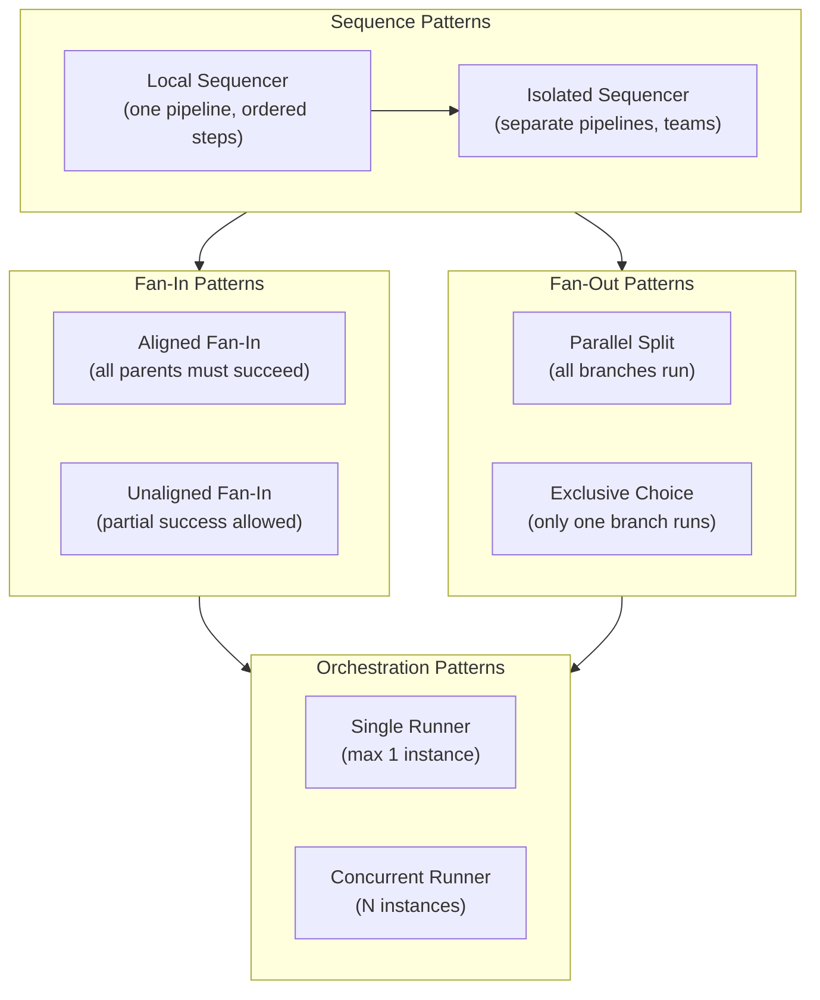
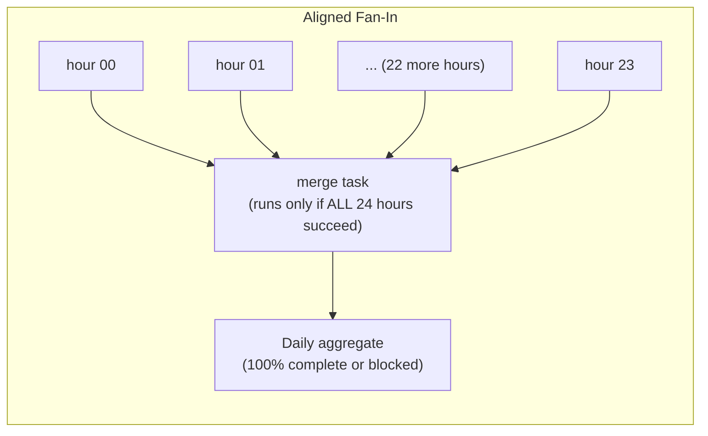
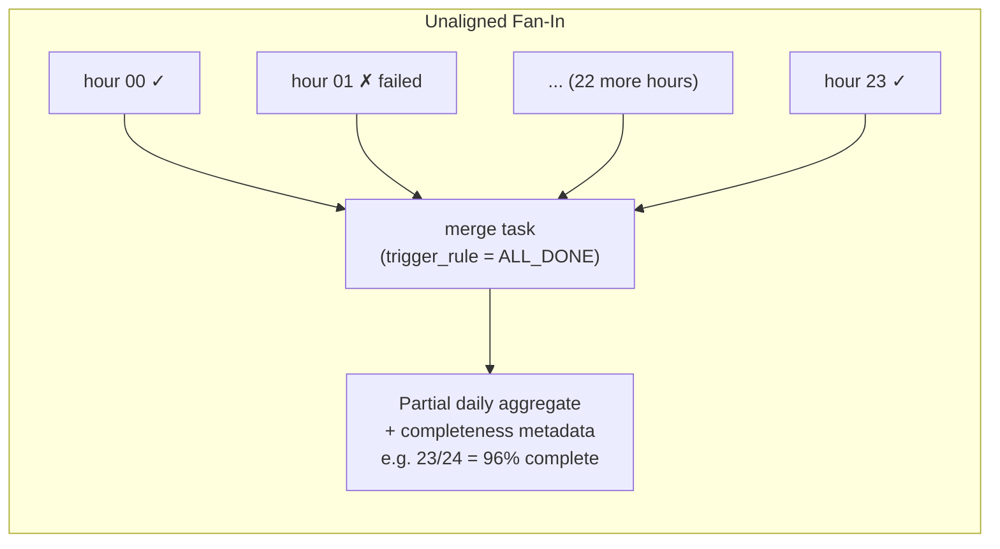
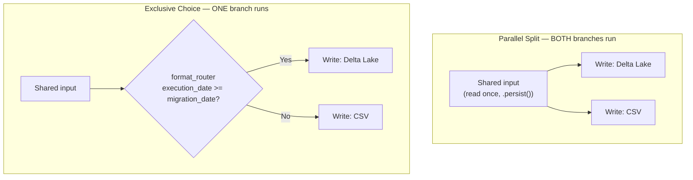
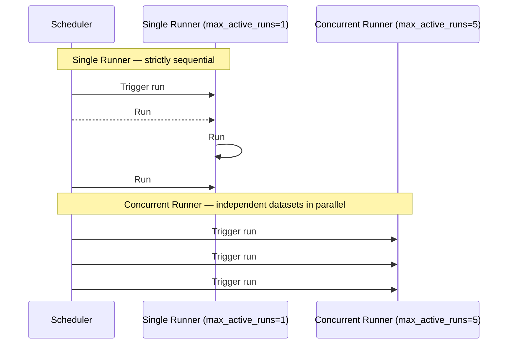

# Chapter 6 — Data Flow Design Patterns

> Source: *Data Engineering Design Patterns* by Bartosz Konieczny (O'Reilly, 2025)
> Case study: blog analytics platform (Bronze/Silver/Gold Medallion layers)

## Chapter Framing

Chapters 2–5 covered *what* happens to data (ingestion, error handling, idempotency,
enrichment/aggregation). Chapter 6 steps back and covers *how the pieces are wired together* —
the dependency and execution topology of a pipeline. The chapter organizes this into three
families, in order of increasing structural complexity:

- **Sequence** — steps that must run one after another (Local Sequencer, Isolated Sequencer).
- **Fan-In / Fan-Out** — branches that merge together (Fan-In) or split apart from a common
  point (Fan-Out).
- **Orchestration** — how many *instances* of a whole pipeline are allowed to run at once
  (Single Runner, Concurrent Runner).

The chapter closes by handing off to Chapter 7 (Data Security Design Patterns) — once data flows
correctly, the next concern is protecting it.

---

## Sequence Design Patterns

### Pattern: Local Sequencer

#### Problem
A single data processing job has grown from dozens to hundreds of lines of code, with the number
of transformations tripling over time. The job fails often, and every failure forces a restart
from the very beginning, leading to long debugging cycles. Business logic cannot be removed —
only the structure can change.

#### Solution
Decompose one large component into smaller, connected steps run **sequentially**, ordered by
their actual data dependency (if task B needs task A's output, B runs after A). A concrete
example: implementing full data ingestion (Chapter 2) as two connected steps — a **Readiness
Marker** task followed by a **Full Loader** task — either as two dependent orchestration tasks or
as one data-processing-layer task.

Three criteria decide whether the split should happen at the **orchestration layer** (separate
tasks) or stay as one **processing-layer** unit:

- **Separation of concerns** — if you struggle to name the single task, or the name is too long,
  you've likely bundled too many operations together.
- **Maintainability** — a single combined task re-runs *everything* on backfill/retry. If a
  readiness check calls 10 paid APIs and the job fails three times, cost climbs fast.
- **Implementation effort** — orchestrators often provide ready-made abstractions (run a SQL
  query, call an API); combining tasks forfeits that and forces you to reinvent them.

#### Consequences
> **⚠️ Warning — Boundaries**
> There's no universal rule for where to split. Over-splitting reduces readability just as much
> as under-splitting hurts maintainability; boundaries must be judged pipeline by pipeline.

#### Examples
```python
# Apache Airflow — orchestration-layer sequencing
input_data_sensor >> load_data_to_table >> expose_new_table
```

```bash
# AWS EMR — sequential Step API calls
aws emr add-steps --cluster-id j=cluster_id --steps Type=Spark,Name="Spark Program",\
ActionOnFailure=TERMINATE_CLUSTER,Args=[--class com.waitingforcode.DataLoader]
aws emr add-steps --cluster-id j=cluster_id --steps Type=Spark,Name="Spark Program",\
ActionOnFailure=TERMINATE_CLUSTER,Args=[--class com.waitingforcode.DataPublisher]
```
*Note: EMR requires an explicit `TERMINATE_CLUSTER` failure action, or a failed step could still
leave the cluster running and expose partial data as if the job succeeded. Airflow handles this
by default — a task can't advance until its parent succeeds.*

```python
# PySpark — processing-layer sequencing (implicit chaining via variables)
input_dataset: DataFrame = spark_session.read...
valid_and_enriched_dataset_to_write: DataFrame = input_dataset...
valid_and_enriched_dataset_to_write.write...
```

> **📌 Note — More Than CRON**
> A Local Sequencer shows the power of a real orchestrator over a plain CRON expression when
> building advanced logic. But CRON is still valid for an isolated use case with no dependencies.

> **✅ Say this out loud**
> "I split this into orchestration-layer tasks instead of one processing job because backfilling
> a 10-paid-API readiness check inside a monolithic job would re-trigger those calls on every
> retry — separating concerns here directly controls cost and blast radius."

---

### Pattern: Isolated Sequencer

#### Problem
Your team cleans and enriches raw datasets for a data visualization team to consume. After a
technical meeting, both teams agree it's not appropriate to fold the dashboard-specific
transformation into your team's data preparation pipeline — your team won't own that logic. The
visualization team wants only the cleansed, enriched dataset; they'll handle their own
transformation.

#### Solution
Use the **Isolated Sequencer** to connect two *physically separate* pipelines owned by different
teams (or logically separate concerns within the same team). Two ways to draw the boundary:

- **By consumer/provider or team ownership** — if your team provides a dataset to a different
  team, that's a natural place to split into two isolated pipelines.
- **By pipeline complexity** — when you're both provider and consumer of your own output (a
  downstream pipeline you also own), analyze complexity to decide whether tight coupling still
  makes sense, since processing logic and storage are interdependent enough to justify one unit.

Two orchestration mechanisms are shown for connecting isolated pipelines:
- **Data-dependency (implicit)** sensors that watch for the presence of upstream output.
- **Trigger-based (explicit)** dependency using `ExternalTaskMarker` (in the upstream pipeline)
  and `ExternalTaskSensor` (in the downstream pipeline) — the marker automates backfill
  propagation by detecting backfills on the upstream DAG and triggering the downstream one.

#### Consequences
> **⚠️ Warning**
> The book lists **Scheduling** and **Communication** as the named gotcha categories for this
> pattern — isolated pipelines owned by different teams need explicit coordination on scheduling
> windows and clear communication channels, since implicit in-DAG dependency signals no longer
> apply across pipeline/team boundaries. `[verify against source page — full prose for these two
> consequence subsections was not fully returned by search]`

#### Examples
```python
# devices_loader (upstream / provider)
success_execution_marker = ExternalTaskMarker(
    task_id='trigger_downstream_consumers',
    external_dag_id='devices_aggregator',
    external_task_id='downstream_trigger_sensor',
)
(input_data_sensor >> load_new_devices_to_internal_storage()
 >> success_execution_marker)

# devices_aggregator (downstream / consumer)
parent_dag_sensor = ExternalTaskSensor(
    task_id='downstream_trigger_sensor',
    external_dag_id='devices_loader',
    external_task_id='trigger_downstream_consumers',
    allowed_states=['success'],
    failed_states=['failed', 'skipped']
)
parent_dag_sensor >> load_data_to_table >> refresh_aggregates
```

---

## Fan-In Design Patterns

> **🧩 Case Study**
> Your pipeline generates a **daily** aggregate of blog visits from raw visit events, but the
> underlying dataset is partitioned **hourly** to fit most other use cases in the organization.
> Processing the whole day in one job would waste the hourly partitioning; you'd like to leverage
> it to avoid processing too much data in a single run. This is the running problem for both
> Fan-In patterns below.

### Pattern: Aligned Fan-In

#### Problem
See the case-study callout above: you want to compute a daily aggregate from 24 hourly
partitions, using the hourly partitioning to keep each processing job small, and merge the 24
results into one daily output.

#### Solution
Define **separate branches** (one per hour) that all merge into a **common merge task**. At the
orchestration layer, this is a simple "all these must finish, then run one more task" DAG shape.
At the data processing layer, two interaction models exist:

- **`UNION`** — vertical alignment; combines rows, keeping the same column count, more rows.
- **`JOIN`** — horizontal alignment; combines row-wise, adding columns, fewer rows than `UNION`.

Two concrete advantages over one monolithic 24-hour job:
- **Feedback loop optimization** — 24 small hourly jobs surface a processing error much sooner
  than a single job that only fails after processing the whole day.
- **Cheaper failure recovery** — if only the last of the 24 hours fails, you replay only that
  hour, not all 24.

#### Consequences
> **⚠️ Warning — Infrastructure spikes**
> Running 24 jobs simultaneously needs elastic provisioning capacity. Without it, you must cap
> concurrent runs to a smaller number, or run branches incrementally (hourly) and aggregate only
> on the last run of the day.

> **⚠️ Warning — Scheduling skew**
> Since the merge task requires *all* parents to succeed, unbalanced parent execution times mean
> every successful branch waits on the slowest one — the merge task's trigger time is bound by
> the longest-running parent.

> **⚠️ Warning — Scheduling overhead**
> Overly granular pipelines make the orchestrator spend most of its resources on scheduling and
> coordination rather than doing work.

> **⚠️ Warning — Complexity**
> More decoupling means a longer pipeline graph, which can hurt readability. The book poses two
> framing questions: *"What tasks belong to a single unit of execution?"* and *"What operations
> should be backfilled individually?"*

#### Examples
```python
# Apache Airflow — dynamic branch creation via a for loop
clear_context = PostgresOperator(...)
generate_trends = PostgresOperator(...)

for hour_to_load in [f"{hour:02d}" for hour in range(24)]:
    file_sensor = FileSensor(
        task_id=f'wait_for_{hour_to_load}',
        filepath=input_dir + '/date={{ ds_nodash }}/hour=' + hour_to_load + '/dataset.csv'
    )
    visits_loader = PostgresOperator(
        task_id=f'load_hourly_visits_{hour_to_load}',
        params={'hour': hour_to_load}
    )
    clear_context >> file_sensor >> visits_loader >> generate_trends
```

```python
# PySpark — UNION at the data processing layer
input_dataset_1: DataFrame = ...
input_dataset_2: DataFrame = ...
output_dataset = input_dataset_1.unionByName(input_dataset_2)
```

```sql
-- Position-based UNION pitfall
SELECT a, b, c FROM abc
UNION
SELECT c, b, a FROM cba
-- Combines a+c, b+b, c+a by POSITION, not name — silently wrong results.
-- unionByName() in PySpark combines by column name instead.
```

---

### Pattern: Unaligned Fan-In

#### Problem
The Aligned Fan-In hourly pipeline has worked well for weeks, but it has no way to handle a
partially-failed hour gracefully — a few times, one hour failed to process and the whole daily
aggregate was blocked. The team decides it's better to release a **partial** dataset and fill
gaps later, rather than block entirely.

#### Solution
Relax the "all parents must succeed" requirement. With the Unaligned Fan-In pattern, the child
task can run **even when some parents fail**:

- If enough parents succeed and remaining failures are acceptable, trigger the child anyway
  (partial dataset).
- If **all** parents fail, trigger a different (failure-path) task — e.g., a fallback or error
  handler — instead of the success-path task.

Implementation relies on the orchestrator's **trigger condition** configuration — in Apache
Airflow, the `trigger_rule` attribute set to a value like "all done" rather than the default
"all success."

#### Consequences
> **⚠️ Warning — Readability**
> Having two downstream branches (one for all-success, one for handling failures) makes the
> pipeline confusing — you often can't tell the execution flow just from the DAG graph, only by
> reading code. **Mitigation:** use the orchestrator's dedicated failure-handling primitives
> instead of hiding logic in a branch — Airflow's `on_failure_callback`, or AWS Step Functions'
> `Catch` field.

> **⚠️ Warning — Partial data**
> If you publish a dataset built from partially successful parents, you must communicate
> incompleteness to consumers, or they'll wrongly assume completeness. Options the book gives:
> - A companion **completeness table** with a percentage (e.g., 12 of 24 parents succeeded → 50%
>   complete; 6 of 24 → 25%).
> - Metadata-layer tags (e.g., object storage tags).
> - A notification to downstream consumers (e.g., email).
> - Alternatively, keep the partial dataset **private** — compute completeness first, and only
>   write to an internal location if it isn't 100%.

#### Examples
```python
# Apache Airflow — relaxed trigger_rule
clear_context = PostgresOperator(...)
generate_cube = PostgresOperator(
    # ...
    trigger_rule=TriggerRule.ALL_DONE
)

for hour_to_load in [f"{hour:02d}" for hour in range(24)]:
    file_sensor = FileSensor(
        task_id=f'wait_for_{hour_to_load}',
        filepath=input_dir + '/date={{ ds_nodash }}/hour=' + hour_to_load + '/dataset.csv'
    )
    visits_loader = PostgresOperator(
        task_id=f'load_hourly_visits_{hour_to_load}',
        params={'hour': hour_to_load}
    )
    clear_context >> file_sensor >> visits_loader >> generate_cube
```
*This is identical to the Aligned Fan-In example except for `trigger_rule=TriggerRule.ALL_DONE`
— Airflow's default is "all parents succeed"; here it's relaxed to "all parents finished,
regardless of outcome." The rule stays hidden in code and won't show up in the visual DAG graph.*

> **✅ Say this out loud**
> "I'd default to Aligned Fan-In unless a partial-but-timely result is actually more valuable to
> consumers than a complete-but-delayed one — and if I do relax it, I always publish a
> completeness signal alongside the data so consumers don't silently assume 100%."

---

## Fan-Out Design Patterns

### Pattern: Parallel Split

#### Problem
A legacy C# data processing framework is being retired — its original maintainers are gone, and
no documentation survives. After reverse-engineering the logic, you're rewriting it in a modern
open-source Python library. Since the reverse-engineering might not be perfect, you want to keep
the old pipeline running in parallel until consumers are ready to switch — meaning the processed
dataset must be **written to two different places** during migration.

#### Solution
Use **Parallel Split**: one parent task feeds at least two child tasks that run in parallel,
since their logic is isolated. At the orchestration layer, this is straightforward via the DSL or
function-based APIs. At the data processing layer it's trickier — three concerns:

- **Read once** — the split shouldn't trigger separate read operations; materialize the shared
  intermediary dataset once (a SQL temp table, or Spark's `.persist()`).
- **Isolate branches** — any shared/global variables must be read-only, or their writes must be
  compatible across all parallel writers.
- **Resource allocation** — for time-sensitive computation, allocate dedicated compute or
  configure auto-scaling for the parallel workload.

#### Consequences
> **⚠️ Warning — Blocked execution**
> For time-dependent pipelines where each run depends on the previous one succeeding, the
> triggering condition is gated on the **slowest** Parallel Split branch — every run waits for
> it, and a failure blocks all subsequent runs entirely. **Mitigation:** export the slow branch
> into its own pipeline, triggered via one of the Isolated Sequencer's dependency mechanisms
> (dataset- or task-based).

> **⚠️ Warning — Hardware**
> If the shared parent generates an intermediary dataset consumed by two differently-resourced
> jobs (e.g., one CPU-heavy, one memory-heavy), you can't give both branches ideal hardware in a
> single job. **Mitigation:** split the job the same way as in Local Sequencer — generate the
> intermediary dataset first, then start the parallel jobs separately on their own dedicated
> hardware.

#### Examples
```python
# Apache Airflow — parallel branches from one common sensor
file_sensor = FileSensor(#...
    task_id='input_dataset_waiter')
for output_format in ['delta', 'csv']:
    load_job_trigger = SparkKubernetesOperator(# ...
        task_id=f'load_job_trigger_{output_format}',
        params={'output_format': output_format}
    )
    load_job_sensor = SparkKubernetesSensor(#...
        task_id=f'load_job_sensor_{output_format}')
    file_sensor >> load_job_trigger >> load_job_sensor
```

```python
# PySpark — reading the shared input once via persist()
input_dataset = (spark_session.read
    .schema('type STRING, full_name STRING, version STRING').format('json')
    .load(DemoConfiguration.INPUT_PATH))
input_dataset.persist(StorageLevel.MEMORY_ONLY)
input_dataset.write...
input_dataset.write...
```

```python
# Delta Lake — protecting against duplicate writes on retry
batch_id = 1
app_id = 'devices-loader-v1'
input_dataset.write.mode('append').format('delta')\
    .option('txnVersion', batch_id).option('txnAppId', app_id)\
    .save(DemoConfiguration.DEVICES_TABLE)
(input_dataset.withColumn('loading_time', functions.current_timestamp())
    .withColumn('full_name',
        functions.concat_ws(' ', input_dataset.full_name, input_dataset.version))
    .write.mode('append').format('delta')
    .option('txnVersion', batch_id).option('txnAppId', app_id)
    .save(DemoConfiguration.DEVICES_TABLE_ENRICHED))
```
*`txnVersion`/`txnAppId` make Delta Lake writes idempotent on retry — since the values don't
change between replays, subsequent identical runs are ignored rather than duplicating data.*

---

### Pattern: Exclusive Choice

#### Problem
The Parallel Split migration is working well. Now you need to evolve the pipeline so the **new**
job version only runs starting January 1, 2024 — any backfilling for prior days should still run
the **old** job version — without creating a brand-new pipeline (to preserve execution history).

#### Solution
Like Parallel Split, declare at least two downstream branches — but this time, add a **condition
evaluator task** right before branching so only **one** path executes. Modern orchestrators
support this natively: Apache Airflow uses a **branch operator**; Azure Data Factory uses an
**if condition activity**. It also applies at the data processing layer via ordinary
`if`/`else`/`switch` logic in your programming language.

#### Consequences
> **⚠️ Warning — Complexity factory**
> Because branching feels as natural as an `if`/`else` in application code, it's tempting to
> over-use it — but at the orchestration layer, each condition means a real execution branch that
> eventually merges or splits further, quickly degrading readability. There's no universal
> threshold for "too many branches"; the book's heuristic is **rubber duck debugging** — explain
> the pipeline to an imaginary new teammate; if the explanation isn't concise, it's too complex.

> **⚠️ Warning — Hidden logic**
> If conditional branches live only inside the *processing-layer* code (different output
> datasets/stores per branch), that logic is easy to forget weeks later. **Mitigation:** consider
> applying Exclusive Choice at the orchestration layer too, so branching is visible in the DAG
> graph, not buried in code.

> **⚠️ Warning — Heavy conditions**
> If the condition itself requires processing the data (not just metadata), it adds real
> execution time. Prefer **metadata-based** conditions where possible — they're faster since they
> don't touch the dataset. When data-based conditions are unavoidable, optimize to avoid
> reprocessing the full dataset each time.

#### Examples
```python
# Apache Airflow — BranchPythonOperator as a router
def get_output_format_route(**context):
    migration_date = pendulum.datetime(2024, 2, 3)
    execution_date = context['execution_date']
    if execution_date >= migration_date:
        return 'load_job_trigger_delta'
    else:
        return 'load_job_trigger_csv'

format_router = BranchPythonOperator(
    task_id='format_router',
    python_callable=get_output_format_route,
    provide_context=True
)
```

```python
# PySpark — Exclusive Choice via external job parameter (Factory pattern)
class OutputType(str, Enum):
    delta_lake = 'delta'
    csv = 'csv'

parser = argparse.ArgumentParser(prog='...')
parser.add_argument('--output_type', required=True, type=OutputType)
args = parser.parse_args()

output_generation_factory = OutputGenerationFactory(args.output_type)
spark_session = output_generation_factory.get_spark_session()
raw_data = (spark_session.read...)
output_generation_factory.write_devices_data(raw_data, args.output_dir)
```

```python
# PySpark — Exclusive Choice driven by dataset/schema characteristics
input_dataset = ...
input_schema = detect_schema(input_dataset)
output_location = DemoConfiguration.DEVICES_TABLE_LEGACY
if len(input_schema.fields) >= 3:
    output_location = DemoConfiguration.DEVICES_TABLE_SCHEMA_CHANGED
```
*This example uses schema metadata (fast) rather than the data itself (slow) to route — the
recommended default per the "Heavy conditions" gotcha above.*

> **📌 Note**
> The `OutputGenerationFactory` in the second example borrows the software-engineering **Factory**
> design pattern: it hides object-creation logic behind a single interface exposed to the caller,
> keeping the branching condition in one place instead of repeated across methods.

---

## Orchestration Design Patterns

### Pattern: Single Runner

#### Problem
A sessionization pipeline (built with the Incremental Sessionizer pattern from Chapter 5) was a
proof-of-concept run manually, on demand, with no formal orchestration. As it moves toward
release, it needs a real orchestration setup — and since the logic is **incremental**
(sequential), more than one instance cannot safely run at the same time.

#### Solution
The **Single Runner** pattern guarantees there is always **at most one** execution of a given
pipeline running. Implementation is a configuration setting: both Apache Airflow and Azure Data
Factory support a **concurrency attribute** that can be set to 1. If the orchestrator doesn't
support this natively, implement a **Readiness Marker** pattern that waits for the prior run to
finish — note this doesn't stop *future* runs from queuing up behind it.

#### Consequences
> **⚠️ Warning — Backfilling**
> Sequential-only execution makes backfilling slow, since reprocessing can't be parallelized —
> and this can't be relaxed, because the single-concurrency requirement is a **correctness**
> requirement (parallel runs would produce wrong results), not just a performance choice. The
> only lever: check whether you truly need to backfill the *whole* pipeline, or whether some
> steps (e.g., just re-inserting an already-generated dataset after a config change) can skip the
> sequential-dependent processing part.

> **⚠️ Warning — Latency**
> Backfilling is the worst case; a milder version is **stragglers** — some runs simply take
> longer than usual. Example: an hourly pipeline that normally finishes in 30 minutes starts
> taking 1.5 hours — delay compounds run over run, and every downstream consumer inherits the
> lag. **Mitigation:** on scalable infrastructure, add compute power or improve the processing
> logic itself.

#### Examples
```python
# Apache Airflow — enforce single concurrency
with DAG('visits_trend_generator', max_active_runs=1, default_args={
    'depends_on_past': True,
    # ...
```
*`max_active_runs=1` caps concurrent pipeline instances; `depends_on_past=True` means a task
won't start until the same task succeeded in the previous run.*

> **📌 Note**
> AWS EMR exposes a `StepConcurrencyLevel` parameter to cap parallel jobs on a cluster. Azure Data
> Factory has a similar **Concurrency** setting, but with a gotcha: unlike Airflow (which simply
> won't schedule a new run while one is active), Data Factory **queues** extra runs (up to 100),
> and once that queue is full, scheduling returns a `429 Too many requests` error.

---

### Pattern: Concurrent Runner

#### Problem
A data ingestion team pulls data from external at-rest sources into an internal database, usually
every 30–60 minutes, but sometimes the process takes longer. Because it's running under the
Single Runner pattern, every subsequent delivery gets delayed behind the slow one — even though
the ingested datasets are actually **independent** of each other.

#### Solution
Since the datasets don't depend on each other, relax the concurrency constraint: the
**Concurrent Runner** pattern sets concurrency higher than 1, so the orchestrator can pick up the
next scheduled run as soon as capacity allows, without waiting for the current run to finish. The
book cautions: "with great power comes great responsibility" — the concurrency ceiling must be
balanced against the rest of the infrastructure's capacity.

#### Consequences
> **⚠️ Warning — Resource starvation**
> Especially relevant in **multitenant** orchestrators shared by many teams: if several
> high-concurrency pipelines backfill simultaneously, the scheduler may not have capacity left to
> start other teams' pipelines. **Mitigation:** use **workload management** to allocate dedicated
> compute capacity per team/user group, so one team's high concurrency setting can't starve
> others — capped at their allocated threshold even under heavy load. Note: serverless
> orchestrators (e.g., AWS Step Functions, which allows up to 10,000 parallel child workflow
> executions) may not face this issue at all.

> **⚠️ Warning — Shared state**
> A classic gotcha for any concurrent-execution pattern: if the pipeline touches a **shared
> component**, concurrent nondeterministic execution can cause unexpected side effects. Example
> given: the **Dynamic Late Data Integrator** pattern (Chapter 4) — concurrent runs could trigger
> backfilling multiple times, or in the worst case, not trigger it at all for some execution
> dates.

#### Examples
```python
# Apache Airflow — allow concurrent execution
with DAG('devices_loader', max_active_runs=5,
    default_args={
        'depends_on_past': False,
        # ...
```
*Setting `depends_on_past=False` here doesn't affect the concurrency configuration itself — it
only controls whether individual tasks wait on their own prior-run success.*

> **📌 Note**
> Not every orchestrator supports this flexibility equally — Azure Data Factory, for instance,
> supports concurrency and trigger-based dependency, but **not** task-based dependency.

---

## Diagrams

### 1. The Three Pattern Families in This Chapter



### 2. Aligned vs. Unaligned Fan-In — Hourly-to-Daily Aggregation





### 3. Parallel Split vs. Exclusive Choice — Fan-Out Comparison



### 4. Single Runner vs. Concurrent Runner — Orchestration Timing



---

## Trade-Off / Comparison Tables

### Fan-In: Aligned vs. Unaligned

| PATTERN | WHEN TO USE | TRADE-OFF |
|---|---|---|
| **Aligned Fan-In** | All branch inputs are equally required for a correct, complete result (e.g., a true daily total). | Simpler, single output type — but a single failed branch blocks the merge task entirely; scheduling is gated by the slowest parent (scheduling skew); infrastructure spikes if branches run simultaneously. |
| **Unaligned Fan-In** | Timely partial results are more valuable than a complete-but-delayed result, and gaps can be backfilled later. | Requires explicit completeness tracking (companion table, metadata tags, or notification) or consumers silently assume 100% completeness; branching on success/failure paths reduces DAG readability. |

### Fan-Out: Parallel Split vs. Exclusive Choice

| PATTERN | WHEN TO USE | TRADE-OFF |
|---|---|---|
| **Parallel Split** | Multiple consumers/outputs genuinely need the *same* upstream data at the *same* time (e.g., dual-writing during a migration). | All branches must share hardware profile unless split further; time-dependent pipelines block on the *slowest* branch; must guard against duplicate writes on retry (e.g., Delta Lake `txnVersion`/`txnAppId`). |
| **Exclusive Choice** | Only one of several possible paths should execute per run (e.g., cut-over date-based routing, legacy vs. new format). | Easy to over-branch into a "complexity factory"; branching logic hidden in processing-layer code is easy to forget — prefer surfacing it at the orchestration layer; data-driven (vs. metadata-driven) conditions add real runtime cost. |

### Orchestration: Single Runner vs. Concurrent Runner

| PATTERN | WHEN TO USE | TRADE-OFF |
|---|---|---|
| **Single Runner** | Pipeline logic is incremental/stateful — each run's correctness depends on the previous run's output (e.g., sessionization). | Backfilling is slow because it can't be parallelized (correctness-driven, not just a performance limit); stragglers compound latency for every downstream consumer. |
| **Concurrent Runner** | Runs are independent of each other (e.g., ingesting unrelated external datasets). | Risk of resource starvation in multitenant orchestrators without workload management; shared mutable state across concurrent runs causes nondeterministic bugs (e.g., duplicate or missed backfill triggers). |

---

## Gotchas — Organized by Pattern

- **Local Sequencer** — no fixed rule for orchestration-layer vs. processing-layer split; judge
  by naming difficulty, backfill/retry cost, and whether the orchestrator's built-in abstractions
  are being forfeited.
- **Isolated Sequencer** — scheduling and communication overhead across team/pipeline boundaries.
  `[verify against source page]`
- **Aligned Fan-In** — infrastructure spikes under high concurrency; scheduling skew from the
  slowest parent; scheduling overhead from excessive granularity; overall pipeline complexity.
- **Unaligned Fan-In** — reduced DAG readability from dual success/failure branches; must
  explicitly track and communicate partial-completeness to consumers.
- **Parallel Split** — blocked execution cascades from the slowest branch on time-dependent
  pipelines; mismatched hardware needs across branches; retry-driven duplicate writes.
- **Exclusive Choice** — "complexity factory" from over-branching; hidden processing-layer logic
  that's easy to forget; runtime cost of data-based (vs. metadata-based) conditions.
- **Single Runner** — slow, non-parallelizable backfilling (a correctness constraint, not a
  preference); straggler runs compound delay for all downstream consumers.
- **Concurrent Runner** — resource starvation in multitenant environments without workload
  management; shared-state bugs under nondeterministic concurrent execution.

---

## Special Notes / Further Reading

- **Apache Airflow specifics**: `>>` operator for sequencing; `BranchPythonOperator` for Exclusive
  Choice; `trigger_rule=TriggerRule.ALL_DONE` for Unaligned Fan-In; `ExternalTaskMarker` /
  `ExternalTaskSensor` for cross-DAG Isolated Sequencer dependencies; `max_active_runs` and
  `depends_on_past` for Single/Concurrent Runner; `on_failure_callback` for clean failure-path
  handling.
- **AWS EMR**: Step API for sequential steps; `StepConcurrencyLevel` for cluster-wide concurrency
  control; `ActionOnFailure=TERMINATE_CLUSTER` needed to avoid silently exposing partial data.
- **Azure Data Factory**: if-condition activity for Exclusive Choice; **Concurrency** setting
  queues (rather than blocks) excess runs, up to 100, returning HTTP `429` once full; supports
  concurrency and trigger-based dependency but not task-based dependency.
- **Delta Lake**: `txnVersion` / `txnAppId` write options provide idempotent, retry-safe writes —
  directly relevant to Parallel Split's duplicate-write gotcha.
- **Software engineering cross-reference**: the Factory design pattern (`OutputGenerationFactory`
  example) — see *Design Patterns: Elements of Reusable Object-Oriented Software* and the
  Refactoring Guru website, both cited by the book for further reading on general SWE patterns.
- **Debugging technique**: "rubber duck debugging" is repurposed in this chapter as a complexity
  heuristic for Exclusive Choice branching, not just for finding bugs.

---

## Cheat Sheet

| Pattern | Problem (1 line) | Solution (1 line) | Biggest Gotcha |
|---|---|---|---|
| **Local Sequencer** | One bloated job is hard to debug/maintain. | Break into ordered, dependency-driven steps (orchestration or processing layer). | No universal split boundary — judge per pipeline. |
| **Isolated Sequencer** | Two teams/pipelines must hand off data without merging ownership. | Connect physically separate pipelines via data- or trigger-based dependency (`ExternalTaskMarker`/`Sensor`). | Cross-boundary scheduling & communication overhead. |
| **Aligned Fan-In** | Need one daily result from 24 hourly partitions, efficiently. | Branch per hour, merge via `UNION`/`JOIN` once all succeed. | Slowest parent gates everything (scheduling skew). |
| **Unaligned Fan-In** | Aligned Fan-In blocks entirely on one failed hour. | Relax to `trigger_rule=ALL_DONE`; publish partial results + completeness metric. | Must actively signal incompleteness or consumers assume 100%. |
| **Parallel Split** | Need to write the same data to two destinations (e.g., migration). | Materialize input once (`.persist()`), fan out to independent writers. | Slowest branch blocks all subsequent time-dependent runs. |
| **Exclusive Choice** | Only one of several job variants should run per date/condition. | Add a router/branch task before splitting; only one path executes. | Over-branching becomes an unreadable "complexity factory." |
| **Single Runner** | Incremental logic breaks if two instances run at once. | Cap concurrency at 1 (`max_active_runs=1`). | Backfilling is slow and can't be parallelized — it's a correctness rule. |
| **Concurrent Runner** | Independent datasets are needlessly serialized, adding latency. | Raise concurrency above 1. | Resource starvation and shared-state bugs without workload management. |

---

## Further Reading
- *Fundamentals of Data Engineering*
- *The Cloud Data Lake*
- *Delta Lake: The Definitive Guide*
- *Design Patterns: Elements of Reusable Object-Oriented Software*
- Refactoring Guru (website) — general software engineering design patterns
- OpenLineage — official website, referenced in the chapter's closing notes on data lineage
