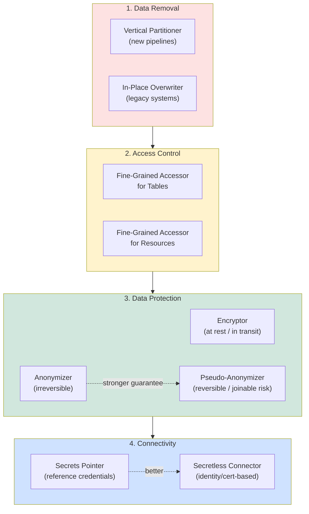
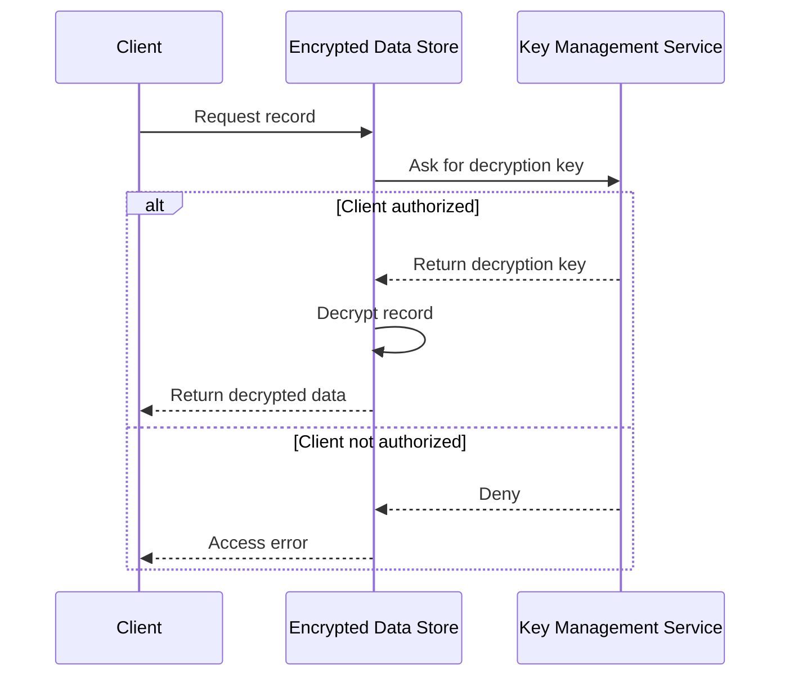

# Chapter 7 — Data Security Design Patterns

> *Data Engineering Design Patterns* by Bartosz Konieczny (O'Reilly, 2025) — Interview-prep / design-review study notes.

## Chapter Framing

The datasets built up through the data value and data flow patterns (Chapters 5–6) are valuable business assets — and that makes them targets. This chapter shifts from "make data useful" to "make data safe," covering four security concerns:

- **Compliance** — privacy laws like GDPR (EU) and CCPA (US) define the boundary between data provider and data consumer.
- **Access control** — an open dataset can be accidentally overwritten by another team, with big downstream consequences.
- **Data protection** — even if access controls fail, encryption means an intruder still can't read the data without the key.
- **Connectivity security** — credentials stored in a Git repo are a leak risk; they belong in a safer, external place.

The chapter walks through four groups of patterns in order: **data removal** (right-to-be-forgotten compliance) → **fine-grained access** (tables and cloud resources) → **data protection** (encryption and anonymization) → **connectivity** (secrets and identity-based access). It sets up Chapter 8 (Data Storage), which also touches data removal from a performance angle.

---

## 1. Data Removal

Privacy regulations like the CCPA and GDPR require you to delete a user's data on request. Two patterns implement this — one optimized for new pipelines, one for legacy systems that can't be redesigned.

### Pattern: Vertical Partitioner

#### Problem
You presented a design doc for a new personal-data-removal pipeline. Peers pointed out storage overhead: several columns (e.g., **birthday, personal ID number**) are **immutable** — they never change, yet are repeated in every record. They asked you to store each immutable property only once, so a removal request has less data to touch.

#### Solution
Split the dataset into a **mutable** part and an **immutable** part — this is vertical partitioning (as opposed to horizontal partitioning, which groups whole rows together, e.g., by date).

Implementation steps:
1. Identify which columns to split and a merge key (e.g., `user_id`) to recombine rows later.
2. Adapt the ingestion job to add attribute-based split logic: values that change per-record go to one store; unchanging/PII-scoped values go to a dedicated store.
3. Easiest implementation: a `SELECT` (or attribute-projection) issuing separate queries per column set, each writing to its own store — optionally with dedup rules like `dropDuplicates`.

This drastically reduces the data touched by a removal request — private attributes repeated across thousands of records now live in exactly one place.

> **🧩 Case Study** The book's visits pipeline splits each event into a `visits_without_user_context` stream (mutable, e.g., visit time, page) and a `user_context_to_save` stream (immutable/PII, e.g., login) using Spark's `foreachBatch`, published to separate Kafka topics, with the user-context topic later deduplicated into a Delta Lake table via `MERGE`.

#### Consequences
- **Query performance** — reads now require a join across the split, adding network traffic instead of local row reads.
- **Querying complexity** — consumers must know a property may live elsewhere. Mitigate with a single-entry-point view, data catalog documentation, or clear lineage (see the Dataset Tracker pattern).
- **Complexity in a polyglot world** — if the same dataset lives across multiple storage technologies (NoSQL + relational), you may need vertical partitioning *and* multiple removal pipelines per storage layer.
- **Doesn't apply to raw data** — if you retain the unsplit raw data for any period, you need a complementary removal strategy (e.g., a short retention window), which trades off against backfill availability.

> **⚠️ Warning** Vertical partitioning only protects data *from the first transformation step onward*. Raw ingested data still needs its own removal strategy.

#### Examples

```python
# Vertical partitioning with Apache Spark's foreachBatch
def split_visit_attributes(visits_to_save: DataFrame, batch_number: int):
    visits_to_save.persist()
    visits_without_user_context = (visits_to_save
        .filter('user_id IS NOT NULL AND context.user.login IS NOT NULL')
        .withColumn('context', F.col('context').dropFields('user'))
        .select(F.col('visit_id').alias('key'), F.to_json(F.struct('*')).alias('value')))
    # save to visits_without_user_context
    user_context_to_save = (visits_to_save.selectExpr('context.user.*', 'user_id')
        .select(F.col('user_id').alias('key'), F.to_json(F.struct('*')).alias('value')))
    # save to user_context_to_save
    visits_to_save.unpersist()
```

```python
# Converting split rows into a deduplicated Delta Lake table
def save_most_recent_user_context(context_to_save: DataFrame, batch_number: int):
    deduplicated_context = context_to_save.dropDuplicates(['user_id']).alias('new')
    current_table = DeltaTable.forPath(spark_session, get_delta_users_table_dir())
    (current_table.alias('current')
        .merge(deduplicated_context, 'current.user_id = new.user_id')
        .whenMatchedUpdateAll().whenNotMatchedInsertAll()
        .execute())
```

```python
# Data removal from the Delta Lake table
user_id_to_delete = '140665101097856_0316986e-9e7c-448f-9aac-5727dde96537'
users_table = DeltaTable.forPath(spark_session, get_delta_users_table_dir())
users_table.delete(f'user_id = "{user_id_to_delete}"')
```

```bash
# Kafka tombstone message (deletion marker) via console producer
docker exec -ti ... kafka-console-producer.sh --bootstrap-server .... \
  --topic ... --property parse.key=true --property key.separator=, \
  --property null.marker=NULL
140665101097856_0316986e-9e7c-448f-9aac-5727dde96537,NULL
```

> **📌 Note** A Delta Lake `delete` still requires a follow-up `VACUUM` to physically reclaim the blocks — otherwise the data is still recoverable via time travel. Kafka tombstones only work reliably for topics with one occurrence per key (like the vertically-partitioned `user_context` topic) — not for multi-event-per-key topics like `visits`.

> **✅ Say this out loud** "We use vertical partitioning to isolate PII into a single-occurrence store, so a GDPR deletion touches one row instead of thousands — the trade-off is an extra join for readers, which we hide behind a view."

---

### Pattern: In-Place Overwriter

#### Problem
You inherited a **legacy system** with terabytes of data in time-based horizontal partitions and **no personal-data management strategy**. It's still widely used and must now comply with new privacy regulation requiring removal on request — but there's no time or budget to redesign it with vertical partitioning.

#### Solution
Apply the overwriting strategy directly against the storage:

- If the store natively supports in-place deletes, run a `DELETE` with a `WHERE` clause on the target entity.
- For open table formats (Delta Lake, Apache Iceberg), you must follow with a data-cleaning/vacuum step, since these formats support time travel — without reclaiming blocks, the "deleted" data is still retrievable from an older version.
- If the storage has **no native deletion capability** (raw JSON/CSV), simulate it: read the whole dataset, filter out the removed user(s), and write a filtered copy to a **staging location**, then promote it (rename/move) to the final location — never overwrite the final location directly, since that risks partial/lost data on retry or failure.

> **📌 Note — Deletion Vectors** There are two approaches to managing deletes in table formats. A **deletion vector** marks removed rows in a small side file (readers filter them out at read time) — this is writer-light. The alternative rewrites all *non*-removed rows into fresh files — writer-heavy, but readers see clean data directly.

#### Consequences
- **I/O overhead** — heavy read + overwrite; storage can nearly double in size temporarily and increases throughput needs. Formats with block-level statistics (Parquet-based: Delta Lake, Iceberg) mitigate this by skipping blocks that can't contain the target rows.
- **Cost** — this pattern reads and rewrites *all* data, unlike Vertical Partitioner's single-row touch. Example from the book: 2,000 records for one removed entity means the Vertical Partitioner touches 1 entry, but In-Place Overwriter touches all 2,000. Mitigation: batch multiple removal requests into a single pipeline run instead of one run per request.

> **⚠️ Warning — Impossible Rollback** The staging-promotion approach avoids partial writes, but if a buggy removal job runs and you need to replay it, the *original* dataset is gone — it was already overwritten. Mitigate with the Proxy pattern or object-store versioning.

#### Examples

```python
# Removing rows in a flat file format (JSON) with PySpark
input_raw_data = spark_session.read.text(get_input_table_dir())
df_w_user_column = input_raw_data.withColumn(
    'user', F.from_json('value', 'user_id STRING')
)
user_id = '139621130423168_029fba78-15dc-4944-9f65-00636566f75b'
to_save = df_w_user_column.filter(f'user.user_id != "{user_id}"').select('value')
to_save.write.mode('overwrite').format('text').save(get_staging_table_dir())
```

```bash
# Promoting the staged, filtered dataset to the final location (S3)
aws s3 rm ${BUCKET}/output --recursive
aws s3 mv ${BUCKET}/staging ${BUCKET}/output --recursive
```

For Delta Lake tables, the same `.delete(...)` call shown under Vertical Partitioner applies — the book notes this is "just a formality" since it reuses identical code.

---

## 2. Access Control

Removal patterns handle compliance; access control protects datasets from accidental or malicious misuse *within* your organization.

### Pattern: Fine-Grained Accessor for Tables

#### Problem
You migrated legacy HDFS/Hive workloads to a cloud data warehouse and need a secure access policy. Basic user/group access to whole tables is easy — but stakeholders also need users restricted at the **column** and **row** level within a table they're otherwise authorized to read.

#### Solution
Three implementation strategies, depending on platform:

1. **`GRANT`-based column access** (Amazon Redshift, PostgreSQL) — authorize `SELECT` on a named subset of columns.
2. **Data-catalog tag-based access** (GCP BigQuery) — create policy tags in Data Catalog, assign them to protected columns, then grant users a Fine-Grained Reader role per tag.
3. **Data masking** (Databricks/Unity Catalog, Snowflake) — users can see the column exists, but its content is hidden by a masking function unless they belong to an authorized group.

**Row-level access** is commonly implemented as a dynamic `WHERE` condition auto-applied to queries — Databricks calls it `ROW FILTER`, Redshift calls it Row-Level Security, BigQuery/Snowflake call it row access policies. If the database has no native support, simulate it with a view that adds an access-guard condition.

> **🧩 Case Study** PostgreSQL row-level security example: a policy that adds `login = current_user` to every query against the `users` table, so each user transparently sees only their own row.

#### Consequences
- **Row-level security limits** — most implementations can only condition on session-derived attributes (user name, group, IP) — not arbitrary business logic.
- **Data type limits** — complex/nested column types can't use simple column-based access directly; you must unnest first or expose via a materialized view/table (see Dataset Materializer, Chapter 8).
- **Query overhead** — row/column policies are dynamically injected SQL functions, which add latency. Mitigate with a pre-materialized, permission-scoped view (Dataset Materializer) — at the cost of data duplication and more governance surface.

#### Examples

```sql
-- Column-level access via GRANT (PostgreSQL)
GRANT SELECT(id, login, registered_datetime) ON dedp.users TO user_a;
-- SELECT * by user_a now fails: "ERROR: permission denied for table users"
```

```sql
-- Row-level access policy in PostgreSQL
ALTER TABLE dedp.users ENABLE ROW LEVEL SECURITY;
CREATE POLICY user_row_access ON dedp.users USING (login = current_user);
```

```json
// Fine-grained (row-equivalent) access policy in AWS DynamoDB
{
  "Statement": [{
    "Sid": "...",
    "Effect": "Allow",
    "Action": ["..."],
    "Resource": ["arn:aws:dynamodb:us-west-1:123456789012:table/users"],
    "Condition": {
      "ForAllValues:StringEquals": {
        "dynamodb:LeadingKeys": ["${www.amazon.com:user_id}"]
      }
    }
  }]
}
```

```sql
-- Column masking function example (Databricks)
CREATE FUNCTION ip_mask(ip STRING)
RETURN CASE WHEN is_member('engineers') THEN ip ELSE '.' END;
CREATE TABLE visits (
  visit_id STRING,
  ip STRING MASK ip_mask
);
```

---

### Pattern: Fine-Grained Accessor for Resources

#### Problem
A security audit flagged **overly broad permissions**: a single data processing job could overwrite *all* datasets in your object store. The auditor recommends the **at-least-privilege** best practice — each component gets only the permissions it needs — and asks you to implement it on your cloud provider.

#### Solution
All major cloud providers (AWS, Azure, GCP) implement at-least-privilege via two strategies:

1. **Resource-based** — access scope is defined at the resource itself (e.g., a GCS bucket's IAM policy).
2. **Identity-based** — permissions attach to the identity (human or application/service) instead, e.g., an AWS IAM role assumed by a job.

Permissions can be scoped narrowly (a single resource), by prefix (a family of resources), or dynamically (runtime conditions, e.g., tag-based access keyed on `user_id`).

#### Consequences
- **Security-by-the-book trade-off** — strict at-least-privilege means many small policies to maintain. Wildcard prefixes (e.g., `visits*`) reduce maintenance but weaken the guarantee, since future resources matching the prefix are implicitly included — discuss simplifications like this with your security team.
- **Complexity** — mixing resource-based and identity-based approaches in the same project adds cognitive overhead; prefer one consistently.
- **Quotas** — cloud IAM services cap custom policies (e.g., AWS IAM defaults to 1,500 custom policies; GCP IAM caps custom roles per project at 300). Often raisable by request, but a real constraint at scale.

#### Examples

```hcl
# Resource-based IAM policy for a GCS bucket (Terraform)
data "google_iam_policy" "admin_access" {
  binding {
    role = "roles/storage.admin"
    members = ["user:admingcs@waitingforcode.com"]
  }
}
resource "google_storage_bucket_iam_policy" "policy" {
  bucket      = google_storage_bucket.default.name
  policy_data = data.google_iam_policy.admin_access.policy_data
}
```

```hcl
# Identity-based IAM role for an AWS EMR job (Terraform)
data "aws_iam_policy_document" "emr_assume_role" {
  statement {
    effect  = "Allow"
    principals {
      type        = "Service"
      identifiers = ["elasticmapreduce.amazonaws.com"]
    }
    actions = ["sts:AssumeRole"]
  }
}
resource "aws_iam_role" "job_role" {
  name               = "visits-processor-role"
  assume_role_policy = data.aws_iam_policy_document.emr_assume_role.json
}
resource "aws_iam_policy" "visits_read_writer_policy" {
  name = "visits_rw"
  policy = jsonencode({
    Version = "2012-10-17"
    Statement = [{
      Action   = ["kinesis:Get*", "kinesis:Describe*", "kinesis:List*", "kinesis:Put*"]
      Effect   = "Allow"
      Resource = ["arn:aws:kinesis:us-east-1:1234567890:streams/visits"]
    }]
  })
}
resource "aws_iam_role_policy_attachment" "policy_attachment" {
  role       = aws_iam_role.job_role.name
  policy_arn = aws_iam_policy.visits_read_writer_policy.arn
}
```

```json
// Tag-based access control for AWS S3
{
  "Statement": [{
    "Effect": "Allow", "Action": "s3:PutObject",
    "Resource": "*",
    "Condition": {
      "ForAllValues:StringEquals": {"aws:TagKeys": ["${www.amazon.com:user_id}"]}
    }
  }]
}
```

---

## 3. Data Protection

Access control keeps unauthorized people out. Data protection makes the data useless to them even if access controls are somehow bypassed.

### Pattern: Encryptor

#### Problem
Having implemented fine-grained access, you're now tasked with securing data **at rest** and **in transit**. Stakeholders worry that data moving between streaming brokers and jobs could be intercepted, or that servers could be physically compromised.

#### Solution
Two protection layers, each with its own implementation:

**At rest** — client-side or server-side encryption:
- *Client-side*: the producer encrypts before sending, and manages the key itself.
- *Server-side*: encryption/decryption is handled entirely by the store, using a managed key service (AWS/GCP: **KMS**; Azure: **Key Vault**).

Server-side workflow: (1) request reaches the encrypted store → (2) store asks the key service for the decryption key (fails here if unauthorized) → (3) store decrypts using the retrieved key → (4) decrypted data returns to the client. As a cloud user, you configure the encryption strategy and manage access to both the store and the key service — the rest is abstracted away.

**In transit** — enable secure communication (TLS) at the SDK/client level and configure the required protocol version on the service side.

#### Consequences
- **Encryption/decryption overhead** — every read/write now costs extra CPU to transform data to/from its unreadable form.
- **Data loss risk** — losing the encryption key (or access to it) locks out *authorized* users too. Mitigation: cloud key services commonly implement **soft deletes** with a grace/restore period.
- **Protocol updates** — in-transit encryption depends on protocols like TLS that get deprecated over time (TLS 1.0/1.1 deprecation per RFC 8996) — an ongoing maintenance surface, though cloud offerings usually simplify this to a version bump.

#### Examples

```hcl
# AWS KMS key definition with grants (Terraform)
module "kms" {
  source                  = "terraform-aws-modules/kms/aws"
  key_usage                = "ENCRYPT_DECRYPT"
  deletion_window_in_days  = 14
  aliases                  = ["visits-bucket-encryption-key"]
  grants = {
    lambda_doc_convert = {
      grantee_principal = aws_iam_role.iam_key_reader.arn
      operations        = ["Encrypt", "Decrypt", "GenerateDataKey"]
    }
  }
}
```

```hcl
# S3 bucket encryption-at-rest configuration
resource "aws_s3_bucket_server_side_encryption_configuration" "visits" {
  bucket = aws_s3_bucket.visits.id
  rule {
    apply_server_side_encryption_by_default {
      kms_master_key_id = module.kms.key_arn
      sse_algorithm      = "aws:kms"
    }
  }
}
```

```hcl
# Minimum TLS version for encryption in transit (Azure Event Hubs)
resource "azurerm_eventhub_namespace" "visits" {
  name                 = "visits-namespace"
  location             = azurerm_resource_group.dedp.location
  resource_group_name  = azurerm_resource_group.dedp.name
  sku                  = "Standard"
  capacity             = 2
  minimum_tls_version  = "1.2"
}
```

> **📌 Note** `deletion_window_in_days` on the KMS key exists specifically to guard against the data-loss risk — an accidental key deletion has a restore window before it's permanently gone.

---

### Pattern: Anonymizer

#### Problem
Your organization contracted an external analytics company to analyze customer behavior. The dataset has PII, and **some users never consented** to sharing it with third parties. You need a pipeline that makes the shared dataset compliant.

> **📌 Note** The book uses PII as the running example for simplicity, but the same pattern applies to protected health information (PHI) and intellectual property (IP) data.

#### Solution
Three implementation approaches, all aimed at making a row unidentifiable:

1. **Data removal** — simplest: drop the sensitive column entirely.
2. **Data perturbation** — add noise so the value changes meaning (e.g., `123.456.789.012` → `1823.456.7809.012`).
3. **Synthetic data replacement** — substitute with a generated value of the same *type* but different content (e.g., "Portugal" → "Croatia"), typically via an ML-based generator or a library.

Removal and perturbation are the easiest to implement (mapping function or column transform); synthetic replacement may need data-science involvement to build a generator, or a simpler DIY random-value function per column.

#### Consequences
- **Information loss** — the transformed dataset is fundamentally *new* data. Technical consumers (analysts, data scientists) lose the ability to rely on those columns, which can produce false predictions and incorrect insights downstream.

#### Examples

```python
# Dropping a column and replacing another with synthetic data (PySpark + Faker)
@pandas_udf(StringType())
def replace_email(emails: pandas.Series) -> pandas.Series:
    faker_generator = Faker()
    return emails.apply(lambda email: faker_generator.email())

users.drop('birthday').withColumn('email', replace_email(users.email))
```

---

### Pattern: Pseudo-Anonymizer

#### Problem
The fully anonymized dataset you shared removed too many columns — the analytics team can't answer most of their business queries anymore. They want a version that still hides real PII but preserves more business usability.

#### Solution
Four implementation techniques, all replacing values with something *related* to the original rather than removing it:

1. **Data masking** — replace part of the value with placeholder characters (e.g., SSN `999-55-1040` → `XXX-XX-1040`). Different users can end up sharing the same masked value.
2. **Data tokenization** — substitute with a fictive value, storing the real↔fictive mapping in a secured **token vault**. If the vault is compromised, tokens are reversible.
3. **Hashing** — irreversible replacement (e.g., SHA-256 + Base64 of an email).
4. **Encryption** — column/row-level encryption keys, like the Encryptor pattern; a user with the key can restore the original value.

> **📌 Note — Anonymization vs. Pseudo-Anonymization** These are often lumped together, but pseudo-anonymized data **can become identifiable again when combined with other datasets** — true anonymized data cannot, even when combined.

#### Consequences
- **False sense of security** — the book's worked example: a food-preferences table keyed by `user_id` is safe alone, but joined against a pseudo-anonymized registration table (masked country + role), the combination can uniquely re-identify a person if the masked values are rare enough to narrow down (e.g., masked "S*n M****o" + "C******h P*******r i******r" narrows to one real person). Full anonymization (replacing with "Europe" / "Software engineer") would prevent this; pseudo-anonymization does not.
- **Information loss** — masking still loses information (two different SSNs can mask identically), and generalization (numeric → range) causes a **data type change** on top of information loss.

> **🧩 Case Study** The "John Doe in San Marino" example is the book's illustration of combined-dataset re-identification risk — the canonical way to explain *why* pseudo-anonymization is weaker than anonymization in an interview.

#### Examples

```text
+-------+-------+--------------+------+
|user_id|country|          ssn|salary|
+-------+-------+--------------+------+
|      1| Poland|0940-0000-1000| 50000|
|      2| France|0469-0930-1000| 60000|
|      3|the USA|1230-0000-3940| 80000|
|      4|  Spain|8502-1095-9303| 52000|
+-------+-------+--------------+------+
```

```python
# Pseudo-anonymization with generalization and data masking (PySpark mapInPandas)
def pseudo_anonymize_users(input_pandas: pandas.DataFrame) -> pandas.DataFrame:
    def pseudo_anonymize_country(country: str) -> str:
        countries_area_mapping = {
            'Poland': 'eu', 'France': 'eu', 'Spain': 'eu', 'the USA': 'na'
        }
        return countries_area_mapping[country]

    def pseudo_anonymize_ssn(ssn: str) -> str:
        return f'{ssn[0]}***-{ssn[5]}***-{ssn[10]}***'

    for rows in input_pandas:
        rows['country'] = rows['country'].apply(lambda c: pseudo_anonymize_country(c))
        rows['ssn'] = rows['ssn'].apply(lambda ssn: pseudo_anonymize_ssn(ssn))
        yield rows
```

```python
# Column-based pseudo-anonymization with type conversion (salary -> range)
pseud_anonymized_users = (users.mapInPandas(pseudo_anonymize_users, users.schema)
    .withColumn('salary', functions.expr('''
        CASE WHEN salary BETWEEN 0 AND 50000 THEN "0-50000"
             WHEN salary BETWEEN 50000 AND 60000 THEN "50000-60000"
             ELSE "60000+" END''')))
```

```text
+-------+-------+--------------+-----------+
|user_id|country|           ssn|     salary|
+-------+-------+--------------+-----------+
|      1|     eu|0***-0***-1***|    0-50000|
|      2|     eu|0***-0***-1***|50000-60000|
|      3|     na|1***-0***-3***|     60000+|
|      4|     eu|8***-1***-9***|50000-60000|
+-------+-------+--------------+-----------+
```

---

## 4. Connectivity

The last security concern: how jobs and users actually authenticate to data stores without leaking or mismanaging credentials.

### Pattern: Secrets Pointer

#### Problem
The real-time visits pipeline enriches events via an external geolocation API authenticated by login/password. In the past, your team **accidentally leaked a different API's credentials**, causing a billing spike from unauthorized usage. You want to avoid storing this new API's login/password directly.

#### Solution
Don't store credentials at all — store a **reference (pointer)** to them, via a secrets manager service (Google Cloud Secret Manager, AWS Secrets Manager, etc.):

- Centralized storage makes access monitoring and credential rotation easier — update the secret once, no consumer code changes needed.
- Consumers reference the secret's *name*, not its value, and fetch the value at runtime (optionally caching locally to reduce lookup cost).
- Two protection layers result: (1) the consumer must be authorized to access the secrets manager itself (use fine-grained access patterns here), and (2) the credential itself must still be valid.

#### Consequences
- **Cache invalidation for streaming jobs** — cached credentials can go stale. Simplest fix: let the job fail and restart to reload fresh credentials (combine with an idempotency pattern so retries stay correct) — though this causes more failures if credentials rotate often. A more complex alternative is an async refresh process, which risks write issues if credentials change mid-flight.
- **Logs** — even though credentials are centralized, they can still leak if inadvertently written to logs.
- **A secret remains a secret** — someone (a human admin, or IaC) still has to originate the secret value securely; the pattern shifts *where* credentials live, not whether they exist.

#### Examples

```python
# Database connection using referenced (not plaintext) credentials
secretsmanager_client = boto3.client('secretsmanager')
db_user = secretsmanager_client.get_secret_value(SecretId='user')['SecretString']
db_password = secretsmanager_client.get_secret_value(SecretId='pwd')['SecretString']

spark_session.read.option('driver', 'org.postgresql.Driver').jdbc(
    url='jdbc:postgresql:dedp', table='dedp.devices',
    properties={'user': db_user, 'password': db_password})
```

---

### Pattern: Secretless Connector

#### Problem
A small team integrating a new data processing service found every example uses API keys. They don't want the operational burden of managing API keys at all — they want an approach with **zero credentials to reference in code.**

#### Solution
Two implementation approaches for credential-free access:

1. **IAM-based access** — a user/admin assigns permissions to a user, group, or role via a document access policy. Application users (jobs) authenticate this way too, since they don't "log in" but still need authorization.
   Workflow: (1) the user/job requests a cloud resource → (2) the service checks with IAM → (3) IAM returns the permission scope → (4) the service serves the request or returns an error.
2. **Certificate-based authentication** — similar workflow, but a **certificate authority (CA)** validates the certificate instead of IAM validating a policy.

#### Consequences
- **"Workless" impression** — despite the name, there's still setup work: e.g., on AWS, configuring an assume-role permission so an entity can use STS-issued temporary credentials.
- **Rotation** — mainly a certificate-auth concern: rotating certs/keys is a security best practice, but requires supporting both old and new credentials simultaneously until all consumers migrate, then retiring the old ones.

#### Examples

```python
# Certificate-based connection to PostgreSQL from Apache Spark (no password)
input_data = spark.read.option('driver', 'org.postgresql.Driver').jdbc(
    url='jdbc:postgresql:dedp', table='dedp.devices',
    properties={
        'ssl': 'true', 'sslmode': 'verify-full',
        'user': 'dedp_test', 'sslrootcert': 'dataset/certs/ssl-cert-snakeoil.pem',
    })
```

```hcl
# GCP Service Account (identity-based, credential-free) for a Dataflow job
resource "google_service_account" "visits_job_sa" {
  account_id   = "dedp"
  display_name = "Dataflow SA for processing visits from GCS"
}

resource "google_storage_bucket_iam_binding" "visits_access" {
  bucket = "visits"
  role   = "roles/storage.objectViewer"
  members = [
    "serviceAccount:${google_service_account.visits_job_sa.email}",
  ]
}

resource "google_dataflow_job" "visits_aggregator" {
  # ...
  service_account_email = google_service_account.visits_job_sa.email
}
```

---

## Pattern Relationship Diagram





---

## Trade-off / Comparison Tables

### Data Removal: Vertical Partitioner vs. In-Place Overwriter

| Pattern | When to Use | Trade-off |
|---|---|---|
| **Vertical Partitioner** | New pipelines, or existing ones with time/compute to migrate; PII already separable into mutable/immutable groups | Cheaper removal (touches 1 row per removal vs. N), but adds read-side joins, query complexity, and doesn't cover raw/unsplit data |
| **In-Place Overwriter** | Legacy systems with no prior data-removal design, where redesign isn't feasible | Universal (works anywhere) but expensive — reads and rewrites the *entire* dataset per removal; heavier I/O; batching requests mitigates cost |

### Access Control: Fine-Grained Accessor for Tables vs. for Resources

| Pattern | When to Use | Trade-off |
|---|---|---|
| **Fine-Grained Accessor for Tables** | Table-oriented environments — data warehouses, lakehouses (Redshift, BigQuery, Snowflake, Databricks) | Strong native support for column/row policies, but row-level conditions are limited to session attributes, and nested/complex columns need extra unnesting work |
| **Fine-Grained Accessor for Resources** | Cloud-managed resources outside tables — object stores, NoSQL, streaming (S3, GCS, DynamoDB, Kinesis) | Enables true at-least-privilege via IAM, but many narrow policies become a maintenance burden; wildcards trade security rigor for manageability |

### Data Protection: Encryptor vs. Anonymizer vs. Pseudo-Anonymizer

| Pattern | When to Use | Trade-off |
|---|---|---|
| **Encryptor** | Protecting data at rest/in transit from unauthorized *access* (not sharing) — the data remains fully usable to authorized parties | CPU overhead per read/write; losing the key = losing the data (mitigated by soft-delete grace periods); TLS versions need ongoing maintenance |
| **Anonymizer** | Sharing data externally where identity must be *irrecoverable*, even in combination with other datasets | Strongest privacy guarantee, but destroys analytical value on those columns — real information loss for analysts/data scientists |
| **Pseudo-Anonymizer** | Sharing data where some business meaning must survive (e.g., country, salary range) for downstream analytics | Preserves more usability than Anonymizer, but is **re-identifiable when combined with other datasets** — a false sense of security if not communicated clearly |

### Connectivity: Secrets Pointer vs. Secretless Connector

| Pattern | When to Use | Trade-off |
|---|---|---|
| **Secrets Pointer** | You still need actual login/password or API-key auth, but want it out of your codebase/Git repo | Centralizes and simplifies credential management, but introduces cache-invalidation risk for streaming jobs and log-leak risk |
| **Secretless Connector** | The target platform supports IAM-role or certificate-based auth — no credentials needed at all | Best security posture (nothing to leak), but requires upfront IAM/cert setup work and ongoing rotation management for certificates |

---

## Gotchas — Organized by Pattern

- **Vertical Partitioner** — read-side joins hurt query performance; querying complexity for consumers (mitigate with views/catalogs/lineage); polyglot storage multiplies removal pipelines; doesn't cover raw/unsplit data.
- **In-Place Overwriter** — heavy I/O overhead (mitigated by columnar format block-skipping); expensive at scale (touches all rows, not just the target); "impossible rollback" if you overwrite the original without staging.
- **Fine-Grained Accessor for Tables** — row-level policies limited to session-derivable attributes; nested/complex column types break simple column policies; dynamic policy evaluation adds query latency.
- **Fine-Grained Accessor for Resources** — at-least-privilege creates many small policies to maintain; wildcard prefixes trade rigor for manageability; hard IAM quotas exist (e.g., AWS 1,500 policies, GCP 300 custom roles/project) though often raisable; mixing resource- and identity-based approaches adds complexity.
- **Encryptor** — CPU overhead on every read/write; key loss = data loss (mitigate with soft-delete grace windows); TLS protocol versions require ongoing upgrades.
- **Anonymizer** — information loss makes protected columns unusable for analytics, risking false predictions/insights.
- **Pseudo-Anonymizer** — false sense of security: combining pseudo-anonymized datasets can re-identify individuals; masking/generalization still lose information and can cause type changes.
- **Secrets Pointer** — cached credentials can go stale (especially for streaming jobs); secrets can still leak via logs; something/someone must still originate the secret securely.
- **Secretless Connector** — setup isn't actually "workless" (IAM/assume-role config still required); certificate rotation requires dual old/new support during migration.

---

## Special Notes / Further Reading

- **Deletion vectors vs. rewrite-all-but-removed** — two competing strategies used by table formats (Delta Lake, Iceberg) to implement deletes; deletion vectors are writer-light/reader-heavy, full rewrite is the opposite.
- **TLS 1.0/1.1 deprecation** — background per RFC 8996; relevant when discussing in-transit encryption maintenance.
- **Faker (Python library)** — used for synthetic data generation in the Anonymizer example; useful to know for interview code-writing.
- Phil Karlton's "There are only two hard things in computer science: cache invalidation and naming things" is directly invoked by the book regarding Secrets Pointer caching — a natural interview quip.
- Further reading pointers referenced across the book (not exclusive to this chapter): *Fundamentals of Data Engineering* (Reis & Housley, O'Reilly 2022) for foundational data engineering concepts.

---

## Cheat Sheet

| Pattern | Problem (1-line) | Solution (1-line) | Biggest Gotcha |
|---|---|---|---|
| **Vertical Partitioner** | Immutable PII repeated in every record bloats removal cost | Split rows into mutable/immutable stores, joined by a merge key | Extra join hurts read performance |
| **In-Place Overwriter** | Legacy system, no removal design, must still comply | Delete/filter in place; stage-then-promote for raw formats | Reads + rewrites the *entire* dataset — costly |
| **Fine-Grained Accessor for Tables** | Table-level access isn't granular enough (need column/row control) | GRANT, catalog tags, masking, or row policies | Row policies limited to session attributes |
| **Fine-Grained Accessor for Resources** | Cloud jobs have overly broad resource permissions | IAM resource-based or identity-based least-privilege policies | Many narrow policies = maintenance burden; quotas exist |
| **Encryptor** | Data at rest/in transit could be intercepted or physically stolen | Server/client-side encryption + TLS, backed by a key management service | Lost key = lost data (mitigated by soft delete) |
| **Anonymizer** | Dataset has PII users haven't consented to share externally | Remove, perturb, or synthetically replace sensitive columns | Destroys analytical value (information loss) |
| **Pseudo-Anonymizer** | Fully anonymized data is too degraded for analytics | Mask, tokenize, hash, or encrypt while preserving structure | Re-identifiable when joined with other datasets |
| **Secrets Pointer** | Credentials risk leaking from Git/code | Store in a secrets manager; consumers fetch by reference at runtime | Cached credentials go stale, especially for streaming jobs |
| **Secretless Connector** | Team wants zero credentials to manage at all | IAM-role-based or certificate-based authentication | Setup and cert rotation still require real work |

## Further Reading

- *Fundamentals of Data Engineering* — Joe Reis & Matt Housley (O'Reilly, 2022)
- RFC 8996 — TLS 1.0/1.1 deprecation
- Faker (Python library) — official repository, used for synthetic data generation
