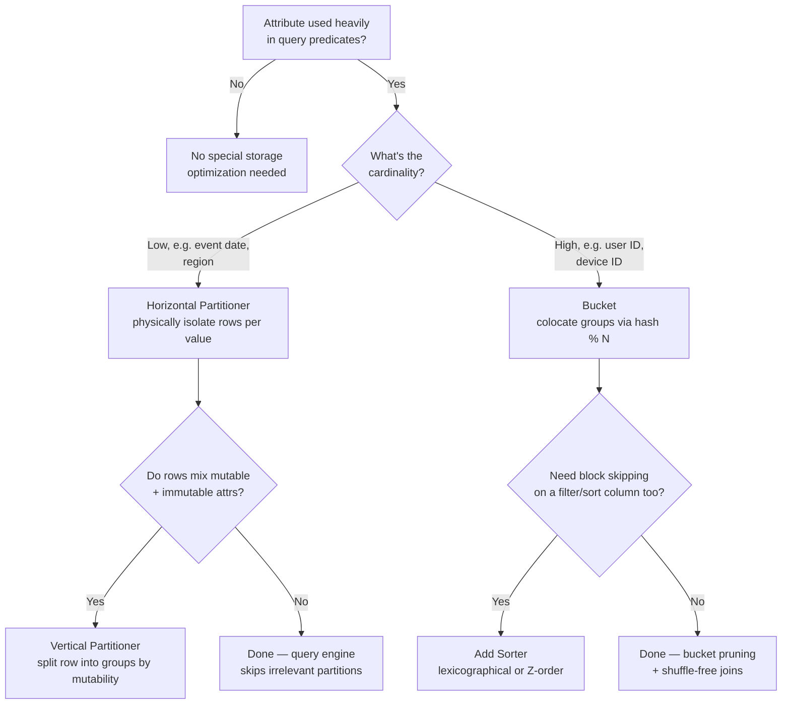
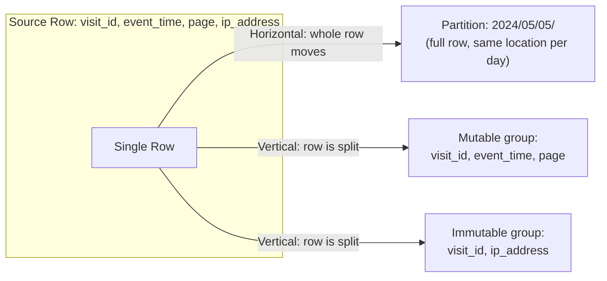
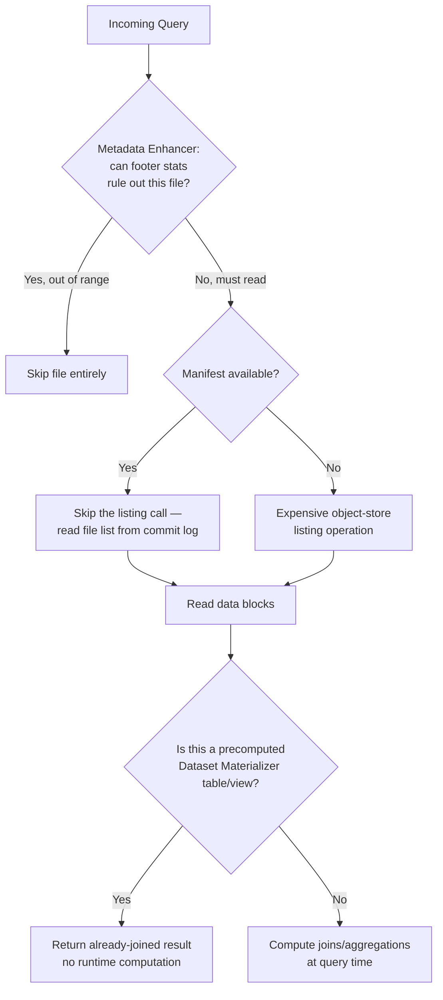
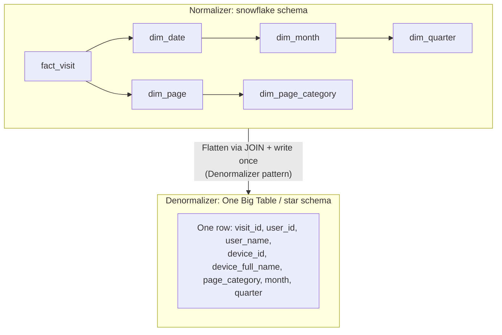
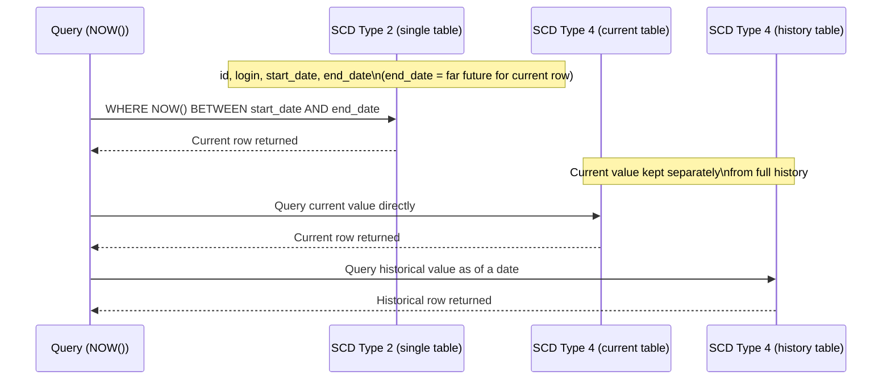

# Chapter 8 — Data Storage Design Patterns

## Chapter Framing

> Have you ever waited for a query or job longer than two minutes in a big data environment? Many of you will answer yes — some of you may have waited more than 10 minutes.

That's how the book opens this chapter. You can fight latency two ways: throw more compute at it (fast, reactive, but expensive and usually done under pressure once users complain), or organize storage wisely up front (preemptive, and the subject of this chapter).

This chapter follows Chapter 7 (Data Security), and the book frames storage as one of the three remaining topics before the journey ends — storage optimizes data access; quality (Ch. 9) and observability (Ch. 10) make sure the fast data you're serving is also trustworthy.

The chapter is organized into four groups of patterns:

1. **Partitioning** — dividing datasets so processing touches only what's relevant (Horizontal, Vertical Partitioner).
2. **Records Organization** — colocation strategies for high-cardinality data that partitioning can't handle well (Bucket, Sorter).
3. **Read Performance Optimization** — metadata- and materialization-based tricks that skip work entirely (Metadata Enhancer, Dataset Materializer, Manifest).
4. **Data Representation** — how many tables you split a record across, trading consistency for query speed (Normalizer, Denormalizer).

---

## Pattern-by-Pattern Breakdown

### 1. Horizontal Partitioner

#### Problem
You built a batch job computing rolling aggregates for the previous four days. It ran fine for months, but as storage grew, the filtering step (ignoring records older than four days) got slower. Adding compute masked the problem but raised cost. You need a way to keep costs flat while cutting execution time as data keeps arriving.

#### Solution
Identify a **partitioning attribute** (a.k.a. **distribution key**). The ingestion process or data store then physically isolates storage per partition value.

Time-based partitions are the most common, and the time attribute can come from:
- **The job execution context** — all records from one run land in the same partition (e.g., all rows for a job run on `2024-12-31`).
- **The dataset itself (event time)** — because of late data, a single job run may write into several different partitions.

You aren't limited to time — business keys (customer ID, partner ID, region) work too, and you can nest keys (e.g., event time **and** country).

> **✅ Say this out loud**
> "I partition by a low-cardinality, frequently-filtered attribute — usually event time rounded to the hour or day — because that's what lets the query engine skip irrelevant partitions without exploding the metadata layer."

#### Consequences
- **Granularity and metadata overhead** — a partition is a physical location for one attribute value. Too many partitions (e.g., partitioning 1M daily unique users by username) causes slow listing and the small-files problem. *Mitigation:* use low-cardinality attributes; reach for the **Bucket** pattern for high-cardinality columns.
- **Skew** — partitions aren't guaranteed to be balanced. In microbatch streaming, one skewed partition blocks the whole microbatch since batches process in a blocking manner. *Mitigation:* a backpressure buffer that stores overflow from the skewed partition and processes it in the next microbatch — at the cost of extra latency for just that partition.
- **Mutability** — changing the partition key requires moving all existing data, which is costly. *Mitigation:* some stores (Apache Iceberg) support **partition evolution** at the metadata layer only — old data stays where it is, new data uses the new scheme.

> **📌 Note**
> Sharding is a special case of horizontal partitioning that operates at the physical/hardware layer (splitting across machines). Horizontal partitioning itself doesn't require moving data across machines.

#### Examples

```python
# Apache Spark — partitioning by granular date columns
partitioned_users = (input_users
    .withColumn('year', functions.year('change_date'))
    .withColumn('month', functions.month('change_date'))
    .withColumn('day', functions.day('change_date'))
    .withColumn('hour', functions.hour('change_date')))

(partitioned_users.write.mode('overwrite').format('delta')
    .partitionBy('year', 'month', 'day', 'hour').save(output_dir))
```

```java
// Apache Kafka — custom partitioner (Java, due to API constraints)
public class RangePartitioner implements Partitioner {
    private static final int DEFAULT_PARTITION = 1;
    private final static Map<String, Integer> RANGES_PER_PARTITIONS = new HashMap<>();
    static {
        RANGES_PER_PARTITIONS.put("A", 0);
        RANGES_PER_PARTITIONS.put("B", 0);
    }
    @Override
    public int partition(String topic, Object key, byte[] keyBytes,
                          Object value, byte[] valueBytes, Cluster cluster) {
        String keyAsString = key.toString();
        return RANGES_PER_PARTITIONS.getOrDefault(keyAsString, DEFAULT_PARTITION);
    }
}
```

```java
Properties props = new Properties();
props.put("partitioner.class", "com.waitingforcode.RangePartitioner");
```

```sql
-- PostgreSQL: range partitioning by event_time
CREATE TABLE visits_all (
  visit_id CHAR(36) NOT NULL,
  event_time TIMESTAMP NOT NULL,
  user_id TEXT NOT NULL,
  page VARCHAR(20) NULL,
  PRIMARY KEY(visit_id, event_time)
) PARTITION BY RANGE(event_time);

CREATE TABLE visits_all_20231124 PARTITION OF visits_all
  FOR VALUES FROM('2023-11-24 00:00:00') TO ('2023-11-24 23:59:59');
CREATE TABLE visits_all_20231125 PARTITION OF visits_all
  FOR VALUES FROM('2023-11-25 00:00:00') TO ('2023-11-25 23:59:59');
```

> **📌 Note**
> Keep it simple — extra code (like a custom Kafka partitioner) is extra complexity. Most of the time you'll stick with default partitioners.

---

### 2. Vertical Partitioner

> **📌 Note**
> This is a data-storage specialization of vertical partitioning. Chapter 7 covers a different specialization of the same idea applied to **security**.

#### Problem
Your visits dataset has two attribute categories: **mutable** (visit time, visited page — change every visit) and **immutable** (IP address — same for the whole visit). You want to avoid duplicating the immutable data on every row.

#### Solution
Classify attributes into groups (mutable vs. immutable), and pick a combining key (here, `visit_id`) so the groups can be rejoined later. Your job then writes each group to its own dedicated location — separate tables or directories.

Beyond deduplication, Vertical Partitioner adds flexibility: since a row is now split, you can apply **different retention or access policies** per group — much harder to do on an undivided row.

The distinction from Horizontal Partitioner: horizontal moves a **whole row** to a different location; vertical **splits a row** and writes the pieces to different locations.

#### Consequences
- **Domain split** — logically related attributes now live in separate places, harder to discover without good documentation.
- **Querying** — reconstructing the full picture of a row is harder than with a horizontally partitioned dataset. *Mitigation:* expose a combining view, e.g., via the **Dataset Materializer** pattern.
- **Data producer impact** — producers can no longer just write a row as-is; they must implement the division logic and perform multiple writes, at a higher network cost.

#### Examples

```python
# Apache Spark — splitting user context and technical context into two tables
# Must call persist() so the input isn't read twice
input_dataset.persist()

user_context = input_dataset.drop('browser', 'os_version', 'device_id')
technical_context = input_dataset.select('visit_id', 'browser', 'os_version', 'device_id')

user_context.write.mode('overwrite').format('delta').save(user_context_dir)
technical_context.write.mode('overwrite').format('delta').save(technical_context_dir)
```

---

### 3. Bucket

#### Problem
A high-cardinality business attribute (e.g., a unique user ID) is used in 80% of your query predicates. It's too high-cardinality to be a partitioning column — you'd hit metadata limits — but you still need to optimize access to it.

#### Solution
Colocate **groups of rows** rather than colocating rows by exact value. Define the bucket column(s), and pick a number of buckets — the tradeoff being: high cardinality + few buckets = fewer, bigger buckets; more buckets = more, smaller buckets. Assignment uses modular hashing: `hash(key) % buckets_number`.

Bucketing enables two optimizations:
- **Bucket pruning** — when a bucket column is a query predicate, the engine eliminates whole buckets that can't contain matching keys.
- **Shuffle elimination on joins** — if both sides of a `JOIN` are bucketed identically, the engine can join bucket-to-bucket without a network shuffle.

> **📌 Note**
> Bucketing was popularized by Apache Hive, and is now integrated into Apache Spark and AWS Athena.

#### Consequences
- **Mutability** — the bucketing schema is immutable in practice; changing the column or bucket count requires a costly backfill.
- **Bucket size** — sizing is a prediction problem. Size for today's volume and future buckets get too big; try to predict future volume and you risk being wrong (writers may create more buckets than intended in the meantime).

> **✅ Say this out loud**
> "Bucketing is my answer when a high-cardinality column is central to my query and join patterns and partitioning would blow up the metadata layer — the cost is that the bucket count is essentially a one-way door."

#### Examples

```sql
-- AWS Athena — bucketed table (logical only; Athena doesn't write data)
CREATE EXTERNAL TABLE visits (...) ...
CLUSTERED BY (`user_id`) INTO 50 BUCKETS
TBLPROPERTIES ('bucketing_format' = 'spark')
```

```python
# Apache Spark — writing a bucketed table
input_dataset.write.bucketBy(50, 'user_id').saveAsTable(table_name)
```

---

### 4. Sorter

#### Problem
You store data in weekly tables to use the Fast Metadata Cleaner pattern (idempotency). That helped daily maintenance, but query execution time didn't improve. You know most queries filter or sort by `event_time` and want to exploit that without abandoning the weekly-table strategy.

#### Solution
Identify the sorting column(s) and declare them at table creation. The database then organizes written rows in that order. Combined with file metadata (see **Metadata Enhancer**), queries targeting sorted columns can skip whole data blocks.

**Curved sorts** (Z-order) are a variant: instead of lexicographical (top-to-bottom) sorting, Z-order colocates rows across multiple dimensions by using a curved layout. On a two-column-sorted example in the book, lexicographical order needed to read **9 data blocks** for a given predicate, while Z-order needed only **7**. Z-order is native to Delta Lake and Apache Iceberg; Amazon Redshift has an equivalent (interleaved sort keys); GCP BigQuery and Snowflake offer classical clustered sorting.

> **📌 Note**
> Z-order is often called "clustering" because it colocates related records, but it does so by sorting data on disk — like lexicographical sort — which is why the book classifies it under the Sorter pattern rather than treating it as a separate pattern.

#### Consequences
- **Unsorted segments** — sorting isn't instantaneous; new writes create unsorted blocks until a sort/compaction pass runs. *Mitigation:* schedule sorting inside or outside the write job (at the cost of extra execution time if done inline).
- **Composite sort keys** — with lexicographical multi-column sort keys, queries must reference columns in the **order they were declared** to benefit. A query on `visit_time, page` sorted the same way benefits fully; a query filtering **only** on `page` (the second key) still scans most blocks.
- **Mutability** — changing sort keys after the fact may require re-sorting the entire table, which can be costly depending on size.

#### Examples

```sql
-- GCP BigQuery — clustered table
CREATE TABLE `dedp.visits.raw_visits`
PARTITION BY DATE(event_time)
CLUSTER BY visit_id, page
```

```python
# Delta Lake — Z-order compaction
DeltaTable.forPath(spark, output_dir).optimize().executeZOrderBy(['visit_id', 'page'])
```

---

### 5. Metadata Enhancer

#### Problem
You partitioned a JSON dataset horizontally by event time. New data analysts now query a small subset of rows from a single (large) partition, but always **load the full dataset first** and filter afterward — driving up both latency and pay-as-you-go cloud costs. You want filtering to happen **before** the data is loaded.

#### Solution
Collect and persist **statistics** about stored records, at the file level or the table level.

For columnar file formats (Apache Parquet), each file carries a **footer** with per-column statistics (min/max values, etc.), computed automatically at write time. When a query filters on a column present in the footer, the engine checks the (small) footer instead of opening the (large) data block — a major speed-up, though there's still overhead in reading all the footers.

Table file formats (Delta Lake, Apache Iceberg, Apache Hudi) build on Parquet's stats by also storing commit-log-level metadata: row counts per commit, column min/max, and null counts.

Relational databases and data warehouses maintain similar statistics in a separate table that the query planner consults to build efficient execution plans.

#### Consequences
- **Overhead** — building stats at write time is an extra step; for databases/warehouses, the store must also keep them current.
- **Out-of-date statistics** — auto-updates are usually threshold-based (e.g., % of rows changed), so small incremental changes can leave stats stale, degrading the execution plan. *Mitigation:* manually refresh with a command like `ANALYZE TABLE` — but this adds temporary read overhead.

#### Examples

```python
# Apache Spark — writing Parquet (statistics generated automatically)
input_dataset.write.mode('overwrite').parquet(path=get_parquet_dir())
```

```bash
# Inspecting Parquet footer statistics
docker run --rm -v "./output-parquet:/tmp/parquet" \
  hangxie/parquet-tools:v1.20.7 meta \
  /tmp/parquet/part-00001-3c52ae6f-aeea-4364-aac3-7fc69d63e898-c000.snappy.parquet
```

```json
// Apache Parquet column statistics (ID column)
{"NumRowGroups": 1, "PathInSchema": ["Id"], "Type": "BYTE_ARRAY",
 "Encodings": ["PLAIN", "RLE", "BIT_PACKED"], "CompressedSize": 180463,
 "UncompressedSize": 200035, "NumValues": 5000,
 "NullCount": 0, "MaxValue": "fffbe4f8-8d88-43d2-a9a5-54bf536de75b",
 "MinValue": "0018e1dc-1b80-4410-92f6-5261d2dadf35",
 "CompressionCodec": "SNAPPY"}
```

```json
// Delta Lake commit log statistics
{"commitInfo":{"timestamp":1716954694590,"operation":"WRITE",
  "operationMetrics":{"numFiles":"1","numOutputRows":"6100","numOutputBytes":"50437"}}}
{"add":{"path":"part-...-c000.snappy.parquet","size":50437,
  "stats":"{\"numRecords\":6100,
    \"minValues\":{\"type\":\"galaxy\",\"full_name\":\"APPLE iPhone 11 (White, 64 GB)\",\"version\":\"Android 10\"},
    \"maxValues\":{\"type\":\"mac\",\"full_name\":\"Yoga 7i (14\\\" Intel) 2 in 1 Lapto\",\"version\":\"v17169535721658688\"},
    \"nullCount\":{\"type\":0,\"full_name\":0,\"version\":0}}"}}
```

---

### 6. Dataset Materializer

#### Problem
You wanted to simplify querying multiple partitioned tables spanning the past three weeks. You created a **view**, but consumers still complain about latency — because a view re-runs its underlying query on every access.

#### Solution
Materialize the data instead of recomputing it: identify what should be materialized, write the appropriate `SELECT` (possibly with `UNION`/`JOIN`), and store the result as a **materialized view** or a **table**.

The choice between the two comes down to refresh:
- **Materialized view** — some warehouses support automatic refresh (e.g., Amazon Redshift's `AUTO REFRESH YES`), though timing isn't immediate and depends on current workload/data size. GCP BigQuery, Databricks, and Snowflake also support materialized views.
- **Table** — you own the refresh entirely (no automatic refresh), but you gain the ability to apply other storage optimizations (partitioning, bucketing, sorting) that materialized views may not support.

#### Consequences
- **Refresh cost** — a full re-run of the creation query on refresh can be expensive and competes for database resources. *Mitigation:* incremental refresh (only integrate the newest changes) — ideal for insert-only workloads. Databricks and BigQuery support incremental refresh out of the box, but not for every SQL operation; sometimes the whole dataset still gets refreshed.
- **Data access** — because a materialized dataset spans multiple source tables, consistent retention/access policy enforcement is hard. If a user lacks access to one underlying table, you should deny view access too, or apply the **Fine-Grained Accessor** pattern.
- **Data storage overhead** — materialization trades storage for speed. *Mitigation:* a mixed approach where only some source datasets are materialized and others stay recomputable.

> **🧩 Case Study**
> The chapter's blog analytics platform illustrates an **incremental** Dataset Materializer: a `visits_counter` table is kept up to date by `MERGE`-ing only rows with `insertion_time` after the previous run — combining the **Incremental Loader** and **Merger** patterns.

#### Examples

```sql
-- GCP BigQuery — auto-refreshed materialized view (refresh target: every 15 min)
CREATE MATERIALIZED VIEW dedp.visits.visits_enriched
OPTIONS (enable_refresh = true, refresh_interval_minutes = 15)
AS SELECT ...
```

```sql
-- PostgreSQL — manual refresh
REFRESH MATERIALIZED VIEW dedp.windowed_visits WITH DATA;
```

```sql
-- Incremental Dataset Materializer: MERGE new visit counts into an existing table
MERGE INTO dedp.visits_counter AS target
USING (
  -- 2024-11-09T03:27:32 is the time after the previous insertion_time
  SELECT user_id, COUNT(*) AS visits FROM dedp.visits
  WHERE insertion_time > '2024-11-09T03:27:32' GROUP BY user_id
) AS input
ON target.user_id = input.user_id
WHEN MATCHED THEN UPDATE SET count = count + input.visits
WHEN NOT MATCHED THEN INSERT (user_id, count) VALUES (input.user_id, input.visits)
```

---

### 7. Manifest

#### Problem
You built an Apache Parquet dataset on an object store; batch jobs run fast and cheap. Now you're asked to expose the same dataset to data analysts through a data warehouse layer, but the first tests are slow — the bottleneck is the **listing operation** to discover files, which involves many object-store API calls.

#### Solution
List files **once**, or not at all if the producer records filenames up front — that's the Manifest pattern.

Table file formats (Delta Lake, Apache Iceberg, Apache Hudi) implement this natively: each transaction's file list is written to the **commit log** in the metadata location, so readers fetch the file list from the commit log instead of listing storage.

Manifests aren't only for reading — Amazon Redshift's `COPY` command accepts a manifest file defining exactly which files to load, which is also a way to make a **loading operation idempotent** (tie the manifest to a specific job run so replays load the same files). GCP's Storage Transfer Service uses a similar manifest-listing approach for cross-cloud copying.

#### Consequences
- **Complexity** — adds an extra creation step to the pipeline, but it's a relatively simple listing operation, and easier to accept than repeated slow, unpredictable listing calls.
- **Size** — manifests can grow to several gigabytes, especially with many small files or continuous streaming producers. Historically, early Apache Spark Structured Streaming manifests grew so large that jobs sometimes couldn't restart (fixed — see `SPARK-27188`). Some implementations cap manifest size or apply retention to entries.

#### Examples

```python
# Delta Lake — generating a manifest file
devices_table = DeltaTable.forPath(spark_session, DemoConfiguration.DEVICES_TABLE)
devices_table.generate('symlink_format_manifest')
```

```sql
-- BigQuery — external table referencing the Delta Lake manifest
CREATE EXTERNAL TABLE IF NOT EXISTS `dedp.visits.devices`
...
OPTIONS (
  hive_partition_uri_prefix = "gc://devices",
  uris = ['gc://devices/_symlink_format_manifest/*/manifest'],
  file_set_spec_type = 'NEW_LINE_DELIMITED_MANIFEST',
  format="PARQUET");
```

```sql
-- Amazon Redshift — idempotent COPY using a manifest
COPY customer
FROM 's3://devices/manifest_20250601_1031'
...
MANIFEST;
```

```json
// manifest_20250601_1031
{"entries": [
  {"url":"s3://devices/dataset_1","mandatory":true},
  {"url":"s3://devices/dataset_2","mandatory":true}]}
```

---

### 8. Normalizer

#### Problem
Your visits table mixes event-driven attributes (visit time, visited page) with immutable attributes (device name, OS name/version), and the immutable attributes repeat on every row — bloating storage and slowing updates when they change.

#### Solution
Normalize: represent each fact once. Two implementations, sharing the same design process (define business entities → describe their attributes → define relationships):

**Normal Forms (NF)** — common in transactional workloads:
- **1NF** — atomic, non-repeating column values; each row uniquely identified by a primary key.
- **2NF** — every non-primary column depends on the **whole** primary key (not just part of a composite key).
- **3NF** — no transitive dependencies between non-primary attributes; every non-primary column depends only on the primary key.

**Snowflake schema** — the dimensional-model implementation for analytical workloads: one **fact table** (an observation, e.g., a website visit) described by multiple **dimension tables**, which can themselves be described by further dimension tables (e.g., date → month → quarter).

> **📌 Note**
> The Normalizer's overarching goal is to prioritize **data consistency** over performance: an update is reflected once and is immediately visible everywhere it's referenced.

#### Consequences
- **Query cost** — normalized data means more `JOIN`s, which are costly in distributed environments due to network exchange. *Mitigation:* colocate small dimension/entity tables with larger ones so joins stay local, or use **broadcast joins** (e.g., Spark's `spark.sql.autoBroadcastJoinThreshold`) to avoid network-heavy shuffles.
- **Archival** — dimension/entity tables can be time-sensitive (e.g., a product's price changes over the years). *Mitigation:* apply **SCD** techniques (see the Static Joiner pattern, Chapter 5) to preserve historical values.

#### Examples

```python
# Apache Spark + Delta Lake — joining normalized (NF) tables for a full visit
context = (visits_context
    .join(ads, visits_context.ads_id == ads.id, 'left_outer').drop('id')
    .join(browser, visits_context.browsers_id == browser.id, 'left_outer').drop('id')
    .join(device, visits_context.devices_id == device.id, 'left_outer').drop('id'))

page_with_category = (pages.withColumnRenamed('id', 'page_id')
    .join(categories, pages.page_categories_id == categories.id, 'left_outer')
    .drop('id').withColumnRenamed('page_id', 'id'))

full_visit = (visits
    .join(context, visits.visit_id_event == context.visit_id, 'left_outer')
    .drop('visit_id_event')
    .join(users, visits.users_id == users.id, 'left_outer').drop('id')
    .join(page_with_category, visits.pages_id == page_with_category.id, 'left_outer')
    .drop('id').withColumnRenamed('visit_id', 'id'))
```

```python
# Querying overhead for a snowflake schema (dates + pages)
page_w_category = dim_page.join(dim_page_category,
    dim_page.dim_page_category_id == dim_page_category.page_category_id, 'left_outer')

date_with_month_and_quarter = (dim_date
    .join(dim_date_month, dim_date.dim_month_id == dim_date_month.month_id, 'left_outer')
    .join(dim_date_quarter, dim_date.dim_quarter_id == dim_date_quarter.quarter_id, 'left_outer'))

full_visit = (fact_visit
    .join(page_w_category, fact_visit.dim_page_id == page_w_category.page_id, 'left_outer')
    .join(date_with_month_and_quarter,
          fact_visit.dim_date_id == date_with_month_and_quarter.date_id, 'left_outer'))
```

---

### 9. Denormalizer

#### Problem
A company implemented a fully relational model on their analytics warehouse. It worked fine at low volume, but after their product took off, the analytics team complained about query time — 80% of queries joined **eight** tables.

#### Solution
Flatten values from joined tables into a single row, eliminating the need for network data exchange at query time. Two techniques:
- **As regular columns** ("**One Big Table**") — every joined column becomes a top-level column.
- **As nested structures** — joined rows become a `STRUCT`-typed column; users access nested attributes instead of top-level columns.

A **star schema** is the dimensional-model version of Denormalizer: like the snowflake schema, it has fact and dimension tables, but dimensions cannot describe other dimensions — everything collapses into the top-level dimension table. Result: significantly lower query cost from reduced network traffic.

> **📌 Note**
> Normalizer and Denormalizer aren't mutually exclusive. You can build a normalized (snowflake) model first for consistency, then build a denormalized (One Big Table) version on top of it for querying — using a sequence pattern from Chapter 6 to keep them in sync. You can even hide the snowflake schema from end users and treat it as a private internal reference model.

#### Consequences
- **Costly updates** — duplicated attributes mean one logical update can require changing many physical rows. *Mitigation:* treat the denormalized table as an immutable **snapshot** (no updates needed), or simply accept the more expensive update cost for faster reads.
- **Storage** — duplicated data increases storage footprint.
- **Row consistency after updates** — flows from the costly-updates issue above; partial updates can leave a denormalized table internally inconsistent if not handled carefully.

> **✅ Say this out loud**
> "I'd reach for One Big Table or a star schema when read latency dominates and the source data is closer to append-only — the update cost is the real bill you're paying for that speed."

#### Examples

```python
# One Big Table — costly write, cheap reads
page_w_category = dim_page.join(dim_page_category,
    dim_page.dim_page_category_id == dim_page_category.page_category_id, 'left_outer')

date_w_month_quarter = (dim_date
    .join(dim_date_month, dim_date.dim_month_id == dim_date_month.month_id, 'left_outer')
    .join(dim_date_quarter, dim_date.dim_quarter_id == dim_date_quarter.quarter_id, 'left_outer'))

full_visit = (fact_visit
    .join(page_w_category, fact_visit.dim_page_id == page_w_category.page_id, 'left_outer')
    .join(date_w_month_quarter, fact_visit.dim_date_id == date_w_month_quarter.date_id, 'left_outer'))

full_visit.write.mode('overwrite').format('delta').save(get_one_big_table_dir())

# reading — no joins needed
visits_table = spark_session.read.format('delta').load(get_one_big_table_dir())
```

```python
# Star schema — more tables at write time, joins reappear at read time
page_with_category = dim_page.join(dim_page_category,
    dim_page.dim_page_category_id == dim_page_category.page_category_id,
    'left_outer').dropDuplicates()
page_with_category.write.mode('overwrite').format('delta').save(output_page)

date_with_month_and_quarter = (dim_date
    .join(dim_date_month, dim_date.dim_month_id == dim_date_month.month_id, 'left_outer')
    .join(dim_date_quarter, dim_date.dim_quarter_id == dim_date_quarter.quarter_id, 'left_outer')
    ).dropDuplicates()
(date_with_month_and_quarter.write.mode('overwrite').format('delta').save(output_date_dir))

visits_dataset = (spark_session.read
    .schema('visit_id STRING, event_time TIMESTAMP, page STRING')
    .format('json').load(input_visits_dir))

fact_visit = (visits_dataset.selectExpr(
    'visit_id', 'HASH(page) AS dim_page_id',
    'HASH(TO_DATE(event_time)) AS dim_date_id',
    'DATE_FORMAT(event_time, "HH:mm:ss") AS event_time'))
fact_visit.write.mode('overwrite').format('delta').save(output_visits_dir)

# reading — joins are back
fact_visit = spark_session.read.format('delta').load(output_visits_dir)
dim_date = spark_session.read.format('delta').load(output_date_dir)
dim_page = spark_session.read.format('delta').load(output_page_dir)

full_visit = (fact_visit
    .join(dim_date, fact_visit.dim_date_id == dim_date.date_id, 'left_outer')
    .join(dim_page, [fact_visit.dim_page_id == dim_page.page_id], 'left_outer'))
```

---

## Diagrams

### Partitioning strategy decision flow



### Horizontal vs. Vertical Partitioner (row movement)



### Read Performance Optimization: three ways to skip work



### Normalizer (snowflake) vs. Denormalizer (One Big Table / star)



### SCD Type 2 vs. Type 4 (used for Normalizer's Archival consequence)



---

## Trade-off / Comparison Tables

### Partitioning patterns

| Pattern | When to Use | Trade-off |
|---|---|---|
| **Horizontal Partitioner** | Low-cardinality attribute used as a query predicate (event date, region); also enables idempotency patterns like Fast Metadata Cleaner | Granularity/metadata overhead if cardinality creeps up; skew can block whole microbatches; changing the key requires moving data (unless the store supports metadata-only partition evolution) |
| **Vertical Partitioner** | Rows mix attributes with different mutability or access/retention needs (e.g., mutable visit context vs. immutable IP) | Domain split makes the full row harder to reconstruct; producers must implement split-write logic and pay extra network cost |

### Records organization patterns

| Pattern | When to Use | Trade-off |
|---|---|---|
| **Bucket** | High-cardinality column that's central to filters/joins, where Horizontal Partitioner would create too many partitions | Bucketing schema is effectively immutable — changing column or bucket count needs a costly backfill; right-sizing buckets requires predicting future volume |
| **Sorter** | Queries consistently filter/sort by known column(s); want block-skipping without changing partition/idempotency strategy | Sorting overhead at write time (unsorted segments accumulate until compacted); composite sort keys only help if query columns match declared key order |

### Read performance optimization patterns

| Pattern | When to Use | Trade-off |
|---|---|---|
| **Metadata Enhancer** | Consumers filter on columns before they need to touch full data blocks; want cheaper predicate pushdown | Extra write-time overhead to compute stats; stats can go stale between threshold-based refreshes |
| **Dataset Materializer** | A costly, repeatedly-run query (joins/aggregations) is serving many readers via a view | Refresh cost (mitigated by incremental refresh for insert-only data); harder to apply consistent access/retention policy across source tables; extra storage |
| **Manifest** | Object-store listing operations are the dominant latency cost, especially with many files or many concurrent readers | Adds a (simple) manifest-creation step; manifests can grow to multi-GB with many small files or continuous streaming writers |

### Data representation patterns

| Pattern | When to Use | Trade-off |
|---|---|---|
| **Normalizer** (NF / snowflake) | Data consistency matters most; frequent updates to reference/dimension data; can tolerate query-time joins | Query cost from distributed joins (mitigate with colocation or broadcast joins); time-sensitive dimensions need SCD to support archival queries |
| **Denormalizer** (One Big Table / star) | Read latency dominates; source is closer to append-only or can be treated as point-in-time snapshots | Costly, multi-row updates when duplicated attributes change; higher storage footprint |

---

## Gotchas (by pattern)

- **Horizontal Partitioner**
  - High-cardinality partitioning attributes → too many partitions → slow listing + small files problem.
  - Skewed partitions block entire microbatches in streaming (blocking execution model).
  - Changing the partition key is expensive; only some stores (Iceberg) offer metadata-only evolution, and it doesn't retroactively move old data.
- **Vertical Partitioner**
  - Split attributes are harder to discover without documentation (domain split).
  - Reconstructing a full row needs a join/materialized view.
  - Producers must write to multiple locations, raising network cost.
- **Bucket**
  - Bucket schema is a near-permanent decision; changing it needs a full backfill.
  - No perfect bucket-count sizing strategy — you're always trading off against future growth.
- **Sorter**
  - New writes create unsorted segments until a sort/compaction step runs — that step itself costs time if inlined.
  - Composite sort key benefits only apply when the query's filter columns match the **declared order** of the sort key.
  - Re-sorting after a key change can mean re-sorting the whole table.
- **Metadata Enhancer**
  - Write-time overhead for stats collection.
  - Threshold-based auto-refresh in databases/warehouses can leave stats stale after many small changes; manual `ANALYZE TABLE` runs add temporary read overhead.
- **Dataset Materializer**
  - Full refreshes are expensive; automatic refresh timing isn't guaranteed to be immediate (e.g., BigQuery targets 5 minutes, but can be delayed under load).
  - Cross-table access/retention policy enforcement is hard once datasets are combined.
  - Storage overhead from duplicating already-stored data.
- **Manifest**
  - Manifests can balloon in size with many small files or continuous streaming producers (historically caused Spark Structured Streaming restart failures — SPARK-27188).
- **Normalizer**
  - Distributed joins are costly — mitigations (colocation, broadcast joins) only go so far.
  - Time-sensitive dimension/entity tables need SCD (type 2 or 4) to support "what was the value on date X" queries.
- **Denormalizer**
  - Updating one duplicated value can mean rewriting many physical rows.
  - Higher storage footprint from duplication.
  - Treating the denormalized table as a mutable (not snapshot) view makes updates progressively more expensive as duplication grows.

---

## Case-Study Callouts

> **🧩 Case Study**
> The blog analytics platform's `visits` dataset is the running example for **Horizontal Partitioner**: partitioning by `year/month/day/hour` (event time) directly supports the rolling four-day aggregate job from the Problem statement, and nesting event time with `country` (`visits/2024/05/05/france|india|poland|usa`) shows a real multi-level partition layout.

> **🧩 Case Study**
> The **Vertical Partitioner** problem is grounded in the same `visits` table: separating mutable visit-context columns from the immutable IP address column, tied together by `visit_id`.

> **🧩 Case Study**
> The **Dataset Materializer**'s incremental example builds `dedp.visits_counter`, a running per-user visit count kept fresh via `insertion_time`-filtered `MERGE`s — a direct combination of the Incremental Loader and Merger patterns from earlier chapters.

> **🧩 Case Study**
> **Normalizer** and **Denormalizer** both use the same visits model: a fully normalized snowflake schema (`fact_visit`, `dim_page`, `dim_date`, `dim_month`, `dim_quarter`, `dim_page_category`) versus a flattened One Big Table / star schema version — the book explicitly shows both the costly-write/cheap-read and cheap-write/costly-read code paths side by side.

---

## "Say This in an Interview / Design Review"

> **✅ Say this out loud** — Horizontal Partitioner
> "I partition by a low-cardinality, frequently-filtered attribute — usually event time rounded to the hour or day — because that's what lets the query engine skip irrelevant partitions without exploding the metadata layer."

> **✅ Say this out loud** — Bucket
> "Bucketing is my answer when a high-cardinality column is central to my query and join patterns and partitioning would blow up the metadata layer — the cost is that the bucket count is essentially a one-way door."

> **✅ Say this out loud** — Denormalizer
> "I'd reach for One Big Table or a star schema when read latency dominates and the source data is closer to append-only — the update cost is the real bill you're paying for that speed."

> **✅ Say this out loud** — Normalizer vs. Denormalizer (combined)
> "These aren't mutually exclusive — I can build a normalized model for consistency and layer a denormalized, query-optimized copy on top, syncing them with a sequence pattern, and even keep the normalized layer private if end users only need the flattened view."

---

## Special Notes

- **Sharding vs. Horizontal Partitioning** — sharding is a *physical/hardware*-layer special case of horizontal partitioning; horizontal partitioning itself doesn't require moving data across machines.
- **Tool-specific quirks:**
  - Amazon Athena implements Bucket only at the *logical* level — it never writes data, so `INSERT INTO` on a bucketed table errors out.
  - Apache Spark Structured Streaming's early manifest implementation had an unbounded-growth bug (fixed; see `SPARK-27188`).
  - Databricks and GCP BigQuery support incremental materialized-view refresh, but not for all SQL operations — some changes still trigger a full refresh.
  - Amazon Redshift's materialized-view `AUTO REFRESH` and BigQuery's refresh interval are both best-effort, not guaranteed-immediate.
- **Further reading pointed to by the book:**
  - *The Cloud Data Lake* by Rukmani Gopalan (O'Reilly, 2023) — referenced elsewhere in the book for the small-files problem, directly relevant to bucket/partition sizing decisions in this chapter.
  - Dimensional modeling / fact & dimension table background — the book notes "plenty of great reference material" exists beyond its own scope for star/snowflake schema fundamentals.

---

## Cheat Sheet

| Pattern | Problem (1 line) | Solution (1 line) | Biggest Gotcha |
|---|---|---|---|
| **Horizontal Partitioner** | Slow filtering as a dataset grows unbounded | Physically isolate rows by a low-cardinality attribute (often time) | Too-high cardinality → metadata/small-files overload; skew blocks microbatches |
| **Vertical Partitioner** | Immutable attributes duplicated on every row | Split row into mutable/immutable groups joined by a shared key | Domain split makes full-row reconstruction and documentation harder |
| **Bucket** | High-cardinality column can't be a partition key | Hash-based colocation into a fixed number of buckets | Bucket count is nearly a one-way door — resizing needs a backfill |
| **Sorter** | Data is physically organized but queries still scan whole blocks | Declare sort column(s); use Z-order for multi-dimension skipping | Composite key order must match query filter order; new writes are unsorted until compacted |
| **Metadata Enhancer** | Queries load the full dataset before filtering | Persist per-file/per-column stats (Parquet footers, commit logs) for predicate pushdown | Stats go stale between threshold-triggered refreshes |
| **Dataset Materializer** | A view re-runs its costly query on every access | Precompute into a materialized view or table | Refresh cost and cross-table access-policy consistency |
| **Manifest** | Object-store file listing is slow and repeated | Record the file list once (commit log or explicit manifest file) | Manifest can grow to multi-GB with many small files |
| **Normalizer** | Duplicated reference data causes update anomalies | Split into normal forms or a snowflake schema | Distributed joins are costly; time-sensitive dimensions need SCD |
| **Denormalizer** | Too many joins (e.g., 8 tables) tank query performance | Flatten into One Big Table or a star schema | Updates become expensive and storage footprint grows |

---

## Further Reading

- *The Cloud Data Lake* — Rukmani Gopalan (O'Reilly, 2023) — background on the small-files problem relevant to partitioning/bucketing decisions.
- Dimensional modeling references (fact tables, dimension tables) — the book points to external material for a deeper treatment beyond its own scope.
- Static Joiner pattern (Chapter 5) — for the SCD type 2/4 techniques referenced by the Normalizer's Archival consequence.
- Sequence design patterns (Chapter 6) — for keeping a Normalizer output and a Denormalizer output in sync.
- Fast Metadata Cleaner and Incremental Loader / Merger patterns (Chapters 4–5) — combined with Horizontal Partitioner and Dataset Materializer respectively in this chapter's examples.
