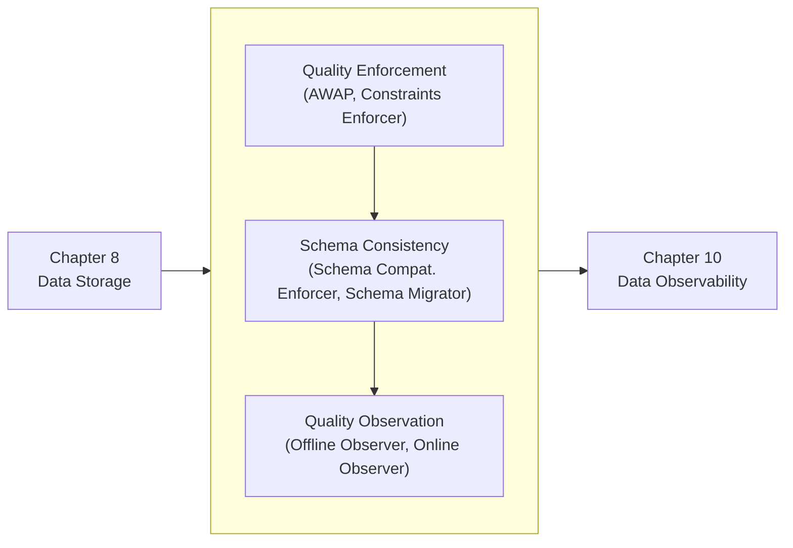
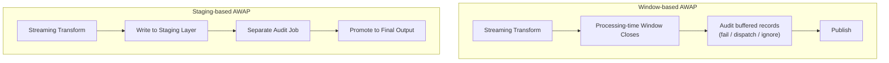
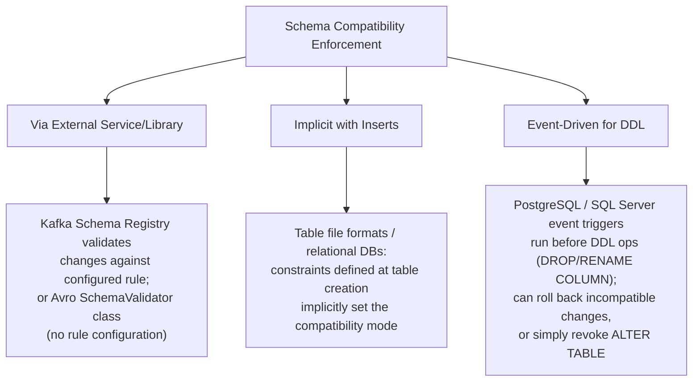
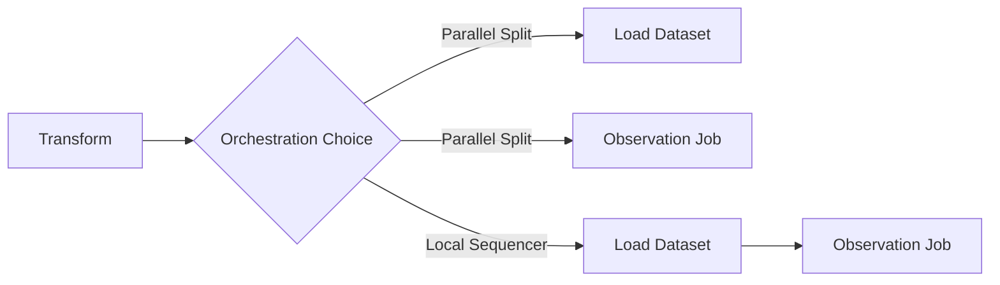

# Chapter 9 — Data Quality Design Patterns

## Chapter Framing

> **🧩 Case Study**
> The chapter runs on the same blog analytics platform from Chapter 1: even after
> ingestion, error handling, idempotency, value-add, flow, security, and storage
> patterns are all in place, the data can *still* be untrustworthy if quality issues
> slip through unnoticed. Trust is described as a "mutual transaction" between
> producer and consumer — poor quality (incompleteness, inaccuracy, inconsistency)
> breaks that transaction.

The book organizes Chapter 9 into **three categories**, each answering a different
question:

| Category | Question it answers |
|---|---|
| **Quality Enforcement** | How do I stop bad data from ever reaching consumers? |
| **Schema Consistency** | How do I stop a schema change from silently breaking everything downstream? |
| **Quality Observation** | How do I know my enforcement rules are still valid tomorrow? |

The chapter closes by handing off to **Chapter 10 (Data Observability)**, which adds
monitoring/alerting on top of these quality guards — because even a perfect AWAP job
is useless if it silently stops running.



---

## 1. Quality Enforcement

Quality enforcement patterns stop an incomplete, inconsistent, or inaccurate dataset
from ever reaching downstream consumers.

### Pattern: Audit-Write-Audit-Publish (AWAP)

> **📌 Note**
> AWAP is an evolution of the **Write-Audit-Publish (WAP)** pattern originated by
> Michelle Ufford at DataWorks Summit 2017 ("Whoops, the Numbers Are Wrong! Scaling
> Data Quality @ Netflix"). AWAP adds a *second, earlier* audit step on the raw
> input data — WAP only audits the transformed output.

#### Problem
A daily batch ETL job generates user-visit statistics. Unique visitors dropped **50%**
over the past week; the product team believed it and **launched a marketing
campaign** to fix it. It later turned out the unique-visitors aggregation itself was
computed incorrectly — not a real traffic drop. The product team stopped the
campaign and demanded a guarantee this couldn't happen silently again.

#### Solution
Add explicit **audit steps** (like assertions in unit tests, but running against the
real dataset) at two points in the pipeline:

1. **First audit** — validates the *input* data before transformation. Kept
   lightweight: file format checks, size checks, schema-presence checks (e.g.,
   confirming a CSV has expected columns `a`, `b`, `c` from just the first line).
   Validating the *entire* input risks reading the dataset twice.
2. **Second audit** — validates the *transformed* output, acting like unit tests
   running on production data (e.g., asserting columns `a`, `b`, `c` are never `NULL`
   post-transformation).

The same-sounding validation (e.g., "no NULLs") means something different at each
step: input audit checks the *producer's* promise; output audit checks *your own
transformation logic*. Put a validation at the most exhaustive point if you want to
avoid scanning the dataset twice for the same rule.

An audit failure doesn't have to mean "hard stop" — the book lists two softer
outcomes:
- **Data dispatching** — promote the valid rows, park the invalid ones separately
  (explicit control, not the same mechanism as the Dead-Letter pattern, which
  handles unexpected runtime errors).
- **Nonblocking audit** — publish the dataset anyway but annotate it with a data
  quality summary so consumers can decide whether to trust it.

**Streaming variant:** because data flows continuously, there's no natural "first
audit" moment. Two approaches (Figure 9-2):



> **✅ Say this out loud**
> "AWAP extends unit tests onto real production data — unit tests are static
> snapshots of expected behavior, but datasets evolve, so AWAP is how we keep
> validating against the *current* shape of the data, not just what it looked like
> when we wrote the tests."

#### Consequences
- **Compute cost** — metadata-only checks (format, size) are cheap; row-level
  validations are expensive. This is the accepted cost of guaranteed quality.
- **Rules coverage** — today's business rules may not cover tomorrow's dataset
  shape. AWAP-controlled pipelines should never be treated as 100% reliable;
  pair with **Quality Observation** patterns to catch what the rules miss.
- **Streaming latency** — asserting something like a NULL-value distribution
  within a window delays delivery by the window accumulation period.
- **An issue may not be an issue** — a volume drop *or spike* triggered by an audit
  isn't automatically a producer-side bug. Example: a sudden viral social-media
  mention spikes visit volume legitimately. Not every audit failure needs to be
  treated as critical — some should only raise an alert for investigation.

#### Examples

**Apache Airflow + PostgreSQL (batch, SQL-based):**
```python
audit_file_to_load = PythonOperator(
    task_id='audit_file_to_load',
    python_callable=local_validate_the_file_before_processing
)
transform_file = PythonOperator(
    task_id='transform_file',
    python_callable=flatten_input_visits_to_csv
)
def local_validate_flatten_visits():
    validate_flatten_visits(get_current_context())
audit_transformed_file = PythonOperator(
    task_id='audit_transformed_file',
    python_callable=local_validate_flatten_visits
)
load_flattened_visits_to_final_table = PostgresOperator(
    task_id='load_flattened_visits_to_final_table',
    sql='/sql/load_file_to_visits_table.sql'
)
(next_partition_sensor >> audit_file_to_load >> transform_file
 >> audit_transformed_file >> load_flattened_visits_to_final_table)
```
The input audit asserts correctness and overall size of the JSON lines file before
any transformation begins.

**Apache Spark Structured Streaming (staging-based AWAP):**
```python
# Job 1: write transformed records to a Delta Lake staging table
write_query = (visits.writeStream
    .trigger(processingTime='15 seconds')
    .option('checkpointLocation', checkpoint_dir)
    .foreachBatch(write_dataset_to_staging_table).start())

# Job 2: stream the staging table, audit, and route to final or errors
visits = (spark_session.readStream.format('delta')
    .option('maxBytesPerTrigger', 20000000)
    .table(get_staging_visits_table())
    .withColumn('is_valid', row_validation_expression)
)
write_query = (visits.writeStream
    .trigger(processingTime='30 seconds')
    .option('checkpointLocation', checkpoint_dir)
    .foreachBatch(audit_dataset_and_write_to_output_table)
    .start())
```

---

### Pattern: Constraints Enforcer

#### Problem
A batch pipeline processing visits has run cleanly for months, but has started
producing **random NULL values** in required fields. The job is already complex, and
adding more validation logic to it isn't attractive. The ask: fail the load itself
whenever a data quality error (like a missing required field) occurs — without
adding code to the pipeline.

#### Solution
Delegate validation to the **database or storage format** declaratively, instead of
writing validation logic in the pipeline. Identify the attributes needing rules
(business/legislation-driven — there's no universal rule set), then assign
constraints from four categories:

| Constraint Type | What it Guarantees |
|---|---|
| **Type** | Every value for an attribute is always the same type — backbone of Schema Consistency |
| **Nullability** | Attribute is always present, or explicitly allowed to be missing |
| **Value** | Value/expression must satisfy a comparison, e.g. `x <= NOW()`, `x BETWEEN 1901 AND 2000` |
| **Integrity** | A referenced value must exist in another table (common in normalized/relational schemas) |

Supported natively by Delta Lake's `CHECK` operator, and by serialization formats
like Protobuf (type constraints natively; value constraints via `protovalidate`).

#### Consequences
- **All-or-nothing semantics** — database-level constraints are usually
  transactional: if *any* row violates a rule, *none* of the batch is accepted.
  Databases also typically stop at the first error, forcing multiple round trips
  to discover every issue — unless you duplicate the validation logic on the
  producer side (losing the "informative/interactive" benefit).
- **Data producer shift** — constraints are producer-oriented. A field nullable in
  the database may still be *required* for some consumers, who then need their own
  extra validation/filtering layer on top.
- **Constraints coverage** — not all rule types are supported everywhere (e.g.,
  table file formats may lack integrity constraints). AWAP-style code-level checks
  remain more flexible and may need to fill the gaps.

#### Examples

**Delta Lake — type, nullability, and value constraints:**
```sql
CREATE TABLE default.visits (
  visit_id STRING NOT NULL,
  event_time TIMESTAMP NOT NULL
) USING delta;

ALTER TABLE default.visits ADD CONSTRAINT
  event_time_not_in_the_future CHECK (event_time < NOW() + INTERVAL "1 SECOND")
```
Any violating insert raises `DELTA_VIOLATE_CONSTRAINT_WITH_VALUES` or
`DELTA_NOT_NULL_CONSTRAINT_VIOLATED`, and **none** of the transaction's rows are
written.

**Protobuf + `protovalidate` — type and value constraints:**
```protobuf
message Visit {
  string visit_id = 1 [(buf.validate.field).string.min_len = 5];
  google.protobuf.Timestamp event_time = 2 [
    (buf.validate.field).timestamp.lt_now = true,
    (buf.validate.field).required = true];
  string user_id = 3 [(buf.validate.field).required = true];
  string page = 4 [(buf.validate.field).cel = {
    message: "Page cannot end with an html extension"
    expression: "this.endsWith('html') == false"
  }, (buf.validate.field).required = true];
}
```
```text
# Calling validate(...) on a violating instance:
Traceback (most recent call last):
  File "...visits_generator.py", line 39, in <module>
    validate(visit_to_send)
  File "...protovalidate/validator.py", line 61, in validate
    raise ValidationError(msg, violations)
protovalidate.validator.ValidationError: invalid Visit
```

> **⚠️ Warning**
> `[verify against source page]` — the exact wording of the constraint category
> table above (Type/Nullability/Value/Integrity) is synthesized from the book's
> prose descriptions into tabular form for scanability; the underlying content
> traces directly to the Solution section text.

---

## 2. Schema Consistency

Constraints solve *value*-level consistency. This section tackles the harder
problem: producers changing the **schema itself** without warning.

### Pattern: Schema Compatibility Enforcer

#### Problem
A sessionization job (built with the Stateful Sessionizer pattern) ran fine for
months. Then the upstream team removed fields they assumed were "obsolete," and the
job **failed repeatedly** for a month. The ask: prevent any schema-breaking change
from happening in the first place.

#### Solution
Three enforcement modes, chosen by data store:



Compatibility modes and what they permit:

| Mode | Allowed Actions | Semantics |
|---|---|---|
| **Backward** (non/transitive) | Delete field, add optional field | Consumer with a *newer* schema can read data made with an *older* schema |
| **Forward** (non/transitive) | Add field, delete optional field | Consumer with an *older* schema can read data made with a *newer* schema |
| **Full** (non/transitive) | Add optional field, delete optional field | Both directions hold simultaneously |

> **📌 Note**
> **Transitive** compatibility means the rule must hold across *all* past/future
> schema versions, not just adjacent ones (`v` and `v+1`). The book's worked
> example: `Order(v0)` has `order_id` only; `v1` adds `amount DOUBLE DEFAULT 0.0`
> (backward-compatible); `v2` makes `amount` required. `v1→v2` looks fine
> non-transitively, but `v0→v2` is **not** transitively backward-compatible,
> since a `v2` consumer can't safely read `v0` data (no default and no value).

#### Consequences
- **Interaction overhead** — an external schema registry adds a validation round
  trip to every write; the producer must check against the latest schema version.
- **Schema evolution** — any change must satisfy the configured compatibility
  level. This can force awkward workarounds — e.g., a rename effectively becomes
  "add a new field + deprecate the old one" (this exact gap is what the next
  pattern, Schema Migrator, solves).

#### Examples

**Kafka Schema Registry — forward-compatible schema, rejected write:**
```json
{"type": "record", "namespace": "com.waitingforcode.model", "name": "Visit",
 "fields": [
   {"name": "visit_id", "type": "string"},
   {"name": "event_time", "type": "int", "logicalType": "time"}
 ]}
```
```text
confluent_kafka.avro.error.ClientError: Incompatible Avro schema:409 message:
{'error_code': 409, 'message': 'Schema being registered is incompatible with
an earlier schema for subject "visits_forward-value",
details: [{errorType:'READER_FIELD_MISSING_DEFAULT_VALUE',
description:'The field 'visit_id' at path '/fields/0' in
the old schema has no default value and is missing in the new schema',
...
```

**Delta Lake — implicit enforcement, unrecognized column rejected:**
```text
root
 |-- visit_id: string (nullable = true)
 |-- page: string (nullable = true)
 |-- event_time: long (nullable = true)
```
```text
pyspark.errors.exceptions.captured.AnalysisException: A schema mismatch detected when
writing to the Delta table
...
Table schema:
root
-- visit_id: string (nullable = true)
-- page: string (nullable = true)
Data schema:
root
-- visit_id: string (nullable = true)
-- page: string (nullable = true)
-- ad_id: string (nullable = true)
```

---

### Pattern: Schema Migrator

#### Problem
Fields have been added to the visit schema over time without ever bothering
consumers, resulting in a message with **up to 60 attributes** scattered with no
grouping. Consumers want related attributes grouped (e.g., `login`, `email`, `age`
into a single `user` entity) — a genuine breaking change the team wants to make
*safely*, giving consumers time to migrate.

#### Solution
Schema Compatibility Enforcer only *blocks* incompatible changes — it can't help you
*perform* one safely. Schema Migrator enables controlled evolution through three
scenarios:

| Scenario | When It Applies |
|---|---|
| **Rename** | An attribute name is wrong or confusing |
| **Type change** | Simplifying after multiple changes, or optimizing (e.g., date-time text → epoch timestamp) |
| **Removal** | Only when 100% certain there are no downstream consumers of the attribute |

For rename/type-change: create the **new field alongside the old one**, agree with
consumers on a transition/grace period during which both are populated, then remove
the old field once the deadline passes. Removal follows the same
agree-a-deadline-then-delete pattern.

> **⚠️ Warning**
> The Schema Migrator **requires non-transitive compatibility**. Transitive
> compatibility guarantees consistency across *every* version, which makes field
> removal or renaming impossible by definition.

> **📌 Note**
> To determine whether an attribute is actually still in use by consumers before
> removing it, the book points to the **Fine-Grained Tracker** pattern
> (Chapter 10) for data lineage.

#### Consequences
- **Size impact** — running both old and new fields during the grace period costs
  storage, network transfer, and I/O. Some formats actively discourage this at
  scale: Protobuf's own "Proto Best Practices" warns against hundreds of fields,
  since each — even unpopulated — consumes at least **65 bytes**, risking hitting
  compilation limits in languages like Java.

#### Examples
> **⚠️ Warning**
> `[verify against source page]` — the book references this pattern's code
> examples ("Examples" section exists per the appendix pattern index) but a
> further-targeted search did not resurface concrete migration code snippets
> distinct from the Kafka/Delta examples already shown under Schema Compatibility
> Enforcer. Re-search before treating this subsection as complete.

---

## 3. Quality Observation

Enforcement rules reflect what you knew *at the time you wrote them*. Observation
patterns keep them honest as the dataset evolves.

### Pattern: Offline Observer

#### Problem
A new pipeline has had few data quality issues so far — fully structured, all
business rules enforced. Experience says this won't last as the upstream dataset
evolves. The ask: monitor properties like value distributions and null counts per
column, **without blocking** the main pipeline.

#### Solution
Build a **separate data observability job** that runs independently of the data
generation pipeline — potentially on a completely different schedule (e.g., data
generators run all day, observability job runs at night to avoid resource
contention).

> **📌 Note**
> **Observability ≠ Auditing.** An audit is a *blocking* validation — it can halt
> the pipeline. Observability is *nonblocking* — it surfaces issues without
> preventing the pipeline from continuing.

#### Consequences
- **Time accuracy** — since it can run on any schedule, insight may arrive *after*
  downstream consumers have already processed the flawed dataset.
- **Compute resources** — running less frequently than the generator (e.g., once
  daily instead of hourly) means processing a bigger backlog at once, which can
  cost *more* compute than frequent, smaller runs. Sampling is an option but risks
  missing real issues.

#### Examples

**Apache Airflow + PostgreSQL — idempotent state-tracked observation:**
```python
wait_for_new_data = SqlSensor(...)
record_new_observation_state = PostgresOperator(...)
insert_new_observations = PostgresOperator(...)
wait_for_new_data >> record_new_observation_state >> insert_new_observations
```
```sql
-- record_new_observation_state: track first/last row IDs per run for idempotency
INSERT INTO dedp.visits_monitoring_state (execution_time, first_row_id, last_row_id)
SELECT
  '{{ execution_date }}' AS execution_time,
  MIN(id) AS first_row_id, MAX(id) AS last_row_id
FROM dedp.visits_output
WHERE id > COALESCE(
  (SELECT last_row_id FROM dedp.visits_monitoring_state WHERE
   execution_time = '{{ prev_execution_date }}'::TIMESTAMP),
  0
)
```
```sql
-- insert_new_observations: aggregate quality metrics over that row range
INSERT INTO dedp.visits_monitoring(execution_time, all_rows, invalid_event_time,
  invalid_user_id, invalid_page, invalid_context)
SELECT
  '{{ execution_date }}' AS execution_time,
  COUNT(*) AS all_rows,
  ...
  SUM(CASE WHEN context IS NULL THEN 1 ELSE 0 END) AS invalid_context
FROM dedp.visits_output
WHERE id BETWEEN
  (SELECT first_row_id FROM dedp.visits_monitoring_state WHERE
   execution_time = '{{ execution_date }}')
  AND
  (SELECT last_row_id FROM dedp.visits_monitoring_state WHERE
   execution_time = '{{ execution_date }}');
```

**Apache Spark Structured Streaming — offline observation + data profiling:**
```python
visits_to_observe = (input_data_stream
    .selectExpr('CAST(value AS STRING)')
    .select(functions.from_json(functions.col('value'), visit_schema).alias('visit'))
    .selectExpr('visit.*')
    .select('visit_id', 'event_time', 'user_id', 'page', 'context.referral', ...)
)
query = (visits_to_observe.writeStream.foreachBatch(generate_and_write_observations)
    .option('checkpointLocation', checkpoint_location).start())

def generate_profile_html_report(visits_dataframe: DataFrame, batch_version: int):
    profile = ProfileReport(visits_dataframe, minimal=True)
    profile.to_file(f'{base_dir}/profile_{batch_version}.html')
```
The streaming variant additionally computes **lag** — comparing the last committed
offset in the checkpoint against the most recent offset in the input topic:
```python
def get_last_offsets_per_partition(self) -> Dict[str, int]:
    last_processed_offsets = self._read_last_processed_offsets()
    last_available_offsets = self._read_last_available_offsets()
    offsets_lag = {}
    for partition, offset in last_available_offsets.items():
        lag = offset - last_processed_offsets[partition]
        offsets_lag[partition] = lag
    return offsets_lag
```

> **📌 Note**
> The `ydata-profiling` library generates an HTML data-profile report describing
> dataset characteristics — used to add, modify, or delete data quality rules
> going forward.

---

### Pattern: Online Observer

#### Problem
Analytics colleagues found an unexpected format in the `zip_code` field — a data
regression upstream that the existing trust rules didn't catch. The **Offline
Observer did detect it**, but only ran once per week, so consumers found out before
the team did. The ask: shrink that detection-to-discovery gap.

#### Solution
Keep the same observation-metrics job, but make it an **intrinsic part of the data
generation pipeline** so insight is available immediately after generation, not on a
delayed schedule.

**Batch placement** — after the Transform stage, via **Parallel Split** or
**Local Sequencer** orchestration:



**Streaming placement** — observation logic must be *embedded inside* the same
streaming job (can't run as a fully separate pipeline); sampling can offset the risk
of the observation logic affecting job stability.

> **📌 Note**
> Observability isn't limited to data — it also covers technical metadata (CPU,
> memory, disk usage of your tools), typically measured near real-time and
> therefore naturally at home in the Online Observer pattern.

#### Consequences
- **Extra delays** — the Local Sequencer approach adds the observation step to the
  critical path, delaying pipeline completion. This monitoring doesn't come free.
- **Parallel splits risk partial-validity blind spots** — running observation and
  loading concurrently risks observing a dataset that isn't fully loaded yet (e.g.,
  observing date-time values before a format mismatch has finished propagating into
  the database), producing a misleading read on data quality.

#### Examples
> **⚠️ Warning**
> `[verify against source page]` — code specific to the Online Observer's
> placement inside a streaming job (beyond the general architecture in Figures 9-5
> and 9-6) was not distinctly returned by search separate from the Offline
> Observer's streaming example. Re-search "Online Observer Spark Structured
> Streaming" before treating additional code as complete; do not infer
> implementation details not shown above.

---

## Trade-Off / Comparison Tables

### AWAP vs. Constraints Enforcer (Quality Enforcement alternatives)

| Pattern | When to Use | Trade-off |
|---|---|---|
| **Audit-Write-Audit-Publish** | You need custom, flexible, code-level business-rule validation (row-level *and* dataset-level checks); you control the pipeline logic | Adds compute cost proportional to validation complexity; rules can go stale; streaming adds window-driven latency |
| **Constraints Enforcer** | You want validation delegated declaratively to the database/storage format, without adding pipeline code | All-or-nothing rejection (no partial dispatch); producer-oriented (may not fit every consumer's needs); some constraint types (e.g., integrity) aren't supported everywhere |

### Schema Compatibility Enforcer vs. Schema Migrator (Schema Consistency alternatives)

| Pattern | When to Use | Trade-off |
|---|---|---|
| **Schema Compatibility Enforcer** | You want to **prevent** any incompatible schema change from happening at all | Every schema change is constrained by the configured compatibility level; renames/removals become awkward or impossible under transitive rules |
| **Schema Migrator** | You need to **perform** a breaking change (rename, retype, remove) safely, with a grace period for consumers to catch up | Requires non-transitive compatibility; running both old and new fields simultaneously increases storage/network/I/O size, and some formats penalize high field counts |

### Offline Observer vs. Online Observer (Quality Observation alternatives)

| Pattern | When to Use | Trade-off |
|---|---|---|
| **Offline Observer** | Monitoring must **not** impact the main pipeline's production resources; some detection delay is acceptable | Time accuracy suffers — issues may surface only after consumers already processed bad data; infrequent runs raise per-run compute cost |
| **Online Observer** | You need near-real-time detection (e.g., to close the "consumers find out before we do" gap) | Adds latency to the critical path (Local Sequencer) or risks partial-data reads (Parallel Split); in streaming, failures in the observation logic can affect the whole job |

---

## Gotchas — Chapter-Level Roundup

**Audit-Write-Audit-Publish**
- Compute cost scales with validation depth (metadata-cheap, row-level-expensive).
- Today's rules may miss tomorrow's issues — pair with Quality Observation.
- Streaming adds window-accumulation latency to detection.
- Not every audit failure is a real issue (e.g., legitimate traffic spikes) — don't
  treat every failure as critical; some should just alert.

**Constraints Enforcer**
- All-or-nothing rejection at the transaction level; databases often stop at the
  first error, forcing multiple correction round trips.
- Producer-oriented — nullable-for-you may still be required-for-a-consumer.
- Coverage gaps exist per format (e.g., integrity constraints not always supported).

**Schema Compatibility Enforcer**
- External registries add a validation round trip (interaction overhead) to every
  write.
- Rigid compatibility levels can force awkward "add new + deprecate old" patterns
  for what should be a simple rename.

**Schema Migrator**
- Only works under non-transitive compatibility — transitive rules block it by
  design.
- Grace periods (old + new fields coexisting) cost storage, network, and I/O; some
  formats have hard practical limits on field count.

**Offline Observer**
- Time accuracy lag — insight can arrive after the damage is done downstream.
- Cost/frequency trade-off — infrequent runs process bigger backlogs, costing more
  compute per run; sampling trades completeness for cost.

**Online Observer**
- Adds latency directly to pipeline completion when sequenced.
- Parallel execution risks reading partially-valid data mid-load.
- In streaming, embedding observation logic inside the job means an observation bug
  can take down the whole pipeline.

---

## Cheat Sheet

| Pattern | Problem (1 line) | Solution (1 line) | Biggest Gotcha |
|---|---|---|---|
| **Audit-Write-Audit-Publish** | Bad aggregation caused a false "50% visitor drop" that triggered a real business decision | Two audit gates (pre- and post-transform) act like unit tests running on live data | Not every audit failure is a real issue — don't over-alarm |
| **Constraints Enforcer** | Random NULLs slipping into required fields without pipeline-level validation | Delegate type/nullability/value/integrity rules to the database or storage format declaratively | All-or-nothing rejection; first-error-only feedback |
| **Schema Compatibility Enforcer** | Upstream team silently dropped "obsolete" fields and broke the job repeatedly | Enforce backward/forward/full compatibility via registry, implicit inserts, or DDL triggers | Rigid compatibility makes simple renames hard |
| **Schema Migrator** | 60 sprawling attributes need regrouping without breaking every consumer at once | Add new field alongside old, agree on a grace period, then retire the old field | Dual-field grace period costs storage/network/I/O |
| **Offline Observer** | Need non-blocking monitoring that never touches production resources | Independent observability job on its own schedule (e.g., nightly) | Time-accuracy lag; consumers may see bad data first |
| **Online Observer** | Weekly-only observation meant customers found a `zip_code` regression before the team did | Embed observation into the pipeline itself (Parallel Split / Local Sequencer / in-job for streaming) | Adds latency, or risks reading partially-valid data |

---

## Further Reading

- Michelle Ufford, "Whoops, the Numbers Are Wrong! Scaling Data Quality @ Netflix"
  (DataWorks Summit 2017) — origin talk for Write-Audit-Publish.
- `protovalidate` GitHub repository — full capabilities beyond what's shown here.
- Protobuf "Proto Best Practices" — field-count guidance relevant to Schema
  Migrator's size impact.
- `ydata-profiling` official documentation — setup for the profiling reports used
  in Offline Observer.
- Chapter 10, "Data Observability Design Patterns" — Fine-Grained Tracker (lineage,
  referenced by Schema Migrator) and the detection/tracking patterns that build on
  this chapter's foundation.

### Special Notes

- **Tool-specific quirk:** Apache Iceberg performs compaction/rewrite differently
  from Delta Lake's `OPTIMIZE` — not directly part of this chapter, but referenced
  in the surrounding storage-layer material as context for how table formats differ
  in enforcement mechanics.
- **Tool-specific quirk:** PostgreSQL and SQL Server both support **DDL event
  triggers** for the Schema Compatibility Enforcer's event-driven mode — this is
  not universal across relational databases.
- **Security/compliance implication:** none called out specifically for this
  chapter's patterns in the retrieved text; Chapter 7's security patterns
  (Anonymizer/Pseudo-Anonymizer/Encryptor) remain the relevant chapter for
  compliance-driven data handling.
