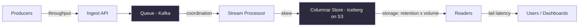
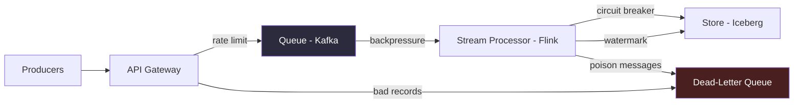
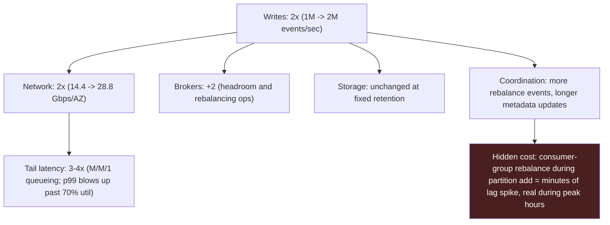

# Chapter 3 — Fundamentals of Scale

> *(Numbered "Chapter Two" inside the book's own running heads — the printed book counts
> content chapters from 1, while the outer Table of Contents counts the Preface as chapter 1.
> This guide follows the outer ToC, so this is "Chapter 3" for citation purposes.)*

At scale, a pipeline doesn't run out of capacity — it runs out of its **weakest dimension**. A
staff-level data engineer names that dimension before the cluster does. This chapter teaches the
napkin math and the naming discipline, because every system-design prompt starts with a volume
and ends with a bottleneck.

---

## What you'll be able to say by the end

> "Before I pick a tool, I want to size the workload on a napkin: events per second, payload size,
> retention, fan-out. That tells me whether this is a 4-node Postgres problem or a
> Kafka-and-Iceberg problem."
>
> "The first thing I look for at scale is skew — not keys, not partitions, not tenants. Average
> throughput lies; the p99 of a single partition is where the pipeline actually breaks."
>
> "I'd rather pay the coordination cost upfront with idempotent writes than pay it in reruns, when
> the retry logic inevitably duplicates."
>
> "Doubling ingest isn't doubling cost. It doubles storage volume, which doubles network, which
> can quadruple tail latency if I haven't partitioned for it."
>
> "The move from 'works' to 'works at scale' is usually not a new tool. It's a boundary I forgot to
> enforce: backpressure, watermarks, rate limits, or a dead-letter path."

---

## The Five Dimensions

Here's the prompt: *"This ingestion pipeline moves ten thousand events per second. Size it for a
million."*

- The **junior answer** reaches for Kafka.
- The **mid-level answer** reaches for Spark.
- The **staff answer** reaches for a napkin — because every word after "size it" needs something
  specific. The interviewer is testing whether you know which part of your pipeline will fail
  first.

A pipeline at scale has five dimensions a data engineer cares about:

1. **Throughput** — how many bytes per second the wire actually sustains, end to end. Separate
   from the advertised peak, which is usually measured for one stage in isolation.
2. **Storage** — hot plus cold, after compression, at today's retention policy plus tomorrow's
   audit requirement.
3. **Coordination** — ordering, idempotency, and the cost of agreeing across machines about what
   happened. Exactly-once guarantees live here, and they get harder as you add workers.
4. **Skew** — the shape of the load across partitions, keys, and tenants. Almost always worse than
   your dashboard says.
5. **Tail latency** — p99 and p99.9 at the serving edge, which drives the SLO the product is
   actually judged on. The average is the number you put in a slide; the tail is the number your
   customers feel.

These aren't independent axes. Pushing throughput doubles coordination cost, usually quadruples
the tail, and can silently multiply the storage bill if retention is lazy. That coupling is what
makes "just add more workers" a wrong answer to every serious scaling question: it moves one
dimension while three others drag behind.

### Diagram — the five dimensions on a canonical ingest pipeline



> **✅ Say this out loud**
> At a whiteboard, name all five dimensions out loud and point to the one you think will break
> first. The interviewer isn't grading the prediction. They're checking whether you know there are
> five, and whether you can pick one with a reason. That one habit tells the interviewer more than
> an hour of polished diagrams.

---

## Why the Naming Matters

A system you can design is a system other people can also design. You can talk yourself through a
lakehouse on Iceberg with Trino on top and get nine-tenths of the way to a sensible design without
saying anything a strong candidate wouldn't also say. The part that actually decides the interview
is the other test:

> *"Here's what I expect to fail first, here's how I'd measure it, here's what I'd do if I'm
> wrong."*

That sentence is the difference between the interviewer reading you as mid-level and reading you
as staff. Designing is the easy half. **Naming** is the half that separates engineers who have
shipped scale from engineers who have drawn it.

---

## Napkin Math

You can't name the weakest dimension without numbers, and you won't get numbers out of an
interviewer without asking for them. So the first habit is asking, before you draw a single box:
how many events per second, how large each payload, how long you keep them, and what the read
fan-out looks like.

Three multiplications cover ninety percent of cases:

1. **Sustained write throughput** = events/sec × bytes/event × replication factor. This is what
   the network and the disk actually see.
2. **Storage budget** = sustained write throughput × retention, divided by your expected
   compression ratio.
3. **Real I/O** = writes × downstream fan-out × retry factor. Every stream-processing consumer,
   every reporting replica, every audit mirror counts.

Two references calibrate the intuition:
- **Jeff Dean's latency numbers** still hold, and they'll sanity-check any design that implies a
  physically impossible op.
- **Brendan Gregg's USE method** gives three signals for any resource: **U**tilization,
  **S**aturation, **E**rrors. Napkin math tells you the utilization you should expect; USE reminds
  you to measure the other two, because that's where the surprises live.

### Worked example — sizing a payments pipeline at peak

```
Load: 1M events/sec peak, 200k avg
Payload: 600 bytes per event
Replication: 3x on Kafka
Retention: 7 days hot, 90 days cold
Consumers: 5 groups (fraud, enrich, ledger, audit, analytics)

Sustained write (peak):
  1M × 600B × 3 = 1.8 GB/sec  = 14.4 Gbps per AZ

7 days hot, raw:
  1.8 GB/sec × 86,400 × 7 = 1.1 PB
  At 4x columnar compression: ~275 TB

Effective read (steady-state):
  1.8 × 5 consumers × 1.2 retry factor = 10.8 GB/sec

Verdict:
  Kafka: fine on 4 brokers.
  S3: linear in retention, cheap.
  Read: 10.8 GB/sec is where you'll sweat.
```

> **🚩 FAANG Signal**
> When you do napkin math out loud, the interviewer is listening for whether you know which
> numbers matter. Events per second tells them you asked. Replication times payload tells them you
> know where the bytes actually go. Fan-out tells them you can separate writes from effective
> reads — and separating those two is the move that lets you pick the right bottleneck.

---

## Skew — the Dimension That Eats Averages

Average throughput is a politician's answer. You can't partition for it, alert on it, or provision
against it. Production runs on the p99 of a single partition, and at real scale that p99 is almost
always one order of magnitude worse than the mean. Skew is the first dimension that kills a sized
design, and the one napkin math alone won't catch.

Skew comes in three flavors, in order of frequency:

- **Hot key.** One account, one product, or one session ID takes 30–40% of the traffic. Common in
  payments, ads, and anywhere a handful of whale accounts drive most of the volume. The long tail
  isn't a rhetorical flourish; it's the actual distribution.
- **Hot partition.** This is what a hot key becomes once you've chosen a partitioning function.
  The hot key maps to one partition, the worker reading it pins at 100% CPU, and the other nine
  workers look healthy on a dashboard. Average CPU across the consumer group reads fine. The retry
  queue tells a different story.
- **Hot tenant.** The multi-tenant version of the hot key. One customer bursts at 20× the mean
  during a sale and co-tenants see write delays they can't explain, because the dashboard averages
  them into invisibility. Tenants are politically expensive to rate-limit, which is why this
  flavor usually gets found by an angry support ticket.

> **❌ Anti-Pattern**
> Naming a tool before naming a number. "I'd use Kafka and scale from there." That lands as
> confidence theater. A 500-event/sec pipeline doesn't need Kafka. A 10M-event/sec pipeline with a
> 900-byte payload might already be more than a single Kafka cluster can handle, and you should
> know that before the interviewer has to ask.

> **✅ Pattern**
> Size first, tool second. Sustained throughput, then storage budget, then fan-out, then the
> tool. If the numbers don't rule anything out, say so and ask for the SLO. Letting the
> interviewer fill the gap is a move. Pretending every pipeline wants Kafka is a tell.

### Detecting skew before it burns you

```sql
-- src/code-examples/ch02/detect_hot_partitions.sql
-- Flag partitions carrying more than 3x the mean message volume.
-- Run nightly against a warehouse export of Kafka topic offsets.
WITH per_partition AS (
  SELECT topic, partition, SUM(message_count) AS events
  FROM kafka_topic_offsets
  WHERE event_date = CURRENT_DATE - INTERVAL '1' DAY
  GROUP BY topic, partition
),
baseline AS (
  SELECT topic, AVG(events) AS mean_events
  FROM per_partition GROUP BY topic
)
SELECT
  p.topic,
  p.partition,
  p.events,
  b.mean_events,
  ROUND(p.events / b.mean_events, 2) AS skew_ratio
FROM per_partition p
JOIN baseline b USING (topic)
WHERE p.events > 3 * b.mean_events
ORDER BY skew_ratio DESC;
```

Watch three numbers on the output: a `skew_ratio` above 3 (the hottest partition carries more than
triple the average); the top partition crossing 10% of the topic's total volume; and a coefficient
of variation above 0.8 across partitions — the signature of a hot key you didn't plan for. Any one
of the three means default partitioning isn't good enough.

### Anti-skew strategies, ordered scalpel to shotgun

| Option | Strengths | Weaknesses | Pick When |
|---|---|---|---|
| **Key salting** (suffix 0–9) | Easy to ship, keeps a partitioning scheme | Reads must reassemble across N partitions | You own the write path and read can union |
| **Range partitioning** | Locality for scans, rebalance by pivot | Still get a hot range on time-correlated writes | Keys have natural numeric or time order |
| **Consistent hashing w/ vnodes** | Rebalances without full reshuffle, elastic | Indirection layer, vnode count needs tuning | You add or remove shards without downtime |
| **Dedicated shard for the whale** | Surgical, leaves the fleet untouched | Threat identification and routing logic required | A short tail of keys is 20%+ of traffic |

> **✅ Say this out loud**
> "I'd partition by the natural key for the bulk of the traffic and carve out a dedicated shard for
> the top 0.1 percent of accounts by volume. I'd size that shard at 10 percent of total capacity
> because a few actors always move the mode. I'd verify the assumption with a day of metadata
> before shipping the partitioning change."

> **⚠️ War Story**
> A payments team partitioned their ledger topic by `user_id`. For 99.9% of users this was fine.
> A single merchant — a flash-sale retailer — accounted for 38% of daily volume. Its partition
> pinned one consumer at max CPU every night when a cron job kicked off. The team found it six
> weeks in, when a retry storm from that consumer backfilled far enough to starve the downstream
> enrichment queue for an hour. The fix was two lines of routing config: a dedicated shard for the
> top 0.1 percent of accounts.

> **🚩 FAANG Signal**
> When you say "we'll partition by `user_id`," the interviewer's next question is "what happens
> when one user is 40 percent of the traffic?" They aren't testing whether you know partitioning.
> They're testing whether you remember real traffic is a log-tailed distribution, and whether you
> have a move ready before they have to ask.

---

## From a Design to a Running System

You've sized the pipeline on a napkin, named the weakest dimension, and checked for skew. That
gets you to a design. It doesn't get you to a running system. Three disciplines keep a sized
pipeline standing even when you're wrong about which dimension fails first: **idempotent writes**,
**enforced boundaries**, and **the multi-dimensional cost of scaling any one axis**.

### Idempotency: writes that survive retries

Every pipeline at scale retries. Network hiccups, consumer rebalances, partial failures, and the
dumb garden-variety timeout that fires right after the database committed. If your writer isn't
idempotent, each of those retries corrupts something expensive to un-corrupt: the ledger gains a
phantom debit, the event stream gains a duplicate order, the analytics table shows a spike that was
actually the same spike counted twice.

Idempotency is the contract that says: calling the same operation twice produces the same outcome
as calling it once. Three mechanisms cover almost every real case.

| Option | Strengths | Weaknesses | Pick When |
|---|---|---|---|
| **Hash-fingerprint dedup** | Zero client cooperation, easy to ship | Collapses semantically genuine duplicates | Ingestion dedup where duplicates are always bugs |
| **Client-supplied idempotency key** | Distinguishes retries from second-intent writes | Client must cooperate, you carry a key table | Payment-like ops where same-payload doesn't mean same-intent |
| **Log replay from committed offset** | Free when you're already on Kafka | Requires deterministic processing top to bottom | Stream processing that fits a pure functional model |

```python
# src/code-examples/ch02/idempotent_writer.py
# Idempotent ledger writer. Same key, same payload: no-op.
# Same key, different payload: raise (caller confused two ops).
import hashlib
from dataclasses import dataclass

@dataclass
class LedgerEntry:
    account_id: str
    amount_cents: int
    idempotency_key: str

def write_entry(conn, entry: LedgerEntry) -> bool:
    fp = hashlib.sha256(
        f"{entry.account_id}|{entry.amount_cents}".encode()
    ).hexdigest()
    with conn.cursor() as cur:
        cur.execute(
            """
            INSERT INTO ledger_idempotency (key, fingerprint, written_at)
            VALUES (%s, %s, NOW())
            ON CONFLICT (key) DO NOTHING
            RETURNING key
            """,
            (entry.idempotency_key, fp),
        )
        if cur.fetchone() is None:
            cur.execute(
                "SELECT fingerprint FROM ledger_idempotency WHERE key = %s",
                (entry.idempotency_key,),
            )
            (seen_fp,) = cur.fetchone()
            if seen_fp != fp:
                raise ValueError(
                    "idempotency key reused with a different payload"
                )
            return False
        cur.execute(
            "INSERT INTO ledger (account_id, amount_cents) VALUES (%s, %s)",
            (entry.account_id, entry.amount_cents),
        )
    return True
```

> **✅ Pattern**
> Put the idempotency key in the request path, not just the database schema. A consumer that
> replays a message should never write a second row. Keeping the key at the edge means the server
> dedupes before any work happens, not after a failed unique-constraint insert backs out a
> half-done transaction.

> **❌ Anti-Pattern**
> Relying on `ON CONFLICT DO NOTHING` as your sole idempotency mechanism. It hides retries. The
> second insert gets swallowed, and the caller has no way to tell "I succeeded the first time"
> apart from "I failed on the second." Without that distinction, reconciliation logic guesses —
> and sometimes guesses wrong.

> **🚩 FAANG Signal**
> When you say "I'd make the writes idempotent," the interviewer isn't grading the claim. They're
> listening for which of three mechanisms you'd pick, whether you can name the cost, and whether
> you've thought about the hard edge: "what happens when two clients legitimately want to make the
> same write?" Hash-fingerprint dedup gets that wrong. Client-supplied keys get it right.

> **✅ Say this out loud**
> "For payments I'd take a client-supplied idempotency key because an honest retry and a
> second-intent duplicate don't arrive at the server the same way, and the idempotency table is
> the only place I can tell them apart."

---

### Boundaries: how a pipeline fails loudly

If the only failure mode your pipeline has is "everything keeps going," you don't have a system.
You have a coincidence.

Pipelines rarely break by stopping. They break by continuing past the point where they should have
stopped. A Kafka consumer two billion messages behind at 2 a.m. A Flink job chewing through a
million malformed records on its way to filling your cluster with NaN. A write queue quietly
backing up until the disk fills and the producer can't enqueue the retry that would have saved
you. Boundaries are how you get the pipeline to fail loudly.

Five are enough, in the order they sit in a typical flow:

- **Backpressure** — a bounded queue, consumer-lag alert, and producer running `acks=all` with a
  named in-flight limit. The contract is simple: if the queue fills, stop accepting. Reject the
  write rather than silently grow a buffer.
- **Rate limit** — set per tenant, per key, and per IP. The point isn't fairness. It's preserving
  the serving SLO when a noisy neighbor goes rogue. Without rate limits, one tenant's incident
  becomes every tenant's incident.
- **Circuit breaker** — sits between stages. If stage B starts failing, stage A stops calling it
  for a cooldown window. Three states: **open** (trip after N failures, no calls go through),
  **half-open** (probe after cooldown), **closed** (resume).
- **Dead-letter queue** — a quarantine for bad records. A malformed event shouldn't stop the
  pipeline; it should go to a named queue with a reason tag and a re-drive tool. A DLQ without a
  re-drive tool is a graveyard, not a queue.
- **Watermark** — time boundaries for stream processing. The watermark says "I've seen all events
  up to time T; anything later is late, and here's what I do with late records." Without a
  watermark, a stream processor waits for events that may never arrive.

### Diagram — five boundaries on a canonical stream pipeline



### Five boundary types, mapped to the failure each catches

| Boundary | Catches | Costs | Pick When |
|---|---|---|---|
| **Backpressure** | Queue runaway, out-of-disk, OOM | Client retries, 503s at the edge | You'd rather reject than silently lose |
| **Rate limit** | Noisy-neighbor starvation | Per-tenant quota state, ops overhead | Multi-tenant or public API |
| **Circuit breaker** | Cascading failure across stages | Stage-boundary retrofit, config tuning | You call external stages you don't own |
| **Dead-letter queue** | Poison messages, schema drift | DLQ infra plus re-drive tooling | Any stream that parses upstream data |
| **Watermark** | Silent "stuck stream" | Latency bounded by allowed lateness | Any windowed stream aggregation |

> **⚠️ War Story**
> A streaming dedupe job at a retailer had no watermark and no DLQ. One upstream service started
> emitting events with timestamps from 1970 after a clock-sync bug. The dedupe job accepted them,
> tried to window them against three decades of real events, and ran out of RAM. The blast radius
> wasn't the one bad event; it was the six hours of real events the job was holding onto when it
> crashed. Two lines of watermark config would have dropped the 1970 events as late. A DLQ would
> have captured them for inspection.

> **✅ Pattern**
> Backpressure is a feature, not a bug. Better to reject a write loudly than to swallow it and fail
> three stages down, where the trace is colder and the blast radius is wider.

> **🚩 FAANG Signal**
> When you mention a DLQ, the interviewer will ask what's on its operator side: a re-drive, an
> alert, or a graveyard. The answer they want is "re-drive with a reason tag." A DLQ without
> re-drive tooling is a graveyard with an uptime metric.

> **✅ Say this out loud**
> "I'd put backpressure at the gateway, a DLQ on the parse step, and a watermark on the windowing
> operator. That way 'stuck' has a definition, 'bad record' has a home, and 'too many requests' is
> a 429 instead of a memory leak."

---

### The multi-dimensional cost of scaling one axis

You agreed to double throughput in a standup. You didn't say the four other things you also
agreed to.

Every scaling move is three or four scaling moves you didn't name out loud. The junior answer is
"yes we can do 2x." The staff answer is "yes, and here's the 2x storage rise, the 3-to-4x
tail-latency cost, the additional broker capacity we'll need, and the two weeks of partition
rebalancing on the consumer side. Which of those matters?" The first answer gets you the headcount.
The second one gets you the timeline.

Three examples of coupling cover most cases:

- **Doubling throughput.** Writes 2x. Network in 2x, network out 2N× with N downstream consumers.
  Disk I/O 2x at the raw level, more once you count write amplification. Tail latency often goes
  3–4x, because once a system runs much past roughly 70% utilization, queue buildup stops being
  linear and each new request waits behind a longer and longer line.
- **Doubling retention.** Storage 2x. Replay cost on any backfill 2x. Compaction and tiering jobs
  run about twice as long. Throughput unchanged. Coordination unchanged. This is the cleanest
  scaling move in the book if your storage tier is cheap.
- **Doubling partitions.** Skew halves, if the key distribution is stable. Coordination doubles: ZK
  watches, KRaft metadata, consumer-group rebalance time. Throughput improves only if
  per-partition CPU was the bottleneck. Adding partitions is a scalpel for skew and a shotgun for
  everything else.

> **✅ Say this out loud**
> "Yes, we can do 10x, with three conditions. Storage grows linearly, so I'd want a cold tier
> before we commit. p99 at 10x load crosses the SLO unless we scale brokers and rebalance, which has
> to happen in a maintenance window. On-call load goes up at 10x: more rebalances, larger DLQ
> drains, per-tenant capacity reviews. I'd want all three named in the rollout plan before I commit
> to the timeline."

### Coupling cascade — doubling throughput on a 1M events/sec pipeline



> **❌ Anti-Pattern**
> "We'll just add more partitions." Partitions aren't free. Each one adds metadata overhead,
> producer-side batching complexity, and consumer rebalance cost. More partitions cure
> CPU-driven skew and inflate everything else. Reach for it on purpose, not as a default lever.

> **🚩 FAANG Signal**
> When the interviewer asks "can we scale this 10x?" they want three dimensions priced, not an
> enthusiastic yes. The dimensions are almost always cost (storage and compute), tail latency (p99,
> p99.9), and operational overhead (rebalancing, on-call load). Pricing the wrong one is a tell.
> Pricing all three is the answer.

---

## Observability: the Operational Read

A dashboard can tell you the system is on fire. It can't tell you which of the five dimensions set
the fire, or whether you should have seen it coming six weeks ago. Observability, done right, is
the loop that closes the whole design: you predict which dimension will break first, you
instrument for that prediction, and the instruments either confirm the prediction or surface the
dimension you missed.

The mapping is one-to-one. Each of the five dimensions has a canonical observable, a baseline to
measure against, and a drift signal to alert on.

| Dimension | Canonical Observable | Alert On |
|---|---|---|
| **Throughput** | Events/sec in vs out, by topic | Rate drop >20% vs 7-day baseline, 5 min sustained |
| **Storage** | Current PB and 7-day growth slope | Runway under 30 days at current slope |
| **Coordination** | Consumer-group lag, rebalance events | Lag trending up, rebalances >N/hour |
| **Skew** | Coefficient of variation across partitions | CV >0.8 or top-1 partition >10% of volume |
| **Tail latency** | p99 and p99.9 at the serving edge | SLO breach, 2 min sustained |

The point isn't to collect more signals. It's to collect the *right* ones — the ones that map to
the failure modes you already named. A pipeline that tracks 300 metrics and alerts on CPU is worse
than a pipeline that tracks 20 and alerts on consumer lag plus partition CV.

> **✅ Pattern**
> Alert fires on drift, not on noise. A CPU spike that lasts three seconds is noise; a
> consumer-lag trendline that's been climbing for a week is drift. Staff engineers tune for the
> second signal and tolerate the first.

> **✅ Say this out loud**
> "For this pipeline I'd instrument three signals and alert on two. Consumer lag per partition,
> because it's the first place backpressure shows up. Partition CV, because it's the first place
> drift shows up. And p99.9 at the serving edge, because it's the last place the customer
> notices."

---

## Drift: the Weakest Dimension Moves

The system you designed six months ago isn't the system you have today. Key distributions shift as
a product grows. Tenants get bigger. New features change traffic shape. Retention policy gets
stretched because a stakeholder asked. The weakest dimension — the one you named at design time and
built the system to pressure the least — moves.

Four patterns cover most real drift:

- **Key-distribution drift.** You designed for a roughly uniform key distribution. A year later,
  one tenant is 18% of traffic. Your salting scheme no longer distributes evenly. The fix you
  picked for skew earlier in the chapter is now mandatory, not optional.
- **Volume drift** as products grow past their original sizing assumptions.
- **Retention drift** as compliance or business stakeholders quietly extend "how long we keep this."
- **Consumer-count drift** as more downstream teams subscribe to the same topic, multiplying the
  effective fan-out and read I/O nobody re-budgeted for.

> **✅ Pattern**
> Schedule a quarterly dimension audit. When someone asks for 10x, name the three dimensions you
> also just scaled, and say "quarterly dimension audit" unprompted, because designs decay.

---

## An Interview Transcript Excerpt — Fraud Detection Under Load

*(Excerpted from the chapter's worked fraud-scoring example, showing the pacing this chapter's
disciplines produce in a live interview.)*

**Interviewer:** What breaks first under load?

**Candidate:** Feature-store p99. The hot window — velocity per card over the last 60 seconds —
sits in Redis with a TTL. At peak, those Redis shards get around 50,000 reads per second across
five features per transaction. If Redis p99 drifts from 1ms to 10ms, my total latency budget blows
up. That's what I'd alert on: Redis p99.9 sustained above 5ms. That's the leading indicator for SLO
breach.

**Interviewer:** Boundaries?

**Candidate:** Rate limit at the gateway per merchant, because a compromised merchant sending
synthetic fraud attempts at 50x their normal rate shouldn't be my problem. Circuit breaker between
Flink and the feature store: if Redis latency blows up, fail to a fallback decision (conservative
default, probably block) for a cooldown window. DLQ on the parse step, because malformed
transactions will happen and I don't want them stopping the pipeline. Watermark on the Flink job
with allowed lateness of one second, because anything later than that is almost certainly a bug and
I'd rather drop it than hold state forever. Backpressure at the Kafka consumer so Flink slows its
read when downstream is saturated, rather than falling behind without bound.

**Interviewer:** How would you know, six months from now, that your design is still right?

**Candidate:** Quarterly audit. I'd rerun the napkin math against current numbers and ask three
questions. One, is the merchant distribution still long-tailed with the same top-one-percent
concentration? Two, is tail still the dimension I'm pressuring? And three, is the feature-store p99
still the leading indicator? If any of those answers have drifted, the design needs revision before
an incident forces it.

---

## FAANG Signals — Chapter Summary

Five moves from this chapter signal seniority:

1. **Size before tool.** Do napkin math out loud before naming a component: events per second,
   payload bytes, replication, retention, fan-out.
2. **Name the weakest dimension.** Point at one of the five before the interviewer asks.
3. **Account for skew.** Real traffic is long-tailed, so assume the top 0.1% of keys take a
   disproportionate share.
4. **Pick an idempotency mechanism with reason.** Not just "I'd make it idempotent" — say which
   of hash-fingerprint, client key, or log replay, and why.
5. **Price the coupling and schedule the re-examination.** When someone asks for 10x, name the
   three dimensions you also just scaled, and say "quarterly dimension audit" unprompted.

## Common Traps

1. **Tool before number.** You say "I'd use Kafka" before anyone has asked about throughput.
2. **Capacity by average.** You provision for the mean and get killed by p99, and the dashboard
   that averages across tenants hides the skew that would have saved you.
3. **`ON CONFLICT DO NOTHING` as sole idempotency.** It hides retries from your reconciliation
   logic.
4. **DLQ without re-drive, watermark absent.** One is a graveyard with an uptime metric; the other
   leaves a stream processor stuck on a 1970 timestamp, holding years of state.
5. **Treating design as forever.** With no plan to revisit, design decay becomes an incident.

---

## Cheat Sheet

**The five dimensions**
Throughput · Storage · Coordination · Skew · Tail latency

**Napkin math**
- Write throughput = events/sec × bytes × replication
- Storage budget = write throughput × retention ÷ compression
- Real I/O = write throughput × fan-out × retry factor

**Skew triggers**
`skew_ratio > 3` · top-1 partition > 10% of topic · CV > 0.8 across partitions

**Three idempotency mechanisms**
1. Hash fingerprint — zero client cooperation, collapses genuine duplicates
2. Client idempotency key (Stripe model) — distinguishes retry from second intent
3. Log replay from committed offset — free on Kafka, needs determinism

**Five boundaries**
Backpressure · Rate limit · Circuit breaker · Dead-letter queue · Watermark

**Coupling cascade, 2x throughput**
Writes 2x · Network 2x · Tail 3–4x · Brokers +2 · Storage unchanged at fixed retention

**Observability alert thresholds**
- Consumer-lag trend climbing for a week
- Partition CV > 0.8
- p99.9 SLO breach, 2 min sustained
- Storage runway < 30 days

**Three staff-level lines**
- "Size first, tool second."
- "Average throughput is a politician's answer."
- "I'd run a quarterly dimension audit."

---

## Further Reading

- **"The Tail at Scale."** Jeff Dean and Luiz Barroso. *Communications of the ACM*, February 2013.
  The paper that defined how to think about p99 and p99.9 at scale. Pair with Dean's 2009 Stanford
  talk *"Numbers Everyone Should Know"* for the latency numbers.
- **Designing Data-Intensive Applications.** Martin Kleppmann. O'Reilly, 2017. Read chapters 5–7
  for partitioning, replication, and consistency.
- **"Idempotency in the Stripe API."** Brandur Leach. stripe.com/blog, 2017. The canonical
  engineering writeup on client-supplied idempotency keys.
