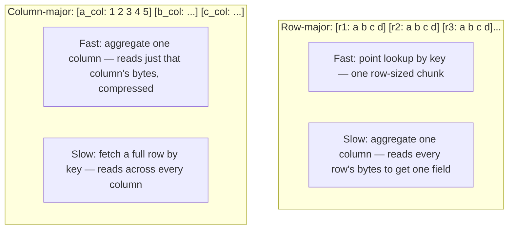

# Chapter 4 — Storage Engines

> *(Printed as "Chapter Three" in the book's own running heads — see the numbering note in
> Chapter 3. This guide follows the outer Table of Contents, so this is "Chapter 4" for citation
> purposes.)*

## The Simple Version, First

Imagine two ways to organize a huge filing cabinet full of employee records. One way: keep each
employee's whole folder together — their address, salary, start date, all stapled in one packet,
filed by employee ID. The other way: keep a separate drawer for "all addresses," another drawer
for "all salaries," another for "all start dates" — and within each drawer, everyone's info sits
next to everyone else's.

If your job is "look up one specific employee's full file," the first way is much faster. If your
job is "what's the average salary across all 50,000 employees," the second way is dramatically
faster — you only open one drawer instead of 50,000 folders.

**That one choice — how you physically organize data on disk — turns out to be one of the most
consequential decisions in the entire data platform, because you genuinely can't change your mind
easily once you've picked.** This chapter is about that choice, and two others just like it.

---

## What You'll Be Able to Say by the End

*(These are the book's own scripted interview lines — say them close to word-for-word.)*

> "The storage engine is the one pipeline decision I can't renegotiate. Before I name the engine,
> I name the three axes: row or column, LSM or B-tree, local disk or object store."
>
> "Row stores optimize for access patterns I know. Columnar stores optimize for the ones I don't
> know yet."
>
> "LSM accepts write amplification in exchange for sequential writes; B-trees accept random I/O
> for read locality. I pick whichever one is cheaper at my scale."
>
> "Compression isn't an afterthought. Three-times compression on a petabyte is two petabytes of
> disk I don't have to buy."
>
> "S3 isn't a filesystem. Rename, list, and append all have different cost and consistency
> semantics, and the design that ignores this breaks at scale."

---

## Why Two Similar Teams Ended Up With Completely Different Years

Two data teams at similarly-sized companies both need to pick a storage layer for their event
pipeline. Both teams say the exact same sentence in the planning meeting: *"a few hundred million
events, analytical workload, two-year retention."* One team picks a traditional row-based
database with monthly table partitioning. The other picks a columnar file format on cheap cloud
storage with a lightweight bookkeeping layer on top.

**A year later, the first team is rebuilding the whole thing. The second team is adding new use
cases every quarter.**

The difference wasn't the engineers. It was the storage engine. The row-based database was the
wrong foundation for this workload, and **once you've picked the foundation, you can't easily
renegotiate it.** Every decision downstream — how queries get planned, what things cost, how fast
results come back, how long you can keep data — inherits constraints from the engine underneath
it. Pick the right engine and those decisions stay reasonable. Pick the wrong one and every
decision downstream becomes a workaround.

---

## Idea 1: Three Independent Choices, Not One

Storage engines differ along three separate axes — and picking your position on each one, before
naming any specific tool, is what separates a senior answer from a junior one.

### Axis 1 — How bytes are physically arranged: row-major vs. column-major

A **row store** keeps everything about one record sitting next to each other on disk — this is
how a traditional application database (like Postgres or MySQL) works. A **column store** instead
keeps every value for one *field* sitting next to each other — this is how analytical file
formats and warehouses work.

### Diagram — the same table, two physical layouts

This choice determines which queries are cheap. A row store wins for "fetch one whole record by
its key." A column store wins for "add up one field across millions of records." **For an
aggregation over one column, a columnar store reads about fifty times fewer bytes than a row
store. For a point lookup by primary key, a row store reads about two hundred times fewer bytes
than a naive columnar read.** Whichever pattern dominates your actual workload determines which
engine is right — this is exactly why the modeling choices in Chapter 5 (star schema vs. wide
tables) inherit directly from this axis.

### Axis 2 — How writes accumulate: LSM tree vs. B-tree

Both structures solve the same core problem — keeping written data sorted on disk — but they make
opposite trade-offs to get there.

A **B-tree** updates in place. Every write walks down the tree, adjusts a few nodes as needed, and
writes back immediately. Reads are fast and predictable because a range scan visits neighboring
pages that are already sorted together. The cost: every logical write can trigger several small
physical writes as the tree rebalances.

An **LSM tree** (short for "log-structured merge tree") takes a very different approach: it
batches writes in memory first, periodically flushes a sorted batch to disk, and later merges
("compacts") those batches together into larger sorted files. Writes are fast because they're
purely sequential. The cost is on the read side — a read might need to check several of these
batch files and merge the results, which is slower — and there's a hidden cost called **write
amplification**: the same bytes can get rewritten five to ten times over their lifetime as
compaction merges old batches together.

**Rough numbers worth knowing:** B-trees run at about 1.5x to 3x write amplification. LSM trees
run at roughly 10x at large scale. This trade-off is sometimes summarized as the "RUM conjecture"
— you can optimize for any two of **R**ead performance, **U**pdate performance, and **M**emory
efficiency, but you pay a cost in the third.

**The working rule:** write-heavy workloads favor LSM trees (this is why streaming-oriented
databases almost always use one). Balanced or read-heavy workloads favor B-trees (this is why
traditional application databases use one). At extreme write rates — hundreds of thousands of
writes per second per machine — LSM is the only practical option, because a B-tree's scattered,
random disk writes become the bottleneck. At more modest write rates with heavy range-scanning,
a B-tree's better read locality is worth the extra write cost.

> **🚩 FAANG Signal**
> When you mention LSM trees in an interview, the interviewer's next question is almost always
> about compaction tuning. The answer they want isn't "the system handles it." It's "tiered
> compaction for append-heavy workloads, leveled when the same keys get rewritten, and I'd tune
> the level multiplier and target file size based on the write pattern." Knowing about compaction
> is the signal that you've actually run an LSM-based system in production, not just read about
> one.

### Axis 3 — Where bytes physically live: local disk vs. object storage

This axis decides where the bytes actually sit. **Local disk** (attached directly to the machine
doing the computing) gives extremely fast reads — sub-millisecond for cached data, well under a
millisecond for disk reads on modern hardware — but capacity is bounded by that one machine's
physical drives, and cost per gigabyte is comparatively high.

**Object storage** (like Amazon S3, Google Cloud Storage, or Azure Blob Storage) flips almost all
of this. Per-call latency is much higher (10 to 100 milliseconds, depending on region and load),
but capacity is effectively unlimited, cost per gigabyte is roughly a tenth of typical
disk-attached storage, and durability comes essentially "for free" — you don't need to build your
own replication on top.

**The lakehouse pattern (Chapter 9) exists specifically to bridge this gap** — it puts a
lightweight bookkeeping layer (Iceberg, Delta, Hudi) on top of object storage, so query engines
above it can interact with a pile of cheap, durable files as if they were talking to a real,
structured table.

> **✅ Say this out loud**
> "S3 isn't a filesystem. Rename, list, and append all cost differently, and the design that
> ignores this breaks at scale."

---

## Idea 2: Object Storage Has Its Own, Very Different Rules

This axis quietly undermines more designs than any other, because it's easy to assume cloud
object storage behaves like a regular hard drive when it fundamentally doesn't.

- **Renaming a file** on local disk is an instant, essentially free metadata update. On object
  storage, there's no true "rename" operation at all — it's actually a full copy plus a delete.
  Renaming a 100 MB object can take around 150 milliseconds, versus sub-millisecond on a normal
  filesystem.
- **Listing files** on local disk is a fast, direct filesystem call. On object storage, it's a
  paginated API call, returning roughly a thousand keys at a time — listing a million objects
  means hundreds of API round trips.
- **Appending to a file** doesn't exist on object storage at all. Every "append" actually creates
  an entirely new object.
- **Tail latency** on object storage is 10 to 100 times higher than local disk for a typical call,
  and the worst-case (p99.9) latency is worse still.
- **Object storage rate-limits by "prefix"** (the leading portion of a file's path) — typically
  around 3,500 writes and 5,500 reads per second, per prefix, on a service like S3. A design that
  funnels everything through one date-based path can get throttled well before hitting any
  storage capacity limit.

> **❌ Anti-Pattern**
> Treating S3 (or any object store) like a regular filesystem. A design that assumes traditional
> file-system behavior — instant renames, cheap directory listings, in-place appends — breaks the
> very first time someone tries to replace a single file in place at real scale.

---

## Idea 3: Compression Isn't a Bonus Feature — It's Load-Bearing

Columnar layouts compress dramatically better than row layouts — typically 5 to 10 times better
— and the reason is worth understanding rather than just memorizing.

**Values sitting next to each other in a column tend to be similar.** Timestamps only ever
increase. Country codes repeat over and over. User IDs cluster together. This similarity is
exactly what compression techniques (run-length encoding, dictionary encoding, delta encoding)
exploit well. Values sitting next to each other in a *row*, by contrast, are usually completely
different types — a timestamp next to a string next to an integer — and don't compress nearly as
well together.

At the file-format level, formats like Parquet also store per-column minimum/maximum statistics,
so a query planner can skip entire chunks of data without even opening the compressed bytes —
this is the same "pruning" mechanism from the query-engines chapter, and it's what makes columnar
analytics fast at real scale.

> **✅ Say this out loud**
> "Compression isn't an afterthought. Three-times compression on a petabyte is two petabytes of
> disk I don't have to buy."

---

## Idea 4: Three Anti-Patterns That Show Up Constantly Under Interview Pressure

**"I'd use a traditional row database for analytics."** Sometimes true at very small scale, and
usually wrong at the scale a system-design interview actually cares about. Defaulting to a
row-oriented database for an analytical prompt is a sign that "row-major is the wrong layout for
aggregation-heavy workloads" hasn't fully clicked yet.

**"I'd use a write-once columnar format for a transactional workload."** Almost never right.
Immutable, write-once formats can't handle frequent partial updates at any reasonable cost. If a
candidate proposes this, the interviewer is either confirming a very specific edge case
(append-only, no updates ever) or about to ask why.

**"I'd use object storage as my primary database."** Object storage is the right foundation for
analytical workloads with a bookkeeping layer on top. It's the wrong foundation for low-latency
application reads. This confusion often comes from marketing language around "storage as a
database" that doesn't distinguish which workload it's actually good for.

> **❌ Anti-Pattern**
> Picking the engine to match the vendor, not the workload. "We use Snowflake, so the storage
> layer is Snowflake" treats the engine as a given rather than a decision. The interviewer wants
> to hear you evaluate the three axes against the actual workload and explain why a specific
> engine is the right pick — vendor lock-in is an operating reality, but vendor-first *thinking* is
> an interview tell.

---

## An Interview Transcript — the 10 Petabyte Warehouse

The classic storage-layer prompt: a large analytical warehouse, nightly loads, interactive
exploration. Watch the candidate work through all three axes explicitly before naming a single
tool.

**Interviewer:** Design the storage layer for a 10 petabyte analytical warehouse. Daily load of
about 50 terabytes of new data. A mix of ad-hoc interactive queries and scheduled reports.
Two-year retention.

**Candidate:** Okay. Before picking any tool, three axes. Row-major or column-major? The workload
is analytical — ad-hoc queries, scheduled reports — so column-major. LSM or B-tree? The write
pattern is bulk nightly loads, not small random writes, so an LSM-style approach fits well, and is
even preferable, since bulk loads write sequentially anyway. Local disk or object store? At 10
petabytes, disk-attached storage runs into the hundreds of thousands of dollars a month before
even counting the I/O charges, so object storage is the answer unless someone tells me interactive
query latency has to be sub-second at the tail.

**Interviewer:** Latency target is a few seconds for ad-hoc, minutes for scheduled reports.

**Candidate:** Good, that confirms object storage. Columnar data on object storage with a
bookkeeping layer on top is the lakehouse pattern: files in cloud storage, a table format managing
metadata, and a query engine on top. Let me check the sizing before deciding on partitioning and
retention.

*(thinking)* 10 petabytes total, 50 terabytes of daily load — so each day is about half a percent
of existing data.

> **✅ Pattern**
> When you pick a storage engine in an interview, state the three axis positions out loud first,
> then name the engine that satisfies them. "Column-major for the scan workload, LSM for the write
> rate, object storage for the cost at ten petabytes, which means Iceberg on S3." The interviewer
> grades the decomposition, not the final name.

---

## Idea 5: A Quick Map From Axis Positions to Real Engines

### Common storage engines mapped to axis positions

| Engine (axis positions) | Strengths | Weaknesses | Pick When |
|---|---|---|---|
| **Postgres** (row, B-tree, local) | Mature OLTP, ACID, familiar SQL | Doesn't scale analytics past ~10 TB | OLTP workload, small analytics, single-machine |
| **Cassandra** (row, LSM, local) | Write throughput, linear horizontal scale | Denormalized access patterns, operator burden | OLTP at scale where a single writer won't fit |
| **ClickHouse** (column, LSM, local) | Fast analytics on a local-disk cluster | No ACID, complex ops, mutation cost | Real-time analytics on structured data |
| **Snowflake** (column, LSM, object) | Managed, separate compute/storage, elastic | Vendor lock-in, per-query cost at scale | Managed OLAP warehouse with bursty workload |
| **Iceberg on S3** (column, LSM, object) | Open format, multi-engine, cheap at petabyte scale | Metadata maintenance burden, latency tail | Multi-team lakehouse, open-format requirements |

Two more axes worth naming for completeness: **specialized engines** like ClickHouse or Druid for
real-time analytics, Redis for hot caching, and Elasticsearch/OpenSearch for search — each of
these is a genuine fourth category outside the row/column split, built for one specific access
pattern.

---

## Common Mistakes People Make

1. **Defaulting to a traditional row database for analytics.** Row-major storage doesn't serve
   column-heavy workloads at scale. It's fine at 100 GB and wrong at 10 TB.
2. **Picking a write-once columnar format for transactional workloads.** These formats can't serve
   update-heavy workloads without an expensive metadata layer on top, and that cost catches up
   fast at production update rates.
3. **Treating object storage as a filesystem.** Rename, list, and append all cost more and behave
   differently than local disk. A design that assumes traditional filesystem semantics breaks on
   first contact with real object storage.
4. **Ignoring compaction when designing on an LSM-based system.** "We'll use it for write
   throughput" without a compaction plan is a future incident waiting to happen.
5. **Letting lakehouse metadata grow unbounded.** Snapshot expiration and manifest rewrites are
   operational disciplines, not optional cleanup — teams that skip them debug mystery slowdowns a
   year later.

---

## The Big Ideas, One Line Each

1. **Name the three axis positions before naming a tool.** Row or column, LSM or B-tree, local or
   object — deriving the engine from those three positions is a seniority marker in itself.
2. **Row stores serve known access patterns; columnar stores serve the ones you haven't thought of
   yet.** Match the layout to which kind of query actually dominates.
3. **LSM trades write amplification for sequential writes; B-trees trade random I/O for read
   locality.** Pick based on your actual write rate, not habit.
4. **Object storage isn't a filesystem — its cost and consistency rules are genuinely different**,
   and a design that ignores this breaks at scale.
5. **Compression is load-bearing, not optional.** A few times better compression is real money not
   spent on disks you don't need to buy.

---

## Cheat Sheet

**The three axes**
Row-major vs. column-major · LSM tree vs. B-tree · Local disk vs. object store

**Bytes read, rule of thumb**
- Row: rows × row_bytes
- Columnar: columns × rows × compressed_column_bytes (5-10x compression)
- Aggregating one column: columnar scan reads roughly 1/50th what a row-store scan reads

**Quick engine mapping**
- OLTP, point lookups → Postgres, MySQL, DynamoDB
- OLTP at scale → Cassandra, ScyllaDB, DynamoDB
- OLAP, medium scale → Snowflake, BigQuery, Redshift
- OLAP, large scale → Iceberg, Delta, or Hudi on S3
- Specialized → ClickHouse/Druid (real-time analytics), Redis (hot cache), Elasticsearch/OpenSearch
  (search)

**Object storage gotchas**
- Rename = copy + delete (~150ms for 100MB vs. sub-ms on a normal filesystem)
- List = paginated API, ~1,000 keys per call
- Append = a brand new object every time
- Tail latency (p99.9) is far worse than local disk
- Prefix rate limits: roughly 3,500 writes/sec and 5,500 reads/sec per prefix on S3

**Write amplification, rule of thumb**
B-tree: 1.5x to 3x. LSM (leveled, default multiplier 10): ~10x at depth 7.

**Lakehouse maintenance (mandatory, not optional)**
Expire snapshots on a schedule · Rewrite small files to a target size · Compact manifests · Remove
orphan files

**Three lines worth memorizing**
- "Pick the axis positions first, then the engine falls out."
- "Compaction isn't an implementation detail; it's a design decision."
- "S3 isn't a filesystem. Rename, list, and append all cost differently."

---

## Further Reading

- **Designing Data-Intensive Applications, Chapter 3: Storage and Retrieval.** Martin Kleppmann.
  O'Reilly, 2017. The canonical reference for B-trees, LSM trees, and column-oriented storage. If
  you read one thing from this list, read this.
- **"The Log-Structured Merge-Tree."** Patrick O'Neil, Edward Cheng, Dieter Gawlick, Elizabeth
  O'Neil. *Acta Informatica* 33, 1996. The original LSM paper — thirty years old, still relevant.
  Every modern streaming-store design traces back here.
- **"C-Store: A Column-Oriented DBMS."** Michael Stonebraker et al. VLDB 2005. The academic case
  for column stores. Paired with Google's Dremel paper (VLDB 2010), this is the two-paper
  foundation under every modern columnar engine — read both before an interview that touches OLAP.

---

## A Couple of Extra Ideas (From the Older 2025 Edition)

- **File format choice inside the lakehouse depends on how the data moves, not just how it's
  queried.** Parquet (columnar) wins almost always for analytics, since queries typically want a
  handful of columns from a huge dataset. Avro (row-based) makes more sense for individual events
  flowing through a message system, since each message is read and processed as a whole record —
  and Avro's built-in schema enforcement catches data-quality problems early, before they ever
  reach the lake.
- **Real-world storage pricing** (illustrative figures, always worth re-checking against current
  rates): standard cloud object storage around $23/TB/month; cold-tier storage around a fifth of
  that; managed block storage considerably more, plus IOPS charges; local NVMe roughly comparable
  to block storage once fully accounted for. API call charges (a few dollars per million requests)
  are a common surprise line item for high-frequency small-object writers.
