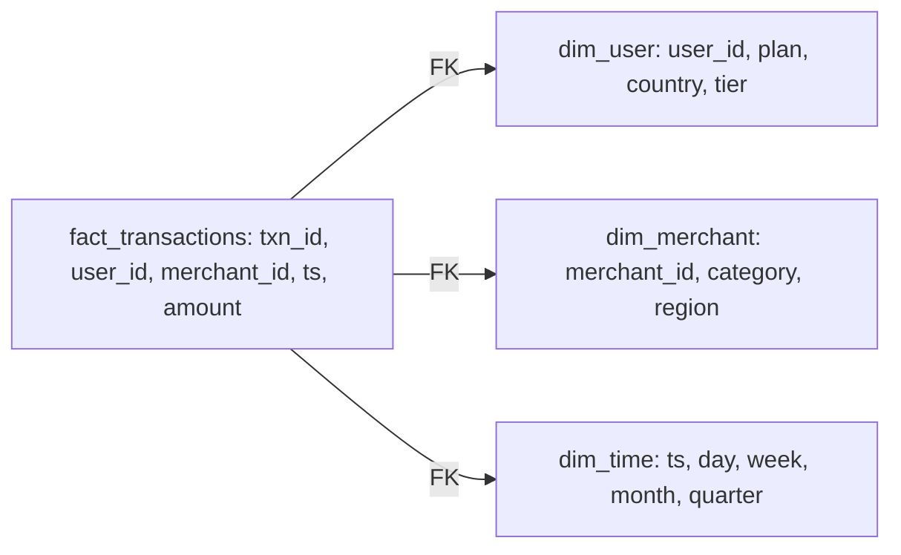

# Chapter 5 — Data Modeling at Scale

> *(Printed as "Chapter Four" in the book's own running heads — see the numbering note in
> Chapter 3. This guide follows the outer Table of Contents, so this is "Chapter 5" for citation
> purposes.)*

## The Simple Version, First

Imagine two people organizing the same messy pile of receipts for a small business. One person
files everything into labeled folders — "vendors," "dates," "categories" — and cross-references
each receipt to the right folder. The other person just staples everything relevant to each
receipt directly onto the receipt itself, so you never have to flip through folders.

The second approach feels faster at first — no cross-referencing, just read the receipt. But six
months later, when someone asks "which vendors changed their business category last quarter," the
first person can answer that in a minute. The second person has to physically go through every
single stapled receipt, because that information was never organized in a way that supports a
question nobody thought to ask back when the receipts were originally filed.

**That's the entire chapter.** How you model your data determines which future questions are cheap
to answer and which ones require a rebuild. At scale, your schema is a promise to every team that
will ever query it — and to every question nobody's thought to ask yet.

---

## What You'll Be Able to Say by the End

*(These are the book's own scripted interview lines — say them close to word-for-word.)*

> "Star schemas aren't legacy. They're an answer to 'how do you make analytics fast without
> knowing which queries I'll ask,' which is still the hardest question in DE."
>
> "Wide tables win when compression and columnar pruning are free. Narrow tables win when I need
> partial updates without write amplification."
>
> "Slowly Changing Dimensions are a modeling problem disguised as a history problem. Getting the
> SCD type wrong costs three years of rework."
>
> "Denormalize for the query path that dominates. Normalize for the one I might break."
>
> "Schema migrations are interface changes. I treat them like API versioning: additive by default,
> breaking changes with deprecation cycles and explicit consumer buy-in."

---

## Why Two Teams Who Started Identically Ended Up Nowhere Near Each Other

Two data teams at similarly-sized payment companies both need to model 10 billion transactions a
year for an analytics platform. Both talk to the same stakeholders. Both land on a schema in week
two.

**Team A** builds a star schema: a central transactions table with foreign keys pointing out to
separate user, merchant, and time tables. New queries land as a new join — analysts learn the join
pattern once, then compose freely.

**Team B** builds one wide, denormalized table: every user attribute, merchant attribute, and time
attribute inlined directly into the same row as the transaction. Analysts write flat SQL with no
joins at all. It's faster to learn and faster to read, at first.

**At year one, both teams are shipping fine.** At year two, Team B has rebuilt most of the
pipeline. The wide table served that first dashboard beautifully — but it can't serve the thirty
new kinds of analysis the business asked for in year two. Every new filter that crosses a
dimension the wide table didn't anticipate either runs slowly or requires rebuilding the
denormalized attributes. Team A, on the star schema, just adds a join.

**The difference isn't that one modeling choice is objectively better.** Either schema works fine
for the queries both teams actually ran in year one. The difference is that the star schema bet
that the query mix would change, and the wide table bet that it wouldn't. At a company whose data
use is genuinely growing, that bet loses more often than not.

---

## Idea 1: A Schema Is Three Separate Contracts

A schema at scale is really three contracts bundled together, and it's worth naming them
separately, because they can fail independently of each other.

**A contract with downstream queries.** The shape of your schema determines which queries are
cheap and which are expensive. A star schema optimizes for "I don't know what the next query is
yet." A wide table optimizes for "the query pattern is known and dominant." This contract breaks
when the dominant pattern shifts: a star schema built for unknown queries now penalizes a known
one, or a wide table built for a known pattern can't serve a new one without a rewrite.

**A contract with producer teams.** The schema is also a promise to whoever writes into it. Adding
a column costs nothing. Renaming one can silently break every consumer. Changing a type (say,
integer to decimal) corrupts aggregations in ways that only surface when someone reconciles a
number against a source system months later. Teams that don't treat schema changes as interface
changes get paged quarterly.

**A contract with history.** Every modeling decision implicitly answers the question "what do we
know when this record changes?" That answer is called the **Slowly Changing Dimension** (SCD)
type, and the options range from simply overwriting on change (history lost entirely) to keeping a
full version history of every tracked attribute in a side table. Pick wrong for a finance-critical
attribute, and you'll discover three years later that you can't answer "what was revenue by
customer tier last quarter?" because every tier change silently overwrote the previous one.

---

## Idea 2: The Star Schema — Still the Best Default

### Diagram — the same data, two shapes



The **star schema** is the oldest idea in analytics modeling, and still the best default. One
fact table sits in the middle — the events, transactions, or whatever the dataset actually counts.
Four to six dimension tables surround it, holding the descriptive attributes: who, what, where,
when, how much. Queries join fact to dimension at read time; aggregations group by dimension
attributes.

**Why the star works:** it exploits an asymmetry between two kinds of data that change at very
different rates. **Facts are immutable** — a transaction happened, it's in the fact table forever.
**Dimensions are mutable** — a user's country might change, a merchant might get reclassified.
Separating the two means you can track dimension history (SCD) without touching the enormous fact
table, and you can add new dimensions without rewriting facts.

**Typical proportions at production scale:** fact tables run from billions to trillions of rows;
dimension tables run from hundreds of thousands to low millions. A transaction-level fact table
at a mid-sized payments company might be 50 billion rows, while the merchant dimension is 2
million rows and the user dimension is 100 million. The asymmetry is the point — the enormous
table rarely changes its shape; the small tables change constantly.

**A note on normalization:** the fully normalized schemas you'd learn in a database class (3NF,
BCNF) aren't wrong — they're just the wrong optimization target for analytics. Full normalization
eliminates redundancy for write integrity. Analytics queries don't care about redundancy; they
care about query speed. Star schemas are lightly denormalized *on purpose* — dimension tables
carry descriptive columns inline (a user dimension with plan, country, and tier all in one row) so
analytical joins are one join per dimension, not three.

**The working rule:** if you don't know what your dominant query pattern will be in six months,
start with a star. If you *do* know, consider a wide table for that dominant pattern — and keep
the star for everything else.

> **❌ Anti-Pattern**
> Designing a schema for the dashboard you have, not the unknown queries you'll need. Every BI
> team starts with one dashboard and ends with a thousand ad-hoc questions. A schema that only
> serves the first is a schema you'll rebuild within eighteen months. Start with a star; denormalize
> selectively once a query pattern proves dominant and stable.

---

## Idea 3: Wide Tables — a Specialization, Not a Default

A **wide table** denormalizes the star into a single table per fact. Every dimension attribute
that matters to a query gets inlined into the fact row. Storage grows because the denormalized
attributes repeat on every row. Query latency risk drops, because the joins are simply gone.

**Wide tables became popular for three reasons, in order of importance.** Columnar compression
closed the storage gap — a denormalized `user_plan` column repeating "PRO" a billion times
compresses down to almost nothing. Query engines got better at **projection pushdown**, the
optimization where the engine only reads the columns a query actually names — so a fifty-column
wide table doesn't cost fifty times more to scan than a narrow one when a given query only touches
three of them. And analyst tooling got better at wide tables too — BI layers can auto-generate the
attribute list a dashboard needs without the author writing joins.

**Wide tables fail in two ways.** The first is **update cost.** If a denormalized attribute (say,
a user's country) changes for one user, every fact row carrying that user's ID has to be
rewritten. On a 10-billion-row wide fact table, a single attribute revision across a few million
of that user's rows is minutes of compute. A bulk migration across hundreds of thousands of users
becomes a multi-hour nightly job that compounds as the attribute churns. At roughly 1% of users
churning a month, the rewrite budget becomes continuous — either the attribute stops updating
(drift), the job stops finishing (backlog), or the modeling choice gets revisited.

The second failure is **query rigidity**: a wide table is tuned for specific access patterns, and
a genuinely new one (a cross-cutting analysis the wide table wasn't built for) either runs slowly
or forces a rebuild.

**The working rule:** a wide table is a performance optimization for a specific, stable query
pattern. It's the right answer when the pattern is known and dominant, and the denormalized
attributes don't change often. It's the wrong answer as a starting point for a platform whose
query patterns will evolve.

---

## Idea 4: Slowly Changing Dimensions — the Hardest Modeling Decision Is Rarely About the Fact Table

The hardest modeling decision is almost never about the fact table. It's about what you do when a
*dimension* record changes. This taxonomy comes from Ralph Kimball's foundational work and is
still the vocabulary every warehouse shop uses; four types matter in practice.

**SCD Type 1 — Overwrite.** The new value replaces the old, and history is lost. Cheap and
simple, and catastrophic if the dimension carries anything finance or audit cares about. A
`user_plan` column under Type 1 loses the ability to answer "what was our revenue split across
plans last quarter?" because every plan upgrade silently rewrote the prior value.

**SCD Type 2 — A new row per change.** Each change adds a new row with effective dates, so full
history is preserved. It adds a `start_date`, `end_date`, and `is_current` flag. Queries join to
the current row by default and to historical rows when they need history. Storage grows roughly
linearly with the change rate: a dimension with 10 million users and an average of 0.5
tracked-attribute changes per user per year adds 5 million rows a year. At a typical dimension row
width of 200-400 bytes, that's about 1-2 GB of annual growth — a rounding error against any modern
warehouse. The math flips when a single attribute on a 100-million-row dimension churns monthly:
roughly 1.2 billion rows a year of SCD overhead, which is when Type 4 starts looking better.

**SCD Type 3 — Current plus previous.** The current and previous value sit in the same row — it
adds a `previous_plan` column (or several, for a few levels of history). It's cheap and handles
the common case of "show me the current state and what it was before the last change." It can't
answer anything older than the most recent change.

**SCD Type 4 — A history sidecar table.** The main dimension table holds only the current row; a
separate `dim_user_history` table records every prior state with timestamps. Queries for current
state use the main table and skip the join entirely; queries needing history join the sidecar.
It's a good compromise for dimensions where history matters, but 99% of queries only need the
current state.

```sql
-- src/code-examples/ch04/scd_type_2_merge.sql
-- SCD Type 2: close-then-insert, one transaction.
-- 1. UPDATE dim_user_scd SET end_date = today, is_current = FALSE
--    WHERE is_current = TRUE AND tracked attributes changed.
-- 2. INSERT a new current row (is_current = TRUE, end_date = NULL)
--    for every changed user and every genuinely new user.
```

> **⚠️ War Story**
> A fintech startup modeled `user_plan` (Free, Pro, Enterprise) as SCD Type 1, overwriting the
> plan on every upgrade. Engineering saw no reason to track history — plans changed rarely. Two
> years later, the CFO asked for plan-level revenue history by quarter to support a pricing-change
> pitch to the board. Answering it required reconstructing plan history from the billing system's
> event log, cross-referencing with user account IDs, and reconciling with support's notes on plan
> downgrades. It took six months and one senior data engineer — roughly $200k in salary and
> overhead. The day-one Type 2 choice would have added roughly 0.1 percent to dimension storage.

> **🚩 FAANG Signal**
> When you mention SCD in an interview, the interviewer isn't testing whether you know Type 1
> through 4. They're testing whether you can pick the right type *per attribute*. "Type 2 for
> `user_plan` because finance queries it historically, Type 1 for `display_name` because no one
> cares what it used to be, Type 4 for `account_owner` because audit needs it but 99% of queries
> don't" signals you've done this before. "I'd use Type 2 for everything" signals you haven't.

---

## Idea 5: Four Modern Modeling Patterns, Side by Side

| Pattern | Strengths | Weaknesses | Pick When |
|---|---|---|---|
| **Star schema** | Flexible for unknown queries, compact storage, SCD-clean | Joins at read time, a learning curve for analysts | Default. Unknown or evolving query patterns |
| **Wide denormalized table** | No joins, fast for the dominant pattern, BI-tool friendly | Update cost, inflexible to new patterns, storage | One query pattern dominates and attributes rarely change |
| **Data Vault** (hub, link, satellite) | Change-tolerant, good for regulated domains | Verbose, requires a semantic layer on top | Regulated or audit-heavy domains, schema changes often |
| **One Big Table (OBT)** per domain | Maximally denormalized, minimal joins, ML-feature-friendly | Storage, rebuild cost, coupled to one view | The consumer is a single ML pipeline or one dashboard |

The default is a star schema. Wide tables come in as a specialization for a known pattern. Data
Vault shows up in regulated shops — it's the audit-heavy alternative. One Big Table is the most
aggressive denormalization, and it only makes sense when the single consumer (one ML pipeline, one
dashboard) is named on the ticket that justifies the table.

---

## An Interview Transcript — the Product Analytics Platform

The standard modeling interview: model the data for an analytics platform with many concurrent
SQL authors and recurring schema-change requests. Watch the candidate work through all three
contracts — query shape, producer evolution, history — before writing any table definitions, and
catch themselves mid-answer on one derived attribute.

**Interviewer:** Model the dataset for a product analytics platform. About 100 million daily
active users, 100 events per user per day, 100 concurrent SQL authors, mostly schema-change
requests from product teams. Two-year retention for events.

**Candidate:** Okay. Three questions before I draw. First: what are the dominant query patterns —
funnels, retention cohorts, aggregation by event type, or something else?

**Interviewer:** Ninety percent is aggregation over event counts grouped by user attributes (plan,
country, signup cohort). The rest is funnels and retention.

**Candidate:** Good, that confirms a star schema as the default. The fact is `fact_events`,
dimensions are `dim_user`, `dim_event_type`, `dim_time`, maybe `dim_device`. Second question: what
do user attributes look like? How often does a user change plan, country, or tier?

**Interviewer:** Plan changes a few times a year, for users who change it at all. Country changes
are rare. Tier is derived from behavior, updated nightly.

**Candidate:** So plan needs SCD Type 2, because finance will query plan-level revenue
historically. Country also Type 2, because cohort analyses will ask "where were these users at
signup?" Tier is interesting — it's derived, so I could either track it as Type 2 or recompute it
historically from the behavior signals.

*(pauses)* Wait. Type 4 feels right at first, but it introduces a second source of truth for a
value I can always derive. If tier is fully derivable from event history already stored in
`fact_events`, storing tier history is redundant. The rule I'd apply: SCD is for attributes I
*can't* reconstruct from the fact table. Plan and country satisfy that; tier doesn't.

Actually, let me revise the tier decision. I wouldn't store tier history at all. I'd recompute it
on demand via a window function, with yesterday's tier snapshot cached in a daily rollup for the
common case. So Type 2 for plan and country, and for tier I'd hold a `daily_user_tier` rollup and
skip the SCD entirely.

Third question: the mostly schema-change requests, what do they usually look like? Adding events,
adding columns, renaming, or breaking changes?

**Interviewer:** Mostly adding event types. Occasionally adding columns to an existing event.
Rarely renaming. Breaking changes have caused incidents, so the team wants a better process.

**Candidate:** Right, so schema evolution is the biggest governance problem here, not the modeling
itself. Let me lay out the shape and then come back to the evolution process.

`fact_events` has `event_id`, `user_id`, `event_type_id`, `event_ts`, and a JSON or map column for
event-type-specific properties. `dim_user` has a Type 2 SCD for plan, country, signup_cohort.
`dim_event_type` is the schema registry entry for each event type. `dim_time` is generated.
`dim_device` is Type 1 because nobody queries device history.

Sizing: 100M daily active users times 100 events/day is 10 billion events/day. At 200 bytes per
event compressed, that's 2 TB/day, 730 TB over two years. A lakehouse format on object storage is
the right storage layer. Partition by day on `event_ts`. Cluster on `user_id` inside each
partition so user-centric queries (cohort retention, per-user funnels) can prune.

**Interviewer:** What about the wide table for dashboards?

**Candidate:** Right. For the top ten or twenty dashboards, I'd build wide-table materializations
as a nightly rollup. `daily_user_events_wide` with user attributes inlined, aggregated to
user-day grain. Storage is small because it's aggregated, and the dominant dashboard pattern is
satisfied without joins. The rollup runs after the SCD Type 2 update, so plan-level breakdowns
reflect the plan at the event date, not the current plan.

**Interviewer:** Walk me through the schema-change process.

**Candidate:** Three tiers. Additive changes (new event types, new properties on existing events)
are opt-in for consumers, so they ship without coordination. Renames go through a deprecation
cycle: the new name ships alongside the old, the old gets marked deprecated with a removal date,
consumers have three months to migrate, then the old column is removed. Breaking changes (type
changes, or semantic changes that would corrupt historical queries) need sign-off from
consumer-team leads and a migration plan before anything ships. All three tiers are enforced by a
schema registry on the ingestion path — a service that stores the current schema per event type
and rejects new versions that break the declared compatibility rule, backed up by automated checks
on the producer side.

**Interviewer:** What breaks first at this scale?

**Candidate:** The SCD Type 2 update. At 100 million users with plan or country changes spread
across a few percent per quarter, the nightly merge has to efficiently find which users changed.
A naive query does a full outer join on 100 million rows every night. I'd use change-data-capture
on the user table (Debezium off the source database, from Chapter 8) to surface only the changed
rows, then apply SCD logic to that subset. That turns a 100-million-row scan into something
proportional to the actual change volume — maybe a few million rows a night.

---

## Common Mistakes People Make

1. **Wide table by default.** "I'd just put everything in one table" without naming the query
   pattern it serves. Fine for a small, stable workload. Wrong as a starting point for a platform
   that will evolve.
2. **Implicit SCD Type 1.** Designing a dimension table with no explicit history policy. Implicit
   Type 1 happens by accident, and the resulting loss of history costs years to recover from.
3. **Treating a rename as free.** Renaming a column in the source breaks every downstream query
   that references the old name. Renames need a deprecation cycle, not just a pull-request
   approval.
4. **Confusing normalization (3NF) with modeling discipline.** 3NF is a write-side discipline.
   Analytics at scale wants lightly denormalized dimensions (attributes inline) joined to a fact.
   Full 3NF in a warehouse is a sign the modeler came from the transactional-database tradition
   and hasn't adjusted.
5. **Modeling the current state only.** A dimension designed without history is a dimension that
   can't answer historical questions. Always name the SCD choice explicitly, even if the answer is
   Type 1.

---

## FAANG Signals — Chapter Summary

1. **Start with a star schema by default.** A candidate who defaults to wide or One Big Table for
   an open-ended prompt hasn't internalized that query patterns evolve.
2. **Pick SCD type per attribute, not per table.** "Type 2 for plan, Type 1 for display name, Type
   4 for account owner" signals experience. "I'd use SCDs" signals you've only read about them.
3. **Name three kinds of schema change explicitly.** Additive, rename-with-deprecation, breaking.
   Different policies per kind. A candidate who only says "schema evolution" without splitting it
   into these three tiers has never operated it.
4. **Denormalize for a named query pattern.** Wide tables and One Big Table are specializations
   with named consumers. A wide table without a specific dashboard or ML consumer in mind is a
   rebuild waiting to happen.
5. **Separate fact immutability from dimension mutability.** Facts don't change, dimensions do.
   The reason star schemas work is that they exploit this asymmetry.

---

## The Big Ideas, One Line Each

1. **A schema is three contracts — query shape, producer evolution, and history — and they can
   break independently.**
2. **Star schemas are the default because they bet on the query mix changing**, which it usually
   does at a growing company.
3. **Wide tables are a specialization for a known, stable, dominant query pattern** — not a
   starting point.
4. **SCD type is decided per attribute, not per table.** Pick the type based on whether history
   matters and whether the value is derivable from elsewhere.
5. **Schema changes are interface changes.** Treat them like API versioning: additive by default,
   deprecation cycles for renames, explicit sign-off for anything breaking.

---

## Cheat Sheet

**Three contracts a schema signs**
Query shape · Producer evolution · History (SCD)

**Four modeling patterns**
- Star schema — default, unknown or evolving queries
- Wide denormalized — known, stable query pattern dominates
- Data Vault — regulated, audit-heavy, schema churn
- One Big Table — single named consumer (one dashboard, one ML pipeline)

**SCD types, decided per attribute**
- **Type 1** (overwrite) — history lost, cheap, for attributes no one queries historically
- **Type 2** (new row per change) — full history with effective dates, storage grows with change
  rate
- **Type 3** (current + previous) — one level of history, cheap, for "what was it before"
- **Type 4** (history sidecar) — current in main table, history in a side table; compromise for
  high-churn dimensions

**Schema change tiers**
- Additive → ship without consumer coordination
- Rename → deprecation cycle, ~3 months, then remove
- Breaking → consumer-team lead sign-off plus migration plan

**The default decision**
Star schema, unless you can name the specific, stable, dominant query pattern a wide table would
serve. SCD Type 2 for anything finance or audit will ever query historically. Don't SCD what you
can recompute from the fact table.

**Typical proportions at production scale**
Fact tables: billions to trillions of rows. Dimensions: hundreds of thousands to low millions. SCD
Type 2 overhead: roughly 0.5 changes/user/year × 300 bytes → ~1-2 GB/year on a 10M-user dimension
(noise). Flips to Type 4 territory when a high-churn attribute on a 100M+ dimension would add a
billion SCD rows a year.

**Kimball vs. Inmon, settled**
Kimball (dimensional) won for analytics. Inmon (3NF enterprise warehouse) stayed for operational
source-of-truth systems. An interviewer asking "Kimball or Inmon?" wants to hear you know both
existed, not a bumper-sticker answer.

**Three lines worth memorizing**
- "Denormalize for the query path that dominates. Normalize for the one I might break."
- "SCD types are decided per attribute, not per table."
- "Schema migrations are interface changes. Deprecation cycles, not surprises."

---

## Further Reading

- **The Data Warehouse Toolkit (3rd edition).** Ralph Kimball and Margy Ross. Wiley, 2013. The
  book that formalized star schemas, fact-versus-dimension separation, and the SCD taxonomy.
  Decades old and still the reference. Read chapters 1 through 5.
- **Building the Data Warehouse (4th edition).** Bill Inmon. Wiley, 2005. The counterpoint to
  Kimball: a fully normalized enterprise warehouse with dimensional marts downstream. Read at
  least the first two chapters so you can answer the "Kimball or Inmon?" interview question with
  the history rather than the bumper sticker.
- **"Data Vault 2.0 System of Business Intelligence."** Dan Linstedt and Michael Olschimke. Morgan
  Kaufmann, 2015. The authoritative treatment of Data Vault for change-heavy, regulated domains.
  Read it if your case study sits in finance, healthcare, or insurance.

---

## A Couple of Extra Ideas (From the Older 2025 Edition)

- **Schema changes are, at their core, a contract-review problem** — the same discipline used for
  API versioning applies directly here. A pull-request-level review asking "is this field always
  expected to be non-null?" or "will the meaning of this status field stay consistent across
  regions?" catches ambiguity before it leaks downstream, well before any automated compatibility
  check even runs.
- **In practice, breaking changes get managed through people, not just tooling** — Slack threads,
  ticket systems, coordinated change windows, deprecation timelines, dual-write periods, and often
  a data platform lead mediating between the producing and consuming teams. The tooling (schema
  registries, compatibility checks) reduces how often this coordination is needed; it doesn't
  eliminate the need for it entirely.
- **A few real-world examples of what happens without a contract**, worth having ready as
  illustrations: a backend change that silently switched a currency field from integer cents to
  floating-point dollars, doubling reported revenue overnight until caught; a new app release that
  sent empty route data for six hours, causing a pricing model to miscalculate and overpay; a
  vendor integration that started sending null currency codes for international orders, silently
  defaulting to the wrong currency in downstream conversion logic. None of these are exotic
  failures — they're the ordinary cost of treating a schema as an implementation detail instead of
  a contract.
