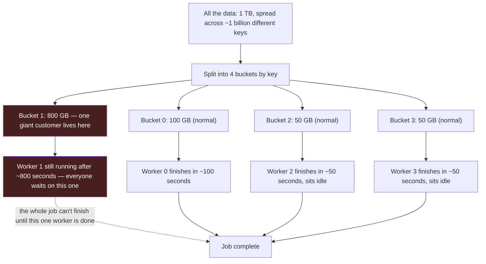

# Chapter 6 — Batch Systems

> *(Printed as "Chapter Five" in the book's own running heads — see the numbering note in
> Chapter 3. This guide follows the outer Table of Contents, so this is "Chapter 6" for citation
> purposes.)*

## The Simple Version, First

A "batch job" is just a big task that runs on a schedule — usually overnight — and has to finish
before someone needs the result in the morning. Think of it like a bakery prepping bread overnight
so it's ready by 6 AM.

The whole chapter is really about one idea: **things go wrong sometimes, and a good batch system
is built assuming that, not hoping around it.** A batch pipeline that only works when nothing
breaks isn't a real system — it's a demo.

Everything below builds on that one idea.

---

## What You'll Be Able to Say by the End

*(These are the book's own scripted interview lines — say them close to word-for-word.)*

> "In Spark, shuffle is the cost model. Every optimization is 'shuffle less' or 'shuffle smarter.'"
>
> "The SLA isn't the deadline. It's the deadline minus the recovery window minus the operator
> paging budget."
>
> "Broadcast joins beat shuffle joins most of the time. Knowing when they don't, and which shuffle
> strategy fits, is the other half of the answer."
>
> "A nightly DAG needs 99% reliability with a 30-minute backfill window, not 100% reliability."
>
> "Every operator has to be partition-idempotent. A job that can't be safely rerun on a single
> failed partition isn't a batch system; it's a one-shot script with a cron."

---

## Why Two Teams With the Same Job Have Very Different Nights

Imagine two teams. Both run a huge nightly job — about 500 terabytes of data in, 50 terabytes of
useful summary data out. Both jobs usually finish on time. Both teams are equally skilled.

But one team gets woken up at 2 AM twice a month. The other gets woken up once every three
months.

Same code, same size job, same cluster. So what's different?

**The team that sleeps better planned for the bad nights.** They assumed the job would
occasionally break partway through, and they built the system so that when it does, fixing it is
quick. The other team assumed things would keep working — and when they didn't, there was no fast
way to recover.

That's the whole chapter in one sentence: **batch systems are really about planning for the night
something breaks, not the nights when nothing does.**

Three things make that possible:

1. **Understand what actually costs time and money** — almost always, it's moving data between
   machines (we'll explain this as "shuffle" below).
2. **Pick the right way to combine two datasets** (called a "join") — the wrong choice can turn a
   2-hour job into a 20-hour one.
3. **Design so a failure only costs you a little time to fix**, not a full redo.

---

## Idea 1: Most of the Cost Is Moving Data Around, Not Computing

Here's an everyday version of the problem. Imagine you're organizing a company potluck. You have
a list of 10,000 people and a list of 10,000 dishes, and you need to match each person to their
dish. If everyone's name and dish are already sitting next to each other on the same table, it's
fast. But if the names are scattered across 50 different rooms in the building, someone has to
physically carry information between rooms before the matching can happen. **That carrying
between rooms is the expensive part** — not the actual matching.

In Spark (the tool most big batch jobs run on), this "carrying information between rooms" is
called a **shuffle**. It happens whenever the system needs to group matching things together —
like combining two tables on a shared ID, or adding up totals per customer. To do that grouping,
data has to physically move from one machine to another.

**This is the single most important idea in the whole chapter: shuffling data between machines is
slow and expensive. Almost every batch-tuning conversation is really a conversation about how to
shuffle less, or shuffle smarter.**

If you remember nothing else from this chapter, remember this: when someone asks "how would you
make this job faster," your first thought should be "how much data is moving between machines,
and can I reduce that?" — not "should I add more computers?"

### What Actually Happens During a Shuffle (in Plain Terms)

1. **Writing side:** Each worker machine writes its piece of data to disk, sorted into buckets —
   one bucket per machine that will need it next. Imagine 200 machines each writing 200 separate
   piles of paper, one pile per recipient.
2. **Moving side:** Every "receiving" machine then goes and collects its bucket from every
   "writing" machine. With 200 writers and 200 receivers, that's up to 200 × 200 = 40,000 separate
   little file transfers. At real-world scale this adds up to gigabytes or terabytes of network
   traffic for a single job.
3. **Combining side:** Each receiving machine merges everything it collected and does the actual
   work (adding things up, matching rows, etc.). If a machine gets handed more data than it can
   hold in memory, it has to spill extra data to disk — which is much slower, and is usually the
   moment a job starts to crawl.

**One setting that trips people up:** Spark has a setting called
`spark.sql.shuffle.partitions` that controls how many "buckets" data gets split into during a
shuffle. It defaults to 200 — a number chosen years ago for much smaller data. If you're
shuffling 300 terabytes but only splitting it into 200 buckets, each machine ends up holding 1.5
terabytes — way more than fits comfortably in memory, and the job grinds to a halt. A newer Spark
feature called **AQE (Adaptive Query Execution)** can automatically fix the bucket count at
runtime if you tell it a healthy bucket size (aim for 128 MB–1 GB per bucket) — but leaving the
old default of 200 in place, un-questioned, is one of the fastest ways to tell an interviewer
you haven't actually run Spark at a large scale.

### When One Bucket Gets Way More Than Its Fair Share

Sometimes the data isn't spread evenly. Picture a customer support call center: most agents get a
normal number of calls, but one agent — let's say they handle a huge VIP account — gets ten times
as many calls as anyone else. Everyone else finishes their shift on time; that one agent is still
on the phone hours later, and nobody can go home until they're done.

That's exactly what happens in a shuffle when one group (say, one really large customer) has way
more data than everyone else. That one "bucket" becomes a bottleneck, and the whole job has to
wait for it, even though every other machine finished long ago. This is called **skew**.

### Diagram — One Overloaded Bucket Slows the Whole Job Down



The overall data was reasonably balanced, but one bucket ended up with 80% of the bytes. That
one worker takes roughly 8x longer than everyone else — and everyone else just waits.

> **🚩 FAANG Signal**
> When an interviewer asks "how would you optimize this Spark job?" they want to hear you talk
> about shuffling first — how much data is moving, and whether it's spread evenly. If your first
> instinct is "give it more memory" or "add more machines," that tells them you're fixing the
> wrong problem. Fix the shuffle, and a lot of other problems shrink or disappear on their own.

---

## Idea 2: Combining Two Datasets — Pick the Right Strategy

"Joining" two datasets just means: match up rows from one table with rows from another table
based on something they have in common (like a customer ID). There are three ways to do this at
scale, and picking the wrong one is one of the most common mistakes in a real batch job.

**Think of it like planning a wedding seating chart.**

**Strategy 1 — Broadcast: hand everyone a copy of the small list.**
If one of your two datasets is small (say, a lookup table of country codes), it's way faster to
just copy that small table to every machine, rather than shuffling the giant table around to
match it. Each machine now has its own full copy of the small list and can look things up locally
— no network shuffling needed for the big table at all. This is by far the fastest option
**when the small side is actually small enough to fit comfortably in memory.**

The classic mistake: assuming a table is "small" without checking its real size in production.
A lookup table that's 5 MB in a test environment might be 4 GB with real production data — and
trying to copy a 4 GB table to every machine can crash the job with an out-of-memory error. Always
check the real size, not the size you assume.

**Strategy 2 — Shuffle-and-sort: everyone reshuffles to sit next to their match.**
If neither table is small, there's no shortcut — both tables have to be reshuffled so that
matching rows end up on the same machine. This is the standard, reliable, "works for any size"
approach. It costs more because both sides move, not just one, but it's predictable and it's
what you reach for by default when broadcasting isn't possible.

**Strategy 3 — Salting: split up the one giant customer so no single machine gets stuck.**
This solves the "skew" problem from Idea 1, specifically during a join. If one key (like one huge
customer) dominates the data, that customer's rows would normally all land on the same machine —
creating the bottleneck we saw above. The fix: attach a small random number ("salt") to that
customer's rows, splitting them across several machines instead of one, then match them up
against copies of the smaller side. It's a bit more setup, but it turns one overloaded machine
into several evenly-loaded ones.

Spark has a built-in feature (AQE) that tries to detect and fix this automatically for moderate
cases. But when one customer is genuinely huge — say 40% of all the data — it's usually worth
doing this by hand rather than trusting the automatic fix, because the automatic version is
tuned to be cautious and often doesn't kick in for truly extreme cases.

```python
# src/code-examples/ch05/spark_salted_skew_join.py
# Give every row on the big side a random number from 0-15 ("salt").
# Copy the small side 16 times, once per possible salt value.
# Now the one giant customer's rows are split across 16 machines
# instead of piling onto just one.
N = 16
fact_salted = fact.withColumn("salt", F.floor(F.rand() * N).cast("int"))
dim_fanned = dim.withColumn(
    "salt", F.explode(F.array([F.lit(i) for i in range(N)]))
)
joined = fact_salted.join(dim_fanned, on=["merchant_id", "salt"])
```

### The Three Strategies, Side by Side

| Strategy | Good for | Watch out for | Use it when |
|---|---|---|---|
| **Broadcast** (copy the small one) | Fastest option by far | Crashes if the "small" table isn't actually small in production | One side is under ~2 GB in real production data |
| **Shuffle-and-sort** (both sides move) | Works no matter the size, very predictable | Costs the most — both sides move | Neither side is small, and data is fairly evenly spread |
| **Salted** (split up the giant customer) | Stops one machine from getting stuck | A little more setup work, moves slightly more total data | One customer/key is more than about 10% of all the data |

> **❌ Anti-Pattern**
> Copying ("broadcasting") a table you assumed was small, without checking its real size in
> production. It works fine in testing and then crashes the very first time it runs on real data.
> Always check the actual size at production volume before deciding to broadcast.

> **✅ Say this out loud**
> "I'd broadcast the lookup table, and I've checked that it's under 2 GB with real production
> data — not just in testing." Saying you've *checked* the size is the part that shows experience.

---

## Idea 3: A Good Batch Job Assumes Things Will Break

Here's the mental model: if a job runs perfectly 99 times out of 100, that still means it fails
about **3 to 4 nights a year.** That's not a hypothetical — it's just math. A job that's only
built to work on the 99 good nights isn't finished. The real design work is about what happens on
that one bad night.

### The Deadline Is Not the Same Thing as Your Actual Time Budget

Say a report needs to be ready by 4 AM. It's tempting to think "great, the job has 4 hours to
run." But that ignores something important: **what happens if it breaks partway through?**

If your job fails, someone has to notice, investigate, and restart it — and only then does the
job actually finish. So your *real* time budget is smaller than the deadline:

```
Your real time budget = deadline − time to notice and restart − time to rerun
```

For example: if the deadline is 4 AM, it usually takes about 30 minutes for someone to notice a
failure and restart the job, and a rerun takes 90 minutes — then your job actually needs to finish
its normal run by **2 AM**, not 4 AM. That two extra hours of "buffer" is what saves you when
something goes wrong.

Teams that don't do this math schedule the job to *just barely* finish by the deadline — which
means the very first time something goes wrong, there's no time left to recover, and the deadline
gets missed in front of everyone downstream.

> **❌ Anti-Pattern**
> Scheduling a job to finish right at the deadline, with zero buffer. "It runs from midnight to
> 4 AM and the report is ready at 4:05." The first time anything goes wrong, there's no room left
> to fix it before people notice.

### Making a Failure Cheap to Fix

The other half of this idea: when something does break, how much work does it take to recover?
There are three habits that make recovery fast instead of painful:

- **Make reruns safe to repeat.** If a job writes "today's results" in a way that can just be
  cleanly replaced (instead of added on top of), then rerunning it after a failure doesn't create
  duplicate or double-counted data. This is usually done by having each day's data live in its own
  clearly separate "folder" (called a partition) that can be safely overwritten.
- **Save your work partway through.** A long job shouldn't be "all or nothing." If it's broken
  into stages, and each stage saves its progress before moving to the next, then a failure at
  stage 3 only means redoing stage 3 — not stages 1 and 2 as well.
- **Only redo the broken piece.** If only Tuesday's data failed, you should only have to rerun
  Tuesday's data — not the entire month. This sounds obvious, but a lot of real pipelines aren't
  built this way, and it turns a 45-minute fix into a multi-hour one.

> **⚠️ War Story**
> A company ran a huge nightly job (500 terabytes) with a 4-hour deadline. It had worked fine
> for a year and a half. Then one night, a small upstream change (someone added a field that
> turned out to be much larger than expected) caused the job to run out of memory four hours in.
> Because the job wasn't broken into separate, saveable stages, the only way to recover was to
> rerun the *entire* thing from scratch — which took five more hours and blew right past the
> deadline. The actual bug was small and boring. The real problem was that the job had no cheap
> way to recover. The fix wasn't to prevent every possible future bug — it was to break the job
> into stages that save progress, so a failure three-quarters of the way through only costs
> 45 minutes to fix instead of starting over.

> **✅ Pattern**
> A good rule of thumb: if a single day's data fails, fixing it should take less than 25% of the
> job's normal total runtime. If fixing one bad day takes almost as long as the whole job, you
> won't be able to recover before the next deadline hits.

---

## A Real Interview, Walked Through Simply

Here's what this actually sounds like in an interview — notice how the candidate asks questions
*before* designing anything, does simple math out loud, and isn't afraid to correct themselves.

**Interviewer:** Design the nightly batch pipeline for a 500 TB event dataset. Daily ingestion.
4-hour deadline. Needs to recover within 1 hour if something breaks.

**Candidate:** Before I sketch anything, a few questions. What's the final output — summary
tables for dashboards, or raw daily data for other systems to use? What kind of matching am I
doing — matching big data against small reference tables, or two big datasets against each other?
Where does the data live, and is it split up by day? And — is there a known case where one
customer or group makes up way more data than everyone else?

**Interviewer:** Summary tables for dashboards, plus a rollup for machine learning. Matching big
data against two small reference tables (users and merchants). Data lives in daily folders. And
yes — a handful of merchants make up 40% of all the data.

**Candidate:** Good — since both reference tables are small, I can copy them to every machine
(broadcast) and skip the expensive shuffle for that part entirely.

Let's do some quick math. 500 TB comes in, maybe 50 TB comes out after summarizing. The expensive
part — the actual data movement — is probably around 300 TB once we've dropped columns we don't
need.

Time budget: 4 hours total, minus 1 hour for recovery, minus 30 minutes to notice and restart —
so really I have 2.5 hours for a normal, clean run. Moving 300 TB in 2.5 hours means I need to
sustain about 33 GB every second. If each machine can move roughly 750 MB per second, that's
about 45 machines — I'd plan for 60 to 80 with some safety margin.

*(pauses)*

Actually, let me double check that. If I split that 300 TB into the default 200 buckets, each
machine ends up holding 1.5 TB — that's way too much and will blow up memory. I'd change the
bucket size so each one holds around 256 MB instead, which means about 1.2 million smaller
buckets, and let Spark's automatic tuning combine them at runtime. That slightly changes what
kind of machines I want — more buckets per machine favors machines with more processing cores. So
I'd actually go with 40 machines that have 16 cores and 64 GB of memory each, instead of 60
machines with 8 cores. Same total computing power, but shaped better for this shuffle.

**Interviewer:** What about that skewed merchant data?

**Candidate:** Matching against users is fine — pretty evenly spread. But if I'm summarizing by
merchant, that one merchant at 40% would pile onto a single machine. I'd split that merchant's
data across several machines using the "salting" trick — do the summary in two steps: first
summarize by (merchant, random-split-number), which spreads the work out, then do a second,
smaller summary step that combines those split pieces back into one number per merchant. Spark's
automatic skew-handling works for smaller imbalances, but at 40% I'd rather do it by hand to be
safe.

**Interviewer:** How do you recover if something fails? And what would you keep an eye on?

**Candidate:** Each day writes to its own clearly separate folder, so a rerun just replaces that
one day's folder — no risk of double-counting. I'd also split the job into two save-points: one
after the matching step, one after the summarizing step, so a failure late in the job doesn't
force redoing the matching part. That brings recovery time down from about 2.5 hours to roughly
45 minutes, comfortably inside the 1-hour requirement.

For monitoring, I'd watch three things that change slowly and predictably, so a sudden jump is
easy to catch: how long each stage normally takes, how much data normally moves during the
shuffle, and how many summary rows normally come out at the end. A sudden jump in any of those
usually means something upstream changed — like a new field, or a new hot customer — before it
becomes a real outage.

---

## Common Mistakes People Make

1. **Talking about "how many machines do I need" before talking about how much data is
   shuffling.** The machine count should come *from* the shuffle math, not before it.
2. **Assuming a "small" table is actually small, without checking.** It's small in testing, then
   it's 4 GB in production, and the job crashes.
3. **Trusting the automatic skew fix for extreme cases.** It handles mild imbalance fine. A
   customer at 40% of the data usually needs the manual fix (salting).
4. **Scheduling the job to finish exactly at the deadline.** No safety buffer means the first
   real failure becomes a missed deadline in front of everyone.
5. **Building one giant job with no save-points along the way.** Any failure means starting
   completely over. Saving progress at each stage is one of the cheapest improvements you can
   make to a pipeline.

---

## The Big Ideas, One Line Each

1. **Say "how much data is moving" before "how many machines."** Moving data between machines is
   almost always the real cost. Fixing that fixes most other problems too.
2. **Your real time budget is the deadline minus recovery time.** Not just the deadline itself.
3. **Pick your join strategy on purpose, and check your assumptions.** "I'll copy the small
   table" only works if you've actually confirmed it's small in production.
4. **Design so a single bad day only needs a small fix.** Not a full rebuild of everything.
5. **Break long jobs into stages that save progress.** A failure partway through should only cost
   you that one stage, not the whole run.

---

## Cheat Sheet

**The one-sentence version**
Moving data between machines is the expensive part. Everything else is smaller by comparison.

**Your real time budget**
```
real time budget = deadline − time to notice/restart − time to rerun
```
On average, noticing and restarting takes about 30 minutes. A well-designed rerun should take
roughly a quarter of the full job's normal runtime.

**Three ways to combine two datasets**
- **Broadcast** — copy the small table everywhere. Fastest, but check the real size first.
- **Shuffle-and-sort** — both sides move. The reliable default when nothing is small.
- **Salted** — split up one giant customer/key so it doesn't overload a single machine. Use this
  when one key is more than ~10% of all the data.

**Two settings worth knowing**
- `spark.sql.shuffle.partitions` — defaults to 200, which is too small for big jobs. Aim for
  each bucket to hold 128 MB–1 GB of data instead, and let automatic tuning combine them.
- `spark.sql.autoBroadcastJoinThreshold` — defaults to 10 MB, but production systems often raise
  this to 100–200 MB or more.

**Three habits that make failures cheap**
1. Each day's data lives in its own folder that can be safely replaced.
2. Long jobs save progress at each stage instead of running as one giant block.
3. A single bad day only requires rerunning that day — not everything.

**Three lines worth memorizing**
- "Moving data between machines is the cost. Everything else is noise."
- "The deadline isn't the time budget. The time budget is the deadline minus recovery."
- "If a job can't safely rerun just one bad day, it isn't really a batch system yet."

---

## Further Reading

- **"Resilient Distributed Datasets: A Fault-Tolerant Abstraction for In-Memory Cluster
  Computing."** Matei Zaharia et al. NSDI 2012. The original paper behind Spark — explains why
  keeping data in memory and minimizing movement between machines was the whole point.
- **"Spark SQL Performance Tuning"** (Spark's official documentation). The best reference for
  bucket sizes, broadcast thresholds, and automatic tuning settings.
- **Site Reliability Engineering (the "SRE Book"), chapters 3–4.** Google, 2016. Where the idea
  of "budgeting for a small number of allowed failures per year" comes from — the same math
  behind "99% reliable still means several bad nights a year."

---

## A Couple of Extra Ideas (From the Older 2025 Edition)

The earlier edition of this material covers a few extra angles that are still useful if an
interview goes slightly off the beaten path:

- **Choosing between Spark and Flink for a fast (5-minute) deadline:** it's really a trade-off
  between how fast you need results, how simple you want the system to operate, and whether
  you'll want to reuse the same logic later for reprocessing old data. Spark's ability to use
  the same code for both "today's live data" and "reprocess six months of history" is a big
  practical advantage when a business team later asks for a redo with different rules.
- **Cutting cloud costs on an always-running (streaming) job by about 30%:** using a mix of
  cheaper, less-guaranteed compute alongside regular compute; picking memory-heavy machines for
  memory-heavy work; using a more disk-friendly way of storing in-progress state instead of
  keeping everything in memory; and only keeping the most recent day of data "hot" while pushing
  older lookups to cheaper storage.
- **A simpler way to avoid double-counting in batch jobs:** rather than the more involved
  mechanisms used for streaming, a batch job can often get away with a simple
  "remove duplicate IDs" step early on, as long as every event has one guaranteed unique ID to
  begin with.
