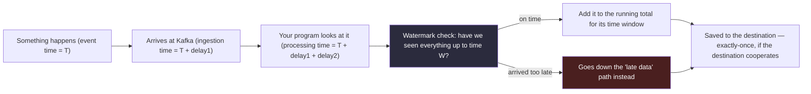

# Chapter 7 — Streaming Systems

> *(Printed as "Chapter Six" in the book's own running heads — see the numbering note in
> Chapter 3. This guide follows the outer Table of Contents, so this is "Chapter 7" for citation
> purposes.)*

## The Simple Version, First

"Streaming" means processing data the instant it shows up, instead of waiting and processing it
all in one big batch later. Think of the difference between a live sports scoreboard (updates the
second a goal is scored) versus a newspaper box score (printed once, the next morning).

The whole chapter comes down to this: **streaming isn't just "batch, but faster."** It's a
completely different set of promises you're making — about which clock you trust, how late data
is allowed to be, and what happens when something fails partway through. Picking streaming
because it sounds more impressive, without understanding those promises, is how teams end up
maintaining a complicated system for a problem batch could have solved more cheaply.

Everything below builds on that one idea.

---

## What You'll Be Able to Say by the End

*(These are the book's own scripted interview lines — say them close to word-for-word.)*

> "Streaming isn't faster batch. It's a commitment to three-clock reasoning, explicit watermarks,
> and sink-side exactly-once. I pick it when sub-10-second freshness justifies the operational
> cost."
>
> "Event time, processing time, and ingestion time are three different clocks. My watermark is a
> bet about how wrong one of them is."
>
> "Exactly-once is a semantics claim, not a delivery claim. The guarantee lives in the sink, not
> the broker."
>
> "Flink's keyed state is an embedded distributed database that rarely survives a misconfigured
> checkpoint. I design for checkpoint duration, state TTL, and recovery time from day one."
>
> "Lambda architecture is mostly a tax for picking the wrong streaming framework first. Kappa is
> mostly honesty about the trade-off."

---

## Why Two Teams Both Say They Built "Streaming" — But Only One Did

Two teams both need real-time analytics. Both ship. Both have dashboards that refresh every few
seconds. Both call what they built "streaming."

**Team A** built something that runs a small job every 30 seconds, saves the result somewhere
fast to read, and has the dashboard read from that. This works great — until the data gets bigger
or someone needs updates faster than once every 30 seconds.

**Team B** built something where data flows through continuously, a processing engine keeps a
running tally per customer (or whatever the key is), and results are saved the instant they're
ready. It's harder to build and harder to debug — but it can handle much more data, and can update
in well under a second, which Team A's approach fundamentally can't do.

**Neither team is wrong.** The real question isn't "which one is streaming" — it's whether the
team understood what they were signing up for. That's what this whole chapter is really about.

---

## Idea 1: There Are Three Different Clocks, and They Disagree

This is the single most important idea in the chapter, so let's slow down on it.

Imagine you're watching a hockey game on a 30-second broadcast delay. Something happens on the
ice at 8:00:00 PM. Because of the delay, it reaches your TV at 8:00:30 PM. And you personally
notice it and react at 8:00:32 PM, because you were getting a snack.

Those are three different points in time for the exact same event:
- **When it actually happened** (on the ice)
- **When it arrived** (at your TV)
- **When it got processed** (when you actually saw it and reacted)

Streaming systems have this exact same problem, and it has real names:

- **Event time** — when the thing actually happened in the real world (a click, a payment, a
  sensor reading). This is almost always what the business actually cares about.
- **Ingestion time** — when the event arrived at your system (say, when it landed in Kafka).
- **Processing time** — when your program actually got around to looking at it. This depends on
  how backed up your system is, how many workers you have, and plain bad luck.

**Why this matters so much:** if someone asks for "how many clicks happened in the last 5
minutes," that phrase is ambiguous unless you know which clock they mean. Do they mean the last
5 minutes of *real-world* time (event time) — even if some of those clicks are just now
arriving late? Or the last 5 minutes of *wall-clock, however things arrive* (processing time)?

Most business questions actually mean event time. Most simple, naive implementations
accidentally use processing time instead, because it's easier to code. That mismatch is where a
lot of subtly wrong dashboards come from.

### Diagram — the three clocks and the trip an event takes



---

## Idea 2: A "Watermark" Is Just an Honest Promise About How Late You'll Wait

Here's the everyday version: imagine you're hosting a potluck dinner and told everyone "food
starts at 7 PM." At 7:05, do you start serving, even though two people said they'd be "a little
late"? You have to draw a line somewhere. Maybe you decide: "we'll wait until 7:15, and if you're
not here by then, we start without you — you can grab a plate whenever you show up, but you
missed the group photo."

That's exactly what a **watermark** is. It's your system saying: *"I'm willing to wait this long
for late data, and after that, I'm moving on."*

More precisely: a watermark is a bet you make about how out-of-order your data can be. You're
saying, "By the time my clock says W, I assume I've seen everything that happened up to time
W in the real world. Anything that shows up claiming to have happened before W, but arrives after
I've already moved on, is 'late.'"

**Setting this "how long do I wait" number is a genuine trade-off:**
- Wait too long (too cautious), and your live dashboard becomes slow to finalize numbers — you
  lose the "real-time" benefit you were trying to get.
- Don't wait long enough (too aggressive), and you'll drop real data that was simply a little
  slow to arrive, which can quietly make your numbers wrong.

In real systems, most data (99.9%) shows up within a few seconds. But mobile phones are the
troublemakers — about 0.5–2% of mobile events show up minutes or even hours late, because the
phone was offline. Engineers who've actually run this in production measure their own system's
real-world lateness before picking a number. They don't guess.

**Four common ways to decide "how long do I wait":**

| Strategy | Plain description | Downside | Use it when |
|---|---|---|---|
| **Bounded lateness** | "I'll wait up to N seconds for stragglers." The default, easy to reason about. | Has to be set conservatively enough for your worst-behaved source | Disorder has a predictable upper limit |
| **Punctuated** | The sender itself tells you "I'm done sending for this time period." | Only works if the sender cooperates and is reliable about it | The producer can reliably mark "end of this batch" |
| **Monotonic event time** | Assumes data already arrives in order, so no waiting is needed. | Only works if that assumption is actually true | Replaying from an already-sorted log |
| **Idle-source timeout** | If one part of the stream goes quiet, don't wait forever — assume it's just done for now. | Need a sensible timeout per source | Any stream where one key might just stop sending for a while |

**And when something does arrive late, you have three real choices:**

1. **Drop it.** Fastest option. Fine for rough estimates where being slightly off doesn't matter.
2. **Update the result later.** Keep the door open a little longer, and if something late shows
   up, recalculate and re-publish the number. More correct, more expensive. Good for financial or
   audit-grade numbers.
3. **Set it aside separately.** Send late data to its own "for later review" pile instead of
   dropping it or blocking on it. The right choice when you're legally not allowed to just lose
   data.

> **🚩 FAANG Signal**
> When you say "I'd aggregate the last 5 minutes," the interviewer wants to hear you immediately
> clarify: last 5 minutes of *what clock*? And they want to hear a specific watermark policy —
> "5 seconds of expected lateness, 10 seconds of grace period, drop anything later than that" —
> not just "we'd handle late data."

> **✅ Say this out loud**
> "Event time, processing time, and ingestion time are three different clocks. My watermark is a
> bet about how wrong one of them is."

---

## Idea 3: "Exactly-Once" Is Three Different Promises Wearing One Name

This phrase gets thrown around a lot, and it causes a ton of confusion in interviews because
people use it to mean three different things without realizing it.

Think of it like a package delivery service claiming "guaranteed delivery." That could mean:
- The courier guarantees they'll *attempt* delivery exactly once (they won't come back twice)
- The warehouse guarantees they'll *scan* the package into their system exactly once
- **You, the customer, are guaranteed to receive exactly one package** — no duplicates on your
  porch, no matter what went wrong at any earlier step

Only the third one is the promise most people actually care about. The other two are pieces that
have to work together for the third one to be true.

Streaming systems have the exact same three layers:

1. **Exactly-once delivery.** "Every message gets handed from the sender to the receiver exactly
   once." **This one is basically impossible to fully guarantee** in any realistic system —
   networks drop things, retries happen. Most systems actually give you "at least once" (a message
   might arrive twice) and expect you to handle the rest.
2. **Exactly-once processing.** "My program computes on every event exactly once." Tools like
   Flink achieve this using checkpoints: if something crashes, the program rewinds to its last
   saved checkpoint and reprocesses from there — so no event is silently skipped.
3. **End-to-end exactly-once.** This is the one people actually mean when they say "exactly-once."
   It means: no matter what breaks along the way — network hiccups, retries, crashes — the final
   destination ends up with exactly one correct copy of the result. **This requires the
   destination itself to cooperate**, not just the processing engine.

That third layer is the one that actually matters, and it's the one that gets glossed over most
often. There are two common ways to actually achieve it:

- **Two-phase commit at the destination.** The processing engine and the destination coordinate
  so that a write is only considered final once both sides agree it succeeded.
- **Idempotent writes with a deterministic key.** Instead of coordinating a complex two-step
  commit, just make sure that writing the same result twice has no extra effect — like using
  `UPSERT` keyed by a stable ID, so replaying the same data safely overwrites itself with the same
  value instead of duplicating it.

> **❌ Anti-Pattern**
> Saying "the broker gives us exactly-once delivery" and stopping there. It doesn't. What you
> actually have is at-least-once delivery, and your destination needs to be built to handle
> duplicates gracefully. Confusing these two is one of the most common streaming mistakes people
> make in interviews.

> **✅ Say this out loud**
> "Exactly-once is a semantics claim, not a delivery claim. The guarantee lives in the sink, not
> the broker."

---

## Idea 4: Streaming Programs Remember Things — and That Memory Needs Rules

Batch jobs mostly don't need to "remember" anything between runs — each run starts fresh. But
streaming programs often need to keep a running memory of things: "what's this customer's rolling
average spend," "how many clicks has this session had so far," "what was the last known location
for this card."

This running memory is called **state**, and it lives somewhere like RocksDB (an embedded
database made for exactly this) or in regular memory. Think of it as the program's own private
notebook that it keeps updating as new events come in.

**The problem: if you never clean up that notebook, it grows forever.** Every new customer, every
new session, every new card adds another entry that never goes away — until eventually the
program runs out of memory or takes too long to save its progress.

**The fix is simple in concept: give every piece of memory an expiration date.** This is called a
**TTL** (time-to-live). If a customer hasn't shown up in 36 hours, forget their rolling average —
if they come back later, you'll just start tracking them fresh. This one habit — TTL on every
piece of state — is one of the most common things missing from streaming systems that later run
into trouble in production.

### Saving progress: checkpoints

Since the program is holding all this memory, it needs a way to save its progress periodically —
otherwise, if it crashes, it loses everything and has to start over from scratch. This periodic
save is called a **checkpoint**.

Here's the trade-off: the more memory (state) you're holding, the longer each checkpoint takes to
save. And if checkpoints take too long, the whole thing starts falling behind live data. **A
healthy rule of thumb: a checkpoint should take no more than 10–20% of the time between
checkpoints.** If checkpoints are eating up more time than that, the job will slowly fall further
and further behind, and you may never see it catch back up.

> **⚠️ War Story**
> *(Composite, drawn from real production incidents.)* A team building fraud detection kept
> per-card rolling averages in memory with no expiration date. It worked fine in testing. In
> production, months of accumulated state — including cards that hadn't been used in over a
> year — bloated the checkpoint size until checkpoints started taking longer than the time between
> them. The job fell permanently behind, and nobody had told it that old, unused cards could simply
> be forgotten. The fix was one line: a TTL on the state. This exact mistake — memory with no
> expiration date — is the most common real-world streaming incident.

> **✅ Pattern**
> Every piece of state gets a TTL. No exceptions. If you can't immediately answer "how long does
> this need to be remembered," that's a sign you haven't finished designing the system yet.

---

## Idea 5: Should You Even Use Streaming? (Lambda vs. Kappa)

Before picking a streaming framework, it's worth asking the more basic question: **do I need full
streaming at all, or would "batch, but frequent" actually be good enough?**

Two older architecture ideas come up a lot here, and knowing both — and which one is now the
default — is a good interview signal.

**"Lambda" architecture** means running two separate pipelines side by side: a fast, slightly
approximate streaming path for immediate answers, and a slower, fully-accurate batch path that
recomputes everything correctly later. The dashboard shows the fast approximate numbers now, and
quietly swaps in the corrected numbers once the batch path catches up.

The problem: **you're now maintaining the same business logic twice**, in two different systems,
and reconciling any disagreements between them. That's expensive in engineering time, and bugs
sneak in when the two paths drift apart.

**"Kappa" architecture** simplifies this by saying: *what if everything — even "historical" data
— is just treated as a stream?* You keep one single pipeline. If you need to reprocess old data
(say, because you fixed a bug), you just replay it through that same pipeline instead of running
an entirely separate batch system.

**Kappa is the modern default** for most companies, because modern streaming engines have gotten
good enough to handle joins, aggregations, and corrections that used to require a separate batch
path. Lambda still shows up when a team picked the wrong streaming tool first, ran into a wall,
and bolted on a batch path to compensate — the book's own framing is that "Lambda is mostly a tax
for picking the wrong streaming framework first."

> **✅ Say this out loud**
> "Lambda architecture is mostly a tax for picking the wrong streaming framework first. Kappa is
> mostly honesty about the trade-off."

**And sometimes the right answer is neither** — just a more frequent batch job. If a business
need can tolerate results being "up to 1 minute old," a small batch job that runs every minute is
usually far cheaper to build and operate than a full streaming system, and gets you basically the
same outcome. Streaming earns its operational cost specifically when you need sub-10-second
freshness, or a genuinely continuous per-event computation (like the fraud example below) that
a periodic batch job can't express cleanly.

---

## A Real Interview, Walked Through Simply

This is the fraud-detection example — a favorite prompt at any payments company, because every
idea in this chapter shows up in the answer. Watch how the candidate asks questions first, and
notices the tension between "check every transaction" and "some checks are too slow to do live."

**Interviewer:** Design a real-time fraud detection system for a payments company. Thousands of
transactions per second at peak. The decision — fraud or not — has to come back within 100
milliseconds.

**Candidate:** *(pauses)* Before I draw anything — a few questions. Is this decision blocking,
meaning the transaction doesn't complete until the fraud check returns? Or is it advisory, with a
reversal afterward if fraud is found later?

**Interviewer:** Blocking.

**Candidate:** Good, that changes everything about the time budget — every single step in this
design now has a slice of that 100-millisecond budget, and that's the dimension I'd expect to
break first. Next: how are transactions spread across merchants — evenly, or a few merchants
dominate?

**Interviewer:** Very uneven. The top 1% of merchants make up 40% of all volume.

**Candidate:** Right, so uneven load (skew) is a first-class problem here too — I'll come back to
that. Last question: if the same transaction gets retried (say, due to a network timeout), does it
need to get the exact same fraud decision both times?

**Interviewer:** Yes — same transaction, same decision. The gateway retries on timeout.

**Candidate:** Okay, so I need the scoring to be deterministic, plus a way to recognize "this is a
retry, not a new transaction" at the point where the final decision gets made.

Here's the shape: the payment gateway writes each transaction into a stream, split up by card ID.
A processing job reads from that stream, pulls in a handful of relevant facts about that
card/merchant/device (recent spending patterns, risk scores), scores the transaction using a
model, and writes the decision to a second stream. The gateway reads that decision and responds
to the original request.

**Interviewer:** What if the merchant risk lookup takes too long?

**Candidate:** I'd set a hard time budget for that lookup — say, 50 milliseconds. If it doesn't
come back in time, I don't want to block the whole transaction waiting. Instead, I'd flag it as
"needs enrichment" and fall back to a more conservative, rules-only decision immediately, then
reconcile the full analysis afterward, asynchronously.

**Interviewer:** And if the machine learning model itself goes down entirely?

**Candidate:** Never stall the pipeline waiting on it. I'd use a circuit breaker: if more than
about 5% of calls to the model fail within a short window, stop calling it entirely and fall back
to rules-only scoring — slightly more false alarms, but zero downtime. Once the model's healthy
again, reprocess anything that was scored conservatively in the meantime.

**Interviewer:** How would you keep this from silently drifting out of correctness over time?

**Candidate:** I'd run a regular audit — say, quarterly — comparing current traffic patterns
against what the system was originally designed around. Specifically: is the merchant
concentration still the same shape? Is the 100ms budget still realistic given current lookup
times? If either has drifted, that's a signal to revisit the design before it turns into an
incident.

---

## Common Mistakes People Make

1. **Mixing up "the broker delivered it once" with "the destination has exactly one correct
   result."** The broker can't promise the first one. Only the destination, built correctly, can
   promise the second.
2. **Using "when my program saw it" instead of "when it actually happened" for time windows.**
   Most business questions mean the real-world time something happened, not when your system got
   around to looking at it.
3. **Giving memory (state) no expiration date.** It grows forever until checkpoints slow down and
   the whole job falls behind. This is the single most common real-world streaming incident.
4. **Reaching for full streaming when a frequent batch job would do.** "Updates every minute" is
   not the same requirement as "updates every second." Streaming has real operational cost, and if
   the business need doesn't demand sub-10-second freshness, a cheaper batch job is often the
   better answer.
5. **Proposing the old dual-pipeline (Lambda) approach without being asked.** Suggesting it
   unprompted signals you haven't actually run the simpler, single-pipeline (Kappa) approach in
   production.

---

## The Big Ideas, One Line Each

1. **There are three different clocks, and most business questions mean the real-world one
   (event time).** Know which one you're using before you build anything.
2. **A watermark is an honest, explicit bet about how late you'll wait for data.** State the
   number out loud — don't just say "we'd handle late data."
3. **"Exactly-once" is really three separate promises.** The one that matters — no duplicates at
   the final destination — depends on the destination cooperating, not just the processing engine.
4. **Any memory your program keeps needs an expiration date.** No exceptions.
5. **Ask "do I even need streaming?" before reaching for it.** A more frequent batch job is often
   the cheaper, equally correct answer.

---

## Cheat Sheet

**The three clocks**
- **Event time** — when it actually happened. What the business usually means.
- **Ingestion time** — when it arrived at your system.
- **Processing time** — when your program got around to it. Drives wall-clock timers, not
  business windows.

**Watermark, in one formula**
```
watermark = latest event time seen so far − how long you're willing to wait for stragglers
```
Set that "how long" number based on your *own* system's measured lateness — don't guess from a
default.

**Late-data options**
- Drop it (fine for rough estimates)
- Update the result later (correct, more expensive — good for audits/finance)
- Set it aside for separate review (right choice when you can't just lose data)

**"Exactly-once," the three layers**
1. Delivery (broker to consumer) — not really achievable; assume at-least-once instead
2. Processing (your program computes each event once) — achieved via checkpoints
3. End-to-end (destination ends up with exactly one correct result) — needs the destination to
   cooperate (two-phase commit, or idempotent writes with a stable key)

**Keeping memory (state) healthy**
- Every piece of state gets an expiration date (TTL) — no exceptions
- Checkpoint save time should be 10–20% of the time between checkpoints, not more
- Practice recovering from your largest real production checkpoint before you need to do it live

**Should you even use streaming?**
- Sub-10-second freshness needed, or a genuinely continuous per-event computation → streaming
- "Updated every minute or so" is fine → a frequent batch job is usually cheaper
- Kappa (one pipeline, replay for reprocessing) is the modern default
- Lambda (two separate pipelines) is usually a sign of picking the wrong tool first

**Three lines worth memorizing**
- "Event time, processing time, and ingestion time are three different clocks."
- "Exactly-once is a semantics claim, not a delivery claim. It lives in the sink, not the broker."
- "Every piece of streaming state gets a TTL. No exceptions."

---

## Further Reading

- **"The Dataflow Model."** Tyler Akidau et al. VLDB 2015. The academic paper behind Google Cloud
  Dataflow and Apache Beam — this is where event time, watermarks, and windowing were formally
  defined. Most modern streaming design traces back to this paper.
- **Streaming Systems.** Tyler Akidau, Slava Chernyak, and Reuven Lax. O'Reilly, 2018. The
  book-length version of the same ideas, with the full watermark taxonomy. Read chapters 1–4.
- **"Questioning the Lambda Architecture."** Jay Kreps. O'Reilly Radar, 2014. The essay that
  introduced the Kappa alternative — short, opinionated, and still the modern default framing.

---

## A Couple of Extra Ideas (From the Older 2025 Edition)

- **Choosing Flink over Spark for very fast, continuously-evolving calculations:** if a feature
  needs to constantly evolve per event (like a time-decayed score that changes with every new
  event, not just every batch interval), a true streaming engine like Flink — using something
  called a `KeyedProcessFunction` — gives fine-grained control that a micro-batch tool like Spark
  Structured Streaming isn't built for. The trade-off is real: Flink is lower latency but requires
  more careful, hands-on state management than Spark's simpler batch-like API.
- **Graceful degradation instead of stalling:** a recurring pattern across these systems — if a
  slow dependency (a feature lookup, a model server) can't respond in time, don't block the whole
  pipeline. Flag the result as "needs enrichment," apply a safe conservative default immediately,
  and reconcile the full answer asynchronously once the slow dependency catches up.
- **Autoscaling isn't magic:** it only helps if you're scaling based on real pressure signals
  (consumer lag, processing time) — not just CPU — and if the number of partitions can actually
  support more parallel workers. Adding workers when partitions are still the bottleneck does
  nothing.
