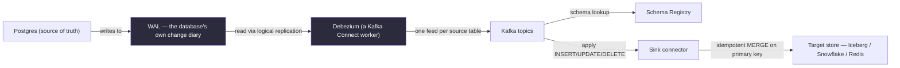

# Chapter 8 — CDC & Replication

> *(Printed as "Chapter Seven" in the book's own running heads — see the numbering note in
> Chapter 3. This guide follows the outer Table of Contents, so this is "Chapter 8" for citation
> purposes.)*

## The Simple Version, First

Imagine your company has a "real" database where customers place orders, update their
profiles, and cancel subscriptions. Somewhere else, you have an analytics warehouse that's
supposed to show a faithful copy of that same information — for dashboards, reports, and machine
learning.

**CDC (Change Data Capture)** is just a way of saying: *"Instead of periodically re-copying the
whole database, just tell me every single thing that changed, the moment it changes."*

The whole chapter comes down to this: **CDC isn't really a piece of software — it's a promise.**
The promise is that every insert, update, and especially every *delete* in the source database
shows up, in order, on the other end. Most of the ways teams try to fake this promise cheaply
(like a nightly copy job) quietly break that promise in ways that don't show up until someone
important notices the numbers are wrong.

Everything below builds on that one idea.

---

## What You'll Be Able to Say by the End

*(These are the book's own scripted interview lines — say them close to word-for-word.)*

> "Log-based CDC beats query-based CDC at every scale. The only question is whether I have access
> to the WAL."
>
> "Debezium's exactly-once claim is only honest when the sink is idempotent. Without that, it's
> at-least-once with good intentions."
>
> "Schema evolution is the hardest part of CDC. The schema registry is the only place the
> compatibility matrix lives."
>
> "Event sourcing and CDC are the same problem solved by different teams. One is my own writes as
> events, the other is someone else's."
>
> "Polling never captures DELETEs. Every replication built on a nightly SELECT diverges from its
> source over time. The only question is when someone notices."

---

## Why Two Teams Building "The Same Thing" Get Very Different Results

Two teams both need to keep an analytics warehouse in sync with a production Postgres database.
Both are staffed with competent engineers. Both ship in year one.

**Team A** runs a nightly job: `SELECT * FROM each_table`, dump it to files, load it into the
warehouse. Simple, well understood, easy to explain to anyone.

**Team B** builds something that continuously reads the database's own internal change log and
streams every change into the warehouse within a minute of it happening.

In year one, both teams look fine. **In year two, Team A gets a call from finance:** the account
balances in the warehouse don't match the real database. It turns out that every time a customer
closed their account, canceled a subscription, or had their data deleted for a privacy request —
those rows just vanished from the source. But Team A's nightly `SELECT *` only ever sees rows
that *still exist*. It has no way to notice something is now *missing*. The warehouse quietly
kept counting 340,000 "phantom" customers who had actually left over a year and a half earlier.

**Team B has sub-minute freshness, handles deletions correctly, and sailed through two schema
changes in year two without incident** — a system caught the third change (a breaking rename)
before it ever shipped.

The difference isn't skill. It's what each team's approach was actually capable of promising.
Team A committed to "most of the data, most of the time." Team B committed to the full CDC
contract.

---

## Idea 1: A Nightly Copy Job Can Never Notice Something Was Deleted

Here's the everyday version. Imagine you're keeping a filing cabinet that's supposed to mirror
someone else's filing cabinet. Once a night, you walk over, look at everything currently in their
cabinet, and copy it into yours.

**Now imagine they remove a folder entirely** — they shredded it, or gave it back to the customer,
or were legally required to destroy it. The next time you walk over and copy "everything
currently there," you simply won't see that folder anymore. But you also never actively noticed
it was *removed* — you only ever look at what's currently present. So the folder just... stays in
your cabinet forever, because nothing ever told you to take it out.

That's exactly the blind spot in a query-based ("polling") approach to keeping two databases in
sync. You periodically ask the source, "give me everything that changed since last time," using
something like a `last_updated` timestamp column. This works fine for things that get added or
edited — but a deleted row doesn't show up in that query at all, because **it's not there to be
selected.** Your copy keeps that row forever, silently, and it looks completely normal on the
surface. Nothing crashes. No error fires. The numbers are just wrong, and they stay wrong until
someone cross-checks totals and finds a mismatch.

### The three ways to actually do this, and why only one is safe by default

| Approach | Plain description | The catch | Use it when |
|---|---|---|---|
| **Log-based** (the safe default) | Read the database's own internal "everything that happened" log directly | Requires special access to that log, and it's a little different for every database engine | Any real, changing (not append-only) data source you have access to |
| **Query-based (polling)** | Periodically ask "what changed since last time?" using a timestamp column | Never sees deletions — silently drifts wrong over time | Only safe for data that's *never* deleted (pure logs, audit trails) |
| **Trigger-based** | Attach a small program to the source database that fires on every change | Slows down every single write on the live database — the opposite of what you wanted | Legacy systems where you truly have no other option |

> **❌ Anti-Pattern**
> Using a nightly full-table copy as your replication strategy for anything that can be updated
> or deleted. It's quietly wrong for every deletion, quietly wrong for anything that gets reverted,
> and becomes painfully slow once the source table passes about 10 TB. It only works safely for
> data that's purely added to and never changed or removed.

---

## Idea 2: Read the Database's Own Diary Instead of Asking It Questions

Every real database already keeps an internal, ultra-reliable record of everything that's ever
happened to it — inserts, updates, deletes, all of it, in the exact order they occurred. It uses
this record for its own crash recovery and internal replication. In Postgres, this is called the
**WAL** (write-ahead log); MySQL calls its version the **binlog**; other databases have their own
names for the same idea.

**The single most important idea in the whole chapter: instead of periodically asking the
database "what changed?", just quietly read its own diary.** That diary is authoritative — it's
the exact same record the database trusts for its own safety — so there's no guessing, no
"eventually consistent" uncertainty, and deletions are captured just as reliably as everything
else.

**Debezium** is the standard, widely-used open-source tool that does this. It plugs into the
source database, tails that internal diary, and turns every change into a clean, structured event
that gets published — typically one feed (Kafka "topic") per source table.

Every event, no matter which database it came from, has the same simple shape: the row's value
**before** the change, its value **after** the change, and what kind of change it was — a create,
update, delete, or initial read. This consistent shape is what makes Debezium portable: whatever
reads these events downstream doesn't need to care whether the original source was Postgres or
MySQL.

### Diagram — the standard log-based CDC pipeline



Two things in this picture are worth saying out loud in an interview:

- **One feed per source table, not one shared feed for everything.** Keeping each table's changes
  in their own ordered feed preserves the order they actually happened in. If you mix multiple
  tables into a single shared feed, you can break that ordering guarantee — and CDC correctness
  entirely depends on applying changes in the order they originally committed.
- **A schema registry sits alongside the pipeline as a gatekeeper.** Every event carries a
  reference to its schema version, not the full schema itself. When a source system tries to
  register a new schema version — say, after a code change — the registry checks whether it's
  compatible with what downstream consumers expect, and can reject it immediately if it isn't.
  That's the difference between catching a breaking change in the pull-request stage versus
  discovering it three days later when a dashboard silently breaks.

---

## Idea 3: Schema Changes Are the Hardest Part — and the Registry Is What Saves You

Source systems change their shape over time — someone adds a column, renames a field, changes a
type. If nothing is watching for this, a schema change on the source side can silently break
everything downstream, sometimes for days before anyone notices.

**The schema registry is where this gets managed**, and it works by defining exactly which kinds
of changes are "safe" and which are "breaking," using one of four compatibility rules:

- **BACKWARD** (the most common one, and usually the sweet spot): new data can still be read
  using the *old* schema. Safe changes: adding an optional field, removing a field that had a
  default value, widening a type. Unsafe: adding a *required* field with no default, renaming a
  field, or narrowing a type.
- **FORWARD**: old data can still be read using the *new* schema. Less common. Producers upgrade
  first, consumers catch up later.
- **FULL**: both BACKWARD and FORWARD apply at once. The strictest option — only purely additive,
  optional changes are allowed. Expensive to maintain, but it catches the most mistakes.
- **NONE**: no validation at all. Only reasonable if you have some *other* way of enforcing safety
  (like automated contract tests in your build pipeline).

For most CDC pipelines, **BACKWARD compatibility is the practical default.** Safe, additive
changes (like a new column) flow straight through without anyone needing to intervene. Unsafe
changes (renaming something, adding a required field) get rejected right when the producer tries
to register them — which is exactly where you want that failure to happen, not three days later
in a broken dashboard.

> **🚩 FAANG Signal**
> When you say "Debezium," the interviewer's next question is almost always about schema
> evolution. The answer they want is a *specific* compatibility mode plus a *specific* rollout
> story: "Schema Registry with BACKWARD compatibility; the producer team gets an automated check
> that rejects breaking changes; additive changes deploy without coordination; renames go through
> a deprecation cycle with dual-write for a quarter." Saying "we manage schema changes" and
> stopping there is not the answer.

---

## Idea 4: "Exactly-Once" Only Holds True If the Destination Cooperates

Debezium reliably delivers events from the source's diary to Kafka **at least once** — meaning a
message might occasionally get delivered twice (say, after a crash and restart), but it will never
silently vanish. The "exactly-once" claim people love to repeat about Debezium is only true up to
that point. What happens *after* that — whether a duplicate event causes a duplicate row in your
warehouse — is entirely up to how the destination is built.

**Two practical ways to make the destination safe against duplicates:**

1. **Idempotent MERGE on the primary key** (the pattern most warehouses use). Apply changes using
   a database `MERGE`, always taking the *latest* event for a given primary key. If a duplicate
   event arrives (say, from Debezium replaying after a crash), applying it again has no effect,
   because the latest event for that key hasn't actually changed. This is the pattern Iceberg,
   Delta, Snowflake, BigQuery, and Redshift all support.

```sql
-- src/code-examples/ch07/apply_cdc_merge.sql
-- Apply a small batch of CDC events safely. Debezium's event shape
-- carries an operation type (create/update/delete) plus before/after
-- values; take the newest event per primary key and MERGE it in.
MERGE INTO warehouse.users AS t
USING (
    SELECT
        COALESCE(after.user_id, before.user_id) AS user_id,
        after.email,
        after.plan_tier,
        op,
        ts_ms,
        ROW_NUMBER() OVER (
            PARTITION BY COALESCE(after.user_id, before.user_id)
            ORDER BY ts_ms DESC
        ) AS rn
    FROM cdc_events_users
    WHERE event_date = CURRENT_DATE
) AS s
ON t.user_id = s.user_id AND s.rn = 1
WHEN MATCHED AND s.op = 'd' THEN DELETE
WHEN MATCHED AND s.op IN ('c', 'u') THEN UPDATE SET
    email = s.email,
    plan_tier = s.plan_tier,
    updated_at = FROM_UNIXTIME(s.ts_ms / 1000)
WHEN NOT MATCHED AND s.op IN ('c', 'u') THEN INSERT (
    user_id, email, plan_tier, updated_at
) VALUES (
    s.user_id, s.email, s.plan_tier, FROM_UNIXTIME(s.ts_ms / 1000)
);
```

2. **Two-phase commit at the sink.** The destination and the pipeline coordinate so a write is
   only considered final once both sides agree it succeeded. Conceptually cleaner, but harder to
   implement — not every destination supports this kind of coordinated commit.

> **❌ Anti-Pattern**
> Trusting Debezium's "exactly-once" claim without checking whether your destination is
> idempotent. Debezium delivers at-least-once to Kafka. Turning that into true end-to-end
> exactly-once is the *destination's* job, not something the pipeline gives you for free.

> **✅ Say this out loud**
> "Debezium's exactly-once claim is only honest when the sink is idempotent. Without that, it's
> at-least-once with good intentions."

---

## Idea 5: The First-Time Copy Costs More Than People Expect

Before a CDC pipeline can start streaming *changes*, it needs a starting point — a full copy of
the table as it exists right now. This initial copy is called a **snapshot**, and it's often the
most underestimated cost in the whole setup.

**Snapshot time scales with how much data you're starting with.** As a rough real-world rate:
500 GB might take 2 to 6 hours; 10 terabytes can take multiple days. This is a one-time cost, but
teams that don't budget for it end up with an accidental "free" SLA on day one — and then spend
their first week fielding the question "why is the warehouse empty?"

**Later on, newer versions of tools like Debezium support incremental snapshots** — the ability
to add a brand-new table to an already-running pipeline without needing to stop everything and
restart. That's a good detail to mention if an interviewer asks what happens when a new table
needs to be added after the system's already live.

> **✅ Pattern**
> Make the destination idempotent before you trust any "exactly-once" claim. The MERGE pattern
> (latest event per primary key wins) is the actual answer — not whatever a vendor's marketing
> page promises.

---

## A Real Interview, Walked Through Simply

Here's the standard CDC prompt: a live production database, a warehouse target, a freshness
requirement. Watch how the candidate works through log access, schema evolution, destination
safety, and the snapshot cost — and notice they correct their own plan mid-answer.

**Interviewer:** Replicate a live Postgres database to a columnar warehouse. Two hundred tables,
500 GB total, sub-minute freshness, and schema changes expected over the next six months.

**Candidate:** Before I sketch anything — four questions. First: can we turn on the database's
internal replication log for reading? That requires a specific setting plus dedicated access.
Without that, reading the log directly is off the table entirely.

**Interviewer:** Yes, the database team has approved it.

**Candidate:** Good. Second — of the 200 tables, how many genuinely need sub-minute freshness,
and how many could get away with something slower?

**Interviewer:** About 30 are customer-facing and need sub-minute. The other 170 are operational
or slow-moving — once a day is fine for most.

**Candidate:** So that's really two pipelines, not one — real-time for the 30, and something
cheaper for the other 170. That matters for both cost and how much operational effort this needs.
Third: who owns schema changes on the source side — is there an existing agreement with the team
that owns that database?

**Interviewer:** No formal agreement. The application team just merges schema changes as part of
normal feature work.

**Candidate:** So the schema-change safety net is something we have to build, not just configure.
Last question: what's the warehouse, and does it support the kind of "insert-or-update" operation
we'd need?

**Interviewer:** Iceberg on S3, queried with Trino. Iceberg supports that operation natively.

**Candidate:** Perfect, let me size this out.

Here's the shape: a log-reading tool sits on Postgres, reading its internal change log. The 30
hot tables flow into their own feeds, keyed by primary key. The other 170 go through a slower,
once-a-day path into the same warehouse. A schema registry sits next to all of this with the
"safe changes only" rule turned on, and the warehouse applies changes every 30 seconds using an
insert-or-update operation.

*(pauses)*

Actually, let me walk that back. I said the other 170 tables could go through a slower, "just
copy everything nightly" path — but "slow-moving" and "never has anything deleted" aren't the
same thing. Any of those 170 tables that can have a row removed — a user-owned record, a
soft-delete getting promoted to a hard delete, a privacy deletion request — would silently drift
wrong under a plain nightly copy, exactly like Team A in our earlier example. I'd run *all* 200
tables through the same log-reading approach, just on a shared setup, and only change how often
each group gets written to the destination: every 30 seconds for the 30 hot tables, once nightly
for the rest. Same safe underlying approach, different delivery speed. Barely any extra load on
the source, and deletions get handled correctly everywhere — not just in the tables we happened to
think needed it.

**Interviewer:** What if this pipeline goes down for 24 hours?

**Candidate:** Two possible outcomes. If the database's retained log history covers that whole
24-hour gap — which it usually can, if sized for at least a few days — the pipeline just resumes
from where it left off and catches up on the backlog. Because the destination is idempotent, any
duplicate events that come through during that catch-up are harmless. If the retained history
*didn't* cover the gap, we're forced back into a full snapshot-plus-resume, which for 500 GB would
cost around five hours of rebuild time. I'd size the database's log retention for at least seven
days specifically so a 24-hour outage never forces that full rebuild.

---

## Common Mistakes People Make

1. **Assuming a periodic "copy everything" query captures deletions.** It doesn't. Every
   replication system built on a periodic `SELECT` quietly drifts from its source over time — the
   only question is when someone notices.
2. **Trusting "exactly-once" without checking the destination.** Debezium (or any similar tool)
   gives you at-least-once delivery to the pipeline. Making the final result exactly-once is the
   destination's responsibility.
3. **Skipping the schema registry.** "We'll manage schema changes as they come" doesn't work —
   schema changes happen faster than any team can manually coordinate around, and a registry is
   the only enforcement mechanism that catches problems *before* deployment, not after.
4. **Forgetting the cost of the very first copy.** 500 GB at a realistic transfer rate is around
   5 hours; 10 terabytes can be multiple days. If your deadline doesn't account for this, your
   first week becomes a fire drill.
5. **Mixing multiple tables into a single shared feed.** Ordering guarantees depend on each table
   having its own separate, ordered feed. Sharing one feed across tables breaks that ordering and
   makes correct processing impossible.

---

## The Big Ideas, One Line Each

1. **Read the database's own change diary instead of asking it repeated questions.** That's the
   entire difference between reliable CDC and something that quietly drifts wrong.
2. **A periodic copy job can never notice a deletion.** It only ever sees what's currently there.
3. **The schema registry is what keeps a fast-moving source from silently breaking everything
   downstream.** Name the specific compatibility mode, not just "we handle it."
4. **"Exactly-once" is a promise about the final destination, not about delivery.** Make the
   destination idempotent and the rest follows.
5. **Budget the first-time full copy explicitly.** It's a real, sometimes multi-day cost — not a
   footnote.

---

## Cheat Sheet

**The three ways to do CDC**
- **Log-based** (the default) — reads the database's own internal change log directly. Correct,
  authoritative, but a little different per database engine.
- **Query-based (polling)** — simple, but silently misses deletions. Only safe for data that's
  never deleted.
- **Trigger-based** — portable, but slows down every write on the live source.

**The event shape (Debezium and similar tools)**
Operation type (create / update / delete / initial-read), the row's value before, the row's value
after, a timestamp for ordering, and source coordinates for replay. One feed per source table.

**Schema registry compatibility modes**
- **BACKWARD** (most common) — new schema can read old data. Safe: add optional field, drop a
  field with a default, widen a type.
- **FORWARD** — old schema can read new data. Less common.
- **FULL** — both directions. Strictest, purely additive changes only.
- **NONE** — no validation. Only safe with another enforcement mechanism in place.

**Making the destination safe against duplicates**
1. Idempotent MERGE on primary key — take the latest event per key, apply it. Duplicates become
   harmless no-ops.
2. Two-phase commit at the sink — cleaner in theory, harder to implement everywhere.

**Initial snapshot cost**
Roughly: 500 GB ≈ 3–5 hours. 10 TB ≈ 2–4 days. Budget this into your timeline explicitly.

**"Exactly-once," in CDC terms**
Source-to-pipeline: at-least-once by default. Pipeline-to-destination: exactly-once only if the
destination is idempotent or supports two-phase commit.

**Three lines worth memorizing**
- "Log-based CDC beats query-based at every scale. The only question is whether I can read the
  log."
- "Polling never captures deletions. Every polling-based replication diverges over time."
- "Exactly-once lives in the sink, not the broker."

---

## Further Reading

- **Debezium Documentation.** debezium.io/documentation. The authoritative reference for
  per-database source connectors, the event format, snapshot behavior, and operational tuning.
  Read the Postgres and MySQL connector chapters before any CDC interview.
- **Designing Data-Intensive Applications, Chapter 11: Stream Processing.** Martin Kleppmann,
  O'Reilly, 2017. The foundational treatment of CDC, event sourcing, and the idea of a log as a
  basic building block.
- **"The Log: What every software engineer should know about real-time data's unifying
  abstraction."** Jay Kreps. LinkedIn Engineering, 2013. The philosophical foundation for treating
  CDC as "someone else's writes, as events."

---

## A Couple of Extra Ideas (From the Older 2025 Edition)

- **CDC's rough edges in practice:** schema evolution needs ongoing tracking (not a one-time
  setup), repartitioning a source table can cause historical inconsistencies if not handled
  carefully, and some SaaS-hosted databases simply don't expose their internal logs publicly —
  meaning log-based CDC isn't always an option, and a fallback approach may be unavoidable for
  those specific sources.
- **CDC as the backbone of everything downstream:** once CDC is in place, lakehouse tables need to
  support insert-or-update operations and slowly-changing-dimension patterns, feature stores rely
  on change-based updates rather than full recomputes, and backfills can reuse the same CDC logs
  to rebuild tables from scratch — CDC ends up shaping the whole platform's architecture, not just
  the ingestion layer.
- **Event sourcing, the close cousin:** the same underlying idea (a log of everything that
  happened, replayable from any point) shows up as "event sourcing" when a team is designing
  their *own* system to emit events for their *own* writes, rather than reading someone else's
  database. Pick CDC when you don't control the producer; pick event sourcing when you do.
