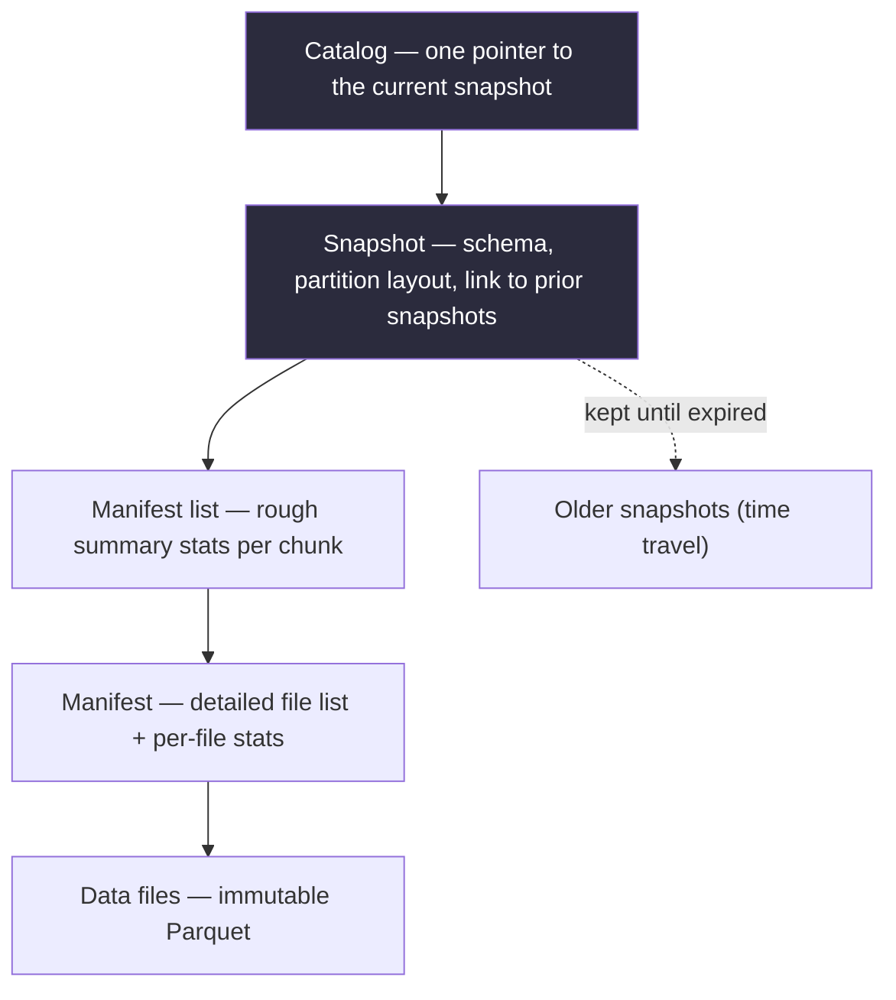

# Chapter 9 — Lakehouse & Table Formats

> *(Printed as "Chapter Eight" in the book's own running heads — see the numbering note in
> Chapter 3. This guide follows the outer Table of Contents, so this is "Chapter 9" for citation
> purposes.)*

## The Simple Version, First

Imagine a huge shared spreadsheet that hundreds of people need to read and update at once — but
instead of one file, it's actually millions of separate files sitting in cloud storage, and cloud
storage has a rule: **you can't edit a file in place, and there's no built-in way to guarantee
multiple people reading it at once all see a consistent version.**

That's the exact problem this chapter solves. **A "lakehouse table format" (Iceberg, Delta, or
Hudi) is just a clever bookkeeping system** sitting on top of a pile of plain files, whose whole
job is to make that pile *behave* like a real, trustworthy table — one where changes appear all
at once instead of halfway, where you can instantly ask "what did this look like on a specific
past date," and where adding a new column doesn't mean rewriting the entire dataset.

**The three formats — Iceberg, Delta, Hudi — aren't rival products with one "best" answer.**
They're three different answers to the same design questions, each shaped by the specific
workload the team that built it actually had. Picking the right one is about **matching the
format to what you're actually writing**, not picking whichever one is trending.

---

## What You'll Be Able to Say by the End

*(These are the book's own scripted interview lines — say them close to word-for-word.)*

> "Iceberg's metadata layer is the feature that matters. It's why I can do atomic swaps on a
> petabyte table without a maintenance window."
>
> "Delta versus Iceberg diverges most on streaming writes. Delta for a Spark-Structured-Streaming
> shop, Iceberg for writer diversity."
>
> "Hudi wins at update-heavy workloads. Most teams are append-heavy and pick Iceberg without
> realizing it."
>
> "Time travel isn't a debugging feature. It's a compliance feature, and retention in days is a
> legal decision as much as a technical one."
>
> "Maintenance on a lakehouse is mandatory, not optional. Compaction, snapshot expiration, and
> manifest rewrites run on a schedule from day one."

---

## Why Picking "By Popularity" Cost One Team Six Months

Two teams both migrate from an older system (Hive) to a modern lakehouse format. Both have
similar needs: changes need to appear all-or-nothing, adding columns shouldn't require rewriting
everything, they need to look at past versions for compliance, and multiple tools need to query
the same tables.

**Team A** evaluates for a week and picks Delta, because they're heavy Databricks users and Delta
has excellent first-party support there. Shipping is fast.

**Team B** evaluates for three weeks and picks Iceberg, because they run several different query
engines against the same tables and want a format that doesn't favor any one of them. Shipping is
slower — Iceberg needs more upfront setup.

**Six months later, Team A has built six dashboards on a different query engine that reads Delta
through a third-party connector, and it's slow.** Edge cases around streaming updates cause
inconsistent reads across engines. Team A realizes, only now, that Delta is fundamentally built
around Spark in a way that wasn't obvious during evaluation — other engines' support for it is
noticeably behind.

**Both teams "picked a lakehouse format."** Team A picked by popularity and familiarity with their
existing tools. Team B picked by actually looking at which tools would be writing to their tables.
That's the entire difference.

---

## Idea 1: The Core Problem — Making a Pile of Files Behave Like a Real Table

You can't directly edit a file sitting in cloud storage the way you'd edit a row in a normal
database. And without something coordinating it, there's no built-in guarantee that everyone
reading a "table" made of thousands of separate files sees a consistent version — someone could
be halfway through reading while another process is halfway through writing.

**A lakehouse format solves this with a clever trick: a small pointer file that gets swapped
atomically.** Instead of changing the actual data files, every update creates *new* files, then
does one tiny, instant, all-or-nothing swap of a pointer that says "the current version of this
table is over here now." Anyone who started reading before the swap keeps seeing the old,
complete version. Anyone who reads after sees the new, complete version. **Nobody ever sees a
half-finished update** — which is exactly the guarantee a real database gives you, achieved here
without needing a traditional database underneath.

This single trick is what unlocks everything else in this chapter: instant "what did this look
like yesterday" queries, adding a column without rewriting the whole table, and multiple
different tools safely reading and writing the same data.

> **❌ Anti-Pattern**
> Picking a format by popularity or familiarity with your existing tools instead of by what's
> actually writing to the table. "We're picking Delta because everyone uses it" is the most common
> wrong answer to this chapter's core question. The right pick depends on what's actually writing
> to your tables — not on which platform's conference keynote you watched most recently.

---

## Idea 2: The Bookkeeping Structure — Using Iceberg as the Example

Iceberg, Delta, and Hudi each organize their bookkeeping slightly differently, but they're solving
the exact same problem. Iceberg's version is the clearest to walk through, so it's worth
understanding as the canonical example.

Think of it like a series of nested reference documents, each one pointing to more specific
detail below it:

- **A catalog** holds exactly one pointer: "here's the current version of this table."
- That pointer points to a **snapshot** — a complete description of the table's state at one
  moment: its schema, how it's split into partitions, and a link to every previous snapshot
  (which is what makes "look at an old version" possible).
- Each snapshot points to a **manifest list** — basically a table of contents, with rough summary
  stats (like the min/max values) for each chunk of the table.
- Each entry in that list points to a **manifest** — a more detailed listing of exactly which
  actual data files belong to that chunk, along with per-file summary stats.
- Finally, those point to the **actual data files** — plain, unchangeable files. "Deleting" a row
  doesn't rewrite a file; it just adds a note elsewhere saying that row no longer counts.

**Why this layered structure matters, in practice:**

- **It's what makes the atomic swap possible.** A writer creates new data files, new manifests, a
  new manifest list — and only at the very last step does it swap the catalog's single pointer.
  That one swap is the whole "atomic commit."
- **It's what makes queries fast.** A query like "give me everything from this year" can skip huge
  portions of the table by checking summary stats at the manifest-list level first, then the
  manifest level, without ever opening most of the actual data files. At real scale, this
  typically cuts what needs to be read by 100 to 1000 times before a single byte of real data gets
  touched.

### Diagram — the Iceberg metadata tree



**A sense of real-world size**, to build intuition: a manifest list is usually a few KB to a few
hundred KB; a single manifest file is roughly 1–10 MB; one commit's worth of new metadata adds
maybe 100 KB to 10 MB, depending how many partitions it touched. On a well-maintained 50 TB table
split into 730 daily partitions, figuring out *what to read* for a query typically takes 50–500
milliseconds before the first real data file even opens. **On a neglected table, that same
planning step can stretch past 30 seconds** — which is exactly the failure mode in the war story
below.

---

## Idea 3: Iceberg vs. Delta vs. Hudi — Pick by What's Actually Writing

Each format grew out of a different company's real workload, and that history still shows in what
each one is best at today.

| Format | Good at | Watch out for | Pick it when |
|---|---|---|---|
| **Iceberg** | Works equally well no matter which tool is writing (Spark, Trino, Flink, Snowflake); flexible bookkeeping; partitioning that can evolve over time | More hands-on maintenance required | Multiple different tools write to the same big analytics tables |
| **Delta Lake** | Excellent Spark integration, especially for continuously-running Spark jobs; smooth Databricks experience | Built Spark-first — other tools' support tends to lag behind | A Spark-centric team, especially one leaning on continuous Spark streaming |
| **Hudi** | Optimized specifically for frequent updates to existing rows, with a "fast write" table mode | Smaller surrounding ecosystem; weaker performance for pure large-scan analytics | Update-heavy workloads, especially CDC-style pipelines with a high rate of changes |

The pattern that matters most is **who's actually writing.** Iceberg's neutral, community-driven
design and wide tool support make it the natural default the moment more than one engine writes
to the same table. Delta comes from Databricks, so new features land on Spark first — if Spark is
truly your only writer, Delta's convenience is hard to beat. Hudi earned its reputation at Uber
for CDC-heavy pipelines and still excels there; for mostly-read analytics, it's the hardest of the
three to operate well.

> **⚠️ War Story**
> A data platform team at an ad company picked Hudi because they'd read it was "best-in-class for
> updates" and their pipelines included some CDC data. Six months in, they actually measured their
> workload: it was really 92% append-only event tables, with only nightly updates on a handful of
> small dimension tables. Hudi's "fast write" mode was rewriting entire data files to handle even
> small updates, inflating their storage costs by roughly 8x. The team migrated to Iceberg — which
> natively handles append-heavy workloads well and does fine with occasional update statements —
> over one quarter. Storage costs dropped by a third; query planning time on their analytics
> tables dropped by half. The lesson wasn't that Hudi is a bad tool. It was that the team hadn't
> actually measured their real workload before picking based on a marketing claim.

---

## Idea 4: Maintenance Isn't Optional — It's the Part Everyone Underestimates

All three formats slowly accumulate bookkeeping clutter over time — extra manifest entries, tiny
leftover files, old snapshots piling up. **None of this cleanup happens automatically. Skipping it
is how teams end up with "mystery slowdowns six months in."**

For Iceberg specifically, four maintenance jobs need to run on a schedule from day one:

- **Expire old snapshots** — daily. Without this, the history of past versions grows forever.
  Typically keep 7 to 30 days for time-travel purposes (shorter if you can get away with it;
  compliance rules may force longer).
- **Compact small data files** — daily or nightly. Streaming writers especially tend to produce
  thousands of tiny files per hour, and a query planner has to account for every single one of
  them, which slows everything down. Compaction merges these into properly-sized files (targeting
  roughly 128–512 MB each).
- **Rewrite manifests** — weekly. After lots of small commits, the manifest bookkeeping itself
  gets fragmented; this tidies it back up and directly cuts query planning time.
- **Remove orphaned files** — weekly. Cleans up leftover data files that no longer belong to any
  current snapshot — the debris from aborted commits or failed writes.

Delta and Hudi expose the same underlying need under different command names — Delta uses
`OPTIMIZE` and `VACUUM`; Hudi uses `clean` and `compaction`.

> **✅ Pattern**
> Schedule lakehouse maintenance like any other production concern — a nightly compaction job and
> a weekly snapshot-expiration job from day one. Catching bookkeeping bloat proactively costs a
> few minutes of engineering time per quarter. Diagnosing it reactively during an actual incident
> costs days, and the fix is often emergency overnight work just to restore normal query speed.

---

## Idea 5: Time Travel Is a Compliance Feature, Not Just a Debugging Trick

Because every past version is preserved as a snapshot until it's explicitly expired, you can query
the table exactly as it looked at any earlier point — instantly, and at almost no extra cost,
because it's just resolving against the existing bookkeeping rather than reconstructing anything.

```sql
-- src/code-examples/ch08/iceberg_time_travel.sql
-- Hidden partitioning: derived from a source column, not a
-- separately maintained column.
CREATE TABLE warehouse.events (...)
USING iceberg
PARTITIONED BY (days(event_ts));

-- Time travel resolves against the metadata tree, not the raw
-- data files -- which is why it's fast even on huge tables.
SELECT COUNT(*) FROM warehouse.events VERSION AS OF 3847219478234;
SELECT COUNT(*) FROM warehouse.events TIMESTAMP AS OF '2024-06-15 14:30:00';
```

**It's easy to think of this as just a handy debugging feature — but its real importance is
regulatory.** If a regulator asks "show me exactly what this customer's records looked like on
December 31st at 11:59 PM," a lakehouse answers that in seconds. Without this feature, you're
restoring a backup, which takes hours and usually needs an auditor standing by to confirm it was
done correctly.

**This means the retention period — how many days of history you keep — is genuinely a legal
decision, not just a technical setting.** Privacy regulations (like GDPR's "right to be forgotten")
often require permanently deleting a specific person's data within a set window after a request —
which means any snapshot still containing that now-deleted row has to be expired within that same
window. Financial audit rules can separately require keeping certain records for several years.
These two pressures — delete quickly enough for privacy, keep long enough for audits — genuinely
pull in different directions, and reconciling them is an ongoing policy decision, not a one-time
setting you configure once and forget.

Schema changes get the same "just update the bookkeeping, don't touch the data" treatment: every
column is tracked by an internal ID number, not by its name. Renaming a column just relabels that
ID. Adding a column just registers a new ID (older files simply report it as empty). Dropping a
column just removes the ID from the current schema — the underlying bytes stay on disk until the
next compaction. This is why lakehouse migrations typically cost roughly 90% less in storage churn
than the older Hive-based systems, where every one of these changes meant rewriting entire files.

---

## A Real Interview, Walked Through Simply

Here's a rich, two-part example. In the first half, the candidate migrates a huge legacy warehouse
and has to size the real operational risks — not just pick a format. In the second, at a fresh
company, they choose between the three formats by directly asking what's actually writing to the
table, and catch themselves before assuming an answer.

### Part 1 — Migrating a 50 petabyte legacy warehouse, zero downtime

**Interviewer:** Migrate a 50 petabyte legacy Hive warehouse to a lakehouse format. Zero downtime.
Thousands of active consumers across batch jobs, interactive analytics, streaming, and BI tools.

**Candidate:** Before I draw anything — two questions. What's actually writing to these tables
today? Is one engine dominant, or are multiple engines writing to the same tables? And what's the
mix of table shapes — mostly append-only, or a real mix with lots of updates?

**Interviewer:** Multiple engines — batch ETL, some real-time features writing to CDC-derived
tables, occasional writes from an ML feature pipeline. Mostly append-only fact tables, a few
hundred slowly-changing dimension tables, and some CDC-derived tables with a higher update rate.

**Candidate:** Multiple writers rules out the Spark-first option as the default — one engine's
support for it would lag behind, which becomes a real problem at this scale. I'd lean toward the
writer-neutral option for the bulk of it.

*(pauses)*

Let me actually check that assumption instead of asserting it. How frequently are those CDC-backed
tables actually updated — what percentage of rows per day?

**Interviewer:** Call it 5 to 10% per day on the heaviest one.

**Candidate:** That's comfortably within range for the writer-neutral format's update mechanism
with nightly compaction. If it were 20%+ per day on a large table, the rewrite cost would start to
dominate and the update-optimized format would genuinely win instead — better to confirm that
number before committing, not after. I'd standardize on one format for the whole warehouse and
accept the moderate compaction cost on the update-heavy tables; running two different formats
across 50 petabytes for the sake of a handful of tables costs more in operational complexity than
it saves.

**Interviewer:** What breaks first at this scale?

**Candidate:** Three things, roughly in the order I'd expect to hit them. First, metadata
bookkeeping — with 730 daily partitions and thousands of files per partition, the file-listing
overhead grows fast, and skipping the maintenance schedule is how teams end up debugging
six-month-old performance regressions that turn out to just be bookkeeping bloat.

Second, the small-file problem — any streaming writers will produce thousands of tiny files per
hour, which kills read parallelism because the query planner ends up creating one unit of work per
file. A nightly compaction job that merges these into properly-sized files isn't optional at this
scale.

Third — and this one's easy to miss — cloud storage services often rate-limit based on the
"prefix" (the leading portion of a file's path). A single prefix typically caps out around a few
thousand operations per second. A nightly writer that lands all 50 petabytes under one date-based
path will hit that ceiling and start getting throttled a couple hours in. The fix is designing file
paths so the partition value appears early in the path, spreading writes and reads across many
different prefixes instead of funneling them all through one. Teams that skip this usually
discover it during their first big backfill and lose a week re-organizing file paths afterward.

**Interviewer:** Storage cost?

**Candidate:** Snapshot retention costs real money. At 50 petabytes, keeping 30 days of snapshot
history for time travel means roughly 20–40% extra storage sitting around for that whole window —
call it 15 petabytes extra. At standard cloud storage pricing, that's a genuinely large monthly
number. I'd expire snapshots aggressively — only as long as compliance actually requires, often as
little as 7 days — and move anything that needs longer retention to a cheaper, slower-access
storage tier instead.

**Interviewer:** What's the point of no return in this migration?

**Candidate:** The moment the first consumer switches to reading *only* from the new format.
Before that point, rolling back just means turning off dual-writes and staying on the old system.
After that point, rolling back means re-migrating every consumer that already switched, back to
the old system. I'd mark that milestone explicitly in the rollout plan and require written
sign-off from the migration sponsor before crossing it.

### Part 2 — A fresh build: picking a format from scratch

**Interviewer:** Why this format specifically, and not one of the other two?

**Candidate:** Writer neutrality. At this company we have several engines writing to, or wanting
to write to, the same tables — and if the data team wants to add a new tool next year, it should
work without a migration. The Spark-first option would make other engines second-class citizens
here. The update-optimized option is tuned for update-heavy workloads, and we're mostly
append-only, so it would cost more than it buys us. The writer-neutral option is the default for
exactly this multi-engine situation. The trade-off is real — its maintenance operations add
overhead — but every format has some version of that same cost; it just goes by different names.

---

## Common Mistakes People Make

1. **Picking a format for a multi-engine warehouse based on one team's favorite tool.** The
   Spark-first option is genuinely excellent for Spark-only shops — and a real liability the
   moment a second engine needs to write to the same tables.
2. **Skipping maintenance with "we'll get to it later."** Later is when the incident hits.
   Bookkeeping bloat causes quiet, gradual slowdowns that are hard to trace back to their actual
   cause in the moment.
3. **Treating time travel as optional or purely a debugging convenience.** It's a compliance
   feature, and the retention window is a legal decision. Many teams under-plan how it interacts
   with "right to be forgotten" deletion requirements.
4. **Underestimating the small-file problem when migrating from an older system.** The old
   system's typical file-size patterns are usually wrong for a lakehouse format. Compaction needs
   to start on day one of the migration, not "whenever we get to it."
5. **Trying to cut over in a single step.** Petabyte-scale migrations succeed as a 6-to-9-month
   rollout — dual-writing to both systems, validating they match, then progressively switching
   readers over — never as a single flip-the-switch event.

---

## The Big Ideas, One Line Each

1. **A lakehouse format is bookkeeping on top of plain files** — an atomic pointer swap is what
   makes a pile of files behave like a real, trustworthy table.
2. **The metadata tree (catalog → snapshot → manifest list → manifest → data files) is what makes
   both atomic commits and fast queries possible** — know that structure well enough to draw it.
3. **Pick a format by who's actually writing to your tables, not by popularity.** Writer diversity
   favors one format; heavy Spark streaming favors another; heavy updates favor a third.
4. **Maintenance is mandatory, not a someday task.** Four scheduled jobs keep the bookkeeping
   healthy — skipping them causes slow, hard-to-diagnose degradation.
5. **Time travel and schema changes are cheap because they're metadata-only operations** — but the
   retention window is a legal decision, not just a technical one.

---

## Cheat Sheet

**The three formats, one line each**
- **Iceberg** — writer-neutral, broadest tool support. Default choice for multi-engine warehouses.
- **Delta Lake** — Spark-first, best for continuous Spark streaming. Default for Databricks-heavy
  shops.
- **Hudi** — optimized for frequent updates. Default for update-heavy, CDC-style pipelines.

**The metadata tree**
`catalog → snapshot → manifest list → manifest → data files`
Every commit: new manifests, new manifest list, one atomic swap of the catalog's pointer.

**Four maintenance jobs (schedule from day one)**
1. Expire old snapshots — daily, keep 7–30 days
2. Compact small files — daily/nightly, target 128–512 MB per file
3. Rewrite manifests — weekly, cuts query planning time
4. Remove orphaned files — weekly

**Real-world size intuition**
Manifest list: a few KB–few hundred KB. Manifest file: 1–10 MB. Healthy query planning on a
well-maintained 50 TB table: 50–500 ms. Neglected (skipped manifest rewrites): 30+ seconds.

**Time travel**
A compliance feature, not just a debugging tool. Retention in days is a legal decision.
`VERSION AS OF <snapshot_id>` / `TIMESTAMP AS OF <timestamp>`

**Schema evolution**
Columns tracked by ID, not name — so add/rename/drop are all metadata-only operations, no data
rewrite required.

**Migration pattern (petabyte scale)**
In-place metadata scaffolding → dual-write plus validation (4–6 weeks) → progressive reader
switch (a couple teams per week) → decommission old system (after 3–4 weeks of zero reads). Total:
6–9 months.

**Three lines worth memorizing**
- "Pick by workload composition, not by popularity."
- "Maintenance on the lakehouse is mandatory, not optional."
- "Time travel retention is a legal decision, not just a technical one."

---

## Further Reading

- **Apache Iceberg Specification.** iceberg.apache.org/spec. The authoritative reference for the
  metadata tree, manifest format, and atomic commit protocol. Worth reading end to end once.
- **"Lakehouse: A New Generation of Open Platforms that Unify Data Warehousing and Advanced
  Analytics."** Michael Armbrust et al. CIDR 2021. The paper that framed the "lakehouse" term —
  good background for any architecture discussion that starts with "why not just a warehouse?"
- **"Delta Lake: High-Performance ACID Table Storage over Cloud Object Stores."** Michael Armbrust
  et al. VLDB 2020. The original Delta paper — read for the transaction-log design and the
  contrast with Iceberg's tree-based approach.

---

## A Couple of Extra Ideas (From the Older 2025 Edition)

- **Serialization format choice depends on how data will actually be read.** For files sitting in
  a lake, a columnar format (like Parquet) wins almost always for analytics, since queries
  typically want a handful of columns out of a huge dataset — reading column-by-column means
  skipping the columns you don't need. For individual events flowing through a message system
  (like Kafka), a row-based format (like Avro) tends to make more sense instead, since each
  message is read and processed as a whole record, and Avro's built-in schema enforcement helps
  catch data-quality problems early, upstream of the pipeline.
- **A lakehouse format is one piece of a bigger cross-cutting pattern vocabulary.** The broader
  architectural toolkit around it — medallion/layered lake patterns (raw, cleaned, and modeled
  zones), event-driven versus scheduled pipeline designs, and how state and CDC patterns interact
  with correctness at scale — is what separates someone who can operate a specific tool from
  someone who can actually architect a platform. These patterns show up repeatedly across very
  different problem domains: analytics, fraud detection, identity resolution, and traditional
  reporting all lean on the same underlying vocabulary.
