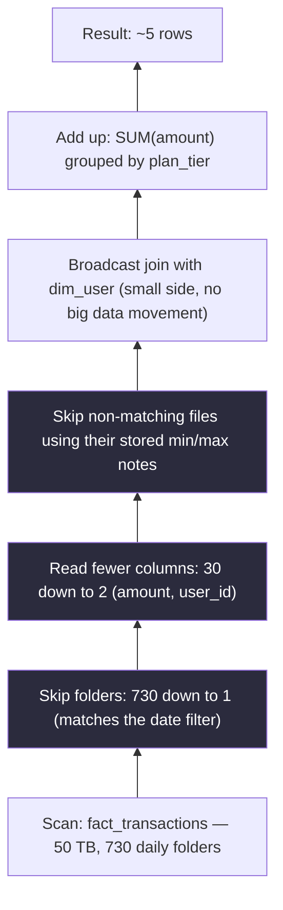

# Chapter 10 — Query Engines

> *(Printed as "Chapter Nine" in the book's own running heads — see the numbering note in
> Chapter 3. This guide follows the outer Table of Contents, so this is "Chapter 10" for citation
> purposes.)*

## The Simple Version, First

Imagine two people cooking the exact same recipe in the exact same kitchen. One finishes in 12
minutes. The other takes two hours. Same ingredients, same stove, same steps written on paper —
but one person knew exactly which shortcuts the kitchen allowed, and the other didn't.

That's this whole chapter. **Two teams can write nearly identical SQL against the exact same
data, and one query finishes 600 times faster than the other** — not because of a better computer,
but because of one tiny difference in how the question was phrased.

The core idea: **a query engine doesn't charge you for how many rows come back. It charges you
for how much raw data it had to look through to answer you.** Once that clicks, almost everything
else in this chapter is just "here's how to help the engine look through less."

---

## What You'll Be Able to Say by the End

*(These are the book's own scripted interview lines — say them close to word-for-word.)*

> "Query cost at analytics scale is bytes read, not rows returned. Every optimization reduces that
> number; nothing else matters."
>
> "Predicate and projection pushdown save more money than index tuning at analytics scale. The
> partitioning scheme is my most important pushdown hint."
>
> "A function on the partition column kills pruning. Rewrite filters as range comparisons against
> the stored column directly."
>
> "Materialized views are a bet that the query pattern is stable. If queries drift, the views are
> the thing that breaks first."
>
> "Trino, Spark SQL, and Snowflake optimize differently for the same SQL. Writing portable
> analytics SQL means knowing what each one prunes."

---

## Why the Same Question, Written Two Ways, Can Take 600x Longer

Two teams each own a slow dashboard. Both queries run against the same 50 terabyte table of
transactions, split up by day. Both queries do the exact same thing: add up daily revenue by
customer plan.

**Team A's** query runs in 12 seconds. **Team B's** query runs in two hours. The SQL is nearly
identical — the difference is a single function call in the filter.

Team B wrote something like *"give me rows where reformatting the date column equals
2024-06-15."* Team A wrote *"give me rows where the date column falls between 2024-06-15 and
2024-06-16."*

Those sound almost like the same sentence. But to the engine, they are completely different
instructions. Team A's version lets the engine immediately skip 729 out of 730 days of data
without even opening those files. Team B's version — because it wraps the date column inside a
function first — makes the engine unable to tell which day is being asked for *until after* it's
already opened and read every single day. Same logic, same data, same engine — a 600x difference
in runtime, purely from one phrasing choice.

**The one idea to hold onto: query engines are where the shape of your data meets the intent of
your question.** Shape means how the data is organized on disk — split into folders, sorted,
compressed. Intent means what you're actually asking for — which rows, which columns, which
filters. The engine's whole job is translating your intent into the smallest possible read, given
the shape. A strong candidate knows this translation process well enough to predict, just by
reading the SQL, whether it'll go smoothly or need a rewrite.

---

## Idea 1: You're Charged for What Was Read, Not What Came Back

This is the single biggest mental shift in the chapter, especially for anyone coming from a
"regular" database background (like a typical app database, not a big analytics warehouse).

**In a regular app database**, if you ask for "the one row where ID equals 42," the database has
a shortcut — an index — that jumps straight to that row almost instantly, similar to using a
book's index to flip directly to the right page. The cost is about the *lookup*, not the size of
the book.

**In a big analytics warehouse, that shortcut mostly doesn't exist the same way.** A giant table
doesn't have a traditional index — building one would basically mean making a second giant table
just as large as the first. Instead, the engine relies on three different things: how the data is
split into folders (partitioning), summary statistics about what's inside each file, and how
columns are physically stored. **The cost of a query is how many bytes it had to scan across the
relevant files — not how many rows survive your filter.**

This has three real consequences:

- **"Just add an index" doesn't help here.** A column-level index on a 10 terabyte table would
  itself be roughly a 10 terabyte index. The engine doesn't use indexes the way a regular app
  database does — it uses folder structure and stored summary statistics instead. Reaching for "an
  index" as the fix is a sign of applying app-database thinking to a very different kind of
  system.
- **Asking for fewer columns matters more than asking for fewer rows.** If a table has 50 columns
  and you only need one of them, a well-organized (columnar) storage format lets the engine skip
  reading the other 49 columns entirely — for free. Asking for everything (`SELECT *`) throws that
  advantage away. On a 50-column table where one narrow column is a small fraction of the average
  row's size, asking for just that column can mean reading roughly 50 times less data than asking
  for everything.
- **Which folder(s) you touch is the single biggest lever of all.** Without any folder structure,
  every query has to look through the entire table. With data split into daily folders, a query
  asking for "just yesterday" can skip essentially the whole rest of the table — but only if the
  engine can actually tell, from reading your filter, which folder that maps to.

---

## Idea 2: "Pushdown" Is Just "Let the Engine Skip Stuff Before It Even Opens the File"

**Pushdown** sounds technical, but the idea is simple: it means moving your filtering logic as
early as possible — ideally, before a file is even opened — instead of reading everything first
and then throwing away what doesn't match afterward.

Think of it like sorting mail. If every envelope already has a clearly printed zip code on the
outside, a mail carrier can sort by zip code without opening a single envelope. But if the zip
code is scribbled in code somewhere *inside* the letter, the carrier has to open every single
envelope, read the contents, decode the zip code, and only then sort it. Same information, wildly
different amount of work.

There are three levels of this "sort by what's on the envelope, not what's inside" idea, in order
of how much they typically save:

1. **Skipping whole folders (partition pruning) — the single biggest lever.** If your table is
   split into one folder per day, and your query asks for "just June 15th," a well-written filter
   lets the engine skip 729 out of 730 folders without opening any of them. This is usually where
   the 10x–1000x speedups come from.
2. **Reading fewer columns (projection pushdown) — basically free.** In a well-organized
   (columnar) storage format, unread columns are never even decompressed. Asking for exactly the
   columns you need, instead of everything, can cut the data read by 10x or more on a wide table.
3. **Skipping files based on their contents (predicate pushdown).** Each stored file quietly keeps
   a note of the minimum and maximum value it contains for each column. If you're asking for
   `user_id = 42`, and a given file's notes say its `user_id` range doesn't include 42 at all, the
   engine can skip that whole file without opening it — which is how a filter on a specific ID can
   run in milliseconds even against a table with a trillion rows.

**There's one blind spot worth knowing:** this min/max trick doesn't help much for high-cardinality
lookups (like a specific user ID or order ID) on data that isn't sorted by that column — because
the min/max range of every file ends up spanning almost the entire possible range of values, so
nothing gets skipped. A newer feature (Parquet "bloom filters") closes this gap — it's an optional,
per-column feature that costs a small amount of extra storage (roughly 1–5%) but turns those
specific lookups into something close to the instant-lookup speed you'd expect from a regular app
database.

### Diagram — a query plan with pushdown, read from the bottom up



Read a query plan **from the bottom up.** Start at the scan: how many bytes, which folders, which
columns? Then move up: what filters actually got pushed into the scan versus applied afterward?
What join approach was used? Where does the data volume actually shrink, and by how much?

**Most query tuning is really just spotting the gap between what the plan is actually doing and
what the person who wrote the query assumed it was doing.** That gap is almost always a missed
pushdown opportunity.

---

## Idea 3: The One Mistake That Breaks Everything — Wrapping a Column in a Function

This is, by a wide margin, the single most common way people accidentally destroy all three
pushdown benefits at once.

Here's the trap: if you write your filter as *"reformat this date column into text, then compare
that text to '2024-06-15'"* — instead of *"compare the raw date column directly to a specific date
range"* — the engine can no longer tell that you're really just asking about one specific day.
It sees a filter on the **output of a function**, not on the actual stored column. So it can't
skip folders, can't use file-level min/max shortcuts, none of it. It has to read everything first,
apply your function to every single row, and only then check your condition.

The same trap shows up with things like uppercasing text before comparing it, or converting a
value's type before comparing it — anything applied *to the column side* of a comparison quietly
disables pushdown.

**The fix is always the same shape: move the transformation to the other side.** Instead of
transforming the stored column and comparing it to a plain value, compare the stored column
directly to an equivalent, already-transformed value.

```sql
-- src/code-examples/ch09/query_tuning_pushdown.sql
-- BEFORE: reformatting the date column hides the filter from the
-- planner. Reads all 730 daily folders, then filters afterward.
SELECT u.plan_tier, SUM(t.amount) AS revenue
FROM fact_transactions t
JOIN dim_user u ON t.user_id = u.user_id
WHERE DATE_FORMAT(t.event_ts, 'yyyy-MM-dd') = '2024-06-15'
  AND u.country = 'US'
GROUP BY u.plan_tier;

-- AFTER: a plain range comparison directly on the stored column.
-- Folder-skipping kicks in; the scan touches one folder instead of 730.
SELECT u.plan_tier, SUM(t.amount) AS revenue
FROM fact_transactions t
JOIN dim_user u ON t.user_id = u.user_id
WHERE t.event_ts >= TIMESTAMP '2024-06-15 00:00:00'
  AND t.event_ts <  TIMESTAMP '2024-06-16 00:00:00'
  AND u.country = 'US'
GROUP BY u.plan_tier;
```

> **⚠️ War Story**
> A team at a financial services company ran a daily revenue-reconciliation query that took two
> hours and blocked the morning refresh of eight dashboards. The SQL had been written by a senior
> engineer who understood data modeling well and had picked a sensible overall query shape. The
> two hours came from a single function call: wrapping the date column in a type conversion before
> comparing it to "yesterday." That one wrapper silently disabled folder-skipping on a table
> that was split into daily folders. A five-minute rewrite — comparing the raw column to a plain
> date range instead — dropped the runtime to four minutes. The dashboards refreshed on time. The
> lesson: the engineer had a perfectly correct mental model of data modeling and absolutely no
> mental model of how the engine's shortcuts actually work. Those are two different skills.

> **❌ Anti-Pattern**
> Wrapping a partition or filter column in any function before comparing it — reformatting a date,
> uppercasing text, converting a type, anything applied to the column side of a comparison. This is
> the single most damaging habit in analytics SQL, because it silently disables every shortcut the
> engine could have used.

---

## Idea 4: Pre-Computing Results (Materialized Views) — and Their Three Ways of Quietly Breaking

If pushdown alone isn't enough, the next lever is to just **compute the answer once, ahead of
time, and have queries read that stored answer instead of recomputing it every time.** This stored,
pre-computed result is called a **materialized view** — think of it as a cache for a specific
query's answer, refreshed on some schedule.

This can be a 10x+ speedup for whatever query pattern it was built for. But it comes with three
common ways of quietly going wrong at scale:

- **Drift.** The underlying query pattern this view was built for slowly changes. Maybe a new
  dashboard needs slightly different grouping. The view is still refreshing every night, still
  costing compute — but now only serves a fraction of the queries it used to. Without tracking who
  actually uses each view, this happens silently.
- **Staleness.** The view only refreshes on a schedule (say, nightly). During the day, anyone
  querying it sees slightly outdated data. Some consumers are fine with that; others aren't. Without
  a clear, agreed-upon freshness expectation *per view*, "why is the dashboard wrong?" becomes a
  recurring support question.
- **Chains of views built on views.** View 1 is built from View 2, which is built from View 3,
  which is built from the base table. When the base table updates, the *entire chain* has to
  refresh in the right order. A broken link anywhere silently poisons everything downstream. Views
  that all build directly from the base table are easy to maintain; long chains of views built on
  other views are not.

> **✅ Pattern**
> Track materialized view usage and freshness from day one. A view with no consumers is compute
> you're paying for with zero benefit. A view with a staleness nobody's tracking becomes the
> mystery source of "why is this dashboard wrong" tickets.

---

## Idea 5: Different Engines Optimize the Same SQL Differently

The same SQL query can behave very differently depending on which engine runs it — because each
one is built and tuned for a different kind of workload.

| Engine | Good at | Watch out for | Use it when |
|---|---|---|---|
| **Trino** | Fast, interactive answers; can query many different data sources through one interface | Some per-query startup overhead; trickier to manage internal state | Ad-hoc exploration, or combining data from multiple systems in one query |
| **Spark SQL** | Tightly integrated with Spark's compute, with automatic runtime tuning | Slower to start each query, less suited for "instant" interactive use | Batch pipelines, or workflows mixing SQL with code-based transformations |
| **Snowflake** | Fully managed, scales compute automatically, handles a lot of maintenance for you | Ties you to that vendor; cost can add up per query at scale | A managed warehouse with unpredictable, "bursty" usage patterns |
| **DuckDB** | Runs inside your own process, no cluster needed, very fast for its scale | Limited to what fits on a single machine | Smaller-scale analytics, notebooks, local development |

The one distinction that matters most: **is this an interactive workload (people waiting for an
answer in seconds) or a batch workload (a scheduled job that can take minutes to hours)?** Trino
and DuckDB are built for the "answer in under a second" case. Spark SQL is built for the
minutes-to-hours case. Snowflake sits in a managed middle ground with automatic scaling for
uneven usage patterns. Picking the wrong side of that split for your use case means queries either
time out or run far slower than the use case can tolerate.

---

## A Real Interview, Walked Through Simply

This is the classic query-tuning prompt: a specific slow query, a specific speedup target, and no
changes to business logic allowed. Watch how the candidate reads the plan first, finds the hidden
pushdown problem, and fixes things one at a time rather than guessing.

**Interviewer:** This query runs in 20 minutes against `fact_transactions`. Your team wants it in
30 seconds. Business logic can't change.

**Candidate:** First, I'd run the engine's "explain" command and read the plan from the bottom up.
I'd expect a full scan of the whole table, because reformatting the date column before comparing
it is probably preventing any folder-skipping.

**Interviewer:** Confirmed. The scan reads 50 TB across 730 daily folders.

**Candidate:** That's the primary cost. The table is split into daily folders, and we only want
one day. I'd rewrite the filter as a plain range directly on the raw date column instead of
reformatting it first. That lets the engine skip straight to one folder, and 50 TB becomes roughly
70 GB.

**Interviewer:** Done. Runtime drops to four minutes.

**Candidate:** *(thinking)* Four minutes is real progress, but still about 8x off the target. The
folder-skip was the big lever — whatever's left is probably in how many columns we're reading, or
how the join is being done. What's the plan doing after the scan — how many columns is it reading,
and what join approach is it using?

**Interviewer:** It's reading all 30 columns. The join is a full data-reshuffling join on
`user_id`.

**Candidate:** Two more fixes. First, ask for only the specific columns we actually need — this
table has 30 columns, we only need two of them, so cutting the read down to just those roughly
drops it to about 7 GB thanks to columnar storage. Second, the other table in the join is probably
only a few gigabytes — I'd filter it down to just US users first, then switch the join to a
"broadcast" approach: copy that small, filtered table to every worker instead of reshuffling the
giant table across the network to match it. That avoids the expensive network shuffle entirely.

**Interviewer:** Runtime drops to 45 seconds.

**Candidate:** Close — and that's usually where I'd stop and check whether 45 seconds actually
meets the target, or whether there's a specific SLA number I'm missing.

---

## Common Mistakes People Make

1. **Reaching for "add an index."** Indexes the way you'd use them in a regular app database
   don't help at analytics scale — folder structure and stored statistics do that job instead.
2. **Using `SELECT *` in analytics queries.** It reads every column even when the query only
   needs a few, throwing away a completely free optimization.
3. **Wrapping a partition or filter column in a function.** The single most damaging habit in
   analytics SQL — it silently disables every shortcut the engine could have used.
4. **Building materialized views without tracking who uses them.** They quietly become compute
   you're paying for with no benefit, and nobody wants to be the one who deletes them.
5. **Picking an engine by reputation instead of workload shape.** Choosing a tool because a
   conference talk said it was fast, rather than because it matches interactive-vs-batch needs.

---

## The Big Ideas, One Line Each

1. **You're charged for bytes read, not rows returned.** Every optimization in this chapter is
   really just "read fewer bytes."
2. **Skipping whole folders is the single biggest lever.** Make sure your filter is written in a
   way the engine can actually match to your folder structure.
3. **Never transform the stored column before comparing it.** Always compare the raw column
   directly; transform the other side of the comparison instead.
4. **A materialized view is a bet that the query pattern won't change.** Track its usage and
   freshness, or it becomes silent technical debt.
5. **Pick an engine by interactive-vs-batch shape, not by popularity.** The right tool depends on
   how fast someone needs the answer back.

---

## Cheat Sheet

**The one-sentence version**
You're charged for bytes read, not rows returned. Every tuning move is about reducing that number.

**The three (plus one) pushdown levers, in order of impact**
1. **Skip whole folders (partition pruning)** — the biggest lever. Filter directly on the stored
   date/partition column, never through a function.
2. **Read fewer columns (projection pushdown)** — free in columnar storage. Ask for exactly the
   columns you need; never `SELECT *`.
3. **Skip files by their contents (predicate pushdown)** — stored min/max notes let files get
   skipped entirely when they can't match.
4. **Bloom filters (optional, per-column)** — closes the gap for high-cardinality point lookups
   that min/max can't help with. Small storage cost (1–5%).

**The one anti-pattern that breaks everything**
A function wrapped around a partition or filter column kills pruning. Always compare the raw
stored column directly.

**Tuning workflow**
1. Run the engine's "explain" command, read it bottom-up.
2. Find the stage where bytes read is highest.
3. Check what the planner actually skipped versus what it didn't.
4. Rewrite to unlock the missing pushdown.
5. Re-run "explain" to confirm it worked.

**Materialized views**
Track usage and freshness per view, per consumer. Keep views built directly from the base table —
avoid long chains of views built on other views.

**Engine picked by workload shape**
- Interactive, sub-second: Trino, DuckDB
- Batch, minutes-to-hours: Spark SQL
- Managed middle ground: Snowflake

**Three lines worth memorizing**
- "Bytes read is the cost model. Rows returned is the rounding error."
- "Explain first. Rewrite second."
- "Functions on partition columns kill pushdown. Always."

---

## Further Reading

- **"Access Path Selection in a Relational Database Management System."** Pat Selinger et al.
  SIGMOD 1979. The System R paper — forty-five years later, every cost-based optimizer still
  applies this basic framework.
- **"Volcano: An Extensible and Parallel Query Evaluation System."** Goetz Graefe. IEEE TKDE 1994.
  The execution model every modern engine inherits.
- **"The Snowflake Elastic Data Warehouse."** SIGMOD 2016. The paper that popularized separating
  compute from storage for analytics — still the best single treatment of how a modern warehouse's
  query path works end to end.

---

## A Couple of Extra Ideas (From the Older 2025 Edition)

- **Warehouse vs. lake isn't either/or — most real systems use both.** A cheap, raw copy of
  everything lives in a data lake (for ad-hoc exploration and as the "single source of truth"),
  while a cleaned, structured, faster-to-query subset lives in a warehouse for BI and reporting.
- **File format choice depends on how the data will be read.** Columnar formats (Parquet, ORC) win
  almost always for analytics, since queries typically want a few columns from a huge dataset.
  Row-based formats (Avro) make more sense for passing individual full records through a message
  system like Kafka, where schema evolution and whole-record retrieval matter more than scanning
  a few columns.
- **The "managed vs. self-hosted" trade-off applies to query engines too**, the same way it does
  for streaming infrastructure: managed services reduce operational burden and suit smaller teams
  or unpredictable workloads, while self-hosting can pay off at large, predictable scale where deep
  customization or cost control matters more than convenience.
