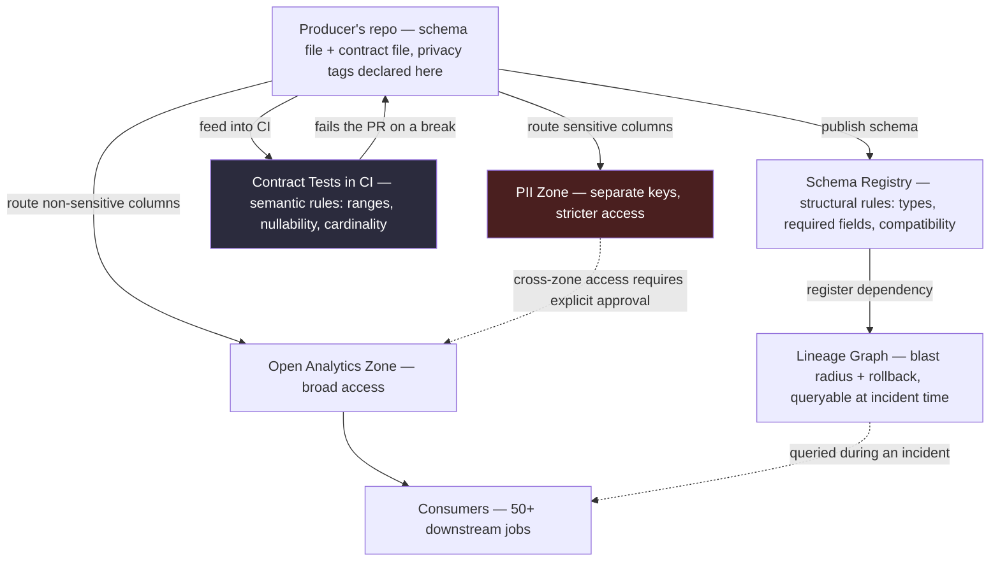

# Chapter 12 — Data Contracts & Governance

> *(Printed as "Chapter Eleven" in the book's own running heads — see the numbering note in
> Chapter 3. This guide follows the outer Table of Contents, so this is "Chapter 12" for citation
> purposes.)*

## The Simple Version, First

Imagine a group project where everyone quietly agreed, at some point, on what a shared
spreadsheet's columns mean. Nobody wrote it down. Then one day, someone on the team decides
"actually, I think this column should hold something slightly different now" — and doesn't tell
anyone. Every other person's part of the project that depended on that column just... quietly
breaks.

**A data contract is just making that unwritten agreement explicit, written down, and
impossible to break by accident.** The whole chapter comes down to this: **every schema your
pipeline reads is already a contract, whether anyone wrote it down or not.** The only real
question is whether someone can break it silently, or whether the system stops them before it ships.

Everything below builds on that one idea.

---

## What You'll Be Able to Say by the End

*(These are the book's own scripted interview lines — say them close to word-for-word.)*

> "A schema is a contract whether I document it or not. The question is only whether the producer
> can break it silently."
>
> "Forward compatibility is the producer's promise; backward compatibility is the consumer's. Mix
> them and you get outages."
>
> "Lineage isn't a compliance checkbox. It's the tool that tells the on-call which table to roll
> back when the Monday dashboard goes red."
>
> "PII at scale isn't a late-stage add-on. Once it touches a pipeline, retrofit costs an order of
> magnitude more than separation at ingest."
>
> "Contract enforcement goes in CI, not in the dashboard. If a contract only breaks when the
> consumer notices, it isn't a contract."

---

## Why Two Teams Who Both "Have Documentation" Get Very Different Outcomes

Picture two data teams at similarly-sized companies. Both have their schemas written down in a
wiki. Both say the right things about "taking schema evolution seriously" at the company all-hands.

**Team A's** contract is a wiki page last edited 18 months ago. **Team B's** contract is an actual
schema file, checked into the producer's code repository, with an automated check that blocks
any change that would break things or accidentally remove a privacy tag.

Six months later, Team A has paged their on-call engineer four times this quarter because of
schema changes breaking things downstream. Team B: zero times.

**The difference isn't the schema — both teams write sensible schemas. The difference is
enforcement.** Team A has "contract as a hope." Team B has "contract as something the code
literally cannot ship without satisfying."

---

## Idea 1: Every Schema Is Already a Contract — the Only Question Is Enforcement

Here's the core reframe of this whole chapter: **you already have contracts, whether you call
them that or not.** The moment a producer team writes data somewhere and a consumer team reads
it, there's an implicit agreement about what the fields mean, which ones can be empty, and which
ones contain sensitive personal information.

The real question was never "should we have contracts?" It was always: **is the agreement
enforced, or can the producer break it without anyone noticing until a downstream dashboard
catches fire?**

**Three properties separate "a contract that actually holds" from "a contract that's just a
suggestion":**

- **The contract lives with the code, not in a wiki.** A schema file checked into the producer's
  own repository, versioned alongside their code, reviewed in their own pull requests. Wiki pages
  drift from reality every week because nothing forces them to stay accurate. A schema file
  checked into version control stays accurate because the producer literally can't merge
  incompatible code without updating it.
- **Compatibility is enforced automatically, before code ships.** A change that adds a required
  field with no default value fails the automated check. A change that renames a field fails. A
  change that quietly removes a privacy tag fails. This isn't a person manually reviewing
  things — it's automated, applied to every single change, and it fails fast enough that the
  producer fixes it before anyone else even sees the change.
- **Violations get caught at the producer's door, not the consumer's.** When a contract breaks,
  the failure should happen the moment the producer tries to ship the change — not at 2 AM when
  someone notices a downstream dashboard looks wrong. Catching it early costs the producer a
  five-minute fix. Catching it late costs the on-call their sleep, the business a degraded
  experience, and often several teams a multi-day investigation.

---

## Idea 2: Every Production Incident Is a Contract Violation Wearing a Disguise

Three common incident stories. Each looks like a different kind of failure at first — but
underneath, each one is the exact same problem: an unenforced contract.

**The silent rename.** A producer renames a field from one name to a slightly cleaner-sounding
name in their next release. The column name change ships quietly on a Thursday afternoon. By
Friday morning, seventeen downstream jobs are failing because they were still looking for the old
name, which no longer exists. The producer never told anyone — but why would they, if nothing
ever asked them to?

**The silent type widening.** A producer changes a numeric ID field from a smaller number type to
a larger one on the source table. The actual values still fit in the smaller type for now, so
nothing looks wrong, and the change ships without anyone noticing a problem. Six months later,
ID values finally grow past what the smaller type can hold. Every downstream system that still
expects the smaller type starts silently overflowing — not crashing, just quietly writing wrong
numbers. The problem surfaces during a routine quarterly audit, months after it started.

**The silent privacy leak.** A producer adds a phone number field to an event stream. Nobody
tags it as sensitive personal information. That event stream feeds into an analytics area the
whole company can read. Two weeks later, someone builds a customer-segment analysis that
happens to include the phone number field in an export. The export gets shared outside the
company. Then come the breach notifications, and then the lawyers.

**All three are contract violations.** All three were invisible to the producer at the moment
they made the change, because their tooling simply didn't treat the schema as something that
could be broken. The fix, in all three cases, follows the same shape: turn the contract into
something the build process actually checks, and route violations back to whoever caused them —
before the change ships, not after.

> **❌ Anti-Pattern**
> Treating a contract as documentation: a wiki page describing the schema, expected nullability,
> and privacy handling. Nobody reads it before shipping a change. Nobody updates it after changing
> the schema. It becomes a historical record of "how things used to work," accurate only up until
> the last time someone bothered to update it. If it isn't enforced automatically before a change
> ships, it isn't a contract — it's a suggestion.

---

## Idea 3: The Contract System Has Three Layers, Not One

A real, working contract system is really three separate layers stacked together — each one
catching a different category of problem the layer before it can't.

### Layer 1 — The schema registry (catches structural problems)

This is the same registry idea from Chapter 8's CDC discussion, doing a broader job here. It
stores schemas by topic or table, with a version history. Producers publish their schema before
shipping data; consumers can fetch it to know what to expect. Compatibility rules — like
"new schema can still read old data" — define what kinds of structural changes are allowed
between versions.

**What the registry catches:** adding a required field with no default value, renaming a field,
changing a field's type in an incompatible way, removing a field consumers still expect.

**What the registry does NOT catch:** a value range changing (a field that used to only allow
positive numbers can now go negative), a field that's never been empty suddenly being allowed to
be empty, the *meaning* of a field changing without its name or type changing, or a privacy tag
silently disappearing (most registries don't even model privacy tags at all).

### Layer 2 — Contract tests in the producer's own CI (catches semantic problems)

A contract test is code that checks properties of the schema beyond just its structural shape —
range checks, "can this be empty" checks, uniqueness checks, privacy-tag checks, and checks
against related tables.

```python
# src/code-examples/ch11/contract_test.py
# Backward-compatibility checker. Runs in the producer's own CI,
# and fails the pull request on any breaking change. Catches what
# a registry misses: dropped privacy tags, required fields added
# without defaults, and meaning-changes hidden behind type-preserving renames.
from dataclasses import dataclass
from typing import List

@dataclass(frozen=True)
class Field:
    name: str
    type: str
    required: bool = False
    has_default: bool = False
    pii: bool = False

def check_backward_compat(old: List[Field], new: List[Field]) -> List[str]:
    errors: List[str] = []
    old_by = {f.name: f for f in old}
    new_by = {f.name: f for f in new}

    for f in new:
        if f.name not in old_by:
            if f.required and not f.has_default:
                errors.append(
                    "BREAKING: required field %r added without default" % f.name
                )

    for f in old:
        nf = new_by.get(f.name)
        if nf is None:
            errors.append("BREAKING: field %r dropped" % f.name)
            continue
        if nf.type != f.type:
            errors.append(
                "BREAKING: field %r type %s -> %s" % (f.name, f.type, nf.type)
            )
        if f.pii and not nf.pii:
            errors.append(
                "BREAKING: field %r lost PII tag (check zone routing)" % f.name
            )
    return errors
```

**The critical design decision is *where* this check runs: in the producer's own CI — not in a
nightly data-quality job, and not in the consumer's pipeline.** The producer's CI is the only
place where a breaking change costs a developer a re-push instead of costing an on-call engineer
a 2 AM page.

A few tool names worth knowing: dbt contracts (the cheapest path if you're already using dbt),
Great Expectations or Soda for general data-quality checks, and plain custom scripts in the
producer's CI for teams juggling many different schema formats. The tooling isn't
sophisticated — the discipline of actually running it on every single producer change is what
matters.

### Layer 3 — Lineage (catches "something slipped through, now what?")

Lineage tracks which downstream tables depend on which upstream tables. It gets used in exactly
two moments:

- **At design time, for impact analysis:** *"I want to change this column. Who reads it?"* A
  lineage lookup returns the list of downstream jobs, dashboards, and machine learning features
  that depend on it — informing whether this change needs a careful deprecation process or can
  just ship normally.
- **At incident time, for rollback scope:** *"This table is wrong. What downstream should I
  pause?"* A lineage lookup returns the full set of consumers, so the on-call can pause and rerun
  things in the right order. Without lineage, the on-call is stuck manually searching through
  code across every repository, hoping they found every reference.

**Both use cases fail the same way if the lineage graph is stale.** If it's built from code that's
been merged but not yet deployed, it's already out of date by the time you need it. **A lineage
graph is an operational tool that must stay fresh, not a documentation deliverable you build once
and forget.**

### Diagram — the three layers, with privacy routing threaded through



### Contract enforcement strategies, side by side

| Strategy | Strengths | Weaknesses | Pick When |
|---|---|---|---|
| **Documentation in a wiki** | Zero infrastructure needed | Enforced only by hope; drifts within a month | Never in production — prototype phase only |
| **Schema registry at the broker** | Structural enforcement on publish | Misses semantic changes, privacy-tag changes, range changes | Event-driven systems using Kafka or similar |
| **Contract tests in producer CI** | Catches structural and semantic changes before merge | Requires producer-side cooperation and CI setup | Any warehouse-first shop with a git-based workflow |
| **Routine validation at ingest** | Catches everything, including bad data that slipped past CI | Adds per-event latency; failure handling needs design | High-stakes pipelines (payments, regulated, safety-critical) |

---

## Idea 4: Handling Sensitive Personal Data — Separate It Early, or Pay 100x Later

Every pipeline that touches user data eventually touches personal information — email, phone
number, address, anything that ties a row back to a real person. The design decision is whether
that sensitive data sits mixed in with regular analytical data, or is kept in its own separate,
more tightly controlled area from the very start.

**Mixed together.** Privacy-sensitive columns sit in the same table as regular analytical
columns. Access control happens at the column level, managed by the warehouse. This is easy to
build and works fine for a while.

**Separated at ingestion.** Sensitive columns get routed into a restricted area with its own
encryption keys and much tighter access controls. Regular columns go into the open analytics
area. Any query that needs to cross between the two requires an explicit approval step.

Three structural patterns handle this separation, in increasing order of cost:

- **Token vault** — sensitive fields get replaced with meaningless tokens at ingestion time; a
  separate, tightly controlled service holds the mapping from token back to the real value.
  Analytics can group and join on the tokens without ever loading the real sensitive value. This
  is the standard pattern at payment companies.
- **Field-level encryption** — sensitive columns get encrypted with a separate key. Cheaper than
  running a full separate vault service, but leakier — the encrypted version still physically sits
  in the analytics area, so key rotation has to be handled carefully.
- **Differential privacy** — statistical noise gets added to results so no individual record can
  be reverse-identified. The right tool for publicly-shared aggregate statistics; overkill for
  internal analytics.

**Why this matters so much:** the "mixed together" approach is cheap at first and expensive
later. The failure mode is an accidentally-shared export — a well-meaning analyst builds a
dashboard that happens to include a sensitive column, and it gets shared outside the company. The
"separated at ingestion" approach costs maybe 5% more compute and an extra week of upfront
architecture — but it makes that entire failure mode *structurally impossible*, because the open
analytics area physically never has the sensitive data to leak in the first place.

**The retrofit cost is where this really hurts.** Once sensitive and regular data have been mixed
together across 200 tables for a year or two, separating them later requires: finding every table
that contains the sensitive data (searching code, interviewing teams — weeks of work),
rebuilding or retiring those tables (months), rebuilding every analytical query that referenced
them (months), and re-verifying every downstream consumer (months). **Typical total cost:
6 to 12 months and $1M to $5M in engineering time.** Doing the separation at ingestion instead
costs roughly one engineer-month. The ratio is roughly 100x.

> **⚠️ War Story**
> A data platform team at a 40-team organization had a schema registry with a solid compatibility
> rule enforced. One week, a producer merged a change that widened a required field from a
> smaller number type to a larger one. By the registry's own rules, this was technically a safe,
> compatible change — old readers can still parse the new, wider values as long as the actual
> numbers still fit in the smaller type. The registry approved it. The automated checks passed.
> It shipped to production. Three months later, a downstream machine-learning feature store that
> converted the field back down to the smaller type started silently overflowing once user IDs
> passed that smaller type's limit. Nobody noticed for six weeks — it surfaced only when a
> quarterly audit flagged that recommendation click-through rates had dropped for a specific range
> of user IDs. The root cause: the ML team's own conversion-back-down logic had never been
> registered as something the contract system needed to track — the registry only knew about the
> producer's side, not the consumer's internal assumptions. The fix was structural: the
> consumer's own expectations became a declared, trackable contract too, not just the producer's.
> Both sides now register their expectations, and the automated check compares against both. The
> lesson: contracts are a two-way promise. The producer promises "new data still works for old
> readers." The consumer promises "my new code still correctly reads old data." Mixing those two
> different promises up is exactly how outages like this happen.

---

## A Real Interview, Walked Through Simply

The classic governance prompt: an organization with existing pipelines, no formal contracts,
many producers and consumers, and a requirement to roll this out without breaking anything
already running. Watch the candidate design a phased rollout and — importantly — catch a flaw in
their own plan partway through.

**Interviewer:** Roll out a data contract system across a 40-team organization without breaking
existing pipelines.

**Candidate:** Three questions first. What do we have today — any contract mechanism already in
place? How are incidents currently distributed — are some teams having schema-related incidents
more often than others? And is there organizational appetite for asking producer teams to do
extra work? Some producer teams will resist being asked to add checks on their side.

**Interviewer:** Schemas are documented in a wiki, inconsistently maintained. Schema changes get
coordinated over chat when someone remembers to. A few teams have ad-hoc checks on their own
repos. Incidents cluster around the teams that consume the most upstream data — platform and
revenue teams get burned most often by upstream changes they didn't know were coming. And yes,
there's executive sponsorship pushing this.

**Candidate:** Good — that tells me who the first consumers of this system should be (the teams
getting burned the most get protection first) and who the first producers should be (whoever feeds
those teams). And the executive sponsorship is critical — without it, producer teams won't
prioritize work their consumers are asking for.

I'd roll this out in three phases over roughly 9 to 12 months.

**Phase 1 — dogfooding (weeks 1–6).** The platform team builds the registry, the automated
checker, and the lineage service — and applies it to their own tables first, to validate the
tooling and write the runbook before asking anyone else to adopt it.

**Phase 2 — lighthouse teams (months 2–5).** Recruit the five producer teams whose downstream
pipelines cause the most pain. They integrate the automated checker, ship schema changes through
the registry, and tag their sensitive fields. We'd track their incident rate before and after —
that comparison becomes the case for wider adoption.

**Phase 3 — organization-wide (months 6–12).** Progressive rollout to the remaining 35 teams,
prioritized by incident history, with enforcement tiered by how critical each table is — the
most critical tables block shipping on any break, less critical ones just warn.

*(pauses)*

Actually, let me revise that Phase 3 tiering plan. Asking 40 teams to self-label their own tables
as "most critical" versus "less critical" turns into a political negotiation that takes months —
every team will call their own table the most important one. A better approach: default
everything to a middle tier at first, then use actual usage data — how often a table is read, how
many downstream jobs depend on it, whether it feeds a revenue dashboard, whether it contains
sensitive data — to automatically promote tables to the strictest tier based on objective signals.
Tables that go untouched for 60+ days automatically get demoted to the lowest tier. Let the data
decide the tier, not each team's own self-assessment. That turns Phase 3 from a political exercise
into an operational one, and the tooling to compute it already exists once we have the lineage
graph in place.

**Interviewer:** What about existing schemas — how do you handle the initial "here's where we
currently stand"?

**Candidate:** Scan and seed. For each producer joining the system, auto-generate their initial
contract from their *current* schema — types, nullability, field names as they exist today. The
producer reviews it, tags anything sensitive, and merges that as their starting contract. From
that point on, every schema change is a pull request against the contract. The starting point
reflects reality as it already is; only future changes get gated.

**Interviewer:** What if a producer team just doesn't cooperate — they never add the check?

**Candidate:** Two levers. The positive one: their consumers get visibly better incident metrics
once producers adopt contracts, which executives can point to as justification for the producer's
effort. The firmer one: after a deadline, unenforced producer feeds get tagged as
"no contract — read at your own risk," and consumers are encouraged to flag that in their own
pipeline's quality reporting. Most teams move once that tag starts showing up on executive
dashboards.

**Interviewer:** What about sensitive personal data specifically?

**Candidate:** That's the subtle one. If sensitive data is already mixed in with regular data
across the existing tables, separating it is its own 6-to-12-month project — not something that
happens as part of this contract rollout. I'd scope it separately: the new contract system tags
sensitive fields from day one for anything new, while existing sensitive data gets its own
year-long remediation track. Trying to do both the contract rollout and a full privacy separation
project at the same time is too much organizational change to absorb at once.

**Interviewer:** What breaks first?

**Candidate:** Lineage freshness. If the lineage graph is built from deployed code and dbt
project files, it lags behind actual deployments. At incident time, if that lineage is even two
days stale, the on-call will trust it and miss a downstream consumer. Investing in keeping lineage
fresh — refreshing on every deploy, daily audits, alerting on unexpected gaps — pays for itself by
the third real incident.

---

## Common Mistakes People Make

1. **Treating a contract as documentation.** A wiki page is not a contract. If a producer can
   break it silently, it was never actually enforced.
2. **Having a schema registry with no automated testing layer.** The registry catches structural
   breaks on publish — it doesn't catch what proper contract tests would catch (semantic changes,
   privacy-tag drops, cross-table consistency).
3. **Letting lineage go stale.** A graph that lags behind actual deployments is a graph that fails
   exactly when you need it most, during an incident. Freshness is an operational requirement, not
   a nice-to-have feature.
4. **Waiting to separate sensitive data.** Trying to separate it after 18 months of it being mixed
   in costs roughly 100x what separating it from the start would have. That decision gets made on
   day one, whether anyone realizes it or not.
5. **Using one enforcement level for 200 different tables.** Either too strict (teams start
   working around the friction) or too lax (serious incidents still happen). Tier enforcement by
   how critical each table actually is.

---

## The Big Ideas, One Line Each

1. **Every schema you read is already a contract.** The only real question is whether it's
   enforced.
2. **Enforce where the change is made — the producer's own build process — not where it's
   noticed.** Catching a break there costs minutes; catching it downstream costs an incident.
3. **A real contract system has three layers: structural rules, semantic tests, and lineage.**
   Any one layer alone only catches part of the problem.
4. **Separate sensitive personal data at ingestion, not later.** The retrofit cost is roughly
   100x higher than doing it from the start.
5. **Tier your enforcement by how critical each table actually is.** One-size-fits-all either
   creates too much friction or misses real incidents.

---

## Cheat Sheet

**The three layers of the contract system**
- **Schema Registry** — structural rules (types, required fields, compatibility mode)
- **Contract tests in CI** — semantic rules (ranges, nullability, privacy tags, cross-table
  consistency)
- **Lineage graph** — blast-radius analysis during incidents; impact analysis at design time

**Compatibility, in two directions**
- **Forward** — the producer's promise: new data can still be read by old consumers
- **Backward** — the consumer's promise: new consumer code can still correctly read old data
- Mixing these two up is exactly how subtle outages happen

**Enforcement tiers**
- **Highest tier** — automated checks block any breaking change; validated at ingestion too;
  lineage audited weekly
- **Middle tier** — automated checks block breaking changes; lineage audited monthly
- **Lowest tier** — automated checks warn but don't block; lineage available on demand

**The PII principle**
Separate sensitive data at ingestion. Retrofitting later costs roughly 100x more than separating
it up front — one engineer-month now, versus a year and millions of dollars later.

**PII separation patterns**
- **Token vault** — the standard for payments and regulated industries; analytics only ever sees
  tokens
- **Field-level encryption** — a reasonable compromise when a full vault isn't feasible; watch key
  rotation carefully
- **Differential privacy** — for publicly-published aggregate statistics; deliberately noisy by
  design

**Four kinds of breaks a schema registry alone won't catch**
- Value-range changes (type stays the same, allowed values change)
- Silent nullability changes (a field that was never empty starts being empty)
- Meaning changes (same name, same type, different real-world meaning)
- Privacy-tag drops (sensitive data quietly crosses into an open area)

**Three lines worth memorizing**
- "Contracts are build artifacts, not wiki pages."
- "Enforce at the producer's CI, not at the consumer's dashboard."
- "Separate PII at ingestion. The retrofit ratio is 100x."

---

## Further Reading

- **Data Contracts.** Andrew Jones. O'Reilly, 2023. The book-length treatment of contracts as
  build artifacts, including rollout playbooks for organizations from 10 to 1000+ engineers.
- **"The Rise of Data Contracts."** Chad Sanderson. dataproducts.substack.com, 2022 onward.
  Practitioner essays on why contracts matter, with case studies from teams that implemented them
  and teams that didn't.
- **"Consumer-Driven Contracts: A Service Evolution Pattern."** Ian Robinson and Martin Fowler.
  martinfowler.com, 2006. The essay that named the consumer-driven contract pattern for services —
  data contracts bring this same idea into data engineering.

---

## A Couple of Extra Ideas (From the Older 2025 Edition)

- **Where contracts actually live in the pipeline lifecycle:** the schema gets defined and
  generated (often from Protobuf or Avro) before code is written, published to a registry that
  rejects incompatible versions automatically, validated again at the ingestion layer (since even
  a compatible schema doesn't guarantee the *actual data* follows the rules), and finally enforced
  downstream through tools like dbt tests or Great Expectations — where a contract's guarantee
  turns a downstream test from "defensive, just in case" into "assertive, because we know this
  holds."
- **What a breaking change actually looks like in practice, beyond the tooling:** dual-writing
  both the old and new version of a field for a full release cycle, communicating the change
  ahead of time, coordinating separately with machine-learning teams (whose feature stores often
  break silently on a missing field) and BI teams (whose semantic layers may need remapping) — this
  coordination work is largely invisible until it's skipped, and then it becomes very visible.
- **Real incident examples worth knowing:** a payments system that changed an amount field from
  integer cents to a floating-point dollar value doubled revenue on dashboards overnight; a
  ride-sharing app sent empty route data for six hours, causing pricing models to miscalculate and
  overpay drivers; an e-commerce platform started receiving null currency codes from a vendor,
  causing a currency-conversion pipeline to silently default to the wrong currency and skew
  revenue figures. None of these were prevented by contracts — but in each case, a proper contract
  system would have turned "silent corruption discovered days later" into "a visible, immediate
  violation caught in minutes."
