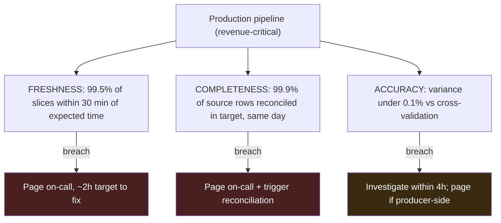

# Chapter 13 — Reliability & Operations

> *(Printed as "Chapter Twelve" in the book's own running heads — see the numbering note in
> Chapter 3. This guide follows the outer Table of Contents, so this is "Chapter 13" for citation
> purposes.)*

## The Simple Version, First

Imagine two security guards watching the same building overnight. One only checks "is the front
door locked?" The other checks the front door, *and* walks the halls checking that nothing's
missing, *and* checks that the safe's contents actually match what's on the inventory sheet.

Both guards can honestly say "everything looked fine" at the end of their shift. But only one of
them would actually notice if something valuable quietly went missing from inside the building
while the doors stayed locked the whole time.

**That's the whole chapter.** For a data pipeline, "is it running?" (uptime) is the equivalent of
"is the door locked?" It tells you almost nothing about whether the data flowing through that
pipeline is actually complete and correct. A pipeline can look perfectly healthy — every job
green, every step succeeding — while quietly losing data or silently computing wrong numbers for
months. **Real reliability for a data system means watching three separate things, not one.**

---

## What You'll Be Able to Say by the End

*(These are the book's own scripted interview lines — say them close to word-for-word.)*

> "Freshness, completeness, and accuracy are the three SLOs that matter. Alerting on uptime alone
> is how incidents stay invisible."
>
> "A good on-call runbook is written for someone who doesn't know why this DAG exists. If the
> runbook says 'page the owner,' it isn't a runbook."
>
> "Post-mortems for DE incidents are usually about drift, not failure. The dimension I designed
> around moved, and the system noticed three weeks late."
>
> "Chaos engineering for pipelines is 'inject bad data' plus 'delay the upstream.' The failure
> modes I catch this way are the ones production doesn't."
>
> "MTTR for data incidents is detection + diagnosis + rerun + reconcile. Detection is usually the
> long pole, and it's the easiest to fix."

---

## Why "Everything's Green" Can Still Mean Something Is Badly Wrong

Two data platforms at similar-sized payment companies run side by side. Both use the same
tools. Both have on-call rotations. Both show reliability dashboards to leadership.

**Team A's** dashboard shows 99.98% uptime for the whole quarter. The rotation is quiet.
Leadership is happy.

**Team B's** dashboard shows that same 99.98% uptime, plus three more numbers: 99.4% freshness,
99.2% completeness, 99.7% accuracy. Team B got paged three times this quarter for completeness
problems, twice for accuracy drift, once for a freshness miss. Leadership was sometimes unhappy
about that.

**Six months in, the finance team notices something:** monthly revenue in the data warehouse
doesn't match the real transaction totals. An audit reveals **Team A's pipeline had been silently
losing 4% of events for three months.** A bug on the producer side was quietly dropping records
for one specific category. Through all of it, the pipeline stayed green on uptime — nothing
crashed, nothing failed — because the missing data never triggered any alert. There was no alert
built to notice something was *missing*, only alerts for something being *down*.

**Team B caught the same class of bug in its second week**, because their completeness check
fired the moment the row counts between source and destination started diverging by more than a
small threshold.

**Uptime is a promise about the box being on. It says nothing about whether the data inside is
actually right.**

---

## Idea 1: Three Separate Promises, Not One

A more useful way to think about data reliability is with three separate, numeric targets — each
measured on its own, alerted on its own, and reported on its own:

- **Freshness — did the data arrive on time?** Measured per data slice: *"99.5% of daily slices
  land within 30 minutes of when we expect them."* When this breaks, it's usually something
  upstream running late, or the schedule itself getting stuck.
- **Completeness — is all of the data actually present?** Measured by comparing counts against
  the original source: *"the destination's row count stays within 0.1% of the source's row
  count, same day."* This is how the 4%-silent-loss bug above would have been caught almost
  immediately.
- **Accuracy — do the actual values match?** This is the sneakiest one, because completeness can
  look perfect (right number of rows!) while the *values* inside those rows are wrong. Measured
  by comparing a summary calculation computed two different ways — from the source, and from the
  destination — and checking they agree: *"the total in the warehouse stays within 0.1% of the
  total in the original system, for yesterday's data."*

**These three can fail completely independently of each other.** A pipeline can be 100% up, 100%
on time, and still be quietly missing 4% of its data. Watching only uptime, that pipeline looks
perfectly fine. Watching all three, the missing 4% gets caught.

### Three ways this stays invisible to uptime-only monitoring

- **Silent data loss.** Every job runs, every step succeeds, everything looks green — but
  somewhere along the way, a filter condition, a producer-side bug, or a silently-skipped chunk
  of data means some percentage of rows never make it to the destination. Nothing crashed. Nothing
  alerts.
- **Silent value drift.** All the rows arrive. The counts match perfectly. But somewhere upstream,
  the *meaning* of a field quietly changed — currency units shifted from cents to dollars, or a
  timestamp changed from one timezone convention to another — without the actual data type
  changing. Everything downstream is now off by a predictable multiple, and nothing about the row
  counts would ever reveal it.
- **Silent freshness creep.** Every single day the pipeline lands its data — just each day, 10
  minutes later than the day before. After a month, the data is arriving five hours late, and a
  dashboard meant to refresh by 5 AM is actually refreshing by 10 AM. No single day is late enough
  to trip a same-day threshold, so nothing fires — the drift only becomes visible if you're
  tracking the trend over a week or more, not just checking "was today late?"

> **❌ Anti-Pattern**
> Uptime-only alerting on a data pipeline. It catches process crashes and nothing else. The
> incidents that actually matter for a data platform — silent data loss, accuracy drift, freshness
> creep — produce no process-level signal at all. Uptime is necessary, but nowhere near
> sufficient. If your entire reliability story starts and ends with "the pipeline is up," you
> don't actually have a reliability story yet.

> **🚩 FAANG Signal**
> When you say "SLO" in a data engineering interview, the interviewer's next question is almost
> always "which three?" The answer is freshness, completeness, and accuracy — with a specific
> numeric threshold for each. Not "we have SLOs." Not "we monitor the pipeline." The specific
> three, with specific numbers, is what signals you've actually operated a data platform.

### Three ways to check completeness, from cheap to expensive

| Approach | What it does | Cost | Use it for |
|---|---|---|---|
| **Aggregate count + total** | Compares a single row count and a single sum on each side | Cheapest | Catching a whole missing day, or a broken filter |
| **Sampled row-level match** | Joins a small sample (say, 1%) by unique ID and compares every field | Moderate | Catching row-level mismatches that aggregates can hide |
| **Full row-level comparison** | Every row on one side checked against every row on the other | Most expensive | Regulated data (financial close, audits) where any mismatch matters |

Most healthy platforms run all three at different frequencies: the cheap aggregate check on every
run, the sampled check weekly, and the expensive full comparison only during a quarterly audit
window.

```sql
-- src/code-examples/ch12/slo_reconciliation.sql
-- Three SLOs in one query, run daily on the previous day's data.
-- Alerting fires from any row that violates its threshold.
WITH partition_timing AS (
    SELECT event_date, MAX(ingested_at) AS last_ingest_ts
    FROM warehouse.revenue_events
    WHERE event_date = CURRENT_DATE - INTERVAL '1' DAY
    GROUP BY event_date
),
row_counts AS (
    SELECT
        (SELECT COUNT(*) FROM warehouse.revenue_events
         WHERE event_date = CURRENT_DATE - INTERVAL '1' DAY) AS target_rows,
        (SELECT COUNT(*) FROM source.revenue_events_mirror
         WHERE event_date = CURRENT_DATE - INTERVAL '1' DAY) AS source_rows
),
accuracy_check AS (
    SELECT
        (SELECT SUM(amount) FROM warehouse.revenue_events
         WHERE event_date = CURRENT_DATE - INTERVAL '1' DAY) AS target_total,
        (SELECT SUM(amount) FROM source.revenue_events_mirror
         WHERE event_date = CURRENT_DATE - INTERVAL '1' DAY) AS source_total
)
SELECT
    DATE_DIFF('minute', TIMESTAMP '2024-01-01 05:00:00', pt.last_ingest_ts)
        AS freshness_minutes_late,
    ROUND(100.0 * rc.target_rows / NULLIF(rc.source_rows, 0), 3)
        AS completeness_pct,
    ROUND(100.0 * ABS(ac.target_total - ac.source_total)
        / NULLIF(ac.source_total, 0), 3) AS accuracy_variance_pct
FROM partition_timing pt
CROSS JOIN row_counts rc
CROSS JOIN accuracy_check ac;
```

### Diagram — the three-track SLO dashboard



Each track has its own threshold and its own alert route. Uptime-only alerting — the thing this
whole chapter exists to move past — produces a dashboard that stays green while a pipeline
quietly loses a meaningful percentage of its data for months.

---

## Idea 2: A Good Runbook Is Written for the Person Who's Never Seen This Before

A **runbook** is the document an on-call engineer reads the moment they get paged. A good one has
two properties: **it works when the on-call person is tired, and it works when the on-call person
didn't build the system they're now debugging.**

Every runbook needs five things:

1. **What this alert means**, in one plain sentence.
2. **The first three things to check**, with the exact commands to run, in order.
3. **A list of common causes**, each paired with its fix.
4. **Who to escalate to by name**, with a clear time limit before escalating (e.g., "if unresolved
   in 30 minutes, page X").
5. **A pre-written message** to send to the people who need to know (finance, the pipeline
   owner, etc.) — so nobody has to compose that message while stressed at 2 AM.

> **❌ Anti-Pattern**
> A "runbook" whose only instruction is "page the owner." That's not a runbook — it's a phone
> number. The whole point of a runbook is that someone who *isn't* the owner can still resolve
> the issue using it.

> **✅ Say this out loud**
> "A good on-call runbook is written for someone who doesn't know why this DAG exists. If the
> runbook says 'page the owner,' it isn't a runbook."

---

## Idea 3: Most Data Incidents Are About Something Drifting, Not Something Breaking

When something crashes outright, it's usually easy to notice and easy to explain. **The much more
common — and much more dangerous — pattern in data systems is drift**: something changes slowly
and quietly, stays completely invisible for a while, and only gets discovered much later, usually
by someone downstream noticing a number looks wrong.

Because of this, a post-mortem for a data incident should really be framed as a **drift
analysis**, asking three specific questions:

1. **What actually drifted?** (a filter condition, a meaning of a field, a schedule's timing)
2. **Why didn't we detect it the moment it started?** (this is almost always the real story)
3. **What closes that detection gap** — not just "what's the immediate fix," but "how do we
   notice this category of problem faster next time?"

> **⚠️ War Story**
> During a quarterly compliance audit, a finance team noticed that monthly revenue in the
> warehouse differed from the original transaction totals by about 4%. The investigation found a
> producer-side bug: for one specific merchant category, events with a particular status code
> were being silently dropped before ever being published. The bug had been live in production for
> three months. The post-mortem asked the three drift questions: What drifted? A filter condition
> had changed during an unrelated code refactor, and the new filter excluded a status code that
> used to be included. Why wasn't it detected? The only alerting that existed was uptime-based —
> there was no reconciliation, no accuracy check at all. What closes the gap? The team added the
> three-SLO dashboard across every revenue-critical pipeline, plus a quarterly accuracy audit as a
> standing scheduled job. Six months later, a similar producer-side bug introduced a much smaller
> 0.3% discrepancy — but this time the accuracy check fired within 24 hours. Total exposure was
> one day instead of three months. The investment paid for itself roughly 90 times over, counting
> just that one incident.

> **✅ Say this out loud**
> "Post-mortems for DE incidents are usually about drift, not failure. The dimension I designed
> around moved, and the system noticed three weeks late."

---

## Idea 4: Practice Breaking Things on Purpose, Before Production Does It for You

**Chaos engineering** for a data pipeline is much simpler than it sounds — it comes down to two
moves, done deliberately and on a schedule (say, quarterly) rather than waiting for them to happen
by accident:

- **Inject bad data on purpose.** A malformed field, an out-of-range value, an unexpected null, a
  wrong data type. Does it get quarantined somewhere reviewable (often called a "dead-letter
  queue" — a holding area for records the pipeline can't process), or does it silently corrupt
  something downstream?
- **Delay an upstream dependency on purpose.** Hold back an upstream pipeline's completion by 30
  minutes, an hour, two hours. Does the downstream system time out gracefully and alert the right
  person, or does it silently produce a result based on stale or incomplete data without telling
  anyone?

**These two moves alone catch roughly 80% of the failure modes a data team will actually hit in
production.** The remaining 20% are usually genuinely novel and not worth trying to predict in
advance — but running these two kinds of drills regularly, measuring how long it takes to notice
and recover, and feeding what's learned back into the runbooks is what keeps the other 80% from
turning into real incidents.

> **❌ Anti-Pattern**
> Borrowing chaos-engineering tools built for web services (randomly killing servers, simulating
> network partitions) and pointing them at a data pipeline. Those tools are shaped for the wrong
> kind of failure. A data pipeline's real failure modes are bad data and slow upstreams — not
> crashed processes.

---

## A Real Interview, Walked Through Simply

The classic reliability prompt: a specific business-critical pipeline, a specific recovery-time
target, a specific team size. Watch the candidate name the three SLOs with real numbers, write out
the runbook contract, and break the recovery target into a named budget — then catch their own
gap in reasoning mid-answer.

**Interviewer:** Write the on-call runbook and SLO agreement for a critical revenue pipeline. A
2-hour recovery target.

**Candidate:** Three questions first. At a high level, what does this pipeline actually do — is
it reporting, financial settlement, fraud scoring, something else? What's the current state — any
existing monitoring or runbook already? And how big and how senior is the on-call rotation?

**Interviewer:** Daily revenue roll-up from the transaction system into the warehouse, feeding
three finance dashboards and the quarterly auditor's report. Uptime monitoring only, no runbook.
Six engineers rotating weekly — two senior, four mid-level.

**Candidate:** Good — high-stakes finance and audit means accuracy matters more than freshness
within reasonable bounds. And the runbook has to work for a mid-level engineer on a Sunday, not
just the senior person who originally built the pipeline.

Here's the SLO agreement, three tracks. **Freshness:** 99.5% of daily data lands within 30 minutes
of the expected completion time; a breach pages on-call, and the first check is the scheduler's
logs for failed tasks. **Completeness:** target row count within 0.1% of source row count,
reconciled daily; a breach pages on-call with the reconciliation difference attached, and the
first check is the producer-side event volume dashboard. **Accuracy:** total-value variance under
0.1% versus the source total for yesterday's data; a breach gets investigated (not immediately
paged) within 4 hours, escalating to a page only if variance exceeds 1%, and the first check is
whether there's a batch of late-arriving records.

For the 2-hour recovery target: 15 minutes to detect (the alert fires and gets acknowledged), 30
minutes to diagnose (walking the runbook's checks), 45 minutes to rerun (a partition-aware
backfill, safely repeatable), and 30 minutes to reconcile (re-running the three-SLO check to
confirm everything passes, then notifying the finance dashboard team).

**Interviewer:** What breaks first?

**Candidate:** Reconciliation cost. Running a full exact count against the live transaction system
every morning adds real load to production. I'd sample instead — reconcile 1% of rows exactly
(joined by unique ID, comparing every field), plus a full aggregate count and total on top. The
sample catches row-level drift; the aggregate catches whole-scale loss. That cuts cost by roughly
two orders of magnitude, at a cost of maybe 10% less detection sensitivity.

*(pauses)*

Actually — for a revenue pipeline that feeds the quarterly auditor's report specifically, a 10%
sensitivity loss isn't acceptable. Let me restructure that: daily aggregate count and total
(cheap, catches whole-scale loss), a weekly 1% row-level sample (moderate cost, catches drift),
and a full row-by-row comparison timed to the quarterly close window (expensive, but the auditors
expect it, so that load is pre-approved specifically for that window). That's three tiers of
checking stacked on the same three SLOs, and it maps the cost to the actual regulatory calendar
instead of spreading it evenly across the year.

**Interviewer:** How do you know the thresholds themselves are the right ones?

**Candidate:** Start from the last 30 days of actual behavior. The freshness threshold is roughly
the slowest-but-still-normal completion time, plus a safety margin. The completeness threshold is
the largest normal source-versus-target gap ever observed, plus a margin. Recalibrate these
quarterly as the pipeline's normal behavior shifts — threshold tuning is an ongoing operational
habit, not a one-time decision you set and forget.

---

## Common Mistakes People Make

1. **Treating uptime as the whole reliability story.** Green uptime with 4% silent data loss is
   the default failure mode of a data platform that hasn't gone through this exercise yet.
2. **Tracking data quality as one single number.** "Data freshness" as one score, or "data
   quality" as one score. The three tracks fail independently — they each need their own alert.
3. **A runbook that just says "page the owner."** Not a runbook. A real one names the escalation
   path, the exact commands to run, the likely causes, and a pre-written message template.
4. **Writing a post-mortem as a failure timeline instead of a drift analysis.** Most data
   incidents aren't about something crashing — they're about the detection gap that let a slow
   drift run for weeks.
5. **Never practicing failure on purpose.** The failure mode production actually hits is usually
   one nobody rehearsed. A quarterly practice drill catches most of them ahead of time.

---

## The Big Ideas, One Line Each

1. **Uptime tells you the box is on. It tells you nothing about whether the data is right.**
2. **Track freshness, completeness, and accuracy separately — each with its own number and its
   own alert.**
3. **A runbook should work for someone who's never seen this system before.** If it just says
   "page the owner," it isn't one yet.
4. **Most data incidents are drift, not crashes.** Post-mortems should ask what drifted and why it
   wasn't caught sooner.
5. **Practice injecting bad data and delaying upstreams on purpose**, before production does it
   to you unannounced.

---

## Cheat Sheet

**The one-sentence version**
Uptime alone hides the incidents that actually matter for a data platform — watch freshness,
completeness, and accuracy separately.

**Three data SLOs**
- **Freshness** — 99.5% of daily slices within 30 min of expected time
- **Completeness** — target row count within 0.1% of source
- **Accuracy** — total-value variance under 0.1% vs. a cross-validation check

**Reconciliation strategy, cheap to expensive**
1. Aggregate count + total — cheap, catches whole-scale loss
2. Sampled row-level match (~1%) — moderate, catches row-level drift
3. Full row-level comparison — expensive, required for audits

**MTTR (recovery time) budget**
```
recovery time = detection + diagnosis + rerun + reconcile
```
Example for a 2-hour target: 15 + 30 + 45 + 30 = 120 minutes. Each phase gets a named budget.

**Runbook template**
1. What the alert means, one sentence
2. First three checks, with exact commands
3. Common causes, each with a fix
4. Named escalation with a time limit
5. Pre-written message to send to stakeholders

**Post-mortem as drift analysis**
1. What actually drifted?
2. Why wasn't it caught when it started?
3. What closes the detection gap (not just the immediate fix)?

**Chaos engineering, two moves**
- Inject bad data (malformed fields, out-of-range values, wrong types)
- Delay an upstream dependency (30 min, 1h, 2h)
- Run quarterly, feed results back into runbooks and thresholds

**Three lines worth memorizing**
- "Freshness, completeness, accuracy. Three SLOs, three thresholds, three alert routes."
- "Write runbooks for someone who doesn't know the system."
- "Post-mortems are drift analysis, not failure analysis."

---

## Further Reading

- **Site Reliability Engineering (the "SRE Book").** Google, 2016. The foundational treatment of
  SLOs, error budgets, and post-mortem practice — read chapters 3 through 5, translating the
  service-side framing to data manually as you read.
- **"Blameless PostMortems and a Just Culture."** John Allspaw. Etsy engineering blog, 2012. The
  short essay that named the blameless-postmortem practice — required reading for anyone who runs
  on-call.
- **"The Data Reliability Engineering Playbook."** Monte Carlo blog, 2021 onward. A clear
  practitioner writeup on applying SRE concepts to data systems specifically.

---

## A Couple of Extra Ideas (From the Older 2025 Edition)

- **Managed vs. build-your-own observability:** managed platforms (Monte Carlo, Bigeye, Anomalo,
  Metaplane, among others) sell anomaly detection plus SLO tracking on top of your warehouse.
  Below roughly 20 pipelines, a custom three-SLO query plus a simple alert webhook is usually
  cheaper than any platform subscription. Past around 100 pipelines, the custom approach becomes
  its own product that a team ends up maintaining, and buying often becomes the more sensible
  option.
- **Spot/interruptible compute as accidental chaos testing:** teams that run fault-tolerant
  workloads (batch ETL, backfills, compaction) on cheaper, interruptible compute instances often
  end up with *more* resilient pipelines, not less — because random interruptions force real
  answers to "can this safely resume from where it left off?" long before a real incident does.
  The questions worth asking in any design review: does this workload checkpoint its progress?
  Does it write atomically? Can it resume cleanly if interrupted? Answering yes to all three is
  what makes a workload safe to run on cheaper, less-guaranteed compute.
