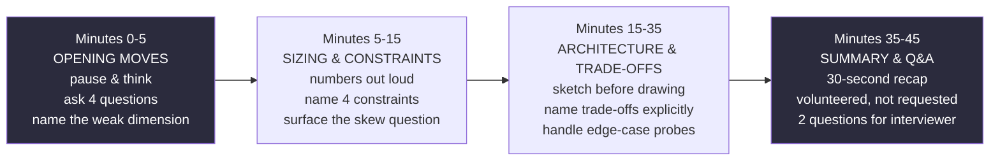

# Chapter 15 — The DE Interview Playbook

> *(Printed as "Chapter Fourteen" in the book's own running heads — see the numbering note in
> Chapter 3. This guide follows the outer Table of Contents, so this is "Chapter 15" for citation
> purposes.)*

## The Simple Version, First

Imagine two people auditioning for the same orchestra seat. Both can technically play every note
in the piece perfectly. But one of them walks on stage, takes a breath, checks in with the
conductor, and plays with real timing and awareness of the room. The other launches straight into
the notes, technically correct, but never once looks up.

**A system design interview is a 45-minute performance, not a technical quiz.** Two candidates
with identical experience, who would design nearly identical systems on a whiteboard, can walk
out with completely different outcomes — because the interviewer isn't only scoring the final
diagram. They're scoring *how you got there*: whether you asked before answering, whether you
named what you were giving up, and whether you closed strong. This chapter is about that
performance, not about learning new technical material — everything technical already lives in
the earlier chapters.

---

## What You'll Be Able to Say by the End

*(These are the book's own scripted interview lines — say them close to word-for-word.)*

> "Opening moves matter. Ask for constraints, size on a napkin, name the weak dimension, sketch
> before drawing. Every senior candidate does all four; most juniors do none."
>
> "Clarifying questions aren't a delay tactic. They're the first signal I send, and a good
> question beats any answer."
>
> "Presenting under time pressure is a skill. I practice the 30-second summary at the end: what
> I'd build, what I'd sacrifice, what I'd watch."
>
> "The 'edge case' question is rhetorical. The interviewer wants to know whether I already thought
> about the edge; solving it matters more than the answer itself."
>
> "Three signals I send by how I allocate the 45 minutes: systems thinking, trade-off naming,
> operational instinct. Content is the fourth signal, and often the one that separates candidates
> least."

---

## Why Two Equally Skilled Candidates Got Completely Different Outcomes

Two candidates with identical backgrounds — same years of experience, same kinds of systems
shipped, same technical depth — walk into the same interview and hear the same prompt: "Design a
real-time analytics platform."

**Candidate A** nods and starts drawing immediately. A streaming tool on the left, a processing
engine in the middle, a storage format on the right. Fifteen minutes in, the interviewer
interrupts: "What's the throughput?" Candidate A says, "It's scalable."

**Candidate B** hears the exact same prompt and, in the first two minutes, asks four questions:
"What's the peak throughput? What's the freshness requirement? Who are the consumers? What
service tier does this need to meet?" *Then* Candidate B sizes the problem on a napkin, names tail
latency as the dimension most likely to break — because the prompt said "real-time" — and only
then starts drawing.

**Both candidates end up with fairly similar final architectures.** Candidate A gets a "no hire."
Candidate B gets an offer.

**The difference isn't the architecture. It's that the interviewer was scoring four different
signals, and three of them have nothing to do with what ends up on the whiteboard:**

- **Systems thinking** — do you reason about the problem in terms of datasets, requirements, and
  trade-offs, or in terms of tool names and boxes on a diagram? The first is how a senior engineer
  thinks; the second is how a more junior engineer thinks.
- **Trade-off naming** — when you pick one thing, do you say what you're giving up? Picking one
  tool over another without naming the cost is a surface-level choice. Picking a tool *and*
  explicitly naming what you're sacrificing by not choosing the alternative is what signals real
  experience.
- **Operational instinct** — do you think about what breaks in production, how you'd find out, and
  how you'd recover? A candidate who never mentions what they'd actually alert on is signaling
  they've never operated something like what they just designed.
- **Content** — the architecture itself. It's necessary, but it's actually the *weakest* of the
  four signals, because most experienced candidates end up drawing fairly similar architectures
  for similar prompts. What actually separates candidates is the first three.

---

## Idea 1: The Interview Has Four Phases, Each With Its Own Budget

A 45-minute interview isn't one long undifferentiated conversation — it has a clear internal
structure, and each phase rewards specific, visible moves.

### Diagram — the 45-minute timeline

**A candidate who asks clarifying questions in minute 1 and lands a 30-second summary in minute 42
has already scored half the interview before the architecture even matters.**

---

## Idea 2: Phase 1 — The Opening Moves (Minutes 0–5)

The interviewer delivers the prompt. A strong candidate does three specific things, in order, in
the first five minutes.

**1. Pause and think — visibly.** Take 10 to 20 seconds. "Okay, let me process this." Silence
here is a signal that you're thinking, not panicking. A candidate who leaps straight into an
answer signals they're pattern-matching to something they've seen before, not actually reasoning
through *this* specific prompt.

**2. Ask four clarifying questions.** Not two, not eight — four covers the common ground almost
every prompt needs:

1. "What's the throughput or volume — peak and average?"
2. "What's the freshness or SLA expectation — sub-second, seconds, minutes, hours?"
3. "Who are the consumers — dashboards, machine learning, other systems, humans directly?"
4. "What's the scale dimension that matters most: latency, cost, correctness, or availability?"

These four questions together map the prompt onto the same four-constraint framework from earlier
chapters. The interviewer's answers give you the actual shape of the problem — you're not just
buying time, you're gathering the specific numbers you'll need in Phase 2.

**3. State the weak dimension out loud.** From the answers, pick one of the five scaling
dimensions and say which one you expect to break first. *"Given the sub-minute freshness and the
read-heavy pattern, I'd expect tail latency to be the weak dimension."* You might be wrong —
that's fine, the interviewer will correct you and you adjust. But saying it out loud signals you
know there *are* multiple dimensions, and that you've already picked the one that matters most for
this specific prompt.

> **❌ Anti-Pattern**
> Treating the interview as a technical quiz. Content is one of four signals, and at the senior
> level it's the one that separates candidates least. A candidate who gives a flawless
> architecture but asks no clarifying questions, sizes nothing, names no trade-offs, and runs out
> of time before summarizing will lose to a candidate with a slightly weaker architecture who
> lands the other three signals well.

---

## Idea 3: Phase 2 — Sizing and Constraints (Minutes 5–15)

With the prompt clarified, the next move is numbers.

**Size on a napkin, visibly.** Write it on the whiteboard: events per second times bytes per
event times replication, storage budget over retention, fan-out. Say the math out loud. The math
doesn't need to be precise — it needs to be *named*. A candidate who says "around 2 MB per second
sustained" and shows the arithmetic has signaled they reach for numbers before reaching for tools.

**Keep a handful of latency reference numbers in your head as a sanity check** (roughly: L1 cache
0.5 nanoseconds, main memory 100 nanoseconds, a same-datacenter round trip 0.5 milliseconds, an
SSD random read 0.1 milliseconds, a cross-continent round trip 150 milliseconds). You don't recite
these — you use them to catch a design that implies something physically impossible, like a
10-millisecond SLA that has to cross continents.

**Name the four constraints from earlier in the book** — batch SLA, streaming freshness, schema
compatibility, cost ceiling — and walk the interviewer through which ones actually matter for this
specific prompt. You don't need to ask about all four; you need to *acknowledge* them.
*"The batch SLA isn't really relevant here since everything's real-time; stream freshness is one
minute; schema is controlled by us; cost is unbounded for this prototype."*

**Surface the skew question.** If the prompt involves users, merchants, tenants, or any other kind
of key, ask how volume spreads across them. *"Is the volume uniform across users, or long-tailed?"*
Real traffic is almost always long-tailed. Assuming uniform distribution skips the entire
conversation that leads to salting, dedicated shards, or rethinking the partition key — a
conversation the interviewer is specifically listening for.

> **✅ Pattern**
> Ask before you draw. The candidate who takes 20 seconds to think, asks four specific questions,
> and names the weak dimension has set three strong signals in the first three minutes. The
> candidate who jumps to architecture has set one signal — probably a weak one — and missed three.

---

## Idea 4: Phase 3 — Architecture and Trade-Offs (Minutes 15–35)

This is the phase most candidates spend 90% of their interview on by instinct. A strong candidate
spends 40–50% of the *total* interview here instead, balancing three things.

**Sketch before drawing in detail.** Spend the first minute of this phase on a high-level flow —
source to destination in about five boxes — before polishing any single component. The sketch
gives you (and the interviewer) a map to return to when follow-up questions drill into one
specific piece.

**Name trade-offs explicitly.** Every architectural choice has an alternative. State the
alternative and why you didn't pick it. *"I'd use a writer-neutral table format here for writer
diversity; a Spark-first alternative exists and I'd pick that if we were Spark-only."*
*"I'd partition by user ID; customer ID would be the alternative, and I'd pick that if the
workload were genuinely multi-tenant."*

**Handle edge-case probes as a signal, not a distraction.** When the interviewer asks "what if the
upstream is late?" or "what happens if one partition is 40% of the volume?" — they're testing
whether you've already thought about that failure mode. Answer directly with a specific mechanism:
a watermark strategy for late data, salting to break up a hot key, a dead-letter queue for events
the pipeline can't process. **Never say "I'll handle that."** The specific content of the answer
matters less than showing you already have a specific answer ready.

> **🚩 FAANG Signal**
> The "edge case" question is rhetorical. The interviewer already knows what a reasonable answer
> looks like — what they're actually measuring is whether you'd already considered the failure
> mode before they had to ask. Naming a specific mechanism, even an imperfect one, beats a vague
> promise to figure it out later.

---

## Idea 5: Phase 4 — Summary and Questions (Minutes 35–45)

The last ten minutes separate candidates more than any other phase. Most interviews are decided
here.

**Volunteer a 30-second recap, unprompted.** Don't wait to be asked — say what you'd build, what
you sacrificed, and what you'd watch. This lands the interview regardless of how strong the
architecture itself was. A simple three-line template:

- **What I'd build:** one sentence.
- **What I'd sacrifice:** one sentence.
- **What I'd watch first:** one sentence — the leading-indicator alert you'd want to see fire
  before things go badly wrong.

**Ask two questions of the interviewer.** Make them technical and about the team specifically —
this signals genuine curiosity about the actual work, not just about passing the interview.

> **✅ Say this out loud**
> "Let me summarize what we ended up with, what I sacrificed, and what I'd watch."

---

## Common Closing Questions Worth Having Ready

Pick two from this list, adjusted to the conversation:

- What's the typical friction between the team that produces the data and the teams that consume
  it, when a schema needs to change?
- What does the on-call rotation look like, and what's a typical incident shape?
- What's the team's usual build-vs-buy instinct — any recent example?
- If you could rewrite one part of the current system, what would it be?
- What's the rough ratio of greenfield work to migration work on the team this year?

---

## A Real Interview, Walked Through Simply

Rather than one long worked example, here's a compressed side-by-side of how the exact same
prompt goes for the two candidates from earlier — showing precisely where the diverging paths
happen.

**Interviewer (both candidates, same prompt):** "Design a real-time analytics platform. Clients
across web, mobile, and connected devices emit interaction events at a few million events per
second globally. We need near-real-time session analytics with under 5 minutes of lag, and a
reliable daily summary for partner dashboards by 30 minutes past the hour. Late and out-of-order
events are common. Schemas evolve."

**Candidate A:** Nods, and immediately starts sketching: a streaming tool on the left, a
processing engine in the middle, a table format on the right.

**Interviewer:** "What's the throughput?"

**Candidate A:** "It's scalable."

*(The interviewer's internal scoring: no clarifying questions asked, no numbers sized, no weak
dimension named. Whatever the final architecture looks like, three of the four signals are
already weak.)*

---

**Candidate B:** *(pauses, roughly 15 seconds)* "Before I sketch anything — a few questions.
What's the guarantee around identity — is there a stable user ID across all these surfaces, or do
some devices only have a session-level ID? Are there data residency or deletion requirements I
should design around? What's the existing ingestion and schema tooling — should I assume a
specific stack, or design from scratch? And — is this active in multiple regions, or a single
region?"

**Interviewer:** "Use a device and session ID everywhere; a stable user ID exists for signed-in
users but not all devices have one. There are regional data-residency and deletion requirements.
We use a lakehouse on object storage, with a stream ingestion layer and a schema registry already
in place — though breaking changes have slipped through before. Yes, multi-region active-active."

**Candidate B:** "Given the sub-5-minute session analytics requirement and multi-region
active-active, I'd expect tail latency and cross-region consistency to be the dimensions most
likely to break first — I'll design around both explicitly. Let me size this on a napkin: a few
million events per second, call it 500 bytes each, that's roughly 1.5 to 2 GB per second sustained
before replication..."

*(Candidate B continues through sizing, names the four constraints, surfaces the skew question
about session ID hot-spotting, sketches a five-box flow before drilling into any one piece, names
trade-offs explicitly at each major decision, answers edge-case probes with specific mechanisms,
and closes with a volunteered 30-second summary and two questions about the team's on-call
rotation.)*

*(The interviewer's internal scoring: all four signals landed clearly, independent of how the
final architecture compares to Candidate A's.)*

**Both candidates may well arrive at broadly similar final architectures.** The determining
difference was entirely in *how* each candidate got there — which is exactly why this chapter
exists separately from all the technical chapters before it.

---

## Common Mistakes People Make

1. **Architecture-first.** Starting to draw in minute one, skipping the clarifying-questions and
   sizing signals entirely. This is the single most common mid-level failure mode.
2. **Treating an edge-case question as a request to fully solve the edge case on the spot.** The
   probe is usually just testing whether you'd already thought about it. Name a specific mechanism
   — don't launch into a ten-minute tangent solving it from scratch.
3. **Running out of time before the summary.** The 30-second recap is the closing move. Without
   it, the interviewer's lasting memory of the conversation is whatever you were stuck on last —
   not the overall shape of what you built.
4. **Buzzword-driven answers.** Naming three well-known tools without saying *why* each one fits.
   A tool list feels like coverage but reads as a surface-level treatment to an experienced
   interviewer.
5. **No questions at the end.** Saying "I'm good" when asked if you have questions reads as
   disengaged. Two thoughtful, team-specific questions signal genuine interest.

---

## The Big Ideas, One Line Each

1. **The interview scores four signals, and the architecture is the weakest one.** Systems
   thinking, trade-off naming, and operational instinct matter more than most candidates realize.
2. **Ask four specific questions before answering anything.** The content of the answers shapes
   the rest of the interview; asking is itself the first signal.
3. **Size on a napkin, out loud, before naming a single tool.** The habit of reaching for numbers
   before tools is what the interviewer is actually watching for.
4. **Name what you're giving up with every choice.** A pick without a stated trade-off is
   cosmetic. A pick with an explicit sacrifice is a senior move.
5. **Volunteer the summary — don't wait to be asked.** The last two minutes are often what the
   interviewer remembers most clearly.

---

## Cheat Sheet

**Four phases, four budgets**
- Minutes 0–5, opening: pause, ask four questions, name the weak dimension.
- Minutes 5–15, sizing: numbers on the board, four constraints, the skew question.
- Minutes 15–35, architecture: sketch first, trade-offs named, edge-case probes handled.
- Minutes 35–45, summary: 30-second recap, final edge, two questions for the interviewer.

**The four opening questions (the universal set)**
1. Throughput, peak and average?
2. Freshness or SLA expectation?
3. Who are the consumers?
4. What's the dominant scale dimension?

**The four signals the interviewer scores**
- Systems thinking (datasets, SLAs, trade-offs — not tools and diagrams)
- Trade-off naming (what did you give up)
- Operational instinct (what breaks, how you'd know, how you'd recover)
- Content (the architecture itself — necessary, but the weakest of the four)

**The 30-second summary template**
- What I'd build: (one sentence)
- What I'd sacrifice: (one sentence)
- What I'd watch first: (one sentence — the leading-indicator alert)

**Latency reference numbers, for sanity-checking a design's SLA**
L1 cache: 0.5 ns · Main memory: 100 ns · Same-datacenter round trip: 0.5 ms · SSD random read:
0.1 ms · Cross-continent round trip: 150 ms

**Closing questions to ask (pick two)**
- Schema-change friction between producer and consumer teams
- On-call rotation cadence and typical incident shape
- Build-vs-buy instinct, with a recent example
- What they'd rewrite if they could
- Greenfield-vs-migration work ratio this year

**Three lines worth memorizing**
- "Let me ask four questions before I draw anything."
- "The weak dimension I'd expect to break first is X, because Y."
- "Let me summarize what we ended up with, what I sacrificed, and what I'd watch."

---

## Further Reading

- **System Design Interview, Volumes 1 and 2.** Alex Xu, ByteByteGo, 2020 and 2022. The widely
  used reference for software-engineering system design — its pattern-recognition framing
  translates to data-engineering prompts with some adjustment. Worth reading for shared vocabulary
  even though the emphasis differs.
- **"Numbers Everyone Should Know."** Jeff Dean, Stanford CS295 talk, 2009. The source of the
  latency reference numbers in this chapter's cheat sheet — the orders of magnitude still hold.
- **Interviewing.io blog and public transcripts.** 2018 onward. A body of real, anonymized
  interview transcripts plus aggregate data on offer rates by interview move. Reading real
  transcripts is one of the fastest ways to internalize pacing — watch for the minute marker where
  strong candidates pause for the recap.

---

## A Couple of Extra Ideas (From the Older 2025 Edition)

- **Treat the interview as a collaborative discussion, not a test.** Narrate your thinking as you
  go ("Okay, we have data coming from mobile apps — my first thought is connectivity issues, so
  I'm considering a client-side buffer..."), and explicitly invite the interviewer in ("Does this
  assumption make sense?"). This reads as confidence and partnership, not uncertainty.
- **State your plan out loud at the very start**, before diving into content: "First I'll clarify
  requirements, then sketch a high-level architecture, then we can go deep on specific components,
  then discuss scalability and monitoring — does that sound good?" This alone signals structure
  before you've said anything technical at all.
- **A simple five-step shape for the whole interview**, roughly matching the four-phase timeline
  above but broken slightly differently: clarify requirements and scope (10–15% of time), sketch
  the high-level architecture (20–25%), deep-dive into specific components and technology choices
  (40–50%), discuss cross-cutting concerns like cost and governance (10–15%), then summarize with
  future improvements. Useful as a second lens on the same underlying structure.
