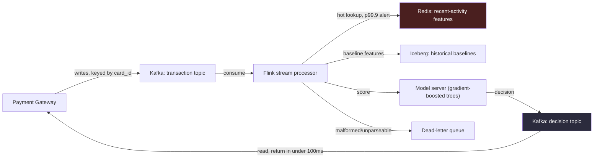

# Chapter 16, Case Study 1 — Real-Time Fraud Detection

> *(Chapter 16 is printed as "Chapter Fifteen" in the book's own running heads — see the
> numbering note in Chapter 3. This guide follows the outer Table of Contents, so this is
> "Chapter 16" for citation purposes. This is the first of four full case studies in that
> chapter.)*

## The Simple Version, First

Imagine a bouncer at the door of an exclusive club who has exactly one second to decide whether
to let someone in — no do-overs, no "let me think about it," and the doorway is genuinely blocked
until the decision is made. Now imagine that bouncer has to make that call correctly, thousands
of times per second, for people arriving from all over the world, using only a glance and a quick
background check.

That's real-time fraud detection. A payment is trying to happen right now. The system has a tiny
fraction of a second to decide "let this through" or "block this" — and the customer is standing
there waiting, because the payment doesn't complete until the answer comes back.

This case study is the perfect place to see everything from earlier chapters come together at
once: **skew** (Chapter 3), **streaming design** (Chapter 7), **orchestration discipline**
(Chapter 11), **reliability thinking** (Chapter 13) — and just as importantly, **the interview
performance skills** from Chapter 15. The architecture in the middle matters, but it's necessary,
not sufficient — how the candidate gets there matters just as much.

---

## The Prompt

*"Design a real-time fraud detection system for a payment company. Peak traffic is in the
thousands of transactions per second. The decision — fraud or not — has to come back within one
hundred milliseconds. The decision is blocking: the transaction doesn't complete until we've
scored it. We also keep a seven-day reversal window in case we get something wrong and need to
undo it later."*

---

## Idea 1: The First Five Minutes Decide More Than You'd Think

Before drawing a single box, a strong candidate pauses — genuinely, visibly, for about ten
seconds — and then asks a handful of sharp questions. Not to stall, but because **each answer
changes a different part of the design.**

**Question 1 — "Is this really blocking?"**
*"You said blocking. That's a specific choice and it locks in the latency budget. Can you confirm
it's strictly blocking — meaning the gateway holds the transaction until the decision comes back —
versus advisory, where the transaction completes and we reverse it later if needed?"*

The answer: strictly blocking. The customer doesn't see "success" until the system has scored the
transaction. **This one answer means the hundred-millisecond budget is a real, hard wall — not a
nice-to-have.** Every following design decision has to respect it.

**Question 2 — "How is the traffic actually shaped?"**
*"Is transaction volume roughly even across merchants, or long-tailed?"*

The answer: long-tailed. The top 1% of merchants make up about 40% of daily volume. This is the
exact same skew idea from Chapter 3 — and it means the design has a hot-spot problem to solve
before it can even think about tools.

**Question 3 — "What happens on a retry?"**
*"If the gateway retries a transaction after a timeout, does it need to get back the exact same
decision it got the first time, or is a fresh scoring acceptable?"*

The answer: the same transaction must get the same decision, every time. The gateway is
idempotent on its own side and expects the fraud system to be deterministic too. **This single
answer locks in the idempotency mechanism** — a client-supplied idempotency key on the
transaction, with the decision keyed by that value. Any retry finds the prior decision instead of
re-scoring from scratch.

**Question 4 — "How heavy is the actual scoring model?"**
*"Is this a pre-trained model the ML team already owns — something like gradient-boosted trees on
a fixed set of features — or something heavier, like a deep learning model?"*

The answer: gradient-boosted trees, about 20 features, with the feature engineering already done
ahead of time. Model inference itself is cheap. **This tells the candidate something important:
the real latency bottleneck won't be the model. It'll be how fast the system can fetch the
features the model needs.**

**Question 5 — "Is cost a real constraint here?"**
*"What's the cost ceiling?"*

The answer: unconstrained for this conversation. Good to know — it means every other decision
should optimize purely for correctness and speed.

> **🚩 FAANG Signal**
> Notice the order of these five questions, not just their content. The first question (blocking
> vs. advisory) shapes the entire latency budget before anything else is discussed. The last one
> (cost) comes last on purpose, because it doesn't change the shape of the architecture the way
> the earlier answers do. A candidate who asks questions in a thoughtful order — not just a
> checklist — is signaling they understand which answers matter *most*, not just which ones exist.

---

## Idea 2: Naming the Weak Point — Out Loud, With a Specific Number

Once the constraints are clear, a strong candidate states, explicitly, which part of the system
they expect to break first — and *why*, using the actual numbers from the conversation.

*"Given the budget is a hundred milliseconds end-to-end — and that has to include the network hop,
the feature retrieval, the actual scoring, and the write-back — I'd expect feature-store tail
latency to be the dimension that breaks first. Not throughput, not storage, not skew at the
throughput level. Specifically, the tail latency on the feature store — the p99.9, the worst-case
slow lookups."*

**This is the single most important habit in the whole case study.** It's not enough to say "I'm
worried about latency" — that's vague, and vague statements don't stick in an interviewer's memory.
Saying *specifically* "Redis p99.9 sustained above five milliseconds is what I'd expect to break
first" is the difference between reading about a system and having actually operated one.

> **🚩 FAANG Signal**
> The gap between saying "latency" and saying "the feature store's p99.9, specifically" is the
> gap between a candidate who's read about distributed systems and one who's actually run one in
> production. Specific metrics beat vague concerns every time — practice naming the *exact*
> number you'd watch, not just the general area of concern.

---

## Idea 3: Solving the Skew Problem With a Smarter Partition Key, Not a Bigger Hammer

Here's where the merchant skew answer from earlier pays off. If the system organizes work by
merchant ID, the top 1% of merchants — carrying 40% of volume — would all pile onto the same small
number of partitions. One worker gets pinned at 100% CPU while the rest sit idle. That's the
classic hot-key problem from Chapter 3.

**The obvious fix is "salting"** (splitting a hot key across several artificial sub-keys) — but
for this specific problem, there's a cleverer answer available: **partition by card ID instead of
merchant ID.**

Here's the intuition: a single card belongs to one person, and that person uses it across many
different merchants. So any one card's activity naturally spreads itself across the long tail of
merchants, instead of concentrating on one. **Partitioning by card ID sidesteps the merchant skew
entirely, just by choosing a different key** — no extra salting machinery needed.

The trade-off: per-card features (like "how many times has this card been used in the last
minute") stay correctly grouped — which is actually exactly what's wanted, since velocity-per-card
is the main fraud signal anyway. If the system needed a *per-merchant* velocity feature instead, it
would need salting or a separate pipeline for that specific feature.

> **🚩 FAANG Signal**
> The candidate named the weak dimension with a *reason* in minute five — a sentence that survives
> the interview even if the rest of the design has rough edges. Three things signal seniority
> here: the math came before the tool choice, the skew observation led to a *non-obvious* fix
> (card ID, not the "obvious" merchant-ID salting move), and the weak dimension was a specific
> metric, not a vague word like "latency."

---

## Idea 4: The Architecture, in Plain Terms

Here's the shape of the system, described the way you'd actually walk someone through it out loud.

### Diagram — the fraud detection pipeline

Walking through it step by step:

1. **The payment gateway** writes every transaction to a queue (Kafka), split into partitions by
   card ID — this is the natural skew-avoidance move from Idea 3 — with the idempotency key
   attached as the message's identifying key.
2. **A stream processor** (Flink) reads from that queue. Because it's partitioned by card ID, each
   worker owns a clean, non-overlapping slice of cards — no two workers fight over the same card's
   data.
3. **Recent-activity features** — like "how many transactions has this card made in the last
   minute" — live in an in-memory, low-latency store (Redis). This is the system's fast path, and
   it's the part carrying the tightest latency target (around 1 millisecond).
4. **Slower-moving baseline features** — like "this card's typical spending pattern" — come from a
   columnar data store (Iceberg), refreshed on a schedule (say, hourly) rather than looked up live
   every time.
5. **A model server**, sitting close to the stream processor to minimize network hops, combines
   both sets of features and produces a fraud score using the pre-trained gradient-boosted tree
   model.
6. **The decision gets written back** to another queue, which the gateway reads and returns to the
   customer — all within the hundred-millisecond budget.
7. **A dead-letter queue** catches anything malformed along the way — a transaction that doesn't
   parse, a schema mismatch — without ever stopping the main pipeline for everyone else.

---

## Idea 5: What Happens When Things Slow Down or Break

A design that only works when everything's healthy isn't a real design — this is the same lesson
from Chapter 13 (Reliability & Operations), applied directly here.

**If the feature lookup is running slow** (say, taking more than 50 milliseconds), the system
shouldn't just sit there waiting. It should flag the transaction as "needs enrichment," fall back
to a more conservative, rules-only decision immediately, and reconcile the full picture
afterward, asynchronously, once the lookup catches up.

**If the machine-learning model server goes down entirely**, the pipeline should never just stall.
A circuit breaker watches the failure rate: if more than about 5% of scoring calls fail within a
short window, the system stops calling the model and falls back to rules-only scoring — accepting
slightly more false alarms in exchange for zero downtime. Once the model's healthy again, anything
scored conservatively in the meantime gets reprocessed.

**If a chunk of transaction history is lost** — say, a queue outage wipes out 30 minutes of
incoming data — the recovery path matters more than trying to prevent every possible failure.
Multiple copies of the queue data (replication across machines and data centers) mean the system
can usually replay from a backup copy. If even that's unavailable, the payment processor's own
batch settlement records can serve as a last-resort source to reconstruct what happened. During
the outage itself, the system can fall back to simple, conservative rules — block obviously
high-risk transactions (very large amounts, unusual countries), allow everything that looks
routine — and once the outage clears, replay the missed transactions through full scoring
retroactively.

> **✅ Say this out loud**
> "Never stall the pipeline waiting on a slow dependency. Flag it, fall back to something
> conservative, and reconcile the full answer once the slow part recovers."

---

## Idea 6: Handling Private Data Correctly, Without Slowing Anything Down

Fraud systems inevitably touch sensitive personal information — names, addresses, device details.
Two disciplines keep this safe without adding latency to the hot path:

- **Keep raw personal information out of the fast path entirely.** Only hashed, anonymized
  identifiers (a hashed card ID, a hashed device ID) flow through the real-time pipeline. The
  actual sensitive data stays in the original source system, which the fraud pipeline never
  touches directly. Anything genuinely derived from personal information gets pre-computed
  *upstream*, by a system that's allowed to see it, and published as an already-safe, pre-joined
  feature.
- **Handle deletion requests as a specific, traceable event, not a manual cleanup task.** When
  someone requests their data be erased, an upstream system publishes a "tombstone" event keyed
  by the hashed identifier. The stream processor picks this up, removes all stored state for that
  identifier, and writes a deletion marker so any trailing retries see it too. The slower-moving
  baseline store gets a scheduled purge for that same identifier. In practice, this usually
  completes well within legally required deletion windows.

---

## The 30-Second Closing Summary

This is the move from Chapter 15 in action — volunteered, unprompted, right around the 38-minute
mark of a 45-minute interview:

*"Let me summarize. **What I'd build:** a stream-processing pipeline partitioned by card ID for
natural skew avoidance, a fast in-memory store for recent-activity features with a
1-millisecond target, a slower columnar store for baseline features refreshed hourly, a model
server co-located for latency, and a client-supplied idempotency key so retries are always safe.*

*What I'd sacrifice: operational complexity. The fast in-memory store becomes a single point of
failure for the whole latency target, so I'd invest in monitoring it closely from day one. Model
deployments are currently coupled to the stream processor's own deployments because they're
co-located — that's a refactor trigger once the ML team's release pace picks up. And falling back
to conservative rules during an outage is a business trade-off, not just a technical default —
it needs sign-off from the business, not just engineering.*

*What I'd watch, in priority order: the feature store's worst-case latency staying under five
milliseconds (the primary alert), how long each checkpoint takes relative to the time between
checkpoints (a secondary signal), how often malformed events show up in the dead-letter queue
(catches upstream schema drift), and how often the current model and a shadow "challenger" model
agree with each other over a rolling week (catches the model quietly drifting out of date)."*

**Then, two questions back to the interviewer** — the closing move from Chapter 15:

1. *"How does this team currently detect model drift — is there an existing shared pattern, or is
   it typically custom-built per ML team?"*
2. *"What's the real ratio between transactions blocked in real time versus fraud caught later
   through reversal? That ratio tells me where investment should actually go — if reversals are
   catching most of the fraud, the real-time path is carrying less of the overall weight than the
   prompt suggests."*

---

## What This Case Study Is Really Teaching

The architecture above is solid, but it's not the *only* correct architecture — other strong
candidates would sketch something similar with different details. **What actually separates a
strong answer from an average one isn't the diagram. It's the specific sequence of moves the
candidate made, in order:**

1. Four sharp clarifying questions before drawing anything, each one genuinely changing part of
   the design.
2. The weak dimension named early, with a specific number attached — not a vague word.
3. A non-obvious fix for skew (card ID, not the obvious merchant-ID salting) — showing real
   pattern recognition, not memorized advice.
4. A specific idempotency mechanism, triggered directly by a specific clarifying answer.
5. Graceful degradation named explicitly for two separate failure modes (slow feature lookups,
   a fully-down model server) — not just "we'll handle failures."
6. Privacy and deletion handled as a first-class design concern, not an afterthought bolted on at
   the end.
7. A volunteered, unprompted 30-second summary landing exactly where Chapter 15 said it should.
8. Two thoughtful closing questions that probe how the *team* actually operates — not just more
   technical trivia.

---

## Common Mistakes People Make

1. **Jumping straight to naming tools.** Saying "I'd use Kafka and Redis" before asking a single
   clarifying question skips the entire signal the interviewer is listening for first.
2. **Assuming traffic is evenly spread.** Real payment traffic is almost always long-tailed by
   merchant. Designing as if it's uniform means rebuilding the partitioning strategy later, under
   pressure.
3. **Treating "I'll make it idempotent" as enough.** The interviewer wants the specific mechanism
   — a client-supplied key, tied to a specific clarifying answer about retries — not just the
   word "idempotent."
4. **Saying "I'll handle failures" instead of naming a specific fallback.** Vague promises don't
   land. A specific mechanism — a circuit breaker, a conservative default, a reconciliation step
   — does.
5. **Running out of time before the summary.** The 30-second recap is often what an interviewer
   remembers most clearly. Skipping it because time ran short costs more than any architecture
   detail would have.

---

## The Big Ideas, One Line Each

1. **The clarifying questions aren't stalling — they're the first real signal you send**, and
   their order matters as much as their content.
2. **Name the weak dimension with a specific number, not a vague word.** "Redis p99.9" beats
   "latency" every time.
3. **Skew problems often have a smarter fix than brute-force salting** — sometimes the better
   partition key was available all along.
4. **A design that only works when everything's healthy isn't finished.** Name the fallback for
   every slow or failed dependency explicitly.
5. **Privacy and deletion handling belong in the core design**, not tacked on as an afterthought
   when someone asks about compliance.

---

## Cheat Sheet

**The five opening questions and what each one locks in**
1. Blocking vs. advisory? → locks in the real latency budget
2. Even or long-tailed traffic? → locks in the partitioning strategy
3. Same decision on retry? → locks in the idempotency mechanism
4. How heavy is the model? → locks in where the real latency bottleneck lives
5. Cost ceiling? → confirms what to optimize purely for

**The weak dimension, stated the right way**
Not: "I'm worried about latency."
Instead: "Feature-store tail latency — specifically Redis p99.9 — is what I'd expect to break
first."

**The skew fix that isn't the obvious one**
Partitioning by card ID instead of merchant ID sidesteps merchant-level hot spots naturally,
because one card's activity spreads across many merchants. Salting is the fallback, not the
default.

**Two graceful-degradation rules**
- Slow feature lookup → flag "needs enrichment," fall back to conservative rules, reconcile later.
- Model server down → circuit breaker at ~5% failure rate, fall back to rules-only, reprocess once
  healthy.

**Privacy, in two moves**
- Only hashed identifiers touch the real-time pipeline — raw personal data never leaves the
  source system.
- Deletion requests are a tombstone event, not a manual cleanup task.

**The 30-second summary template, applied here**
- What I'd build: (one sentence)
- What I'd sacrifice: (one sentence)
- What I'd watch, in priority order: (one sentence, most important alert first)

**Three lines worth memorizing**
- "That answer locks in the latency budget — let me confirm it before I draw anything."
- "The weak dimension I'd expect to break first is feature-store tail latency, specifically."
- "Never stall the pipeline on a slow dependency — flag it, fall back, reconcile later."

---

## A Couple of Extra Ideas (From the Older 2025 Edition)

- **A second version of this same prompt** frames the volume slightly differently (50,000
  transactions per second, a 2–3 second budget instead of 100 milliseconds) and treats false
  negatives — fraud that slips through — as strictly worse than false positives, meaning the
  system should lean toward flagging more, not less, when genuinely uncertain. Worth having both
  framings ready, since interviewers phrase the same underlying prompt differently.
- **Historical-join scaling tactics**, useful if an interviewer pushes on how the "recent activity"
  lookup scales under extreme load: splitting the lookup store by a hash of the card or user ID,
  keeping the highest-frequency identifiers cached directly in the stream workers' own memory, and
  using approximate data structures (like a Bloom filter or a HyperLogLog sketch) when an exact
  count isn't actually necessary — trading a small amount of precision for a large amount of
  speed.
- **A concrete disaster-recovery stress test worth rehearsing**: what happens if the transaction
  queue is corrupted and 30 minutes of data is lost, the fraud SLA gets breached during that
  window, and a regulator later asks for an explanation? The strongest answers name a specific
  recovery time objective (how fast you're back up) and recovery point objective (how much data,
  if any, is truly lost) — and treat the regulatory conversation itself as part of the design,
  not an afterthought: immutable incident logs, a clear explanation of the fallback behavior used
  during the outage, and evidence that no high-value fraud was missed during that window.
