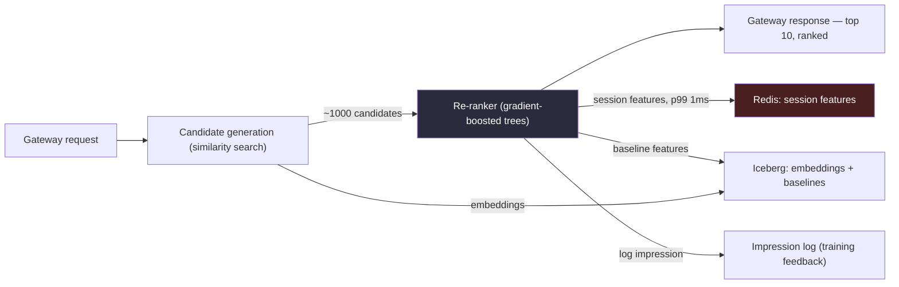

# Chapter 16, Case Study 2 — Recommendation Serving

> *(Chapter 16 is printed as "Chapter Fifteen" in the book's own running heads — see the
> numbering note in Chapter 3. This guide follows the outer Table of Contents, so this is
> "Chapter 16" for citation purposes. This is the second of four full case studies.)*

## The Simple Version, First

Imagine a librarian who has ten million books but only three seconds to hand you the ten you'd
actually enjoy — before you get bored and walk out. She can't possibly read every book's full
description to you in that time. So she uses a two-step trick: first, she quickly grabs a rough
armful of maybe a thousand books that seem roughly in your interest area. Then, with that much
smaller pile, she takes a closer look and picks the best ten from *those* thousand.

That's recommendation serving. Out of millions of possible items, the system has to find the best
handful for *this specific person*, *right now*, cheaply enough to do it billions of times a day.

Where Case Study 1 (fraud detection) was a **write-heavy problem with a hard latency wall**, this
one is a **read-heavy problem with both a latency budget and a real cost ceiling**. The
transferable pattern is the same one from earlier chapters — skew, feature stores, exactly-once —
just showing up in a different shape.

---

## The Prompt

*"Design the feature-serving pipeline for a recommendation system at a large consumer platform.
Peak traffic is around 35,000 ranking requests per second. Ten million items in the catalog. The
end-to-end response budget is 200 milliseconds. This isn't strictly blocking the way fraud
scoring is — a slightly slow response degrades the experience but doesn't fail a transaction — but
it still needs to be fast and it needs to be affordable at this scale."*

---

## Idea 1: Five Questions, Asked in a Very Deliberate Order

Just like Case Study 1, the candidate pauses and asks before drawing anything — but the specific
questions, and their order, are different here because the shape of the problem is different.

**Question 1 — "What kind of ranking are we actually doing?"**
This comes first because it fundamentally decides whether the system needs a specialized
similarity-search index or not. If recommendations are based on matching a person's "taste
profile" against item characteristics (a "two-tower" style setup), that implies a very different
architecture than a simpler rules-based ranking.

**Question 2 — "What happens for a brand-new user with no history?"**
This is asked early because it affects how the entire serving path has to branch — a system that
only works for established users with rich history isn't actually finished.

**Question 3 — "Is the 200ms budget end-to-end, or just the ranking service itself?"**
This matters because end-to-end (including network hops before and after) versus service-only can
change the real internal budget by 50 to 80 milliseconds — a big swing at this scale.

**Question 4 — "How often do the features actually need to be refreshed?"**
This determines the split between what needs to be looked up live, versus what can be
pre-computed on a schedule and just read quickly at serving time.

**Question 5 — "What's the cost ceiling?"**
Notably, this is a *good* question to ask upfront for a recommendation prompt specifically — and
it's the one weaker candidates tend to skip, because general interview prep (and the fraud
scenario) doesn't emphasize it as much. Recommendation infrastructure is often one of the single
largest data-engineering costs at a consumer tech company, so asking about the budget early
signals real operational experience.

> **🚩 FAANG Signal**
> Asking about cost upfront for a recommendation prompt specifically — not just generically —
> signals the candidate has actually operated infrastructure at this kind of scale. Fraud-focused
> interview prep rarely emphasizes cost the same way, so candidates who only prepared with the
> fraud playbook in mind tend to skip this question here, and it's noticeable.

---

## Idea 2: Why "Score Everything" Is Mathematically Impossible — and the Two-Step Fix

Here's the math that makes the whole design inevitable, worth doing out loud in an interview:

*"Ten million items times 35,000 requests per second equals 350 billion scoring operations per
second, if we tried to fully score every single item for every single request. Even at 100
nanoseconds per score, that's 35,000 CPU cores just for scoring. That's infeasible at any cost."*

**This is exactly the kind of calculation that signals a candidate has thought about the compute
frontier, not just the "happy path."** A weaker answer might just say "we'll use two-stage ranking
because it's more efficient" without the math — the number is what makes the architectural choice
feel inevitable instead of arbitrary.

**The fix is a two-stage process, like the librarian analogy:**

1. **Candidate generation** — a fast similarity-search index narrows 10 million items down to
   roughly 1,000 candidates per user, in just a few milliseconds. This uses a specialized
   structure built for exactly this kind of "find roughly similar things fast" search.
2. **Re-ranking** — a more detailed model scores just those 1,000 candidates using richer
   features, in maybe 50 to 80 milliseconds. Since it's only touching 1,000 items instead of 10
   million, this is affordable.

**Compute cost drops by four orders of magnitude** just from this one architectural decision.

### The interesting number hiding inside the re-ranking step

The re-ranker uses roughly 100 features per candidate (spanning the user, the item, and the
current context). For 1,000 candidates, that's 100,000 feature lookups *per request*. At 35,000
requests per second at peak, that's **3.5 billion feature lookups per second.** A sharded
in-memory store (8 to 12 nodes) can handle that — but *only* if the features are already joined
together and organized by user-plus-item ahead of time. Doing raw, unjoined lookups at request
time simply wouldn't scale.

---

## Idea 3: Naming Two Weak Points Together — On Purpose

Unlike Case Study 1, where tail latency was the single clear answer, here a strong candidate names
**two** weak dimensions together:

*"Feature-store tail latency, because 3.5 billion lookups per second leaves a razor-thin margin.
And cost, because this infrastructure is expensive, and the cost-per-impression number is what
actually determines which business decisions are even feasible."*

> **🚩 FAANG Signal**
> Fraud detection was latency-first because the blocking path was a hard stop — miss the budget
> and the transaction fails outright. Recommendation is latency-*and*-cost because the 200
> millisecond budget is softer (no money is lost if it's occasionally a bit slow) while the
> cost-per-impression number directly shapes which business decisions are financially viable. A
> candidate who names *only* latency here is just re-applying the fraud playbook to a different
> problem without adjusting it. Naming both signals they're matching the toolkit to the actual
> problem in front of them — which is the entire point of practicing multiple case studies instead
> of memorizing one.

---

## Idea 4: The Architecture, in Plain Terms

### Diagram — the recommendation serving pipeline

Walking through it:

- **Candidate generation** narrows the full catalog down to roughly 1,000 candidates per user,
  using a similarity index built over item and user profile data.
- **The re-ranker** scores those 1,000 candidates with a more detailed model, combining
  fast-changing "session" features (what the user just clicked, current context) with slower
  "baseline" features (long-term history, item popularity).
- **A fast in-memory store** holds only the features that genuinely change quickly enough to
  matter in real time — maybe 20 features per user, roughly 500 bytes total, which at 100 million
  active users is around 50 gigabytes of hot state, sharded across several nodes.
- **Everything else lives in a columnar store**, refreshed on different schedules depending on how
  fast it actually changes: user history aggregates refresh daily, item metadata and popularity
  refresh hourly, and item embeddings refresh weekly after model retraining. All of this is
  pre-joined into ready-to-read rows ahead of time — the optimization that makes "offline" data
  fast enough to use in an "online" request.
- **Session features update through a streaming path**: a queue of user actions feeds a stream
  processor that maintains rolling per-user state (like "last 20 clicks") and writes the updated
  feature straight to the fast store. End-to-end latency from a click to an updated feature is
  typically under two seconds.
- **Every impression gets logged** — which model version served it, which features were used,
  what score it got, and later, what actually happened (a click, a purchase, how long they
  stayed). This log is both the audit trail and the training data for the next model version.

---

## Idea 5: Handling a Brand-New User (Cold Start)

*"Given a threshold of five prior sessions, a brand-new user routes to a different path:
popularity-ranked items blended with contextual signals — what's trending in this person's
inferred interest area, popular for their device type, or relevant to their search if they made
one. The feature-fetching pattern stays exactly the same, but the re-ranker uses a model trained
specifically on minimal-history users, filling in missing features with population averages."*

*"As the user accumulates real history, cold-start scores get gradually blended with fully
personalized scores — weighting personalization more heavily each session. By session five or
six, the experience is fully personalized."*

**The subtle, important design choice: cold start isn't a separate pipeline.** It's the exact same
serving architecture, just fed different feature values and a different model variant. That
choice keeps the whole operational footprint small — no second system to build, deploy, and
monitor separately.

---

## Idea 6: The Real Cost Breakdown — and Three Levers to Pull

*"At this scale, recommendation infrastructure is often the single largest data-engineering cost
at a consumer tech company. Back of the envelope: 35,000 requests per second at peak, each
touching the fast store and the columnar store, each running a model, plus the ongoing training
pipeline. Monthly cost for this stack at production scale is typically in the high six figures,
often over a million dollars a month at the largest companies. Cost per impression ends up around
0.01 to 0.1 cents, depending on how much feature-fetching and model compute a given variant
does."*

**Three levers for cost, in order of impact:**

1. **Feature-store tiering.** Hot features stay in the fast in-memory store, everything else in
   cheaper columnar storage. This is the single biggest lever, because in-memory storage is often
   10 to 50 times more expensive per gigabyte than object-storage-backed columnar data. Keeping
   the in-memory store at a modest total size instead of letting it grow tenfold can save hundreds
   of thousands of dollars a month.
2. **Result caching at the gateway.** If a user requests a feed and comes back within 10 seconds,
   the top items likely haven't meaningfully changed. A short cache keyed by user and surface can
   drop maybe 20 to 40% of re-ranker calls entirely. The trade-off is slightly stale results,
   which is usually fine for this kind of use case.
3. **Candidate-generation index cost.** The similarity-search index that narrows 10 million items
   down to 1,000 is itself expensive to maintain, and the specific index technology involves a
   trade-off between search accuracy and memory usage. That specific choice is usually the ML
   team's call, informed by a monthly cost-per-impression review — the data engineer's
   responsibility is making sure the serving path works correctly with whichever one gets chosen.

---

## Idea 7: What Breaks First Under Load

**1. Fast-store tail latency.** Session feature reads and writes compete with each other under
load, and the store's worst-case latency can drift from sub-millisecond to 10 milliseconds during
bursty traffic. That alone can blow the entire 200-millisecond budget, because it sits directly on
the critical path of every single request. **Primary alert: fast-store p99.9 sustained above 3
milliseconds for 30 seconds.**

**2. Candidate-generation quality silently degrading.** The similarity index is rebuilt on a
schedule (say, weekly) from fresh embeddings. If the rebuild has a bug, or the underlying model's
"understanding" of items shifts subtly, search quality quietly degrades *without any system-level
alarm firing.* Users just see slightly less relevant recommendations, engagement metrics drop
slowly over days, and the symptom is genuinely ambiguous — nothing crashes, nothing errors, it
just gets a little worse.

**3. Query-pattern anti-patterns creeping into analytics.** The same "wrapping a column in a
function before filtering" anti-pattern from the query-engines chapter shows up constantly in
recommendation analytics, because analysts often reformat a timestamp column instead of using the
partition column directly. Regular office hours with the highest-cost analysts, plus a linter on
the BI layer, catches most of it before it becomes an expensive habit.

---

## The 30-Second Closing Summary

*"Let me summarize. **What I'd build:** a two-stage ranking pipeline — fast similarity search to
narrow the catalog to about 1,000 candidates, then a richer model to re-rank those. Session
features in a fast in-memory store with a 1-millisecond target, everything slower-moving
pre-joined into a columnar store on different refresh schedules. Cold start handled as a variant
of the same pipeline, not a separate system."*

*"What I'd sacrifice: the fast in-memory store is a single point of failure for the whole latency
target, so I'd invest in its observability first. The candidate-generation index quality can drift
silently, so I'd need a dedicated quality metric, not just an uptime check."*

*"What I'd watch, in priority order: fast-store p99.9 sustained above 3 milliseconds — the primary
alert. Candidate-generation recall trending down week over week — the slow, silent one. And
cost-per-impression drift, since that number determines which product decisions stay
affordable."*

**Two questions for the interviewer:**

1. *"How does this team currently detect candidate-generation quality drift — is there a standard
   shared metric, or is it usually built fresh per model?"*
2. *"What's the real split between traffic served fully personalized versus cold-start? That
   split tells me where the actual engineering investment should go."*

---

## What This Case Study Is Really Teaching

The transferable pattern from Case Study 1 is already visible here, just wearing different
clothes:

- **Skew shows up differently** — a merchant long-tail in fraud, versus an item-popularity
  distribution here — but it's fundamentally the same shape of problem.
- **The feature store shows up identically** — a fast "online" tier plus a slower "offline"
  baseline tier, in both case studies.
- **"Exactly-once" becomes "impression-log exactly-once"** — the same correctness discipline,
  applied to a different kind of event.
- **The same eight moves from the interview playbook chapter apply**, but the specific single
  decisions differ by domain. That's the whole payoff of practicing multiple case studies instead
  of memorizing one architecture: the *moves* transfer, the *specifics* don't.

---

## Common Mistakes People Make

1. **Skipping the "score everything" math.** Without doing the arithmetic out loud, two-stage
   ranking sounds like an arbitrary design choice instead of a mathematical necessity.
2. **Naming only latency as the weak dimension.** For recommendation specifically, cost matters
   just as much — naming both signals real awareness of this domain's actual constraints.
3. **Treating cold start as a separate system.** It should be the same serving path with
   different inputs, not a second pipeline to build and maintain.
4. **Forgetting that feature-store tiering is the biggest cost lever.** In-memory storage is
   dramatically more expensive per gigabyte than columnar storage — this is usually the first
   place to look when cost needs to come down.
5. **Not asking about cost upfront.** For this specific domain, it's a strong opening question,
   not an afterthought — skipping it is a noticeable gap.

---

## The Big Ideas, One Line Each

1. **"Score everything" is mathematically impossible at this scale — do the math out loud** to
   make two-stage ranking feel inevitable rather than arbitrary.
2. **Name two weak dimensions together when the problem genuinely has two** — latency and cost,
   here, matched to the domain rather than copy-pasted from a different case study.
3. **Cold start should be a variant of the main pipeline, not a separate system.**
4. **Feature-store tiering is usually the single biggest cost lever** at this scale.
5. **Quality can degrade silently, without triggering any uptime alert** — candidate-generation
   recall is the clearest example, and it needs its own dedicated metric.

---

## Cheat Sheet

**Five opening questions, recommendation-specific**
1. What kind of ranking? → decides if a similarity index is needed
2. What happens for a new user? → shapes the cold-start branch
3. End-to-end or service-only latency? → a 50-80ms swing in the real budget
4. How often do features change? → the online-vs-offline split
5. Cost ceiling? → ask this upfront here specifically; it's a strength signal

**The "score everything" math**
10M items × 35,000 req/sec = 350 billion scoring ops/sec if done naively. Two-stage ranking cuts
this by four orders of magnitude.

**Two weak dimensions, named together**
Feature-store tail latency (thin margin at 3.5 billion lookups/sec) *and* cost (determines which
business decisions are feasible).

**Three cost levers, in order of impact**
1. Feature-store tiering (biggest lever — in-memory is 10-50x pricier per GB than columnar)
2. Gateway-level result caching (20-40% fewer re-ranker calls)
3. Candidate-generation index choice (an ML-team call, informed by cost review)

**Three things that break first**
- Fast-store tail latency drifting under bursty load
- Candidate-generation quality degrading silently (no alarm fires)
- Query anti-patterns (function-on-partition-column) creeping into analytics

**Three lines worth memorizing**
- "Ten million times thirty-five thousand is why two-stage ranking is mandatory, not a
  preference."
- "For recommendation, I'd name two weak dimensions: latency and cost."
- "Cold start is a variant of the same pipeline, not a second system."

---

## A Couple of Extra Ideas (From the Older 2025 Edition)

- **The cold-start problem gets a cleaner fix with upload-time enrichment.** The moment new
  content is created, a dedicated event triggers an enrichment pipeline that extracts
  content-based features (topics, entities, basic metadata) and author-based features (follower
  count, historical engagement rate, account age) — all *before* any real engagement data exists.
  These get written to the same feature store, keyed the same way, so the ranking model never sees
  a blank slate — it can weight content and author features more heavily until engagement data
  accumulates.
- **A useful framing for weighted, time-decayed features**: a recent action should count for more
  than an old one (a like from an hour ago matters more than one from a week ago). Implementing
  this well benefits from a true streaming engine's fine-grained per-event control, rather than a
  micro-batch framework's coarser update cadence — worth mentioning if an interviewer pushes on
  *how* session features actually get computed, not just where they're stored.
- **Consistency between the "online" and "offline" views of the same feature is its own design
  question.** If a feature is computed slightly differently in the real-time path versus the
  batch-training path, the model can end up training on one distribution and serving on another —
  a subtle bug that's easy to introduce and hard to detect. Worth naming explicitly if asked how
  training and serving stay aligned.
