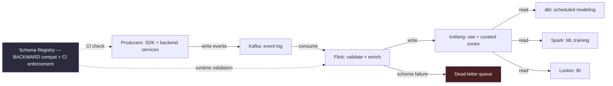

# Chapter 16, Case Study 3 — Clickstream Analytics at Scale

> *(Chapter 16 is printed as "Chapter Fifteen" in the book's own running heads — see the
> numbering note in Chapter 3. This guide follows the outer Table of Contents, so this is
> "Chapter 16" for citation purposes. This is the third of four full case studies.)*

## The Simple Version, First

Imagine a company where five different departments all quietly rely on the same shared filing
cabinet — but nobody who fills that cabinet ever tells anyone else when they change how they label
things. One day someone renames a folder, and suddenly three other departments' reports are
silently wrong, and nobody notices until a customer complains weeks later.

That's the core problem in clickstream analytics. Product teams ship new features every week, and
every new feature adds new kinds of tracked events or new fields on existing ones. **Every large
consumer company running clickstream data at scale hits the exact same three problems: producer
teams change the shape of their data without warning, downstream consumers silently break, and
the data team gets blamed for something a completely different team did without any
coordination.**

Where fraud detection had a hard latency ceiling, and recommendation had a cost ceiling, this case
study has a **schema-compatibility ceiling** — a genuinely different, and counterintuitive, shape
of constraint for what sounds like a "just streaming" prompt.

---

## The Prompt

*"Design the clickstream analytics platform for a consumer SaaS company. Product engineering
teams ship new features weekly, each one adding new event types and properties. Five hundred
million events per day at peak, growing 20% quarter over quarter. Multiple downstream consumers:
product analytics dashboards, marketing attribution, machine learning training, BI reporting."*

---

## Idea 1: The First Question Isn't About Volume — It's About Schema Reality

A strong candidate's very first question skips straight past throughput, because **the dominant
design constraint here is going to be schema evolution, not scale.**

**Question 1 — "When you say new event types weekly, are these truly brand-new events with
entirely new shapes, or mostly new properties added to existing events?"**
These are genuinely different problems. The answer: mostly new properties on existing events —
maybe two or three genuinely new event types per month. Renames happen rarely, but when they do,
they break everything downstream.

*"That's actually manageable if the tooling is right."*

**Question 2 — "Who owns each event type? Is there one product team per event, or do multiple
teams write to the same event?"**
The answer: product teams ship events as part of their normal feature work; the data team just
consumes. There's no formal agreement between them today — which is part of the problem the
company wants fixed. **This tells the candidate that schema-compatibility work is also an
organizational contract, not just a technical one.**

**Question 3 — "Which downstream consumers and engines?"**
The answer: an interactive query engine for ad-hoc analyst queries, a batch engine for ML
training, a transformation tool for scheduled modeling, a BI tool for dashboards, and occasional
stream-processing jobs for real-time features. **Multi-engine consumption is real** — this rules
out any table format that favors one specific engine.

**Question 4 — "What's the acceptable freshness per consumer?"**
The answer: real-time for ML features (seconds to minutes), seconds-to-minutes for product
dashboards, hourly for marketing attribution, daily for reporting. Different consumers, genuinely
different needs.

**Question 5 — "What's the retention policy, and is there compliance pressure?"**
The answer: two years hot for analytics, seven years cold for compliance and audit.

---

## Idea 2: Naming a Counterintuitive Weak Dimension — and Committing to It

For a streaming-shaped prompt, saying "schema compatibility is the weak dimension, not throughput
or cost" is genuinely counterintuitive — and that's exactly what makes it the right, senior-level
answer here.

> **🚩 FAANG Signal**
> "Schema compatibility is the weak dimension, not throughput or cost" is a counterintuitive claim
> for a streaming prompt, and it's the correct one for clickstream specifically. The interviewer
> hears two things: the candidate diagnosed the *right* dimension for *this* domain, and they
> stated it as a specific, named constraint with the producer team identified as the actual source
> of risk. A weaker candidate might say "schema evolution matters" without ever committing to it
> as *the* weak dimension. A strong candidate picks one dimension, commits to it, and designs the
> rest of the answer around that commitment.

---

## Idea 3: The Architecture, in Plain Terms

### Diagram — the clickstream analytics pipeline

Walking through the main flow:

- **Producers** — a mix of client-side tracking code and backend services — write events to a
  message queue (Kafka). **Before any event lands in the queue, two schema checks fire, not one.**
- **Check one, at pull-request time:** the producer team's automated build pipeline validates any
  proposed event-schema change against the schema registry. A breaking change fails the build with
  a specific error pointing at exactly what's incompatible.
- **Check two, at runtime:** the message-queue producer library validates the serialized event
  against the registered schema before publishing. Anything that passes the first check but fails
  here — probably because some dependency drifted out of sync — goes to a dead-letter queue for
  review.
- **The queue itself is the event log**, partitioned by a combination of event type and user ID,
  so per-event-type ordering is preserved and user-keyed processing (the real-time feature path)
  gets good data locality. Retention on the queue itself is short (a few days), because replay
  happens from the lakehouse, not from the queue.
- **A stream processor validates and enriches** — a second-line schema check (belt-and-suspenders),
  enrichment with user-context lookups where needed, and a write to the lakehouse's "raw" zone.
  Malformed events go to the dead-letter queue with a reason code attached.
- **The lakehouse storage layer is logically split into two zones.** Raw is append-only, every
  event that passed validation, partitioned by date and event type. Curated is the modeled fact
  and dimension tables that a transformation tool builds nightly.
- **Multiple engines read from both zones** in parallel — the whole reason the table format choice
  matters so much here.

---

## Idea 4: Why This Table Format, Specifically — Not Just "A Table Format"

*"Writer neutrality. At this company we have four different engines writing to, or wanting to
write to, the same tables: a stream processor, a transformation tool, a batch engine, and — if the
data team wants to add a new tool next year — it should work without a migration. A
Spark-first table format would make other engines second-class citizens here. A format optimized
for update-heavy workloads would cost more than it buys us, since we're mostly append-heavy. The
writer-neutral option is the default for exactly this multi-engine situation. The trade-off:
its maintenance operations add real overhead, but every format has some version of that same cost
— it just goes by a different name."*

This is the exact trade-off matrix from the lakehouse table formats chapter, applied out loud,
live, in an interview. **A weaker candidate picks a format because it's popular. A strong candidate
picks it because it matches who's actually writing.**

---

## Idea 5: What Actually Happens When a Product Team Ships a Breaking Change

Two paths, depending on whether the automated check catches it:

**The good path (the design goal):** the product team's build pipeline runs the schema
compatibility check on every pull request that touches an event schema. That check pulls the
current registered schema, compares it to the proposed one, and fails the pull request if a
compatibility rule is violated:

- Adding a nullable field: passes.
- Adding a required field with a default value: passes.
- Adding a required field with no default: fails.
- Renaming a field: fails, with a message suggesting the proper deprecation path.
- Changing a field's type: fails.
- Dropping a field: fails, unless the product team explicitly documents that no downstream
  consumer reads it — which requires explicit sign-off from the data team.

**The other path, when a breaking change slips past that check anyway** (the check gets bypassed,
a dependency drifts, someone temporarily disables it): runtime validation at ingestion catches it.
The event fails to serialize, lands in the dead-letter queue with a specific reason, and an alert
fires on the dead-letter rate for that event type — routed to both the data team's on-call and the
producer team's own channel. The data team's playbook is to disable the failing producer version
if a rollback is needed; the producer team's playbook is to revert the change.

**The three-zone pattern matters here too.** The raw zone preserves everything that passed
validation, so replay or reprocessing is always possible. The curated zone is built *from* raw, so
schema-evolution modeling work happens in the transformation layer whenever a new field is noticed
as worth modeling — not at ingestion time. This decouples the producer's schema-change pace from
the modeling team's own pace.

---

## Idea 6: GDPR Erasure as a Four-Part Pattern

With two years of hot retention plus seven years of compliance-driven cold retention, deletion
requests are a real, recurring operational concern, not a rare edge case.

**The four parts:**

1. **A tombstone event.** When a user requests erasure, an upstream identity system publishes a
   tombstone event on a dedicated queue, keyed by user ID.
2. **Row-level deletion in the lakehouse.** The stream processor consumes the tombstone and issues
   a row-level delete against every table containing that user's data.
3. **An audit log.** Every erasure request and its corresponding delete action gets logged
   immutably, for later proof of compliance.
4. **A dead-letter queue sweep.** This is the part most people miss — any of that user's events
   sitting in the dead-letter queue (unprocessed, because they failed validation) also need to be
   purged, not just the successfully-processed ones. A forgotten dead-letter queue is a genuine
   compliance gap.

---

## Idea 7: Maintenance and Cost — Applying Earlier Chapters Directly

**Lakehouse maintenance operations are scheduled from day one**, not discovered six months later
when queries start mysteriously slowing down: daily compaction, 14-day snapshot expiration,
weekly manifest rewrites, monthly orphan-file cleanup — the exact discipline from the lakehouse
formats chapter, applied here without modification.

**Cost attribution focuses on the right compute line item.** For clickstream specifically, most
spend concentrates in the ad-hoc interactive-query engine, not in storage. Applying the Pareto cost
analysis from the cost-at-scale chapter here means ranking analysts by cost, not ranking storage
buckets by size.

**Materialized views at the curated zone are the single biggest cost lever** for BI-driven
workloads, which make up most of clickstream consumption. A dashboard that refreshes every 15
minutes against a raw table can single-handedly drive a huge share of total spend; pointing it at
a pre-aggregated table instead is usually a 10x to 100x cost reduction on that specific workload.

**A common, specific query anti-pattern shows up constantly here:** analysts frequently reformat a
timestamp column in their filter instead of comparing the raw partition column directly — the
exact function-on-partition-column trap from the query-engines chapter. Office hours with the
top cost-attributed analysts, plus a linter on the BI layer, catches most of it.

---

## Idea 8: Two Failure Signals, at Two Different Timescales

**A point-in-time signal:** a spike in the dead-letter queue rate right after a producer team's
deployment. This is immediate and specific — it tells you exactly which deploy to look at.

**A slow-building trend:** the number of small files accumulating per partition creeping upward
over weeks. This doesn't spike; it drifts, and it's the kind of thing that only shows up if you're
actually tracking the trend, not just checking "is today normal?"

**Watching for both kinds of signal — the sudden spike and the slow drift — is itself a
transferable skill worth naming explicitly**, since sudden failures and slow degradations require
completely different monitoring approaches.

---

## The 30-Second Closing Summary

*"Let me summarize. **What I'd build:** a three-zone lakehouse — raw, curated, and an optional
serving zone — fed by a message queue, with a stream processor doing validation and enrichment.
The schema registry with backward compatibility is the piece the whole design depends on, enforced
in two places: automated checks on producer pull requests, and runtime validation at ingestion.
Multi-engine consumption is why a writer-neutral table format wins here over the alternatives.
Validation failures land in a dead-letter queue with a re-drive tool for reprocessing. GDPR
erasure uses the four-part tombstone pattern we walked through. Lakehouse maintenance operations
are scheduled from day one, not discovered at month six."*

*"What I'd sacrifice: schema-evolution rigor upfront. We pay the cost of integrating automated
checks into every producer team's pipeline, and we pay the political cost of rejecting their
breaking-change pull requests. That upfront cost is real and visible. The alternative — which I've
seen at more than one company — is quarterly contract-violation postmortems and a reputational hit
to the data team when dashboards silently break. The upfront rigor is the cheaper answer over any
horizon longer than about six months."*

*"What I'd watch: dead-letter rate per event type (catches producer deploys that break
compatibility), file-count-per-partition trend (catches compaction falling behind), schema
registry manual-registration events (catches registry drift), and per-user query-engine cost
weekly (catches ad-hoc spend drift). The first three are automated alerts; the last is a manual
review cadence."*

**Two questions for the interviewer:**

1. *"How does your team split real-time versus batch transformation work? Some companies do all
   modeling in the batch layer directly on the lakehouse; others keep the stream processor doing
   anything under an hour. That cutoff shapes a lot of the architecture, and it varies a lot by
   company."*
2. *"The producer-consumer contract is the organizationally hardest part of this stack. How does
   your company handle the friction between product engineering teams wanting to ship fast and the
   data team wanting schema stability?"* This is usually the real political conversation, and the
   answer reveals how realistic the whole design can actually be in practice.

> **🚩 FAANG Signal**
> Asking "how does your company handle the friction between the data team and product engineering
> around schema changes?" signals the candidate understands schema evolution is fundamentally an
> organizational problem, not just a technical one — the same insight from Question 2 at the very
> start, now bookending the whole interview.

---

## What This Case Study Is Really Teaching

Several specific moves distinguish a staff-level answer from a mid-level one here — some overlap
with the earlier two case studies, several are distinctive to clickstream specifically:

1. **Schema evolution as the weak dimension, not throughput.** For a streaming prompt, this is
   counterintuitive — a strong candidate diagnoses the actual weak dimension *per domain*, not by
   defaulting to whatever a "streaming" category usually implies.
2. **Multi-engine consumption drives the table format choice** — the trade-off matrix from the
   lakehouse chapter, applied out loud. A weaker candidate picks a format because it's popular.
3. **A three-zone architecture with an explicit purpose per zone.** Raw exists for replay, curated
   for decoupling producers from modelers. Naming the *why* per zone is what marks the strong
   answer.
4. **An automated schema check on the producer's own repository as a first-class design
   deliverable.** This is the single control that prevents most incidents. The claim isn't "we
   have a schema registry" — it's "producer pull requests fail an automated check on breaking
   changes, with a specific message suggesting the deprecation path."
5. **Runtime validation as the second-line defense** — the belt-and-suspenders layer that catches
   what the automated check missed.
6. **GDPR erasure as a four-part pattern**, where the dead-letter queue sweep is the piece most
   people miss.
7. **Lakehouse maintenance operations named as mandatory**, scheduled from day one.
8. **Per-user cost attribution for the ad-hoc query engine specifically** — the Pareto analysis
   applied to the right line item, not to storage.
9. **Materialized views at the curated zone as the single biggest cost lever**, since most
   consumption is BI-driven.
10. **Two failure signals spanning two different timescales** — one immediate (a dead-letter
    spike), one slow (a file-count trend).
11. **A closing question that probes organizational friction**, not just more technical detail.

---

## Common Mistakes People Make

1. **Defaulting to "throughput is the weak dimension" because the prompt sounds like streaming.**
   Diagnose per domain, not per category.
2. **Picking a table format by popularity.** Multi-engine consumption should drive this decision,
   not which format is currently trending.
3. **Treating "we have a schema registry" as sufficient.** The specific enforcement mechanism —
   automated checks on producer pull requests, with a clear deprecation path — is what actually
   prevents incidents.
4. **Forgetting the dead-letter queue in a GDPR erasure flow.** Deleted-but-still-sitting-in-DLQ
   data is a real compliance gap.
5. **Treating schema evolution as a purely technical problem.** It's also an organizational
   contract between producer and consumer teams — say so explicitly.

---

## The Big Ideas, One Line Each

1. **The weak dimension isn't determined by the prompt's category — diagnose it per domain.**
   Streaming doesn't always mean throughput is the constraint.
2. **Multi-engine consumption is the deciding factor for table format**, not popularity or
   familiarity.
3. **An automated check on the producer's own pipeline is the single control that prevents most
   incidents** — not a passive registry that nobody's pull requests are actually gated on.
4. **GDPR erasure needs all four parts, including the dead-letter queue** — skipping any one
   leaves a real compliance gap.
5. **Schema evolution is an organizational contract as much as a technical one** — name that
   explicitly, both early and at the close.

---

## Cheat Sheet

**Five opening questions, clickstream-specific**
1. Truly new event shapes, or new properties on existing events? → determines the real scope
2. Who owns each event type? → surfaces the organizational contract gap
3. Which engines consume downstream? → decides the table format
4. Freshness per consumer? → shapes the architecture's speed tiers
5. Retention and compliance pressure? → shapes GDPR handling

**The weak dimension, stated with commitment**
"Schema compatibility is the weak dimension, not throughput or cost" — counterintuitive for a
streaming prompt, and correct here.

**Two schema checks, not one**
1. Automated check on producer pull requests (prevents most incidents)
2. Runtime validation at ingestion (the belt-and-suspenders layer)

**Table format decision rule**
Multi-engine consumption → writer-neutral format wins. Match the format to who's actually writing,
not to popularity.

**GDPR erasure, four parts**
Tombstone event → row-level delete → audit log → dead-letter queue sweep (the piece most people
miss)

**Two failure-signal timescales**
- Point-in-time: dead-letter rate spike after a producer deploy
- Slow trend: file-count-per-partition creeping up over weeks

**Three lines worth memorizing**
- "Schema compatibility is the weak dimension here, not throughput."
- "Producer PRs fail CI on breaking changes, with a message suggesting the deprecation path."
- "The dead-letter queue sweep is the part most people miss in GDPR erasure."

---

## A Couple of Extra Ideas (From the Older 2025 Edition)

- **Handling a 10x traffic spike (a "Black Friday" scenario) without breaching the freshness
  SLA or blowing up compute cost** comes down to three fronts: scaling ingestion partitions ahead
  of the expected spike rather than reactively, compressing payloads and decoupling raw ingestion
  from enrichment so a backlog in one doesn't block the other, and using dynamically-sized
  micro-batches plus autoscaling triggered by backlog depth rather than a fixed schedule.
- **Identity resolution across web, mobile, and other surfaces** is a related, commonly-paired
  problem: a device ID and session ID exist everywhere, but a stable user ID may only exist for
  signed-in users on some surfaces (a connected TV app, for instance, often has no user ID at
  all). Designing for this means explicitly deciding what each downstream consumer can and can't
  rely on, rather than assuming a single unified identifier always exists.
- **Serving layer design for a unified view** (combining data across multiple systems, like a
  "customer 360" pipeline) often uses a layered raw/cleaned/modeled pattern similar to the
  raw/curated split here, with GDPR handled as a two-step deletion — first a soft-delete flag,
  then physical deletion after confirming the delete propagated to every downstream system —
  plus a daily reconciliation job that checks no "deleted" user still has residual data anywhere.
