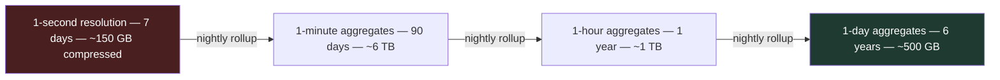
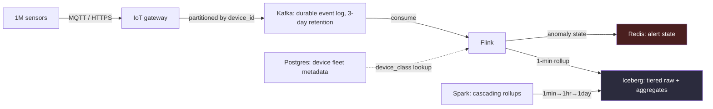

# Chapter 16, Case Study 4 — IoT Telemetry at 1 Million Sensors per Second

> *(Chapter 16 is printed as "Chapter Fifteen" in the book's own running heads — see the
> numbering note in Chapter 3. This guide follows the outer Table of Contents, so this is
> "Chapter 16" for citation purposes. This is the fourth of four full case studies.)*

## The Simple Version, First

Imagine being asked to keep a photograph of every single second of your life, for the next seven
years, just in case someone needs to look something up later. That's obviously an absurd amount
of storage for almost no benefit — most seconds of most days look exactly like the seconds around
them. What you'd actually want is: keep the full-detail photos of anything unusual for a little
while, then start keeping just a few representative photos per day once enough time has passed,
because a rough sense of "what a normal day looked like a year ago" is all anyone will ever
actually need.

That's the entire IoT telemetry problem in one sentence. **A naive reading of "seven years of
retention at one million readings per second" is architecturally impossible at any reasonable
cost.** The solution isn't a clever storage trick bolted on later — it's a core design decision
made on day one.

Where fraud had a latency ceiling, recommendation had a cost-and-latency ceiling, and clickstream
had a schema-compatibility ceiling, this case study has a **retention ceiling that makes naive
storage infeasible.** The transferable lesson: **downsampling — deliberately keeping less detail
over time — is a first-class architectural primitive, not a cleanup task you get to later.**

---

## The Prompt

*"Design the data platform for an industrial IoT deployment. One million sensors across thousands
of sites, each sensor emitting a reading per second at peak. Real-time anomaly detection for
operational safety within seconds of a reading. Historical trend analysis for predictive
maintenance. Seven-year retention for regulatory compliance."*

---

## Idea 1: Doing the Impossible Math First — Out Loud

*"The numbers in this prompt are interesting, because the naive reading — seven years of
retention at one million readings per second — is architecturally infeasible, which I'll get to.
Before I draw, a few questions specific to IoT that change the whole design."*

**Question 1 — "Sensor connectivity — are sensors always online, or do they buffer data offline
during outages?"**
The answer: industrial sites have intermittent connectivity. Sensors buffer up to 48 hours
locally, then dump on reconnection. Typical outages last a few minutes; the worst case is a
regional connectivity outage causing thousands of sensors to dump simultaneously.

*"Good — so late arrivals aren't an edge case. They're a normal operational pattern."* This
single answer shapes the entire late-data strategy and the backfill design later on.

**Question 2 — "The compliance retention — does regulatory compliance require seven years of raw
readings, or do aggregates satisfy the requirement?"**
The answer: aggregates are acceptable. Regulators want to reconstruct the operational state of
any site at any point in the last seven years — they don't require per-second granularity for
historical reconstruction.

*"That's the single most important answer in this prompt. I'll explain why in a moment."* **This
one answer changes the required storage by three orders of magnitude.** A candidate who assumes
the worst-case interpretation (full raw retention) ends up designing something architecturally
infeasible.

**Question 3 — "The anomaly detection model — rule-based thresholds, a statistical model, or
something learned?"**
The answer: starting with threshold-based per-metric checks, with a learned model on the roadmap.
*"So the real-time path needs to serve threshold checks now, and the feature store needs to
support a learned model's feature-fetching pattern later. I'd design for both."*

**Question 4 — "Historical query patterns — pure time aggregation, per-device drill-down, or
cross-device correlation?"**
The answer: mostly per-device drill-down plus aggregated trends; cross-device correlation is
occasional, for specific research projects. This informs the storage layout and partitioning
strategy.

---

## Idea 2: Naming Cost as THE Weak Dimension — With an Eight-Figure Number

*"Given these constraints, cost is unambiguously the weak dimension. At this scale, with these
retention requirements, latency and throughput are comparatively easy, and schema evolution is
contained. Cost is where an unexamined design goes wrong by eight figures over a seven-year
horizon."*

> **🚩 FAANG Signal**
> The candidate just named the single design decision that matters most for IoT, and quantified
> it with a specific number attached — not a vague concern. Mid-level candidates treat this kind
> of naive-worst-case reading as an assumption to just work with. Staff-level candidates catch that
> the naive reading changes cost by three orders of magnitude, and they say so before designing
> anything around a number that might be wrong.

---

## Idea 3: Downsampling — the Architectural Centerpiece, Quantified

**Proposed retention tiers, cascading:**

- **1-second resolution for 7 days** — enough for forensic investigation of a recent anomaly.
- **1-minute aggregates (min/max/avg/p99/count per device) for 90 days** — for recent trend
  analysis.
- **1-hour aggregates for 1 year** — for longer-horizon predictive maintenance.
- **1-day aggregates for the remaining 6 years** — purely for compliance reconstruction.

Each tier is one or two orders of magnitude smaller than the one before it.

### Diagram — the retention cascade

**Total storage with this cascade, roughly:** raw for 7 days is about 150 GB compressed.
1-minute aggregates for 90 days: about 6 TB. 1-hour aggregates for 1 year: 1 TB. 1-day aggregates
for 6 years: 500 GB. **Total across all tiers: about 8 TB compressed — versus 5.5 petabytes for
naive 7-year raw retention. Three orders of magnitude cheaper. Storage cost drops from roughly
$125,000 per month to roughly $500 per month.**

**The downsampling decision is not a cleanup task. It's the core architectural primitive that
makes this system cost-feasible at all.** A design without downsampling at this scale is a design
that can't ship.

> **🚩 FAANG Signal**
> Quantifying the downsampling decision with the $125k-versus-$500 comparison, and stating
> explicitly that it's not optional, is what earns this move. A mid-level candidate treats
> downsampling as an optimization to consider later. A staff-level candidate makes it the
> centerpiece of the architecture from the first sketch — because at this scale, the design simply
> doesn't work without it.

---

## Idea 4: The Architecture, in Plain Terms

### Diagram — the IoT telemetry pipeline

Walking through it:

- **The gateway** is the edge ingestion point — an MQTT broker or HTTPS endpoint at the network
  perimeter. Authentication and encryption live here; the internal message queue only ever sees
  trusted events.
- **The queue is the durable event log**, partitioned by device ID so per-device ordering is
  preserved and the stream processor's per-device state co-locates with incoming events.
  Retention on the queue itself is short (3 days) — the lakehouse is the true system of record;
  the queue is for replay and real-time consumption only.
- **The stream processor runs two jobs simultaneously on the same stream.** Job one: anomaly
  detection, keyed by device, maintaining a rolling state of recent readings per device and
  comparing each new reading against a threshold, firing alert state to a fast lookup store. Job
  two: continuous 1-minute downsampling, emitting a rolled-up aggregate row every minute per
  device (min, max, avg, count, p99, timestamp) directly to the lakehouse's 1-minute tier.
- **The lakehouse is tiered**, with each retention window as a genuinely separate table with its
  own lifecycle policy. Older tiers move to progressively cheaper storage classes automatically.
- **A batch job runs the cascading rollup** every night: any 1-minute data that's aged past 90
  days gets rolled up into the 1-hour tier and the old 1-minute data expires; the same cascade
  happens from 1-hour to 1-day at the 1-year boundary.
- **A small database holds device fleet metadata** — which sensors are online, firmware version
  per device, calibration offsets, site assignment. The stream processor queries this during
  anomaly detection, since different device classes need different thresholds. This is a small,
  mostly-read workload — a single instance with a read replica handles it comfortably.

---

## Idea 5: Handling Late Arrivals — a Normal Pattern, Not an Edge Case

*"Watermark strategy in the stream processor, with 1 hour of allowed lateness. Anything arriving
within an hour of its actual event timestamp is processed normally and included in the 1-minute
aggregate. Anything later than that goes to a dedicated 'late-arrival' queue."*

The late-arrival queue is processed by a separate backfill job that reads accumulated late
events, groups them by their intended 1-minute aggregate window, and issues row-level updates
against the lakehouse's 1-minute tier. For a device that dumps 48 hours of buffered readings on
reconnection, the backfill job updates up to 2,880 one-minute windows for that device — a bounded
amount of work.

**The design choice, stated explicitly:** 1-minute aggregates can be revised up to 48 hours after
their initial write. Queries on the most recent 48 hours should expect occasional revision.
Queries on data older than 48 hours are stable. Most analytical use cases tolerate this; the ones
that don't get a "final" marker in the schema that the revision job sets once the 48-hour
watermark passes.

> **✅ Say this out loud**
> "1-hour allowed lateness in the watermark strategy is much larger than the 1-second we'd use in
> a fraud detection context. IoT connectivity patterns make late arrivals normal, not
> exceptional."

---

## Idea 6: What Breaks First at Production Scale — Three IoT-Specific Failures

**1. Checkpoint duration creeping up.** At a million events per second, keyed by device with
rolling state per device, the operator state is substantial (roughly 500 megabytes each across 32
parallel operators). Checkpoint duration grows as the device fleet grows. **Alert: checkpoint
duration over 20% of the checkpoint interval.** Mitigation: a disk-backed state store for larger
state, incremental checkpoints instead of full snapshots each time.

**2. A late-arrival flood after a regional outage.** Thousands of devices dumping 48 hours of
buffered readings simultaneously can mean roughly 1.7 billion events queued on the late-arrival
topic at once. If the backfill job is only sized for steady-state late arrivals, it falls behind
by days. **Mitigation:** the backfill job gets its own autoscaling pool, sized for roughly 10x
steady-state, with an alert firing when the late-arrival backlog exceeds a billion events.

**3. Device fleet metadata drift.** Sensors get redeployed, firmware updates change the reading
format, calibration offsets shift. If the metadata database falls out of sync with the actual
deployed fleet, anomaly thresholds fire false positives (checking old thresholds against new
firmware) or miss real anomalies. **Alert:** schema-validation dead-letter rate per device class,
cross-referenced against the expected firmware version recorded in the metadata database.

---

## Idea 7: The Real Cost Breakdown, With the $10.5M Number

*"This is where the downsampling decision shows up concretely."*

**Storage with downsampling:** 8 TB total across tiers, averaging around $10 per terabyte per
month blended across the storage classes used. That's about $80 per month. **Without
downsampling: 5.5 petabytes at roughly $125,000 per month. The difference is $1.5 million per
year, or about $10.5 million over seven years. One architectural decision, an eight-figure
saving.**

**Compute:** the stream processor for real-time anomaly detection and 1-minute rollups, roughly
$30k/month for the managed cluster. The batch engine for cascading rollups, roughly $5k/month
(cheap, because it runs nightly on already-aggregated data). The message queue, roughly
$10k/month for brokers plus managed-service overhead. The metadata database, roughly $1k/month.
An interactive query engine for ad-hoc queries against the lakehouse, budget roughly $20k/month,
tunable with materialized views for dashboard queries.

**Edge-to-cloud data egress.** 1 million events per second at 100 bytes each is 100 MB per
second, roughly 260 TB per month. Most IoT deployments put the gateway in the same cloud region
as the processing, so ingress is free and intra-region transfer is cheap. If the gateway is
on-premises, egress from the customer's site to the cloud is typically either billed back to the
customer or bundled into the sensor subscription price — so in practice, it often isn't a
data-engineering cost at all.

**Total IoT infrastructure cost: roughly $65k per month, or about $780k per year. The downsampling
decision by itself is worth more than the entire rest of the infrastructure cost combined.**

> **🚩 FAANG Signal**
> The candidate just quantified the single most important design decision as worth $10.5 million
> over seven years. This is the kind of dollar figure that turns an architectural choice into an
> executive-level conversation. A mid-level candidate says "we'll do downsampling for cost." A
> staff-level candidate says "the downsampling architecture is worth $10.5 million, and it's the
> first number I'd put on a design-review slide." That specific dollar figure is what the
> interviewer remembers.

---

## Idea 8: Proving Compliance Without Keeping the Raw Data Forever

*"Chain of custody. Every table in the lakehouse records a lineage reference back to its source,
so a 1-minute aggregate row carries metadata about which message-queue offset range and which
version of the aggregation logic produced it. The aggregation logic itself is versioned and
code-signed, so an auditor can reconstruct the aggregate from raw data for any time window where
raw is still available — the first 7 days."*

For older data where raw is already gone, the audit instead proves three things:

1. **What the 1-minute aggregation logic was at that time** (tracked via version control).
2. **The input data's commit lineage** (the message-queue offset range, recorded in the
   lakehouse's own metadata).
3. **A periodic reconciliation report** comparing current aggregation logic against historical
   aggregates, flagging any drift.

**Regulators accept this as chain of custody** — they don't require keeping the raw data if the
transformation itself is reproducible from metadata.

**One subtle, important design choice: historical aggregates are never modified after
finalization.** Revisions from late arrivals happen within the 48-hour window described earlier;
past that, aggregates are immutable. If an error is later discovered in the historical
aggregation logic itself, the fix creates a *new* aggregate table with the corrected logic and
preserves the old one — never silently overwriting history. **Immutability after finalization is
the compliance invariant.**

---

## The 30-Second Closing Summary

*"Let me summarize in three sentences."*

*"Build: the message queue as the durable event log, partitioned by device ID. A stream processor
running anomaly detection against thresholds (with a sidecar path to a fast store for alert
state) and continuous downsampling to write 1-minute aggregates into the lakehouse, simultaneously
on the same keyed stream. A tiered lakehouse — 1-second for 7 days, 1-minute for 90 days, 1-hour
for 1 year, 1-day for 6 years — with cascading nightly rollups handling the transitions between
tiers."*

*"Sacrifice: the two stream-processor jobs are coupled in deployment because they run on the same
stream — a trade-off of coupled releases against lower overall latency. 1-minute aggregates can be
revised up to 48 hours after initial write, which some analytical consumers need to know about
explicitly."*

*"Watch: checkpoint duration relative to the checkpoint interval (catches state growth as the
fleet scales), late-arrival backlog size (catches a regional-outage flood overwhelming the
backfill job), and device-metadata drift via the dead-letter rate per device class cross-referenced
against expected firmware."*

**Two questions for the interviewer:**

1. *"How does your team currently detect model drift for the anomaly detection roadmap — once the
   learned model ships, is there an existing shared pattern for monitoring that, or is it usually
   custom-built per team?"*
2. *"What's the real ratio between anomalies caught in real time versus discovered later through
   the historical trend analysis? That ratio tells me whether the real-time path is actually
   carrying as much weight as this prompt implies, or whether more investment should go toward the
   historical analysis side."*

---

## What This Case Study Is Really Teaching

Twelve specific moves separate a staff-level answer from a mid-level one here:

1. **Confirming the retention interpretation before designing anything.** The answer changes cost
   by three orders of magnitude — assuming the worst-case interpretation produces an infeasible
   design.
2. **Naming cost as THE weak dimension, with a specific eight-figure number attached.** This is
   the correct weak dimension for IoT, and the quantification is what makes the architectural
   choice feel inevitable.
3. **Downsampling as a first-class primitive, not cleanup.** The architectural centerpiece,
   quantified with a three-orders-of-magnitude storage reduction.
4. **Cascading retention tiers with specific resolution-per-duration choices.** The specific
   numbers matter because they come from understanding both the query workload and the compliance
   constraint together.
5. **The message queue as a durable event log even with time-series aggregates as the actual
   query layer.** The queue is for replay and multi-consumer fan-out, not long-term storage; the
   lakehouse is the system of record.
6. **The stream processor doing two jobs simultaneously**, with the trade-off named explicitly:
   coupled deployments versus latency savings.
7. **1-hour allowed lateness in the watermark strategy** — much larger than a fraud detection
   context, because IoT connectivity patterns make late arrivals the normal case.
8. **The 48-hour revision window as a named, deliberate design choice**, not an accident. The
   candidate names it as the compliance invariant and defends it.
9. **Device fleet metadata as a sidecar concern.** A small database holding firmware versions,
   calibration, and site mappings — candidates who haven't operated IoT systems often
   under-weight this.
10. **Chain of custody via lineage metadata.** The compliance invariant: aggregation logic is
    reproducible from signed code plus offset ranges, so regulators accept aggregates as faithful
    to the original stream even after raw data has expired.
11. **Edge-to-cloud egress cost called out explicitly** — a common IoT cost surprise, with the
    candidate explaining why it typically isn't actually a data-engineering cost in practice.
12. **The $10.5M downsampling number as a closing cost statement.** One architectural decision,
    quantified at eight figures — the kind of number that comes from having actually had the
    executive conversation before.

---

## Common Mistakes People Make

1. **Assuming worst-case retention without confirming it.** "Seven years of raw at one million
   events per second" sounds like the requirement, but confirming whether aggregates satisfy
   compliance changes the design entirely.
2. **Treating downsampling as an optimization for later.** At this scale, the design is
   architecturally infeasible without it — it has to be the starting point, not an afterthought.
3. **Using the same watermark tolerance as a low-latency use case.** IoT connectivity patterns
   are fundamentally different from a fraud-scoring context; late arrivals are the normal case
   here, not an edge case.
4. **Forgetting device fleet metadata as a real operational concern.** Firmware drift and
   calibration changes are a genuine, ongoing source of false positives if metadata isn't kept in
   sync.
5. **Not quantifying the big decision in dollars.** "We'll downsample for cost reasons" is much
   weaker than putting a specific number on the table.

---

## The Big Ideas, One Line Each

1. **Confirm the retention interpretation before designing anything** — the answer can change
   cost by three orders of magnitude.
2. **Downsampling is a first-class architectural primitive**, not a cleanup task — quantify it.
3. **Late arrivals are a normal operational pattern in IoT**, not an edge case — size the
   watermark tolerance accordingly.
4. **Chain of custody through lineage metadata lets you satisfy compliance without keeping raw
   data forever.**
5. **Quantify the biggest architectural decision in real dollars** — that's the number an
   executive conversation actually remembers.

---

## Cheat Sheet

**Four opening questions, IoT-specific**
1. Always-online sensors, or offline buffering? → shapes the late-arrival strategy
2. Raw retention required, or do aggregates satisfy compliance? → changes cost by 1000x
3. Rule-based, statistical, or learned anomaly model? → shapes what the real-time path must serve
4. Query pattern: aggregation, drill-down, or cross-device correlation? → shapes storage layout

**The weak dimension**
Cost, unambiguously — quantified in eight figures over the retention horizon.

**The retention cascade**
1-second (7 days, ~150GB) → 1-minute (90 days, ~6TB) → 1-hour (1 year, ~1TB) → 1-day (6 years,
~500GB). Total: ~8TB vs. 5.5PB naive. Roughly $500/month vs. $125,000/month.

**Watermark strategy**
1 hour of allowed lateness — much larger than a low-latency use case, because IoT connectivity
makes late arrivals normal. 48-hour revision window for 1-minute aggregates; immutable after that.

**Three things that break first**
- Checkpoint duration creeping up as the fleet grows
- A late-arrival flood after a regional outage (up to ~10x steady-state)
- Device fleet metadata drifting out of sync with the real deployed fleet

**The big number**
$10.5 million saved over seven years from the downsampling decision alone — more than the rest of
the infrastructure cost combined.

**Chain of custody**
Aggregation logic versioned + code-signed, plus offset-range lineage in metadata = reproducible
audit trail, even after raw data expires. Historical aggregates are immutable after finalization.

**Three lines worth memorizing**
- "The naive reading of this retention requirement is architecturally infeasible — let me confirm
  the real requirement first."
- "Downsampling isn't a cleanup task. It's the core primitive that makes this cost-feasible."
- "That one decision is worth $10.5 million over seven years."

---

## A Couple of Extra Ideas (From the Older 2025 Edition)

- **A time-series database's storage-tiering pattern applies directly here**, even without using
  a purpose-built time-series database product — the underlying idea (recent data at full
  resolution, older data progressively downsampled) is a well-established pattern worth naming
  explicitly, since it signals you're borrowing a proven approach rather than inventing one from
  scratch under interview pressure.
- **A useful sanity-check habit for any retention-heavy prompt**: always ask whether a stated
  retention number applies to raw data or to *some* representation of the data. The same
  regulatory requirement ("keep records for seven years") is often satisfiable at wildly different
  costs depending on which interpretation applies — and confirming this explicitly, rather than
  assuming the expensive interpretation, is frequently the single highest-leverage question in
  the entire conversation.
- **Real companies building IoT-adjacent time-series platforms** (industrial monitoring, fleet
  telemetry, environmental sensing) consistently report that the retention/compliance
  conversation, not the real-time ingestion pipeline, is where the actual budget conversations
  happen — worth remembering that the "boring" compliance question is often the one with the
  biggest financial stakes.
