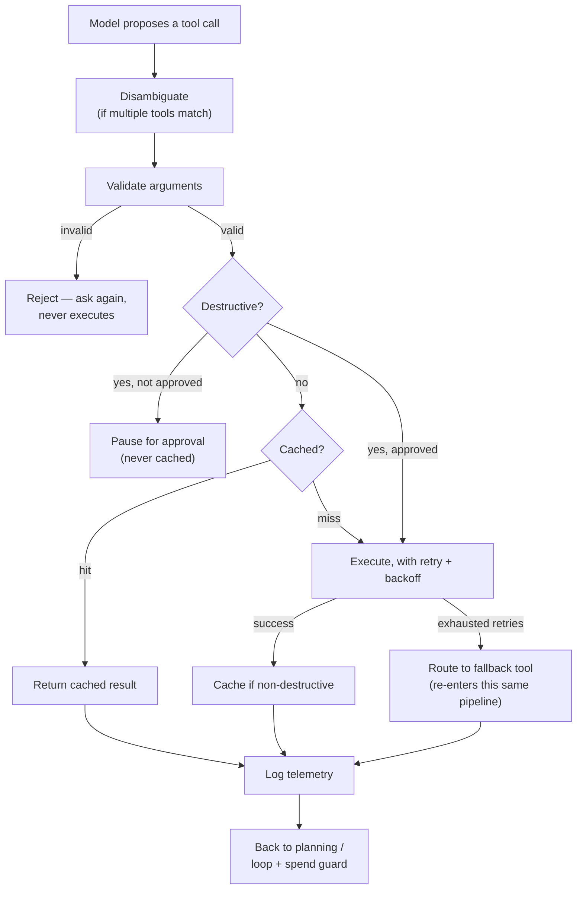

# Guarding tool calls in an agentic system

A model deciding to call a tool is a **proposal**, never an authorization. Every check in this doc
exists because of that one sentence — the model can suggest an action; something else has to decide
whether it's actually allowed to happen, whether it's worth re-doing, and whether it needs a fallback.
This doc generalizes eight checks into system-design vocabulary — grounded in a working coding-round
demo (`Coding_Round/agent_tool_calling_demo`), but written so none of it depends on remembering that
demo's code.

**How this relates to the rest of the series:** `agent_platform` already covers three of these eight
checks in depth (the destructive-action gate, the step budget, the spend cap) as part of its guardrail
decision. This doc adds the five it doesn't: argument validation, retry-with-fallback, memoization,
disambiguation between overlapping tools, and per-call telemetry — plus shows where all eight sit
relative to each other in one pipeline.

---

## The eight checks

| # | Check | Protects against | What happens if it's skipped |
| --- | --- | --- | --- |
| 1 | **Argument validation** | A malformed or hallucinated argument reaching a real system | A typo'd ID or a wrong-typed field silently corrupts a downstream call instead of failing fast |
| 2 | **Destructive-action gate** | An irreversible action executing without authorization | A refund, a delete, a send — fired because the model was "pretty sure," with no human or policy check in the loop |
| 3 | **Step/loop guard** | A run that never terminates | A planning-execution cycle repeats forever (or until someone notices the bill) |
| 4 | **Spend/cost guard** | One action spending more than it should | A single tool call commits real money or quota past what the run was ever allowed to spend |
| 5 | **Retry with fallback** | A transient failure killing the whole run | One flaky dependency turns into a full outage instead of a graceful degrade |
| 6 | **Memoization** | Redundant, wasted re-execution | The same read gets re-run (and re-billed, re-latency'd) every time it's asked again in the same session |
| 7 | **Disambiguation** | Silent, undebuggable tool selection | Two tools could both satisfy the same intent, and which one runs depends on undocumented model whim |
| 8 | **Per-call telemetry** | Nobody being able to answer "what actually happened" | A bad outcome with no record of which tool ran, with what arguments, how long it took, or whether it was cached/retried/replaced by a fallback |

Checks 2–4 are exactly the guardrail material `agent_platform` already covers (see that project's
`README.md` and `docs/01-theory.md`) — same rules, same reasoning. The other five are the layer this
doc adds: they live *around* an individual tool call, not around the whole run.

---

## 1. Argument validation

Before a tool call executes, its arguments are checked against a strict shape — required fields
present, correct types, values within any declared constraints — **before** anything downstream ever
sees them. This is the same "constrained schema, not free text" instinct used everywhere else in this
series for the model's *output*, applied here to the model's *tool-call arguments* specifically: a
typed function signature is checked before it executes, the same way a citation is checked before it's
shown, the same way a workflow's declared spec is checked before it's promoted.

**Why this has to be a separate, explicit step:** a model can be extremely confident about an
argument that's still wrong-shaped (a ticket ID that doesn't match the expected pattern, an amount
that's a string instead of a number). Catching that here means the failure is "invalid input, try
again" — cheap and safe — instead of a downstream system choking on garbage it never expected.

## 2–4. The guardrail trio (destructive gate, step budget, spend cap)

Already covered in depth elsewhere in this series — see `agent_platform`'s guardrail material. The one
addition worth restating in the tool-calling context specifically: **the destructive/non-destructive
distinction has to be a declared property of the tool itself**, not inferred at call time. A tool is
tagged destructive once, when it's registered — the check at call time is just "is this tool one of the
tagged ones," never a judgment call made fresh each time. That's what makes the gate reliable: it
doesn't depend on correctly guessing "does this specific call look risky."

## 5. Retry with fallback

A tool call can fail for reasons that have nothing to do with whether the call itself was a good idea
— a dependency is momentarily down, a network blip, a rate limit. The standard shape:

1. **Retry with backoff, up to a bounded number of attempts.** Not infinite — a fixed retry budget,
   with increasing delay between attempts, so a brief outage gets absorbed but a sustained one doesn't
   turn into a tight retry loop hammering a dead dependency.
2. **If retries exhaust, route to a declared fallback** — a different tool that can serve a degraded
   but still useful answer (a cached/archival source instead of the live one, a smaller/cheaper backend
   instead of the primary). This is the tool-call-level version of the multi-provider failover concept
   covered in the observability doc, just scoped to one tool instead of one model provider.

**The easy-to-miss subtlety:** a fallback tool is still a real tool call. It needs the exact same
argument validation and destructive-action check as the primary would have — a fallback isn't a
free pass around the checks that would have applied to the tool it's replacing.

## 6. Memoization

Within one session, an identical call (same tool, same arguments) doesn't need to run twice — the
first result is cached and served again on a repeat, saving cost, latency, and unnecessary load on
whatever the tool talks to.

**The rule that keeps this safe: only read/non-destructive calls get memoized.** Caching a destructive
action's result would mean a second, differently-intentioned request for "delete this" silently returns
a stale cached answer instead of being evaluated fresh — the memoization layer would be quietly
overriding the destructive-action gate. So the cache check and the destructive-gate check are ordered
deliberately: destructive calls skip the cache entirely and always go through the full authorization
path, every single time.

## 7. Disambiguation between overlapping tools

Sometimes more than one registered tool could plausibly satisfy the same intent (a primary search tool
and an archival fallback both "search for X"). Rather than leaving that choice to whatever the model
happens to pick, each candidate tool carries a declared priority, and the system deterministically
picks the highest-priority match.

**Why this matters beyond just "pick one":** it makes tool selection *auditable and reproducible* — the
same intent always resolves to the same tool, and if the wrong one gets picked, the fix is changing a
declared number, not debugging why the model felt like using a different tool this time.

## 8. Per-call telemetry

Every tool call gets logged — which tool, what arguments, how long it took, whether it was served from
cache, how many retries it took, whether a fallback fired, and what the outcome was. This is the same
audit-trail requirement covered elsewhere in this series (full run traces, standard tracing formats),
applied at the finer grain of a single tool call rather than a whole run — the two are complementary,
not redundant: a run-level trace tells you what happened overall; per-call telemetry tells you exactly
which step absorbed the latency, hit the cache, or needed a fallback.

---

## The pipeline, in order

**The one line that ties it together:** every one of these checks exists at a different point in the
same pipeline, and none of them substitute for another — validation catches bad input, the destructive
gate catches unauthorized action, the cache catches redundant work, retry/fallback catches transient
failure, and telemetry catches "we need to know this happened at all." Skipping any one of them doesn't
get caught by the others; each closes a gap the rest don't.

---

## What to say if asked directly

*"A tool call gets checked at several independent points, not one big gate: arguments are validated
against a schema before anything executes; destructive actions are gated on approval, checked every
single time, never served from cache; non-destructive calls are memoized within a session to avoid
redundant work; a failed call retries with backoff and falls back to a declared alternate tool if it's
still failing — and that fallback goes through the exact same validation and destructive checks the
original call would have. Every call is logged individually, which is the finer-grained sibling of the
run-level trace already needed anyway. None of these checks replace each other — each one catches a
different failure mode, and skipping any one leaves that specific gap open."*
