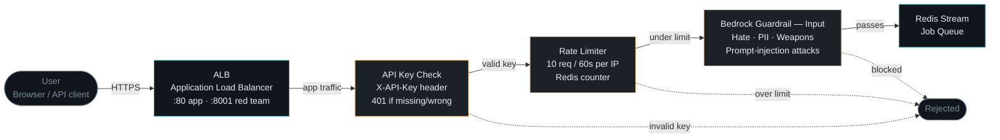
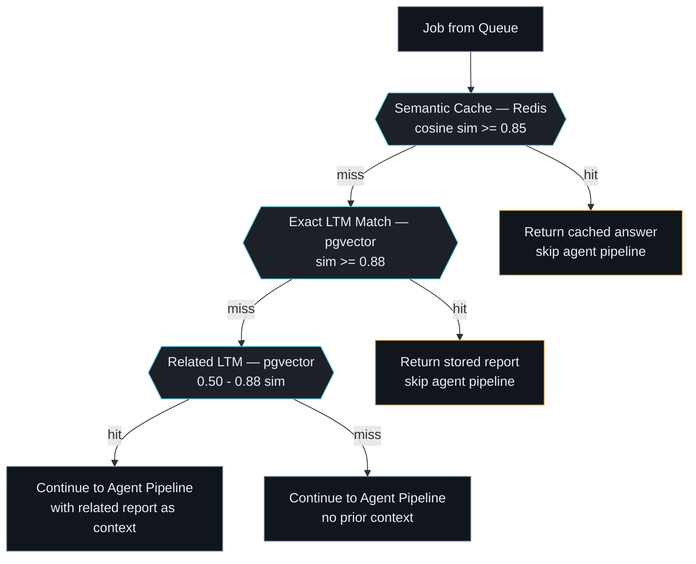
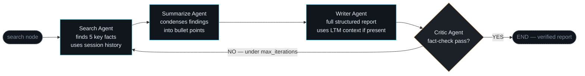
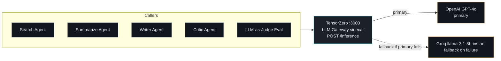
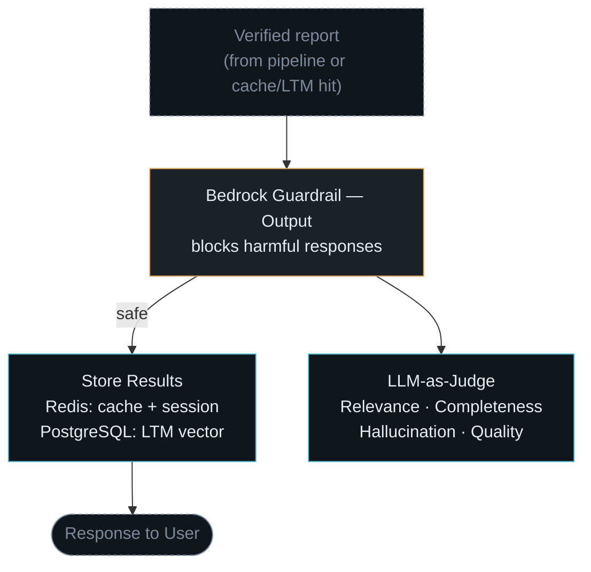
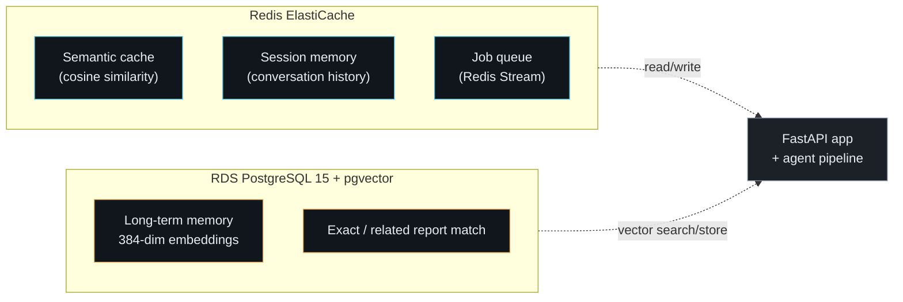
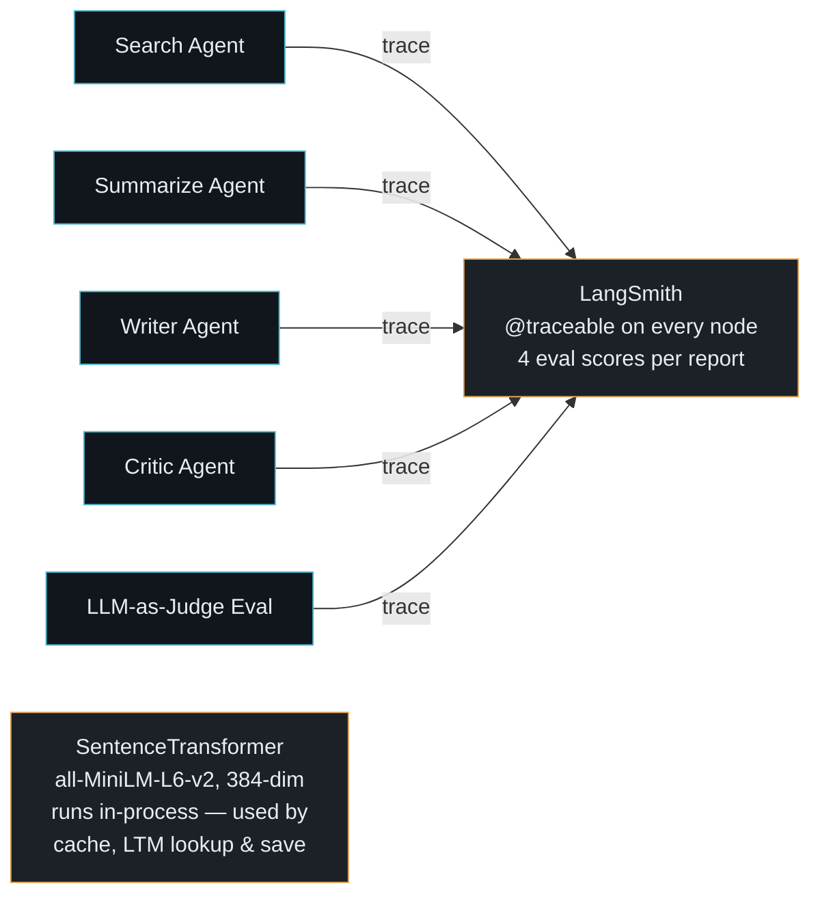
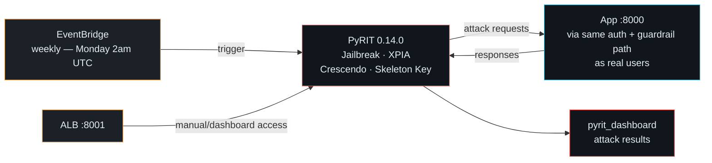
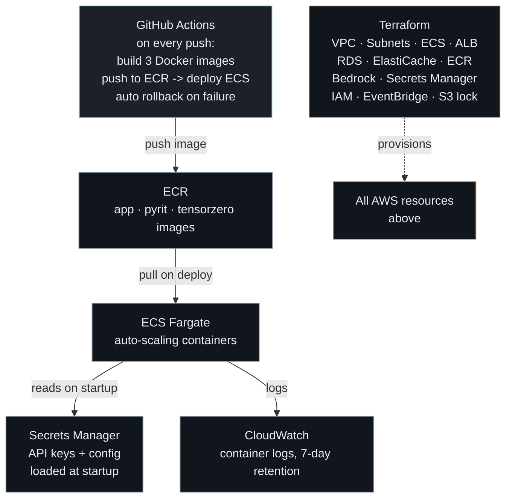
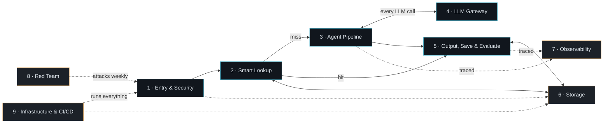

# Enterprise Multi-Agent AI Research Platform — Layer-by-Layer Guide

This document explains the system one layer at a time. Each section answers three
questions: **what does this layer do**, **why does it exist** (the problem it solves),
and **how does it work** (walked through the diagram). Read top to bottom and you are
reading the exact path a single user request takes through the system.

> Source of truth: `CODE/app/*.py`, `CODE/tensorzero/`, `CODE/pyrit_dashboard/`, `CODE/terraform/`.
> Per-layer diagrams also live as standalone `.mmd` files in this folder (`01-…` to `09-…`).

---

## Table of Contents

1. [Entry &amp; Security](#1-entry--security)
2. [Smart Lookup (Cache + Memory)](#2-smart-lookup-cache--memory)
3. [Multi-Agent Pipeline](#3-multi-agent-pipeline)
4. [LLM Gateway](#4-llm-gateway)
5. [Output, Save &amp; Evaluate](#5-output-save--evaluate)
6. [Storage](#6-storage)
7. [Observability](#7-observability)
8. [Red Team](#8-red-team)
9. [Infrastructure &amp; CI/CD](#9-infrastructure--cicd)
10. [Putting It All Together](#10-putting-it-all-together)

---

## 1. Entry & Security

**What it does:** Every HTTP request to the platform passes through three checkpoints,
in order, before it is allowed to become a job: is the caller who they claim to be
(auth), are they calling too often (rate limit), and is the content of their request
safe to process (input guardrail). Only requests that clear all three reach the queue.

**Why it exists:** An LLM-backed API is expensive to run and easy to abuse — a single
unauthenticated, unthrottled endpoint invites cost blowouts (someone hammering your
OpenAI bill) and abuse (someone using your app to generate harmful content). This
layer is the platform's front door lock, not an afterthought bolted on later.

**How it works:**

- **API Key Check** (`auth.py`) — every request must carry an `X-API-Key` header
  matching a key issued via Secrets Manager. Wrong or missing key → `401` immediately,
  before any other work happens.
- **Rate Limiter** — a Redis counter keyed by client IP, allowing 10 requests per
  60-second window. This is cheap to check (one Redis `INCR`) and stops both accidental
  retries-storms and deliberate abuse.
- **Input Guardrail** — the request content is sent to AWS Bedrock Guardrails, which
  screens for hate speech, PII, weapons content, and prompt-injection attacks *before*
  any LLM ever sees the text. This is a critical ordering choice: the guardrail runs
  on raw user input, not on an agent's interpretation of it.
- Only after all three checks pass does the request become a job on the **Redis
  Stream** queue, decoupling "request accepted" from "request processed."

**Key file:** `auth.py`, `main.py`

---

## 2. Smart Lookup (Cache + Memory)

**What it does:** Before the system spends money running four LLM agents, it checks
three progressively "looser" sources to see if the answer is already known: an exact
semantic cache, an exact long-term-memory (LTM) match, and a *related* LTM match.

**Why it exists:** Running the full agent pipeline (Search → Summarize → Write →
Critic) costs multiple LLM calls per request. If a user — or a *different* user —
already asked a near-identical question, re-running the whole pipeline is pure waste.
This layer is the platform's cost-control mechanism, and it also makes repeat queries
feel instant.

**How it works:**

- **Semantic Cache** (`cache.py`) — the incoming topic is embedded and compared against
  recently cached queries in Redis using cosine similarity. A similarity ≥ 0.85 is
  treated as "the same question" and the cached answer is returned immediately —
  no LLM call at all.
- **Exact LTM Match** (`memory.py`) — if the cache misses, pgvector in Postgres is
  searched for a stored report with similarity ≥ 0.88. This catches cases the
  short-lived Redis cache has already evicted but that were fully researched before.
- **Related LTM** — if there's no exact match but something in the 0.50–0.88 range
  exists, that's not close enough to reuse outright, but it *is* useful context: it's
  passed into the Writer Agent later so the new report can build on prior research
  instead of starting from zero.
- Only a total miss across all three sends the request into the agent pipeline with
  no prior context.

**Key file:** `cache.py`, `memory.py`

---

## 3. Multi-Agent Pipeline

**What it does:** This is the actual "research" work — a LangGraph state machine of
four specialized agents that turns a topic into a fact-checked report.

**Why it exists:** A single LLM call asked to "write a good research report" tends to
produce shallow, unverified output. Splitting the job into narrow, single-purpose
agents — one that *only* finds facts, one that *only* condenses them, one that
*only* writes, one that *only* checks — produces better output than one generalist
call, and it gives the system a natural place to insert a quality gate (the Critic)
and a retry loop.

**How it works:**

- **Search Agent** — given the topic (and the last 4 turns of session history, so it
  understands what the user already knows / cares about), asks the LLM to surface 5
  key facts and recent developments.
- **Summarize Agent** — condenses the raw search output into structured bullet points.
- **Writer Agent** — drafts the full report (Executive Summary, Key Findings, Analysis,
  Conclusion). If Layer 2 found a *related* prior report, that context is injected
  here so the new report explicitly builds on / updates the old one.
- **Critic Agent** — re-reads the finished report and checks it for factual consistency
  and logical coherence, answering simply YES or NO (with a reason).
- **The loop:** if the Critic says NO and the pipeline hasn't yet hit
  `agent_max_iterations`, the Orchestrator routes control back to the Search node for
  another pass. If the Critic says YES (or the retry budget is exhausted), the graph
  ends and the report moves on to Layer 5.

**Key file:** `agents.py` (`ResearchState`, `SearchAgent`, `SummarizeAgent`,
`WriterAgent`, `CriticAgent`, `OrchestratorAgent`, `build_graph`)

---

## 4. LLM Gateway

**What it does:** Every one of the four agents, plus the evaluator in Layer 5, makes
its LLM calls through a single shared sidecar — TensorZero — instead of calling
OpenAI or Groq directly.

**Why it exists:** Hard-coding a provider SDK into every agent means every provider
outage, rate limit, or pricing change becomes a code change in five places. Centralizing
routing means the *agents* only know "call the LLM gateway" — provider selection,
retries, and failover are the gateway's job, not theirs. It also gives one place to
add a new model or provider later without touching agent code at all.

**How it works:**

- Each agent calls `POST /inference` on TensorZero (`:3000`), naming a function
  (`research_summarize`, `report_write`) rather than a model — TensorZero maps the
  function to a concrete provider/model.
- **Primary route:** OpenAI GPT-4o.
- **Fallback route:** if the primary call fails, TensorZero automatically retries
  against Groq's `llama-3.1-8b-instant` — a faster, cheaper model that keeps the
  system available even during an OpenAI outage, at some quality cost.
- The agents themselves add their own retry wrapper (`retry.py`) on top of this, so a
  transient failure doesn't immediately propagate up as a pipeline error.

**Key file:** `tensorzero/` (config + templates), `retry.py`

---

## 5. Output, Save & Evaluate

**What it does:** Once a report exists — whether freshly written by the pipeline or
returned instantly from Layer 2's cache/LTM hit — it passes through an output safety
check, gets persisted, and is scored for quality, all before (or alongside) being
returned to the user.

**Why it exists:** Checking user *input* for safety isn't enough — a model can still
generate harmful content on its own even from a benign prompt. A second guardrail on
the *output* closes that gap. Separately, every report is worth saving (so future
requests can hit Layer 2's cache) and worth scoring (so the team has an ongoing
signal on quality, not just a "looks fine" assumption).

**How it works:**

- **Output Guardrail** — the finished report goes through Bedrock Guardrails again,
  this time checking the *generated* content rather than the user's input.
- **Save** (`output.py`) — on a safe result, the report is written to Redis (as a
  cache entry and as session history) and to PostgreSQL (as a new LTM vector entry),
  so it can be found by Layer 2 the next time someone asks something similar.
- **Evaluate** (`eval.py`) — independently, an LLM-as-Judge call scores the report on
  four dimensions: Relevance, Completeness, Hallucination, and Quality. This runs in
  parallel with the save step and doesn't block the response to the user.
- The user receives the response as soon as the save completes — evaluation is
  fire-and-forget from the user's perspective, feeding observability (Layer 7) instead.

**Key file:** `output.py`, `eval.py`

---

## 6. Storage

**What it does:** Two managed AWS data services underpin every other layer: Redis for
anything fast and short-lived, PostgreSQL (with the pgvector extension) for anything
that needs durable semantic search.

**Why it exists:** These aren't two arbitrary databases — they're chosen for very
different access patterns. Redis is used wherever *speed* matters more than
durability (a rate-limit counter, a semantic cache, a job queue — all fine to lose on
restart). Postgres+pgvector is used wherever *durability and similarity search* matter
more than raw speed (long-term memory that has to survive restarts and be searchable
by embedding similarity).

**How it works:**

- **Redis ElastiCache** holds three logically distinct things on one cluster: the
  semantic cache (Layer 2), session/conversation memory (used by the Search Agent),
  and the job queue (Layer 1's Redis Stream).
- **RDS PostgreSQL 15 + pgvector** stores every finished report as a 384-dimension
  embedding vector plus its text, enabling both "exact" and "related" similarity
  search (Layer 2's two LTM checks).
- Every other layer talks to these two services rather than to each other directly —
  they're the shared state that lets a stateless FastAPI app scale horizontally
  while still remembering prior conversations and reports.

**Key infra:** Redis ElastiCache, RDS PostgreSQL 15 + pgvector (provisioned by
Terraform — see Layer 9)

---

## 7. Observability

**What it does:** Every agent node's execution is traced, and every report gets its
four evaluation scores recorded — giving a full, queryable timeline of what the
system did for any given request.

**Why it exists:** A multi-agent pipeline with retries is hard to debug from logs
alone — "why did this report take 3 iterations?" or "which agent produced the bad
fact?" needs structured tracing, not `print()` statements. LangSmith gives every node
a span with inputs/outputs, so a failure or quality regression can be traced back to
the exact agent call that caused it.

**How it works:**

- Each agent method is decorated with `@traceable`, so LangSmith automatically
  captures its inputs, outputs, and timing as part of a larger trace for the whole
  request.
- The Eval step's four scores (Relevance, Completeness, Hallucination, Quality) are
  attached to that same trace, so quality data and execution data live together.
- **SentenceTransformer** (`all-MiniLM-L6-v2`) runs *in-process*, not as a network
  call — it's what turns text into the 384-dim embeddings used by the semantic cache,
  LTM lookups, and save step. Because it's local, it doesn't add gateway latency or
  cost to every embedding operation.

**Key tools:** LangSmith (`@traceable`), SentenceTransformer (in-process embeddings)

---

## 8. Red Team

**What it does:** A dedicated adversarial testing service (PyRIT) attacks the
platform's own `/query` endpoint the same way a malicious user would — jailbreaks,
cross-prompt injection (XPIA), Crescendo (gradual escalation), and Skeleton Key
attacks — both on demand and automatically once a week.

**Why it exists:** Guardrails (Layers 1 and 5) are a static defense; they need to be
continuously tested against evolving attack techniques, or you're trusting that they
still work without evidence. Running the platform's own defenses against a real
attack library, on a schedule, turns "we have guardrails" into "we have guardrails
that we verify weekly."

**How it works:**

- **PyRIT** runs as its own ECS task, completely separate from the main app task, and
  is reachable through its own ALB port (`:8001`) for manual/dashboard access.
- **EventBridge** fires a scheduled trigger every Monday at 2am UTC, kicking off a
  full automated attack run with no human involvement.
- Critically, PyRIT's attack requests hit the **same** `:8000` app endpoint — going
  through the *same* auth, rate-limit, and guardrail path as any real user request —
  so a passing red-team run is genuine evidence the production defenses hold up, not
  a test of some separate mock.
- Results are surfaced in the `pyrit_dashboard` for review.

**Key file:** `pyrit_dashboard/`

---

## 9. Infrastructure & CI/CD

**What it does:** Defines and automates everything the previous eight layers run on
— the AWS resources themselves (via Terraform) and the pipeline that builds and
ships new code onto them (via GitHub Actions).

**Why it exists:** Manually clicking through the AWS console to provision a VPC, ECS
cluster, RDS instance, and IAM roles is slow and impossible to reproduce reliably.
Terraform makes the entire infrastructure a versioned, reviewable text file; GitHub
Actions makes every code change automatically become a running container without a
human doing it by hand — which also means every deploy is auditable and reversible.

**How it works:**

- **GitHub Actions** — on every push, builds all three Docker images (app, pyrit,
  tensorzero), pushes them to ECR, and triggers an ECS deployment. If the new
  deployment fails health checks, it automatically rolls back.
- **ECR** stores the built images; **ECS Fargate** runs them as auto-scaling
  containers without the team managing EC2 instances directly.
- **Secrets Manager** holds every API key and config value, loaded once at container
  startup rather than baked into the image or committed to source.
- **CloudWatch** collects container logs with a 7-day retention window.
- **Terraform** is the single source of truth that provisions *all* of the above —
  VPC, subnets, ECS, ALB, RDS, ElastiCache, ECR, Bedrock access, Secrets Manager,
  IAM roles, EventBridge, and the S3 state lock — so the entire environment can be
  torn down and rebuilt from code.

**Key files:** `terraform/`, `.github/workflows/`

---

## 10. Putting It All Together

Reading top to bottom traces one real request end to end:

1. **[Entry &amp; Security](#1-entry--security)** lets the request in (or rejects it).
2. **[Smart Lookup](#2-smart-lookup-cache--memory)** checks if the work is already done.
3. If not, **[Multi-Agent Pipeline](#3-multi-agent-pipeline)** does the research,
   calling out through the **[LLM Gateway](#4-llm-gateway)** for every model call.
4. **[Output, Save &amp; Evaluate](#5-output-save--evaluate)** safety-checks, persists,
   and scores the result.
5. **[Storage](#6-storage)** is the shared state every layer above reads/writes.
6. **[Observability](#7-observability)** watches all of it happen, continuously.
7. **[Red Team](#8-red-team)** independently attacks the same path every week to
   verify the defenses in step 1 and step 4 actually hold.
8. **[Infrastructure &amp; CI/CD](#9-infrastructure--cicd)** is what all of the above
   actually runs on, and how new versions of it get shipped.

