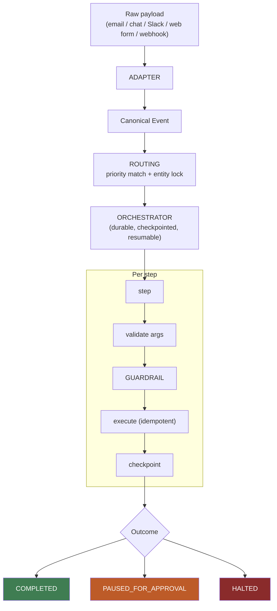
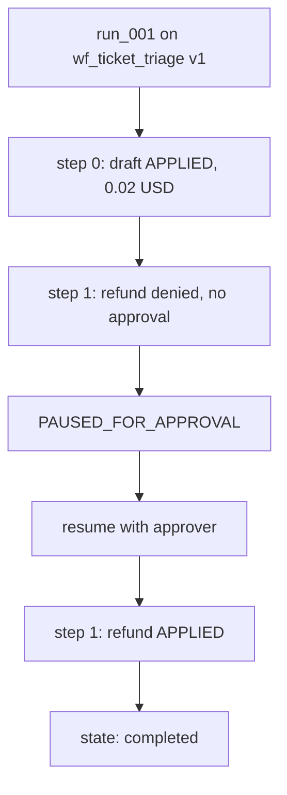
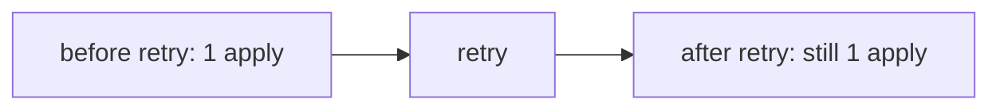
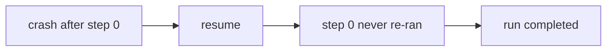
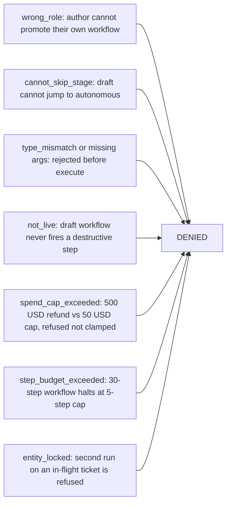

# Agent Platform — AI Agent Platform for Non-Technical Users

A deterministic guardrail-and-orchestration engine for the problem named in DevRev's system design
prep guide as Problem Type A: **"design an AI agent platform for non-technical users to configure
workflow automations across multiple channels."** Third project in the series, same discipline as
`enterprise_rag_platform` and `delivery_framework_platform` — a real, runnable system that proves
the properties it claims.

No LLM anywhere in this project — the "agent reasoning loop" is a fixed, deterministic step
sequence, so every test is fast and exactly reproducible. See `docs/04-system-design-coverage-map.md`
for the honest list of what that trades away.

---

## The business case

**The claim §3.1 makes:** the hard part isn't running an agent, it's letting someone non-technical
configure one *safely*. This project turns "safely" into checkable properties instead of a slide:

1. **A destructive action never executes without either an explicit human approval or an explicit
   per-tenant allow-list entry** — even on a fully autonomous workflow.
2. **A retried or redelivered action never applies its side effect twice** — proven with a real
   idempotency key, not asserted.
3. **A crash mid-run never re-runs a step that already completed** — proven by actually crashing a
   run and resuming it.

> *"Why didn't Cascade Robotics' $500 refund fire automatically?"*

| Question                              | What actually happened                                                                                                               |
| ------------------------------------- | ------------------------------------------------------------------------------------------------------------------------------------ |
| Wasn't the workflow autonomous?       | Yes — but`issue_refund` wasn't allow-listed for autonomous use on this tenant, so it still needed a human.                        |
| Wasn't there budget?                  | The tenant's spend cap is $50. A $500 refund is refused outright —`spend_cap_exceeded` — never silently clamped down to the cap. |
| What if it retries and refunds twice? | It can't — the idempotency key on that specific action already exists after the first apply; a retry is a no-op.                    |

---

## Quick start

```bash
# 1. The happy path - staged rollout, routing conflict, approval, idempotent retry, crash + resume
python scripts/run_workflow_demo.py

# 2. The negative-control demo - the one to run in front of an interviewer
python scripts/demo_guardrail_failure.py

# 3. Tests
python -m pytest -q     # 21 tests, deterministic, no API calls, well under a second
```

---

## Documentation

| File                                                | What it is                                                                                               |
| --------------------------------------------------- | -------------------------------------------------------------------------------------------------------- |
| **`docs/01-theory.md`**                     | The concepts, and why the shape mirrors the other two projects. Read first.                              |
| **`docs/02-architecture-end-to-end.md`**    | The pipeline, diagrammed end to end.                                                                     |
| **`docs/03-src-modules-reference.md`**      | Every function in`src/agent_platform`, 2-3 lines each.                                                 |
| **`docs/04-system-design-coverage-map.md`** | Every pointer from the prep doc's §3, checked against what's built, with a "what would it take" column. |
| **`notebooks/02-hands-on.ipynb`**           | Builds and runs the whole platform, step by step.                                                        |
| **`INTERVIEW_SCRIPT.md`**                   | How to present this on a whiteboard in 60 minutes.                                                       |

---

## Architecture



Every outcome is explicit and observable — COMPLETED, PAUSED_FOR_APPROVAL, or HALTED. There's no
fourth "it just stopped and nobody knows" path; that's the "never a silent stop" property.

### The guardrail decision, in order (deny overrides)

| #  | Rule                                            | Denies when                                                                                 |
| -- | ----------------------------------------------- | ------------------------------------------------------------------------------------------- |
| 1  | `step_budget_exceeded`                        | the run already used its (workflow-vs-policy, whichever is tighter) step allowance          |
| 2  | `spend_cap_exceeded`                          | this step's real cost (the actual refund amount, for a financial tool) would exceed the cap |
| 3  | `shadow_mode`                                 | the workflow is in`SHADOW` — destructive steps never execute here, unconditionally       |
| 4  | `not_live`                                    | the workflow hasn't been promoted to`LIVE` yet                                            |
| 5  | `needs_human_approval`                        | destructive, not allow-listed for autonomous use, and no approver present                   |
| — | `autonomous_allowlisted` / `human_approved` | the two ways a destructive step is actually allowed to run                                  |

**`step_budget_exceeded` vs. `spend_cap_exceeded` — two different quantities, not two severities of
the same check.** The step budget counts *how many steps* a run has taken — a quantity limit that
guards against a run looping forever, regardless of what each step costs. The spend cap counts *actual
dollars* one step is about to spend — a money limit that guards against one costly action, regardless
of how many steps came before it. A run can trip one without ever touching the other: a long chain of
cheap steps trips the step budget without ever approaching the spend cap; a single large refund trips
the spend cap on step one, having barely used any step budget at all.

### Staged rollout

`DRAFT → TESTING → SHADOW → LIVE → AUTONOMOUS`, one stage at a time, promoted only by an `approver`
or `admin` — never by the workflow's own author.

| Stage | The one question it answers | What breaks if you skipped it |
| --- | --- | --- |
| `DRAFT` | "Is this even wired correctly?" — right trigger, right tool, no typos | You'd test your first idea against real customer messages |
| `TESTING` | "Does it behave correctly on realistic input?" — run against sample/historical data, off to the side | You'd only find out it's wrong after it's already watching live traffic |
| `SHADOW` | "Does it decide correctly on *live* traffic?" — watches real events, decides what it *would* do, every write mocked | You'd only discover bad decisions after it had already refunded someone for real |
| `LIVE` | "Will a human still catch a bad individual action?" — acts for real, but every destructive step needs a person to approve it first | You'd jump from "looked fine in shadow" to acting alone, with no one ever watching one real action first |
| `AUTONOMOUS` | "Has this earned the right to act without asking every time?" — same guardrails still apply; only the default flips from ask-first to act-first | Not skippable in the same sense — it's the destination, not a gate |

**How a non-technical user actually moves through this, in practice:** they build the workflow (or
clone a template) — it starts in `DRAFT`. They click "run against sample data" — that's `TESTING`,
nothing customer-facing yet. Once that looks right, someone promotes it to `SHADOW` — it now watches
real, live traffic and logs what it *would* do, but every write is faked, so no real customer is ever
touched; this is where trust gets built at zero risk. Once shadow results look good, it's promoted to
`LIVE` — it acts for real, but every destructive step pauses for a human to click "approve." Only
after a track record in `LIVE` does it get promoted to `AUTONOMOUS`, acting on its own by default for
the specific actions pre-approved for that. The person who *built* the workflow can never promote it
themselves at any of these steps — the same separation-of-duties instinct as requiring a second
reviewer, just applied to rollout instead of code review.

---

## Layout

```
agent_platform/
├── data/case_study.json          Cascade Robotics scenario
├── docs/                         01-theory, 02-architecture, 03-src-reference, 04-coverage-map
├── notebooks/02-hands-on.ipynb
├── scripts/                      run_workflow_demo.py, demo_guardrail_failure.py, _scenario.py
├── src/agent_platform/
│   ├── models.py                  Event, WorkflowSpec, Step, Decision, Run
│   ├── identity.py                 the four roles
│   ├── channels.py                 webhook/Slack/email -> canonical Event
│   ├── routing.py                  matching + priority + the entity lock
│   ├── tools.py                    the typed tool registry + arg validation
│   ├── workflows.py                versioning + staged-rollout promotion
│   ├── guardrails.py               the per-step authorization decision
│   ├── orchestrator.py             the durable, idempotent execution loop
│   └── observability.py            run trace rendering + persistence
├── tests/test_platform.py         21 tests
└── INTERVIEW_SCRIPT.md
```

---

## Verified results

Everything below was produced by actually running `scripts/run_workflow_demo.py` and
`scripts/demo_guardrail_failure.py`.

**Happy path** — `run_001`, `wf_ticket_triage` v1. Refund is paused until an approver resumes; then it applies. Op-cost is 0.02 USD; the real refund amount is what counts against the spend cap.



**Idempotency** — `issue_refund` is not applied twice on retry.



**Durability** — crash after step 0, then resume. Step 0 does not run again.



**Negative controls** — all correctly denied.



**Tests** — 21, all passing, all deterministic (no LLM in this project at all).

### Read these numbers honestly

**This is one tenant, one scenario, run in-process.** The locks, idempotency-key store, and workflow
version store are all plain Python dicts — correct in shape, not backed by anything that survives a
process restart or is shared across workers. That gap is named directly in
`docs/04-system-design-coverage-map.md`'s scale section, not hidden.

---

## What this deliberately does *not* do

Named because an architect should know where the demo ends:

- **No real authoring surface.** There's no visual builder and no natural-language-to-spec
  compiler — `WorkflowSpec` objects are built directly in Python here, standing in for what either
  would emit.
- **The "agent runtime" is a fixed step list, not a real LLM choosing tools dynamically.** The loop
  shape (plan → select → call → observe → iterate, with a hard step cap) is real; the planner isn't.
- **No connector layer or secrets vault.** Tool calls are simulated; nothing here actually
  authenticates against Zendesk, Slack, or a billing system.
- **No PII redaction.** `enterprise_rag_platform`'s `redact_pii()` is directly reusable for this and
  isn't wired in yet.
- **Locks and idempotency keys are in-process only.** Correct logic, wrong storage for anything past
  a single process — see the scale section of `docs/04`.
