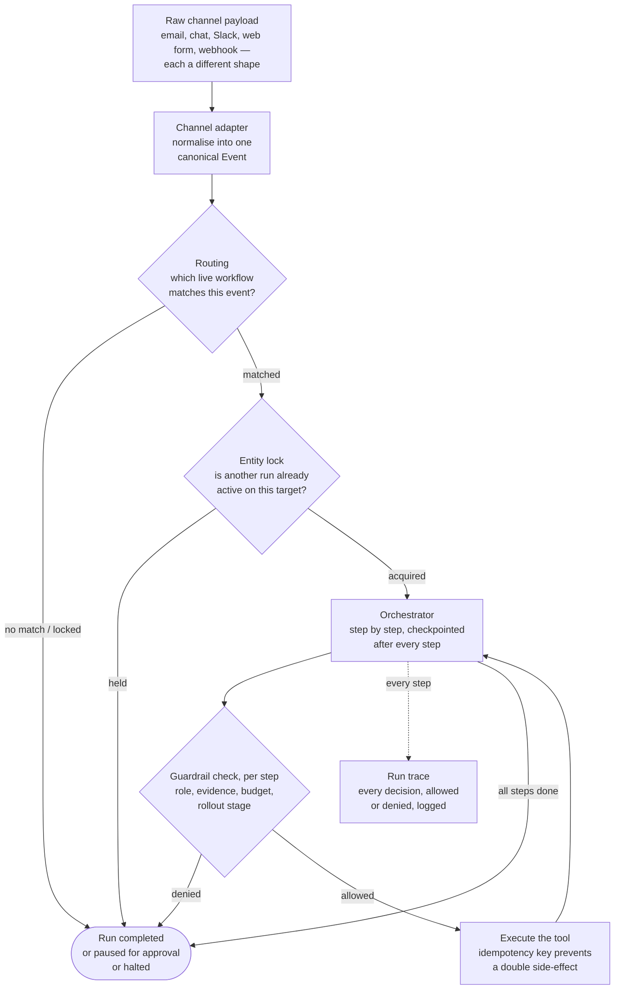
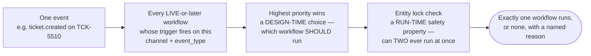
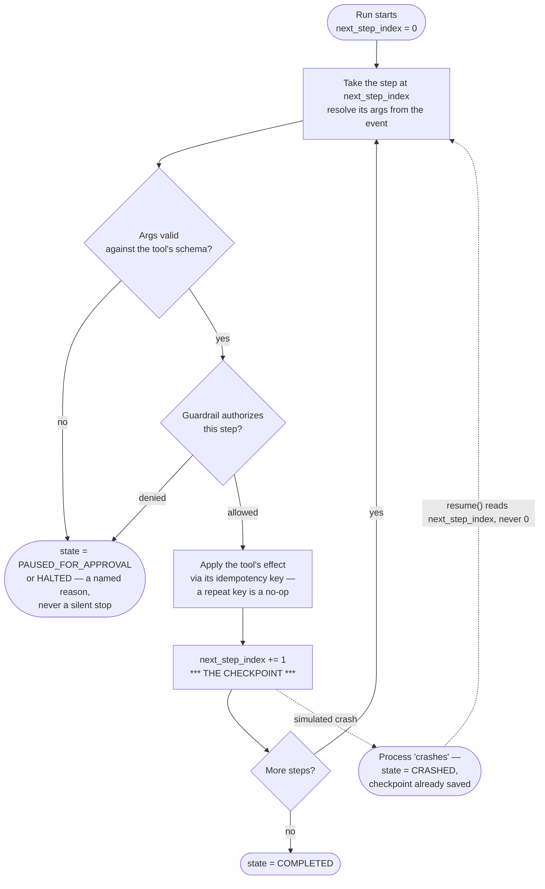

# End-to-End Architecture

**What this is:** the whole pipeline, event through completed run, as diagrams with plain-English
boxes — same style as the other two projects' `docs/06`/`docs/02`. Find the box, say the one-liner.

**How to use it:** §1 is the 30,000-ft picture. §2 is trigger/routing + conflict resolution. §3 is
the orchestration engine (the core of the system — durability and idempotency). §4 is the pointer
table.

---

## 1. The 30,000-ft picture

**One line per box:**
- **Raw channel payload** — whatever a webhook, Slack event, or email actually looks like on the wire.
- **Channel adapter** — translates it once, at the edge, into the one shape everything downstream understands.
- **Routing** — matches an event to the highest-priority live workflow whose trigger fires on it; a draft workflow never matches a real event.
- **Entity lock** — refuses a second concurrent run against the same target (a ticket, an order), independent of and on top of the priority ordering.
- **Orchestrator** — executes one step, checkpoints, executes the next — never the whole run at once.
- **Guardrail check** — the same decision, every step: right role/evidence, within budget, allowed at this rollout stage.
- **Execute the tool** — validated args, an idempotency key so a retry can never double-apply a side effect.
- **Run trace** — every one of the above, allowed or denied, is already logged as it happens.
- **Run completed** — one of three honest outcomes: done, paused for a human, or halted with a named reason — never a silent failure.

---

## 2. Routing and conflict resolution

**Why two separate mechanisms, not one:** priority ordering is a *configuration* decision an admin
makes on purpose — it answers "if two workflows both want this event, which one is right?" The
entity lock is a *safety* property that holds even if priority was misconfigured or two workflows
were accidentally given the same priority — it answers "can two workflows ever both be mutating the
same ticket at the same time?" The two questions are independent, so they're two independent checks.

---

## 3. The orchestrator — durability and idempotency (the one to draw from memory)

**The one line that matters:** *"The checkpoint is `next_step_index`, not a separate mechanism —
`resume()` and a fresh `run_workflow()` call the exact same execution loop. There is no special
'recovery path' with its own bugs; there's just one loop that always starts wherever
`next_step_index` says to start, whether that's 0 or mid-run."*

**Why idempotency has to be a key on the *action*, not a flag on the *run*:** a run-level "already
started" flag would still let two different attempts at the *same step* both fire if the run legitimately
retries after a transient failure. Keying by `{run_id}:{step_name}` means the specific action is
what's deduplicated — reruns of the *loop* are fine and expected; reruns of one already-applied
*side effect* are not, and the two are told apart precisely.

---

## 4. Pointer table — "where is X implemented?"

| Ask about... | File | Function / class |
|---|---|---|
| The canonical Event, WorkflowSpec, Step, Decision, Run | `models.py` | `Event`, `WorkflowSpec`, `Step`, `Decision`, `Run`, `RunState` |
| The four sign-off roles | `identity.py` | `get_principal()`, `list_principals()` |
| Channel-to-Event normalisation | `channels.py` | `from_webhook()`, `from_slack()`, `from_email()` |
| Matching + conflict resolution | `routing.py` | `matching_workflows()`, `route()`, `selected_workflow()`, `acquire_lock()`/`release_lock()` |
| The tool registry + arg validation | `tools.py` | `REGISTRY`, `validate_args()` |
| Versioning + staged-rollout promotion | `workflows.py` | `WorkflowStore`, `promote()` |
| The guardrail decision engine | `guardrails.py` | `GuardrailPolicy`, `authorize_step()` |
| The orchestration loop, durability, idempotency | `orchestrator.py` | `run_workflow()`, `resume()`, `_continue()`, `external_call_count()` |
| Run trace rendering + persistence | `observability.py` | `render_run()`, `write()` |
| All tunables (default caps) | `config.py` | `SETTINGS` |
| The happy-path demo | `scripts/run_workflow_demo.py` | — |
| The negative-control demo | `scripts/demo_guardrail_failure.py` | — |
| Tests | `tests/test_platform.py` | — |

---

## See also

- `01-theory.md` — the concepts, and why the shape mirrors the other two projects on purpose
- `03-src-modules-reference.md` — every function, 2-3 lines each
- `04-system-design-coverage-map.md` — checked against the prep doc, gap by gap
- `../INTERVIEW_SCRIPT.md` — the whiteboard script
