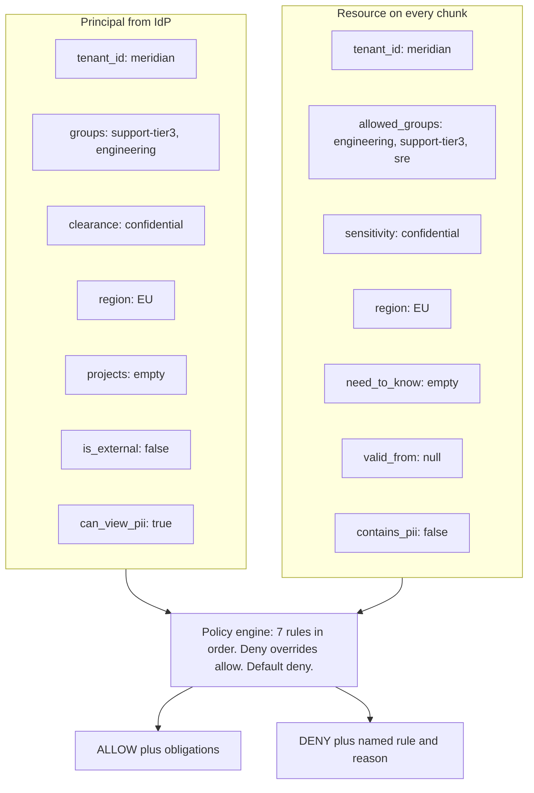

# Security Checks Reference — every field, every rule, worked

**What this is:** the complete list of checks the platform runs on a document, what each one reads,
and exactly how each persona is affected. Every example below is **real output from the running
system**, not illustration.

**How to use it in an interview:** §2 and §3 are the two tables to be able to sketch from memory.
§4 gives you a one-line answer plus a concrete example for each check. §8 is the artefact to show.

---

## 0. Two different "layers" — don't mix them up

The codebase uses the word "layer" for **two unrelated splits**. Same word, two different axes. This
trips people up in interviews, so keep them separate:

```
SPLIT A — WHERE the tenant boundary lives           SPLIT B — WHEN a check runs

  "Physical" layer                                    "Layer 1"
  → one Chroma COLLECTION per tenant                  → pre-filter, pushed into the index
  → you cannot query across it, full stop               (runs BEFORE retrieval)

  "Logical" layer                                     "Layer 2"
  → the ABAC `where` clause inside that                → authoritative re-check
    collection (clearance, region, groups...)             (runs AFTER retrieval)
```

**Split A — Physical vs. Logical** (from `store.py`) answers: *"how is one tenant's data kept away
from another's?"*
- **Physical** = a hard wall — one Chroma collection per tenant. Even a missing/broken filter cannot
  leak across tenants, because the wrong tenant's data isn't in the collection being searched.
- **Logical** = the ABAC filter *inside* that tenant's own collection (clearance, region, groups...).

**Split B — Layer 1 vs. Layer 2** (§7 below) answers: *"of all the ABAC checks, which ones run before
retrieval vs. after?"* This split lives entirely **inside** Split A's "Logical" layer:
- **Layer 1** = the subset of ABAC rules that can be compiled into a Chroma `where` clause and pushed
  down before the vector search runs. Fast, but only an optimisation — allowed to overshoot.
- **Layer 2** = the full policy re-run on every retrieved chunk, after retrieval, before the chunk is
  allowed near the model. This is the one that is actually trusted.

```
                 ┌───────────────── one tenant's Chroma collection ─────────────────┐
                 │                                                                    │
  physical  ─────►   logical (ABAC)                                                  │
  wall            │       │                                                          │
  (Split A)       │       ├── Layer 1: pre-filter (pushed into the query)  [Split B] │
                  │       │        ↓ candidates                                      │
                  │       └── Layer 2: post-retrieval re-check              [Split B]│
                  │                ↓ only these reach the model                      │
                  └────────────────────────────────────────────────────────────────┘
```

> **Interview line:** *"Physical vs. logical is about where the tenant wall sits — a collection
> boundary versus a filter clause. Layer 1 vs. layer 2 is a completely separate split, about timing —
> which ABAC checks run before the vector search versus after it. Layer 1 and 2 both live inside the
> 'logical' box; physical isolation is a wall Layer 1/2 never even needs to reason about."*

---

## 1. The shape of the decision

Two bundles of attributes meet at a policy engine. Nothing else participates — **no LLM is involved
in any access decision, ever.**



---

## 2. Document fields — what each one is for

Every field exists to answer one specific question. This is the table to be able to draw.

| Field                 | Type     | Example                               | The question it answers                | Rule it feeds                     |
| --------------------- | -------- | ------------------------------------- | -------------------------------------- | --------------------------------- |
| `doc_id`            | string   | `PM-2026-03-14`                     | identity, citation target              | citation verification             |
| `tenant_id`         | string   | `meridian`                          | which customer owns this?              | **1. tenant isolation**     |
| `sensitivity`       | enum     | `confidential`                      | how damaging if it leaks?              | **2. clearance**            |
| `sensitivity_level` | int 0–3 | `2`                                 | numeric form so the index can do`<=` | **2. clearance** (pushdown) |
| `region`            | enum     | `EU`                                | where may it be processed?             | **3. data residency**       |
| `valid_from`        | date     | `2026-09-01`                        | is it published yet?                   | **4. embargo**              |
| `valid_until`       | date     | `null`                              | has it expired?                        | **4. expiry**               |
| `need_to_know`      | list     | `[vuln-response]`                   | which compartment?                     | **5. need-to-know**         |
| `source`            | enum     | `contract`                          | what kind of document?                 | **6. external restriction** |
| `allowed_groups`    | list     | `[engineering, support-tier3, sre]` | who was granted it?                    | **7. group membership**     |
| `contains_pii`      | bool     | `true`                              | does it hold personal data?            | **obligation:** redact      |
| `owner`             | string   | `ingest-team`                       | who to ask for access                  | operational                       |

**The sensitivity ladder** is ordered, not a set — clearance `confidential` reads everything at or
below it:

```
   public (0)  <  internal (1)  <  confidential (2)  <  restricted (3)
```

**Three sources of truth to keep straight.** These fields are *not* invented by the RAG pipeline —
they are a translation of each source system's own permission model (Confluence space permissions,
Zendesk organisations, SharePoint groups). **Getting that translation wrong is the number one cause
of enterprise RAG leaks**, which is why the ingest pipeline refuses documents it cannot map (§6).

---

## 3. Principal fields — what the caller brings

| Field                        | Type   | Example                          | Where it comes from          |
| ---------------------------- | ------ | -------------------------------- | ---------------------------- |
| `user_id` / `user_email` | string | `u_marco_t3`                   | SSO / OIDC claim             |
| `tenant_id`                | string | `meridian`                     | workspace or org binding     |
| `groups`                   | list   | `[support-tier3, engineering]` | SCIM-synced directory groups |
| `clearance`                | enum   | `confidential`                 | HR / entitlement system      |
| `region`                   | enum   | `EU`                           | employment location          |
| `projects`                 | list   | `[vuln-response]`              | compartment assignment       |
| `is_external`              | bool   | `false`                        | contractor flag              |
| `can_view_pii`             | bool   | `true`                         | privacy entitlement          |

> **Resolved fresh on every request** — never cached in a session, never read from anything the user
> controls. This is what makes live revocation work: remove someone from a group and the *very next
> query* enforces it, with no reindexing.

---

## 4. The seven checks

Evaluated **in order**. The **first** deny wins and short-circuits — so a document may violate
several rules and you only ever see the first. (That ordering is why the `external_restriction` rule
was initially invisible in the test suite: `clearance` denied first for every contractor case, so it
never fired. A dedicated high-clearance contractor persona was added to unmask it.)

```
  1 tenant_isolation ─┐
  2 clearance         │  DENY rules — any hit stops here
  3 data_residency    │
  4 embargo / expiry  │
  5 need_to_know      │
  6 external          ─┘
                       ↓  (nothing denied)
  7 group_membership  ── the ONLY rule that can grant
                       ↓  (no grant matched)
    default_deny
```

---

### Check 1 — Tenant isolation

**Reads:** `principal.tenant_id` vs `resource.tenant_id`
**Rule:** different tenant → deny. Unconditionally, for every role.

```
  principal : u_attacker_other_tenant   tenant=acme
              clearance=restricted  region=EU
              groups=[support-tier3, engineering, sales, legal, security]
              projects=[vuln-response]
  document  : CT-KST-003   tenant=meridian
  DECISION  : DENY [tenant_isolation]
  reason    : principal tenant 'acme' != resource tenant 'meridian'
```

**Why this example matters:** that principal holds **every group and the highest clearance** and can
read **0 of 22 documents**. No accumulation of privilege crosses a tenant boundary.

> **Interview line:** *"Tenant isolation is checked first and can't be overridden by anything. My
> negative-control persona has every group and top clearance and sees literally nothing."*

---

### Check 2 — Clearance ladder

**Reads:** `resource.sensitivity_level` vs `principal.clearance_level`
**Rule:** document more sensitive than the caller → deny.

```
  principal : u_lena_t1   clearance=internal   role=Tier 1 Support Agent
  document  : CT-KST-003  sensitivity=confidential
  DECISION  : DENY [clearance]
  reason    : resource is 'confidential' but principal clearance is 'internal'
```

**The subtlety worth stating:** clearance is *necessary but not sufficient*. Marco has `confidential`
clearance and is still denied every contract — see check 7.

---

### Check 3 — Data residency

**Reads:** `resource.region` vs `principal.region`. `GLOBAL` resources are readable from anywhere.
**Rule:** region-locked document + caller elsewhere → deny.

```
  principal : u_lena_t1   region=EU
  document  : TK-4488     region=US
  DECISION  : DENY [data_residency]
  reason    : resource is locked to region 'US', principal is in 'EU'
```

**The demo that lands:** `u_marco_t3` and `u_jin_us_t3` have the **identical role, clearance and
groups** — Tier-3 Escalation Engineer, `confidential`, `[support-tier3, engineering]`. The only
difference is `region=EU` vs `region=US`, and it changes what they can read:

| Document          | region | marco (EU)   | jin (US)     |
| ----------------- | ------ | ------------ | ------------ |
| `PM-2026-03-14` | EU     | ✅           | ❌ residency |
| `TK-4471`       | EU     | ✅           | ❌ residency |
| `TK-4488`       | US     | ❌ residency | ✅           |
| `RB-101`        | GLOBAL | ✅           | ✅           |

> This is a real contractual term in the corpus — the Vertex MSA states EU telemetry may not be
> accessed from outside the EU. **A contract clause became a policy rule.**
>
> Note `GLOBAL` is a value, not a wildcard, on the *principal* side: `u_ravi_sec` is `region=GLOBAL`
> and is therefore denied the EU-locked post-mortem.

---

### Check 4 — Embargo / expiry

**Reads:** `resource.valid_from`, `resource.valid_until` vs **today**
**Rule:** before publication or after expiry → deny.

```
  principal : u_ravi_sec   clearance=restricted   projects=[vuln-response]
  document  : SA-2026-07   sensitivity=restricted  valid_from=2026-09-01
  DECISION  : DENY [embargo]
  reason    : resource is embargoed until 2026-09-01 (today is 2026-08-22)
```

Ravi has the correct clearance **and** the correct compartment — the only thing standing between him
and the document is the clock. The same principal + document flips to ALLOW on 2026-09-01, with no
data change.

> **Why this cannot be pushed into the vector index:** it needs "now". A cached filter would happily
> serve an unpublished security advisory. This is one of the two rules that *must* be evaluated after
> retrieval — see §5.

---

### Check 5 — Need-to-know (compartments)

**Reads:** `resource.need_to_know` vs `principal.projects`
**Rule:** document in a compartment the caller isn't assigned to → deny.

```
  principal : u_erin_secmgr   clearance=restricted   projects=[]
  document  : SA-2026-05      need_to_know=[vuln-response]
  DECISION  : DENY [need_to_know]
  reason    : principal lacks need-to-know compartment(s): vuln-response
```

**The pair that teaches it:** Ravi and Erin both hold `restricted` clearance and both are in the
`security` group. Ravi has the `vuln-response` compartment; Erin does not.

|                   | clearance  | groups                | projects                | SA-2026-05      |
| ----------------- | ---------- | --------------------- | ----------------------- | --------------- |
| `u_ravi_sec`    | restricted | security, engineering | **vuln-response** | ✅ ALLOW        |
| `u_erin_secmgr` | restricted | security              | —                      | ❌ need_to_know |

> **Interview line:** *"Clearance is a ladder, compartments are orthogonal. Top clearance doesn't get
> you into a compartment you're not assigned to — that's the difference between 'how sensitive' and
> 'need to know'."*

---

### Check 6 — External principals

**Reads:** `principal.is_external`, `resource.source`
**Rule:** external principals may never read `contract`, `pricing`, or `postmortem` — regardless of
groups or clearance.

```
  principal : u_dana_ext   is_external=true   clearance=confidential
              groups=[sales, engineering, account-management]
  document  : CT-KST-003   source=contract
              allowed_groups=[sales, legal, account-management]
  DECISION  : DENY [external_restriction]
  reason    : external principal may not read source 'contract'
```

**Why this persona exists:** Dana has `confidential` clearance *and* is in the `sales` group — every
ordinary grant says yes. `is_external` is the only thing that stops her. Without a high-clearance
contractor, this rule is permanently shadowed by check 2 and never actually tested.

> **Interview line:** *"A category-level rule that ignores the grant graph entirely. Useful when the
> constraint is contractual rather than organisational — a contractor's NDA doesn't care which group
> someone put them in."*

---

### Check 7 — Group membership (the only ALLOW)

**Reads:** `principal.groups` ∩ `resource.allowed_groups`
**Rule:** non-empty intersection → **allow**. Documents carrying the pseudo-group `public` are
readable by everyone in the tenant.

```
  principal : u_lena_t1   groups=[support-tier1]
  document  : RB-101      allowed_groups=[engineering, support-tier3, sre]
  DECISION  : DENY [default_deny]
  reason    : no grant matched; the default is deny
```

Note the rule name: nothing *denied* Lena — no rule granted her, and **the default is deny**. That is
41 of the denials in this corpus, the single largest category.

> **Interview line:** *"Clearance says how sensitive a thing you may read; groups say which things.
> You need both, and the absence of a grant is itself a denial."*

---

## 5. Obligations — conditions attached to an ALLOW

An allow is not always unconditional. Obligations are the part of ABAC people forget exists.

| Obligation       | Fires when                                                             | Effect                                                      |
| ---------------- | ---------------------------------------------------------------------- | ----------------------------------------------------------- |
| `redact_pii`   | `resource.contains_pii` **and not** `principal.can_view_pii` | direct identifiers masked before the text reaches the model |
| `audit_access` | `resource.sensitivity` ∈ {confidential, restricted}                 | access recorded with user, doc, rule                        |

```
  u_tom_contractor -> TK-4488   obligations=['redact_pii']
     doc contains_pii=true    principal can_view_pii=false
     "Reporter dan.okafor@northgateretail.example reports timeouts."
       becomes
     "Reporter [REDACTED_EMAIL] reports timeouts."

  u_marco_t3 -> PM-2025-11-03  obligations=['audit_access']
     doc sensitivity=confidential
```

**The point:** Tom is *allowed* to read that ticket. He is not allowed to read the customer's email
address in it. Same document, same query, transformed on the way out — and `u_lena_t1`, who has
`can_view_pii=true`, sees the address intact.

> ⚠️ **A failure mode worth knowing:** on Databricks this mask is a SQL `regexp_replace`, and a `\w`
> character class gets eaten by the Python → Spark SQL escaping chain. The mask then *looks*
> correctly attached and silently redacts nothing. Use explicit ranges (`[A-Za-z0-9._%+-]+@…`) and
> **always assert on real data** — this exact bug shipped and was only caught by reading the output.

---

## 6. Checks outside the ACL — the rest of the pipeline

Access control is the core, but it isn't the only gate.

| # | Check                                   | Where                 | What it does                                                                                                                                                                                                |
| - | --------------------------------------- | --------------------- | ----------------------------------------------------------------------------------------------------------------------------------------------------------------------------------------------------------- |
| A | **ACL validation on ingest**      | ingest                | Refuses any document with unknown sensitivity, no`allowed_groups`, unknown region, or a public/non-public group mismatch. **An unmappable document is quarantined, not defaulted to `internal`.** |
| B | **Pre-filter compilation**        | query, pre-retrieval  | Compiles the decidable part of the policy into the vector store's filter (§7)                                                                                                                              |
| C | **Authoritative re-check**        | query, post-retrieval | Full policy re-run on freshly resolved attributes — the real decision                                                                                                                                      |
| D | **Pre-filter disagreement alarm** | query                 | If C denies something B allowed*for a reason B should have caught*, the index is stale or the filter is broken → **security event**                                                                |
| E | **Context sufficiency**           | pre-generation        | `sufficient` / `partial` / `insufficient`. Partial still answers the part it can. Prevents both hallucination and over-refusal                                                                        |
| F | **Citation validity**             | post-generation       | Every cited doc must exist, must have been in context, and must**still** be readable. A citation is itself a disclosure                                                                               |
| G | **Groundedness**                  | post-generation       | Does each claim follow from the passages? Recorded per run                                                                                                                                                  |
| H | **Refusal hygiene**               | on refuse             | Never reveals that withheld material exists — "there's a document you can't see" is a leak                                                                                                                 |
| I | **Leak gate**                     | CI                    | Forbidden documents must never reach the model.**Must be 0 or the release is blocked**                                                                                                                |

**On prompt injection:** there is deliberately no check for it, because the defence is architectural.
No prompt says *"do not reveal confidential information"*. The unauthorised text never enters the
context window, so there is nothing to reveal regardless of what the user types.

---

## 7. Where each check runs — and why the split matters

*(This is "Split B" — layer 1 vs. layer 2 — from §0. Not to be confused with the physical/logical
split, which is about tenant isolation, not check timing.)*

The vector store's filter language is weaker than the policy language, so the policy is split.

| Check                     | Pushed into the index (layer 1) | Re-checked after retrieval (layer 2) | Why                                                                         |
| ------------------------- | ------------------------------- | ------------------------------------ | --------------------------------------------------------------------------- |
| 1 tenant                  | ✅                              | ✅                                   | trivially expressible                                                       |
| 2 clearance               | ✅                              | ✅                                   | numeric`<=`                                                               |
| 3 residency               | ✅                              | ✅                                   | equality /`IN`                                                            |
| 7 groups                  | ✅                              | ✅                                   | via one boolean column per group                                            |
| 6 external                | ✅                              | ✅                                   | source`NOT IN`                                                            |
| **4 embargo**       | ❌                              | ✅                                   | **needs "now" — a stale filter would serve an unpublished advisory** |
| **5 need-to-know**  | ❌                              | ✅                                   | **list semantics the filter language cannot express**                 |
| **obligations**     | ❌                              | ✅                                   | **a transformation, not a filter**                                    |
| **live revocation** | ❌                              | ✅                                   | **the index is a snapshot; group membership may have changed**        |

> **The one line:** *the filter makes retrieval cheap, the post-check makes it correct.*

**Layer 1 overshooting is by design, not a bug.** Measured on the running system:

```
persona       layer1 overshoot      REACHED MODEL   gate
secops        ['SA-2026-07']        none            PASS
sec_mgr       ['SA-2026-07']        none            PASS
```

Both personas' index queries return the embargoed advisory — correctly, because embargo isn't in the
filter — and layer 2 stops it. **That column is the clearest possible argument for why layer 2 is not
optional.** Gate a release on layer 1 alone and you get false alarms; gate on what actually reaches
the model and you get the truth.

---

## 8. The visibility matrix — the artefact to show

22 documents × 9 personas, decided by the policy engine alone. `Y` = readable, `.` = denied.

```
document        src        sens          lena  marco  sofia   ravi   erin    tom   dana    jin  attkr
SA-2026-05      advisory   restricted       .      .      .      Y      .      .      .      .      .
SA-2026-07      advisory   restricted       .      .      .      .      .      .      .      .      .
CT-KST-003      contract   confidential     .      .      Y      .      .      .      .      .      .
CT-NGR-002      contract   confidential     .      .      .      .      .      .      .      .      .
CT-VTX-001      contract   confidential     .      .      Y      .      .      .      .      .      .
HC-001..004     helpcenter public           Y      Y      Y      Y      Y      Y      Y      Y      .
PM-2025-11-03   postmortem confidential     .      Y      .      Y      .      .      .      Y      .
PM-2026-01-22   postmortem confidential     .      Y      .      Y      .      .      .      Y      .
PM-2026-03-14   postmortem confidential     .      Y      .      .      .      .      .      .      .
PR-001          pricing    confidential     .      .      Y      .      .      .      .      .      .
PR-002          pricing    confidential     .      .      Y      .      .      .      .      .      .
RB-101..104     runbook    internal         .      Y      .      Y      .      .      Y      Y      .
TK-4471         ticket     internal         Y      Y      .      .      .      .      .      .      .
TK-4488         ticket     internal         .      .      .      .      .      Y      .      Y      .
TK-4502         ticket     internal         Y      Y      .      .      .      Y      .      Y      .
TK-4519         ticket     internal         Y      Y      .      .      .      .      .      .      .
```

**Denials by rule, across the whole matrix:**

| Rule                     | Count |
| ------------------------ | ----- |
| `default_deny`         | 41    |
| `data_residency`       | 29    |
| `clearance`            | 28    |
| `tenant_isolation`     | 22    |
| `external_restriction` | 5     |
| `embargo`              | 2     |
| `need_to_know`         | 1     |

**How much of the corpus each persona can reach:**

| Persona                     | Readable          | Role                                     |
| --------------------------- | ----------------- | ---------------------------------------- |
| `u_marco_t3`              | **14 / 22** | Tier 3 Escalation Engineer (EU)          |
| `u_jin_us_t3`             | 12 / 22           | Tier 3 Escalation Engineer (US)          |
| `u_ravi_sec`              | 11 / 22           | Security Engineer                        |
| `u_sofia_am`              | 8 / 22            | Enterprise Account Manager               |
| `u_dana_ext`              | 8 / 22            | External Consultant (high clearance)     |
| `u_lena_t1`               | 7 / 22            | Tier 1 Support Agent                     |
| `u_tom_contractor`        | 6 / 22            | Contractor (Tier 1, US)                  |
| `u_erin_secmgr`           | 4 / 22            | Security Manager (no compartment)        |
| `u_attacker_other_tenant` | **0 / 22**  | Other tenant, every group, top clearance |

---

## 9. Four documents, every persona — the walkthroughs

These are the ones to talk through, because each is denied for a *different* reason per person.

### `PM-2026-03-14` — post-mortem, confidential, EU, `[engineering, support-tier3, sre]`

| Persona                     | Verdict  | Why                                                              |
| --------------------------- | -------- | ---------------------------------------------------------------- |
| `u_marco_t3`              | ✅ ALLOW | + obligation`audit_access`                                     |
| `u_lena_t1`               | ❌       | `clearance` — internal < confidential                         |
| `u_sofia_am`              | ❌       | `default_deny` — clearance fine, **no group grants it** |
| `u_jin_us_t3`             | ❌       | `data_residency` — same role as Marco, wrong region           |
| `u_ravi_sec`              | ❌       | `data_residency` — GLOBAL ≠ EU                               |
| `u_dana_ext`              | ❌       | `data_residency` (would also fail `external`)                |
| `u_attacker_other_tenant` | ❌       | `tenant_isolation`                                             |

**Six personas, four different denial reasons.** This single row is the best 60 seconds of the demo.

### `CT-VTX-001` — contract, confidential, EU, `[sales, legal, account-management]`

Only `u_sofia_am` reads it. **Marco is denied by `default_deny`** — he has the clearance but not the
group. That's the clearance-vs-groups distinction in one line.

### `SA-2026-07` — advisory, restricted, GLOBAL, `[security]`, ntk `[vuln-response]`, from `2026-09-01`

**Nobody** reads it today. Ravi and Erin are stopped by `embargo`; everyone else by `clearance` or
`tenant_isolation`. On 2026-09-01, Ravi gains access and Erin still does not — she lacks the
compartment.

### `TK-4488` — ticket, internal, **US**, `[support-tier1, support-tier3, engineering]`, PII

Only the two US personas read it. `u_tom_contractor` gets it **with `redact_pii`**; `u_jin_us_t3`
gets it intact. Everyone else, including Tier-1 Lena who has the right group, is stopped by
`data_residency`.

---

## 10. Quick reference

**The seven checks, in order:**

| #  | Check            | One-liner                                 |
| -- | ---------------- | ----------------------------------------- |
| 1  | tenant isolation | different customer → nothing, ever       |
| 2  | clearance        | how sensitive a thing may you read        |
| 3  | data residency   | where may it be processed                 |
| 4  | embargo / expiry | is it published yet, still valid          |
| 5  | need-to-know     | which compartment                         |
| 6  | external         | contractors can't read commercial sources |
| 7  | group membership | **the only rule that grants**       |
| — | default deny     | no grant matched                          |

**Plus two obligations:** `redact_pii`, `audit_access`.

**Six things to be able to say:**

1. *"Deny overrides allow, and the default is deny. Only one rule can grant."*
2. *"Clearance is a ladder; groups are a grant; compartments are orthogonal. You need all three."*
3. *"The first deny wins, so a document may fail several rules and you only see one — which is how a rule can sit permanently untested."*
4. *"Embargo and need-to-know can't be pushed into the index, which is exactly why the post-retrieval check is the authority."*
5. *"Obligations mean an allow isn't always unconditional — read the ticket, but not the customer's email."*
6. *"No LLM participates in any access decision. Prompt injection is defended architecturally: the text was never retrieved."*
7. *"Physical vs. logical is where the tenant wall sits; layer 1 vs. layer 2 is when an ABAC check runs. The second split lives entirely inside the logical layer — see §0."*

---

## See also

- `01-theory.md` — the concepts, plain language
- `02-hands-on.ipynb` — build and run it locally
- `03-theory-databricks.md` — the same policy as Unity Catalog row filters and column masks
- `04-databricks-enterprise-rag.ipynb` — the Lakehouse version, runnable
- `../INTERVIEW_SCRIPT.md` / `../INTERVIEW_SCRIPT_DATABRICKS.md` — the 60-minute whiteboard scripts
