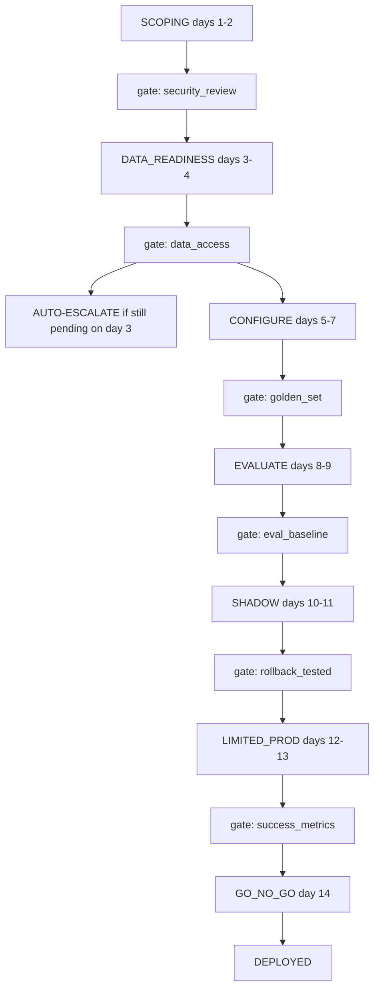

# Delivery Framework — Scoping Doc to Deployed Agent in Under 2 Weeks

A gate-enforcing state machine for the delivery framework named in DevRev's system design prep guide
as Problem Type C: **"design a delivery framework that takes a customer from scoping doc to deployed
AI agent in under 2 weeks."** Built the same way `enterprise_rag_platform` was built for Problem Type
B — a real, runnable system that proves the properties it claims, not a slide describing them.

No LLM anywhere in this project — every gate decision is deterministic.

---

## The business case

**The claim §5.1 makes:** *"the correct answer is a productised delivery process backed by reusable
assets — not heroics and not bespoke code per customer."* That claim is easy to assert and easy to
fake with a slide. This project turns it into two checkable properties instead:

1. **A stage cannot be entered while any gate blocking it is still pending** — enforced in code, not
   left to whoever is running the engagement to remember.
2. **A stage's work is either pulled from a reusable accelerator library or logged as custom-built,
   with no third option** — so "productised vs. bespoke" is a measured ratio, not a claim.

> *"Why did the Northwind Logistics engagement stall at day 3?"*

| Who's asking                                                                        | What actually happened                                                                           |
| ----------------------------------------------------------------------------------- | ------------------------------------------------------------------------------------------------ |
| The FDA, wanting to sign off the security gate themselves                           | Denied —`wrong_role`. Only a security reviewer can sign that gate, however senior the FDA is. |
| The customer SME, trying to sign the data-access gate with "looks good" as evidence | Denied —`no_evidence`. An approval with no artefact behind it isn't a sign-off.               |
| Anyone, on day 3, with data access still not granted                                | The system escalates automatically — nobody had to notice and raise it.                         |

Getting this right — **provably**, not by writing "get security sign-off" in a process doc — is what
this project is about.

---

## Quick start

```bash
# 1. The happy path - Northwind Logistics, all 14 days, every gate signed in order
python scripts/run_engagement_demo.py

# 2. The negative-control demo - the one to run in front of an interviewer
python scripts/demo_gate_failure.py

# 3. Tests
python -m pytest -q     # 17 tests, deterministic, no API calls, well under a second
```

---

## Documentation

| File                                                | What it is                                                                                                                                                   |
| --------------------------------------------------- | ------------------------------------------------------------------------------------------------------------------------------------------------------------ |
| **`docs/01-theory.md`**                     | The concepts, and why the shape deliberately mirrors`enterprise_rag_platform`. Read first.                                                                 |
| **`docs/02-architecture-end-to-end.md`**    | The pipeline, diagrammed end to end, plain-English boxes.                                                                                                    |
| **`docs/03-src-modules-reference.md`**      | Every function in`src/delivery_framework`, 2-3 lines each.                                                                                                 |
| **`docs/04-system-design-coverage-map.md`** | Every pointer from the prep doc's §5 (and relevant §7/§9), checked against what's actually built — with a "what would it take to close this gap" column. |
| **`notebooks/02-hands-on.ipynb`**           | Builds and runs the whole pipeline, step by step.                                                                                                            |
| **`INTERVIEW_SCRIPT.md`**                   | How to present this on a whiteboard in 60 minutes (the 6-step framework).                                                                                    |

---

## Architecture

Stages in order, each blocked by the gate in front of it. If data access is still pending on day 3, the engagement auto-escalates — nobody has to notice.



`advance_stage()` only ever moves to the immediate next stage — there is no code path that skips
one. Every gate's sign-off decision follows the same three ordered rules, deny-overrides, same shape
as the RAG project's ABAC engine:

| # | Rule                      | Denies when                                                                           |
| - | ------------------------- | ------------------------------------------------------------------------------------- |
| 1 | `wrong_role`            | the signer's role isn't in the gate's`allowed_roles` — no exceptions for seniority |
| 2 | `no_evidence`           | an approval with no artefact behind it                                                |
| 3 | `prior_gate_incomplete` | an earlier-stage gate hasn't passed yet — no signing out of order                    |

### The six gates

| Gate                       | Blocks entry to          | Signed by         |
| -------------------------- | ------------------------ | ----------------- |
| `security_review_passed` | Data readiness           | security reviewer |
| `data_access_granted`    | Configure                | customer SME      |
| `golden_set_signed_off`  | Evaluate                 | customer SME      |
| `eval_baseline_met`      | Shadow mode              | FDA               |
| `rollback_tested`        | Limited production       | FDA               |
| `success_metrics_met`    | *(go/no-go — deploy)* | sponsor           |

### The accelerator library

Every stage pulls from a fixed registry of connectors, prompt templates, an eval harness, guardrail
policies, and dashboard templates before building anything custom. The ratio of pulled-vs-custom is
`metrics.py::accelerator_reuse_rate()` — on the Northwind demo, **83%** (5 of 6 assets reused, one
guardrail policy custom-built).

---

## Layout

```
delivery_framework_platform/
├── data/
│   └── case_study.json          Northwind Logistics scenario
├── docs/                        01-theory, 02-architecture, 03-src-reference, 04-coverage-map
├── notebooks/02-hands-on.ipynb
├── scripts/                     run_engagement_demo.py, demo_gate_failure.py
├── src/delivery_framework/
│   ├── models.py                 Stage, Gate, Engagement, Decision, Principal
│   ├── identity.py                the four sign-off roles
│   ├── gates.py                   the 6 gate definitions + sign_off() decision engine
│   ├── pipeline.py                intake() - refuses unmeasurable/no-SME requests
│   ├── engine.py                  advance_stage(), mark_deployed(), escalation
│   ├── accelerators.py            the reusable asset library
│   ├── metrics.py                 the 5 tracked metrics
│   └── observability.py           event-log rendering + persistence
├── tests/test_gates.py           17 tests
└── INTERVIEW_SCRIPT.md
```

---

## Verified results

Everything below was produced by actually running `scripts/run_engagement_demo.py`.

```
customer                      Northwind Logistics
stage                         Go/no-go and handover
day                           14
deployed                      True
gates_passed                  1.0        (6 of 6)
time_to_first_value_days      1
eval_score_at_handover        0.83
human_approval_override_rate  0.27
accelerator_reuse_rate        0.83
open_escalations              1          (the day-3 auto-escalation, resolved by the gate passing)
```

**Tests** — 17, all passing, all deterministic (no LLM in this project at all).

### Read these numbers honestly

**This is one engagement, run once.** `time_to_first_value_days = 1` and `eval_score_at_handover = 0.83` are demo-scripted values, not measurements from a real customer delivery — the point being
proven is that the *pipeline enforces its own gates*, not that these particular numbers are typical.
`golden_set_harness` is pulled from the accelerator library as a *named asset*; nothing in this repo
actually runs a real eval harness against it. The real one — recall@k, MRR, groundedness, a zero-leak
security gate — already exists one project over, in `enterprise_rag_platform`. Wiring the Evaluate
stage to genuinely call it is on the punch list in `docs/04-system-design-coverage-map.md`, not done
here.

---

## What this deliberately does *not* do

Named because an architect should know where the demo ends:

- **No real infrastructure provisioning.** "Configure, do not code" is modeled as pulling named
  assets from a registry, not actually standing up connectors, prompts, or guardrails against a real
  customer environment.
- **The eval harness is referenced, not run.** `eval_baseline_met`'s evidence is an asserted string
  in the demo script, not a computed score.
- **One engagement at a time.** No portfolio view, no per-person capacity model — see
  `docs/04-system-design-coverage-map.md`'s scale-gap section.
- **No change-control mechanism yet.** Scope creep is named as a risk in the prep doc; there's no
  `request_scope_change()` gate in this codebase, though it would reuse `gates.py::sign_off()`'s
  exact pattern.
- **Rollback is an attestation, not a mechanism.** `rollback_tested` is a real, enforced gate, but
  nothing here actually performs a versioned rollback — the gate certifies it was tested elsewhere.
