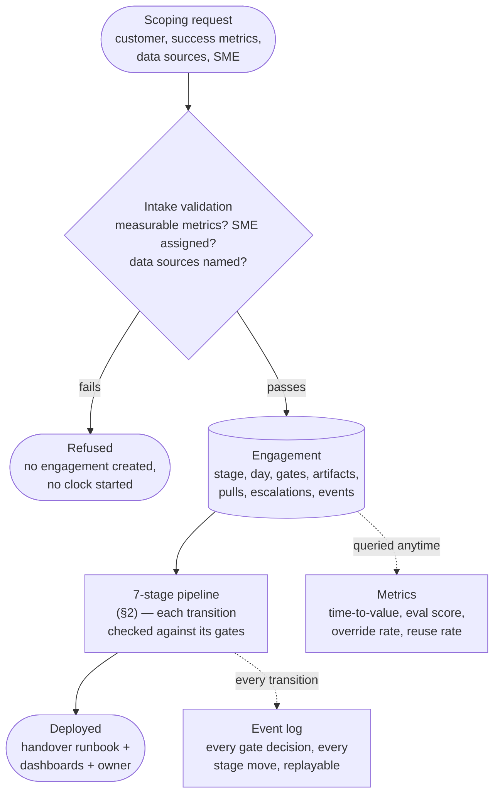
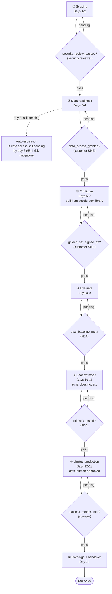
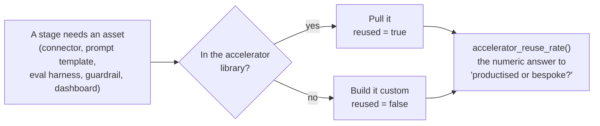

# End-to-End Architecture

**What this is:** the whole pipeline, intake through deployment, as diagrams with plain-English
boxes — same style as `enterprise_rag_platform/docs/06-architecture-end-to-end.md`. Find the box,
say the one-liner. File/function pointers live in §4, not in the diagrams themselves.

**How to use it:** §1 is the 30,000-ft picture. §2 is the gate/stage state machine (the core of the
system). §3 is the accelerator library and metrics. §4 is the pointer table.

---

## 1. The 30,000-ft picture

**One line per box:**

- **Scoping request** — the raw ask: who, what they want measured, what data, who signs off on their side.
- **Intake validation** — refuses to start rather than starting a clock against something unmeasurable (§1 of the theory doc).
- **Refused** — a hard stop, not a warning; no `Engagement` object is even created.
- **Engagement** — the one piece of mutable state for a customer, threaded through every stage.
- **7-stage pipeline** — the ordered state machine; a stage cannot be entered while any gate blocking it is pending.
- **Metrics** — computed on demand from the engagement's own history, never tracked separately.
- **Event log** — every gate sign-off attempt, stage-advance attempt, escalation, and accelerator pull, whether allowed or denied.
- **Deployed** — the terminal state; only reachable from the last stage, only with its gate passed.

---

## 2. The gate/stage state machine (the one to draw from memory)

**One line per gate:** each `?` diamond is the same decision, six times over — *"has the right role
signed this off, with evidence, in order?"* Wrong role, missing evidence, or an earlier gate still
pending are each an independent hard deny; there is no override path in the code for any of them.

**The one line that matters:** *"A stage cannot be entered while any gate blocking it is pending —
that ordering is encoded in `advance_stage()`, not left to whoever is running the engagement to
remember. The same way `authorize` runs first and `enforce` runs before generation in the RAG
project — the property is in the code's structure, not a convention."*

**Why the escalation is automatic, not a reminder:** §5.4's own mitigation for data-access delay is
*"start day 1, escalate day 3"* — a date-based check, not a person remembering to chase it up.
`engine.py::check_escalation_triggers()` runs that check directly against the engagement's day and
gate state.

---

## 3. Accelerator library + metrics

**One line per box:**

- **A stage needs an asset** — every stage's real work is "get this thing," not "invent this thing."
- **In the library?** — a lookup against a fixed registry of pre-built connectors/prompts/harnesses/policies/dashboards.
- **Pull it** — the common case in a healthy delivery; costs nothing extra.
- **Build it custom** — the exception; every one is logged, because too many of these is the signal that "2 weeks" is about to slip.
- **`accelerator_reuse_rate()`** — turns "we mostly reuse the library" from a claim into a number, the same way the RAG project's eval harness turns "hybrid retrieval helps" from a claim into a number.

---

## 4. Pointer table — "where is X implemented?"

| Ask about...                                                | File                               | Function / class                                                                                                                                 |
| ----------------------------------------------------------- | ---------------------------------- | ------------------------------------------------------------------------------------------------------------------------------------------------ |
| Domain model (Stage, Gate, Engagement, Principal...)        | `models.py`                      | `Stage`, `Gate`, `Engagement`, `Decision`, `Principal`                                                                                 |
| Who can sign what off                                       | `identity.py`                    | `get_principal()`, `list_principals()`                                                                                                       |
| The 6 gates + sign-off decision engine                      | `gates.py`                       | `GATE_DEFINITIONS`, `sign_off()`, `blocking_gates()`                                                                                       |
| Intake refusal (unmeasurable metrics / no SME / no sources) | `pipeline.py`                    | `intake()`, `ScopingRefused`                                                                                                                 |
| The state machine (stage transitions, deploy, escalation)   | `engine.py`                      | `advance_stage()`, `mark_deployed()`, `check_escalation_triggers()`, `escalate()`                                                        |
| The reusable accelerator registry                           | `accelerators.py`                | `LIBRARY`, `pull_or_build()`                                                                                                                 |
| The 5 tracked metrics                                       | `metrics.py`                     | `time_to_first_value()`, `eval_score_at_handover()`, `override_rate()`, `week4_retention()`, `accelerator_reuse_rate()`, `summary()` |
| Event log / replayable record                               | `observability.py`               | `render_timeline()`, `write()`                                                                                                               |
| All tunables (escalation day, intake requirements)          | `config.py`                      | `SETTINGS`                                                                                                                                     |
| The happy-path demo                                         | `scripts/run_engagement_demo.py` | —                                                                                                                                               |
| The negative-control demo (gates actually block)            | `scripts/demo_gate_failure.py`   | —                                                                                                                                               |
| Gate-enforcement tests                                      | `tests/test_gates.py`            | —                                                                                                                                               |

---

## See also

- `01-theory.md` — the concepts, and why the shape mirrors the RAG project on purpose
- `03-src-modules-reference.md` — every function, 2-3 lines each
- `04-system-design-coverage-map.md` — checked against the prep doc, gap by gap
- `../INTERVIEW_SCRIPT.md` — the whiteboard script
