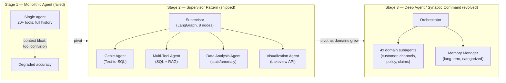

# AIA Group — Technical Implementation Flow
### Governed Multi-Agent Data Assistant on Databricks

---

## 1. The Story in Brief

AIA Group — Asia's largest publicly listed life insurer — had a data-access problem that looked simple from the outside and was genuinely hard underneath. Actuaries, claims managers, and regional analysts needed answers over governed enterprise data, but every question — no matter how routine — had to go through a BI/analyst queue. An ad-hoc question took 2–10 business days. A new dashboard took roughly four weeks, start to finish.

I led this engagement end to end: architecture, hands-on build, and delivery, inside an 8–9 week advisory-plus-build window. What follows is the technical path from a single failed prototype to a production-grade, governed multi-agent system — including the two real architectural pivots that got it there, and the reasoning behind every major tool choice.

---

## 2. Architecture Evolution — Three Stages



**Why three stages, not one design up front?** Because the first design failed in real testing, not on paper — and the second pivot happened for a different reason than the first. That distinction matters when you're explaining this in an interview: it shows iterative engineering judgment, not a plan that worked perfectly the first time.

---

## 3. Stage 1 → Stage 2: Why the Monolithic Agent Failed

A single agent carrying the full system prompt, 20+ tool schemas, and the entire conversation history broke down on two axes:

- **Context bloat** — every tool's schema and description sat in context on every turn, degrading the model's ability to reason about the actual question.
- **Tool confusion** — with that many tools competing for selection, the agent picked the wrong one often enough that accuracy became unusable for a production advisory engagement.

The fix wasn't a bigger model or better prompting. It was architectural: split "decide what to do" from "do it."

---

## 4. Stage 2: The Supervisor Pattern

### 4.1 Why LangGraph, specifically

I evaluated this against the two other common multi-agent frameworks at the time — CrewAI and AutoGen — and LangGraph won for three concrete reasons:

| Requirement | Why LangGraph fit |
|---|---|
| **Conditional routing on confidence** | LangGraph's `StateGraph` supports explicit conditional edges — `classify_intent` routes to `clarify_or_disambiguate` only when confidence < 60%. CrewAI's role-based delegation doesn't expose this kind of deterministic branching cleanly. |
| **Durable, resumable state** | AIA needed multi-turn conversations backed by Delta checkpoints (governance requirement — every conversation state must be auditable). LangGraph's checkpointer abstraction maps directly onto a Delta table; AutoGen's conversational memory model doesn't have first-class durable checkpointing. |
| **Deterministic composition** | A governed insurance environment can't tolerate open-ended agent-to-agent chat deciding its own flow. LangGraph's graph is inspectable and fixed at build time — you can point to the exact 8 nodes and say what each one does. |

### 4.2 The 8-node state machine

```
classify_intent → clarify_or_disambiguate → resolve_assets_with_context_index
    → route_to_{genie | multi_tool | analysis | visualization} → compose_answer
```

1. **`classify_intent`** — categorizes the question (`simple_kpi`, `deep_analysis`, `document_lookup`, `visualization`, `conversational`) with a confidence score.
2. **`clarify_or_disambiguate`** — fires only below the 60% confidence threshold. A question like "show me the numbers" gets a clarifying question back instead of a guess.
3. **`resolve_assets_with_context_index`** — the Supervisor, and only the Supervisor, queries a 16-asset Context Index (Genie Spaces, metric views, tables, document indexes) via Vector Search, with endorsed assets prioritized in ranking.
4. **`route_to_*`** — delegates to one of four specialist workers with the resolved asset list attached to shared graph state.
5. **`compose_answer`** — synthesizes the worker's structured output into a final, cited answer.

**Why centralize asset resolution at the Supervisor instead of letting each worker search independently?** Consistency. If the Genie agent and the Multi-Tool agent each ran their own retrieval, they could resolve to different tables for the same question — a governance nightmare in insurance, where two answers to the same question is worse than one slow answer. Centralizing costs one extra hop of latency; it buys a single, auditable source of truth for what data any given answer is based on.

### 4.3 The four specialist workers

| Agent | Role | Tools | Trade-off it embodies |
|---|---|---|---|
| **Genie Agent** | BI specialist | Genie Space API (managed text-to-SQL) | Chose a managed service over a hand-rolled text-to-SQL chain — less flexible, but far lower prompt-injection/SQL-injection surface, and non-engineers at AIA can curate the underlying tables directly. |
| **Multi-Tool Agent** | Generalist | LLM-generated SQL + Vector Search RAG over policy docs | The one place hand-generated SQL was allowed — for ad hoc questions Genie's curated scope didn't cover — deliberately narrower governance than Genie's path. |
| **Data Analysis Agent** | Statistical | Z-score anomaly detection, trend stats | Kept deterministic (no LLM-generated statistics) — anomaly thresholds are computed, not "reasoned about," to avoid the model inventing a plausible-sounding but wrong number. |
| **Visualization Agent** | Dashboard creator | Lakeview REST API | Publishes real, clickable AI/BI dashboards rather than returning a static chart image — closes the loop on the original "4-week dashboard" pain point directly. |

### 4.4 Why Unity Catalog metric views instead of raw table queries

Every agent that answers a KPI question reads from one of **seven governed metric views**, not raw fact tables. This was a deliberate governance decision: if the Genie agent and a human analyst compute "claims by region" differently — different date logic, different exclusion rules — trust in the whole system collapses. Metric views make the KPI definition a single, versioned artifact that every consumer (agent or human) shares.

### 4.5 Memory and observability

- **Short-term memory**: Delta table (`ai_ops.conversations`), keyed by `thread_id`, with checkpoints written at each key node. 30-day retention. Chosen over an in-memory-only checkpointer because AIA needed conversations to survive a serving-endpoint restart and to be auditable after the fact.
- **Prompt management**: base + overlay prompts in a Delta table (`ai_ops.agent_instructions`) with a 5-minute cache — lets me tune agent behavior in production without a redeploy, at the cost of a short propagation delay.
- **MLflow Tracing**: `@mlflow.trace` on every node with proper span types, so a wrong answer can be traced back to the exact node and tool call that produced it — non-negotiable for an insurer's audit requirements.
- **AI Gateway**: rate limiting, PII filtering, and guardrails in front of the serving endpoint — required before this could be exposed as an internal chat app at all.

### 4.6 The regional constraint that shaped the whole build

Databricks' own **Agent Bricks Multi-Agent Supervisor** — a managed version of exactly this pattern — was not GA in AIA's Azure region (SEA / East Asia) at build time. Rather than block on a Beta feature's regional rollout, I hand-built the Supervisor in LangGraph on GA primitives only (Agent Framework, Model Serving, Genie, Vector Search, Metric Views, MLflow Tracing). **Trade-off:** more code to own and maintain versus a managed service, in exchange for a production path that didn't depend on a regional Beta timeline I didn't control.

---

## 5. Stage 2 → Stage 3: The Second Pivot

As the number of analytics domains grew, the Supervisor's own tool list started re-approaching the original bloat problem — the exact failure mode from Stage 1, one level up. The fix was the same principle applied again: **specialize further.**

I evolved the architecture into a Deep Agent pattern — an orchestrator that delegates to fully self-contained subagents, each with its own prompt, its own small toolset, and its own context window, instead of one supervisor whose tool list keeps growing:

- **4 domain-specific analytics subagents** (customer analytics, distribution channels, policy & underwriting, claims analytics), each wired to its own Genie Space and its own gold/silver tables.
- **A memory-manager subagent** owning long-term, cross-conversation memory in a categorized Delta table (`preference` / `fact` / `decision` / `project` / `feedback`) — the orchestrator is required to check and update it on every turn.

**Trade-off:** more infrastructure surface (more Genie Spaces, more serving endpoints, more moving parts to operate) in exchange for a ceiling on tool-selection degradation that doesn't reappear as the system grows. For a system meant to scale across "business units and markets," that ceiling mattered more than operational simplicity.

---

## 6. Full Tech Stack

| Layer | Choice |
|---|---|
| Orchestration | LangGraph (StateGraph), Databricks Agent Framework |
| Governance | Unity Catalog (bronze/silver/gold/ai_ops schemas), 7 governed Metric Views |
| Retrieval | Databricks Vector Search (Context Index + policy-doc RAG), Genie Spaces (managed text-to-SQL) |
| Dashboards | Lakeview REST API |
| Serving | Databricks Model Serving, AI Gateway (rate limits, PII filtering, guardrails) |
| Observability | MLflow Tracing (span-level), MLflow Agent Evaluation (offline eval / LLM-as-judge) |
| Memory | Delta-backed short-term checkpoints; categorized Delta table for long-term memory |
| App layer | Databricks Apps (Dash chat UI) |

---

## 7. Results and What I'd Verify Next

- Time-to-insight: 2–10 business days → minutes.
- Dashboard delivery: ~4 weeks → fast, governed self-serve.
- ~35% YTD growth in platform consumption following rollout (correlational signal, not a controlled experiment — worth saying exactly that if pressed).
- MVP delivered in 8–9 weeks.

**If I rebuilt this today**, I'd instrument resolution-time and accuracy metrics from day one rather than relying on MLflow tracing alone for post-hoc debugging, and I'd invest earlier in the offline evaluation dataset — both flagged as Phase 2 priorities at the time, and both things I'd pull forward given the chance.

---

*Prepared for MongoDB Staff Forward Deployed Engineer interview prep · Aug 27, 2026*
