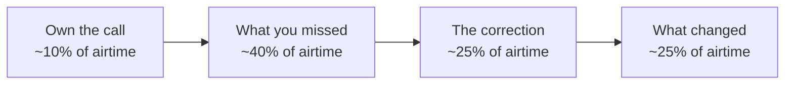

# Hiring Manager Round — Customer-Facing Competency Prep
**Sourav Banerjee** | Senior Forward Deployed Engineer

Prepared 2026-09-01

---

## How this is organised

Twenty questions across five competencies. Sixteen have drafted answers built from documented engagements. Four are marked **NEEDS INPUT** — they are failure-shaped questions that cannot be drafted without the real material, and they are the highest-risk gap in this prep.

| Competency | Questions | Drafted | Needs input |
|---|---|---|---|
| Ambiguity and discovery | 4 | 3 | 1 |
| Stakeholder influence | 4 | 4 | 0 |
| Delivery under pressure | 4 | 2 | 2 |
| Pushback and saying no | 4 | 3 | 1 |
| Scale beyond self | 4 | 4 | 0 |

### The four beats of a credible failure answer

Beat two is the one candidates skip; skipping it reads as evasion. Beat four is what separates senior from mid-level.

---

# 1. Ambiguity and discovery

*Testing: can you walk into a vague customer problem and define it yourself?*

## Q1.1 — "Tell me about a time a customer asked for something they didn't actually need."

**Anchor:** multi-agent work for the insurance client.

- **Situation.** The client came in asking for a chatbot over their [claims / policy] knowledge base. The stated ask was a RAG assistant.
- **Task.** Before building, run discovery with the [operations and risk] teams to understand what the assistant was meant to replace.
- **Action.** What surfaced was that a single-turn RAG lookup couldn't cover the actual workflow — the work required retrieval, cross-referencing, and a verification step nobody wanted a model doing unsupervised. I proposed a Supervisor–Worker multi-agent design instead: specialised workers for search, summarisation, and drafting, with a verification agent and a human checkpoint before anything left the system.
- **Result.** We shipped an architecture matching the real workflow rather than the requested one. [Add outcome metric — adoption, cycle-time reduction, or workflows onboarded.]

**Why it lands:** it shows you challenged the framing before writing code, which is the entire FDE job.

## Q1.2 — "Requirements were unclear at the start. What did you do in week one?"

**Anchor:** the insurer's Unity Catalog governance rollout.

- **Situation.** "We need governance" is one of the vaguest asks in enterprise data.
- **Action.** Week one wasn't design, it was inventory — mapping what data existed, who was touching it, and where PII actually lived versus where they believed it lived. The gap between those two was the real finding.
- **Result.** That inventory became the scoping document. It enabled a zero-downtime rollout rather than a big-bang cutover, and adoption revenue moved 35% in two months.

**Say out loud:** week one was spent reducing uncertainty, not producing artifacts.

## Q1.3 — "How do you run discovery with a client who doesn't know what they want?"

Method question, not a story question. Give the process, then one illustration.

- Start from what's painful today rather than what they want to build — pain is concrete, aspiration isn't.
- Get current-state numbers early: runtimes, failure rates, manual hours. They anchor everything downstream and give a baseline to claim credit against later.
- Talk to the people doing the work, not only the people sponsoring it. The sponsor describes the intended workflow; the operator describes the real one.
- Put a strawman architecture in front of them fast. Clients who can't articulate requirements can almost always react to a proposal.

**Illustration:** the multi-agent RCA engine — vague ask, discovery surfaced a repeating manual investigation loop, and that pattern justified building the tooling.

## Q1.4 — "Describe a project you scoped incorrectly." — **NEEDS INPUT**

**What's being tested:** whether your estimates are calibrated, and whether you notice mid-flight or only at the deadline.

**Likely anchor:** the tier-1 bank migration across APAC/EMEA/AMER — multi-region scope is where estimates usually break.

**To draft this, provide:**

1. Which engagement and roughly when.
2. The commitment you made in specific terms — timeline, workload count, or performance target.
3. What you didn't account for. Common honest candidates: source-system complexity found only after profiling, an undisclosed downstream consumer, regional data-residency constraints, or a client team less available than staffed.
4. How early you caught it and how you re-baselined with the client.
5. What actual delivery looked like versus the original commitment.
6. What you now ask for in discovery that you didn't ask for then.

**The trap:** blaming discovery quality without owning that discovery was your job. Say "I didn't ask X," not "they didn't tell me X."

---

# 2. Stakeholder influence

*Testing: can you hold a room with a CIO who outranks you?*

## Q2.1 — "How do you explain a technical tradeoff to a non-technical executive?"

**Anchor:** multi-agent autonomy debate, insurance client.

- **Situation.** Leadership wanted the agent system to make decisions autonomously. Engineering knew the failure modes.
- **Task.** Get alignment on a constrained rollout without sounding like I was slowing them down.
- **Action.** I reframed from "can the model do this" to "what happens on the day it's wrong, and who answers for it." I walked them through the observability layer — MLflow tracing on every agent step — so the tradeoff became concrete: full autonomy meant no defensible audit trail; supervised autonomy meant every decision was reconstructable.
- **Result.** They chose the supervised path, and traceability became what they cited when [risk / compliance] reviewed the system.

**Why it lands:** you translated a technical constraint into a governance argument — the language executives already speak.

## Q2.2 — "Tell me about a time you disagreed with a customer executive."

**Anchor:** the tier-1 bank migration.

- **Situation.** Multi-region programs almost always contain a sequencing disagreement — [which region first, or big-bang versus phased cutover].
- **Action.** Frame the disagreement as risk, not preference. Argue from the escalation surface: what happens to APAC trading hours if EMEA cutover goes wrong, and who is awake to fix it.
- **Result.** Zero go-live escalations across all three regions — cite this as vindication, briefly, without gloating.

**The trap:** picking a disagreement you won easily. Choose one where you had to concede something.

## Q2.3 — "The technical buyer and the economic buyer wanted different things."

**Anchor:** the insurer. Strongest story in this section — it has a commercial number attached, which most engineers can't produce.

- **Situation.** Platform teams wanted capability and control; the budget holder was measuring demonstrable consumption and ROI.
- **Action.** Didn't pick a side — found the overlap. Governance was what the platform team needed to feel safe expanding, and expansion was what the economic buyer was measuring.
- **Result.** 35% adoption revenue growth in two months — proof both sides got what they wanted.

## Q2.4 — "How do you build trust with a skeptical chief architect in 30 days?"

Method question.

- Concede their expertise on their own estate before proposing anything. They know things about their systems you won't learn in a month.
- Ship something small and real in the first two weeks. The 40+ scripts contributed to global codebases is the right kind of evidence — you gave before you asked.
- Be the person who names the risk they were privately worried about. Skeptical architects are usually skeptical because they've watched a vendor gloss over something.
- Don't oversell the platform. Naming what Databricks isn't good for buys more credibility than anything you claim it is good for.

---

# 3. Delivery under pressure

*Testing: what you do when the deployment is on fire and the customer is watching.*

## Q3.1 — "Tell me about a production issue at a customer site."

**Anchor:** multi-agent deployment.

- **Situation.** [The specific incident — LLM provider degradation, latency spike, agent loop, or retrieval quality regression.]
- **Task.** Restore behaviour without breaking the client's confidence in the whole approach.
- **Action.** We had already built LLM gateway fallback routing for exactly this failure class, so immediate mitigation was routing. The harder part was the post-incident conversation: walking the client through what failed, what the fallback caught, and what it didn't.
- **Result.** [Recovery time and the durable fix added afterward.]

**Prepare carefully.** Your resume claims zero go-live escalations, and interviewers will probe it. Give them a real near-miss with a specific hour and a specific decision. A candidate who names their close call reads as more credible than one with a spotless record.

## Q3.2 — "Go-live is in three days and you know it won't be ready. What do you do?"

Hypothetical — testing judgment and instinct, not memory. Answer in order:

- Raise it the same day. The cost of a late warning compounds; the cost of an early one is a conversation.
- Go with options, not a problem — reduced scope for the date, full scope on a new date, or a phased go-live with a subset of workloads.
- Separate what's genuinely blocking from what's merely incomplete. Much of "not ready" is polish that can follow the cutover.
- Bring your own leadership in before the customer escalates, so nobody is surprised.
- Name the decision-maker and the deadline for deciding. Ambiguity in a crisis is worse than a bad call.

**Close with:** "In practice I try never to be in this position at day three — the trend is usually visible at week two if you're tracking the right leading indicator." Then name yours.

## Q3.3 — "Describe a time you missed a deadline. How did you communicate it?" — **NEEDS INPUT**

**What's being tested:** the communication, not the miss. Do you tell customers bad news early or late?

**To draft this, provide:**

1. Engagement and the deadline that slipped.
2. The gap between what was promised and what was achievable.
3. When you raised it — how far ahead of the deadline — and to whom.
4. Whether you brought a revised plan and options, or an apology.
5. Whether you brought your own escalation path along so the customer wasn't carrying the news internally.
6. Whether the relationship held, and what the customer said afterward.

**The trap:** describing heroics — the weekend push that saved it. That answers a different question and dodges this one.

## Q3.4 — "Tell me about a customer who escalated over your head." — **NEEDS INPUT**

**What's being tested:** composure, and whether you're defensive about your own competence.

**To draft this, provide:**

1. Engagement and what triggered the escalation. Be honest about whether it was warranted.
2. Whether you got ahead of it with your own leadership before they heard from the customer.
3. What you conceded. Strong answers include a moment where you agreed with part of the complaint rather than defending the whole position.
4. The resolution, and whether the account relationship recovered — with evidence, e.g. subsequent expansion or continued engagement.

**The trap:** framing the customer as unreasonable. Even if they were, the interviewer is scoring how you talk about a difficult client while they're in the room hearing you do it.

---

# 4. Pushback and saying no

*Testing: seniority. Juniors say yes to everything.*

## Q4.1 — "Tell me about a time you told a customer no."

**Anchor:** multi-agent guardrails, financial services.

- **Situation.** The client wanted agents extended into [an automated decisioning path] with no human in the loop.
- **Task.** Decline the scope without losing the account relationship.
- **Action.** I didn't argue from principle. I ran adversarial red-teaming against the deployment using PyRIT and brought the results to the table — concrete cases where the system produced confident wrong output under adversarial framing. Then offered the alternative: keep the automation, add a confidence threshold and human escalation above it.
- **Result.** They accepted the constrained design. The red-team findings became [part of the standing evaluation suite / a reusable pattern across accounts].

**Why it lands:** "no" backed by evidence you generated is the senior version. "No" backed by opinion is the junior version.

## Q4.2 — "How do you handle scope creep on a fixed-timeline engagement?"

- **Anchor.** Any migration engagement — scope creep is universal there.
- **Action.** You don't refuse additions, you price them in time. Every new request gets logged against the timeline visibly, so the customer makes the tradeoff rather than you absorbing it silently.
- **Result.** [A specific instance where a request got deferred to a phase two, and the customer accepted it.]

**Senior framing:** absorbing scope quietly feels helpful and is the most common way engagements fail. Say that.

## Q4.3 — "Pushing back on your own company's roadmap for a customer."

**Anchor:** your field-to-product feedback loop.

- **Action.** [A specific case where a customer requirement wasn't served by the product as shipped and you either built around it or carried it back to engineering. Overwatch and UNIQ both started as gaps between what the product did and what the field needed.]
- **Result.** [Whether it shipped, or whether the workaround became reusable IP.]

**Why this question exists:** they're checking you'll advocate for the customer internally, not just represent the company externally. FDE roles fail when the engineer becomes a pure sales extension.

## Q4.4 — "Tell me about a time you walked away from an approach mid-project." — **NEEDS INPUT**

**What's being tested:** sunk-cost resistance. Can you kill your own work?

**Likely anchor:** the multi-agent or RAG work, where an initial architecture stops holding under real data — a retrieval strategy that didn't survive contact with the corpus, an agent topology that looped, or an orchestration choice you replaced.

**To draft this, provide:**

1. The engagement and the approach you abandoned.
2. How much had already been built when you concluded it wouldn't work.
3. What the evidence was — evaluation results, a latency ceiling, a cost curve.
4. How you made the case to the client to discard work they'd already paid for.
5. What the replacement did better.
6. How long the rebuild actually cost versus the projection if you'd continued.

**The trap:** picking a case where you walked away in week one. That's not a hard call. Pick one with real invested effort.

---

# 5. Scale beyond self

*Testing: at senior/principal level, do you multiply other people or just execute well?*

## Q5.1 — "Tell me about knowledge you built that outlived your involvement."

- **Situation.** The multi-agent patterns built for the insurance client kept recurring across other accounts.
- **Task.** Stop rebuilding the same scaffolding per engagement.
- **Action.** Generalised the working pieces — the Supervisor–Worker skeleton, tracing conventions, memory tiering, the evaluation harness — into reusable assets, and contributed 40+ scripts into the global codebase. Then taught the patterns externally through partner tech talks to 125+ architects and founded the Kolkata Databricks Meetup.
- **Result.** [Reuse count, or effort saved on the next engagement. If UNIQ's 3–6 month / $50K–$100K saving applies here, use it.]

## Q5.2 — "How do you make yourself unnecessary on an account?"

- Document while building, not after. The handover artifact should exist before anyone asks for one.
- Pair with the client's engineers on real work instead of running training sessions in the abstract.
- Automate the thing you'd otherwise get called about at 2am.
- **Anchor.** The 40+ scripts in global codebases and UNIQ — both convert your presence into something reusable.

## Q5.3 — "How do you enable a partner or customer team to run without you?"

- **Anchor.** Partner tech talks to 125+ architects — your strongest evidence of enablement at scale rather than per-account.
- **Distinction to draw.** Teaching the pattern rather than the solution. Architects who understand why Medallion layering exists can design the next pipeline; architects who copied your notebook cannot.
- **Result.** [Evidence of downstream independence — partner-led deliveries, reduced escalations, or reuse of the material.]

## Q5.4 — "What field feedback have you pushed into product?"

- **Anchor.** Overwatch (Labs OSS contribution) and UNIQ. Both are field-observed problems turned into product-adjacent assets.
- **Action.** The pattern you noticed across accounts, not within one — that's what makes it product feedback rather than a customer request.
- **Result.** UNIQ cutting 3–6 months and $50K–$100K per project is a clean, quotable number. Lead with it.

---

# Open items before a live loop

| Item | Why it matters |
|---|---|
| Four **NEEDS INPUT** answers (Q1.4, Q3.3, Q3.4, Q4.4) | All failure-shaped. If every example resolves to "and then it went fine," the loop reads you as evasive. |
| Result metrics on Q1.1, Q3.1, Q4.2, Q5.1, Q5.3 | Bracketed placeholders — these answers are structurally sound but land softer without a number. |
| The "zero go-live escalations" probe | Have one specific near-miss ready. A spotless record invites scrutiny. |
| "Why leave / why us" narrative | Frame as wanting to be closer to the product surface you deploy — not as escape. |
