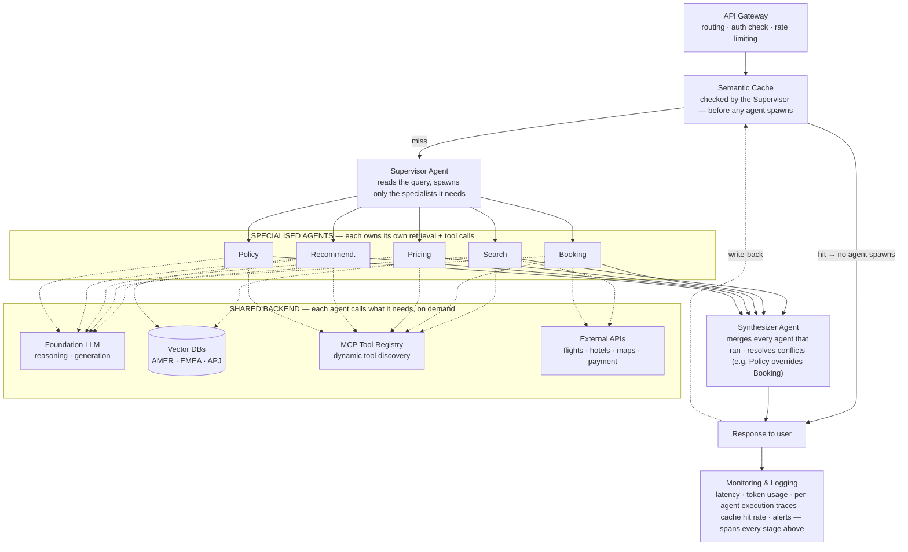

# Travel Agent System Design

*System Design Reference — Final Reconciled Version*

System design is the blueprint that describes how software components collaborate to solve a business problem efficiently, reliably, and at scale. This page works through that blueprint for one sample system — an **agentic AI travel assistant** serving customers across AMER, EMEA, and APJ — reconciling iGrace's original reference architecture with the five structural fixes found across two follow-up reviews.

> **What this is:** iGrace's [System Design Overview](https://www.igrace.in/technology/interviews-proj-delivery/proj-delivery/overview) page draws a sample travel-agent architecture as a strict pipeline: five agents fan out, then funnel through one shared cache, retrieval, LLM, and tool-calling stage in sequence. A follow-up review caught four places where that sequence doesn't match how a multi-agent system actually runs; a separate blueprint independently reached the same four fixes and added a fifth — an explicit Synthesizer Agent to replace the missing aggregation step. This page merges all of it into one final architecture.

---

## What changed, and why

Five structural fixes over the original diagram — four from the architecture review, one from the prior blueprint.

### 1 · Rate limiting moved inside the API Gateway

The original draws Rate Limiter as a second box off the load balancer, parallel to the Gateway but with no line continuing downstream — a dead end. Rate limiting is a policy the Gateway enforces on every request, not an alternate route.

### 2 · Semantic Cache checked before any agent spawns

Originally the cache sat after all five agents had already run. A cache meant to "significantly reduce LLM latency and cost" has to sit in front of the expensive work, not after it — so it's now the Supervisor's first move, and a hit returns without spawning a single agent.

### 3 · RAG owned by each agent, not a shared stage

One mandatory retrieval box downstream of all five agents forced a vector-DB lookup onto agents that never needed one. Search and Recommendation pull regional travel content; Booking and Policy mostly don't — so retrieval is now a call each agent makes for itself.

### 4 · Tool calling, MCP, and external APIs sit alongside the agents

The original funnelled every agent into one shared LLM step, then one Tool Calling step, then one MCP Registry — as if the whole request got a single turn. A Booking Agent needs the Payment and Flight MCP servers during its *own* turn, not after four unrelated agents finish.

### 5 · A Synthesizer Agent replaces the missing aggregation step — *added by the prior blueprint*

The original never showed how five parallel agent outputs become one response — the diagram just continues as a single line as if that were automatic. A named Synthesizer Agent now merges every agent that actually ran and resolves conflicts between them (a Policy decision overriding a Booking choice, for instance) before anything reaches the user.

---

## Architecture

Same components and regional footprint as the original — restructured so a cache hit is genuinely cheap, every agent's tool use happens inside its own loop, and results converge through one accountable step before the response goes out.

- 🟢 request path
- 🟢 agents — parallel, independent loops
- 🟣 shared backend, called on demand (dashed)
- 🟠 new: Synthesizer Agent

A cache hit (teal) returns before the Supervisor spawns anything. On a miss, the Supervisor spawns only the agents the query needs; each one independently calls the shared backend — Foundation LLM, regional vector DBs, the MCP registry, external APIs — for exactly what its own task requires. The Synthesizer Agent then merges whatever ran into one response, which is written back to the cache for the next matching query.

---

## Key components

Same roster as the original reference, with the Gateway, Cache, and agent-owned services re-scoped, and the Synthesizer added.

| Component                                                                                     | Purpose                                                                                                                                                                  |
| --------------------------------------------------------------------------------------------- | ------------------------------------------------------------------------------------------------------------------------------------------------------------------------ |
| **Client**                                                                              | Web / mobile surface for search, booking, and itinerary management.                                                                                                      |
| **Authentication**                                                                      | Verifies identity via OAuth, JWT, or SSO before anything else runs.                                                                                                      |
| **Load Balancer**                                                                       | Spreads traffic across API instances for availability.                                                                                                                   |
| **API Gateway** `rate limiting moved inside`                                          | Single entry point: routing, request validation, and throttling as one policy layer — not a separate hop.                                                               |
| **Supervisor Agent** `renamed / refocused`                                            | Reads the query, checks the cache, and — only on a miss — decides which specialised agents to spawn.                                                                   |
| **Semantic Cache** `moved earlier`                                                    | Checked immediately after the Supervisor receives the query. A hit returns an answer without spawning a single agent.                                                    |
| **Search / Booking / Pricing / Recommendation / Policy Agents** `now own RAG + tools` | Each agent retrieves its own domain context and calls its own tools — a Booking Agent reaches the Payment gateway directly; nothing routes through one shared LLM step. |
| **Regional Vector DBs** (AMER / EMEA / APJ)                                             | Still the shared retrieval infrastructure — reframed as something agents call into, not a pipeline stage every request passes through in sequence.                      |
| **MCP Tool Registry**                                                                   | Dynamic tool discovery, reached independently by whichever agent needs it, whenever it needs it.                                                                         |
| **External APIs**                                                                       | Flights, hotels, maps, and payment providers, called via MCP servers.                                                                                                    |
| **Synthesizer Agent** `new`                                                           | Merges outputs from every agent that ran, resolves conflicts between them (e.g. Policy overriding a Booking choice), and produces one coherent response.                 |
| **Monitoring & Logging**                                                                | Latency, token usage, failures, and per-agent execution traces across the whole request.                                                                                 |

---

## Data flow

The original's ten steps, reordered so "cache-first" is actually first.

1. User submits a request through the web or mobile client.
2. Authentication validates identity; the Load Balancer routes to an available API instance; the API Gateway applies rate limiting and forwards to the Supervisor.
3. The Supervisor checks the Semantic Cache first, before deciding anything about agents.
4. On a cache hit, the cached answer returns immediately — no agent is ever spawned.
5. On a miss, the Supervisor spawns the specialised agents the query actually needs (Search, Booking, Pricing, Recommendation, Policy).
6. Each agent independently retrieves the context it needs from the relevant regional Vector DB, as a tool call inside its own loop.
7. Each agent calls whatever external APIs it needs (flights, hotels, maps, payment) through the MCP Tool Registry, again inside its own loop.
8. The Synthesizer Agent collects every agent's output, resolves conflicts, and composes one grounded response.
9. The final response returns to the user, and the answer is written back to the Semantic Cache for future reuse.
10. Monitoring and logging capture latency, token usage, and per-agent traces across the entire request.

---

## Non-functional requirements

Unchanged from the original reference — the reordering above just makes the "cache-first" row actually true.

| Requirement       | Example solution                                                                                   |
| ----------------- | -------------------------------------------------------------------------------------------------- |
| Scalability       | Horizontal scaling, auto-scaling, load balancing.                                                  |
| Reliability       | Multi-region deployment, retries, failover.                                                        |
| Availability      | Active-active regional architecture.                                                               |
| Performance       | Semantic caching before fan-out, Redis, CDN, optimized vector search.                              |
| Security          | OAuth, JWT, encryption, RBAC, secrets management.                                                  |
| Cost optimization | Cache-first strategy that actually gates spawn, smaller models for simple tasks, regional routing. |
| Observability     | Metrics, logs, distributed tracing per agent, dashboards, alerts.                                  |
| Maintainability   | Microservices, modular agents that own their own tools, CI/CD, infrastructure as code.             |

---

## Trade-offs worth naming out loud

The distinctions an interviewer is listening for.

**Shared retrieval service vs. per-agent RAG** — A shared Vector DB layer centralizes data-residency and guardrail enforcement but couples every agent to one service. Per-agent retrieval matches how LangGraph/CrewAI-style frameworks wire tools, at the cost of duplicated embedding infra if ungoverned. Either is defensible — treating RAG as a peer of the agents instead of infrastructure or a tool is the actual mistake.

**Single agent vs. multi-agent** — Multi-agent adds coordination and synthesis overhead; it earns its keep when sub-tasks need different tools, different guardrails, or independent scaling — as Booking and Policy clearly do here.

**Semantic cache vs. traditional cache** — Semantic caching matches near-duplicate queries, not just exact ones, which is why it can short-circuit the entire agent fan-out rather than just one downstream call.

**Global vs. regional vector DBs** — Regional stores (AMER/EMEA/APJ) buy data-residency compliance and lower latency; a global store buys simpler operations and cross-region consistency.

---

## Mental model: an international airport

Same analogy as the original reference, extended to cover the cache gate and the Synthesizer.

| Airport                                                                | System                                                            |
| ---------------------------------------------------------------------- | ----------------------------------------------------------------- |
| Passengers                                                             | Users                                                             |
| Airport entrance                                                       | Authentication                                                    |
| Security check + baggage scanner`one line, not two`                  | API Gateway with rate limiting built in                           |
| Information desk checking "have we answered this before?"              | Semantic Cache, checked before any staff is dispatched            |
| Air traffic control tower                                              | Supervisor Agent                                                  |
| Airline staff, each with their own manuals and radios                  | Specialised agents, each with their own retrieval and tool access |
| Flight information binders each desk keeps                             | Vector databases, consulted by whichever desk needs them          |
| Ground crew, catering, fuel trucks                                     | External APIs (flights, hotels, maps, payments)                   |
| Dispatch officer compiling one departure report from every crew`new` | Synthesizer Agent                                                 |
| CCTV & operations center                                               | Monitoring, logging & observability                               |

---

*Reconciles three sources: iGrace's [System Design Overview — AI-Powered Travel Agent](https://www.igrace.in/technology/interviews-proj-delivery/proj-delivery/overview) (the original), the* Travel Agent Architecture Review *(fixes 1–4), and the* Travel Agent System Blueprint *(fix 5, the Synthesizer Agent).*
