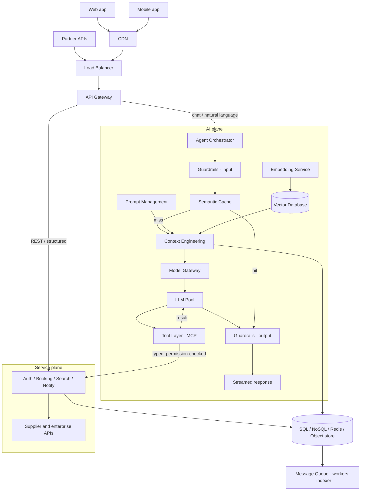

# System Design Components — The 12-Part Framework

*System Design & Delivery Interviews*

A good system design interview is not about drawing boxes and arrows. It is about demonstrating **structured thinking**, **tradeoff analysis**, and the ability to design a scalable, reliable, and maintainable system. A comprehensive design can be broken into 12 key components, each answering a different question the interviewer is silently asking.

## The framework at a glance

| # | Component | Purpose |
|---|-----------|---------|
| 1 | Problem Definition | Understand what you're building |
| 2 | Functional Requirements | Define system capabilities |
| 3 | Non-Functional Requirements | Define quality attributes |
| 4 | Capacity Estimation | Estimate scale |
| 5 | High-Level Architecture | Major building blocks |
| 6 | Data Design | How data is stored |
| 7 | Component Design | Internal services / modules |
| 8 | Data Flow | End-to-end request lifecycle |
| 9 | Scalability Strategy | Handle growth |
| 10 | Reliability & Availability | Ensure uptime |
| 11 | Security & Governance | Protect the system |
| 12 | Tradeoffs & Future Improvements | Show engineering judgment |

---

## 1. Problem Definition

Start by clarifying the problem before touching the whiteboard. Five minutes of questions here prevents twenty minutes of designing the wrong system.

- **What are we building?**
  Restate the problem in your own words and get the interviewer to confirm it. Ambiguity here compounds through every later decision, and a wrong assumption about the product is far more expensive than a wrong choice of database.

- **Who are the users?**
  Consumers, internal staff, and third-party partners have wildly different scale, latency, and trust profiles. Knowing the user also tells you the access pattern — a million casual readers is a caching problem, a thousand power users writing constantly is a locking problem.

- **What business problem are we solving?**
  Tie the system to the outcome it exists for: revenue, retention, cost reduction, or compliance. This is what lets you argue later that a cheaper eventually-consistent design is acceptable, or that it absolutely is not.

- **What is out of scope?**
  Explicitly park things like payments, fraud detection, or admin tooling so you are judged on depth rather than breadth. Saying "I'll assume payments are handled by an existing service" is a senior move, not a dodge.

> **Example:** Design an AI Travel Assistant that helps customers search flights, hotels, and book trips.

---

## 2. Functional Requirements

These describe **what the system should do** — the capabilities a user would recognise. Keep the list short, ordered by importance, and confirm it before designing.

- **User authentication**
  Sign-up, login, session management, and identity for every downstream call. Everything else in the system depends on knowing who the caller is, so this is usually the first service you draw.

- **Search flights**
  A read-heavy, latency-sensitive path that fans out to external supplier APIs and aggregates the results. This is the natural home for caching, timeouts, and partial-result handling.

- **Book hotels**
  A write path with real money and real inventory behind it, so it needs idempotency keys and transactional guarantees. Double-booking is the failure mode interviewers will probe.

- **Cancel bookings**
  The compensating action for a booking, often spanning several external systems that cannot participate in one transaction. This is where sagas and outbox patterns earn their keep.

- **Chat with AI assistant**
  A conversational surface that turns natural language into structured intent and tool calls. It introduces streaming responses, conversation memory, and non-deterministic latency.

- **Retrieve travel history**
  A user-scoped read over past bookings and itineraries, ideal for a read replica or denormalised view. It also feeds the assistant's personalisation context.

- **Send notifications**
  Email, push, and SMS for confirmations, changes, and reminders, delivered asynchronously. It belongs behind a queue so a slow provider never blocks a booking.

---

## 3. Non-Functional Requirements

These describe **how well** the system should perform. Quantify each one — "highly available" means nothing, "99.99% with a 5-minute RTO" is a design constraint.

- **Scalability**
  The ability to absorb more users, data, and traffic by adding resources rather than rewriting. State whether you are scaling reads, writes, or both, since they demand different solutions.

- **Reliability**
  The system produces correct results and does not lose data, even when components fail. Measured by error rates and data-loss objectives (RPO), not just uptime.

- **Availability**
  The proportion of time the system serves requests successfully, expressed in nines. Each extra nine multiplies cost, so name the number and justify it against the business impact.

- **Security**
  Protection of data and functionality against unauthorised access, at rest, in transit, and in use. Treat it as a requirement with acceptance criteria, not a layer bolted on at the end.

- **Performance**
  Latency and throughput targets, always stated as percentiles (p50, p95, p99) rather than averages. Averages hide the tail, and the tail is what users actually complain about.

- **Maintainability**
  How cheaply the team can change the system: clear service boundaries, tests, and observability. It is the requirement that decides whether the design survives its second year.

- **Cost efficiency**
  The unit economics — cost per request, per user, per GB stored, per million tokens. Naming a cost ceiling makes your architectural tradeoffs concrete instead of theoretical.

- **Fault tolerance**
  The system degrades gracefully when a dependency fails instead of cascading into an outage. Decide in advance which features may be shed and which must never fail.

- **Observability**
  Metrics, structured logs, and distributed traces that let you answer new questions without a deploy. Without it you cannot prove any of the other targets are being met.

- **Compliance**
  Regulatory obligations such as GDPR, PCI-DSS, HIPAA, or data residency rules. These dictate storage location, retention windows, and deletion guarantees, so surface them early.

> **Example targets:** 99.99% availability · < 2 sec response time · 10 million users · GDPR compliant

---

## 4. Capacity Estimation

Estimate scale before choosing technology — the numbers are what justify your architectural choices. Round aggressively; interviewers want the reasoning, not arithmetic precision.

- **Users — 5M MAU, 500K DAU, 10K concurrent**
  Monthly actives size your storage and cost, daily actives size your steady-state traffic, and concurrency sizes your connection pools and instance count. The MAU-to-DAU ratio (here 10%) is the assumption to state out loud.

- **Traffic — 50K requests/sec**
  Derive it from DAU × actions per user per day ÷ 86,400, then multiply by a peak factor of 2–5× for daily and seasonal spikes. Split it into read versus write RPS, because a 100:1 read ratio changes the entire design.

- **Storage — 20 TB/year**
  Multiply record count by average record size, then add indexes, replicas, and backups, which typically triple the raw figure. Pair it with a retention policy so growth is bounded rather than infinite.

- **Bandwidth — 2 Gbps**
  Requests per second × average payload size, computed separately for ingress and egress. Egress is usually the expensive direction and the strongest argument for putting a CDN in front.

---

## 5. High-Level Architecture

This is the famous architecture diagram: the major building blocks and the path a request takes through them.

**Request path:** Users → CDN → Load Balancer → API Gateway → Application Services → Databases → Cache → Message Queue → Monitoring

- **Users / Clients**
  Web, mobile, and partner integrations, each with different connectivity and retry behaviour. Mobile clients in particular need small payloads and tolerance for flaky networks.

- **CDN**
  Serves static assets and cacheable responses from edge locations close to the user. It removes the majority of bytes from your origin and absorbs the first wave of any traffic spike.

- **Load Balancer**
  Distributes traffic across healthy instances, terminates TLS, and removes failed nodes from rotation. It is also where you get zone-aware routing and connection draining during deploys.

- **API Gateway**
  A single entry point handling authentication, rate limiting, routing, and request/response shaping. It keeps cross-cutting concerns out of every individual service.

- **Application Services**
  The stateless business logic, split by domain so each can be scaled and deployed independently. Statelessness is what makes horizontal scaling and rolling deploys trivial.

- **Databases**
  The system of record, chosen per service according to its access pattern rather than one database for everything. Call out the primary/replica topology and where writes land.

- **Cache**
  An in-memory tier (Redis, Memcached) in front of expensive reads and computations. Always specify the invalidation strategy and TTL — a cache without one is a correctness bug waiting to happen.

- **Message Queue**
  Decouples slow or bursty work (notifications, indexing, analytics) from the request path. It absorbs spikes as backlog instead of as errors, and enables retries with backoff.

- **Monitoring**
  Metrics, logging, tracing, and alerting wired into every component from day one. Define the SLIs and the alert thresholds, not just "we'll use Prometheus".

### For AI systems, add

- **LLM**
  The reasoning engine behind generation, summarisation, and intent understanding. Treat it as a slow, expensive, non-deterministic dependency and design timeouts and fallbacks accordingly.

- **Vector Database**
  Stores embeddings and serves approximate nearest-neighbour search for retrieval. Its index type and recall/latency tradeoff are real design decisions, not implementation details.

- **Embedding Service**
  Converts documents and queries into vectors, both in batch for ingestion and online for queries. Version the embedding model, because changing it invalidates the entire index.

- **Semantic Cache**
  Returns a stored answer when a new query is semantically close to a previous one. It can cut both cost and p95 latency dramatically, at the risk of serving a subtly wrong match.

- **Agent Orchestrator**
  Plans multi-step tasks, decides which tool or sub-agent to invoke, and assembles the final answer. It needs step limits and budgets or a loop can run away.

- **Model Gateway**
  A routing layer that sends each request to the right model and provider, with fallback and retries. It also centralises token accounting, rate limits, and per-tenant quotas.

- **Tool Integrations**
  The connectors that let the model act on real systems — booking APIs, CRMs, internal services. Every tool call needs permission checks, timeouts, and audit logging.

### The integrated picture — every AI component in place

The list above says *what* to add. This says *where* each piece sits once it is added: the AI plane hangs off the same API gateway as the traditional services, calls back into them through the tool layer, and shares the data plane underneath.

<!--FIG-->

- **Two planes, one front door**
  The AI plane and the traditional service plane both sit behind the same API gateway, which keeps authentication, rate limiting, quotas, and tracing in one place. Chat traffic routes to the agent orchestrator; ordinary REST traffic goes straight to the services, so a model outage never takes down booking.

- **The tool layer is the boundary between them**
  Everything the agent does to the real world goes through typed, permission-checked tool calls into the existing services — the LLM never touches a database directly. That single choke point is where authorisation, timeouts, and audit logging are enforced.

- **Retrieval is a side path, not an extra hop**
  The embedding service and vector database feed context engineering rather than sitting in the request chain, so retrieval latency is bounded and can be skipped when the task does not need it. Prompt management supplies the versioned system prompt into the same assembly step.

- **The semantic cache is the main cost lever**
  It sits in front of the expensive path, so a hit returns an answer with no model call, no retrieval, and no tool execution. Tune its similarity threshold conservatively: a false hit is not a slow answer, it is a wrong one.

- **Guardrails bracket the model on both sides**
  Input guardrails handle prompt injection and moderation before anything reaches the model; output guardrails validate structure and grounding before anything reaches the user or triggers an action. Both should fail closed on transactional requests.

- **The data and async planes stay shared**
  SQL, NoSQL, Redis, and object storage serve both planes, and events still flow through the queue to workers, indexers, and the warehouse. The AI plane adds components on top of the traditional architecture — it does not replace any of it.

---

## 6. Data Design

Choose storage per access pattern, and be explicit about what is stored, where, and for how long.

### Databases

- **SQL**
  Relational stores for transactional, strongly consistent data with joins and constraints — bookings, payments, users. Choose it whenever correctness matters more than raw write throughput.

- **NoSQL**
  Document or wide-column stores for high-volume, flexible-schema, partition-friendly data such as sessions or catalogues. You trade joins and multi-record transactions for horizontal scale.

- **Graph**
  Purpose-built for relationship traversal — recommendations, fraud rings, itinerary connections. Use it when queries are about paths between entities rather than rows in a table.

- **Time-series**
  Optimised for append-heavy, timestamp-ordered data like metrics, prices, and events. Built-in downsampling and retention keep long histories affordable.

### Data models

- **Customer**
  Identity, profile, preferences, and consent flags, referenced by nearly every other entity. It is also the record most affected by privacy rules, so plan for export and deletion.

- **Booking**
  The transactional core: status, itinerary, price, and links to payment and supplier references. Model it as a state machine with an immutable event history rather than a mutable row.

- **Flight**
  Mostly external, cache-heavy reference data — schedules, availability, fares — with short TTLs. Decide what you persist versus what you always fetch live from the supplier.

- **Hotel**
  Property, room inventory, rates, and media, refreshed on a slower cadence than flights. Rich content makes this the natural candidate for a search index and a CDN.

- **Payment**
  Charges, refunds, and reconciliation records held to the strictest consistency and audit standards. Store tokens rather than card data so PCI scope stays contained.

### Storage decisions

- **Hot vs Cold storage**
  Keep recent, frequently accessed data on fast storage and tier older data to cheap object storage. This is often the single largest cost lever in a data-heavy system.

- **Partitioning**
  Split data across shards by a key — customer, region, or time — so no single node holds everything. Pick the key carefully: a bad one creates hotspots you cannot fix without a migration.

- **Replication**
  Maintain copies across nodes and zones for read scaling and failover. State whether replication is synchronous (safer, slower) or asynchronous (faster, risks losing recent writes).

- **Backup strategy**
  Scheduled snapshots plus point-in-time recovery, with defined RPO and RTO targets. A backup you have never restored is a hypothesis, so include periodic restore drills.

---

## 7. Component Design

Now zoom into each service and state its responsibilities, interfaces, and data ownership.

### Authentication Service

- **Login**
  Validates credentials or federated identity (OAuth/OIDC) and establishes a session. Rate limiting and lockout policy live here to blunt credential-stuffing attacks.

- **JWT generation**
  Issues short-lived signed access tokens plus longer-lived refresh tokens. Short expiry limits the blast radius of a leaked token; key rotation and revocation need a plan.

- **MFA**
  A second factor (TOTP, push, WebAuthn) for high-risk logins and sensitive actions. Step-up authentication before payment or cancellation is a good detail to volunteer.

- **Session validation**
  Verifies tokens on every request, ideally at the gateway so downstream services stay simple. It must be fast and cacheable since it sits on the critical path of every call.

### Booking Service

- **Reserve seats**
  Holds inventory atomically with an idempotency key so retries never double-book. Reservations should expire automatically if payment does not complete in time.

- **Handle payments**
  Orchestrates authorisation and capture through a payment provider, never touching raw card data. Model it as a saga with compensating actions, since the provider is an external system.

- **Cancellation**
  Reverses the booking across supplier, payment, and notification systems while honouring fare rules. Needs to be idempotent and auditable, because partial failures here are visible to customers.

### AI Agent

- **Intent classification**
  Maps a free-form message to a supported task — search, book, cancel, ask — with a confidence score. Low-confidence input should trigger a clarifying question rather than a guess.

- **Planning**
  Decomposes a request into ordered steps and decides which tools to call in what sequence. Cap the number of steps and the token budget so a plan cannot loop indefinitely.

- **Tool invocation**
  Calls the underlying services with validated arguments and handles their errors and timeouts. Every write-capable tool needs an explicit permission check before it fires.

- **Memory retrieval**
  Pulls relevant conversation history, preferences, and past trips into the context window. Scope memory strictly per user, and retrieve selectively rather than dumping everything.

---

## 8. Data Flow

Walk through one request end to end. Interviewers love this section because it proves you understand how the pieces actually interact.

**End-to-end request:** User → API Gateway → Authentication → Supervisor Agent → Semantic Cache → Travel Agent → Flight API → Hotel API → Booking Service → LLM → Response

- **User**
  Sends a natural-language request such as "find me a flight to Delhi next Friday". The client attaches an auth token and a request/trace ID that follows the call everywhere.

- **API Gateway**
  Terminates TLS, applies rate limits, and routes to the assistant service. It is also where the trace begins and where the global timeout budget is set.

- **Authentication**
  Validates the token and resolves the user's identity, roles, and entitlements. Everything downstream operates under that scope, which is what keeps memory and data user-isolated.

- **Supervisor Agent**
  Interprets the request, builds a plan, and delegates to the appropriate specialised agent. It owns the step budget and decides when the task is complete.

- **Semantic Cache**
  Checks whether a semantically similar request was answered recently and returns it if so. A hit skips the expensive downstream path entirely; a miss continues and populates the cache.

- **Travel Agent**
  The domain specialist that knows which tools to call and how to combine their results. It normalises supplier differences into one consistent internal shape.

- **Flight API**
  Queries suppliers or GDS systems for availability and fares, usually in parallel. Slow suppliers get a timeout and a partial result rather than blocking the whole response.

- **Hotel API**
  Fetches properties, rooms, and rates matching the itinerary, then merges them with flight options. Results are typically cached briefly because prices move but not by the second.

- **Booking Service**
  Called only when the user confirms, creating the reservation and taking payment idempotently. It emits events that trigger notifications and history updates asynchronously.

- **LLM**
  Turns the structured results into a clear, grounded natural-language answer. Ground it strictly in retrieved data and validate the output before it reaches the user.

- **Response**
  Streamed back so the user sees progress rather than a spinner, with the trace ID retained. Log latency and token cost per stage to find bottlenecks later.

---

## 9. Scalability Strategy

Discuss how the system grows — and be specific about which bottleneck each technique removes.

- **Horizontal scaling**
  Add more instances rather than bigger ones, which requires services to be stateless. It gives near-linear capacity growth and removes the single-machine ceiling.

- **Auto scaling**
  Adjust instance count automatically from CPU, queue depth, or request-rate signals. Tune warm-up time and cooldown, or you will scale up after the spike has already caused errors.

- **Load balancing**
  Spread traffic across instances and zones using health checks and a sensible algorithm. Least-connections or latency-aware routing usually beats round-robin for uneven workloads.

- **Caching**
  Keep hot reads in memory at the edge, gateway, application, or database layer. Each layer you add cuts load on the one behind it, at the cost of another invalidation problem.

- **Database sharding**
  Split data horizontally across independent databases by a partition key. It is the answer when write volume or dataset size exceeds one node, and the cost is cross-shard queries.

- **Read replicas**
  Serve reads from asynchronous copies of the primary to relieve write-node pressure. Be explicit about replication lag and which reads must go to the primary.

- **Message queues**
  Buffer work so producers never wait on consumers, smoothing spikes into backlog. They also give retries, dead-lettering, and independent scaling of the consumer side.

- **Event-driven architecture**
  Services publish events instead of calling each other synchronously, reducing coupling and fan-out latency. The tradeoff is eventual consistency and harder end-to-end debugging.

- **Stateless services**
  Push session and cached state into shared stores so any instance can serve any request. This is the precondition for autoscaling, rolling deploys, and instance replacement.

- **CDN**
  Push static and cacheable content to the edge, cutting origin load and geographic latency. It is the cheapest scaling win available and should be the first thing you mention.

### For AI

- **Model routing**
  Send simple requests to small fast models and reserve frontier models for hard ones. This typically cuts cost by an order of magnitude with minimal quality loss.

- **Semantic cache**
  Reuse answers for semantically similar queries instead of re-invoking the model. Set the similarity threshold conservatively, since a false hit is a wrong answer.

- **Multi-region vector DBs**
  Replicate the embedding index near users to cut retrieval latency and survive a region loss. Index rebuilds and replication lag are the operational costs to acknowledge.

- **Token optimisation**
  Trim prompts, compress history, and retrieve selectively so the context window stays small. Tokens are both your latency budget and your bill, so this is a scaling lever, not a micro-optimisation.

- **Request batching**
  Group embedding and inference calls to improve GPU utilisation and throughput. It trades a few milliseconds of queueing delay for a large gain in cost per request.

---

## 10. Reliability & Availability

How do you ensure uptime? Assume every dependency will fail and describe what happens when it does.

- **Retry policies**
  Retry transient failures with exponential backoff and jitter, only for idempotent operations. Cap the attempts, or retries become a self-inflicted denial-of-service.

- **Circuit breakers**
  Stop calling a failing dependency after a threshold and fail fast until it recovers. This prevents one sick service from exhausting every caller's thread pool.

- **Timeouts**
  Set an explicit deadline on every network call and propagate a shrinking budget downstream. A missing timeout is the most common cause of a full-system hang.

- **Dead letter queues**
  Park messages that repeatedly fail so the main queue keeps flowing. They preserve the failed work for inspection and replay instead of silently dropping it.

- **Multi-AZ deployment**
  Spread instances and database replicas across availability zones within a region. It protects against the most common real-world failure — losing one data centre.

- **Multi-region failover**
  Keep a standby (or active) region ready to take traffic when a whole region is lost. State the RTO and how DNS or global routing shifts traffic, plus how data is replicated.

- **Health checks**
  Liveness and readiness probes that remove unhealthy instances from rotation automatically. Make readiness check real dependencies so you never route traffic to a half-started pod.

- **Leader election**
  Ensure exactly one node performs singleton work such as schedulers or cleanup jobs. Consensus systems (etcd, ZooKeeper) provide this safely across failures.

- **Graceful degradation**
  Shed non-essential features under stress instead of failing the whole request. For a travel assistant: keep search working even if personalisation or reviews are unavailable.

- **Backup & restore**
  Automated backups with tested, timed restore procedures against defined RPO/RTO. Rehearse the restore, since the first real attempt should never be during an incident.

- **Chaos testing**
  Deliberately inject failures — kill nodes, add latency, drop dependencies — in controlled conditions. It converts assumed resilience into verified resilience.

---

## 11. Security & Governance

- **Authentication**
  Establish who the caller is, using strong identity and short-lived credentials. Federate with an identity provider rather than building password handling from scratch.

- **Authorization**
  Enforce what an authenticated caller may do, with least-privilege roles or attribute-based rules. Check it at the service, not only at the UI or gateway.

- **Encryption at rest**
  Encrypt databases, object storage, and backups with managed keys and regular rotation. It is usually a compliance requirement, and it limits the damage of a stolen disk or snapshot.

- **Encryption in transit**
  TLS everywhere, including between internal services, with mTLS for service-to-service trust. It defends against network-level interception and lateral movement.

- **Secrets management**
  Keep credentials and keys in a vault with rotation and audited access, never in code or env files. Prefer short-lived, dynamically issued credentials over static ones.

- **Audit logs**
  Immutable, timestamped records of who did what to which resource, retained per policy. They are essential for incident forensics and for most compliance regimes.

- **Rate limiting**
  Per-user, per-IP, and per-tenant quotas to stop abuse and protect capacity. For AI systems, meter tokens and cost as well as request count.

- **API security**
  Input validation, schema enforcement, output encoding, and defence against injection and SSRF. Version and deprecate endpoints deliberately so old, weaker paths do not linger.

- **PII protection**
  Classify personal data, minimise what you collect, and mask or tokenise it in logs and analytics. Support export and deletion requests as a first-class feature, not a manual script.

- **Compliance**
  Map GDPR, PCI-DSS, or residency obligations to concrete controls, retention windows, and evidence. Automate the evidence collection so audits do not consume an engineering quarter.

### For AI

- **Prompt injection protection**
  Treat retrieved documents and tool output as untrusted data that must never be executed as instructions. Separate system, user, and retrieved content, and constrain what tools can do.

- **Guardrails**
  Policy checks on both input and output that block disallowed topics, actions, and formats. They should fail closed for anything that moves money or changes a booking.

- **Content moderation**
  Screen user input and model output for harmful, abusive, or unsafe content before it is shown or stored. Log decisions so false positives can be reviewed and tuned.

- **Tool permission checks**
  Authorise every tool call against the calling user's own entitlements, not the agent's. An agent must never be able to act beyond the permissions of the person it serves.

- **Output validation**
  Validate structure and ground claims against retrieved sources before acting or replying. For anything transactional, require a schema-valid response and a human confirmation step.

- **Data masking**
  Redact PII before it enters prompts, logs, traces, or third-party model providers. This keeps sensitive data out of systems you do not control.

- **Model governance**
  Track model versions, prompts, evaluations, and approvals so behaviour changes are traceable. Regulators and incident reviews both ask "which model and prompt produced this?"

---

## 12. Tradeoffs & Future Improvements

This is where senior candidates stand out. Don't just name a technology — explain its tradeoff.

- **Instead of "We use Redis"**
  → *"Redis reduces read latency from hundreds to single-digit milliseconds, but introduces cache-consistency challenges."* You now have to reason about invalidation, stale reads, and what happens on a cache-wide eviction.

- **Instead of "We use Kafka"**
  → *"Kafka improves throughput and decouples services, but increases operational complexity."* You take on partition management, consumer-lag monitoring, and the shift to eventual consistency.

### Future improvements

- **Multi-region deployment**
  Serve users from the nearest region and survive the loss of an entire one. The cost is data replication complexity and conflict resolution on writes.

- **Event sourcing**
  Store every state change as an immutable event, making the current state a projection. It gives perfect auditability and time travel, at the price of higher storage and read complexity.

- **Active-active architecture**
  Run all regions live and serving traffic rather than keeping a warm standby. It removes failover delay entirely but demands conflict-free data design.

- **Better caching**
  Add layered caches, smarter TTLs, and predictive warming for known-hot paths. Each refinement cuts cost and tail latency without changing the application logic.

- **AI cost optimisation**
  Route by difficulty, cache semantically, shorten prompts, and batch requests. In production AI systems, inference is frequently the single largest line item.

- **Model distillation**
  Train a smaller model on a larger one's outputs for a task-specific workload. It can cut latency and cost substantially while holding quality on that narrow task.

- **Autonomous agents**
  Extend from assisted actions to agents that complete multi-step tasks end to end. This raises the bar on guardrails, permissions, and human-in-the-loop checkpoints.

---

## AI System Design Additions

For modern AI systems, interviewers often expect these additional components.

- **Model Gateway**
  Routes each request to the most appropriate LLM based on task complexity, cost, and availability. It centralises retries, fallbacks, quotas, and token accounting so services never call providers directly.

- **Prompt Management**
  Stores prompts as versioned, reviewable artifacts rather than strings buried in code. It enables A/B tests, instant rollback of a bad prompt, and a clear audit trail of behaviour changes.

- **Context Engineering**
  Builds the context window from user history, retrieved documents, and tool outputs within a token budget. What you include, in what order, and what you drop is now a core design decision.

- **Embedding Service**
  Converts documents and queries into vectors for semantic search, in batch and online. The embedding model must be versioned, because changing it invalidates the whole index.

- **Vector Database**
  Stores embeddings and serves approximate nearest-neighbour queries for retrieval. Index type, dimensionality, and the recall-versus-latency tradeoff are real architectural choices.

- **Semantic Cache**
  Avoids repeated LLM calls for semantically similar requests by returning a stored answer. It cuts cost and tail latency sharply, but the similarity threshold must be tuned to avoid wrong matches.

- **Agent Orchestrator (Supervisor)**
  Plans tasks, coordinates specialised sub-agents, and assembles the final result. It enforces step limits, token budgets, and the decision of when a task is actually done.

- **Tool Layer (MCP or Function Calls)**
  Connects the LLM to enterprise systems such as Jira, Salesforce, or internal APIs through typed interfaces. Every tool needs schema validation, permission checks, timeouts, and audit logging.

- **LLM Observability**
  Tracks latency, token usage, cost, hallucination rate, and quality metrics per request and per prompt version. Without it you cannot tell whether a change improved the system or quietly broke it.

- **Safety & Guardrails**
  Handles prompt injection, content moderation, and policy enforcement on both input and output. It should fail closed on any action that spends money or modifies customer data.

---

## A Simple Mental Model

A strong system design discussion typically follows this flow:

1. **Define the problem** — clarify scope, users, and what you are explicitly not building.
2. **Gather requirements** — separate functional capabilities from quantified quality attributes.
3. **Estimate scale** — users, RPS, storage, and bandwidth, with your assumptions stated.
4. **Design the high-level architecture** — the major blocks and the path a request takes.
5. **Design data storage and services** — pick stores per access pattern and define service boundaries.
6. **Explain end-to-end data flow** — trace one real request through every component.
7. **Address scalability** — name the bottleneck first, then the technique that removes it.
8. **Address reliability** — describe what happens when each dependency fails.
9. **Address security and governance** — authentication, authorisation, data protection, compliance.
10. **Discuss tradeoffs and future enhancements** — what you gave up, and what you would do next.

This framework works for both traditional distributed systems (ride sharing, e-commerce, banking) and modern AI systems (agentic RAG, customer support copilots, AI travel assistants).
