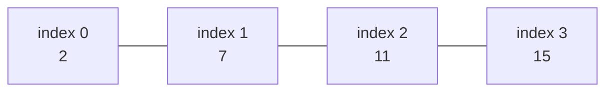
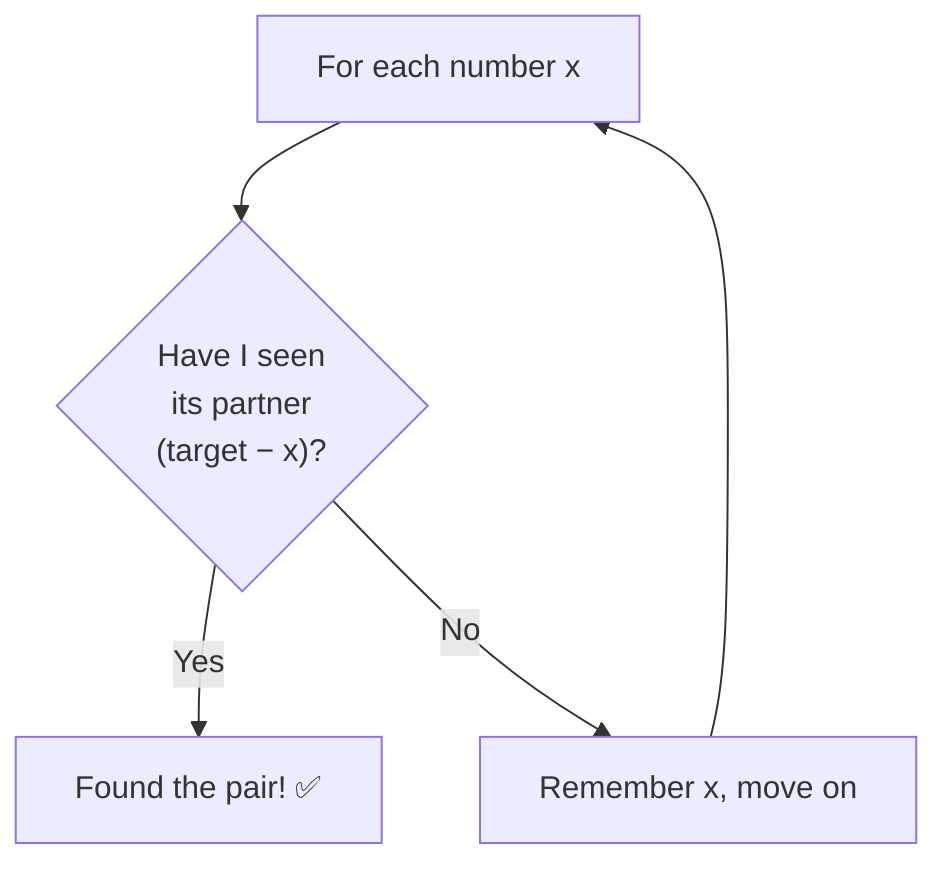
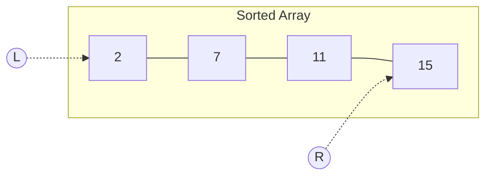
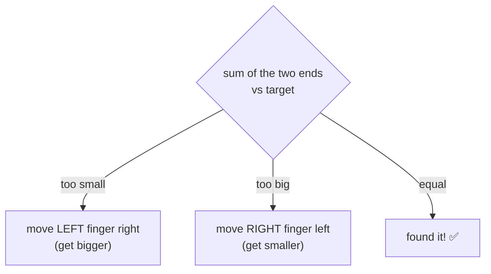
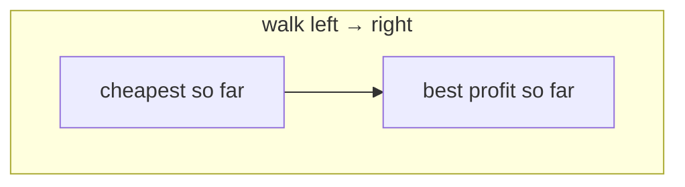
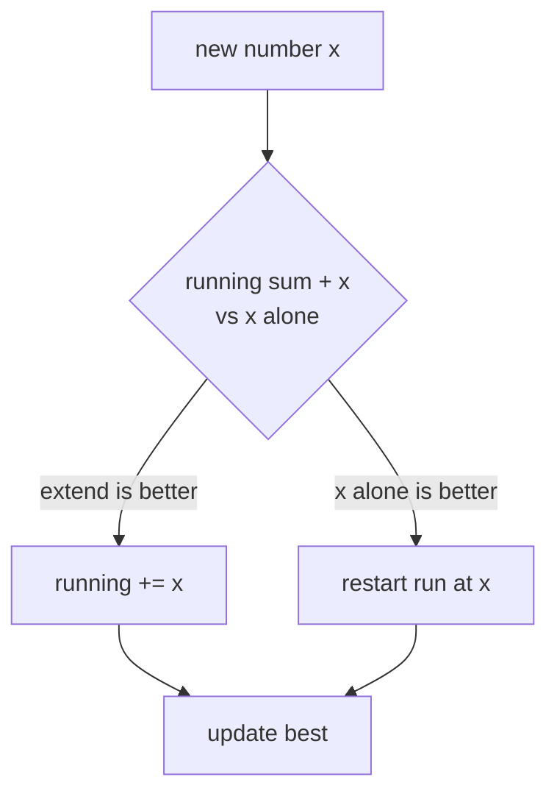
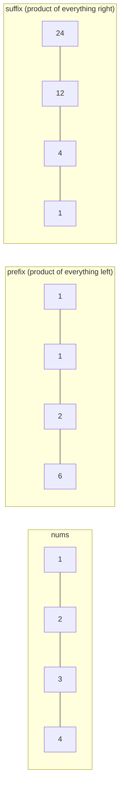
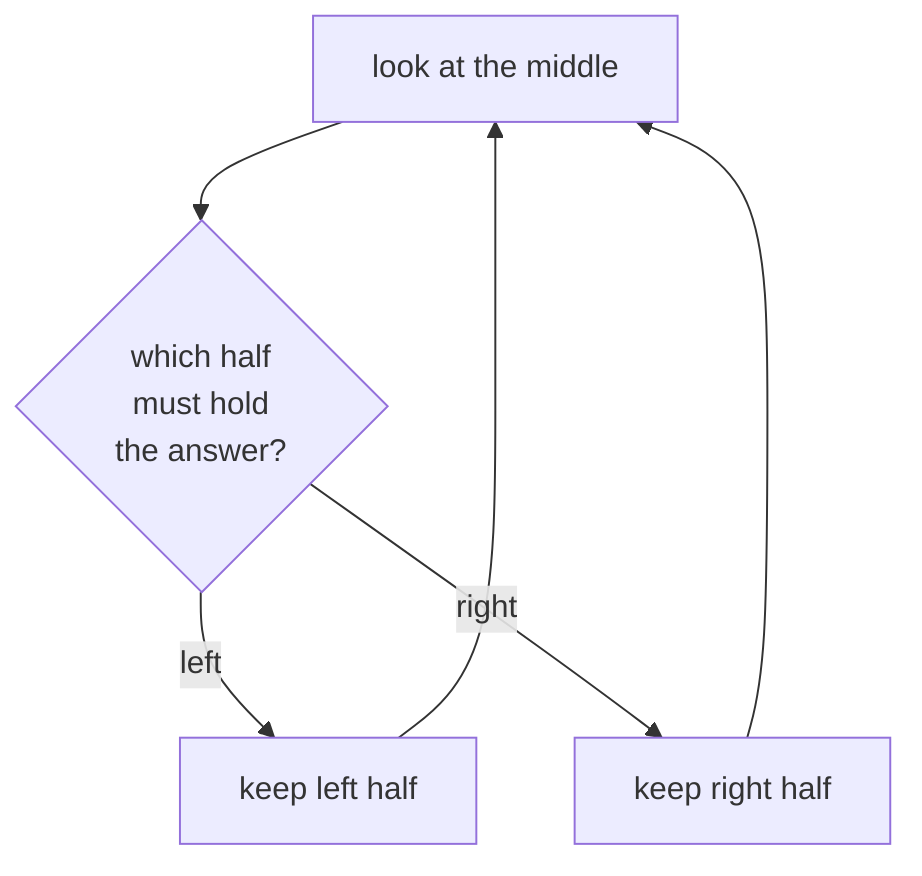
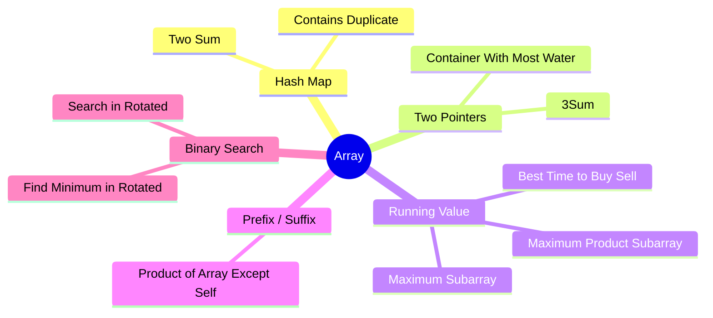

# 📊 Array — Concept Tutorial

> A plain-language guide to the ideas behind the Blind 75 **Array** problems, with diagrams.
> Pair this with the interactive pages in `visualizations/Array/` and the runnable `notebooks/Array/`.

---

## 1. What is an Array?

An **array** is a row of boxes, each holding a value, each with a numbered position (its **index**, starting at 0). Because the boxes sit next to each other in memory, you can jump to any index instantly.

- **Read/write by index:** `O(1)` (instant).
- **Search for a value:** `O(n)` (you may have to look at everything).
- **The whole game** with array problems is: *avoid the slow nested-loop scan* by using a smarter idea.

---

## 2. The Core Patterns

Almost every Blind 75 array problem is one of five ideas.

### 🧠 Pattern A — Remember What You've Seen (Hash Map / Set)

Instead of comparing every pair (slow, `O(n²)`), walk once and remember what you've passed in a hash map. Then each new element just does an instant lookup.

**The tell:** *"find two things that add up to X"*, *"any duplicates?"*, *"does a value exist?"*
**Turns** `O(n²)` **into** `O(n)`.
**Problems:** Two Sum, Contains Duplicate.

---

### 👉👈 Pattern B — Two Pointers From Both Ends

On a **sorted** array (or a symmetric one), put one finger at each end and move them toward the middle. The order tells you which finger to move.

Decision each step:

**The tell:** sorted data, *"a pair/triple"*, *"max area / min·distance"*.
**Cost:** one `O(n)` sweep, `O(1)` memory.
**Problems:** 3Sum, Container With Most Water. (Two Sum too, if sorted.)

---

### 🏃 Pattern C — One Pass, Keep a Running Best

When each element's answer depends only on a running summary of everything before it, keep that summary in a variable — no inner loop.

Kadane's algorithm (Maximum Subarray) is the classic:

**The tell:** *"best profit"*, *"largest/smallest run"*, *"max difference where one comes before the other"*.
**Problems:** Best Time to Buy & Sell Stock, Maximum Subarray, Maximum Product Subarray (track **both** max and min because negatives flip them).

---

### ↔️ Pattern D — Build From Both Directions (Prefix / Suffix)

When each answer needs *"everything on one side"*, precompute running results from the left and from the right, then combine.

Answer[i] = prefix[i] × suffix[i]. No division needed.
**The tell:** *"combine everything except me"*, range sums/products.
**Problems:** Product of Array Except Self.

---

### ✂️ Pattern E — Halve the Search (Binary Search)

If the data is **sorted** — even *sorted-then-rotated* — you can throw away half each step.

For a **rotated** array, first work out which half is in proper order, then decide.
**The tell:** *"O(log n)"*, *"sorted"*, *"find pivot / target in rotated array"*.
**Problems:** Find Minimum in Rotated Sorted Array, Search in Rotated Sorted Array.

---

## 3. Which Pattern for Which Problem?

---

## 4. Complexity Cheat Sheet

| Pattern | Time | Space |
|---|---|---|
| Hash map lookup | `O(n)` | `O(n)` |
| Two pointers (sorted) | `O(n)` (+ sort) | `O(1)` |
| Running value (Kadane) | `O(n)` | `O(1)` |
| Prefix / suffix | `O(n)` | `O(1)` extra |
| Binary search | `O(log n)` | `O(1)` |

---

## 5. Interview Playbook

1. **Say the brute force first** — "check every pair, that's O(n²)" — to show you understand the problem.
2. **Look for a tell:** searching for a match → *hash map*; sorted → *two pointers* or *binary search*; best run → *running value*; "everything except me" → *prefix/suffix*.
3. **State the speed** of your better idea and why it's faster.
4. **Test a tiny example by hand** before coding (the interactive pages do exactly this).

> ▶ **Next:** open `visualizations/Array/index.html` to watch each of these run step by step.
