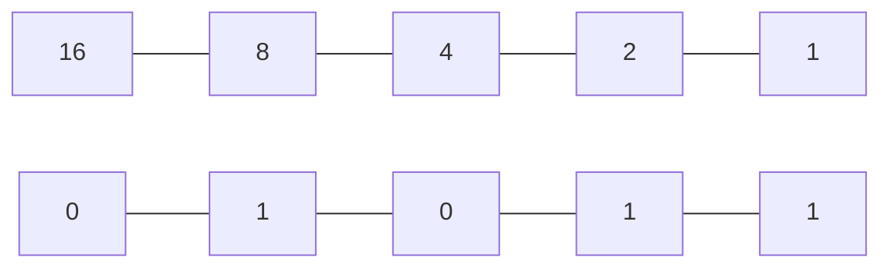
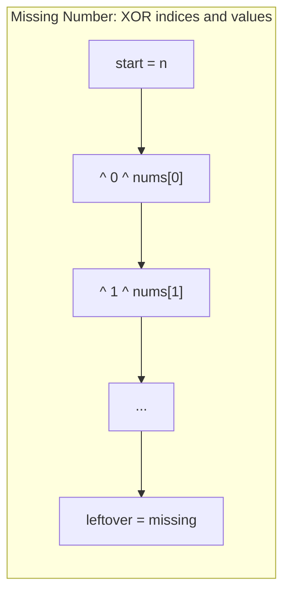
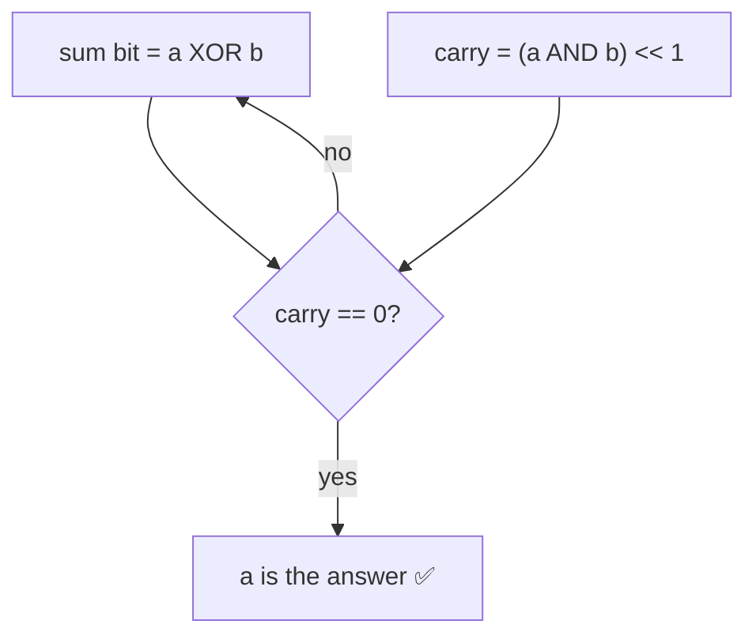
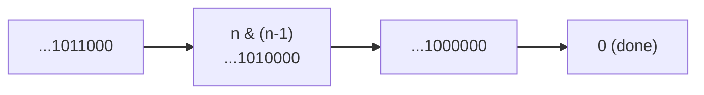
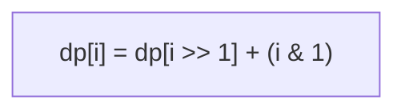
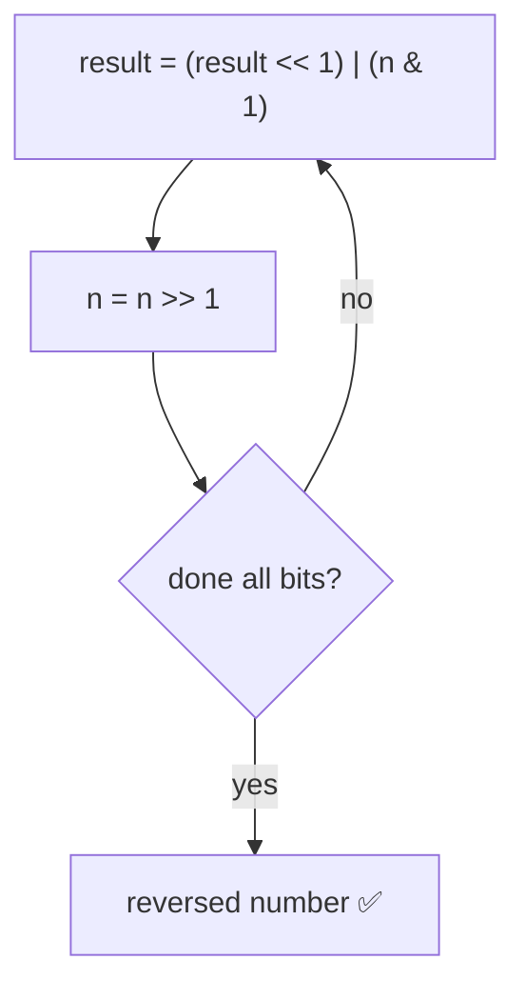
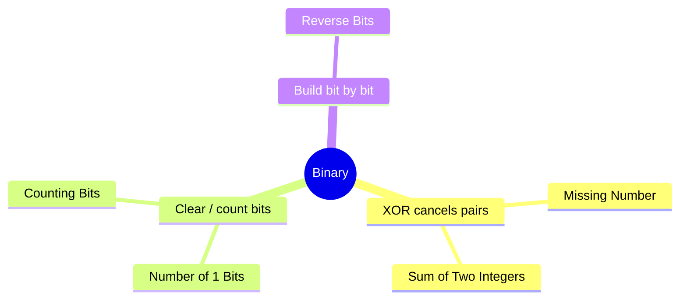

# 🔢 Binary / Bit Manipulation — Concept Tutorial

> A plain-language guide to the ideas behind the Blind 75 **Binary** problems, with diagrams.
> Pair this with `visualizations/Binary/` and `notebooks/Binary/`.

---

## 1. Numbers are Made of Bits

Computers store numbers in **binary** — strings of 0s and 1s. Each position is worth a power of two.

*Above: `01011` = 8 + 2 + 1 = 11.*

Bit operations act on these directly and are extremely fast.

---

## 2. The Toolkit

| Operator | Name | What it does |
|---|---|---|
| `&` | AND | 1 only where **both** bits are 1 |
| `\|` | OR | 1 where **either** bit is 1 |
| `^` | XOR | 1 only where bits **differ** |
| `~` | NOT | flips every bit |
| `<<` `>>` | shift | move bits left / right |

Two facts to memorize:
- **`x ^ x = 0`** and **`x ^ 0 = x`** → XOR cancels pairs.
- **`n & (n-1)`** clears the **lowest set bit**.

---

## 3. Pattern A — XOR Cancels Pairs

XOR everything together; matched values cancel to 0, leaving the odd one out. Great for "find the missing / single number" with **no extra memory and no overflow**.

Binary **addition** also uses XOR:

**Problems:** Missing Number, Sum of Two Integers.

---

## 4. Pattern B — Clear / Count Bits

`n & (n-1)` removes the lowest 1 bit — so a loop runs once per set bit.

For **Counting Bits** over a whole range, DP is even slicker: dropping the last bit of `i` (i.e. `i >> 1`) gives a smaller number you've already counted.

**Problems:** Number of 1 Bits, Counting Bits.

---

## 5. Pattern C — Build a Number Bit by Bit

Peel the last bit off the input and stack it onto a result you shift left each step.

**Problems:** Reverse Bits.

---

## 6. A Note on Fixed Width

Python integers are unbounded, so for problems that assume **32-bit** numbers you apply a **mask** (`0xFFFFFFFF`) each step and recover negatives at the end. In languages like Java/C++ this is automatic.

---

## 7. Which Pattern for Which Problem?

---

## 8. Complexity Cheat Sheet

| Task | Time |
|---|---|
| XOR / add / reverse (fixed width) | `O(bits)` ≈ `O(1)` |
| Count 1 bits (Kernighan) | `O(number of 1 bits)` |
| Counting bits for 0..n | `O(n)` |

---

## 9. Interview Playbook

1. **Write a few bits by hand** to see the pattern.
2. **Recall the toolkit:** XOR (cancel pairs / add bits), AND+shift (carry / clear bit), OR+shift (build), mask (fixed width).
3. **Mind width and signs** — mask to 32 bits and handle negatives where the problem assumes fixed-width integers.

> ▶ **Next:** open `visualizations/Binary/index.html` to watch bits flip and carries ripple.
