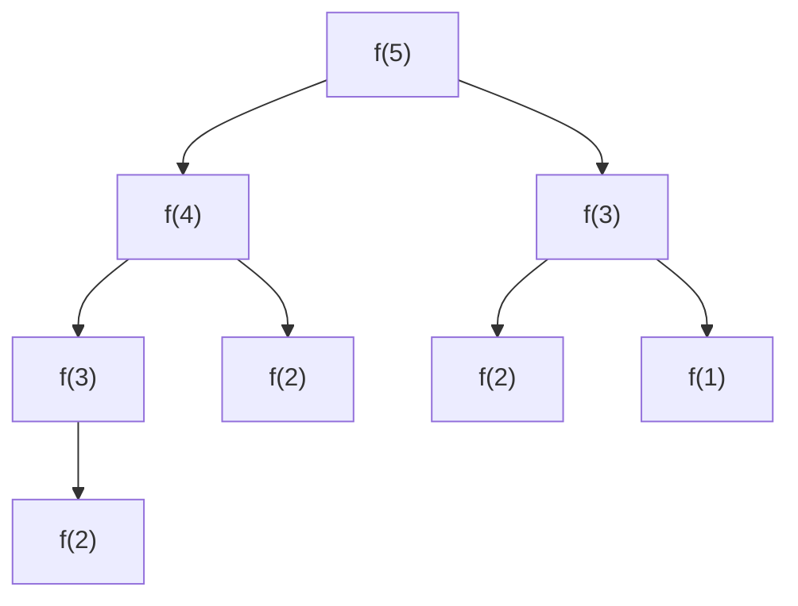
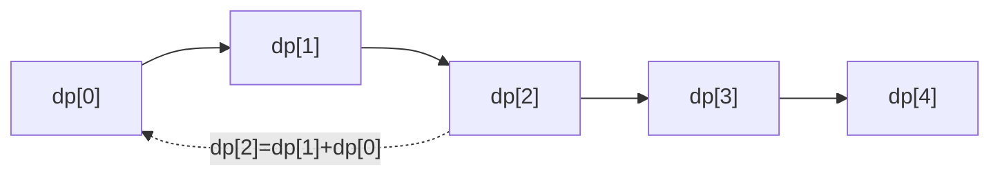
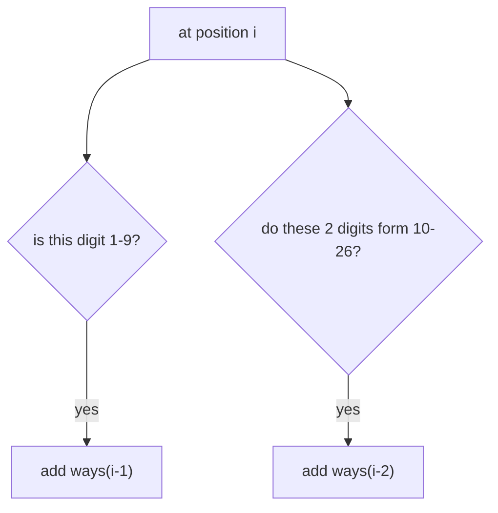
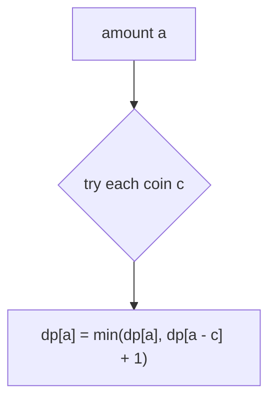
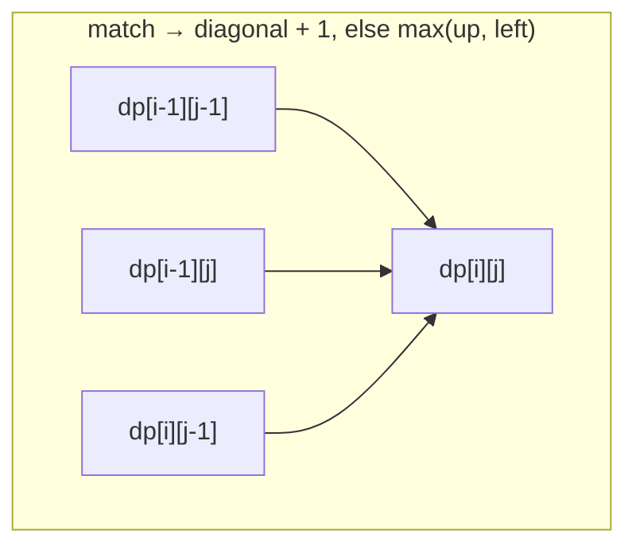
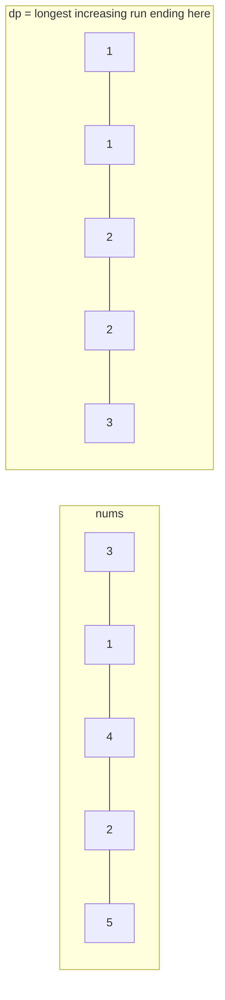
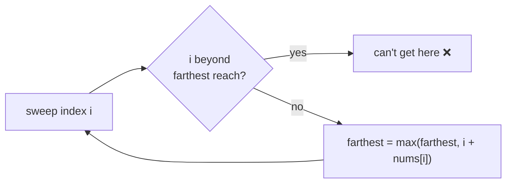
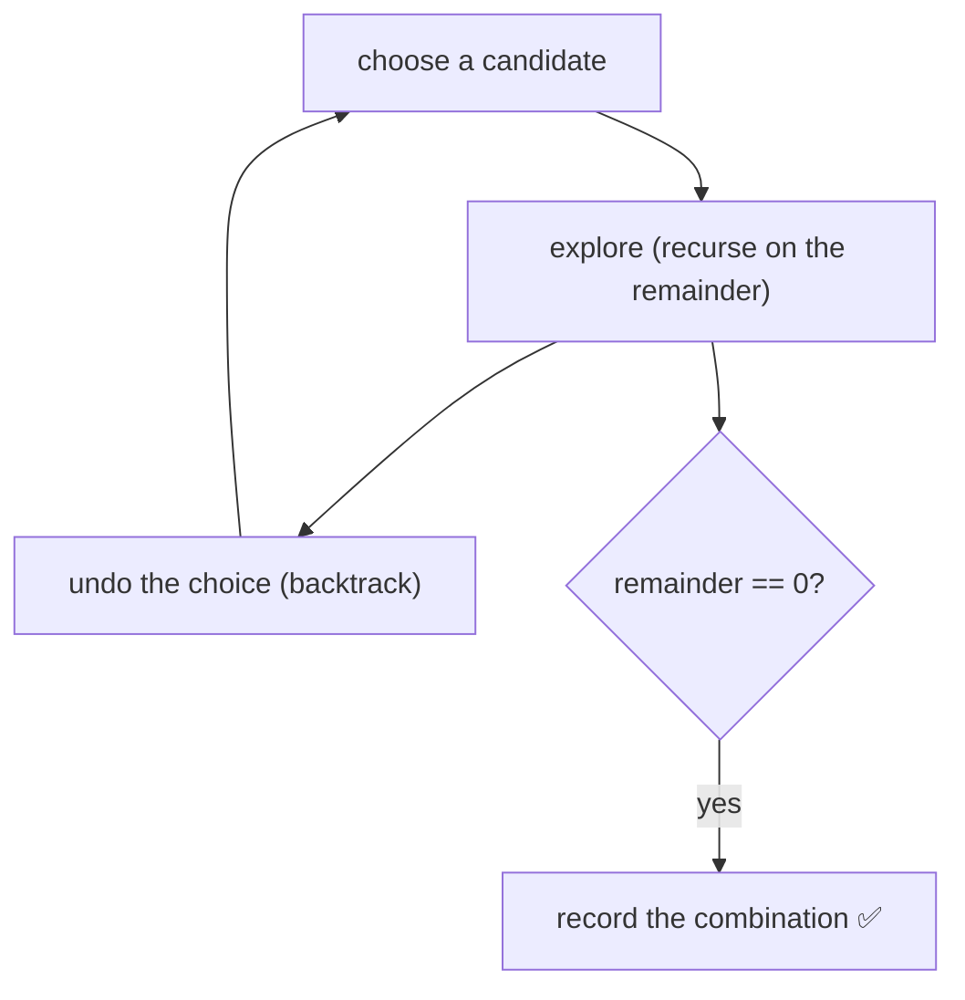
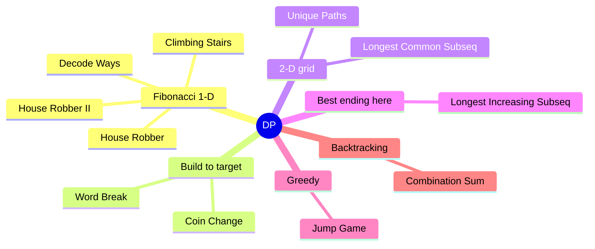

# 🧮 Dynamic Programming — Concept Tutorial

> A plain-language guide to the ideas behind the Blind 75 **Dynamic Programming** problems, with diagrams.
> Pair this with `visualizations/Dynamic Programming/` and `notebooks/Dynamic Programming/`.

---

## 1. What is Dynamic Programming?

**DP** solves a big problem by solving smaller **overlapping** subproblems **once** and reusing the answers. The naive recursion recomputes the same things exponentially; DP remembers them.

Look at plain recursion for "climb n stairs" — notice how `f(3)` gets computed many times:

DP computes each state **once** and stores it. Two styles:
- **Memoization** — recursion + a cache.
- **Tabulation** — fill a table from the smallest cases up (usually preferred).

**The recipe:** define the **state** (what does `dp[i]` mean?), write the **recurrence** (how does it use smaller states?), set the **base cases**, pick a **fill order**.

---

## 2. Pattern A — Fibonacci-Style 1-D DP

Each answer is built from the previous one or two.

Often you only need the last couple of values → **O(1) space** with two rolling variables.
**The tell:** *"count the ways"*, or optimize along a line where each step depends on the last few.
**Problems:** Climbing Stairs, House Robber, House Robber II (circle → run it twice), Decode Ways.

Decode Ways adds validity checks:

---

## 3. Pattern B — Build Up to a Target

To make an amount/prefix, first solve every smaller amount, then combine.

Greedy fails here (biggest coin first can miss the best) — DP tries **all** choices.
**The tell:** *"fewest / number of ways to make a target from reusable parts"*.
**Problems:** Coin Change, Word Break (a prefix works if a word ends here **and** the part before also works).

---

## 4. Pattern C — 2-D Grid DP

Two sequences to compare, or a grid to cross. Each cell leans on already-filled neighbors.

**The tell:** *"longest common ... of two strings"*, *"edit distance"*, *"count grid paths"*.
**Problems:** Longest Common Subsequence, Unique Paths (each cell = cell above + cell left).

---

## 5. Pattern D — "Best Ending Here"

For each position, find the best answer that finishes right there; the overall best is the max.

**The tell:** longest/optimal **subsequence** where each element extends earlier ones.
**Problems:** Longest Increasing Subsequence (`O(n²)` DP, or `O(n log n)` with binary search).

---

## 6. Pattern E — When Greedy Beats DP

Sometimes one clever running value replaces the whole table.

**Problems:** Jump Game (greedy "farthest reach" is `O(n)`; the reachability DP is `O(n²)`).

---

## 7. Pattern F — Backtracking (list all solutions)

When you must **list** every combination (not just count/optimize), build choices, explore, and **undo**.

**Problems:** Combination Sum (a start index avoids duplicates; sort to prune).

---

## 8. Which Pattern for Which Problem?

---

## 9. Complexity Cheat Sheet

| Pattern | Time | Space |
|---|---|---|
| 1-D DP | `O(n)` | `O(n)` → `O(1)` |
| Build to target | `O(target × choices)` | `O(target)` |
| 2-D grid | `O(m × n)` | `O(m × n)` → `O(n)` |
| Best ending here | `O(n²)` / `O(n log n)` | `O(n)` |
| Greedy | `O(n)` | `O(1)` |

---

## 10. Interview Playbook

1. **Say the brute force** — "try every choice recursively" — then notice it recomputes subproblems (the DP signal).
2. **Name the state** (`dp[i]` means…), write the **recurrence** and **base cases**.
3. **Pick a fill order** so every value is ready when needed; then shrink memory if only recent values matter.
4. **Ask if greedy works** — sometimes a single running value replaces the whole table.

> ▶ **Next:** open `visualizations/Dynamic Programming/index.html` to watch tables fill cell by cell.
