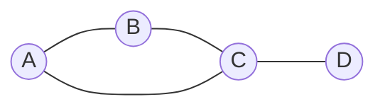
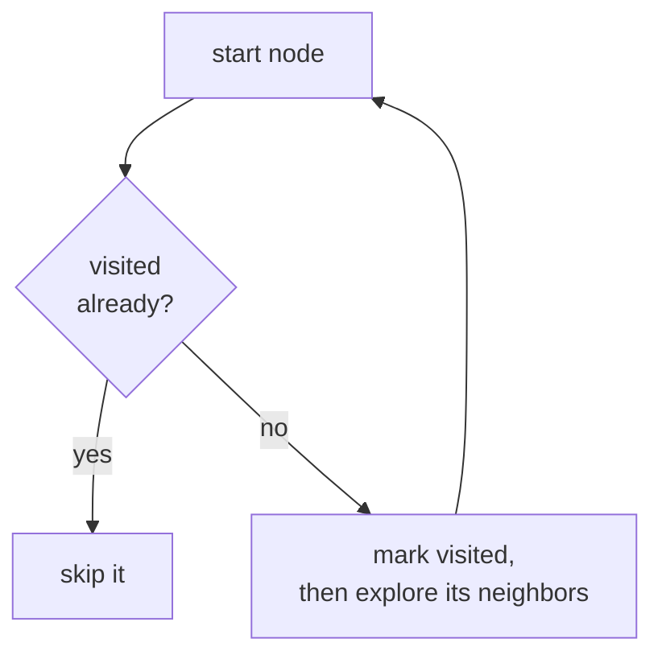
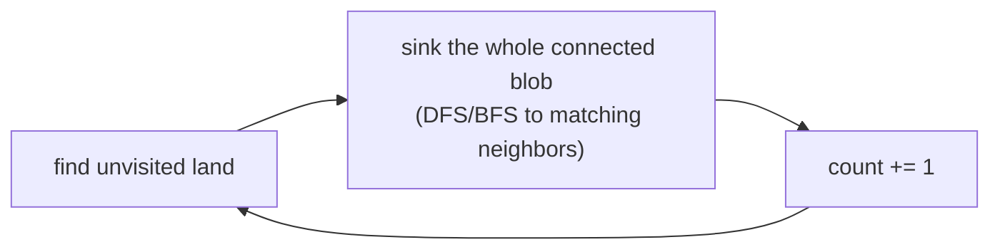
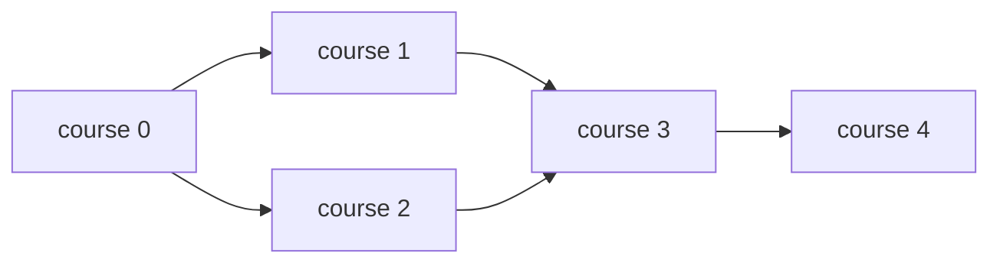
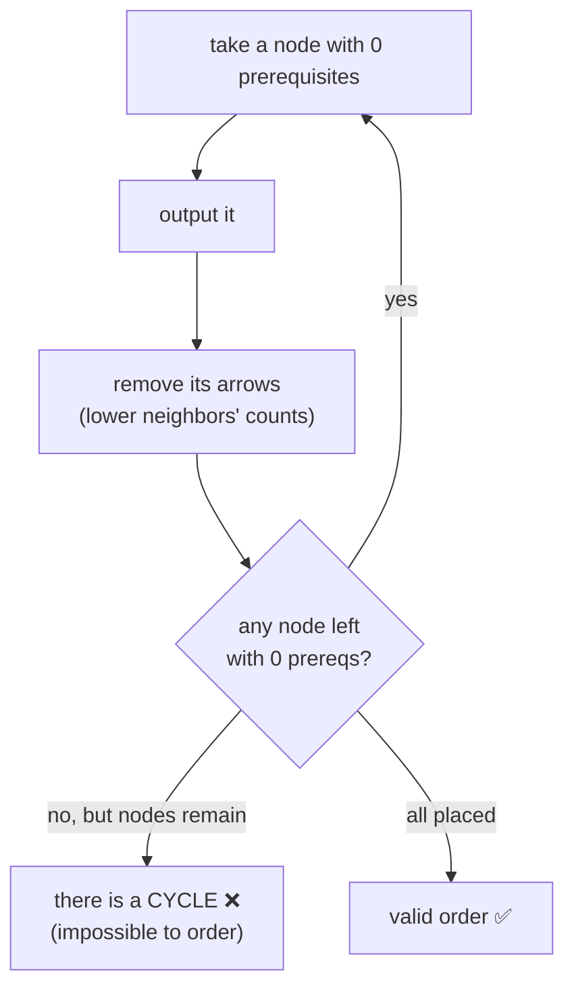
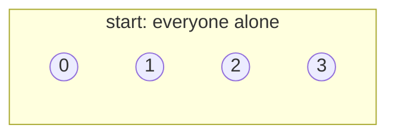
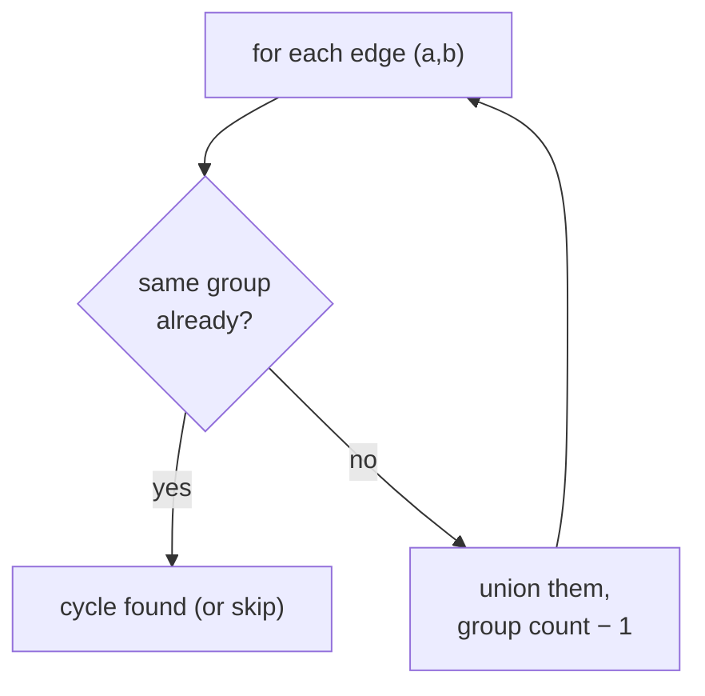
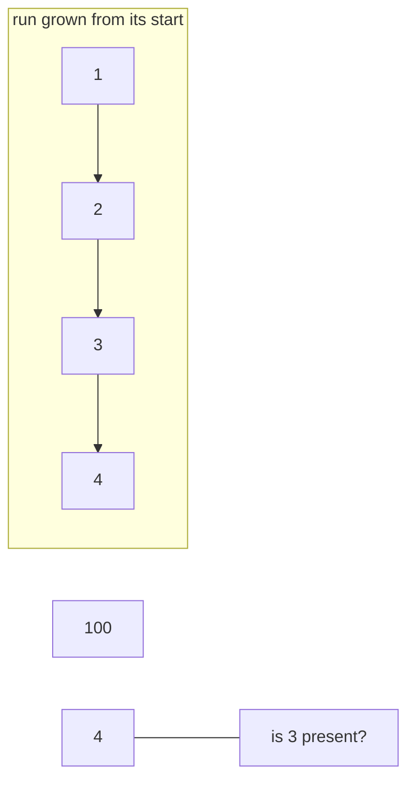
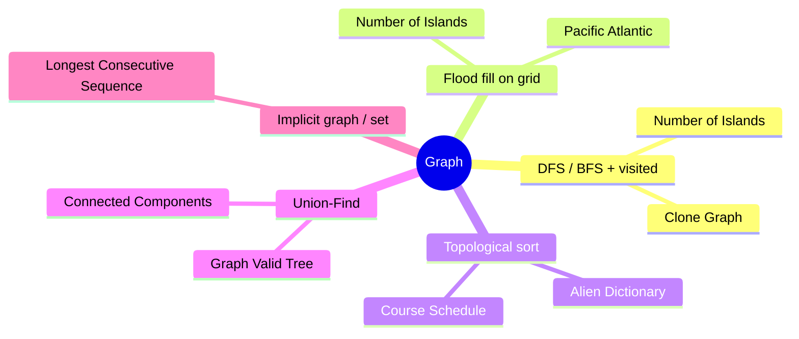

# 🕸️ Graph — Concept Tutorial

> A plain-language guide to the ideas behind the Blind 75 **Graph** problems, with diagrams.
> Pair this with `visualizations/Graph/` and `notebooks/Graph/`.

---

## 1. What is a Graph?

A **graph** is dots (**nodes**) joined by lines (**edges**). Edges can be **two-way** (undirected, like friendships) or **one-way** (directed, like prerequisites). A **grid** is just a graph where each cell links to its neighbors.



We usually store a graph as an **adjacency list** — a map from each node to the list of nodes it connects to:

```
A: [B, C]
B: [A, C]
C: [A, B, D]
D: [C]
```

**The golden rule:** always keep a **visited** set so you never loop forever.

---

## 2. DFS and BFS (with a visited set)



- **DFS** follows one path deep (recursion or a stack).
- **BFS** spreads out in rings (a queue) — best for *fewest steps*.
- Both are **O(V + E)** — every node and edge once.

**Problems:** Clone Graph (copy while walking, keep an original→copy map), Number of Islands.

---

## 3. Flood Fill (graphs on a grid)

An **island** is a connected blob of land. Scan the grid; when you hit new land, "flood fill" the whole blob (sink it so you don't recount) and add one to the count.



A powerful twist: **search backwards from the goal.** For *Pacific Atlantic*, don't test every cell — start at the ocean borders and climb uphill; the cells you reach are exactly those that can drain to that ocean.

**Problems:** Number of Islands, Pacific Atlantic Water Flow.

---

## 4. Topological Sort (ordering with dependencies)

If tasks have "do X before Y" rules, a **topological order** lists them so every arrow points forward. **Kahn's method:** repeatedly take a node with **no remaining prerequisites**, output it, and remove its outgoing arrows.





**The tell:** *prerequisites*, *dependencies*, *ordering*, *"can it be scheduled?"*
**Problems:** Course Schedule, Alien Dictionary (letter-order clues → arrows → topo sort).

---

## 5. Union-Find (merging groups)

**Union-Find** tracks which items are in the same group. `find(x)` returns x's group leader; `union(a, b)` merges two groups. Joining two nodes that are **already** together reveals a **cycle**.





- **Count components:** start at `n` groups, subtract one per merging edge.
- **Valid tree:** exactly `n−1` edges **and** no cycle **and** all connected.

**Problems:** Number of Connected Components, Graph Valid Tree.

---

## 6. A Set Can Be a Graph

Some problems have **implicit** edges. In *Longest Consecutive Sequence*, the numbers 1-2-3-4 form an invisible chain. Put everything in a set and only start counting a run where its predecessor is missing.



**Problems:** Longest Consecutive Sequence.

---

## 7. Which Pattern for Which Problem?



---

## 8. Complexity Cheat Sheet

| Pattern          | Time                | Space               |
| ---------------- | ------------------- | ------------------- |
| DFS / BFS        | `O(V + E)`        | `O(V)`            |
| Flood fill       | `O(rows × cols)` | `O(rows × cols)` |
| Topological sort | `O(V + E)`        | `O(V + E)`        |
| Union-Find       | ~`O(V + E)`       | `O(V)`            |

---

## 9. Interview Playbook

1. **Name the graph:** what are the nodes and edges? Directed? A grid in disguise?
2. **Spot the tell:** reach/copy/connected → *DFS/BFS + visited*; grid regions → *flood fill*; dependencies/order → *topological sort*; count groups / detect cycles → *Union-Find*.
3. **Always track visited** so you never loop, and state the cost (most graph walks are `O(V + E)`).
4. **Mind the edges:** disconnected pieces, isolated nodes, empty graph, cycles.

> ▶ **Next:** open `visualizations/Graph/index.html` to watch traversal, topo sort, and union-find animate.
