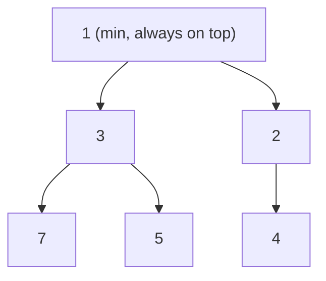
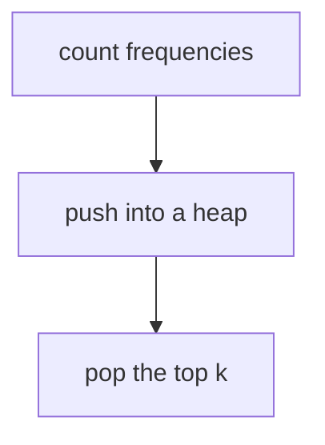
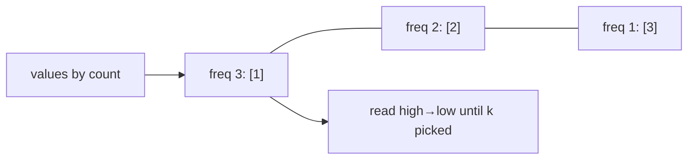
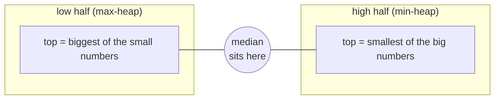
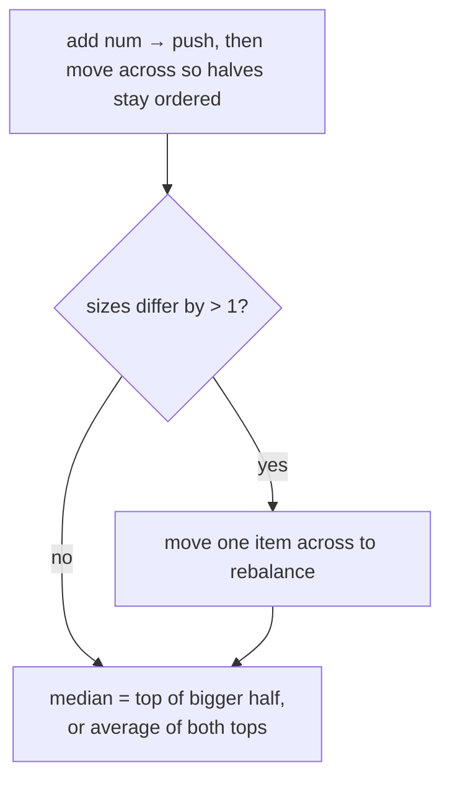
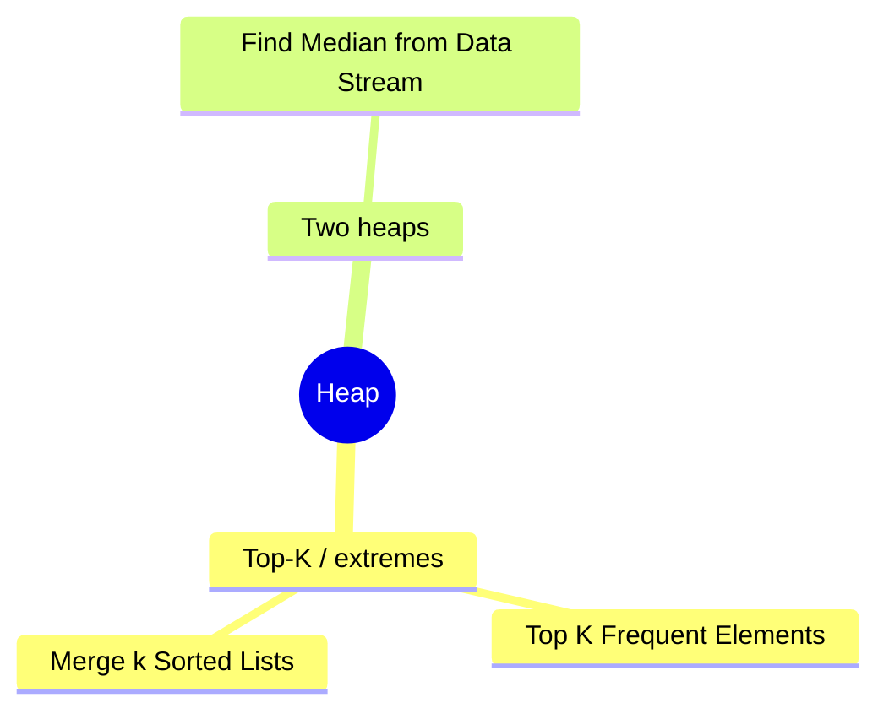

# ⛰️ Heap — Concept Tutorial

> A plain-language guide to the ideas behind the Blind 75 **Heap** problems, with diagrams.
> Pair this with `visualizations/Heap/` and `notebooks/Heap/`.

---

## 1. What is a Heap?

A **heap** is a tree-shaped structure that always keeps its smallest (a **min-heap**) or largest (a **max-heap**) item at the very top. You can peek at that extreme in `O(1)` and add/remove in `O(log n)` — without keeping everything fully sorted.

*Each parent is ≤ its children, so the minimum bubbles to the root.*

- **Peek min/max:** `O(1)`
- **Push / pop:** `O(log n)`
- **In Python:** `heapq` (a min-heap). For a max-heap, store **negated** values.

---

## 2. Pattern A — Top-K / Repeated Extremes

When you need the **k largest / smallest / most frequent**, you don't need to sort everything — keep a heap and pull extremes.

Even faster when a key is **bounded**: for *Top K Frequent*, a value's frequency can't exceed `n`, so **bucket** values by frequency and read from the top → `O(n)`.

**Problems:** Top K Frequent Elements, Merge k Sorted Lists (heap of the k current heads — see the Linked List tutorial).

---

## 3. Pattern B — Two Heaps Around the Middle

To track a **running median**, split the numbers into a **low half** (a max-heap, its biggest on top) and a **high half** (a min-heap, its smallest on top). Keep their sizes within one of each other — the median is always at the tops.

Adding a number:

**Problems:** Find Median from Data Stream.

---

## 4. Which Pattern for Which Problem?

---

## 5. Complexity Cheat Sheet

| Task | Time | Space |
|---|---|---|
| Top-K with a heap | `O(n log k)` | `O(k)` |
| Top-K by bucketing | `O(n)` | `O(n)` |
| k-way merge | `O(N log k)` | `O(k)` |
| Median: add / read | `O(log n)` / `O(1)` | `O(n)` |

---

## 6. Interview Playbook

1. **Ask: do I need the extreme repeatedly?** That's the heap signal.
2. **Size the heap to k** for top-k, or **split into two heaps** for a median.
3. **Remember Python's `heapq` is a min-heap** — negate values for a max-heap, and add a tiebreaker so it never compares payload objects.
4. **Consider bucketing** when the sorting key is bounded (frequencies ≤ n) — that beats a heap.

> ▶ **Next:** open `visualizations/Heap/index.html` to watch buckets fill and two heaps balance.
