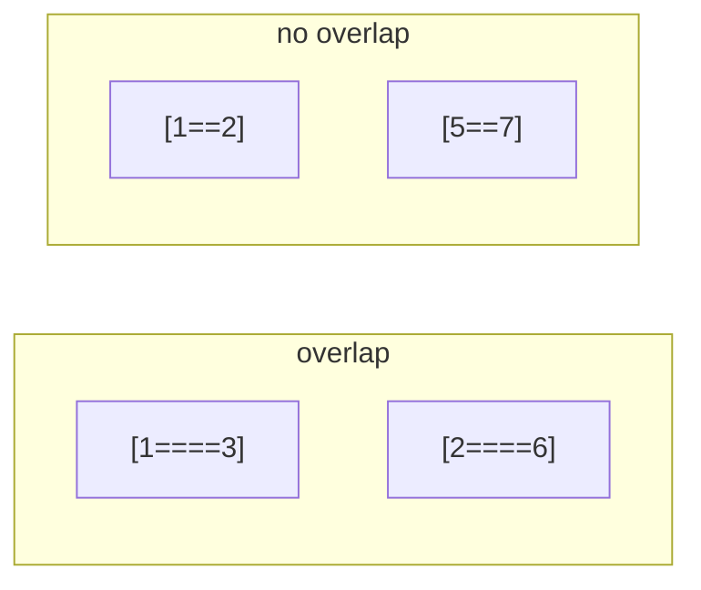
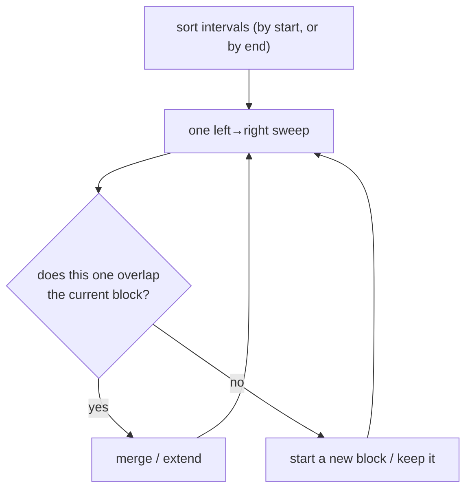
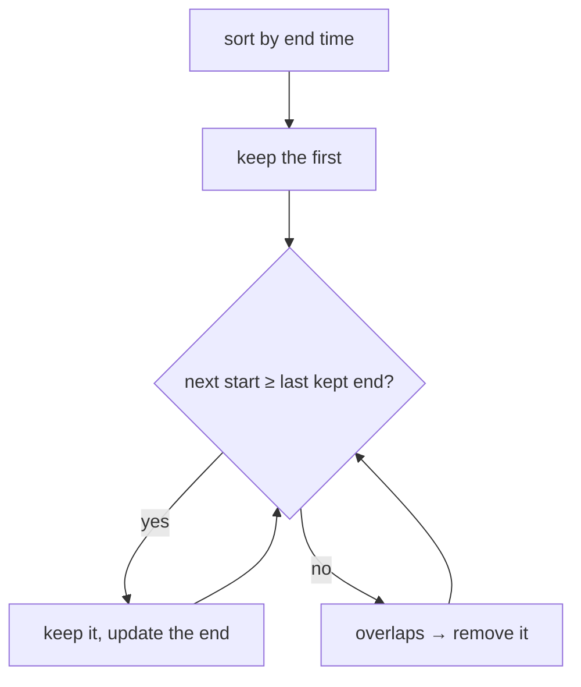
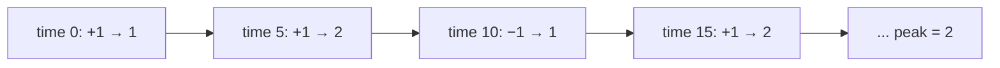
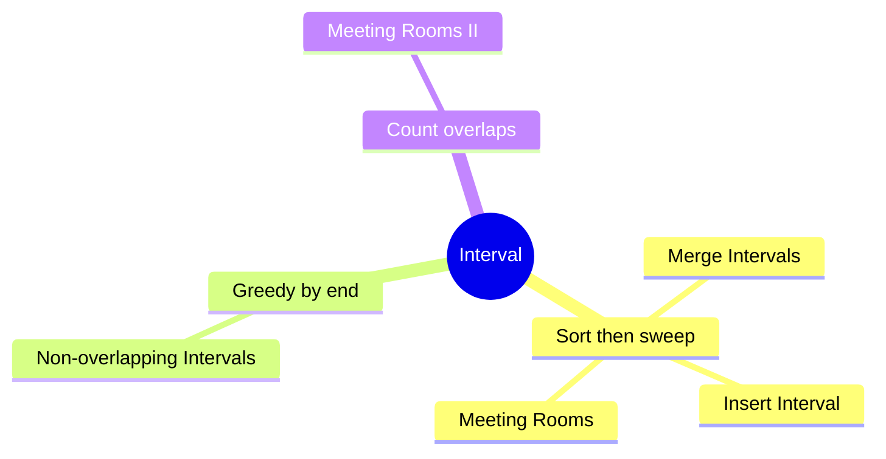

# ⏱️ Interval — Concept Tutorial

> A plain-language guide to the ideas behind the Blind 75 **Interval** problems, with diagrams.
> Pair this with `visualizations/Interval/` and `notebooks/Interval/`.

---

## 1. What is an Interval?

An **interval** is a range with a start and an end, like a meeting `[9, 10]`. Interval problems ask about how ranges **overlap**.

Two intervals `[a, b]` and `[c, d]` **overlap** when `a ≤ d` **and** `c ≤ b`.

---

## 2. The One Big Idea: Sort, Then Sweep

Almost every interval problem starts by **sorting** — usually by **start** time. Once sorted, overlapping intervals sit next to each other, so a single left-to-right pass handles them.

**Sort by start** to *merge*; **sort by end** to *keep the most*.

---

## 3. Pattern A — Merge Overlaps

Sort by start; keep a current block. If the next interval starts before the current block ends, stretch the block's end; otherwise begin a new block.

```mermaid
gantt
    title Merge Intervals — [[1,3],[2,6],[8,10],[15,18]]
    dateFormat X
    axisFormat %s
    section input
    a :0, 1, 3
    b :0, 2, 6
    c :0, 8, 10
    d :0, 15, 18
    section merged
    m1 :crit, 1, 6
    m2 :crit, 8, 10
    m3 :crit, 15, 18
```

**Problems:** Merge Intervals, Insert Interval (three phases: intervals *before* the new one, *overlapping* ones merged in, then the *rest*).

---

## 4. Pattern B — Greedy by Earliest End

To keep the **most** non-overlapping intervals (or remove the fewest), sort by **end** time and always keep the interval that finishes soonest — it leaves the most room for the rest.

**Problems:** Non-overlapping Intervals.

---

## 5. Pattern C — Count Overlaps (Rooms Needed)

The number of rooms/servers needed is the **maximum number of intervals active at once**. Two ways:

**Sweep line:** turn each interval into a `+1` at its start and a `−1` at its end, sort by time, and track the running peak.

**Min-heap of end times:** for each meeting, if the earliest end ≤ its start, reuse that room (pop); always push this end. The heap size is the rooms in use.

**Problems:** Meeting Rooms II. (Meeting Rooms I is the simpler "any overlap at all?" — sort and check neighbors.)

---

## 6. Which Pattern for Which Problem?

---

## 7. Complexity Cheat Sheet

| Pattern | Time | Space |
|---|---|---|
| Sort + sweep | `O(n log n)` | `O(n)` |
| Greedy by end | `O(n log n)` | `O(1)` |
| Sweep line / heap | `O(n log n)` | `O(n)` |
| Insert (already sorted) | `O(n)` | `O(n)` |

---

## 8. Interview Playbook

1. **Sort first** — by start to merge, by end to keep the most.
2. **Define overlap precisely** (`a ≤ d and c ≤ b`) and mind touching endpoints (`<` vs `≤`).
3. **For "how many at once", think events** (`+1`/`−1`) or a **heap of end times**.

> ▶ **Next:** open `visualizations/Interval/index.html` to watch intervals merge and rooms count up.
