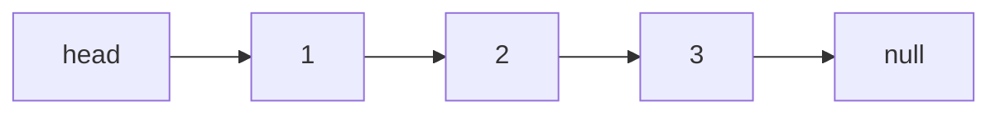
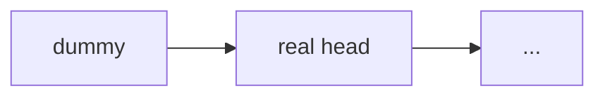
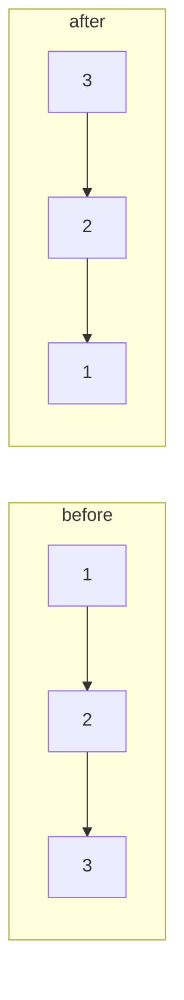
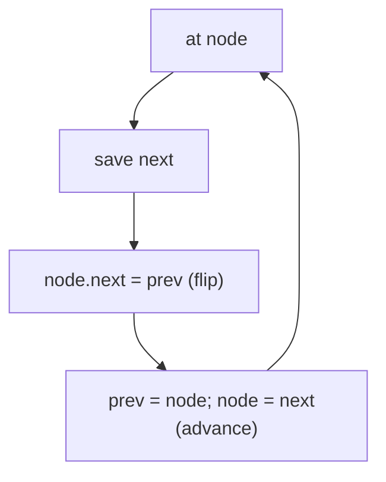
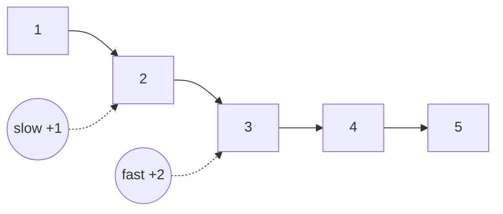
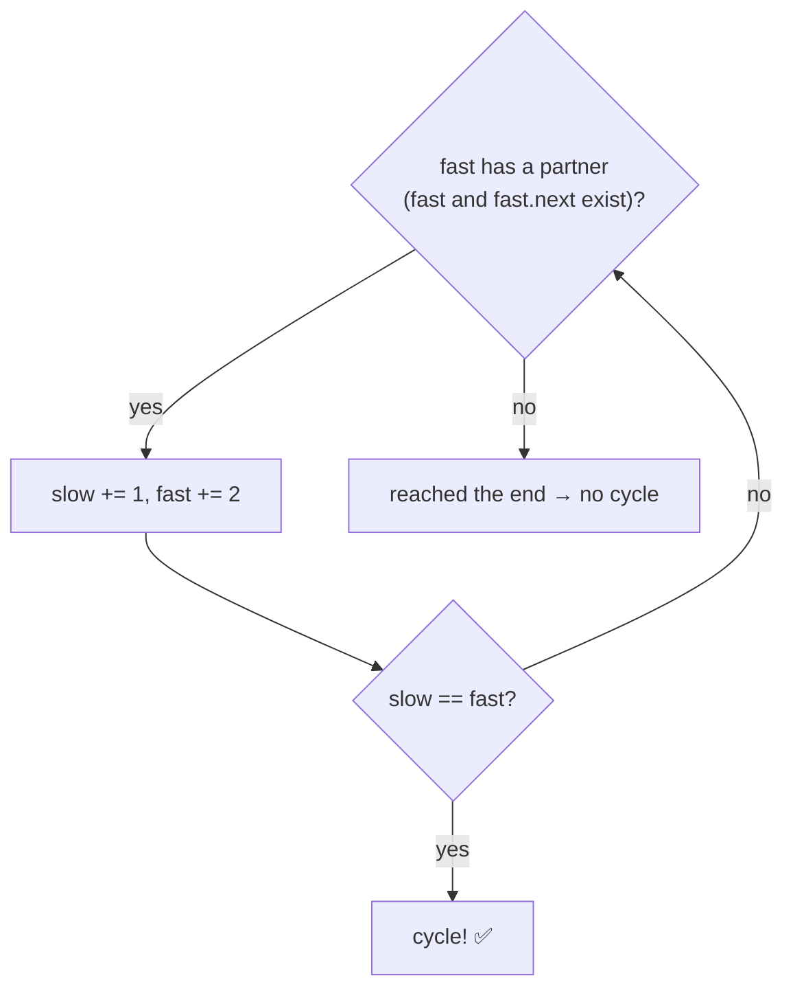
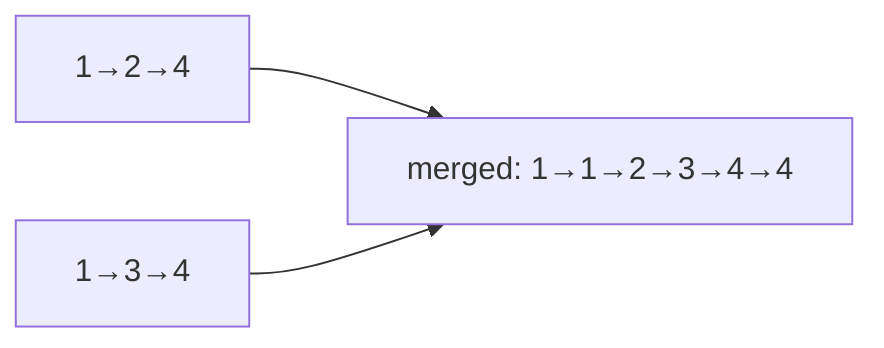
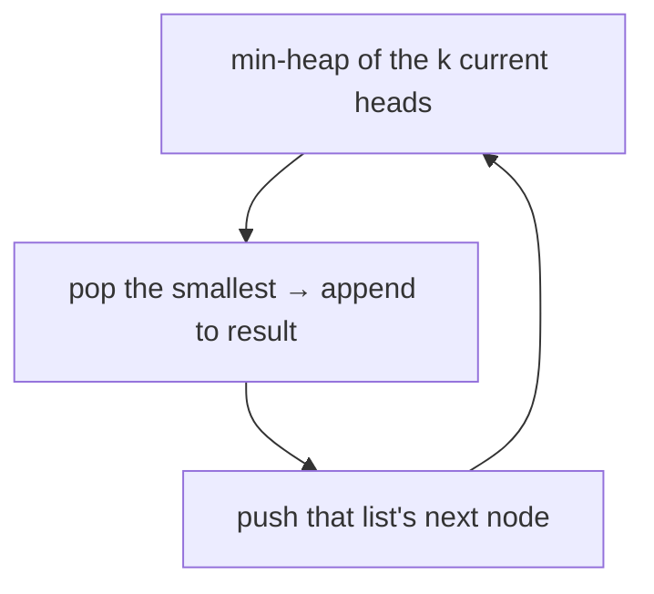
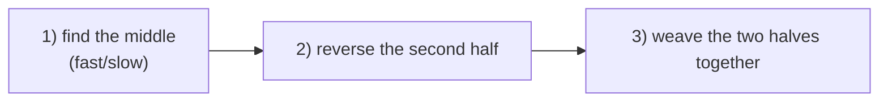
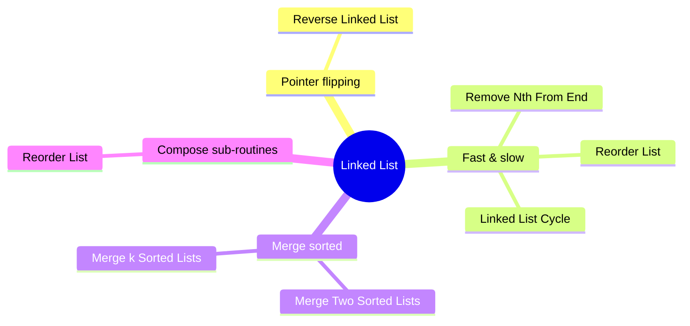

# 🔗 Linked List — Concept Tutorial

> A plain-language guide to the ideas behind the Blind 75 **Linked List** problems, with diagrams.
> Pair this with `visualizations/Linked List/` and `notebooks/Linked List/`.

---

## 1. What is a Linked List?

A **linked list** is a chain of nodes. Each node holds a value and a pointer to the **next** node. There's no index — you can only walk forward from the **head**.

Because you only have pointers, the whole skill is **moving pointers carefully** — and always saving the next node *before* you overwrite a link.

---

## 2. The Dummy Node Trick

A **dummy** node placed before the head removes annoying "is this the first node?" special cases. You build off `dummy.next` and return it at the end.

Used in: merging, removing nodes, reordering.

---

## 3. Pattern A — Pointer Flipping (Reverse)

Reversing means every arrow points the other way. Drag a `prev` pointer along; at each node, remember `next`, point the node back at `prev`, then advance.

**Problems:** Reverse Linked List (also a building block of Reorder List).

---

## 4. Pattern B — Fast & Slow Pointers

Two pointers moving at different speeds reveal **loops** and **middles** with `O(1)` memory.

- **Cycle detection:** if the list loops, fast laps slow and they meet. If fast hits the end, no loop.
- **Find the middle:** when fast reaches the end, slow is at the middle.
- **N-th from the end:** open a **gap of n** between two pointers; when fast hits the end, slow is just before the target.

**Problems:** Linked List Cycle, Remove Nth Node From End, Reorder List (to find the middle).

---

## 5. Pattern C — Merging Sorted Lists

Weave two sorted lists by always attaching the **smaller** front node (a dummy head keeps it clean).

For **k** lists, keep the k front values in a **min-heap** and always pop the smallest — `O(N log k)`.

**Problems:** Merge Two Sorted Lists, Merge k Sorted Lists.

---

## 6. Pattern D — Compose Sub-Routines (Reorder List)

Reorder `L0→L1→…→Ln` into `L0→Ln→L1→Ln-1→…` by combining three reusable moves:

**Problems:** Reorder List.

---

## 7. Which Pattern for Which Problem?

---

## 8. Complexity Cheat Sheet

| Task | Time | Space |
|---|---|---|
| Reverse / traverse | `O(n)` | `O(1)` |
| Cycle / middle (fast-slow) | `O(n)` | `O(1)` |
| Merge two | `O(n + m)` | `O(1)` |
| Merge k (heap) | `O(N log k)` | `O(k)` |

---

## 9. Interview Playbook

1. **Draw the nodes and arrows** — linked-list bugs are almost always pointer order.
2. **Use a dummy head** whenever the head might change.
3. **Save `next` before overwriting it** — the #1 way to lose the rest of the list.
4. **Reach for fast/slow** for middles, cycles, and "from the end".

> ▶ **Next:** open `visualizations/Linked List/index.html` to watch pointers flip and runners meet.
