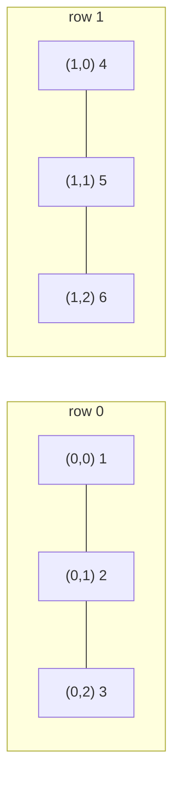
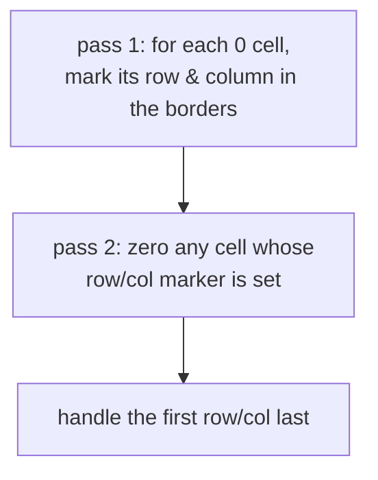
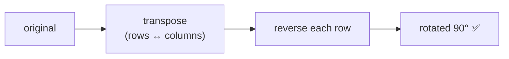
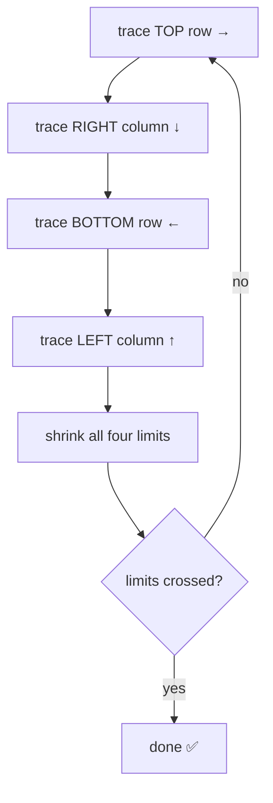
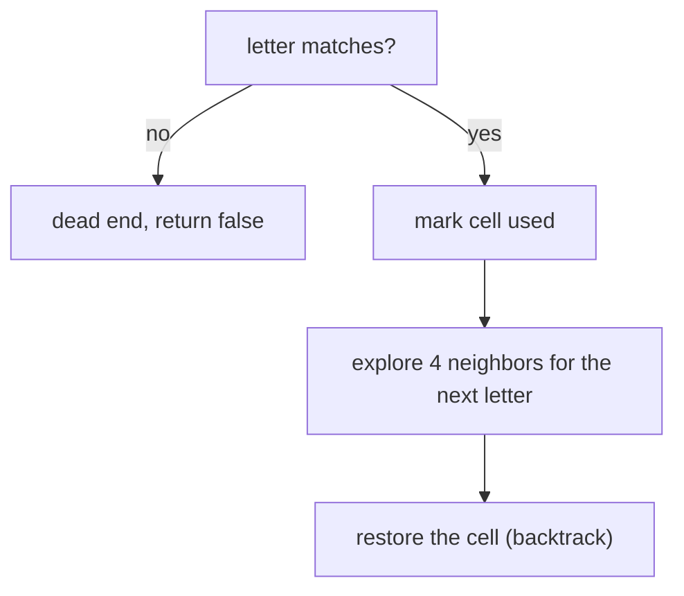
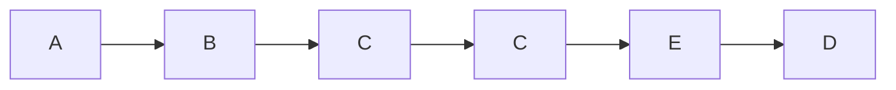
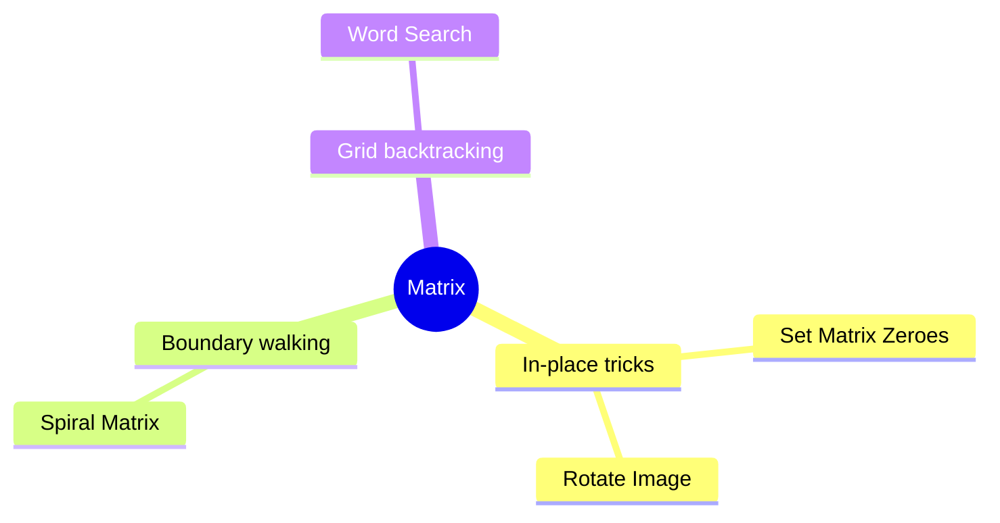

# 🔲 Matrix — Concept Tutorial

> A plain-language guide to the ideas behind the Blind 75 **Matrix** problems, with diagrams.
> Pair this with `visualizations/Matrix/` and `notebooks/Matrix/`.

---

## 1. What is a Matrix?

A **matrix** is a grid — a list of rows, each a list of values. You address a cell by `(row, col)`.

A cell's four neighbors are `(r±1, c)` and `(r, c±1)`.

---

## 2. Pattern A — In-Place Grid Tricks (O(1) space)

Rearrange a grid using **itself** as scratch paper.

**Set Matrix Zeroes:** if a cell is 0, its whole row and column become 0. Instead of separate sets, store the flags in the **first row and column**.

**Rotate Image (90° clockwise):** two elementary moves — **transpose** (swap `[i][j]`↔`[j][i]`), then **reverse each row**.

**Problems:** Set Matrix Zeroes, Rotate Image.

---

## 3. Pattern B — Boundary Walking (Spiral)

A spiral is the four outer edges repeated on an ever-smaller rectangle. Track `top / bottom / left / right` limits and shrink them.

**Problems:** Spiral Matrix.

---

## 4. Pattern C — Grid Backtracking (Word Search)

A word is a path of adjacent cells. From each matching first letter, DFS to neighbors matching the next letter — **mark** the current cell used so a path can't reuse it, and **restore** it when you back out.

*A path spelling "ABCCED".*

**Problems:** Word Search. (Word Search II adds a **trie** — see the Tree tutorial.)

---

## 5. Which Pattern for Which Problem?

---

## 6. Complexity Cheat Sheet

| Pattern | Time | Space |
|---|---|---|
| In-place transform | `O(m × n)` | `O(1)` |
| Spiral traversal | `O(m × n)` | `O(1)` |
| Word search (DFS) | `O(m × n × 4ᴸ)` | `O(L)` |

---

## 7. Interview Playbook

1. **Fix your coordinates:** `(row, col)`, neighbors, and how transpose maps `[i][j] ↔ [j][i]`.
2. **Ask for O(1) space:** can the grid store its own flags, or can moves compose (transpose + reverse)?
3. **For traversal, track boundaries;** for path search, **backtrack** (mark / restore).
4. **Mind the edges:** single row/column, non-square grids, empty grid.

> ▶ **Next:** open `visualizations/Matrix/index.html` to watch spirals trace and grids rotate.
