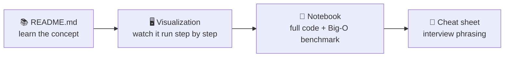

# 📚 Blind 75 — Study Guide

Everything for one topic — the concept tutorial, the interactive visualizations, the runnable notebooks, and the interview cheat sheet — lives together in that topic's folder. No jumping between separate top-level trees during revision.

> 💡 Mermaid diagrams render automatically on GitHub, in VS Code (with a Markdown Preview Mermaid extension), and in Obsidian/Typora. In a plain text editor you'll see the diagram source inside ` ```mermaid ` code fences.

## Topics

| # | Topic | Covers | Core patterns |
|---|----------|:------:|---------------|
| 1 | [Array](Array/README.md) | 10 problems | Hash map · Two pointers · Running value · Prefix/suffix · Binary search |
| 2 | [String](String/README.md) | 10 problems | Count letters · Stack · Two pointers · Sliding window · Expand-around-center · Length prefix |
| 3 | [Tree](Tree/README.md) | 14 problems | DFS/BFS · BST order · Traversal orders · Return+global best · Trie |
| 4 | [Graph](Graph/README.md) | 8 problems | DFS/BFS+visited · Flood fill · Topological sort · Union-Find |
| 5 | [Dynamic Programming](Dynamic%20Programming/README.md) | 11 problems | 1-D DP · Build-to-target · 2-D grid · Best-ending-here · Greedy · Backtracking |
| 6 | [Linked List](Linked%20List/README.md) | 6 problems | Pointer flipping · Fast/slow · Merge · Compose sub-routines |
| 7 | [Binary / Bit](Binary/README.md) | 5 problems | XOR cancels pairs · Clear/count bits · Build bit-by-bit |
| 8 | [Interval](Interval/README.md) | 5 problems | Sort-then-sweep · Greedy by end · Count overlaps |
| 9 | [Matrix](Matrix/README.md) | 4 problems | In-place tricks · Boundary walking · Grid backtracking |
| 10 | [Heap](Heap/README.md) | 3 problems | Top-K / extremes · Two heaps |

## What's inside each topic folder

```
<Topic>/
├── README.md              — the concept tutorial: ideas and patterns, with diagrams
├── index.html              — visual hub for the topic's problems
├── patterns.html           — cheat sheet: the tell + a sentence to say in an interview
└── <Group>/ or flat        — one folder per pattern-group (grouped topics), or problems directly (flat topics)
    ├── <problem>.ipynb      — runnable Python: worst → optimal solutions, tests, complexity plots
    ├── <problem>.html       — interactive step-by-step visualization
    └── <problem>_explained.md   — deep-dive writeup (where one exists)
```



- **Tracker** ([`Blind75_Tracker.md`](Blind75_Tracker.md)) — progress across all 75.
- **Visual hub** ([`index.html`](index.html)) — browse all topics from one page.
- **YouTube references** ([`NeetCode_YouTube_Links.md`](NeetCode_YouTube_Links.md)) — topic-agnostic video links.
- **`bench_utils.py`** — shared benchmarking helper imported by every notebook (they walk up parent directories to find it, so it stays at the root).

## Suggested study loop per topic

1. **Read `<Topic>/README.md`** → understand the handful of patterns.
2. **Skim `<Topic>/patterns.html`** → learn to *recognize* each pattern.
3. **For each problem, in its group folder:** try it yourself → check the `.html` visualization → read the `.ipynb` notebook's approaches, complexity, and (where present) the `_explained.md` deep dive.
4. **Tick it off** in `Blind75_Tracker.md`.
