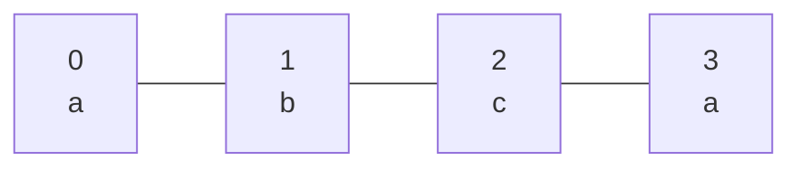
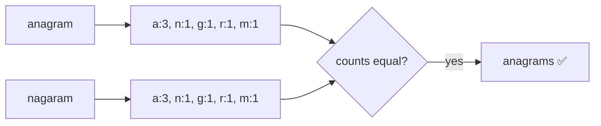
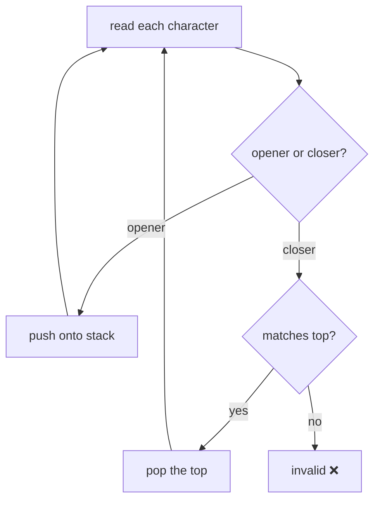
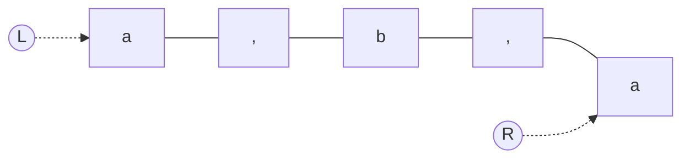
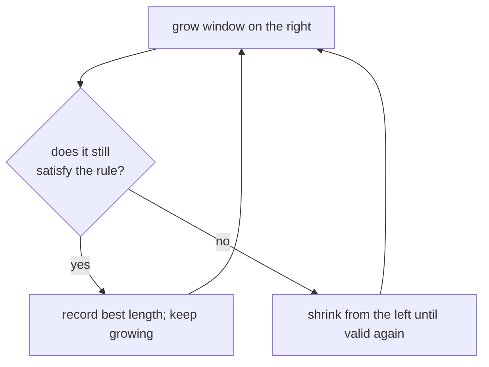
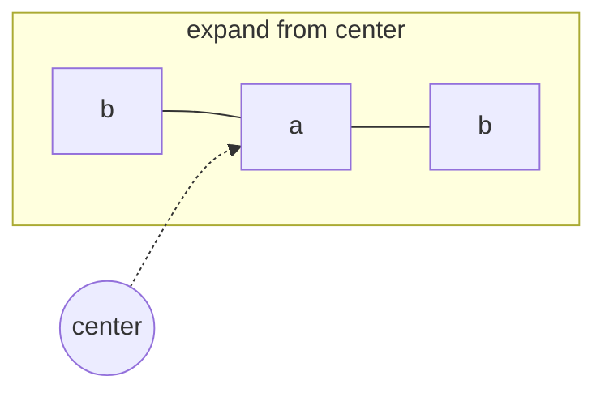
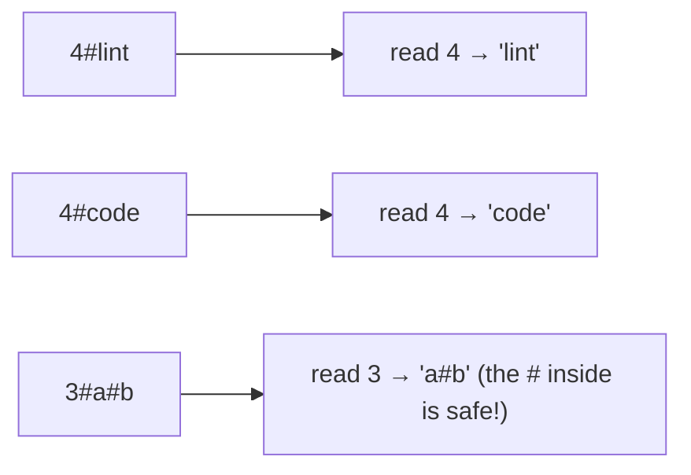
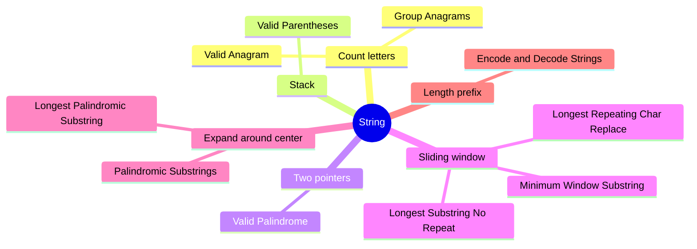

# 🔤 String — Concept Tutorial

> A plain-language guide to the ideas behind the Blind 75 **String** problems, with diagrams.
> Pair this with `visualizations/String/` and `notebooks/String/`.

---

## 1. Strings are Arrays of Characters

A string is just a row of characters with indices. Everything you know about arrays applies — plus a few string-specific tools.

---

## 2. The Core Patterns

### 🧮 Pattern A — Count the Letters (Frequency Map)

To compare or group words by *which letters they use* (not their order), count each letter into a map.

**The tell:** *"same letters rearranged"*, *"group equivalent words"*.
**Problems:** Valid Anagram, Group Anagrams (bucket by a shared "fingerprint").

---

### 🧺 Pattern B — Stack for Nesting

A **stack** is a last-in-first-out pile. Brackets nest like boxes, so the most recently opened must close first.

At the end the stack must be **empty**.
**The tell:** *"balanced brackets"*, *"valid nesting"*, *"most recent must resolve first"*.
**Problems:** Valid Parentheses.

---

### 👉👈 Pattern C — Two Pointers From Both Ends

To check a palindrome, compare the outermost characters and step inward, skipping anything that isn't a letter or digit.

**The tell:** *"same forwards and backwards"*, *"mirror"*.
**Problems:** Valid Palindrome.

---

### 🪟 Pattern D — Sliding Window

A **window** is a range `[left, right]` you grow on the right and shrink on the left, keeping a running summary (a set or counts). Each character enters and leaves at most once → `O(n)`.

Flavors:
- **No repeats** → shrink when a character repeats (Longest Substring Without Repeating).
- **At most k changes** → shrink when `window − most-common-letter > k` (Longest Repeating Character Replacement).
- **Contain all of a target** → grow to cover, then squeeze (Minimum Window Substring).

**The tell:** *"longest / shortest substring that satisfies a rule"*.

---

### ↔️ Pattern E — Expand Around Center

Every palindrome has a middle. Plant a center (a letter, or the gap between two) and stretch outward while both sides match.

There are ~2n centers (odd + even). Each stretch is `O(n)` → `O(n²)` total, `O(1)` space.
**Problems:** Longest Palindromic Substring, Palindromic Substrings (count each successful stretch).

---

### 📏 Pattern F — Length-Prefix Framing

To pack strings into one string safely (even if they contain your separator), write each piece's **length** before it: `4#lint`. To read back, read the number, then take exactly that many characters.

**Problems:** Encode and Decode Strings.

---

## 3. Which Pattern for Which Problem?

---

## 4. Complexity Cheat Sheet

| Pattern | Time | Space |
|---|---|---|
| Count letters | `O(n)` | `O(1)` (26 letters) |
| Stack | `O(n)` | `O(n)` |
| Two pointers | `O(n)` | `O(1)` |
| Sliding window | `O(n)` | `O(k)` |
| Expand around center | `O(n²)` | `O(1)` |

---

## 5. Interview Playbook

1. **Try a tiny example by hand** first.
2. **Spot the tell:** comparing letters → *count map*; nesting → *stack*; mirror → *two pointers*; longest/shortest-with-a-rule → *sliding window*; palindromes → *expand around center*; pack/unpack → *length prefix*.
3. **Say the brute force** ("check every substring, O(n²)") then the faster idea.
4. **Mind the edges:** empty string, one character, all-same characters, and characters that are punctuation or your own separators.

> ▶ **Next:** open `visualizations/String/index.html` to watch windows slide and centers expand.
